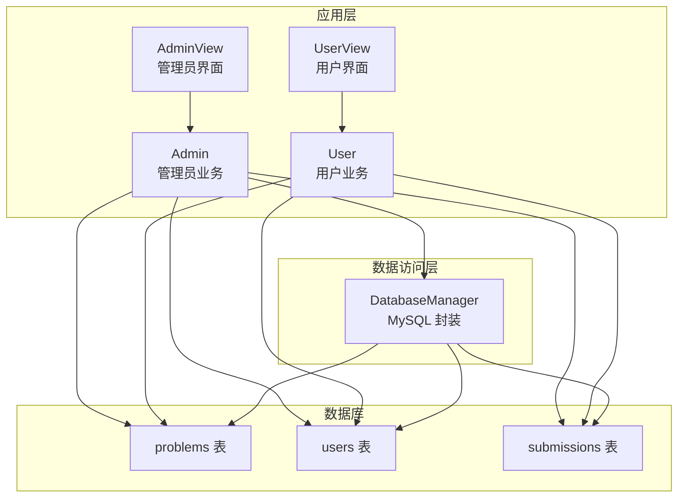
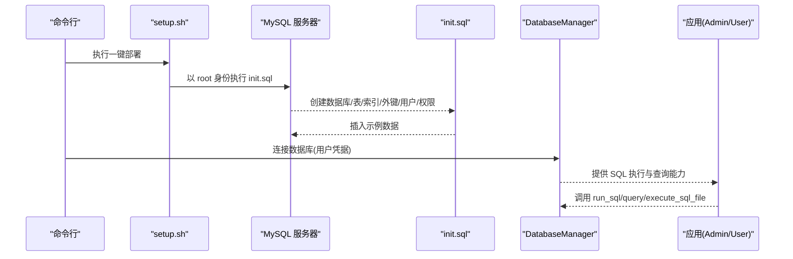
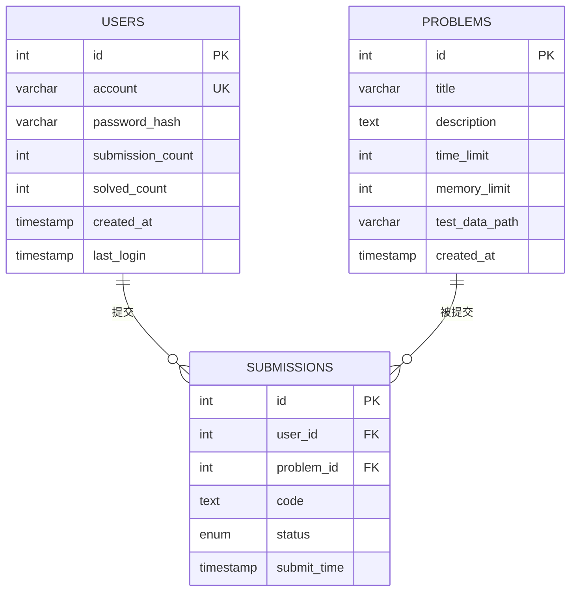
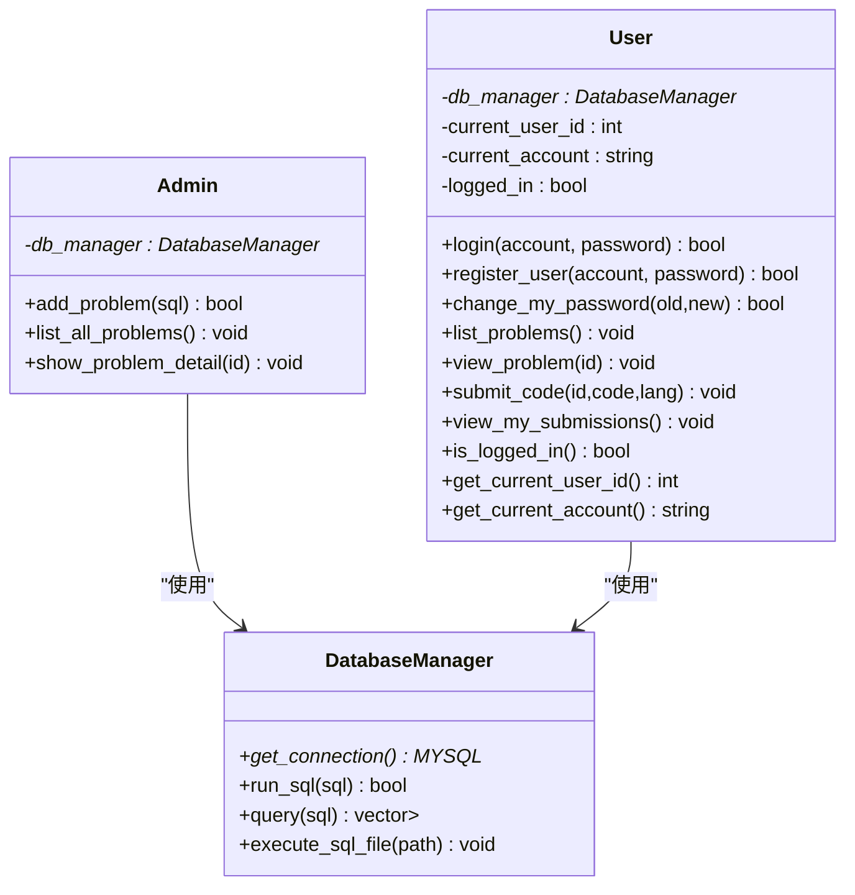
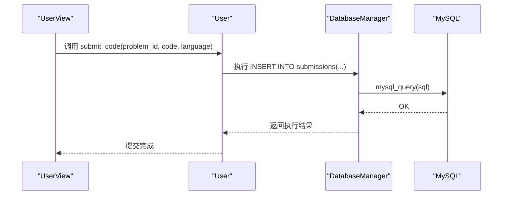

# 数据库设计

<cite>
**本文引用的文件**
- [init.sql](file://init.sql)
- [setup.sh](file://setup.sh)
- [db_manager.h](file://include/db_manager.h)
- [db_manager.cpp](file://src/db_manager.cpp)
- [admin.h](file://include/admin.h)
- [user.h](file://include/user.h)
- [admin.cpp](file://src/admin.cpp)
- [user.cpp](file://src/user.cpp)
- [OJ_v0.1.md](file://History/OJ_v0.1.md)
</cite>

## 更新摘要
**所做更改**
- 完善了init.sql创建的完整数据库架构说明
- 更新了表结构、索引策略和外键约束的详细分析
- 增强了数据库初始化脚本的执行说明和权限配置
- 补充了DatabaseManager类的详细功能说明
- 更新了用户模式的当前实现状态和未来规划

## 目录
1. [简介](#简介)
2. [项目结构](#项目结构)
3. [核心组件](#核心组件)
4. [架构总览](#架构总览)
5. [详细组件分析](#详细组件分析)
6. [依赖分析](#依赖分析)
7. [性能考量](#性能考量)
8. [故障排查指南](#故障排查指南)
9. [结论](#结论)
10. [附录](#附录)

## 简介
本文件面向数据库管理员与开发者，系统性梳理 OJ 在线判题系统 v0.1 的数据库设计。内容涵盖表结构、字段定义与数据类型选择、约束与索引、表间关系与外键约束、数据完整性保障机制、初始化脚本与执行说明、数据模型与 ER 图、数据访问模式与查询优化策略、性能考虑以及数据迁移与版本管理建议。文中所有技术细节均以仓库现有文件为依据，并通过"章节来源"与"图表来源"进行溯源。

## 项目结构
- 数据库初始化脚本：init.sql
- 数据库访问层：DatabaseManager（封装 MySQL 连接与 SQL 执行）
- 业务视图层：AdminView、UserView（分别驱动管理员与用户模式）
- 业务逻辑层：Admin、User（调用 DatabaseManager 执行 SQL）
- 文档与部署：OJ_v0.1.md（含表结构说明）、setup.sh（一键部署脚本）

**图表来源**
- [db_manager.h:12-51](file://include/db_manager.h#L12-L51)
- [db_manager.cpp:8-124](file://src/db_manager.cpp#L8-L124)
- [admin.h:10-36](file://include/admin.h#L10-L36)
- [user.h:10-86](file://include/user.h#L10-L86)

**章节来源**
- [OJ_v0.1.md:13-65](file://History/OJ_v0.1.md#L13-L65)
- [setup.sh:1-41](file://setup.sh#L1-L41)

## 核心组件
- DatabaseManager：封装 MySQL 连接、执行 SQL 与批量执行 SQL 文件的能力，提供查询结果结构化返回。
- Admin：通过 SQL 方式发布题目、列出题目、查看题目详情。
- User：提供登录、注册、修改密码、查看题目、提交代码、查看提交记录等能力（当前实现为占位，后续版本将接入数据库）。
- 表结构：problems、users、submissions，构成判题系统的核心数据模型。

**章节来源**
- [db_manager.h:12-51](file://include/db_manager.h#L12-L51)
- [db_manager.cpp:22-101](file://src/db_manager.cpp#L22-L101)
- [admin.h:10-36](file://include/admin.h#L10-L36)
- [user.h:10-86](file://include/user.h#L10-L86)

## 架构总览
- 应用通过 AdminView/UserView 与业务层 Admin/User 交互；Admin/User 通过 DatabaseManager 访问 MySQL。
- 初始化脚本 init.sql 负责创建数据库、表、索引、外键、数据库用户与权限，并插入示例数据。
- setup.sh 提供一键部署流程，自动创建目录并执行初始化脚本。

**图表来源**
- [setup.sh:14-29](file://setup.sh#L14-L29)
- [init.sql:8-96](file://init.sql#L8-L96)
- [db_manager.cpp:105-124](file://src/db_manager.cpp#L105-L124)

## 详细组件分析

### Problems 表（题目表）
- 字段与含义
  - id：自增主键，唯一标识题目。
  - title：题目标题，非空。
  - description：题目描述，文本类型。
  - time_limit：时间限制（毫秒），整型。
  - memory_limit：内存限制（MB），整型。
  - test_data_path：测试数据在宿主机上的路径，字符串。
  - created_at：创建时间，默认当前时间戳。
- 约束与索引
  - 主键：id。
  - 无显式唯一约束（title 未声明 UNIQUE）。
- 数据类型选择理由
  - title 使用较长长度的可变字符串，满足题目命名需求。
  - time_limit/memory_limit 使用整型，便于比较与排序。
  - test_data_path 使用适中长度字符串，便于存储路径。
  - created_at 使用时间戳，便于统计与排序。
- 设计建议
  - 可考虑对 title 添加唯一性约束，避免重复题目名。
  - 可增加索引以优化按时间范围、限制条件的查询。

**章节来源**
- [init.sql:15-23](file://init.sql#L15-L23)
- [OJ_v0.1.md:217-229](file://History/OJ_v0.1.md#L217-L229)

### Users 表（用户表）
- 字段与含义
  - id：自增主键，内部使用。
  - account：登录账号，唯一且非空。
  - password_hash：密码哈希（SHA256），非空。
  - submission_count：提交题目数量，默认 0。
  - solved_count：解决题目数量，默认 0。
  - created_at：注册时间，默认当前时间戳。
  - last_login：最后登录时间，允许为空。
- 约束与索引
  - 主键：id。
  - 唯一约束：account。
  - 索引：idx_account（account）、idx_created_at（created_at）。
- 数据类型选择理由
  - account 使用较短长度字符串，兼顾唯一性与存储效率。
  - password_hash 使用足够长度字符串，满足哈希存储需求。
  - submission_count/solved_count 使用整型，便于统计。
  - created_at/last_login 使用时间戳，便于审计与统计。
- 设计建议
  - 可考虑为 last_login 建立索引，优化登录统计与活跃度分析。
  - 可增加 account 的二进制排序规则（collation）以提升大小写敏感场景下的匹配性能。

**章节来源**
- [init.sql:27-38](file://init.sql#L27-L38)
- [OJ_v0.1.md:231-245](file://History/OJ_v0.1.md#L231-L245)

### Submissions 表（提交记录表）
- 字段与含义
  - id：自增主键，唯一标识提交记录。
  - user_id：提交用户 ID，非空。
  - problem_id：题目 ID，非空。
  - code：提交的代码，文本类型。
  - status：评测状态，枚举类型，默认 Pending。
  - submit_time：提交时间，默认当前时间戳。
- 约束与索引
  - 主键：id。
  - 外键：user_id 引用 users.id；problem_id 引用 problems.id。
  - 索引：idx_user_id（user_id）、idx_problem_id（problem_id）。
- 数据类型选择理由
  - user_id/problem_id 使用整型，便于关联与索引。
  - code 使用文本类型，满足代码长度需求。
  - status 使用枚举类型，保证状态值的规范性与一致性。
  - submit_time 使用时间戳，便于排序与统计。
- 设计建议
  - 可考虑为 status 建立索引，优化按状态筛选与统计。
  - 可考虑为 submit_time 建立索引，优化按时间维度的查询。

**章节来源**
- [init.sql:41-60](file://init.sql#L41-L60)
- [OJ_v0.1.md:247-262](file://History/OJ_v0.1.md#L247-L262)

### 表间关系与外键约束
- 关系
  - users 与 submissions：一对多（一个用户可有多条提交记录）。
  - problems 与 submissions：一对多（一个题目可被多次提交）。
- 外键约束
  - submissions.user_id → users.id
  - submissions.problem_id → problems.id
- 数据完整性保障机制
  - 外键约束确保引用完整性，防止悬挂引用。
  - 唯一约束（users.account）确保账号唯一性。
  - 非空约束（problmes.title、users.account、users.password_hash、submissions.user_id、submissions.problem_id）保证关键字段必填。
  - 枚举约束（submissions.status）保证状态值合法。

**图表来源**
- [init.sql:15-60](file://init.sql#L15-L60)

**章节来源**
- [init.sql:15-60](file://init.sql#L15-L60)
- [OJ_v0.1.md:215-262](file://History/OJ_v0.1.md#L215-L262)

### 数据库初始化脚本与执行说明
- 脚本功能
  - 创建数据库 OJ（字符集 utf8mb4，排序规则 utf8mb4_unicode_ci）。
  - 创建三张表：problems、users、submissions。
  - 建立索引与外键约束。
  - 配置 MySQL 密码策略（低策略、最小长度）。
  - 创建数据库用户：oj_admin（全权限）、oj_user（受限权限）。
  - 插入示例数据：一条题目、一个平台用户。
  - 输出完成提示与示例用户信息。
- 执行方式
  - 命令行：以 root 身份执行 init.sql。
  - 一键部署：setup.sh 自动创建目录并执行初始化脚本。
- 权限说明
  - oj_admin：对 OJ.* 具有 SELECT/INSERT/UPDATE/DELETE 权限。
  - oj_user：对 problems 具有 SELECT 权限；对 users 具有 SELECT 与 UPDATE(account, password_hash) 权限；对 submissions 具有 SELECT/INSERT 权限。
- 示例数据
  - 题目：A+B Problem，包含时间/内存限制与测试数据路径。
  - 用户：test_user，密码为 123456（SHA256 哈希）。

**章节来源**
- [init.sql:1-143](file://init.sql#L1-L143)
- [setup.sh:14-29](file://setup.sh#L14-L29)
- [OJ_v0.1.md:266-272](file://History/OJ_v0.1.md#L266-L272)
- [OJ_v0.1.md:355-378](file://History/OJ_v0.1.md#L355-L378)

### 数据访问模式与查询优化策略
- 访问模式
  - 管理员：通过 Admin 类调用 DatabaseManager 执行 SQL，实现题目发布、列表与详情查看。
  - 用户：通过 User 类调用 DatabaseManager 执行 SQL，实现登录、注册、修改密码、查看题目、提交代码、查看提交记录（当前为占位，后续版本将接入数据库）。
- 查询优化建议
  - 对 users.account 建立索引（已存在）。
  - 对 users.created_at 建立索引（已存在）。
  - 对 submissions.user_id、submissions.problem_id 建立索引（已存在）。
  - 对 submissions.status 建立索引，优化按状态筛选。
  - 对 submissions.submit_time 建立索引，优化按时间维度查询。
  - 对 problems.title 建立唯一索引，避免重复题目名。
  - 使用 EXPLAIN 分析复杂查询计划，避免全表扫描。
  - 控制查询字段数量，避免 SELECT *。
  - 合理使用 LIMIT，避免一次性返回过多数据。
- 安全与隔离
  - 应用层通过 WHERE id = current_user_id 实现行级隔离，避免越权访问。
  - 数据库用户 oj_user 仅授予必要权限，遵循最小权限原则。

**章节来源**
- [db_manager.h:12-51](file://include/db_manager.h#L12-L51)
- [db_manager.cpp:22-101](file://src/db_manager.cpp#L22-L101)
- [OJ_v0.1.md:266-272](file://History/OJ_v0.1.md#L266-L272)

### 性能考虑
- 存储引擎
  - 采用 InnoDB，支持事务、外键与行级锁，适合并发读写场景。
- 字符集与排序规则
  - 数据库与表使用 utf8mb4_unicode_ci，支持更广泛的字符集与排序规则。
- 索引策略
  - 已为关键字段建立索引，建议根据实际查询模式补充索引。
- 连接与资源管理
  - DatabaseManager 在析构时关闭连接，避免资源泄漏。
- 批量执行
  - 支持从文件批量执行 SQL，便于初始化与迁移。

**章节来源**
- [init.sql:8-23](file://init.sql#L8-L23)
- [db_manager.cpp:13-20](file://src/db_manager.cpp#L13-L20)

### 故障排查指南
- 连接失败
  - 检查 MySQL 服务是否启动，确认凭据正确。
  - 使用 DatabaseManager 的连接函数进行诊断输出。
- 权限不足
  - 确认使用的数据库用户具备相应权限。
  - 检查 init.sql 中的授权语句是否执行成功。
- 外键约束冲突
  - 插入 submissions 时，确保 user_id 与 problem_id 对应的记录存在。
- 初始化失败
  - 使用 setup.sh 或手动执行 init.sql，确认 root 密码正确。
  - 检查 MySQL 版本与密码策略配置。

**章节来源**
- [db_manager.cpp:105-124](file://src/db_manager.cpp#L105-L124)
- [init.sql:62-96](file://init.sql#L62-L96)
- [setup.sh:18-25](file://setup.sh#L18-L25)

## 依赖分析
- 组件耦合
  - Admin/User 依赖 DatabaseManager 提供的 SQL 执行能力。
  - DatabaseManager 依赖 MySQL C API。
  - AdminView/UserView 依赖 Admin/User，间接依赖 DatabaseManager。
- 外部依赖
  - MySQL 服务器与客户端。
  - CMake 构建工具链（用于编译应用）。
- 潜在风险
  - 当前 User/Admin 的数据库交互为占位实现，后续版本需完善 SQL 逻辑与参数绑定，避免 SQL 注入与性能问题。

**图表来源**
- [db_manager.h:12-51](file://include/db_manager.h#L12-L51)
- [admin.h:10-36](file://include/admin.h#L10-L36)
- [user.h:10-86](file://include/user.h#L10-L86)

**章节来源**
- [OJ_v0.1.md:13-65](file://History/OJ_v0.1.md#L13-L65)

## 性能考量
- 索引覆盖
  - 已有索引：users.idx_account、users.idx_created_at、submissions.idx_user_id、submissions.idx_problem_id。
  - 建议新增：submissions.idx_status、submissions.idx_submit_time、problems.idx_title（唯一）。
- 查询计划
  - 使用 EXPLAIN 分析 JOIN、WHERE、ORDER BY、GROUP BY 的执行计划。
- 批量操作
  - 使用 execute_sql_file 批量导入数据，减少网络往返。
- 连接池
  - 当前实现为单连接，高并发场景建议引入连接池与连接复用。

## 故障排查指南
- 连接与权限
  - 确认 init.sql 成功执行，oj_admin 与 oj_user 用户创建成功。
  - 检查 MySQL 密码策略配置是否符合环境要求。
- 外键与唯一性
  - 插入 submissions 前确保 user_id 与 problem_id 存在。
  - 插入 users 时 account 不得重复。
- 初始化脚本
  - 使用 setup.sh 或手动执行 init.sql，确保 root 权限与正确路径。

**章节来源**
- [init.sql:62-96](file://init.sql#L62-L96)
- [setup.sh:18-29](file://setup.sh#L18-L29)

## 结论
本设计以三张核心表为核心，结合外键与索引，构建了清晰的数据模型与完整性保障机制。初始化脚本与一键部署脚本降低了环境搭建门槛。当前业务层对数据库的交互仍处于占位阶段，建议在后续版本中完善 SQL 逻辑、参数绑定与安全校验，同时根据实际查询模式持续优化索引与查询计划，以获得更优的性能与可维护性。

## 附录

### 数据模型图（ER 图）

**图表来源**
- [init.sql:15-60](file://init.sql#L15-L60)

### 表结构与字段定义一览
- problems
  - id：自增主键
  - title：VARCHAR(255)，NOT NULL
  - description：TEXT
  - time_limit：INT
  - memory_limit：INT
  - test_data_path：VARCHAR(256)
  - created_at：TIMESTAMP DEFAULT CURRENT_TIMESTAMP
- users
  - id：自增主键
  - account：VARCHAR(50)，UNIQUE NOT NULL
  - password_hash：VARCHAR(255)，NOT NULL
  - submission_count：INT DEFAULT 0
  - solved_count：INT DEFAULT 0
  - created_at：TIMESTAMP DEFAULT CURRENT_TIMESTAMP
  - last_login：TIMESTAMP NULL DEFAULT NULL
  - 索引：idx_account(account)、idx_created_at(created_at)
- submissions
  - id：自增主键
  - user_id：INT NOT NULL
  - problem_id：INT NOT NULL
  - code：TEXT
  - status：ENUM('Pending','AC','WA','TLE','MLE','RE','CE') DEFAULT 'Pending'
  - submit_time：TIMESTAMP DEFAULT CURRENT_TIMESTAMP
  - 外键：user_id → users.id；problem_id → problems.id
  - 索引：idx_user_id(user_id)、idx_problem_id(problem_id)

**章节来源**
- [init.sql:15-60](file://init.sql#L15-L60)
- [OJ_v0.1.md:215-262](file://History/OJ_v0.1.md#L215-L262)

### 数据访问序列（示例：用户提交代码）

**图表来源**
- [user.h:54-59](file://include/user.h#L54-L59)
- [db_manager.cpp:126-175](file://src/db_manager.cpp#L126-L175)

### 数据迁移与版本管理建议
- 版本化
  - 为每个数据库变更创建独立 SQL 文件（如 init_v0.1.sql、alter_v0.2.sql），并在文档中标注版本与变更内容。
- 兼容性
  - 迁移脚本应包含回滚方案与前置检查（如 NOT EXISTS）。
- 权限与安全
  - 迁移后重新评估并调整数据库用户权限，遵循最小权限原则。
- 验证
  - 迁移完成后执行关键查询与统计，确保数据一致性与完整性。

### DatabaseManager 类详细分析
DatabaseManager 是整个应用的数据库访问核心，提供了完整的数据库连接、查询和文件执行能力：

- **连接管理**：构造函数接受主机、用户名、密码和数据库名参数，使用 MySQL C API 建立连接
- **SQL 执行**：run_sql 方法执行任意 SQL 语句并打印结果，适合管理员操作
- **查询处理**：query 方法执行查询并返回结构化的结果集，每行是一个列名到值的映射
- **批量执行**：execute_sql_file 方法从文件读取并执行多条 SQL 语句，支持初始化脚本执行
- **资源管理**：析构函数自动关闭连接，防止资源泄漏

**章节来源**
- [db_manager.h:12-51](file://include/db_manager.h#L12-L51)
- [db_manager.cpp:8-176](file://src/db_manager.cpp#L8-L176)

### 用户模式当前实现状态
用户模式目前仍处于占位实现阶段，主要功能包括：
- 登录和注册：当前为临时实现，直接设置用户状态而非数据库验证
- 题目浏览：待实现数据库查询功能
- 代码提交：待实现数据库持久化和评测集成
- 提交记录：待实现数据库查询功能

这些功能将在后续版本中逐步完善，与数据库进行深度集成。

**章节来源**
- [user.cpp:6-86](file://src/user.cpp#L6-L86)
- [OJ_v0.1.md:345-352](file://History/OJ_v0.1.md#L345-L352)