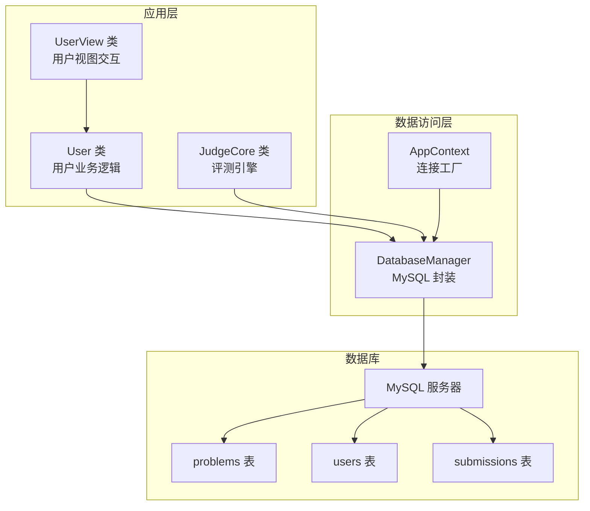
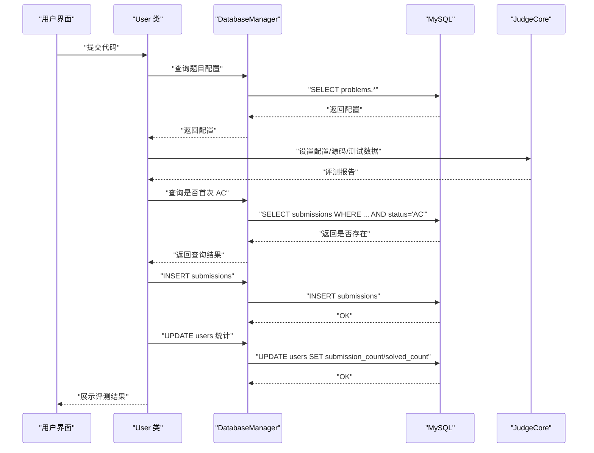
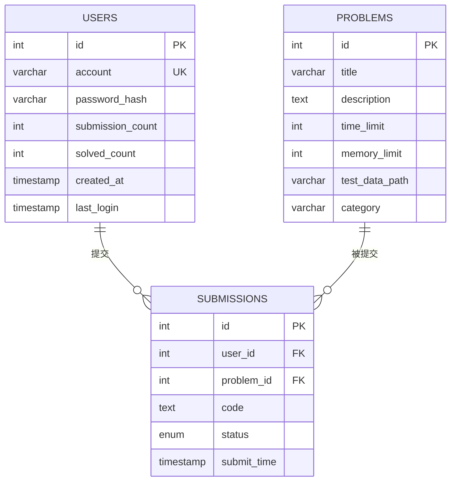
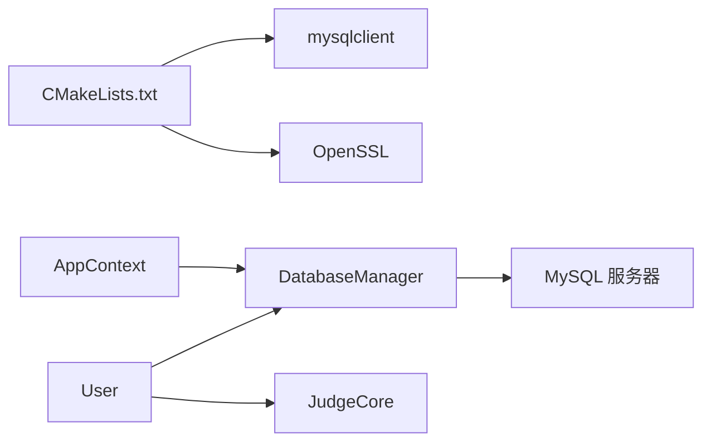

# 数据库设计

<cite>
**本文引用的文件**
- [init.sql](file://init.sql)
- [db_manager.h](file://include/db_manager.h)
- [db_manager.cpp](file://src/db_manager.cpp)
- [app_context.h](file://include/app_context.h)
- [app_context.cpp](file://src/app_context.cpp)
- [user.h](file://include/user.h)
- [user.cpp](file://src/user.cpp)
- [CMakeLists.txt](file://CMakeLists.txt)
- [docker-compose.yml](file://docker-compose.yml)
- [code_submission_design.md](file://docs/code_submission_design.md)
- [judge_core.h](file://include/judge_core.h)
</cite>

## 目录
1. [简介](#简介)
2. [项目结构](#项目结构)
3. [核心组件](#核心组件)
4. [架构总览](#架构总览)
5. [详细组件分析](#详细组件分析)
6. [依赖分析](#依赖分析)
7. [性能考量](#性能考量)
8. [故障排查指南](#故障排查指南)
9. [结论](#结论)
10. [附录](#附录)

## 简介
本文件系统化梳理 OJ 系统的数据库设计，涵盖整体架构、表结构与关系模型、字段定义与约束、索引策略、连接与权限管理、事务与并发控制、数据访问层设计模式、ORM 映射与查询优化、SQL 脚本说明、迁移与备份恢复策略，以及性能优化、安全防护与扩展性考虑，并提供具体查询示例与数据操作指南。

## 项目结构
- 数据库初始化与权限：通过初始化脚本创建数据库、表、用户与权限。
- 数据访问层：封装 MySQL 连接与 SQL 执行，提供查询与转义能力。
- 应用上下文：集中管理数据库连接（管理员与受限用户两种角色）。
- 业务模块：用户登录/注册/改密、题目浏览、提交评测、提交记录查看与历史管理。
- 评测引擎：与数据库协同，将评测结果写回提交表并更新用户统计。

图表来源
- [app_context.cpp:5-15](file://src/app_context.cpp#L5-L15)
- [db_manager.cpp:9-20](file://src/db_manager.cpp#L9-L20)
- [user.cpp:12-12](file://src/user.cpp#L12-L12)
- [init.sql:14-61](file://init.sql#L14-L61)

章节来源
- [docker-compose.yml:15-40](file://docker-compose.yml#L15-L40)
- [CMakeLists.txt:11-34](file://CMakeLists.txt#L11-L34)

## 核心组件
- DatabaseManager：封装 MySQL 连接、SQL 执行、查询结果解析与字符串转义，提供 run_sql、query、escape_string。
- AppContext：提供管理员与受限用户两类连接工厂，分别对应不同权限的数据库用户。
- User：封装用户认证、注册、改密、题目浏览、提交评测、提交记录查看等业务逻辑，内部使用 DatabaseManager。
- 初始化脚本：创建数据库、表、用户与权限，并注入示例数据。

章节来源
- [db_manager.h:11-46](file://include/db_manager.h#L11-L46)
- [db_manager.cpp:9-107](file://src/db_manager.cpp#L9-L107)
- [app_context.h:15-32](file://include/app_context.h#L15-L32)
- [app_context.cpp:5-15](file://src/app_context.cpp#L5-L15)
- [user.h:10-77](file://include/user.h#L10-L77)
- [user.cpp:12-514](file://src/user.cpp#L12-L514)
- [init.sql:8-95](file://init.sql#L8-L95)

## 架构总览
- 连接管理：通过 AppContext 统一创建连接，区分管理员与受限用户；受限用户复用同一数据库账号，行级隔离由应用层在 SQL 中强制实现。
- 权限模型：oj_admin 拥有全权限；oj_user 仅授予对 problems 的只读、对 users 的插入/查询/更新、对 submissions 的插入/查询。
- 数据一致性：提交评测流程中，先查询是否首次 AC，再写入 submissions，随后原子性地更新用户统计，保证计数正确。
- 安全边界：AI 侧仅读取题目信息与提交统计，不直接访问数据库，避免越权与注入风险。

图表来源
- [user.cpp:269-452](file://src/user.cpp#L269-L452)
- [db_manager.cpp:54-85](file://src/db_manager.cpp#L54-L85)
- [judge_core.h:60-101](file://include/judge_core.h#L60-L101)

## 详细组件分析

### 数据库整体架构与表关系模型
- 数据库：OJ，字符集 utf8mb4，排序规则 utf8mb4_unicode_ci。
- 表：
  - problems：题目元信息与测试数据路径。
  - users：平台用户信息（不含数据库用户），包含登录统计与最后登录时间。
  - submissions：提交记录，包含代码与评测状态，外键关联 users 与 problems。
- 关系：
  - users 与 submissions：一对多（一个用户可有多次提交）。
  - problems 与 submissions：一对多（一个题目可被多次提交）。
- 索引：
  - users：idx_account、idx_created_at。
  - submissions：idx_user_id、idx_problem_id。

图表来源
- [init.sql:14-61](file://init.sql#L14-L61)

章节来源
- [init.sql:8-95](file://init.sql#L8-L95)

### 字段定义、约束与索引策略
- problems
  - id：自增主键。
  - title：非空，题目标题。
  - description：文本描述。
  - time_limit：毫秒，时间限制。
  - memory_limit：MB，内存限制。
  - test_data_path：测试数据绝对路径。
  - category：题目类型。
- users
  - id：自增主键。
  - account：唯一、非空，登录账号。
  - password_hash：非空，SHA256 哈希。
  - submission_count/solved_count：默认 0，用于统计。
  - created_at：注册时间，默认当前时间。
  - last_login：最后登录时间，可空。
  - idx_account、idx_created_at：加速登录与注册时间查询。
- submissions
  - id：自增主键。
  - user_id、problem_id：外键，非空。
  - code：提交代码文本。
  - status：枚举，初始 Pending。
  - submit_time：默认当前时间。
  - idx_user_id、idx_problem_id：加速按用户与题目维度查询。

章节来源
- [init.sql:14-61](file://init.sql#L14-L61)

### 连接管理与权限控制
- 连接工厂：AppContext 提供 createAdminDB 与 createUserDB，分别连接 oj_admin 与 oj_user。
- 权限分配：
  - oj_admin：对 OJ.* 具备 SELECT/INSERT/UPDATE/DELETE。
  - oj_user：problems 只读；users 允许 SELECT/INSERT/UPDATE；submissions 允许 SELECT/INSERT。
- 行级隔离：应用层在涉及用户数据的查询中强制添加 WHERE id = current_user_id，确保数据隔离。

章节来源
- [app_context.cpp:5-15](file://src/app_context.cpp#L5-L15)
- [init.sql:68-95](file://init.sql#L68-L95)
- [user.cpp:456-470](file://src/user.cpp#L456-L470)

### 事务处理与并发控制
- 事务语义：当前实现未显式开启事务块，采用多步 SQL 串行执行。提交评测流程包含“查询是否首次 AC”、“写入 submissions”、“更新用户统计”，若中间失败可能导致统计与记录不一致。
- 建议：
  - 将“查询是否首次 AC + INSERT submissions + UPDATE users”放入单个事务，确保原子性。
  - 使用合适的隔离级别（默认可读已提交）以平衡一致性与并发性能。
  - 对 users.solved_count 与 users.submission_count 的更新应串行化，避免竞态。

章节来源
- [user.cpp:362-410](file://src/user.cpp#L362-L410)

### 数据访问层设计模式与 ORM 映射
- 设计模式：DatabaseManager 采用简单封装模式，提供 run_sql、query、escape_string，屏蔽底层 MySQL C API。
- ORM 映射：未使用 ORM 框架，采用“手动映射”：query 返回 vector<map<string,string>>，调用方自行解析列名与值。
- 安全：提供 escape_string，用于防 SQL 注入；同时建议配合参数化查询（如预处理语句）进一步提升安全性。

章节来源
- [db_manager.h:11-46](file://include/db_manager.h#L11-L46)
- [db_manager.cpp:22-85](file://src/db_manager.cpp#L22-L85)

### 查询优化策略
- 索引利用：
  - users.idx_account 与 idx_created_at：登录、注册时间筛选。
  - submissions.idx_user_id 与 idx_problem_id：按用户与题目维度查询提交记录。
- 查询模式：
  - 登录/注册：基于 account 唯一键查询。
  - 提交记录：JOIN problems，按 submit_time DESC 限制数量。
  - 首次 AC 判定：LIMIT 1，减少扫描。
- 建议：
  - 为 users.account 添加唯一索引（已定义唯一约束，通常隐含唯一索引）。
  - 为 submissions.submit_time 添加索引以优化分页与时间范围查询。
  - 对高频组合查询（如 user_id+problem_id）考虑复合索引。

章节来源
- [init.sql:36-61](file://init.sql#L36-L61)
- [user.cpp:456-470](file://src/user.cpp#L456-L470)

### SQL 脚本说明
- 初始化脚本包含：
  - 创建数据库与表。
  - 配置 MySQL 密码策略（低强度策略，便于演示）。
  - 创建 oj_admin 与 oj_user，并授予相应权限。
  - 插入示例题目与示例用户。
- Docker 环境：通过 docker-entrypoint-initdb.d 自动执行初始化脚本。

章节来源
- [init.sql:1-278](file://init.sql#L1-L278)
- [docker-compose.yml:27-31](file://docker-compose.yml#L27-L31)

### 数据迁移方案
- 结构迁移：
  - 增量 DDL：在现有表结构基础上新增索引或列，使用 ALTER TABLE。
  - 表重建：如需调整列类型或增加复杂约束，建议离线窗口执行，先备份再导入。
- 数据迁移：
  - 使用 mysqldump 导出/导入，或通过批量 INSERT/UPDATE。
  - 迁移前校验数据完整性（唯一性、外键一致性）。
- 权限迁移：
  - 重新执行授权脚本，或导出 GRANTS 并在目标库导入。

章节来源
- [init.sql:63-95](file://init.sql#L63-L95)

### 备份与恢复策略
- 备份：
  - 全量备份：mysqldump -u root -p OJ > backup.sql。
  - 增量备份：结合 binlog 或定期快照。
- 恢复：
  - 恢复到指定时间点：基于全量 + binlog。
  - 容器化部署：通过 oj-db-data 卷持久化，更换卷或容器即可恢复。
- 健康检查：compose 中包含健康检查，确保数据库可用。

章节来源
- [docker-compose.yml:32-37](file://docker-compose.yml#L32-L37)

### 查询示例与数据操作指南
- 登录
  - SELECT users WHERE account = ?；比较 password_hash。
- 注册
  - INSERT users(account, password_hash)；重复账号检查。
- 修改密码
  - UPDATE users SET password_hash = ? WHERE id = ?。
- 查看题目列表
  - SELECT problems ORDER BY id。
- 查看题目详情
  - SELECT problems WHERE id = ?。
- 提交代码
  - INSERT submissions(user_id, problem_id, code, status)；随后 UPDATE users 统计。
- 查看我的提交
  - JOIN submissions s JOIN problems p ON s.problem_id = p.id WHERE s.user_id = ? ORDER BY s.submit_time DESC LIMIT 20。
- 获取最近提交代码
  - SELECT code FROM submissions WHERE user_id = ? AND problem_id = ? ORDER BY submit_time DESC LIMIT 1。

章节来源
- [user.cpp:40-142](file://src/user.cpp#L40-L142)
- [user.cpp:144-267](file://src/user.cpp#L144-L267)
- [user.cpp:269-452](file://src/user.cpp#L269-L452)
- [code_submission_design.md:428-436](file://docs/code_submission_design.md#L428-L436)

## 依赖分析
- 编译依赖：CMake 通过 pkg-config 查找 mysqlclient，并链接 OpenSSL。
- 运行依赖：容器内 MySQL 8.0，utf8mb4 字符集与排序规则。
- 连接依赖：AppContext 依赖 DatabaseManager；User 依赖 DatabaseManager 与 JudgeCore。

图表来源
- [CMakeLists.txt:11-34](file://CMakeLists.txt#L11-L34)
- [app_context.h:4-4](file://include/app_context.h#L4-L4)
- [db_manager.h:4-4](file://include/db_manager.h#L4-L4)
- [user.h:4-5](file://include/user.h#L4-L5)

章节来源
- [CMakeLists.txt:11-34](file://CMakeLists.txt#L11-L34)
- [docker-compose.yml:15-40](file://docker-compose.yml#L15-L40)

## 性能考量
- 连接池：当前实现为一次性连接，建议引入连接池以降低连接开销与提高并发。
- 查询优化：为高频查询建立合适索引；避免 SELECT *，仅取必要列。
- 事务优化：将关键写操作放入事务，减少锁竞争。
- 评测吞吐：评测引擎与数据库分离，避免阻塞数据库连接；可考虑异步写入提交记录。
- 缓存：对只读表（problems）可引入应用层缓存，降低热点查询压力。

## 故障排查指南
- 连接失败
  - 检查 AppContext 中的主机、用户名、密码与数据库名。
  - 确认 MySQL 服务健康与端口可达。
- 权限不足
  - 确认 oj_user 对 users/submissions 的 INSERT/SELECT 权限。
  - 确认 oj_admin 对 OJ.* 的全权限。
- 登录/注册异常
  - 核对 account 唯一性与 password_hash 计算（SHA256）。
- 提交统计不一致
  - 检查是否在事务中执行“查询是否首次 AC + INSERT + UPDATE”。

章节来源
- [app_context.cpp:5-15](file://src/app_context.cpp#L5-L15)
- [init.sql:68-95](file://init.sql#L68-L95)
- [user.cpp:40-142](file://src/user.cpp#L40-L142)
- [user.cpp:362-410](file://src/user.cpp#L362-L410)

## 结论
本数据库设计围绕用户、题目、提交三大核心实体构建，采用行级隔离与最小权限原则，结合应用层的查询与更新策略，实现了基本的在线评测功能。建议后续引入事务、连接池与缓存，完善索引与查询优化，以提升一致性、性能与可维护性。

## 附录
- 初始化脚本与示例数据：见 init.sql。
- Docker 编排与健康检查：见 docker-compose.yml。
- 查询与历史管理设计：见 docs/code_submission_design.md。