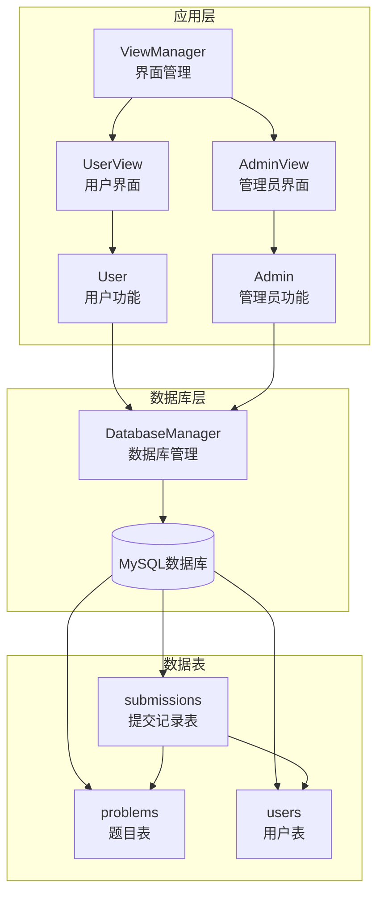
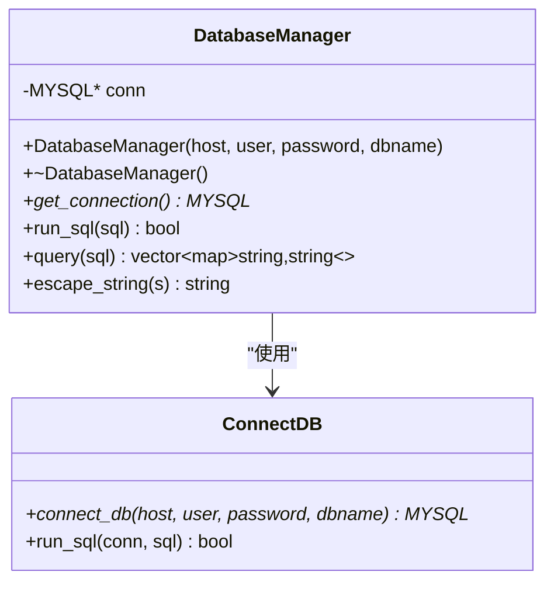
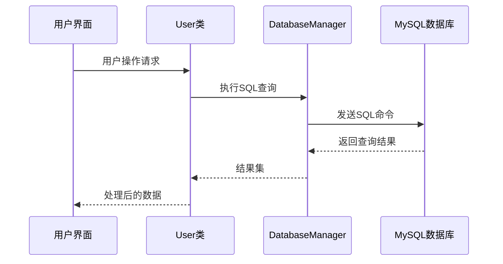
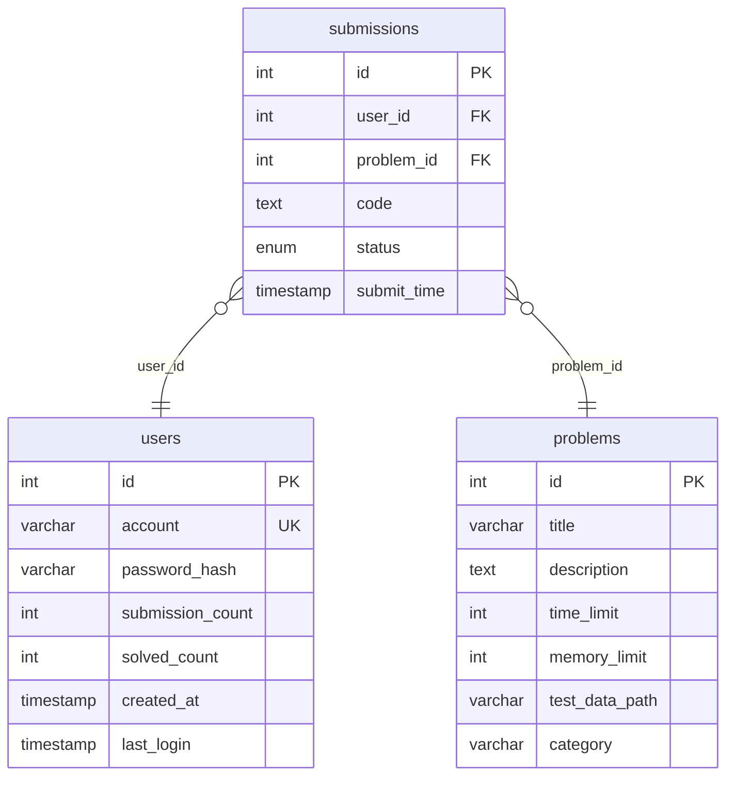
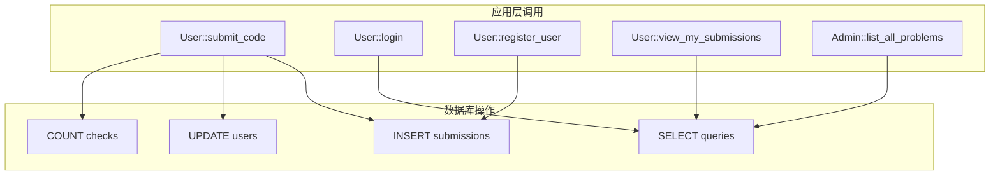

# 数据库表结构

<cite>
**本文档引用的文件**
- [init.sql](file://init.sql)
- [db_manager.h](file://include/db_manager.h)
- [db_manager.cpp](file://src/db_manager.cpp)
- [user.cpp](file://src/user.cpp)
- [admin.cpp](file://src/admin.cpp)
- [view_manager.cpp](file://src/view_manager.cpp)
- [OJ_v0.1.md](file://History/OJ_v0.1.md)
</cite>

## 目录
1. [简介](#简介)
2. [项目结构](#项目结构)
3. [核心组件](#核心组件)
4. [架构概览](#架构概览)
5. [详细组件分析](#详细组件分析)
6. [依赖关系分析](#依赖关系分析)
7. [性能考虑](#性能考虑)
8. [故障排除指南](#故障排除指南)
9. [结论](#结论)

## 简介

本文档详细说明了OJ在线评测系统的数据库表结构设计。系统采用MySQL作为后端数据库，包含三个核心表：problems（题目表）、users（用户表）和submissions（提交记录表）。这些表通过外键关系相互关联，形成了完整的在线评测系统数据模型。

## 项目结构

OJ系统采用分层架构设计，数据库层通过专门的管理类进行封装，应用层通过接口调用数据库功能。

**图表来源**
- [view_manager.cpp:32-70](file://src/view_manager.cpp#L32-L70)
- [db_manager.h:12-53](file://include/db_manager.h#L12-L53)
- [init.sql:14-61](file://init.sql#L14-L61)

**章节来源**
- [view_manager.cpp:1-77](file://src/view_manager.cpp#L1-L77)
- [db_manager.h:1-60](file://include/db_manager.h#L1-L60)

## 核心组件

### 数据库管理器（DatabaseManager）

DatabaseManager类提供了统一的数据库连接管理和SQL执行接口，封装了MySQL C API的复杂性。

**图表来源**
- [db_manager.h:12-53](file://include/db_manager.h#L12-L53)
- [db_manager.cpp:9-89](file://src/db_manager.cpp#L9-L89)

**章节来源**
- [db_manager.h:9-59](file://include/db_manager.h#L9-L59)
- [db_manager.cpp:1-110](file://src/db_manager.cpp#L1-L110)

## 架构概览

系统采用三层架构：界面层、业务逻辑层和数据访问层。数据库层通过DatabaseManager类提供统一的数据访问接口。

**图表来源**
- [user.cpp:360-439](file://src/user.cpp#L360-L439)
- [db_manager.cpp:36-67](file://src/db_manager.cpp#L36-L67)

## 详细组件分析

### problems表（题目表）

problems表存储系统中的所有题目信息，是评测系统的核心数据表之一。

#### 表结构定义

| 字段名 | 数据类型 | 约束条件 | 默认值 | 注释 |
|--------|----------|----------|--------|------|
| id | INT | PRIMARY KEY, AUTO_INCREMENT | 无 | 题目ID，主键 |
| title | VARCHAR(255) | NOT NULL | 无 | 题目标题 |
| description | TEXT | NULL | NULL | 题目描述 |
| time_limit | INT | NULL | NULL | 时间限制（毫秒） |
| memory_limit | INT | NULL | NULL | 内存限制（MB） |
| test_data_path | VARCHAR(256) | NULL | NULL | 测试数据路径 |
| category | VARCHAR(50) | NULL | NULL | 题目类型分类 |

#### 字段详细说明

**id字段**
- 类型：INT
- 约束：PRIMARY KEY, AUTO_INCREMENT
- 作用：唯一标识每个题目，作为主键使用
- 取值范围：自增整数

**title字段**
- 类型：VARCHAR(255)
- 约束：NOT NULL
- 作用：存储题目的显示名称
- 取值范围：1-255字符

**description字段**
- 类型：TEXT
- 约束：NULL
- 作用：存储题目的详细描述信息
- 取值范围：任意文本内容

**time_limit字段**
- 类型：INT
- 约束：NULL
- 作用：定义程序运行的时间限制（毫秒）
- 取值范围：正整数
- 典型值：1000ms（1秒）

**memory_limit字段**
- 类型：INT
- 约束：NULL
- 作用：定义程序运行的内存限制（MB）
- 取值范围：正整数
- 典型值：128MB

**test_data_path字段**
- 类型：VARCHAR(256)
- 约束：NULL
- 作用：存储测试数据在服务器上的物理路径
- 取值范围：有效的文件系统路径

**category字段**
- 类型：VARCHAR(50)
- 约束：NULL
- 作用：题目所属的知识点或算法类别
- 取值范围：字符串标签

#### 索引设计

- 主键索引：PRIMARY KEY (id)
- 无额外索引

#### 业务含义

problems表是评测系统的基础数据表，存储了所有题目的基本信息和评测参数。系统通过这个表获取题目的时间限制、内存限制等关键参数，用于后续的代码评测过程。

**章节来源**
- [init.sql:14-24](file://init.sql#L14-L24)
- [user.cpp:276-296](file://src/user.cpp#L276-L296)

### users表（用户表）

users表存储平台用户的账户信息和统计数据，是用户认证和权限管理的基础。

#### 表结构定义

| 字段名 | 数据类型 | 约束条件 | 默认值 | 注释 |
|--------|----------|----------|--------|------|
| id | INT | PRIMARY KEY, AUTO_INCREMENT | 无 | 用户ID，主键 |
| account | VARCHAR(50) | UNIQUE, NOT NULL | 无 | 用户登录账号 |
| password_hash | VARCHAR(255) | NOT NULL | 无 | SHA256密码哈希值 |
| submission_count | INT | NULL | 0 | 总提交次数 |
| solved_count | INT | NULL | 0 | 解决题目数量 |
| created_at | TIMESTAMP | NULL | CURRENT_TIMESTAMP | 注册时间 |
| last_login | TIMESTAMP | NULL | NULL | 最后登录时间 |

#### 字段详细说明

**id字段**
- 类型：INT
- 约束：PRIMARY KEY, AUTO_INCREMENT
- 作用：唯一标识每个用户，作为主键使用
- 取值范围：自增整数

**account字段**
- 类型：VARCHAR(50)
- 约束：UNIQUE, NOT NULL
- 作用：用户登录使用的账号名称
- 取值范围：1-50字符，必须唯一

**password_hash字段**
- 类型：VARCHAR(255)
- 约束：NOT NULL
- 作用：存储用户密码的SHA256哈希值
- 取值范围：64字符十六进制字符串

**submission_count字段**
- 类型：INT
- 约束：NULL
- 作用：统计用户的总提交次数
- 默认值：0
- 取值范围：非负整数

**solved_count字段**
- 类型：INT
- 约束：NULL
- 作用：统计用户已解决的题目数量
- 默认值：0
- 取值范围：非负整数

**created_at字段**
- 类型：TIMESTAMP
- 约束：NULL
- 作用：记录用户的注册时间
- 默认值：CURRENT_TIMESTAMP
- 取值范围：标准时间戳格式

**last_login字段**
- 类型：TIMESTAMP
- 约束：NULL
- 作用：记录用户最后一次登录的时间
- 默认值：NULL
- 取值范围：标准时间戳格式或NULL

#### 索引设计

- 主键索引：PRIMARY KEY (id)
- 唯一索引：UNIQUE (account)
- 普通索引：idx_account(account)
- 普通索引：idx_created_at(created_at)

#### 业务含义

users表负责存储用户的基本信息和行为统计。系统通过account字段进行用户认证，通过password_hash字段验证用户身份。submission_count和solved_count字段用于统计用户的学习进度和活跃度。

**章节来源**
- [init.sql:26-39](file://init.sql#L26-L39)
- [user.cpp:55-73](file://src/user.cpp#L55-L73)

### submissions表（提交记录表）

submissions表存储用户的代码提交记录和评测结果，是系统的核心业务表。

#### 表结构定义

| 字段名 | 数据类型 | 约束条件 | 默认值 | 注释 |
|--------|----------|----------|--------|------|
| id | INT | PRIMARY KEY, AUTO_INCREMENT | 无 | 提交记录ID |
| user_id | INT | NOT NULL | 无 | 关联用户ID |
| problem_id | INT | NOT NULL | 无 | 关联题目ID |
| code | TEXT | NULL | NULL | 提交的代码内容 |
| status | ENUM | NULL | 'Pending' | 评测状态 |
| submit_time | TIMESTAMP | NULL | CURRENT_TIMESTAMP | 提交时间 |

#### 字段详细说明

**id字段**
- 类型：INT
- 约束：PRIMARY KEY, AUTO_INCREMENT
- 作用：唯一标识每条提交记录
- 取值范围：自增整数

**user_id字段**
- 类型：INT
- 约束：NOT NULL
- 作用：外键，关联到users表的id字段
- 取值范围：正整数

**problem_id字段**
- 类型：INT
- 约束：NOT NULL
- 作用：外键，关联到problems表的id字段
- 取值范围：正整数

**code字段**
- 类型：TEXT
- 约束：NULL
- 作用：存储用户提交的完整代码内容
- 取值范围：任意代码文本

**status字段**
- 类型：ENUM
- 约束：NULL
- 作用：存储代码的评测状态
- 默认值：'Pending'
- 取值范围：'Pending', 'AC', 'WA', 'TLE', 'MLE', 'RE', 'CE'

**submit_time字段**
- 类型：TIMESTAMP
- 约束：NULL
- 作用：记录代码提交的时间
- 默认值：CURRENT_TIMESTAMP
- 取值范围：标准时间戳格式

#### 评测状态枚举说明

| 状态代码 | 中文含义 | 说明 |
|----------|----------|------|
| Pending | 待评测 | 代码已提交但尚未开始评测 |
| AC | Accepted | 评测通过，代码正确 |
| WA | Wrong Answer | 答案错误，测试用例不通过 |
| TLE | Time Limit Exceeded | 超时，程序运行时间超过限制 |
| MLE | Memory Limit Exceeded | 超内存，程序使用内存超过限制 |
| RE | Runtime Error | 运行时错误，程序执行过程中异常终止 |
| CE | Compile Error | 编译错误，代码无法通过编译 |

#### 索引设计

- 主键索引：PRIMARY KEY (id)
- 外键索引：FOREIGN KEY (user_id) REFERENCES users(id)
- 外键索引：FOREIGN KEY (problem_id) REFERENCES problems(id)
- 普通索引：idx_user_id(user_id)
- 普通索引：idx_problem_id(problem_id)

#### 业务含义

submissions表是系统的核心业务表，记录了用户的所有代码提交和对应的评测结果。系统通过status字段跟踪代码的质量，通过user_id和problem_id建立用户与题目的关联关系。

**章节来源**
- [init.sql:41-61](file://init.sql#L41-L61)
- [user.cpp:375-412](file://src/user.cpp#L375-L412)

## 依赖关系分析

### 外键关系

系统中的表之间建立了明确的外键关系，确保数据的参照完整性。

**图表来源**
- [init.sql:14-61](file://init.sql#L14-L61)

### 数据一致性约束

1. **参照完整性**：submissions表的user_id和problem_id必须分别对应users表和problems表的有效记录
2. **唯一性约束**：users.account字段必须唯一
3. **非空约束**：所有NOT NULL字段必须提供有效值
4. **默认值约束**：未指定值的字段将使用预设的默认值

### 应用层依赖

**图表来源**
- [user.cpp:266-439](file://src/user.cpp#L266-L439)
- [user.cpp:499-559](file://src/user.cpp#L499-L559)
- [admin.cpp:17-41](file://src/admin.cpp#L17-L41)

**章节来源**
- [user.cpp:360-439](file://src/user.cpp#L360-L439)
- [admin.cpp:10-59](file://src/admin.cpp#L10-L59)

## 性能考虑

### 索引优化

1. **主键索引**：所有表都有主键索引，保证基本的查询性能
2. **外键索引**：submissions表对user_id和problem_id建立了索引，支持频繁的关联查询
3. **唯一索引**：users.account建立了唯一索引，确保账号唯一性检查的高效性

### 查询优化建议

1. **批量查询**：对于大量数据的查询，建议使用LIMIT子句限制结果集大小
2. **索引利用**：在WHERE子句中优先使用索引字段进行过滤
3. **连接优化**：使用适当的JOIN策略减少查询复杂度

### 数据库配置

系统初始化脚本包含了MySQL密码策略的配置，适用于不同版本的MySQL环境。

**章节来源**
- [init.sql:63-66](file://init.sql#L63-L66)

## 故障排除指南

### 常见问题及解决方案

**连接失败**
- 检查数据库服务是否启动
- 验证用户名和密码配置
- 确认网络连接正常

**权限不足**
- 确认数据库用户权限配置正确
- 检查用户权限是否被刷新
- 验证应用层的行级隔离实现

**数据不一致**
- 检查外键约束是否被违反
- 验证数据类型和长度限制
- 确认默认值设置是否正确

### 错误处理机制

DatabaseManager类提供了完善的错误处理机制：

1. **连接错误**：通过mysql_error()获取详细的错误信息
2. **查询错误**：捕获SQL执行失败并输出错误日志
3. **转义处理**：自动处理SQL注入防护

**章节来源**
- [db_manager.cpp:42-46](file://src/db_manager.cpp#L42-L46)
- [db_manager.cpp:96-99](file://src/db_manager.cpp#L96-L99)

## 结论

OJ在线评测系统的数据库设计采用了标准化的关系型数据库模式，通过三个核心表实现了完整的在线评测功能。设计特点包括：

1. **清晰的表结构**：每个表都有明确的职责和字段定义
2. **合理的约束**：通过主键、外键、唯一性等约束确保数据完整性
3. **高效的索引**：针对常用查询场景建立了适当的索引
4. **安全的设计**：采用密码哈希存储和SQL注入防护
5. **良好的扩展性**：表结构设计便于后续功能扩展

这套数据库设计方案为OJ系统的稳定运行提供了坚实的数据基础，能够支持用户认证、题目管理、代码评测等核心功能的正常运作。