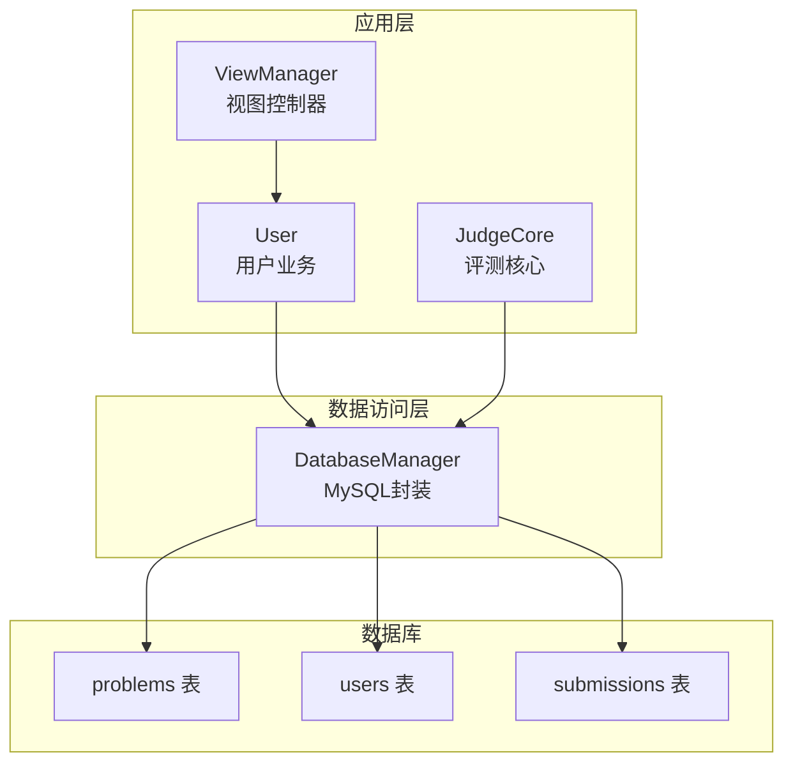
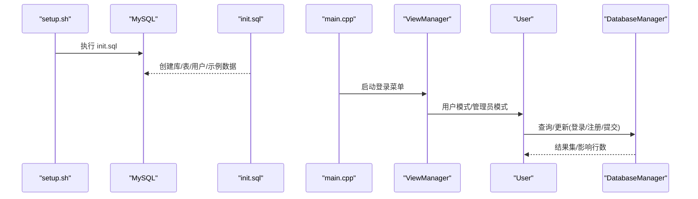
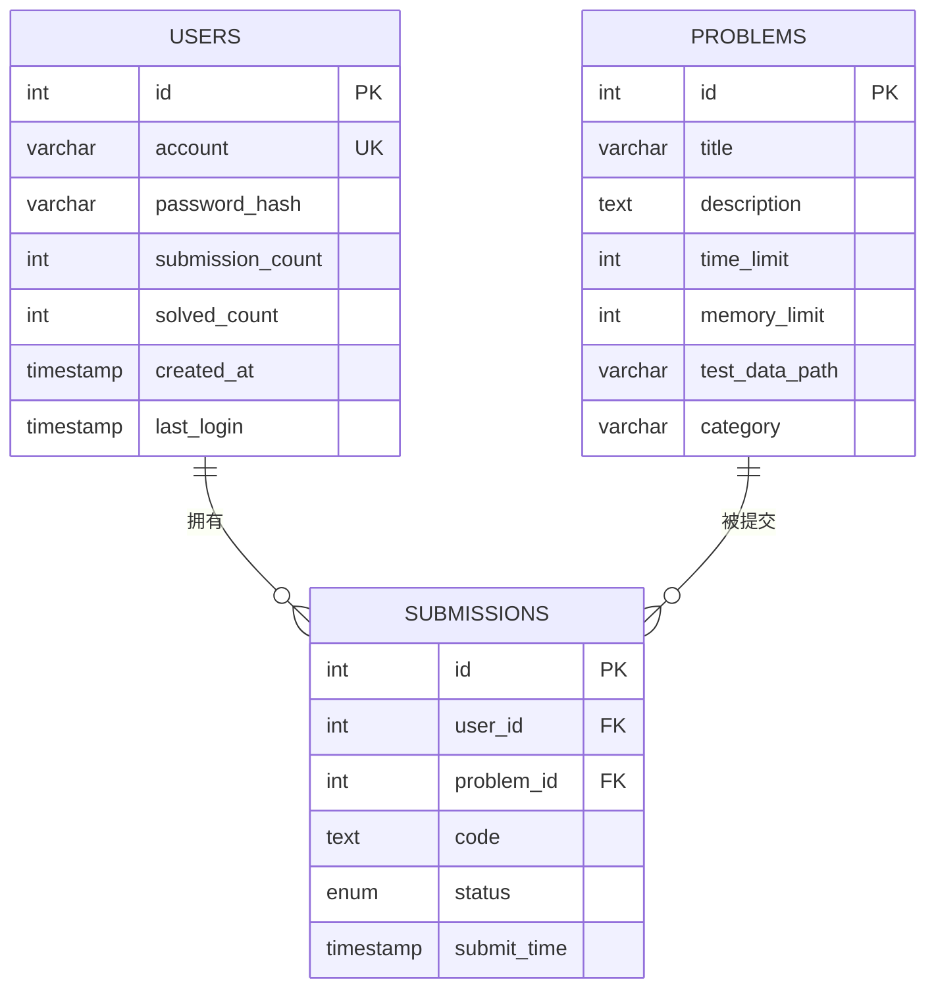
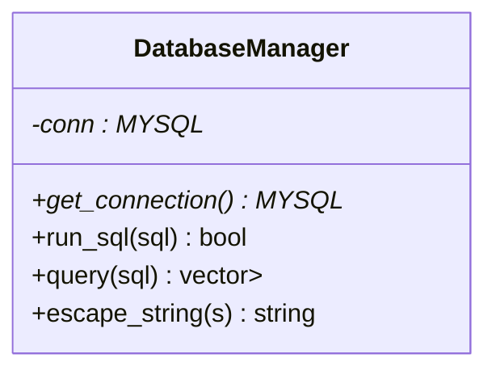
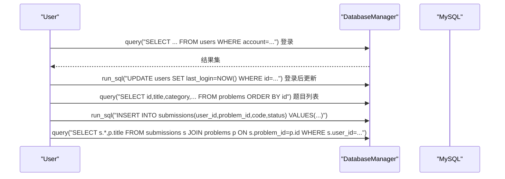
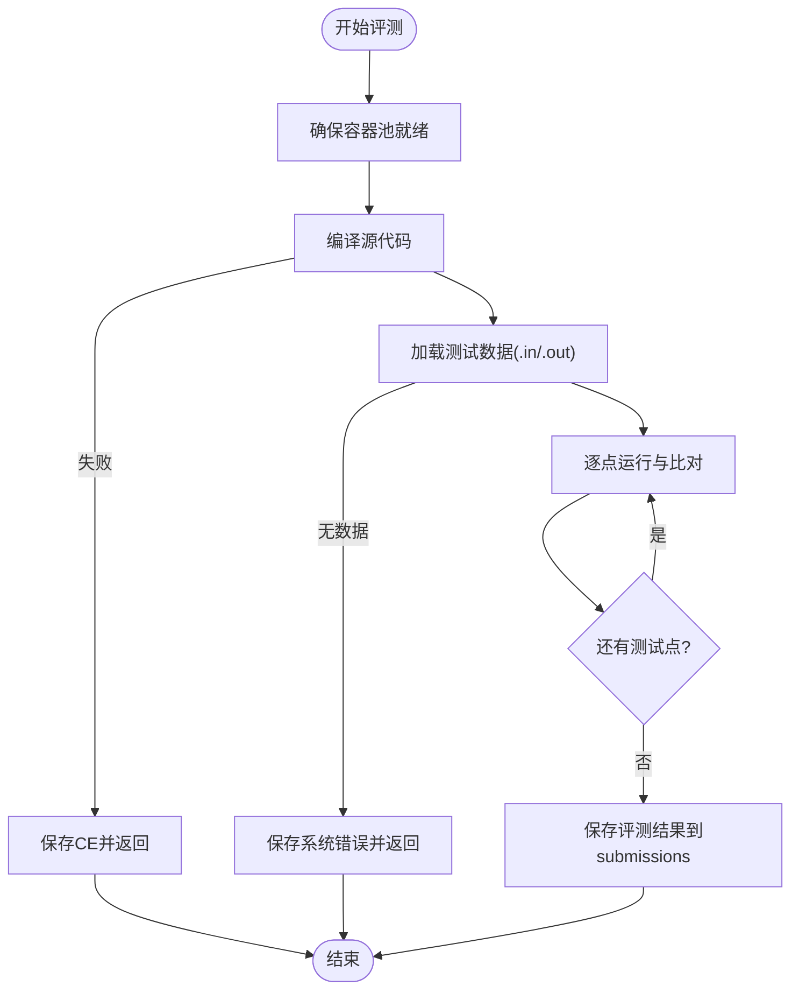
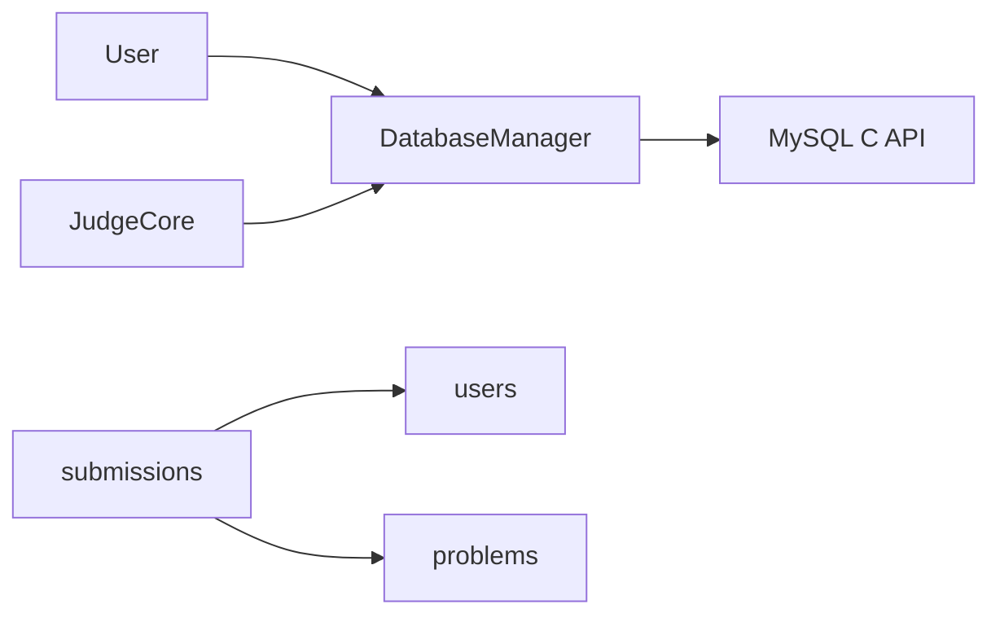

# 数据库设计

<cite>
**本文引用的文件**
- [init.sql](file://init.sql)
- [db_manager.h](file://include/db_manager.h)
- [db_manager.cpp](file://src/db_manager.cpp)
- [user.h](file://include/user.h)
- [user.cpp](file://src/user.cpp)
- [judge_core.h](file://include/judge_core.h)
- [judge_core.cpp](file://src/judge_core.cpp)
- [OJ_v0.1.md](file://History/OJ_v0.1.md)
- [OJ_v0.2.md](file://History/OJ_v0.2.md)
- [setup.sh](file://setup.sh)
- [main.cpp](file://src/main.cpp)
</cite>

## 目录
1. [简介](#简介)
2. [项目结构](#项目结构)
3. [核心组件](#核心组件)
4. [架构总览](#架构总览)
5. [详细组件分析](#详细组件分析)
6. [依赖分析](#依赖分析)
7. [性能考虑](#性能考虑)
8. [故障排查指南](#故障排查指南)
9. [结论](#结论)
10. [附录](#附录)

## 简介
本文件面向OJ在线评测系统的数据库设计，围绕用户表、题目表、提交记录表与历史版本表（如需扩展）展开，系统性阐述表结构、实体关系映射、主外键约束、索引策略、初始化脚本与迁移方案、数据访问层接口与ORM映射思路、性能优化建议、备份恢复与数据完整性保障，以及实际SQL示例与数据字典说明。

## 项目结构
- 数据库初始化脚本：init.sql，负责创建数据库、表、用户与示例数据。
- 数据访问层：DatabaseManager，封装MySQL连接、查询与转义。
- 业务模块：User类通过DatabaseManager完成用户认证、题目浏览、提交记录等数据库交互。
- 评测核心：JudgeCore负责评测流程与结果持久化（保存评测结果到数据库）。
- 版本历史：OJ_v0.1.md与OJ_v0.2.md记录了数据库表结构、权限与交互流程。

**图表来源**
- [db_manager.h:12-53](file://include/db_manager.h#L12-L53)
- [user.h:11-99](file://include/user.h#L11-L99)
- [judge_core.h:111-186](file://include/judge_core.h#L111-L186)
- [init.sql:14-61](file://init.sql#L14-L61)

**章节来源**
- [init.sql:1-278](file://init.sql#L1-L278)
- [db_manager.h:1-60](file://include/db_manager.h#L1-L60)
- [user.h:1-102](file://include/user.h#L1-L102)
- [OJ_v0.1.md:215-262](file://History/OJ_v0.1.md#L215-L262)
- [OJ_v0.2.md:209-222](file://History/OJ_v0.2.md#L209-L222)

## 核心组件
- DatabaseManager：提供连接、执行SQL、查询、字符串转义能力，屏蔽底层MySQL细节。
- User：封装用户认证、注册、修改密码、题目浏览、提交代码、查看提交记录等业务。
- JudgeCore：评测流程与结果持久化（保存评测结果到数据库），支持将评测状态写回submissions表。
- 表结构：problems、users、submissions三张核心表，辅以索引与外键约束。

**章节来源**
- [db_manager.h:12-53](file://include/db_manager.h#L12-L53)
- [db_manager.cpp:9-109](file://src/db_manager.cpp#L9-L109)
- [user.h:11-99](file://include/user.h#L11-L99)
- [user.cpp:41-139](file://src/user.cpp#L41-L139)
- [judge_core.h:111-186](file://include/judge_core.h#L111-L186)
- [judge_core.cpp:38-60](file://src/judge_core.cpp#L38-L60)

## 架构总览
数据库初始化脚本负责创建数据库、表、用户与示例数据；应用启动后，视图控制器根据用户角色加载相应业务对象；User与JudgeCore通过DatabaseManager访问数据库；权限通过数据库用户与应用内行级隔离共同保障。

**图表来源**
- [setup.sh:14-29](file://setup.sh#L14-L29)
- [init.sql:8-95](file://init.sql#L8-L95)
- [main.cpp:5-12](file://src/main.cpp#L5-L12)
- [user.cpp:41-139](file://src/user.cpp#L41-L139)
- [db_manager.cpp:22-67](file://src/db_manager.cpp#L22-L67)

## 详细组件分析

### 数据库表结构与设计原理
- problems（题目表）
  - 主键：自增id
  - 字段要点：标题、描述、时间/内存限制、测试数据路径、分类等
  - 设计原则：题目信息集中存储，便于评测核心按路径读取测试数据
- users（用户表）
  - 主键：自增id；唯一索引：account
  - 字段要点：账号、密码哈希（SHA256）、提交次数、解决次数、创建时间、最后登录时间
  - 设计原则：账号唯一、索引加速登录与统计；密码仅存哈希
- submissions（提交记录表）
  - 主键：自增id；外键：user_id → users.id，problem_id → problems.id
  - 字段要点：用户id、题目id、代码、评测状态（枚举）、提交时间
  - 设计原则：外键保证引用完整性；索引支持按用户与题目检索

**图表来源**
- [init.sql:14-61](file://init.sql#L14-L61)

**章节来源**
- [init.sql:14-61](file://init.sql#L14-L61)
- [OJ_v0.1.md:215-262](file://History/OJ_v0.1.md#L215-L262)
- [OJ_v0.2.md:209-222](file://History/OJ_v0.2.md#L209-L222)

### 数据访问层（DatabaseManager）接口与ORM映射思路
- 接口职责
  - 连接管理：构造时连接，析构时关闭
  - SQL执行：run_sql执行任意SQL（静默失败提示）
  - 查询：query返回结构化结果（列名→值的映射）
  - 转义：escape_string防注入
- ORM映射思路
  - 采用“轻量ORM”：将查询结果映射为std::vector<std::map<std::string, std::string>>
  - 业务层再将映射转换为领域对象（如User、Submission）
  - 优点：灵活、易扩展；缺点：无强类型校验，需业务层严格校验

**图表来源**
- [db_manager.h:12-53](file://include/db_manager.h#L12-L53)

**章节来源**
- [db_manager.h:12-53](file://include/db_manager.h#L12-L53)
- [db_manager.cpp:9-109](file://src/db_manager.cpp#L9-L109)

### 用户模块与数据库交互
- 登录/注册/改密：通过DatabaseManager执行查询与更新，SHA256哈希存储密码
- 题目浏览：查询problems表，支持按id与分类筛选
- 提交代码：写入submissions表，初始状态为“等待”
- 查看提交：联表查询submissions与problems，展示用户历史

**图表来源**
- [user.cpp:41-139](file://src/user.cpp#L41-L139)
- [user.cpp:265-401](file://src/user.cpp#L265-L401)
- [user.cpp:499-520](file://src/user.cpp#L499-L520)
- [db_manager.cpp:36-67](file://src/db_manager.cpp#L36-L67)

**章节来源**
- [user.h:11-99](file://include/user.h#L11-L99)
- [user.cpp:41-139](file://src/user.cpp#L41-L139)
- [user.cpp:265-401](file://src/user.cpp#L265-L401)
- [user.cpp:499-520](file://src/user.cpp#L499-L520)

### 评测核心与结果持久化
- 评测流程：容器池准备、编译、加载测试数据、逐点运行与比对
- 结果映射：将评测结果映射为数据库status字符串（如AC/WA/TLE等）
- 持久化：保存评测报告到数据库（通过DatabaseManager写入submissions表）

**图表来源**
- [judge_core.cpp:252-252](file://src/judge_core.cpp#L252-L252)
- [judge_core.cpp:38-60](file://src/judge_core.cpp#L38-L60)
- [judge_core.cpp:126-200](file://src/judge_core.cpp#L126-L200)

**章节来源**
- [judge_core.h:111-186](file://include/judge_core.h#L111-L186)
- [judge_core.cpp:38-60](file://src/judge_core.cpp#L38-L60)
- [judge_core.cpp:126-200](file://src/judge_core.cpp#L126-L200)

### 历史版本与迁移方案
- v0.1：定义基础表结构与权限；提供init.sql与示例数据
- v0.2：更新users权限（增加INSERT），优化DatabaseManager输出行为
- 迁移建议
  - 版本升级：在init.sql中追加ALTER/INSERT，使用NOT EXISTS避免重复
  - 权限变更：通过GRANT/REVOKE维护行级隔离与最小权限
  - 数据一致性：使用事务包裹多步写入，失败回滚

**章节来源**
- [OJ_v0.1.md:215-272](file://History/OJ_v0.1.md#L215-L272)
- [OJ_v0.2.md:209-222](file://History/OJ_v0.2.md#L209-L222)
- [init.sql:63-95](file://init.sql#L63-L95)

### 数据字典
- problems（题目表）
  - id：主键，自增
  - title：题目标题
  - description：题目描述
  - time_limit：时间限制（ms）
  - memory_limit：内存限制（MB）
  - test_data_path：测试数据路径
  - category：题目分类
- users（用户表）
  - id：主键，自增
  - account：账号，唯一
  - password_hash：密码哈希（SHA256）
  - submission_count：提交次数
  - solved_count：解决次数
  - created_at：注册时间
  - last_login：最后登录时间
- submissions（提交记录表）
  - id：主键，自增
  - user_id：外键指向users.id
  - problem_id：外键指向problems.id
  - code：提交代码
  - status：评测状态（Pending/AC/WA/TLE/MLE/RE/CE）
  - submit_time：提交时间

**章节来源**
- [init.sql:14-61](file://init.sql#L14-L61)
- [OJ_v0.1.md:215-262](file://History/OJ_v0.1.md#L215-L262)

## 依赖分析
- DatabaseManager依赖MySQL C API，提供连接、查询、转义能力
- User依赖DatabaseManager进行认证、题目浏览与提交
- JudgeCore依赖ContainerPool与Docker容器进行评测，最终通过DatabaseManager写回submissions
- 表间依赖：submissions.user_id→users.id，submissions.problem_id→problems.id

**图表来源**
- [db_manager.h:4-7](file://include/db_manager.h#L4-L7)
- [user.h:4-5](file://include/user.h#L4-L5)
- [judge_core.h:4-6](file://include/judge_core.h#L4-L6)
- [init.sql:57-61](file://init.sql#L57-L61)

**章节来源**
- [db_manager.h:4-7](file://include/db_manager.h#L4-L7)
- [user.h:4-5](file://include/user.h#L4-L5)
- [judge_core.h:4-6](file://include/judge_core.h#L4-L6)
- [init.sql:57-61](file://init.sql#L57-L61)

## 性能考虑
- 查询优化
  - 登录与注册：account字段建立唯一索引，避免全表扫描
  - 提交历史：按user_id与problem_id建立索引，支持快速检索
  - 题目列表：按id排序，必要时增加category索引提升分类筛选
- 索引设计
  - users.idx_account、users.idx_created_at
  - submissions.idx_user_id、submissions.idx_problem_id
- 缓存策略
  - 应用层缓存热门题目元信息（短期）
  - 评测结果缓存（短期），避免频繁查询submissions
- 连接与并发
  - 使用连接池（建议）减少连接开销
  - 控制单次批量写入大小，避免长事务
- I/O与存储
  - 测试数据路径尽量本地SSD，减少IO延迟
  - 评测输出与中间文件清理策略，避免磁盘膨胀

[本节为通用指导，不直接分析具体文件]

## 故障排查指南
- 初始化失败
  - 检查MySQL服务状态与root密码
  - 使用setup.sh自动创建目录并执行init.sql
- 权限问题
  - oj_user仅具备最小权限，需通过应用内行级隔离（WHERE id=current_user_id）实现数据隔离
  - 如需调试，可在测试环境临时提升权限，但上线前务必恢复
- 查询失败
  - DatabaseManager在查询失败时打印错误，检查SQL语法与表结构
- 提交记录异常
  - 确认submissions外键约束与索引是否存在
  - 检查status字段是否符合枚举范围

**章节来源**
- [setup.sh:14-29](file://setup.sh#L14-L29)
- [init.sql:63-95](file://init.sql#L63-L95)
- [db_manager.cpp:42-46](file://src/db_manager.cpp#L42-L46)
- [init.sql:57-61](file://init.sql#L57-L61)

## 结论
本设计以三张核心表为核心，结合DatabaseManager提供的轻量ORM能力与应用内的行级隔离策略，实现了用户认证、题目浏览、提交评测与结果持久化的闭环。通过合理的索引与权限控制，兼顾了查询效率与数据安全。后续可在评测核心完善提交记录写入、历史版本表扩展与更细粒度的缓存策略。

[本节为总结，不直接分析具体文件]

## 附录

### 数据库初始化与一键部署
- 一键部署：setup.sh自动创建build/test_data目录、执行init.sql
- 初始化脚本：init.sql创建库/表/用户、设置密码策略、插入示例数据

**章节来源**
- [setup.sh:8-39](file://setup.sh#L8-L39)
- [init.sql:8-95](file://init.sql#L8-L95)

### 实际SQL示例（路径引用）
- 创建数据库与表
  - [init.sql:8-24](file://init.sql#L8-L24)
  - [init.sql:26-40](file://init.sql#L26-L40)
  - [init.sql:41-61](file://init.sql#L41-L61)
- 创建数据库用户与授权
  - [init.sql:68-95](file://init.sql#L68-L95)
- 插入示例数据
  - [init.sql:97-267](file://init.sql#L97-L267)
- 登录与更新最后登录时间
  - [user.cpp:41-73](file://src/user.cpp#L41-L73)
- 注册与密码哈希
  - [user.cpp:75-100](file://src/user.cpp#L75-L100)
- 修改密码
  - [user.cpp:102-139](file://src/user.cpp#L102-L139)
- 提交代码写入submissions
  - [user.cpp:265-401](file://src/user.cpp#L265-L401)
- 查看我的提交（联表查询）
  - [user.cpp:499-520](file://src/user.cpp#L499-L520)