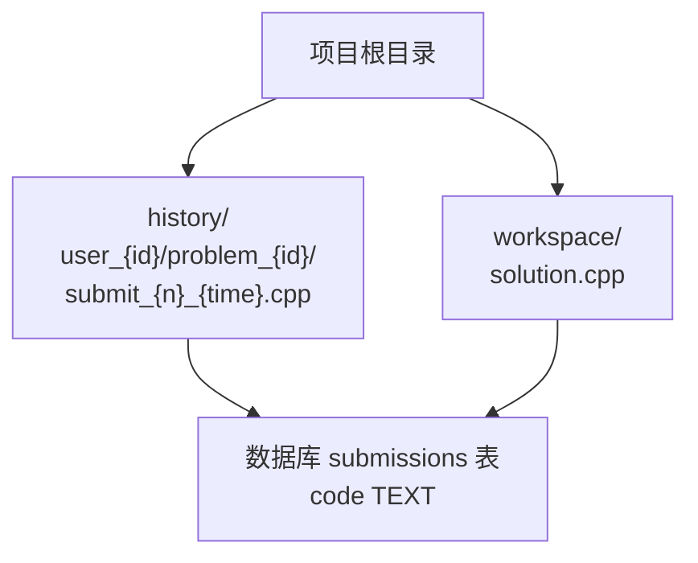
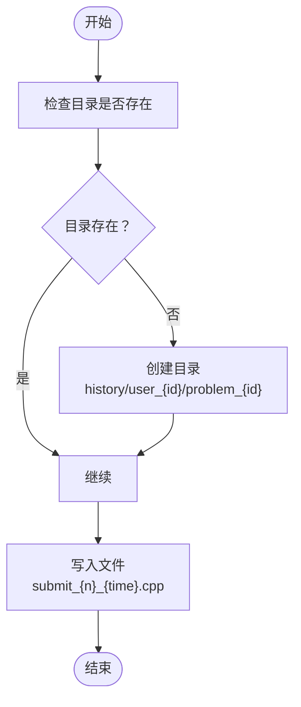
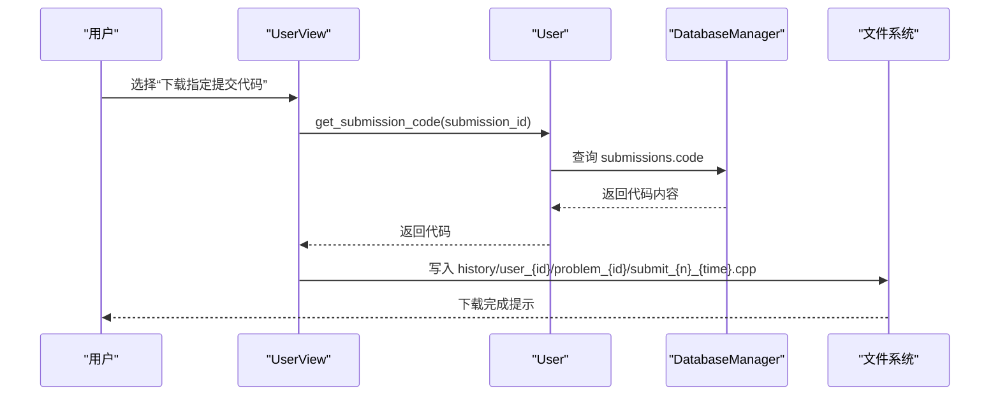
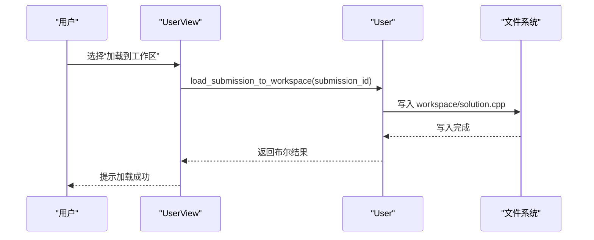
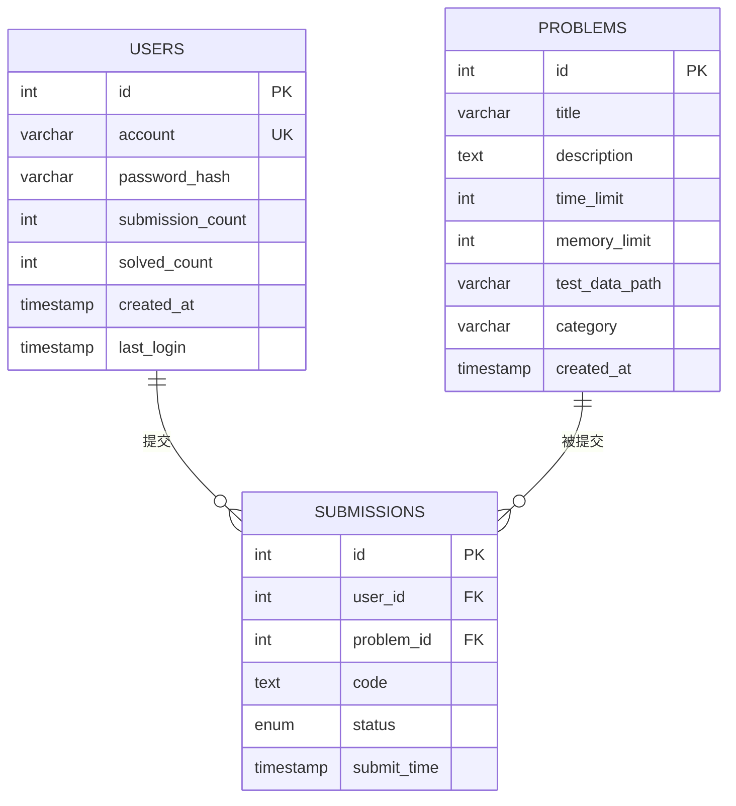
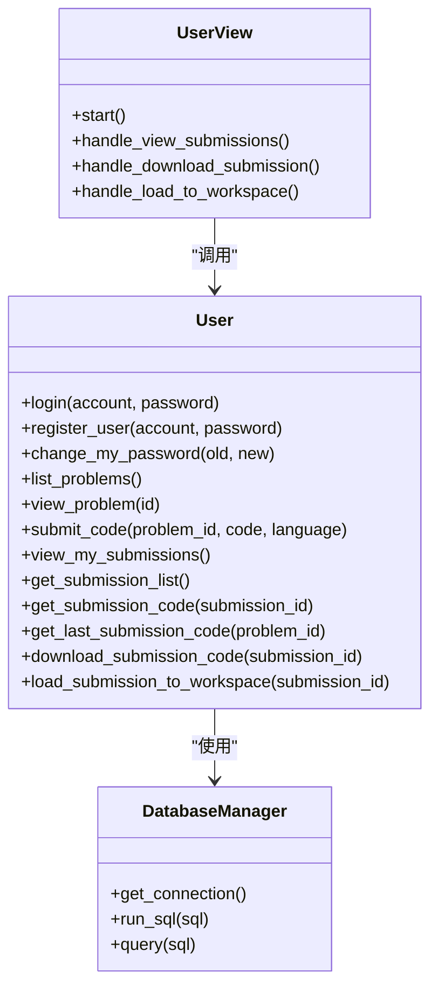

# 历史代码管理

<cite>
**本文引用的文件**
- [README.md](file://README.md)
- [init.sql](file://init.sql)
- [code_submission_design.md](file://docs/code_submission_design.md)
- [OJ_v0.1.md](file://History/OJ_v0.1.md)
- [OJ_v0.2.md](file://History/OJ_v0.2.md)
- [db_manager.h](file://include/db_manager.h)
- [db_manager.cpp](file://src/db_manager.cpp)
- [user.h](file://include/user.h)
- [user.cpp](file://src/user.cpp)
- [user_view.h](file://include/user_view.h)
- [user_view.cpp](file://src/user_view.cpp)
- [.gitignore](file://.gitignore)
</cite>

## 目录
1. [简介](#简介)
2. [项目结构](#项目结构)
3. [核心组件](#核心组件)
4. [架构总览](#架构总览)
5. [详细组件分析](#详细组件分析)
6. [依赖分析](#依赖分析)
7. [性能考量](#性能考量)
8. [故障排查指南](#故障排查指南)
9. [结论](#结论)
10. [附录](#附录)

## 简介
本文件面向OJ系统的历史代码管理功能，基于仓库中现有的设计文档与数据库脚本，系统性阐述历史代码的目录结构、命名规范、下载与加载流程、数据库查询接口设计、安全边界与权限控制，以及性能优化与存储策略建议。当前仓库中历史代码管理仍处于“设计阶段”，本文以设计文档为依据，结合现有数据库结构与权限配置，给出可落地的实现方案与最佳实践。

## 项目结构
- 历史代码目录：history/
- 工作区文件：workspace/solution.cpp
- 历史代码文件命名：submit_{n}_{time}.cpp（n为提交序号，time为时间戳）
- 目录层级：history/user_{id}/problem_{id}/



图表来源
- [code_submission_design.md:401-420](file://docs/code_submission_design.md#L401-L420)
- [.gitignore:464-469](file://.gitignore#L464-L469)

章节来源
- [code_submission_design.md:444-471](file://docs/code_submission_design.md#L444-L471)
- [.gitignore:462-469](file://.gitignore#L462-L469)

## 核心组件
- 数据库层：DatabaseManager 封装MySQL连接与查询执行
- 业务层：User 类负责用户认证、提交代码、查看提交记录等
- 界面层：UserView 负责菜单展示与用户交互
- 历史管理：基于设计文档的提交列表查询、指定提交代码获取、下载到本地、加载到工作区等

章节来源
- [db_manager.h:12-46](file://include/db_manager.h#L12-L46)
- [user.h:10-86](file://include/user.h#L10-L86)
- [user_view.h:12-89](file://include/user_view.h#L12-L89)

## 架构总览
历史代码管理采用“工作区文件 + 数据库存储 + 层级目录”的组合方案：
- 工作区文件：统一的编辑入口，提交时读取内容保存至数据库
- 数据库存储：submissions 表持久化历史代码，支持按用户与题目维度检索
- 目录隔离：history/user_{id}/problem_{id}/ 下按提交序号与时间戳命名文件，便于下载与归档

```mermaid
graph TB
subgraph "界面层"
uv["UserView"]
end
subgraph "业务层"
u["User"]
end
subgraph "数据访问层"
dm["DatabaseManager"]
db["MySQL OJ.submissions"]
end
subgraph "文件系统"
ws["workspace/solution.cpp"]
hd["history/user_{id}/problem_{id}/submit_{n}_{time}.cpp"]
end
uv --> u
u --> dm
dm --> db
u <- --> ws
u <- --> hd
```

图表来源
- [user_view.cpp:36-131](file://src/user_view.cpp#L36-L131)
- [user.cpp:11-137](file://src/user.cpp#L11-L137)
- [db_manager.cpp:21-57](file://src/db_manager.cpp#L21-L57)
- [code_submission_design.md:444-471](file://docs/code_submission_design.md#L444-L471)

## 详细组件分析

### 目录结构与文件组织策略
- 两级目录隔离：按用户ID与题目ID分层，避免不同用户间交叉污染
- 文件命名规范：submit_{n}_{time}.cpp，其中 n 为提交序号，time 为时间戳，确保同题多次提交可区分
- 目录创建逻辑：下载前按需逐级创建目录，保证可写性



图表来源
- [code_submission_design.md:401-420](file://docs/code_submission_design.md#L401-L420)

章节来源
- [code_submission_design.md:401-420](file://docs/code_submission_design.md#L401-L420)
- [.gitignore:464-469](file://.gitignore#L464-L469)

### 历史代码命名规范与生成机制
- 提交序号 n：可由数据库自增主键 id 表示，或在导出时映射为递增序号
- 时间戳 time：建议使用提交时间（submit_time）标准化命名，便于排序与审计
- 文件扩展名：.cpp，便于IDE识别与后续处理

章节来源
- [code_submission_design.md:430-436](file://docs/code_submission_design.md#L430-L436)

### 历史代码下载与加载流程
- 下载到本地：根据提交ID查询代码内容，按命名规范写入 history/user_{id}/problem_{id}/ 目录
- 从历史记录加载到工作区：用户在“我的提交”界面选择指定提交，系统读取对应文件内容并写入 workspace/solution.cpp



图表来源
- [code_submission_design.md:371-386](file://docs/code_submission_design.md#L371-L386)
- [code_submission_design.md:430-436](file://docs/code_submission_design.md#L430-L436)

章节来源
- [code_submission_design.md:351-367](file://docs/code_submission_design.md#L351-L367)
- [code_submission_design.md:371-386](file://docs/code_submission_design.md#L371-L386)

### 历史代码加载到工作区流程
- 用户在“我的提交”界面选择“加载到工作区”
- 系统根据提交ID获取代码内容，写入 workspace/solution.cpp
- 提示用户可在题目详情继续编辑与提交



图表来源
- [code_submission_design.md:384-386](file://docs/code_submission_design.md#L384-L386)

章节来源
- [code_submission_design.md:384-386](file://docs/code_submission_design.md#L384-L386)

### 数据库查询接口设计
- 提交列表查询：按用户ID查询其所有提交，关联题目标题，按提交时间倒序
- 指定提交代码获取：按提交ID与用户ID查询代码内容与题目ID
- 最近提交代码获取：按用户ID与题目ID查询最近一次提交代码
- 提交统计：统计某题的总提交次数与最近一次状态



图表来源
- [init.sql:14-61](file://init.sql#L14-L61)

章节来源
- [init.sql:42-61](file://init.sql#L42-L61)
- [code_submission_design.md:428-436](file://docs/code_submission_design.md#L428-L436)

### 安全边界与权限控制
- 数据库用户权限：oj_user 对 submissions 表仅有 SELECT/INSERT 权限，无法删除或越权更新他人记录
- 行级隔离：应用程序在查询与写入时均以当前用户ID为条件，确保用户只能访问自己的历史
- 文件系统隔离：history 目录按用户ID分层，避免跨用户访问

章节来源
- [init.sql:82-95](file://init.sql#L82-L95)
- [code_submission_design.md:430-436](file://docs/code_submission_design.md#L430-L436)

### 性能优化与存储策略建议
- 查询优化
  - 为 submissions 表的 user_id、problem_id、submit_time 建立索引，提升分页与排序效率
  - 分页查询提交列表，避免一次性加载过多记录
- 存储优化
  - 历史代码文件按用户与题目分层，便于清理与归档
  - 建议定期清理过期历史或提供用户手动清理接口
- I/O优化
  - 下载与加载操作采用异步或后台任务，避免阻塞UI
  - 对大文件进行压缩归档，降低磁盘占用

章节来源
- [init.sql:57-61](file://init.sql#L57-L61)
- [code_submission_design.md:444-471](file://docs/code_submission_design.md#L444-L471)

## 依赖分析
- UserView 依赖 User 与 DatabaseManager，负责用户交互与业务调度
- User 依赖 DatabaseManager，负责认证、提交与历史查询
- DatabaseManager 依赖 MySQL C API，负责连接与查询执行
- 历史管理功能依赖工作区文件与历史目录的存在性



图表来源
- [user_view.h:12-89](file://include/user_view.h#L12-L89)
- [user.h:10-86](file://include/user.h#L10-L86)
- [db_manager.h:12-46](file://include/db_manager.h#L12-L46)

章节来源
- [user_view.cpp:36-131](file://src/user_view.cpp#L36-L131)
- [user.cpp:11-137](file://src/user.cpp#L11-L137)
- [db_manager.cpp:21-57](file://src/db_manager.cpp#L21-L57)

## 性能考量
- 数据库层面
  - 使用 LIMIT 与 OFFSET 实现分页，避免全表扫描
  - 对高频查询字段建立合适索引，减少排序成本
- 文件系统层面
  - 控制历史目录层级深度，避免文件系统路径过长
  - 定期归档冷数据，减少热目录下的文件数量
- 应用层面
  - 异步处理下载与加载，避免阻塞主线程
  - 对重复请求进行缓存，减少数据库与文件系统压力

## 故障排查指南
- 数据库连接失败
  - 检查数据库服务状态与凭据配置
  - 确认 oj_user 权限是否正确授予
- 提交记录为空
  - 确认当前用户ID与提交ID是否匹配
  - 检查 submissions 表中是否存在对应记录
- 历史文件无法写入
  - 检查 history 目录权限与磁盘空间
  - 确认目录创建逻辑是否正确执行
- 工作区文件异常
  - 检查 workspace/solution.cpp 是否存在
  - 确认 .gitignore 是否排除了该文件

章节来源
- [db_manager.cpp:61-79](file://src/db_manager.cpp#L61-L79)
- [init.sql:82-95](file://init.sql#L82-L95)
- [.gitignore:464-469](file://.gitignore#L464-L469)

## 结论
历史代码管理以“工作区文件 + 数据库存储 + 目录隔离”为核心，结合设计文档中的接口与流程，能够实现从提交、查询、下载到加载的完整闭环。通过严格的行级隔离与目录权限控制，确保用户只能访问自身历史。配合合理的索引与分页策略，可进一步提升查询与加载性能。建议按实现优先级逐步推进：统一工作区文件、增强AI上下文、完善历史管理功能。

## 附录
- 历史版本参考
  - v0.1：系统基础框架与数据库表结构
  - v0.2：用户认证与界面优化
- 设计文档：历史代码管理的接口与流程设计

章节来源
- [OJ_v0.1.md:1-383](file://History/OJ_v0.1.md#L1-L383)
- [OJ_v0.2.md:1-429](file://History/OJ_v0.2.md#L1-L429)
- [code_submission_design.md:1-618](file://docs/code_submission_design.md#L1-L618)