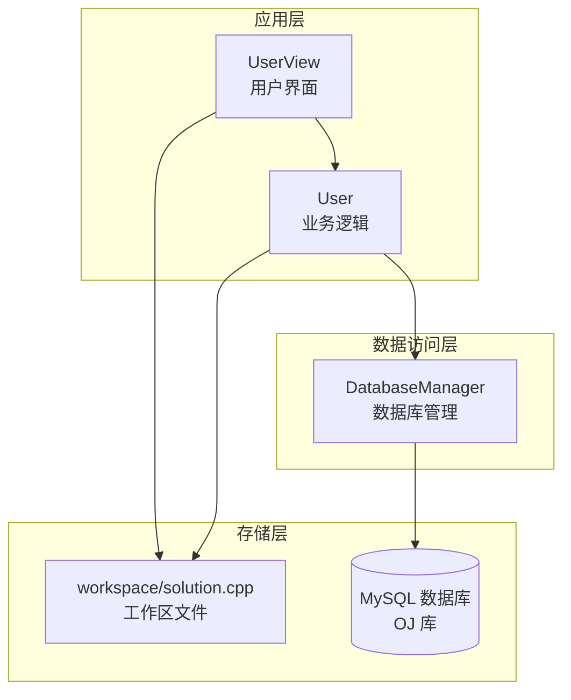
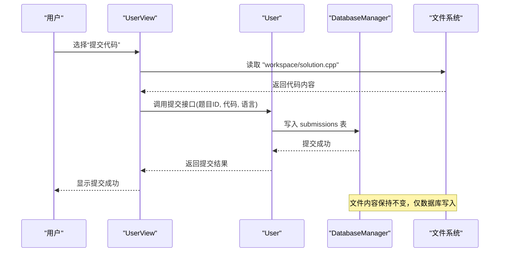
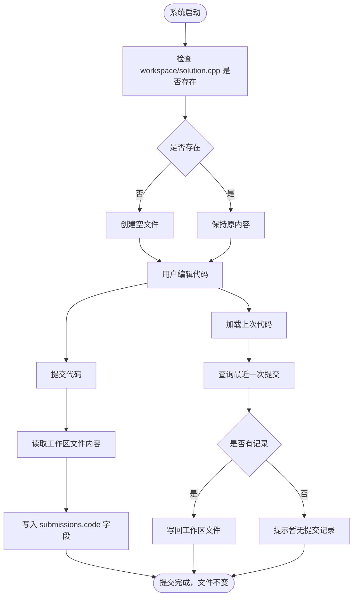
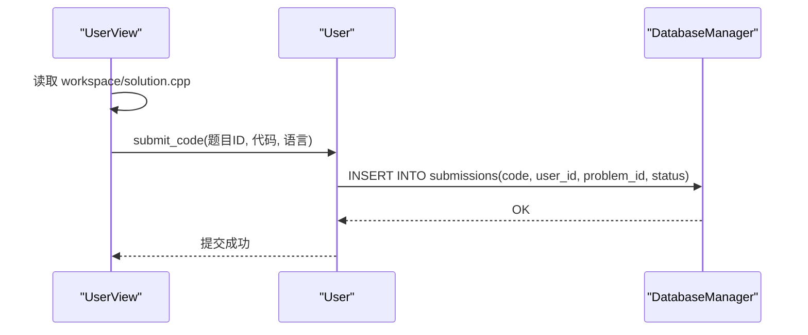
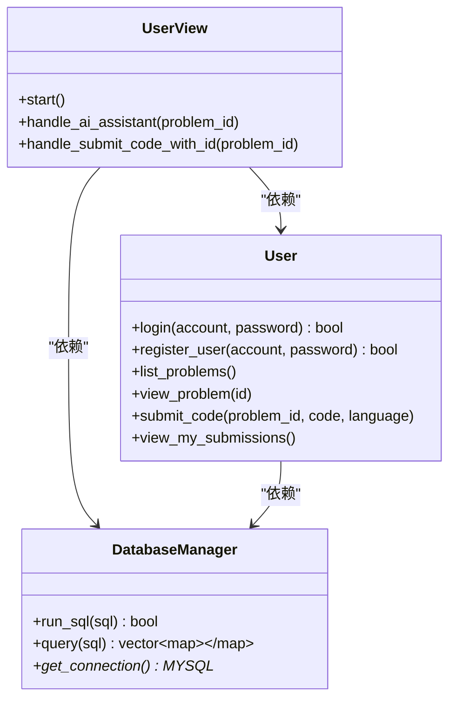

# 工作区文件管理

<cite>
**本文引用的文件**
- [README.md](file://README.md)
- [docs/code_submission_design.md](file://docs/code_submission_design.md)
- [src/user_view.cpp](file://src/user_view.cpp)
- [src/user.cpp](file://src/user.cpp)
- [include/user_view.h](file://include/user_view.h)
- [include/user.h](file://include/user.h)
- [include/db_manager.h](file://include/db_manager.h)
- [src/db_manager.cpp](file://src/db_manager.cpp)
- [init.sql](file://init.sql)
- [.gitignore](file://.gitignore)
- [workspace/solution.cpp](file://workspace/solution.cpp)
</cite>

## 目录
1. [简介](#简介)
2. [项目结构](#项目结构)
3. [核心组件](#核心组件)
4. [架构总览](#架构总览)
5. [详细组件分析](#详细组件分析)
6. [依赖分析](#依赖分析)
7. [性能考虑](#性能考虑)
8. [故障排查指南](#故障排查指南)
9. [结论](#结论)
10. [附录](#附录)

## 简介
本文件围绕 OJ 系统的工作区文件管理功能展开，重点说明统一工作区文件机制的设计理念与实现方式，明确用户始终在一个文件 workspace/solution.cpp 中编写代码，提交时从该文件读取内容写入数据库 submissions 表，同时保证文件本身不被覆盖或删除。文档还涵盖工作区文件与数据库提交记录的关系、统一管理策略、安全与错误处理机制、性能优化建议以及最佳实践。

## 项目结构
- 工作区文件位于 workspace/solution.cpp，作为用户唯一编写代码的入口。
- 用户交互层在 src/user_view.cpp 中，负责菜单展示与操作分发。
- 业务逻辑层在 src/user.cpp 中，负责登录、注册、题目查看、提交与历史查看等。
- 数据访问层在 include/db_manager.h 与 src/db_manager.cpp 中，封装 MySQL 连接与查询执行。
- 数据库初始化脚本在 init.sql，定义了 problems、users、submissions 等表结构与权限。
- 版本控制忽略规则在 .gitignore，确保工作区文件与历史目录不被纳入版本控制。

图表来源
- [src/user_view.cpp:1-395](file://src/user_view.cpp#L1-L395)
- [src/user.cpp:1-286](file://src/user.cpp#L1-L286)
- [include/db_manager.h:1-53](file://include/db_manager.h#L1-L53)
- [src/db_manager.cpp:1-100](file://src/db_manager.cpp#L1-L100)
- [workspace/solution.cpp:1-2](file://workspace/solution.cpp#L1-L2)

章节来源
- [README.md:1-2](file://README.md#L1-L2)
- [docs/code_submission_design.md:444-470](file://docs/code_submission_design.md#L444-L470)
- [.gitignore:1-6](file://.gitignore#L1-L6)

## 核心组件
- 工作区文件：workspace/solution.cpp，作为用户唯一编写代码的载体，提交时读取其内容，提交后保持不变。
- 用户界面层：UserView 负责菜单展示、输入处理与调用业务逻辑，包含读取工作区文件的辅助函数与 AI 助手调用。
- 业务逻辑层：User 负责登录、注册、题目查看、提交与历史查看等，当前提交与历史查看仍处于待实现状态。
- 数据库管理层：DatabaseManager 封装连接与查询执行，提供 run_sql 与 query 接口。
- 数据库初始化：init.sql 定义表结构、索引与权限，确保 submissions 表支持代码持久化与查询。

章节来源
- [docs/code_submission_design.md:36-130](file://docs/code_submission_design.md#L36-L130)
- [src/user_view.cpp:12-23](file://src/user_view.cpp#L12-L23)
- [src/user_view.cpp:290-354](file://src/user_view.cpp#L290-L354)
- [src/user.cpp:264-286](file://src/user.cpp#L264-L286)
- [include/db_manager.h:12-46](file://include/db_manager.h#L12-L46)
- [src/db_manager.cpp:26-57](file://src/db_manager.cpp#L26-L57)
- [init.sql:41-61](file://init.sql#L41-L61)

## 架构总览
工作区文件管理遵循“单一文件、只读提交、只写数据库”的原则。用户在工作区文件中编写代码，提交时由界面层读取该文件内容，业务层调用数据库层写入 submissions 表，文件本身保持不变，从而实现用户体验的一致性与历史可追溯性。

图表来源
- [src/user_view.cpp:276-288](file://src/user_view.cpp#L276-L288)
- [src/user_view.cpp:303-304](file://src/user_view.cpp#L303-L304)
- [src/user.cpp:264-274](file://src/user.cpp#L264-L274)
- [src/db_manager.cpp:21-24](file://src/db_manager.cpp#L21-L24)

## 详细组件分析

### 工作区文件生命周期与统一管理策略
- 启动阶段：检查 workspace/solution.cpp 是否存在，不存在则创建空文件，存在则保持原内容。
- 编辑阶段：用户在工作区文件中持续编写代码，文件内容随编辑更新。
- 提交阶段：从工作区文件读取完整代码，写入数据库 submissions 表的 code 字段，文件保持不变。
- 加载上次代码：从数据库查询该题目的最近一次提交，若有记录则写回工作区文件，若无记录则提示暂无提交记录。
- 退出阶段：工作区文件保留，下次继续编辑。

图表来源
- [docs/code_submission_design.md:42-65](file://docs/code_submission_design.md#L42-L65)
- [docs/code_submission_design.md:122-127](file://docs/code_submission_design.md#L122-L127)

章节来源
- [docs/code_submission_design.md:36-130](file://docs/code_submission_design.md#L36-L130)

### 文件读取与写入实现要点
- 读取工作区文件：UserView 中提供静态辅助函数 read_file，用于读取指定路径文件内容；在 AI 助手场景中直接读取 workspace/solution.cpp。
- 写入工作区文件：当前设计中，提交流程仅读取文件内容写入数据库，文件本身不被覆盖。如需实现“加载上次代码”写回工作区，可在业务层实现相应方法并在界面层调用。
- 确保工作区存在：可通过检查文件是否存在，不存在则创建空文件，保证用户首次进入即可开始编辑。

章节来源
- [src/user_view.cpp:12-23](file://src/user_view.cpp#L12-L23)
- [src/user_view.cpp:303-304](file://src/user_view.cpp#L303-L304)
- [docs/code_submission_design.md:67-75](file://docs/code_submission_design.md#L67-L75)

### 提交流程与数据库提交记录
- 提交接口：User::submit_code 接收题目 ID、代码内容与语言，当前为占位实现，后续应调用数据库层写入 submissions 表。
- 数据库结构：submissions 表包含 user_id、problem_id、code、status、submit_time 等字段，支持按用户与题目维度查询。
- 提交行为：从工作区文件读取代码后写入数据库，文件内容保持不变，确保历史可追溯与用户体验一致。

图表来源
- [src/user_view.cpp:276-288](file://src/user_view.cpp#L276-L288)
- [src/user.cpp:264-274](file://src/user.cpp#L264-L274)
- [src/db_manager.cpp:21-24](file://src/db_manager.cpp#L21-L24)
- [init.sql:41-61](file://init.sql#L41-L61)

章节来源
- [src/user.cpp:264-274](file://src/user.cpp#L264-L274)
- [init.sql:41-61](file://init.sql#L41-L61)

### AI 助手与工作区文件集成
- AI 助手读取：UserView::handle_ai_assistant 在调用 AI 前会读取 workspace/solution.cpp 作为代码上下文，结合题目信息一并传给 AI。
- 上下文感知：通过将工作区代码与题目信息打包传递，提升 AI 辅助的准确性与一致性。

章节来源
- [src/user_view.cpp:290-354](file://src/user_view.cpp#L290-L354)

### 目录结构与版本控制策略
- 新增目录/文件：workspace/ 与 workspace/solution.cpp 作为工作区文件；history/ 作为历史代码下载目录。
- .gitignore：排除 workspace/solution.cpp 与 history/，避免运行时产物进入版本控制。

章节来源
- [docs/code_submission_design.md:444-470](file://docs/code_submission_design.md#L444-L470)
- [.gitignore:1-6](file://.gitignore#L1-L6)

## 依赖分析
- UserView 依赖 User 与 DatabaseManager，负责用户交互与业务调度。
- User 依赖 DatabaseManager，负责业务逻辑与数据库操作。
- DatabaseManager 封装 MySQL 连接与查询执行，提供 run_sql 与 query 接口。
- 工作区文件与数据库形成松耦合：文件仅作为读取源，提交后不参与后续逻辑。

图表来源
- [include/user_view.h:12-89](file://include/user_view.h#L12-L89)
- [include/user.h:10-86](file://include/user.h#L10-L86)
- [include/db_manager.h:12-46](file://include/db_manager.h#L12-L46)

章节来源
- [include/user_view.h:12-89](file://include/user_view.h#L12-L89)
- [include/user.h:10-86](file://include/user.h#L10-L86)
- [include/db_manager.h:12-46](file://include/db_manager.h#L12-L46)

## 性能考虑
- 文件读取：读取 workspace/solution.cpp 采用一次性读取至字符串的方式，适合中小型代码量；对于超大文件可考虑分块读取与流式处理。
- 数据库写入：批量提交时建议合并事务，减少往返开销；查询历史记录时利用索引（如 submissions.user_id、problem_id）提升性能。
- 内存占用：读取文件与构建请求参数时注意内存峰值，避免长时间驻留大对象。
- I/O 优化：工作区文件与历史目录不在数据库中，I/O 负担主要来自文件系统，建议合理安排磁盘空间与缓存策略。

## 故障排查指南
- 工作区文件不可读
  - 现象：读取返回空内容或读取失败。
  - 排查：确认 workspace/solution.cpp 存在且具备读权限；检查路径是否正确。
  - 参考实现：UserView::read_file 对文件打开失败返回空字符串。
- 提交失败
  - 现象：提交接口返回失败或数据库无记录。
  - 排查：检查数据库连接、权限与 SQL 执行；确认 submissions 表字段与约束。
  - 参考实现：DatabaseManager::run_sql 与 query 对错误进行输出与返回。
- 历史记录为空
  - 现象：查询不到任何提交记录。
  - 排查：确认用户登录状态、题目 ID 与数据库中是否存在对应记录。
- 版本控制污染
  - 现象：工作区文件或历史目录被提交到仓库。
  - 排查：检查 .gitignore 规则是否生效，必要时清理缓存后再提交。

章节来源
- [src/user_view.cpp:12-23](file://src/user_view.cpp#L12-L23)
- [src/db_manager.cpp:26-57](file://src/db_manager.cpp#L26-L57)
- [.gitignore:1-6](file://.gitignore#L1-L6)

## 结论
工作区文件管理通过“单一文件、只读提交、只写数据库”的策略，实现了用户在统一文件中编写代码、提交即持久化、历史可追溯的目标。配合合理的安全与错误处理机制、性能优化建议与最佳实践，能够为用户提供稳定、一致且高效的编程评测体验。

## 附录
- 工作区文件位置：workspace/solution.cpp
- 数据库表结构参考：init.sql 中的 submissions 表定义
- 相关接口与方法参考：UserView 与 User 的声明与实现