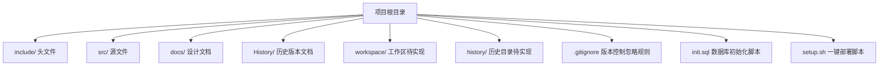
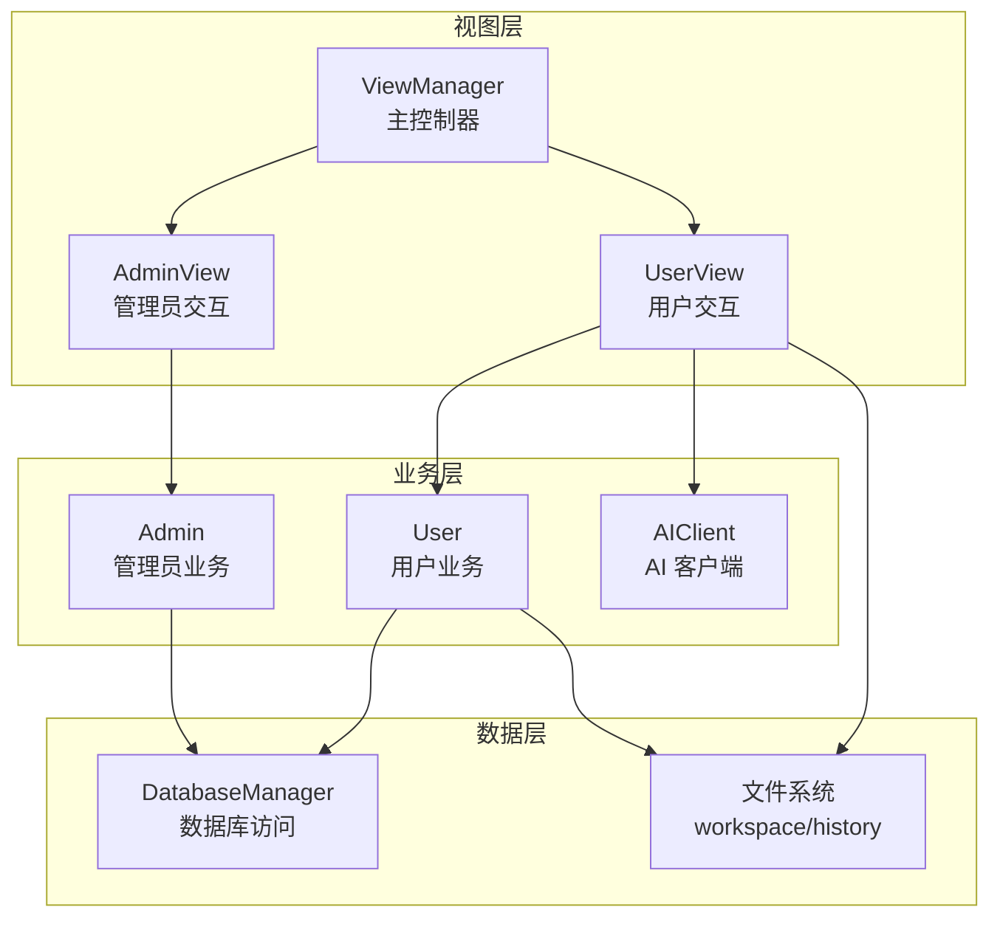
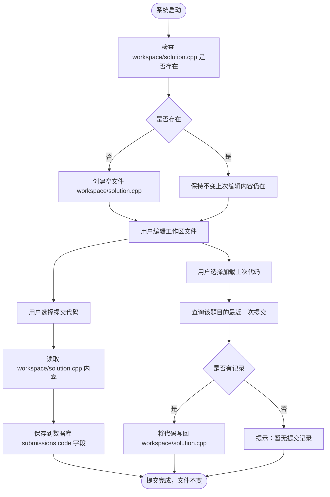
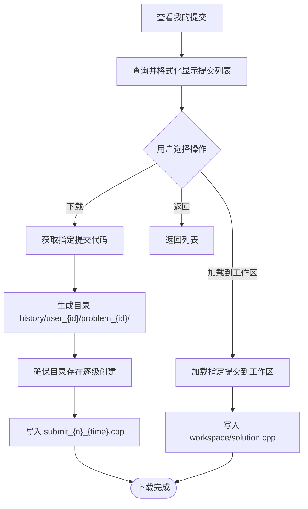
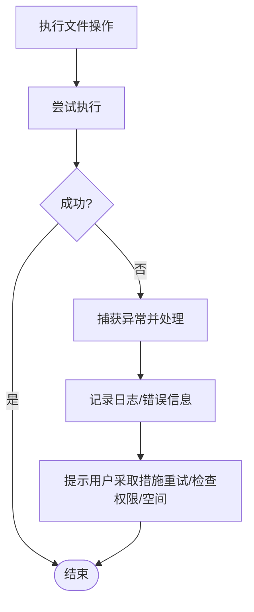
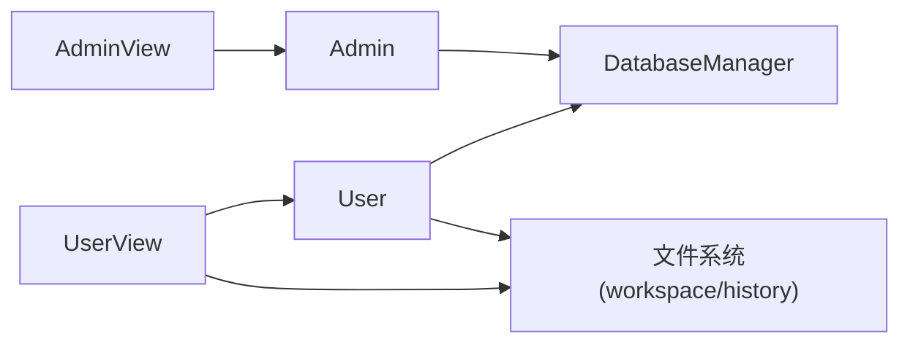

# 文件系统管理

<cite>
**本文引用的文件**
- [main.cpp](file://src/main.cpp)
- [view_manager.h](file://include/view_manager.h)
- [user_view.h](file://include/user_view.h)
- [admin_view.h](file://include/admin_view.h)
- [user_view.cpp](file://src/user_view.cpp)
- [admin_view.cpp](file://src/admin_view.cpp)
- [user.h](file://include/user.h)
- [user.cpp](file://src/user.cpp)
- [admin.h](file://include/admin.h)
- [admin.cpp](file://src/admin.cpp)
- [db_manager.h](file://include/db_manager.h)
- [.gitignore](file://.gitignore)
- [code_submission_design.md](file://docs/code_submission_design.md)
- [OJ_v0.1.md](file://History/OJ_v0.1.md)
- [OJ_v0.2.md](file://History/OJ_v0.2.md)
- [init.sql](file://init.sql)
- [setup.sh](file://setup.sh)
</cite>

## 目录
1. [简介](#简介)
2. [项目结构](#项目结构)
3. [核心组件](#核心组件)
4. [架构总览](#架构总览)
5. [详细组件分析](#详细组件分析)
6. [依赖分析](#依赖分析)
7. [性能考虑](#性能考虑)
8. [故障排查指南](#故障排查指南)
9. [结论](#结论)
10. [附录](#附录)

## 简介
本文件系统管理文档围绕 OJ 系统的文件管理能力展开，重点覆盖以下方面：
- workspace 工作区目录的设计与文件操作机制（创建、编辑、临时存储）
- history 历史目录的管理策略（命名规范、版本控制、持久化）
- 文件生命周期管理（创建、更新、删除、清理）
- 文件系统安全策略（权限控制、访问限制）
- 文件操作的错误处理与恢复机制
- 性能优化建议与维护扩展指导

说明：当前仓库中已有工作区与历史目录的完整设计文档，但尚未在 C++ 源码中实现。本文在不暴露具体代码的前提下，基于设计文档与现有代码，给出可落地的实现建议与最佳实践。

## 项目结构
OJ 项目的文件组织采用“头文件/源文件/文档/历史/工作区”分离的布局，配合构建与初始化脚本，形成清晰的职责边界与可维护性。

**图表来源**
- [code_submission_design.md](file://docs/code_submission_design.md)
- [.gitignore](file://.gitignore)

**章节来源**
- [code_submission_design.md](file://docs/code_submission_design.md)
- [.gitignore](file://.gitignore)

## 核心组件
- 视图管理层：负责角色切换、清屏、主菜单与输入处理
- 用户视图层：负责用户模式交互、题目浏览、提交入口、AI 助手调用
- 管理员视图层：负责题目管理、发布与详情查看
- 用户业务层：负责登录、注册、密码修改、提交与历史查看
- 数据库管理层：负责连接与 SQL 执行
- 设计文档：定义了工作区与历史目录的文件结构、命名规范与交互流程

**章节来源**
- [view_manager.h](file://include/view_manager.h)
- [user_view.h](file://include/user_view.h)
- [admin_view.h](file://include/admin_view.h)
- [user.h](file://include/user.h)
- [admin.h](file://include/admin.h)
- [db_manager.h](file://include/db_manager.h)
- [code_submission_design.md](file://docs/code_submission_design.md)

## 架构总览
OJ 的文件管理涉及三层协作：
- 视图层负责触发文件操作（读取工作区、提交代码、下载历史）
- 业务层负责业务逻辑（读取/写入、查询、持久化）
- 数据层负责数据库持久化与文件系统持久化（历史目录）

**图表来源**
- [view_manager.h](file://include/view_manager.h)
- [user_view.h](file://include/user_view.h)
- [admin_view.h](file://include/admin_view.h)
- [user.h](file://include/user.h)
- [admin.h](file://include/admin.h)
- [db_manager.h](file://include/db_manager.h)

## 详细组件分析

### workspace 工作区目录
- 设计目标
  - 用户始终在单一文件中编写代码，降低切换成本
  - 提交时读取工作区内容并持久化到数据库，文件本身保持不变
- 目录与文件
  - 目录：workspace/
  - 文件：workspace/solution.cpp（默认工作文件）
- 生命周期
  - 系统启动时确保文件存在（不存在则创建空文件）
  - 用户在题目详情子菜单中选择“提交代码”，从工作区读取内容并提交
  - 用户可在子菜单中选择“加载上次代码”，将最近一次提交写回工作区
  - 退出系统后文件保留，下次继续编辑
- 文件操作清单
  - 读取文件：read_file(path)
  - 写入文件：write_file(path, content)
  - 确保存在：ensure_file_exists(path)
  - 统计行数：count_lines(content)（用于界面提示）
- 与现有代码的衔接
  - 用户视图层已具备从标准输入读取代码的能力，可替换为从工作区文件读取
  - 提交逻辑需从标准输入改为从工作区文件读取

**图表来源**
- [code_submission_design.md](file://docs/code_submission_design.md)
- [user_view.cpp](file://src/user_view.cpp)
- [user.cpp](file://src/user.cpp)

**章节来源**
- [code_submission_design.md](file://docs/code_submission_design.md)
- [user_view.cpp](file://src/user_view.cpp)
- [user.cpp](file://src/user.cpp)

### history 历史目录
- 设计目标
  - 用户可查看提交列表，按 ID 下载任意历史代码到本地
  - 历史代码按用户与题目隔离，便于检索与管理
- 目录结构
  - history/user_{id}/problem_{id}/
  - 文件命名：submit_{n}_{time}.cpp（n 为提交序号，time 为时间戳）
- 管理策略
  - 目录创建：按用户与题目逐级创建
  - 文件命名：保证唯一性与可读性
  - 版本控制：通过提交序号与时间戳实现版本区分
  - 持久化：下载到本地历史目录，不改变数据库内容
- 与现有代码的衔接
  - 需要在用户视图层增加“查看我的提交”与“下载指定提交代码”的交互
  - 需要实现查询提交列表、获取指定提交代码、下载到历史目录的逻辑

**图表来源**
- [code_submission_design.md](file://docs/code_submission_design.md)
- [user_view.cpp](file://src/user_view.cpp)
- [user.cpp](file://src/user.cpp)

**章节来源**
- [code_submission_design.md](file://docs/code_submission_design.md)
- [user_view.cpp](file://src/user_view.cpp)
- [user.cpp](file://src/user.cpp)

### 文件生命周期管理
- 创建
  - 系统启动时创建 workspace/solution.cpp（若不存在）
  - 下载历史代码时逐级创建 history/user_{id}/problem_{id}/ 目录
- 更新
  - 提交代码：读取工作区内容并写入数据库
  - 加载上次代码：将最近一次提交写回工作区
  - 下载历史：将指定提交写入历史目录
- 删除
  - 历史目录中的文件可由用户手动删除，不强制清理
- 清理
  - 历史目录可定期清理过期或冗余文件（建议通过外部脚本或策略实现）
  - 工作区文件不自动清理，保留用户编辑进度

**章节来源**
- [code_submission_design.md](file://docs/code_submission_design.md)
- [user_view.cpp](file://src/user_view.cpp)

### 文件系统安全策略
- 访问控制
  - 工作区与历史目录为运行时产物，不应纳入版本控制
  - 建议在 .gitignore 中忽略 workspace/solution.cpp 与 history/
- 权限控制
  - 项目运行用户应具备对 workspace/ 与 history/ 的读写权限
  - 历史目录可设置更严格的权限，避免被非授权用户修改
- 输入校验
  - 对用户输入的题目 ID、提交 ID 进行合法性校验
  - 对文件路径进行白名单与安全检查，避免路径穿越
- 最小权限原则
  - 数据库连接使用受限账号（oj_user）进行日常操作
  - 管理员操作使用专用账号（oj_admin）

**章节来源**
- [.gitignore](file://.gitignore)
- [code_submission_design.md](file://docs/code_submission_design.md)
- [init.sql](file://init.sql)

### 错误处理与恢复机制
- 文件读写错误
  - 读取失败：返回空内容或错误提示，不中断流程
  - 写入失败：回退到工作区，提示用户重试或检查磁盘空间
- 数据库错误
  - 提交失败：提示用户重试或检查网络/权限
  - 查询失败：提示用户稍后重试或联系管理员
- 恢复机制
  - 工作区文件保留，下次继续编辑
  - 历史目录可重新下载，确保历史可追溯
- 异常流程示意

**图表来源**
- [user_view.cpp](file://src/user_view.cpp)
- [user.cpp](file://src/user.cpp)

**章节来源**
- [user_view.cpp](file://src/user_view.cpp)
- [user.cpp](file://src/user.cpp)

## 依赖分析
- 视图层依赖业务层与数据库层
  - UserView 依赖 User 与 DatabaseManager
  - AdminView 依赖 Admin 与 DatabaseManager
- 业务层依赖数据库层
  - User 与 Admin 通过 DatabaseManager 执行 SQL
- 文件系统依赖
  - 用户视图层通过文件系统读取工作区与写入历史目录
- 设计文档依赖
  - 工作区与历史目录的设计文档为实现提供规范与流程

**图表来源**
- [user_view.h](file://include/user_view.h)
- [admin_view.h](file://include/admin_view.h)
- [user.h](file://include/user.h)
- [admin.h](file://include/admin.h)
- [db_manager.h](file://include/db_manager.h)

**章节来源**
- [user_view.h](file://include/user_view.h)
- [admin_view.h](file://include/admin_view.h)
- [user.h](file://include/user.h)
- [admin.h](file://include/admin.h)
- [db_manager.h](file://include/db_manager.h)

## 性能考虑
- I/O 优化
  - 工作区文件读写采用流式读取，避免一次性加载大文件
  - 历史目录写入采用异步策略（可选），减少阻塞
- 数据库优化
  - 提交记录查询使用索引（user_id、problem_id）
  - 批量写入与事务提交（可选）提升吞吐
- 内存管理
  - 使用智能指针管理数据库连接与对象生命周期
  - 控制字符串拼接与拷贝，避免内存峰值
- 界面响应
  - 清屏与菜单切换使用 ANSI 转义序列，减少系统调用
  - 输入缓冲区清理与异常输入处理，提升交互流畅度

**章节来源**
- [user_view.cpp](file://src/user_view.cpp)
- [user.cpp](file://src/user.cpp)
- [init.sql](file://init.sql)

## 故障排查指南
- 数据库连接失败
  - 检查 init.sql 初始化是否成功
  - 核对账号与权限（oj_user/oj_admin）
- 提交失败
  - 检查工作区文件是否存在且可读
  - 检查 submissions 表权限与字段
- 历史下载失败
  - 检查 history/ 目录权限与磁盘空间
  - 检查提交 ID 是否有效
- 清屏异常
  - 检查终端 ANSI 支持
  - 使用标准输出流 flush

**章节来源**
- [init.sql](file://init.sql)
- [user_view.cpp](file://src/user_view.cpp)
- [user.cpp](file://src/user.cpp)

## 结论
OJ 系统的文件管理以“工作区 + 历史目录”的双轨机制为核心，结合数据库持久化与文件系统持久化，实现用户体验与可追溯性的平衡。通过明确的目录结构、命名规范与生命周期管理，配合完善的错误处理与安全策略，可为后续的评测核心、沙箱机制与 AI 助手提供坚实的基础。

## 附录
- 目录与文件清单
  - workspace/solution.cpp：工作区文件
  - history/user_{id}/problem_{id}/submit_{n}_{time}.cpp：历史代码文件
- 历史版本参考
  - OJ_v0.1.md：系统架构与数据库设计
  - OJ_v0.2.md：CLI 清屏与用户认证优化
- 初始化与部署
  - setup.sh：一键部署脚本
  - init.sql：数据库初始化脚本

**章节来源**
- [OJ_v0.1.md](file://History/OJ_v0.1.md)
- [OJ_v0.2.md](file://History/OJ_v0.2.md)
- [setup.sh](file://setup.sh)
- [init.sql](file://init.sql)