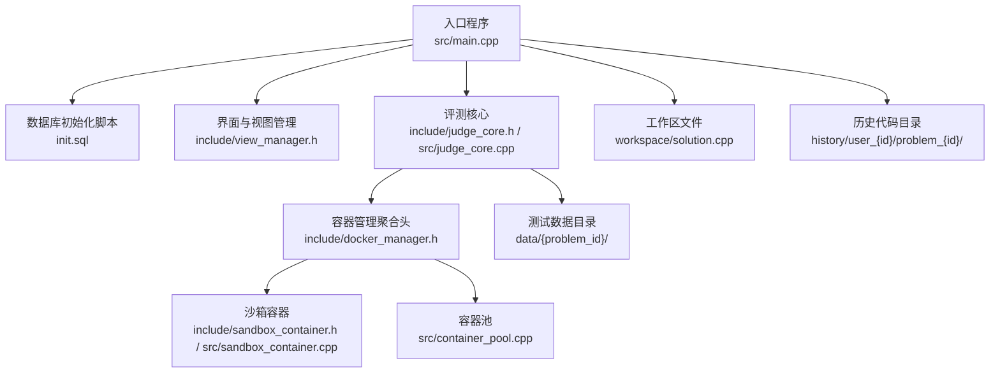
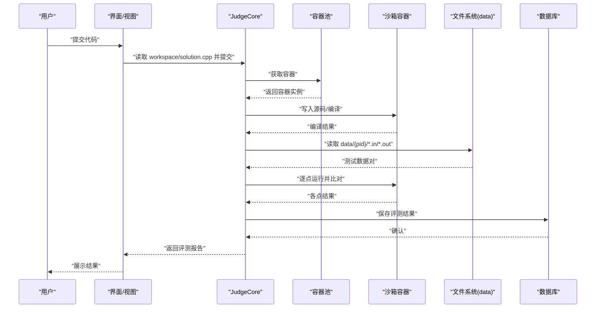
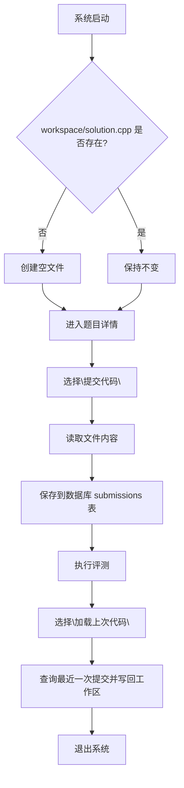
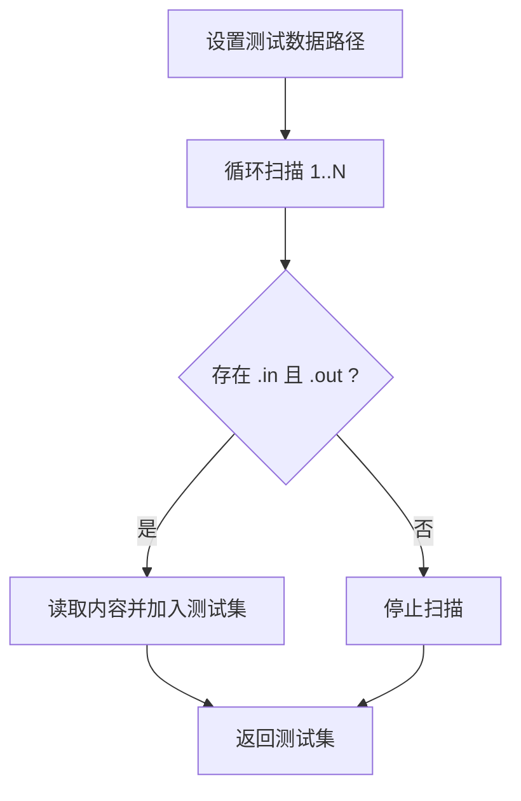
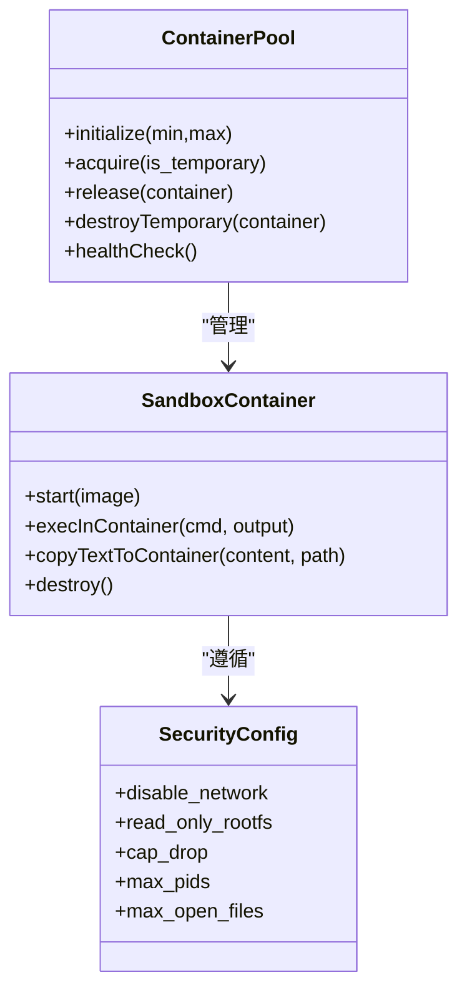
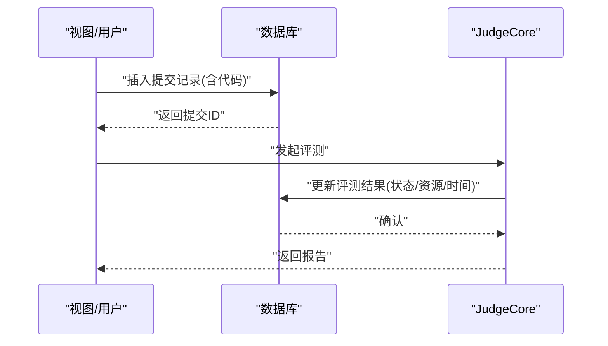
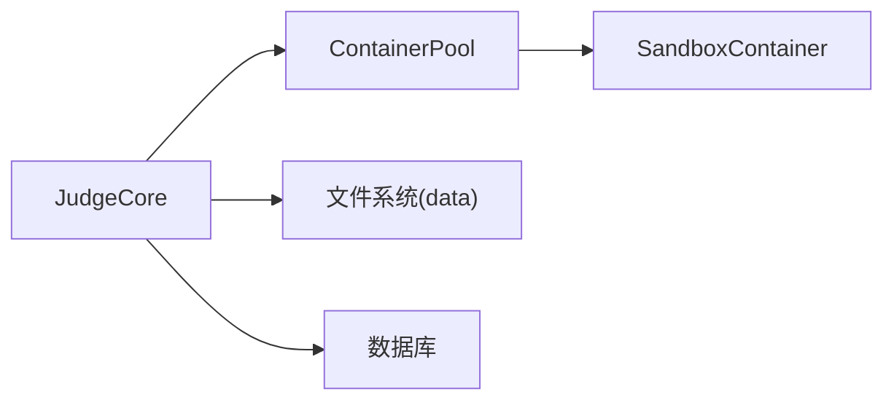

# 文件系统设计

<cite>
**本文引用的文件**
- [README.md](file://README.md)
- [setup.sh](file://setup.sh)
- [init.sql](file://init.sql)
- [main.cpp](file://src/main.cpp)
- [db_manager.h](file://include/db_manager.h)
- [db_manager.cpp](file://src/db_manager.cpp)
- [judge_core.h](file://include/judge_core.h)
- [judge_core.cpp](file://src/judge_core.cpp)
- [docker_manager.h](file://include/docker_manager.h)
- [sandbox_container.h](file://include/sandbox_container.h)
- [sandbox_container.cpp](file://src/sandbox_container.cpp)
- [container_pool.cpp](file://src/container_pool.cpp)
- [code_submission_design.md](file://docs/code_submission_design.md)
- [judge_implementation_plan.md](file://docs/judge_implementation_plan.md)
- [.gitignore](file://.gitignore)
- [data/1/4.in](file://data/1/4.in)
- [data/2/5.out](file://data/2/5.out)
</cite>

## 目录
1. [简介](#简介)
2. [项目结构](#项目结构)
3. [核心组件](#核心组件)
4. [架构总览](#架构总览)
5. [详细组件分析](#详细组件分析)
6. [依赖分析](#依赖分析)
7. [性能考量](#性能考量)
8. [故障排查指南](#故障排查指南)
9. [结论](#结论)
10. [附录](#附录)

## 简介
本文件系统设计面向 OJ 在线评测系统，围绕“工作区文件管理、测试数据组织、历史代码存储、文件权限与安全、文件与数据库同步一致性、API 接口与使用示例、性能优化与存储成本控制、备份与归档策略”等方面进行系统化说明。结合现有代码与设计文档，给出可落地的实现建议与最佳实践。

## 项目结构
- 顶层入口与初始化
  - 入口程序负责启动界面与登录菜单，随后根据用户角色建立数据库连接。
  - 初始化脚本负责创建必要的目录与数据库环境。
- 数据层
  - 数据库初始化脚本创建题目、用户、提交记录等表，并设置数据库用户与权限。
- 评测核心
  - 评测流程通过 JudgeCore 调用容器池与沙箱容器执行编译与运行，读取测试数据目录中的 .in/.out 文件对进行比对。
- 工作区与历史代码
  - 设计文档提出统一工作区文件 workspace/solution.cpp，提交时读取其内容保存至数据库 submissions 表；历史代码下载到 history/user_{id}/problem_{id}/ 下，采用带时间戳的命名规范。
- 测试数据
  - 测试数据按题目 ID 分类存放于 data/{problem_id}/ 目录，文件名为自然序号的 .in/.out。

**图表来源**
- [main.cpp:1-14](file://src/main.cpp#L1-L14)
- [init.sql:1-278](file://init.sql#L1-L278)
- [judge_core.h:111-186](file://include/judge_core.h#L111-L186)
- [judge_core.cpp:126-264](file://src/judge_core.cpp#L126-L264)
- [docker_manager.h:1-17](file://include/docker_manager.h#L1-L17)
- [sandbox_container.h:1-121](file://include/sandbox_container.h#L1-L121)
- [container_pool.cpp:81-117](file://src/container_pool.cpp#L81-L117)
- [code_submission_design.md:289-420](file://docs/code_submission_design.md#L289-L420)

**章节来源**
- [README.md:1-2](file://README.md#L1-L2)
- [setup.sh:1-41](file://setup.sh#L1-L41)
- [init.sql:1-278](file://init.sql#L1-L278)
- [main.cpp:1-14](file://src/main.cpp#L1-L14)

## 核心组件
- 数据库管理
  - DatabaseManager 封装连接与 SQL 执行，提供查询与转义能力，便于在评测与历史管理中统一访问。
- 评测核心
  - JudgeCore 负责配置、源码注入、测试数据加载、容器编译运行、结果汇总与持久化接口占位。
- 容器与池化
  - SandboxContainer 提供容器生命周期与命令执行；ContainerPool 提供常驻与临时容器的获取、复用与销毁。
- 工作区与历史代码
  - 设计文档定义统一工作区文件 workspace/solution.cpp，以及历史代码目录与命名规范；提供读取、写入、确保存在、下载与加载到工作区等接口设计。

**章节来源**
- [db_manager.h:12-53](file://include/db_manager.h#L12-L53)
- [db_manager.cpp:9-110](file://src/db_manager.cpp#L9-L110)
- [judge_core.h:111-186](file://include/judge_core.h#L111-L186)
- [judge_core.cpp:126-264](file://src/judge_core.cpp#L126-L264)
- [sandbox_container.h:1-121](file://include/sandbox_container.h#L1-L121)
- [container_pool.cpp:81-117](file://src/container_pool.cpp#L81-L117)
- [code_submission_design.md:42-128](file://docs/code_submission_design.md#L42-L128)
- [code_submission_design.md:289-420](file://docs/code_submission_design.md#L289-L420)

## 架构总览
评测流程从用户提交代码开始，经 JudgeCore 调度容器池，读取 data/{problem_id}/ 下的 .in/.out 文件进行比对，最终将结果写入数据库 submissions 表。工作区文件与历史代码目录作为用户侧与持久化侧的补充，分别服务于“当前编辑”和“历史追溯”。

**图表来源**
- [judge_core.cpp:126-264](file://src/judge_core.cpp#L126-L264)
- [judge_core.h:111-186](file://include/judge_core.h#L111-L186)
- [sandbox_container.cpp:65-104](file://src/sandbox_container.cpp#L65-L104)
- [container_pool.cpp:81-117](file://src/container_pool.cpp#L81-L117)
- [init.sql:42-61](file://init.sql#L42-L61)

## 详细组件分析

### 工作区文件管理机制
- 统一工作区
  - 使用单一文件 workspace/solution.cpp 作为用户编辑入口，提交时读取其内容保存到数据库 submissions 表，文件本身保持不变，便于下次继续编辑。
- 生命周期
  - 系统启动时检查文件是否存在，不存在则创建空文件；退出系统后文件保留，下次继续。
- 接口设计
  - 读取、写入、确保存在、统计行数等操作均围绕 workspace/solution.cpp 展开。
- 版本与历史
  - 历史代码下载到 history/user_{id}/problem_{id}/ 目录，采用 submit_{n}_{YYYYMMDD}_{HHMMSS}.cpp 命名，便于追溯与对比。

**图表来源**
- [code_submission_design.md:42-128](file://docs/code_submission_design.md#L42-L128)
- [code_submission_design.md:289-420](file://docs/code_submission_design.md#L289-L420)

**章节来源**
- [code_submission_design.md:36-128](file://docs/code_submission_design.md#L36-L128)
- [code_submission_design.md:289-420](file://docs/code_submission_design.md#L289-L420)
- [.gitignore:462-468](file://.gitignore#L462-L468)

### 测试数据文件组织
- 目录结构
  - data/{problem_id}/ 下存放该题目的测试数据，文件名为自然序号的 .in/.out。
- 加载策略
  - JudgeCore 通过循环遍历 1.in/1.out … N.in/N.out 的方式读取测试数据对，若任一文件缺失则提前结束。
- 示例
  - data/1/4.in 与 data/2/5.out 分别代表题目 1 的输入样例与题目 2 的期望输出。

**图表来源**
- [judge_core.cpp:73-94](file://src/judge_core.cpp#L73-L94)
- [data/1/4.in:1-2](file://data/1/4.in#L1-L2)
- [data/2/5.out:1-2](file://data/2/5.out#L1-L2)

**章节来源**
- [judge_core.cpp:73-94](file://src/judge_core.cpp#L73-L94)
- [data/1/4.in:1-2](file://data/1/4.in#L1-L2)
- [data/2/5.out:1-2](file://data/2/5.out#L1-L2)

### 文件权限控制与安全访问
- 容器安全
  - 沙箱容器启动时禁用网络、只读根文件系统、丢弃所有 capabilities、限制进程与打开文件数、使用 tmpfs 作为可写目录，避免持久化风险。
- 评测隔离
  - 评测过程在容器内执行，宿主机仅通过 docker exec 与 cp 与容器交互，减少攻击面。
- 文件系统隔离
  - 测试数据以只读挂载进入容器，工作区与历史目录位于宿主机，受操作系统权限与 .gitignore 控制，避免纳入版本管理。

**图表来源**
- [sandbox_container.cpp:65-104](file://src/sandbox_container.cpp#L65-L104)
- [container_pool.cpp:81-117](file://src/container_pool.cpp#L81-L117)
- [judge_implementation_plan.md:220-310](file://docs/judge_implementation_plan.md#L220-L310)

**章节来源**
- [sandbox_container.cpp:65-104](file://src/sandbox_container.cpp#L65-L104)
- [judge_implementation_plan.md:220-310](file://docs/judge_implementation_plan.md#L220-L310)
- [.gitignore:462-468](file://.gitignore#L462-L468)

### 文件系统与数据库同步机制与一致性
- 写入路径
  - 提交流程：读取工作区文件内容 → 保存到数据库 submissions 表 → 执行评测 → 结果写回数据库。
- 字段映射
  - 评测结果字段包括状态、耗时、内存、错误信息、通过点数、总点数等，与 submissions 表字段一一对应。
- 一致性保障
  - 通过数据库事务与行级隔离（oj_user 仅能访问自身记录）保证数据一致性；评测结果写回在评测完成后进行。

**图表来源**
- [code_submission_design.md:444-468](file://docs/code_submission_design.md#L444-L468)
- [init.sql:42-61](file://init.sql#L42-L61)
- [judge_core.cpp:251-258](file://src/judge_core.cpp#L251-L258)

**章节来源**
- [code_submission_design.md:422-468](file://docs/code_submission_design.md#L422-L468)
- [init.sql:42-61](file://init.sql#L42-L61)
- [judge_core.cpp:251-258](file://src/judge_core.cpp#L251-L258)

### 文件操作 API 与使用示例
- 工作区文件操作（设计接口）
  - 读取工作区文件内容、写入工作区文件、确保文件存在、统计行数。
- 历史代码管理（设计接口）
  - 获取提交列表、获取指定提交代码、获取最近一次提交代码、下载指定提交代码到文件、加载指定提交代码到工作区。
- 使用示例（概念性）
  - 提交代码：从工作区读取内容 → 调用提交接口 → 评测完成后写回结果。
  - 加载上次代码：查询最近一次提交 → 写回工作区。
  - 下载历史：按用户与题目隔离创建目录 → 生成带时间戳的文件名 → 写入文件。

**章节来源**
- [code_submission_design.md:67-128](file://docs/code_submission_design.md#L67-L128)
- [code_submission_design.md:369-400](file://docs/code_submission_design.md#L369-L400)
- [code_submission_design.md:473-498](file://docs/code_submission_design.md#L473-L498)

### 清理策略
- 容器清理
  - 常驻容器在归还时重置（清理 /sandbox 内容），临时容器在使用后销毁。
- 工作区与历史目录
  - 工作区文件在退出系统后保留；历史目录按用户与题目隔离，便于按需清理。
- .gitignore
  - 工作区文件与历史目录不在版本控制范围内，避免污染仓库。

**章节来源**
- [container_pool.cpp:97-117](file://src/container_pool.cpp#L97-L117)
- [code_submission_design.md:42-128](file://docs/code_submission_design.md#L42-L128)
- [.gitignore:462-468](file://.gitignore#L462-L468)

## 依赖分析
- 组件耦合
  - JudgeCore 依赖容器池与沙箱容器；容器池依赖沙箱容器；评测流程依赖文件系统与数据库。
- 外部依赖
  - Docker 作为容器运行时；MySQL 作为数据存储；CMake/构建工具链。
- 潜在环路
  - 评测流程自上而下，未见循环依赖；容器池与沙箱容器为低耦合的协作关系。

**图表来源**
- [judge_core.h:111-186](file://include/judge_core.h#L111-L186)
- [container_pool.cpp:81-117](file://src/container_pool.cpp#L81-L117)
- [sandbox_container.h:1-121](file://include/sandbox_container.h#L1-L121)

**章节来源**
- [judge_core.h:111-186](file://include/judge_core.h#L111-L186)
- [container_pool.cpp:81-117](file://src/container_pool.cpp#L81-L117)
- [sandbox_container.h:1-121](file://include/sandbox_container.h#L1-L121)

## 性能考量
- 容器预热与复用
  - 系统启动时预创建常驻容器，减少启动延迟；评测完成后重置而非销毁，提升复用效率。
- 资源限制与监控
  - 通过 cgroup 与 Docker 限制 CPU、内存、进程数与输出大小，结合实时监控判定 TLE/MLE。
- 并发评测
  - 容器池动态扩容，支持多任务并发，提高吞吐量。
- 存储成本控制
  - 评测使用 tmpfs 作为可写目录，避免磁盘 IO；历史代码按需下载，减少长期占用。

**章节来源**
- [judge_implementation_plan.md:641-685](file://docs/judge_implementation_plan.md#L641-L685)
- [judge_implementation_plan.md:312-390](file://docs/judge_implementation_plan.md#L312-L390)
- [sandbox_container.cpp:65-104](file://src/sandbox_container.cpp#L65-L104)

## 故障排查指南
- 容器相关
  - 启动失败：检查 Docker 服务状态与权限；确认镜像构建成功；查看容器日志。
  - 超时/超限：检查资源限制配置与监控指标；适当放宽时限或内存。
- 文件系统相关
  - 测试数据缺失：确认 data/{problem_id}/ 下 .in/.out 文件命名与数量；确保只读挂载正确。
  - 权限问题：确认工作区与历史目录权限；避免版本控制污染。
- 数据库相关
  - 连接失败：检查 init.sql 初始化结果与用户权限；确认连接参数。
  - 写入失败：检查 submissions 表字段与转义逻辑；查看错误输出。

**章节来源**
- [sandbox_container.cpp:65-104](file://src/sandbox_container.cpp#L65-L104)
- [judge_core.cpp:126-264](file://src/judge_core.cpp#L126-L264)
- [db_manager.cpp:9-110](file://src/db_manager.cpp#L9-L110)
- [init.sql:68-95](file://init.sql#L68-L95)

## 结论
本设计以容器化为核心，结合工作区文件与历史代码目录，形成“用户侧编辑—评测侧隔离—持久化侧追溯”的完整闭环。通过严格的权限控制、资源限制与清理策略，既保证评测的安全与稳定，又兼顾性能与成本控制。后续可按阶段推进工作区统一、AI 上下文增强与历史管理完善，逐步实现端到端的文件系统与数据一致性保障。

## 附录
- 目录与文件命名建议
  - 工作区：workspace/solution.cpp
  - 历史目录：history/user_{id}/problem_{id}/
  - 历史文件命名：submit_{n}_{YYYYMMDD}_{HHMMSS}.cpp
- 初始化与部署
  - 使用 setup.sh 创建 build/test_data 目录并初始化数据库；按需构建 judge-sandbox 镜像并配置 Docker。

**章节来源**
- [setup.sh:8-30](file://setup.sh#L8-L30)
- [code_submission_design.md:289-420](file://docs/code_submission_design.md#L289-L420)
- [judge_implementation_plan.md:688-724](file://docs/judge_implementation_plan.md#L688-L724)