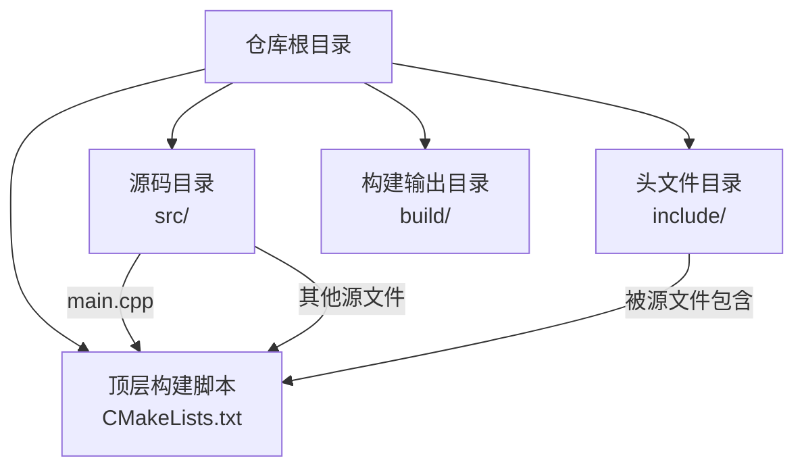
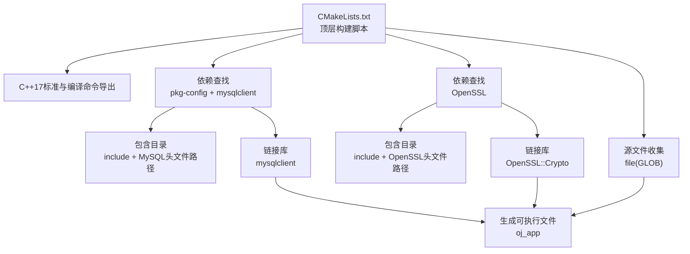
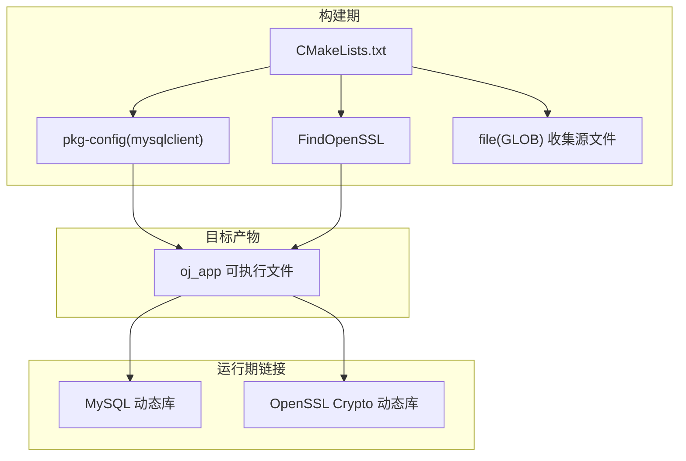

# CMake构建系统

<cite>
**本文引用的文件**
- [CMakeLists.txt](file://CMakeLists.txt)
- [main.cpp](file://src/main.cpp)
- [view_manager.h](file://include/view_manager.h)
- [view_manager.cpp](file://src/view_manager.cpp)
- [db_manager.h](file://include/db_manager.h)
- [db_manager.cpp](file://src/db_manager.cpp)
- [admin.cpp](file://src/admin.cpp)
- [.gitignore](file://.gitignore)
</cite>

## 目录
1. [简介](#简介)
2. [项目结构](#项目结构)
3. [核心组件](#核心组件)
4. [架构总览](#架构总览)
5. [详细组件分析](#详细组件分析)
6. [依赖关系分析](#依赖关系分析)
7. [性能考虑](#性能考虑)
8. [故障排查指南](#故障排查指南)
9. [结论](#结论)
10. [附录](#附录)

## 简介
本文件面向OJ系统的CMake构建系统，围绕C++17标准设置、依赖查找机制（pkg-config）、包含目录配置、链接库管理、源文件收集策略、可执行文件生成流程进行深入解析，并提供编译选项配置指南（调试与发布差异）、跨平台与交叉编译建议、最佳实践与常见问题解决方案，帮助开发者高效、稳定地构建与维护该系统。

## 项目结构
该项目采用“顶层CMakeLists.txt + 源码与头文件分层”的组织方式：
- 顶层构建脚本负责定义C++标准、导出编译命令、查找依赖、收集源文件、生成可执行文件并完成链接。
- 源文件位于src目录，头文件位于include目录；入口程序位于src/main.cpp。
- 构建产物默认生成于构建目录（如build），可通过CMake配置指定。

图表来源
- [CMakeLists.txt](file://CMakeLists.txt)
- [main.cpp](file://src/main.cpp)

章节来源
- [CMakeLists.txt](file://CMakeLists.txt)
- [main.cpp](file://src/main.cpp)

## 核心组件
本节从构建系统视角拆解CMakeLists.txt的关键步骤与职责：
- C++17标准与编译命令导出：确保编译器特性与IDE/工具链协同开发体验。
- 依赖查找与包含目录：通过pkg-config定位mysqlclient，通过FindOpenSSL定位OpenSSL，统一纳入include_directories。
- 源文件收集与可执行文件生成：使用GLOB收集src下所有.cpp文件，生成oj_app可执行文件。
- 链接库管理：私有链接mysqlclient与OpenSSL::Crypto，保证目标二进制的运行时依赖完整。

章节来源
- [CMakeLists.txt](file://CMakeLists.txt)

## 架构总览
下图展示CMake构建阶段与目标产物之间的关系，以及依赖注入路径：

图表来源
- [CMakeLists.txt](file://CMakeLists.txt)

## 详细组件分析

### 组件一：C++17标准与编译命令导出
- 目的：统一编译器标准，提升跨平台一致性；导出compile_commands.json便于clang-tidy、补全等工具使用。
- 关键点：明确C++17标准与必需性；开启编译命令导出。

章节来源
- [CMakeLists.txt](file://CMakeLists.txt)

### 组件二：依赖查找与包含目录
- 依赖查找
  - 使用pkg-config定位mysqlclient，要求存在且满足条件。
  - 使用FindOpenSSL模块定位OpenSSL，要求存在。
- 包含目录
  - include_directories统一添加include目录、MySQL头文件路径与OpenSSL头文件路径，确保源码能正确包含第三方头文件。

章节来源
- [CMakeLists.txt](file://CMakeLists.txt)

### 组件三：源文件收集策略
- 使用file(GLOB SOURCES "src/*.cpp")收集src目录下的所有.cpp文件，形成SOURCES变量。
- 优点：无需手动维护源文件清单，新增.cpp文件即被纳入构建。
- 注意事项：GLOB对通配符展开顺序不保证，建议在大型项目中改用显式列表以增强确定性与可维护性。

章节来源
- [CMakeLists.txt](file://CMakeLists.txt)

### 组件四：可执行文件生成
- add_executable(oj_app ${SOURCES})基于SOURCES生成oj_app可执行文件。
- 入口程序位于src/main.cpp，其包含view_manager.h，体现UI入口与视图管理器的协作。

章节来源
- [CMakeLists.txt](file://CMakeLists.txt)
- [main.cpp](file://src/main.cpp)
- [view_manager.h](file://include/view_manager.h)

### 组件五：链接库管理
- target_link_libraries(oj_app PRIVATE ${MYSQL_LIBRARIES} OpenSSL::Crypto)完成私有链接：
  - 私有链接避免将MySQL与OpenSSL的符号暴露给上游目标。
  - 使用OpenSSL::Crypto目标名，符合现代CMake命名约定。
  - MySQL库由pkg-config变量提供，确保链接参数完整。

章节来源
- [CMakeLists.txt](file://CMakeLists.txt)

### 组件六：调试与诊断
- message输出当前收集到的源文件、MySQL库与OpenSSL库，便于快速定位配置问题。
- 建议在CI或本地调试时结合这些输出检查依赖是否正确解析。

章节来源
- [CMakeLists.txt](file://CMakeLists.txt)

### 组件七：入口程序与视图管理器
- main.cpp通过包含view_manager.h创建ViewManager实例并启动登录菜单，体现UI入口职责。
- ViewManager内部组合AdminView与UserView，负责菜单交互与流程控制。

章节来源
- [main.cpp](file://src/main.cpp)
- [view_manager.h](file://include/view_manager.h)
- [view_manager.cpp](file://src/view_manager.cpp)

### 组件八：数据库管理器
- db_manager.h声明DatabaseManager类，封装MySQL连接与SQL执行能力。
- db_manager.cpp实现连接初始化、真实连接、SQL执行与结果处理，直接包含mysql/mysql.h，验证MySQL头文件已通过CMake加入包含目录。

章节来源
- [db_manager.h](file://include/db_manager.h)
- [db_manager.cpp](file://src/db_manager.cpp)

### 组件九：管理员功能（示例）
- admin.cpp演示如何通过DatabaseManager执行SQL与查询，体现数据库操作在业务层的应用。

章节来源
- [admin.cpp](file://src/admin.cpp)

## 依赖关系分析
下图展示构建期依赖与运行期链接的关系，以及源码对头文件的依赖：

图表来源
- [CMakeLists.txt](file://CMakeLists.txt)

章节来源
- [CMakeLists.txt](file://CMakeLists.txt)

## 性能考虑
- 源文件收集策略
  - 当前使用GLOB自动收集，适合小型/中型项目；若源文件众多，建议改为显式列表，减少不必要的扫描与重构建。
- 编译命令导出
  - 开启CMAKE_EXPORT_COMPILE_COMMANDS便于工具链优化与静态分析，但会增加构建开销，可在CI中按需启用。
- 依赖查找
  - pkg-config与Find模块分别负责不同库，建议在多平台场景下统一通过Find模块或包管理器，减少对系统工具的耦合。

## 故障排查指南
- 无法找到mysqlclient
  - 症状：pkg_check_modules(mysqlclient ...)报错。
  - 排查：确认系统已安装libmysqlclient-dev（或对应包）及pkg-config；检查mysql_config路径是否在PATH中。
- 无法找到OpenSSL
  - 症状：find_package(OpenSSL ...)报错。
  - 排查：确认系统已安装OpenSSL开发包；检查OpenSSL安装路径是否被CMake搜索到；必要时设置OPENSSL_ROOT_DIR。
- 头文件包含失败
  - 症状：编译时报找不到<mysql/mysql.h>或OpenSSL头文件。
  - 排查：确认include_directories已包含include、MySQL与OpenSSL头文件路径；检查CMake输出的包含目录是否正确。
- 链接失败
  - 症状：链接阶段找不到MySQL或OpenSSL符号。
  - 排查：确认target_link_libraries已私有链接${MYSQL_LIBRARIES}与OpenSSL::Crypto；检查动态库路径是否在系统加载器搜索范围内。
- 源文件未被纳入构建
  - 症状：新增.cpp文件后未参与编译。
  - 排查：确认file(GLOB)范围覆盖新文件；或改用显式列表以消除不确定性。
- 构建输出位置与清理
  - 建议在独立的build目录进行构建；使用make clean或cmake --build ... --target clean清理；必要时删除build目录重新生成。

章节来源
- [CMakeLists.txt](file://CMakeLists.txt)

## 结论
本CMake构建系统以简洁清晰的方式实现了C++17标准、依赖查找、包含目录与链接库的完整闭环，配合GLOB自动收集源文件，能够快速产出oj_app可执行文件。建议在生产与大型项目中进一步规范化源文件清单、统一依赖发现方式，并根据平台差异完善交叉编译与多配置支持，以获得更稳健的构建体验。

## 附录

### 编译选项配置指南（调试与发布）
- 调试版本
  - 建议启用符号信息与断言：在CMake中设置CMAKE_BUILD_TYPE=Debug；可选开启Werror与asan/tsan等诊断选项（按需）。
- 发布版本
  - 建议启用优化与裁剪：设置CMAKE_BUILD_TYPE=Release；开启-O3/-Os、-DNDEBUG等；按需开启strip。
- 跨平台差异
  - Windows：注意MSVC与MinGW的差异，必要时设置Visual Studio Generator或Toolchain文件。
  - Linux/macOS：优先使用系统包管理器安装依赖，或通过Homebrew/ports补充缺失组件。
- 交叉编译
  - 使用Toolchain文件指定目标体系结构、工具链前缀与sysroot；在CMake中通过-D CMAKE_TOOLCHAIN_FILE=...指定。
- 最佳实践
  - 明确区分公共/私有链接，避免污染接口。
  - 对第三方库尽量使用现代CMake目标名（如OpenSSL::Crypto），提升可移植性。
  - 固定CMake最低版本与C++标准，减少环境差异带来的问题。
  - 在CI中缓存依赖与构建产物，提升效率。

### 常见问题与解决方案速查
- 依赖未被发现：检查系统包与pkg-config/OpenSSL安装状态，必要时设置ROOT_DIR变量。
- 头文件路径错误：核对include_directories顺序与变量拼接是否正确。
- 链接库缺失：核对target_link_libraries与目标名是否匹配。
- 源文件遗漏：改用显式列表或调整GLOB范围。
- 构建目录污染：使用独立build目录并定期清理。