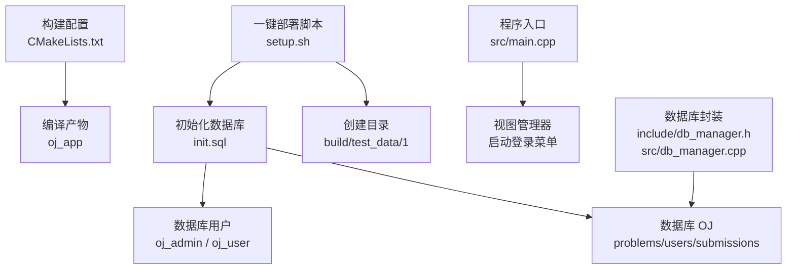
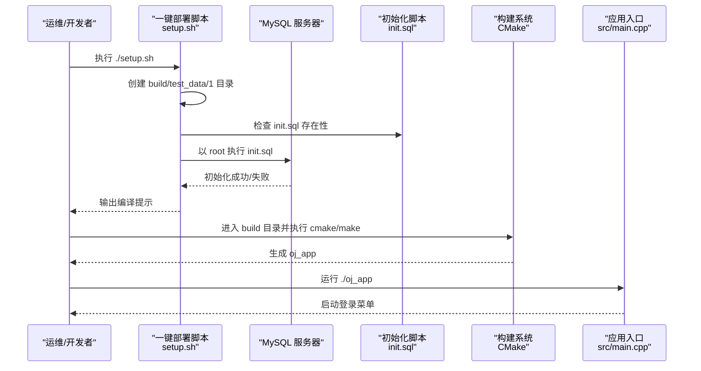
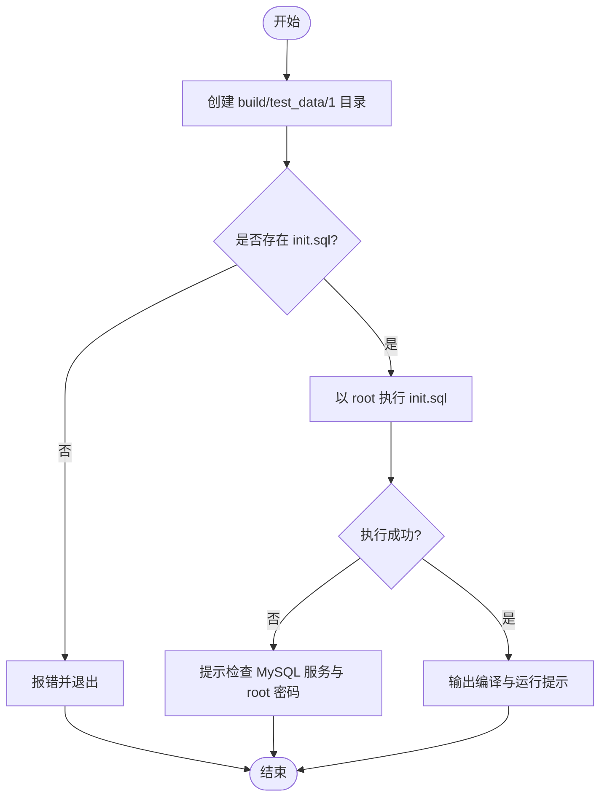
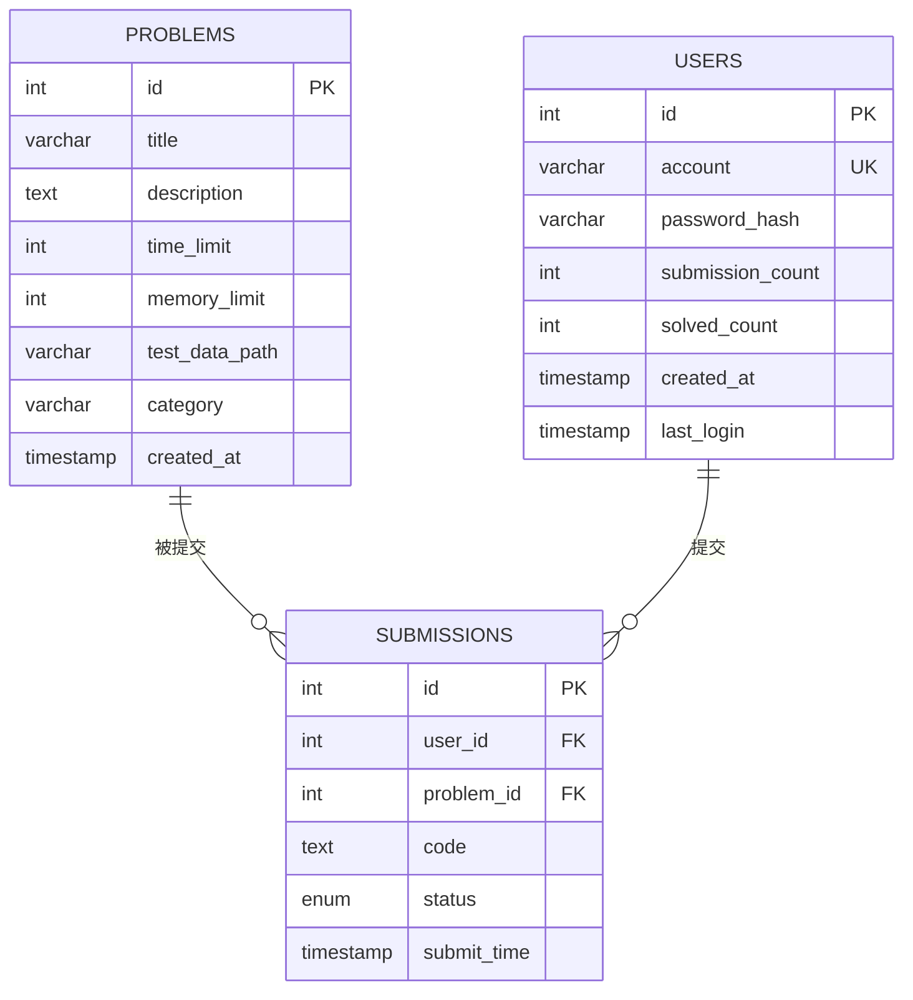
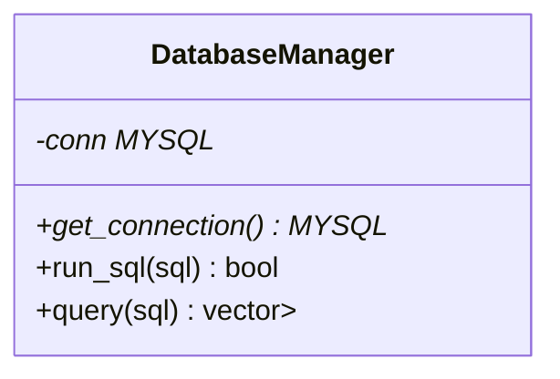
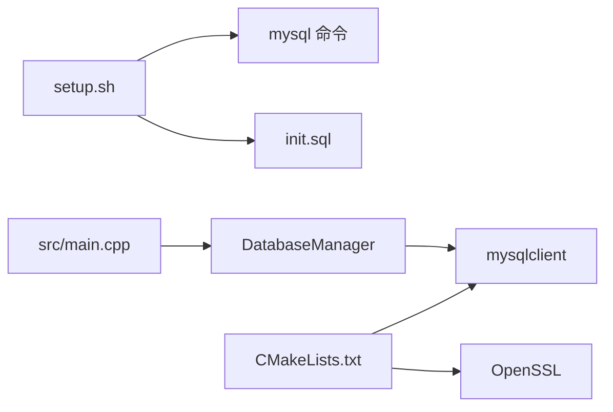

# 一键部署脚本

<cite>
**本文引用的文件**
- [setup.sh](file://setup.sh)
- [init.sql](file://init.sql)
- [CMakeLists.txt](file://CMakeLists.txt)
- [README.md](file://README.md)
- [src/main.cpp](file://src/main.cpp)
- [include/db_manager.h](file://include/db_manager.h)
- [src/db_manager.cpp](file://src/db_manager.cpp)
- [History/OJ_v0.1.md](file://History/OJ_v0.1.md)
- [docs/code_submission_design.md](file://docs/code_submission_design.md)
</cite>

## 目录
1. [简介](#简介)
2. [项目结构](#项目结构)
3. [核心组件](#核心组件)
4. [架构总览](#架构总览)
5. [详细组件分析](#详细组件分析)
6. [依赖分析](#依赖分析)
7. [性能考虑](#性能考虑)
8. [故障排除指南](#故障排除指南)
9. [结论](#结论)
10. [附录](#附录)

## 简介
本文件为 OJ 系统一键部署脚本的完整文档，聚焦于 setup.sh 的执行流程与 init.sql 的数据库初始化设计，涵盖环境检查、依赖安装、数据库初始化与系统配置。文档同时解释 MySQL 自动安装与配置过程（oj_admin 与 oj_user 用户创建）、init.sql 中的表结构设计与权限分配机制，并提供部署前准备清单、故障排除指南与生产环境最佳实践，帮助运维人员高效完成部署与维护。

## 项目结构
OJ 项目采用 C++17 + MySQL 的传统命令行架构，构建系统使用 CMake。一键部署脚本负责创建必要目录、初始化数据库并提示后续编译步骤。核心文件与职责如下：
- setup.sh：一键部署脚本，负责创建目录、初始化数据库、提示编译步骤
- init.sql：数据库初始化脚本，创建数据库、表、用户并注入示例数据
- CMakeLists.txt：构建配置，查找 mysqlclient 与 OpenSSL 并链接
- include/db_manager.h / src/db_manager.cpp：数据库连接与查询封装
- src/main.cpp：程序入口，启动视图管理器
- History/OJ_v0.1.md：系统架构与接口说明文档
- docs/code_submission_design.md：工作区与历史管理设计（扩展方向）

图表来源
- [setup.sh:1-41](file://setup.sh#L1-L41)
- [init.sql:1-278](file://init.sql#L1-L278)
- [CMakeLists.txt:1-40](file://CMakeLists.txt#L1-L40)
- [src/main.cpp:1-14](file://src/main.cpp#L1-L14)
- [include/db_manager.h:1-53](file://include/db_manager.h#L1-L53)
- [src/db_manager.cpp:1-100](file://src/db_manager.cpp#L1-L100)

章节来源
- [setup.sh:1-41](file://setup.sh#L1-L41)
- [CMakeLists.txt:1-40](file://CMakeLists.txt#L1-L40)
- [src/main.cpp:1-14](file://src/main.cpp#L1-L14)

## 核心组件
- 一键部署脚本（setup.sh）
  - 创建 build 与 test_data/1 目录
  - 检查 init.sql 存在性并以 root 权限执行初始化
  - 输出编译与运行提示
- 数据库初始化脚本（init.sql）
  - 创建数据库 OJ
  - 创建 problems、users、submissions 表
  - 配置 MySQL 密码策略（validate_password）
  - 创建数据库用户 oj_admin（全权限）与 oj_user（受限权限）
  - 注入示例数据（题目与平台用户）
- 数据库管理封装（include/db_manager.h, src/db_manager.cpp）
  - 封装连接、查询与 SQL 执行
  - 提供面向应用的查询结果结构化返回
- 构建配置（CMakeLists.txt）
  - 查找 mysqlclient 与 OpenSSL
  - 生成可执行文件 oj_app

章节来源
- [setup.sh:1-41](file://setup.sh#L1-L41)
- [init.sql:1-278](file://init.sql#L1-L278)
- [include/db_manager.h:1-53](file://include/db_manager.h#L1-L53)
- [src/db_manager.cpp:1-100](file://src/db_manager.cpp#L1-L100)
- [CMakeLists.txt:1-40](file://CMakeLists.txt#L1-L40)

## 架构总览
一键部署脚本与数据库初始化共同构成系统上线的“基础设施层”，随后通过 CMake 构建与运行时的数据库访问层协同工作。

图表来源
- [setup.sh:14-41](file://setup.sh#L14-L41)
- [init.sql:1-278](file://init.sql#L1-L278)
- [CMakeLists.txt:1-40](file://CMakeLists.txt#L1-L40)
- [src/main.cpp:1-14](file://src/main.cpp#L1-L14)

## 详细组件分析

### 一键部署脚本（setup.sh）执行流程
- 目录创建
  - 自动创建 build 与 test_data/1 目录，便于后续编译与测试数据放置
- 数据库初始化
  - 检查 init.sql 是否存在
  - 以 root 用户身份执行 init.sql，完成数据库、表、用户与示例数据的创建
  - 若执行失败，提示检查 MySQL 服务状态与 root 密码
- 编译提示
  - 输出进入 build、执行 cmake 与 make 的步骤，以及运行 ./oj_app 的说明

图表来源
- [setup.sh:8-41](file://setup.sh#L8-L41)

章节来源
- [setup.sh:1-41](file://setup.sh#L1-L41)

### 数据库初始化脚本（init.sql）设计
- 数据库与字符集
  - 创建数据库 OJ，设置 utf8mb4 与排序规则
- 表结构设计
  - problems：题目元信息（标题、描述、时限、内存、测试数据路径、分类、创建时间）
  - users：平台用户（账号唯一、密码哈希、提交数、解题数、注册与最后登录时间，含索引）
  - submissions：提交记录（外键关联 users 与 problems，状态枚举，提交时间，含索引）
- 权限与用户
  - oj_admin（localhost，全权限）：SELECT/INSERT/UPDATE/DELETE OJ.*
  - oj_user（%，远程），受限权限：
    - problems：只读
    - users：可插入新用户、查询与更新自身账号/密码
    - submissions：可插入新提交、查询历史
  - 刷新权限 FLUSH PRIVILEGES
- 示例数据
  - 插入多道示例题目与平台用户（test_user），避免重复插入
- 密码策略
  - 降低 validate_password 策略以适配开发环境（可按生产环境调整）

图表来源
- [init.sql:14-95](file://init.sql#L14-L95)

章节来源
- [init.sql:1-278](file://init.sql#L1-L278)

### 数据库访问封装（DatabaseManager）
- 类职责
  - 封装 MySQL 连接、SQL 执行与查询结果结构化返回
- 关键方法
  - 构造/析构：建立与释放连接
  - run_sql：执行任意 SQL
  - query：执行查询并返回 vector<map<string,string>>
- 依赖
  - mysqlclient（CMake 查找并链接）
  - OpenSSL（用于加密相关能力）

图表来源
- [include/db_manager.h:12-46](file://include/db_manager.h#L12-L46)
- [src/db_manager.cpp:8-79](file://src/db_manager.cpp#L8-L79)

章节来源
- [include/db_manager.h:1-53](file://include/db_manager.h#L1-L53)
- [src/db_manager.cpp:1-100](file://src/db_manager.cpp#L1-L100)
- [CMakeLists.txt:11-34](file://CMakeLists.txt#L11-L34)

### 构建与运行（CMake + main.cpp）
- CMake
  - 设置 C++17 标准与 compile_commands.json
  - 查找 mysqlclient 与 OpenSSL
  - 收集 src/*.cpp，生成 oj_app 并链接库
- 程序入口
  - 初始化视图管理器并启动登录菜单（实际数据库连接在菜单选择角色后建立）

章节来源
- [CMakeLists.txt:1-40](file://CMakeLists.txt#L1-L40)
- [src/main.cpp:1-14](file://src/main.cpp#L1-L14)

### 工作区与历史管理（扩展设计）
- 工作区文件机制
  - 统一工作区文件 workspace/solution.cpp，提交时读取并保存至 submissions.code
  - 支持“加载上次代码”到工作区
- 历史管理
  - 提交记录列表展示与下载到 history/user_{id}/problem_{id}/
  - 下载文件命名规则：submit_{n}_{YYYYMMDD}_{HHMMSS}.cpp
- AI 助手增强
  - 自动携带工作区代码与题目上下文，提升辅助质量

章节来源
- [docs/code_submission_design.md:1-629](file://docs/code_submission_design.md#L1-L629)

## 依赖分析
- 一键部署脚本依赖
  - bash 环境
  - MySQL 客户端（mysql 命令）
  - init.sql 文件存在
- 应用运行时依赖
  - mysqlclient（CMake 查找）
  - OpenSSL
- 运行时耦合
  - DatabaseManager 依赖 MySQL 客户端库
  - 应用通过视图管理器启动，登录后才建立数据库连接

图表来源
- [setup.sh:14-29](file://setup.sh#L14-L29)
- [CMakeLists.txt:11-34](file://CMakeLists.txt#L11-L34)
- [src/db_manager.cpp:61-79](file://src/db_manager.cpp#L61-L79)

章节来源
- [setup.sh:1-41](file://setup.sh#L1-L41)
- [CMakeLists.txt:1-40](file://CMakeLists.txt#L1-L40)
- [src/db_manager.cpp:1-100](file://src/db_manager.cpp#L1-L100)

## 性能考虑
- 数据库性能
  - 表字段与索引设计合理（users.account、submissions.user_id、submissions.problem_id）
  - 使用 InnoDB 引擎，支持外键与事务
- 应用性能
  - DatabaseManager 的查询结果结构化返回，便于前端渲染与日志记录
  - 建议在生产环境启用连接池与慢查询日志
- 构建性能
  - CMake 生成 compile_commands.json，便于工具链与 IDE 使用
  - 链接 mysqlclient 与 OpenSSL，确保运行时性能稳定

[本节为通用指导，不直接分析具体文件]

## 故障排除指南
- 一键部署失败
  - 现象：执行 ./setup.sh 后提示数据库初始化失败
  - 排查：
    - 确认 MySQL 服务已启动且 root 密码正确
    - 确认 init.sql 存在于当前目录
    - 检查 MySQL 客户端版本与权限
- 数据库连接失败
  - 现象：应用运行时报连接失败
  - 排查：
    - 确认 DatabaseManager::connect_db 的参数（host、user、password、dbname）正确
    - 检查 oj_user 的权限是否生效（FLUSH PRIVILEGES）
- 权限不足
  - 现象：执行 SQL 报权限错误
  - 排查：
    - 确认 oj_user 对 problems、users、submissions 的权限已授予
    - 确认 oj_admin 的全权限可用
- 构建失败
  - 现象：cmake/make 报 mysqlclient 或 OpenSSL 找不到
  - 排查：
    - 安装 mysqlclient 开发包与 OpenSSL 开发包
    - 确认 pkg-config 能找到 mysqlclient
- 生产环境建议
  - 更改默认密码（oj_admin 与 oj_user）
  - 限制 oj_user 的来源（如限定 IP）
  - 启用更强的 validate_password 策略
  - 配置备份与监控告警

章节来源
- [setup.sh:16-29](file://setup.sh#L16-L29)
- [init.sql:63-95](file://init.sql#L63-L95)
- [src/db_manager.cpp:61-79](file://src/db_manager.cpp#L61-L79)
- [CMakeLists.txt:11-34](file://CMakeLists.txt#L11-L34)

## 结论
一键部署脚本与数据库初始化脚本共同构成了 OJ 系统的基础设施层，通过明确的目录创建、数据库初始化与权限配置，为后续编译与运行打下坚实基础。结合数据库访问封装与 CMake 构建系统，系统具备清晰的层次结构与良好的可维护性。建议在生产环境中进一步强化安全策略与监控体系，确保系统稳定可靠。

[本节为总结性内容，不直接分析具体文件]

## 附录

### 部署前准备清单
- 系统要求
  - Linux/Unix 环境（推荐 Ubuntu/Debian/CentOS）
  - Bash 与 CMake 3.10+
  - MySQL 服务器（root 权限用于初始化）
  - mysql 客户端命令可用
- 必备软件
  - mysqlclient 开发包
  - OpenSSL 开发包
  - Git（可选，用于克隆仓库）
- 目录与权限
  - 当前目录具备写权限（创建 build/test_data/1）
  - root 权限用于执行 init.sql
- 网络与安全
  - MySQL 服务可被本地/远程访问（根据部署需求）
  - 生产环境建议限制 oj_user 的来源与启用更强密码策略

章节来源
- [setup.sh:14-12](file://setup.sh#L14-L12)
- [CMakeLists.txt:11-14](file://CMakeLists.txt#L11-L14)
- [init.sql:63-95](file://init.sql#L63-L95)

### MySQL 自动安装与配置说明
- 自动安装
  - 一键部署脚本不包含 MySQL 的自动安装逻辑，需手动安装 MySQL 服务器与客户端
- 配置过程
  - 以 root 用户执行 init.sql 完成数据库、表、用户与示例数据的创建
  - oj_admin（localhost）：全权限
  - oj_user（%）：受限权限（problems 只读；users 与 submissions 的选择/插入/更新）
- 密码策略
  - 为适配开发环境，脚本中降低了 validate_password 策略，生产环境应适当提高

章节来源
- [setup.sh:16-29](file://setup.sh#L16-L29)
- [init.sql:63-95](file://init.sql#L63-L95)

### init.sql 中的表结构与权限分配要点
- 表结构
  - problems：题目元信息与分类
  - users：平台用户与登录凭据（密码哈希）
  - submissions：提交记录与状态
- 权限分配
  - oj_admin：对 OJ.* 具有 SELECT/INSERT/UPDATE/DELETE 权限
  - oj_user：对 problems(users) 与 submissions 表具有选择/插入/更新权限
  - FLUSH PRIVILEGES 生效权限

章节来源
- [init.sql:14-95](file://init.sql#L14-L95)

### 生产环境部署最佳实践
- 安全加固
  - 更改 oj_admin 与 oj_user 默认密码
  - 限制 oj_user 的来源（如限定 localhost 或特定网段）
  - 启用更强的 validate_password 策略
- 性能优化
  - 为高频查询字段建立合适索引
  - 启用慢查询日志与连接池
- 可靠性
  - 定期备份数据库
  - 监控 MySQL 与应用进程健康状态
  - 使用 systemd 或容器编排工具管理服务

[本节为通用指导，不直接分析具体文件]