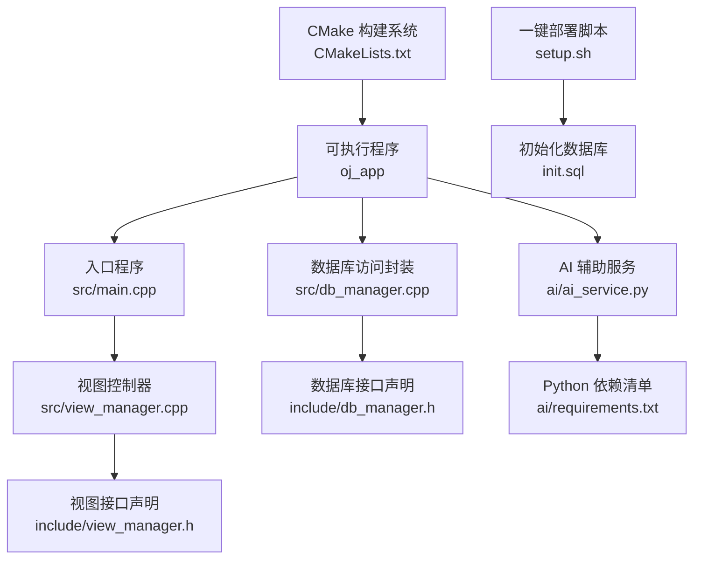
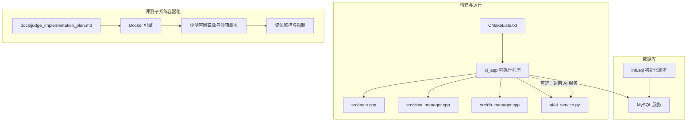
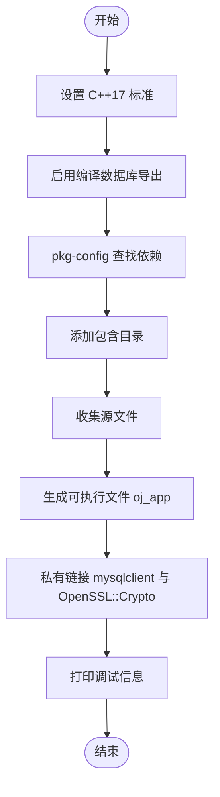
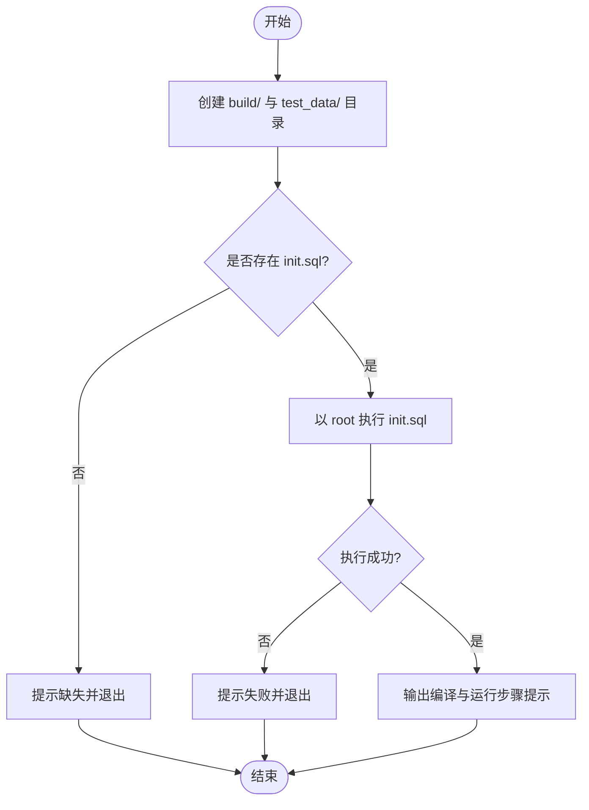
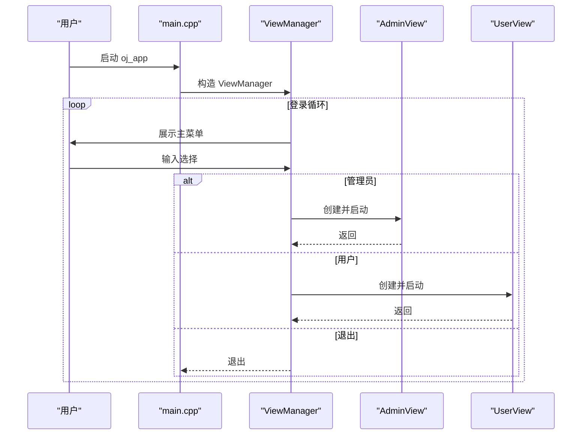
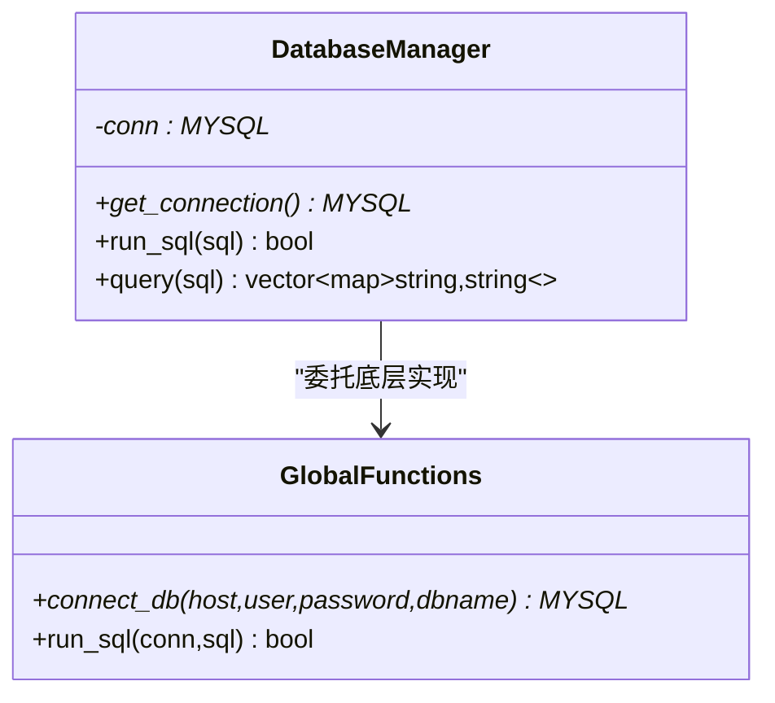
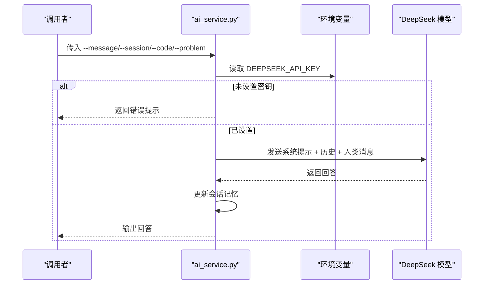
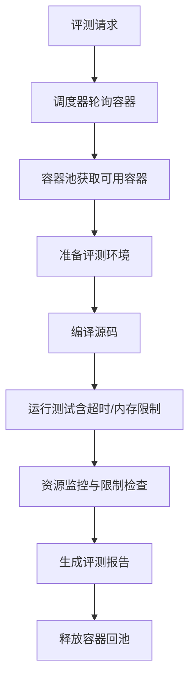
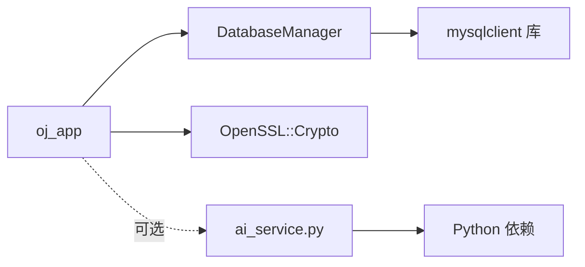

# 构建与部署

<cite>
**本文引用的文件**
- [CMakeLists.txt](file://CMakeLists.txt)
- [setup.sh](file://setup.sh)
- [init.sql](file://init.sql)
- [README.md](file://README.md)
- [src/main.cpp](file://src/main.cpp)
- [include/view_manager.h](file://include/view_manager.h)
- [src/view_manager.cpp](file://src/view_manager.cpp)
- [include/db_manager.h](file://include/db_manager.h)
- [src/db_manager.cpp](file://src/db_manager.cpp)
- [ai/ai_service.py](file://ai/ai_service.py)
- [ai/requirements.txt](file://ai/requirements.txt)
- [docs/judge_implementation_plan.md](file://docs/judge_implementation_plan.md)
</cite>

## 目录
1. [简介](#简介)
2. [项目结构](#项目结构)
3. [核心组件](#核心组件)
4. [架构总览](#架构总览)
5. [详细组件分析](#详细组件分析)
6. [依赖关系分析](#依赖关系分析)
7. [性能考量](#性能考量)
8. [故障排查指南](#故障排查指南)
9. [结论](#结论)
10. [附录](#附录)

## 简介
本文件面向运维工程师与DevOps团队，提供OJ系统的完整构建与部署指南。内容涵盖：
- CMake构建系统配置：编译选项、依赖管理、交叉编译支持建议
- 一键部署脚本：环境检查、依赖安装与系统配置
- 生产环境部署策略：服务器配置、性能调优与监控
- 容器化部署方案：Docker镜像构建与Kubernetes部署思路
- 持续集成与自动化部署最佳实践
- 面向生产的评测子系统（容器化评测机）实现要点

## 项目结构
该项目采用“头文件在include、源码在src”的分层组织方式，配合CMake集中管理编译与链接。入口程序位于src/main.cpp，UI交互由ViewManager负责，数据库访问通过DatabaseManager封装。

图表来源
- [CMakeLists.txt:1-40](file://CMakeLists.txt#L1-L40)
- [src/main.cpp:1-14](file://src/main.cpp#L1-L14)
- [src/view_manager.cpp:1-77](file://src/view_manager.cpp#L1-L77)
- [include/view_manager.h:1-43](file://include/view_manager.h#L1-L43)
- [src/db_manager.cpp:1-100](file://src/db_manager.cpp#L1-L100)
- [include/db_manager.h:1-53](file://include/db_manager.h#L1-L53)
- [ai/ai_service.py:1-113](file://ai/ai_service.py#L1-L113)
- [ai/requirements.txt:1-7](file://ai/requirements.txt#L1-L7)
- [setup.sh:1-41](file://setup.sh#L1-L41)
- [init.sql:1-278](file://init.sql#L1-L278)

章节来源
- [CMakeLists.txt:1-40](file://CMakeLists.txt#L1-L40)
- [src/main.cpp:1-14](file://src/main.cpp#L1-L14)
- [src/view_manager.cpp:1-77](file://src/view_manager.cpp#L1-L77)
- [include/view_manager.h:1-43](file://include/view_manager.h#L1-L43)
- [src/db_manager.cpp:1-100](file://src/db_manager.cpp#L1-L100)
- [include/db_manager.h:1-53](file://include/db_manager.h#L1-L53)
- [ai/ai_service.py:1-113](file://ai/ai_service.py#L1-L113)
- [ai/requirements.txt:1-7](file://ai/requirements.txt#L1-L7)
- [setup.sh:1-41](file://setup.sh#L1-L41)
- [init.sql:1-278](file://init.sql#L1-L278)

## 核心组件
- 构建系统与编译选项
  - C++标准：C++17
  - 导出编译数据库：用于工具链与IDE集成
  - 依赖查找：通过pkg-config定位mysqlclient与OpenSSL
  - 链接策略：私有链接mysqlclient与OpenSSL::Crypto
- 应用入口与界面
  - 入口程序负责初始化视图管理器并启动登录菜单
  - 视图管理器提供清屏、菜单展示与角色选择逻辑
- 数据库访问
  - DatabaseManager封装连接、查询与SQL执行，提供面向对象接口
- AI辅助服务
  - Python脚本提供命令行接口，支持带会话的记忆对话与上下文注入
- 一键部署
  - 自动创建目录、初始化数据库、提示后续编译步骤

章节来源
- [CMakeLists.txt:1-40](file://CMakeLists.txt#L1-L40)
- [src/main.cpp:1-14](file://src/main.cpp#L1-L14)
- [src/view_manager.cpp:1-77](file://src/view_manager.cpp#L1-L77)
- [include/view_manager.h:1-43](file://include/view_manager.h#L1-L43)
- [src/db_manager.cpp:1-100](file://src/db_manager.cpp#L1-L100)
- [include/db_manager.h:1-53](file://include/db_manager.h#L1-L53)
- [ai/ai_service.py:1-113](file://ai/ai_service.py#L1-L113)
- [setup.sh:1-41](file://setup.sh#L1-L41)

## 架构总览
下图展示了从构建到运行的整体架构，以及与评测子系统的衔接思路。

图表来源
- [CMakeLists.txt:1-40](file://CMakeLists.txt#L1-L40)
- [src/main.cpp:1-14](file://src/main.cpp#L1-L14)
- [src/view_manager.cpp:1-77](file://src/view_manager.cpp#L1-L77)
- [src/db_manager.cpp:1-100](file://src/db_manager.cpp#L1-L100)
- [ai/ai_service.py:1-113](file://ai/ai_service.py#L1-L113)
- [init.sql:1-278](file://init.sql#L1-L278)
- [docs/judge_implementation_plan.md:1-744](file://docs/judge_implementation_plan.md#L1-L744)

## 详细组件分析

### CMake 构建系统
- C++标准与导出
  - 设定C++17标准并开启编译数据库导出，便于clang-tidy、VS Code等工具使用
- 依赖管理
  - 通过pkg-config查找mysqlclient与OpenSSL，自动拼接包含目录与库路径
- 源文件与目标
  - 使用GLOB收集src目录下的所有.cpp文件，生成oj_app可执行文件
- 链接策略
  - 私有链接mysqlclient与OpenSSL::Crypto，避免污染其他目标
- 调试输出
  - 打印源文件列表、MySQL库路径与OpenSSL库路径，便于排障

图表来源
- [CMakeLists.txt:1-40](file://CMakeLists.txt#L1-L40)

章节来源
- [CMakeLists.txt:1-40](file://CMakeLists.txt#L1-L40)

### 一键部署脚本（setup.sh）
- 目录准备
  - 创建build与test_data/1目录，确保构建与测试数据目录存在
- 数据库初始化
  - 检查init.sql是否存在，使用root权限执行SQL脚本完成数据库、表、用户与权限初始化
- 编译提示
  - 输出后续编译与运行步骤，指导用户进入build目录执行cmake/make

图表来源
- [setup.sh:1-41](file://setup.sh#L1-L41)
- [init.sql:1-278](file://init.sql#L1-L278)

章节来源
- [setup.sh:1-41](file://setup.sh#L1-L41)
- [init.sql:1-278](file://init.sql#L1-L278)

### 应用入口与视图管理器
- 入口程序
  - 初始化ViewManager并启动登录菜单
- 视图管理器
  - 提供清屏、主菜单展示与角色选择逻辑，根据用户选择进入管理员或用户视图

图表来源
- [src/main.cpp:1-14](file://src/main.cpp#L1-L14)
- [src/view_manager.cpp:1-77](file://src/view_manager.cpp#L1-L77)
- [include/view_manager.h:1-43](file://include/view_manager.h#L1-L43)

章节来源
- [src/main.cpp:1-14](file://src/main.cpp#L1-L14)
- [src/view_manager.cpp:1-77](file://src/view_manager.cpp#L1-L77)
- [include/view_manager.h:1-43](file://include/view_manager.h#L1-L43)

### 数据库访问封装（DatabaseManager）
- 职责
  - 封装MySQL连接、SQL执行与查询结果处理
- 关键能力
  - run_sql：执行SQL并返回布尔结果
  - query：执行查询并返回行映射列表
  - 连接管理：构造时建立连接，析构时关闭

图表来源
- [include/db_manager.h:1-53](file://include/db_manager.h#L1-L53)
- [src/db_manager.cpp:1-100](file://src/db_manager.cpp#L1-L100)

章节来源
- [include/db_manager.h:1-53](file://include/db_manager.h#L1-L53)
- [src/db_manager.cpp:1-100](file://src/db_manager.cpp#L1-L100)

### AI 辅助服务（ai_service.py）
- 功能
  - 命令行接口：接收问题、会话ID、代码上下文与题目上下文
  - 会话记忆：按会话ID维护对话历史，限制记忆长度
  - 模型调用：通过DeepSeek模型生成回答，支持错误处理与空响应检测
- 依赖
  - Python依赖通过requirements.txt声明

图表来源
- [ai/ai_service.py:1-113](file://ai/ai_service.py#L1-L113)
- [ai/requirements.txt:1-7](file://ai/requirements.txt#L1-L7)

章节来源
- [ai/ai_service.py:1-113](file://ai/ai_service.py#L1-L113)
- [ai/requirements.txt:1-7](file://ai/requirements.txt#L1-L7)

### 评测子系统（容器化评测机）实现要点
- 架构概览
  - OJ主程序通过JudgeCore接口对接容器化评测流程，包含DockerManager、容器池与资源监控
- 容器镜像与沙箱
  - 基于Ubuntu 22.04，安装编译工具链，非特权runner用户执行，沙箱脚本负责编译与运行
- 安全与隔离
  - 禁网、只读根文件系统、丢弃全部capabilities、Seccomp白名单、AppArmor策略
- 资源限制与监控
  - CPU、内存、时间、输出大小与进程数限制；通过Docker stats与cgroup采集指标
- 并行评测
  - 容器池动态管理，支持最小/最大池大小与健康检查

图表来源
- [docs/judge_implementation_plan.md:1-744](file://docs/judge_implementation_plan.md#L1-L744)

章节来源
- [docs/judge_implementation_plan.md:1-744](file://docs/judge_implementation_plan.md#L1-L744)

## 依赖关系分析
- 构建期依赖
  - mysqlclient（通过pkg-config发现）与OpenSSL（通过FindOpenSSL）作为外部依赖
- 运行期依赖
  - MySQL服务端（root权限初始化）、Python运行时与AI依赖（如需使用AI服务）
- 组件耦合
  - oj_app通过DatabaseManager间接依赖MySQL客户端库
  - 视图层与业务层解耦，便于替换UI或引入AI服务

图表来源
- [CMakeLists.txt:1-40](file://CMakeLists.txt#L1-L40)
- [src/db_manager.cpp:1-100](file://src/db_manager.cpp#L1-L100)
- [ai/ai_service.py:1-113](file://ai/ai_service.py#L1-L113)

章节来源
- [CMakeLists.txt:1-40](file://CMakeLists.txt#L1-L40)
- [src/db_manager.cpp:1-100](file://src/db_manager.cpp#L1-L100)
- [ai/ai_service.py:1-113](file://ai/ai_service.py#L1-L113)

## 性能考量
- 构建性能
  - 合理划分模块与头文件，减少不必要的头文件包含
  - 使用编译数据库导出，提升IDE索引与静态分析效率
- 运行性能
  - 数据库查询建立合适索引（如用户表的account与创建时间索引）
  - 控制AI服务调用频率，避免阻塞主线程
- 评测性能（容器化）
  - 镜像精简与预创建容器池，降低启动延迟
  - 合理设置CPU配额与内存上限，避免资源争抢
  - 使用cgroup与Docker stats进行实时监控，及时发现异常

## 故障排查指南
- 构建失败
  - 确认系统已安装mysqlclient开发包与OpenSSL开发包，且pkg-config可正常发现
  - 检查C++17支持与编译数据库导出是否生效
- 数据库初始化失败
  - 确认init.sql存在且MySQL服务已启动
  - 使用root权限执行，检查root密码是否正确
- 运行期连接问题
  - 检查DatabaseManager的连接参数（主机、用户名、密码、数据库名）
  - 查看MySQL服务状态与用户权限
- AI服务调用异常
  - 确认DEEPSEEK_API_KEY已设置
  - 检查网络连通性与模型可用性
  - 查看stderr输出以定位具体异常

章节来源
- [CMakeLists.txt:1-40](file://CMakeLists.txt#L1-L40)
- [setup.sh:1-41](file://setup.sh#L1-L41)
- [init.sql:1-278](file://init.sql#L1-L278)
- [src/db_manager.cpp:1-100](file://src/db_manager.cpp#L1-L100)
- [ai/ai_service.py:1-113](file://ai/ai_service.py#L1-L113)

## 结论
本指南提供了从构建、部署到生产运行的完整路径：以CMake为核心管理编译与链接，借助一键部署脚本快速完成数据库初始化与目录准备；在生产环境中结合MySQL、Python与Docker容器化评测子系统，实现安全、可控、可观测的在线评测能力。建议在CI/CD流水线中集成构建、测试与打包步骤，确保交付质量与一致性。

## 附录

### A. 生产环境部署策略
- 服务器配置
  - 操作系统：推荐Linux发行版（如Ubuntu 22.04 LTS）
  - MySQL：独立实例或托管服务，启用二进制日志与备份
  - Python：隔离虚拟环境，按requirements.txt安装依赖
- 性能调优
  - MySQL参数：合理设置innodb_buffer_pool_size、连接数与查询缓存
  - 应用：启用编译数据库导出，使用多核编译（make -j）
  - 评测：容器池规模与资源限额按峰值负载评估
- 监控设置
  - 应用：日志分级与滚动，关键指标埋点（请求量、错误率、响应时间）
  - 数据库：慢查询日志、连接数与锁等待监控
  - 评测：容器CPU/内存/IO与OOM事件监控

### B. 容器化部署方案（Docker/Kubernetes）
- Docker镜像构建
  - 基于官方C++基础镜像，安装mysqlclient与OpenSSL开发包
  - 构建oj_app并设置非root用户运行
  - 将init.sql与样例数据映射到容器内
- Kubernetes部署
  - Deployment：副本数、滚动更新策略、探针
  - Service：ClusterIP或LoadBalancer暴露服务
  - ConfigMap/Secret：数据库连接参数与AI密钥
  - PVC：持久化测试数据与日志
  - HPA：根据CPU/自定义指标自动扩缩容

### C. 持续集成与自动化部署最佳实践
- CI流水线
  - 触发条件：push到主分支或合并请求
  - 步骤：依赖安装、CMake配置、编译、静态分析、单元测试、打包
- CD流水线
  - 环境：开发/测试/预发布/生产
  - 部署：Docker镜像推送至仓库，Kubernetes应用部署
  - 回滚：蓝绿/金丝雀发布，失败自动回滚
- 安全与合规
  - 镜像扫描、依赖漏洞扫描、密钥管理
  - 最小权限原则与网络隔离