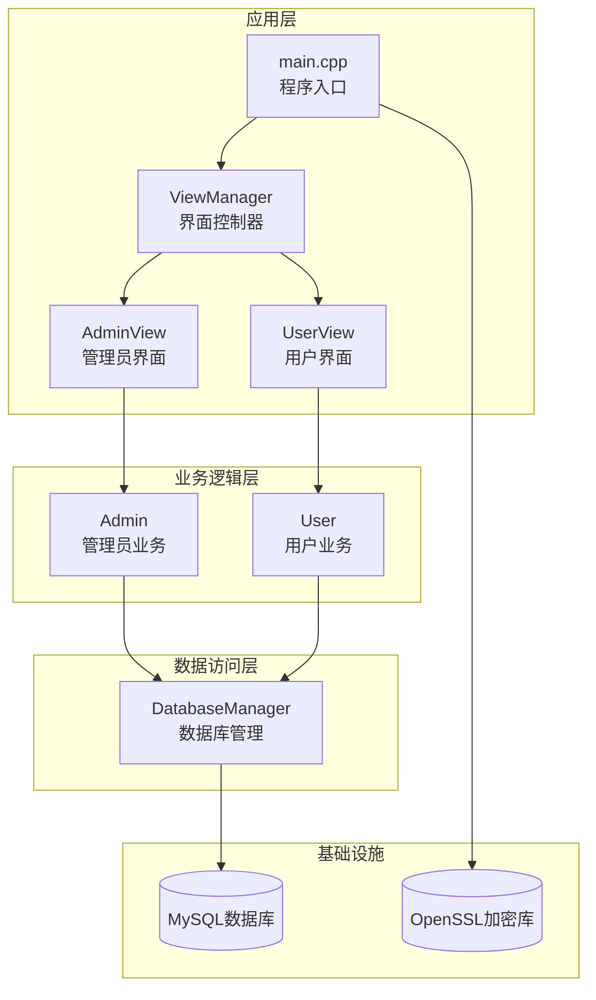
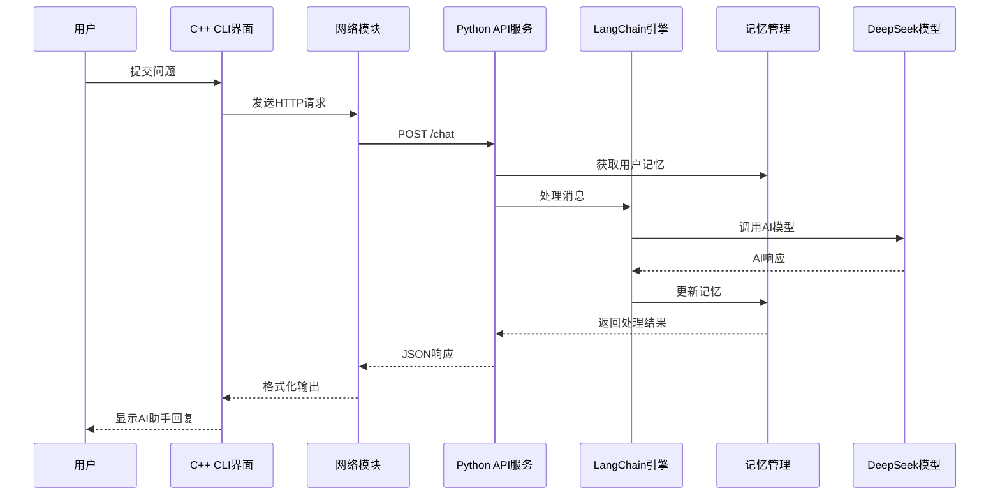
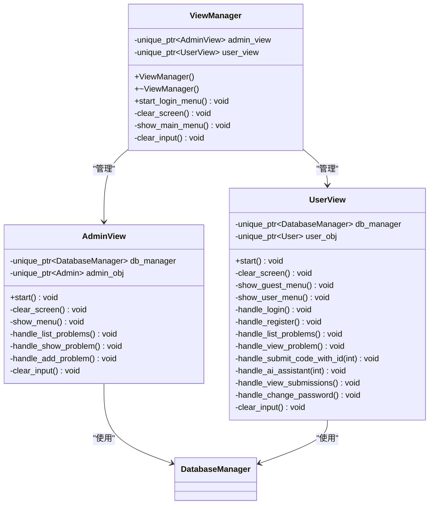
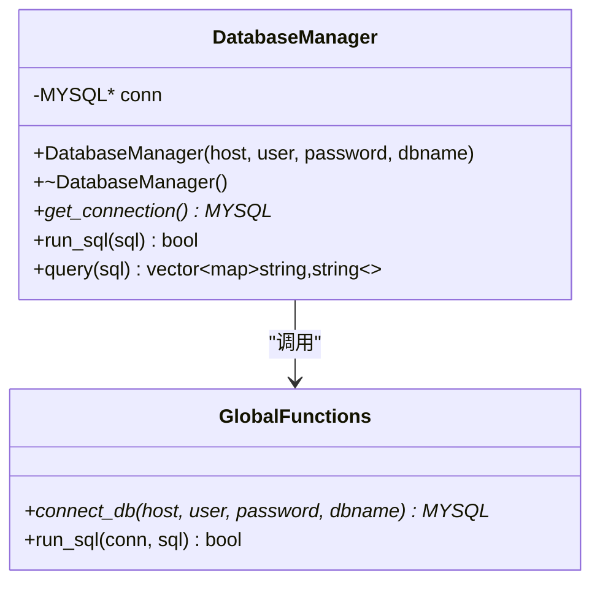
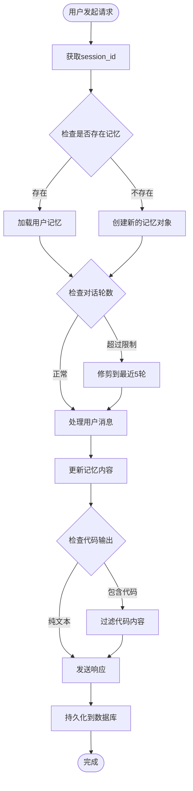
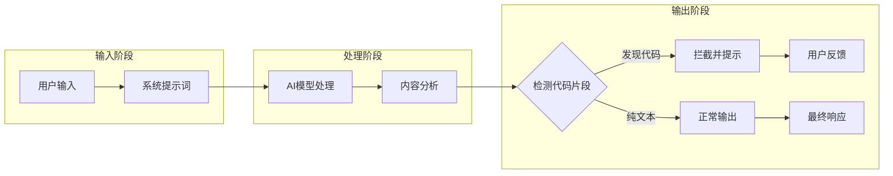
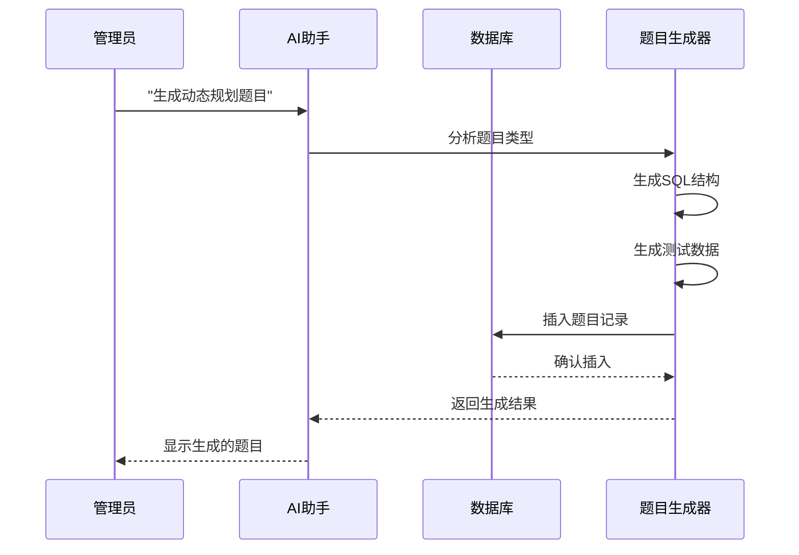

# AI助手功能规划

<cite>
**本文档引用的文件**
- [README.md](file://README.md)
- [ai.md](file://ai.md)
- [CMakeLists.txt](file://CMakeLists.txt)
- [main.cpp](file://src/main.cpp)
- [view_manager.h](file://include/view_manager.h)
- [view_manager.cpp](file://src/view_manager.cpp)
- [db_manager.h](file://include/db_manager.h)
- [db_manager.cpp](file://src/db_manager.cpp)
- [admin_view.h](file://include/admin_view.h)
- [admin_view.cpp](file://src/admin_view.cpp)
- [user_view.h](file://include/user_view.h)
- [user_view.cpp](file://src/user_view.cpp)
- [OJ_v0.1.md](file://History/OJ_v0.1.md)
- [OJ_v0.2.md](file://History/OJ_v0.2.md)
- [init.sql](file://init.sql)
</cite>

## 目录
1. [项目概述](#项目概述)
2. [项目结构](#项目结构)
3. [AI助手核心架构](#ai助手核心架构)
4. [系统架构概览](#系统架构概览)
5. [详细组件分析](#详细组件分析)
6. [AI助手功能实现](#ai助手功能实现)
7. [开发路线图](#开发路线图)
8. [性能考虑](#性能考虑)
9. [故障排除指南](#故障排除指南)
10. [结论](#结论)

## 项目概述

OJ在线判题系统是一个基于C++17和MySQL的命令行交互式编程练习平台。该系统实现了完整的用户认证、题目管理、代码提交和评测功能。根据最新规划，系统将集成AI智能助手功能，为用户提供智能化的学习辅助。

**章节来源**
- [README.md:1-2](file://README.md#L1-L2)
- [OJ_v0.1.md:1-10](file://History/OJ_v0.1.md#L1-L10)

## 项目结构

项目采用清晰的分层架构设计，主要包含以下核心模块：



**图表来源**
- [main.cpp:1-14](file://src/main.cpp#L1-L14)
- [view_manager.h:11-43](file://include/view_manager.h#L11-L43)
- [admin_view.h:11-58](file://include/admin_view.h#L11-L58)
- [user_view.h:11-90](file://include/user_view.h#L11-L90)

**章节来源**
- [CMakeLists.txt:1-40](file://CMakeLists.txt#L1-L40)
- [OJ_v0.1.md:296-320](file://History/OJ_v0.1.md#L296-L320)

## AI助手核心架构

AI助手采用"C++宿主 + Python AI微服务"的解耦架构，实现了高度模块化的系统设计：

```mermaid
graph TB
subgraph "C++客户端层"
CLI[命令行界面]
Network[网络通信模块]
Session[会话管理]
end
subgraph "Python AI服务层"
FastAPI[FastAPI服务]
LangChain[LangChain框架]
Memory[记忆管理]
DeepSeek[DeepSeek API]
end
subgraph "数据存储层"
ChatHistory[聊天历史表]
ProblemContext[题目上下文]
end
CLI < --> Network
Network < --> FastAPI
FastAPI < --> LangChain
LangChain < --> Memory
LangChain < --> DeepSeek
FastAPI < --> ChatHistory
FastAPI < --> ProblemContext
Network -.->|HTTP请求| FastAPI
```

**图表来源**
- [ai.md:9-21](file://ai.md#L9-L21)

### 架构特点

1. **模块化设计**：C++和Python完全分离，便于独立开发和部署
2. **会话隔离**：每个用户拥有独立的记忆空间
3. **上下文控制**：智能限制对话轮数，优化性能
4. **安全防护**：严格的代码输出限制，防止作弊

**章节来源**
- [ai.md:7-21](file://ai.md#L7-L21)

## 系统架构概览

系统整体架构采用经典的三层架构模式，结合AI微服务的特殊需求：



**图表来源**
- [ai.md:48-61](file://ai.md#L48-L61)

**章节来源**
- [ai.md:46-67](file://ai.md#L46-L67)

## 详细组件分析

### ViewManager组件

ViewManager作为系统的主控制器，负责管理不同角色的界面切换：



**图表来源**
- [view_manager.h:11-43](file://include/view_manager.h#L11-L43)
- [admin_view.h:11-58](file://include/admin_view.h#L11-L58)
- [user_view.h:11-90](file://include/user_view.h#L11-L90)

**章节来源**
- [view_manager.cpp:10-77](file://src/view_manager.cpp#L10-L77)
- [admin_view.cpp:10-138](file://src/admin_view.cpp#L10-L138)
- [user_view.cpp:10-324](file://src/user_view.cpp#L10-L324)

### DatabaseManager组件

DatabaseManager提供统一的数据库访问接口，支持多种SQL操作：



**图表来源**
- [db_manager.h:12-53](file://include/db_manager.h#L12-L53)

**章节来源**
- [db_manager.cpp:8-100](file://src/db_manager.cpp#L8-L100)

## AI助手功能实现

### 智能记忆管理系统

AI助手的记忆管理采用多层架构，确保用户隐私和系统性能：



**图表来源**
- [ai.md:26-30](file://ai.md#L26-L30)

### Anti-Cheating策略

系统实施严格的反作弊机制，确保AI助手发挥教育作用而非代写工具：



**图表来源**
- [ai.md:31-43](file://ai.md#L31-L43)

**章节来源**
- [ai.md:24-43](file://ai.md#L24-L43)

### 题目生成器功能

管理员可以利用AI助手自动生成题目和测试数据：



**图表来源**
- [ai.md:40-43](file://ai.md#L40-L43)

**章节来源**
- [ai.md:40-43](file://ai.md#L40-L43)

## 开发路线图

AI助手功能的开发采用渐进式策略，确保每个阶段的质量和稳定性：

```mermaid
gantt
title AI助手开发路线图
dateFormat X
axisFormat %d/%m
section Phase 1
搭建Python服务基础 :done, 2025-01-01, 2025-01-15
实现DeepSeek调通 :done, 2025-01-16, 2025-01-31
section Phase 2
集成LangChain记忆管理 :2025-02-01, 2025-02-15
实现Session隔离 :2025-02-16, 2025-02-28
section Phase 3
C++网络请求模块开发 :2025-03-01, 2025-03-15
菜单集成AI咨询功能 :2025-03-16, 2025-03-31
section Phase 4
优化System Prompt :2025-04-01, 2025-04-15
上线严师模式 :2025-04-16, 2025-04-30
题目自动生成功能 :2025-05-01, 2025-05-15
```



**章节来源**
- [ai.md:71-76](file://ai.md#L71-L76)

### 技术栈选择

系统采用的技术组合确保了最佳的开发效率和运行性能：

| 层级 | 技术 | 用途 | 优势 |
|------|------|------|------|
| 应用层 | C++17 | 核心业务逻辑 | 性能优异，内存控制精确 |
| 界面层 | 命令行 | 用户交互 | 跨平台，部署简单 |
| 服务层 | Python/FastAPI | AI服务 | 异步处理，易于扩展 |
| 框架层 | LangChain | AI链路管理 | 模块化，功能丰富 |
| 模型层 | DeepSeek | 智能推理 | 多语言支持，成本效益 |
| 存储层 | MySQL | 数据持久化 | 稳定可靠，生态完善 |

**章节来源**
- [CMakeLists.txt:1-10](file://CMakeLists.txt#L1-L10)

## 性能考虑

AI助手的性能优化涉及多个层面，从网络通信到内存管理：

### 网络通信优化

- **连接池管理**：复用HTTP连接，减少握手开销
- **超时控制**：设置合理的请求超时时间
- **错误重试**：实现智能重试机制
- **流式传输**：支持AI响应的实时显示

### 内存管理策略

- **会话隔离**：每个用户独立的内存空间
- **窗口限制**：控制对话历史长度
- **垃圾回收**：定期清理无用会话
- **内存监控**：实时监控内存使用情况

### 缓存机制

- **会话缓存**：短期频繁访问的数据
- **模型缓存**：常用的AI响应模式
- **配置缓存**：系统配置和用户偏好
- **结果缓存**：重复查询的计算结果

## 故障排除指南

### 常见问题及解决方案

#### 1. 数据库连接问题

**症状**：用户无法登录或查看题目列表
**诊断步骤**：
1. 检查数据库服务状态
2. 验证用户凭据配置
3. 确认网络连接可用
4. 查看MySQL错误日志

**解决方案**：
- 重启MySQL服务
- 更新用户权限配置
- 检查防火墙设置
- 验证连接字符串格式

#### 2. AI服务不可用

**症状**：AI助手功能显示"功能开发中"
**诊断步骤**：
1. 检查Python服务进程状态
2. 验证DeepSeek API密钥配置
3. 确认网络连通性
4. 查看服务日志

**解决方案**：
- 启动AI服务进程
- 检查.env文件配置
- 验证API密钥有效性
- 检查端口占用情况

#### 3. 记忆丢失问题

**症状**：用户在不同会话间丢失聊天记录
**诊断步骤**：
1. 检查session_id生成机制
2. 验证内存映射表状态
3. 确认数据库持久化配置
4. 查看异常处理日志

**解决方案**：
- 修复session_id生成逻辑
- 检查内存泄漏问题
- 验证数据库连接
- 实施数据恢复机制

**章节来源**
- [user_view.cpp:274-283](file://src/user_view.cpp#L274-L283)

## 结论

AI助手功能的规划体现了现代软件工程的最佳实践，通过合理的架构设计和技术选型，为OJ系统提供了强大的智能化能力。该方案不仅满足了当前的功能需求，还为未来的扩展奠定了坚实的基础。

### 主要优势

1. **模块化设计**：清晰的职责分离，便于维护和扩展
2. **安全性保障**：多重防护机制，有效防止作弊行为
3. **性能优化**：合理的资源管理，确保系统稳定运行
4. **开发效率**：渐进式开发策略，降低项目风险
5. **用户体验**：流畅的交互设计，提升学习效果

### 未来展望

随着AI助手功能的不断完善，OJ系统将发展成为集编程练习、智能辅导、学习分析于一体的综合性学习平台。通过持续的技术创新和功能优化，该系统将为编程教育事业做出重要贡献。