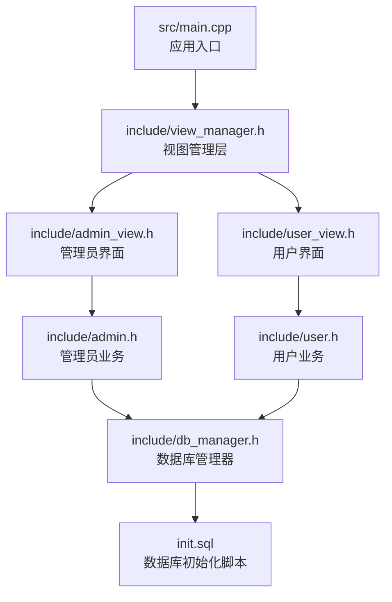
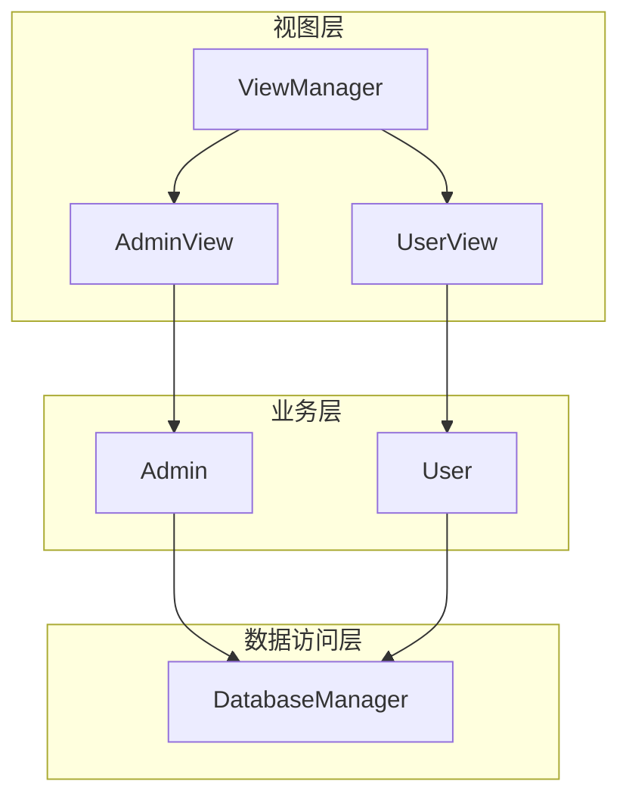
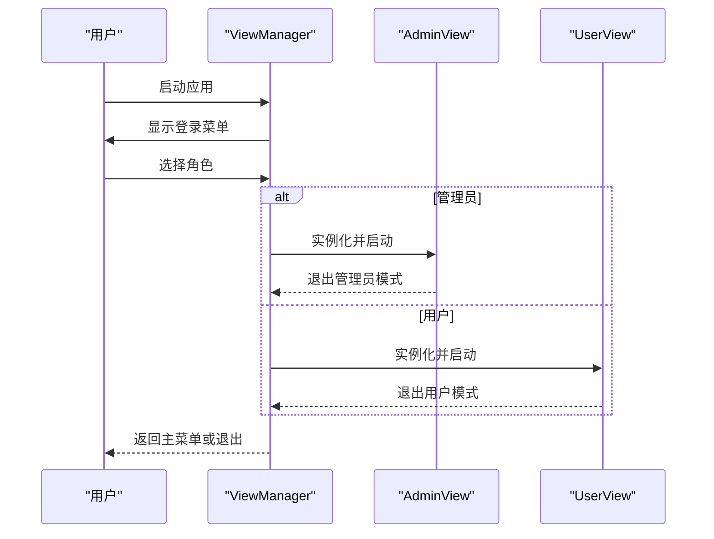
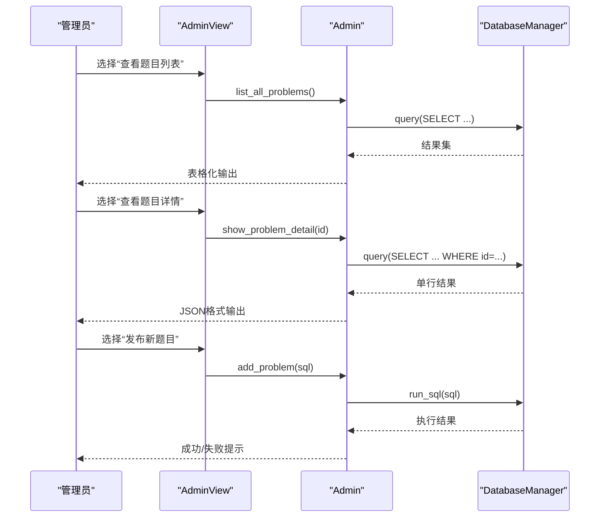
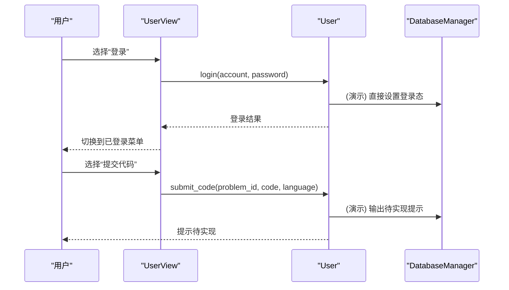
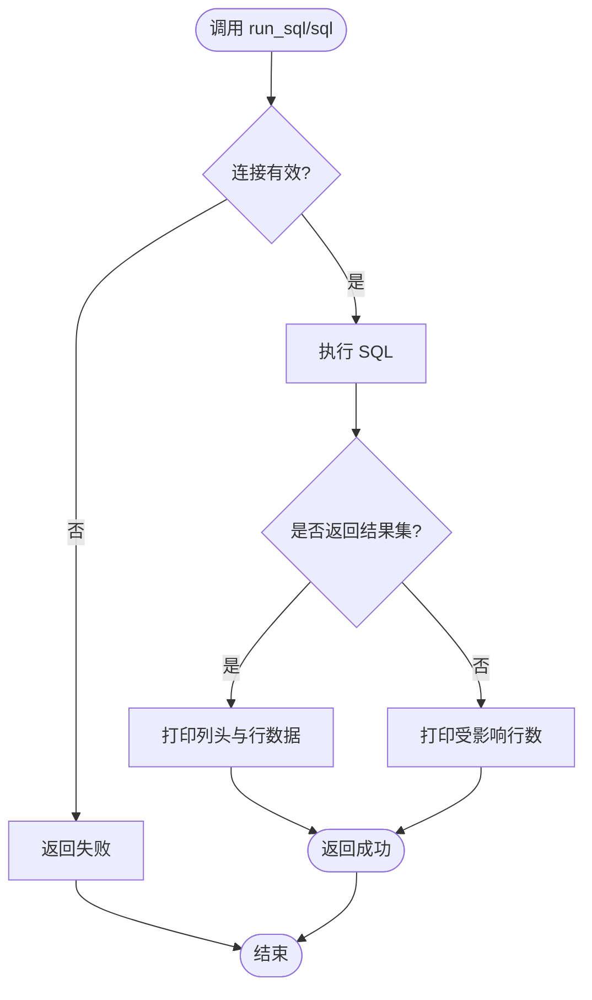
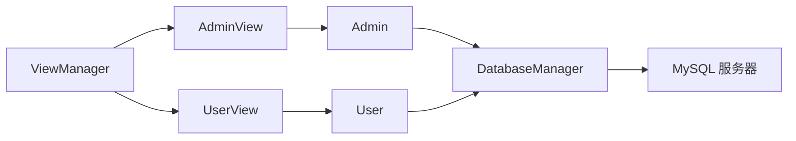
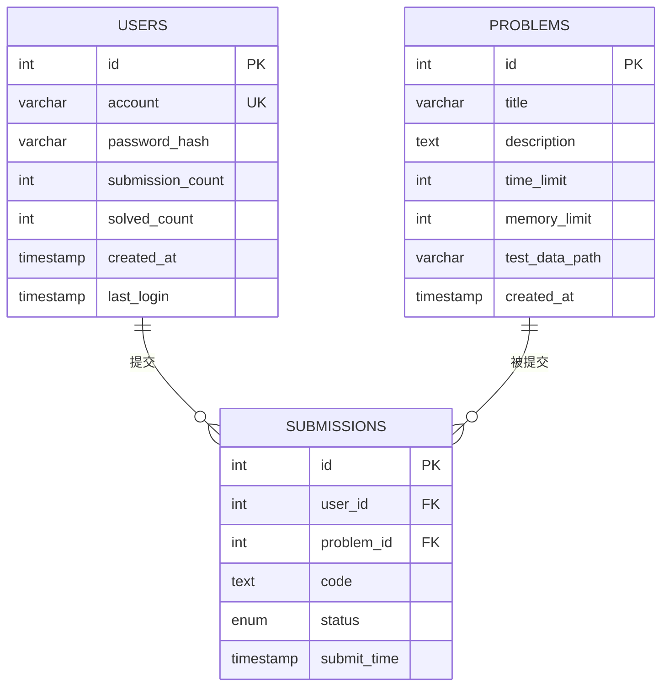

# 核心功能模块

<cite>
**本文引用的文件**
- [src/main.cpp](file://src/main.cpp)
- [include/view_manager.h](file://include/view_manager.h)
- [src/view_manager.cpp](file://src/view_manager.cpp)
- [include/admin_view.h](file://include/admin_view.h)
- [src/admin_view.cpp](file://src/admin_view.cpp)
- [include/user_view.h](file://include/user_view.h)
- [src/user_view.cpp](file://src/user_view.cpp)
- [include/admin.h](file://include/admin.h)
- [src/admin.cpp](file://src/admin.cpp)
- [include/user.h](file://include/user.h)
- [src/user.cpp](file://src/user.cpp)
- [include/db_manager.h](file://include/db_manager.h)
- [src/db_manager.cpp](file://src/db_manager.cpp)
- [init.sql](file://init.sql)
</cite>

## 目录
1. [简介](#简介)
2. [项目结构](#项目结构)
3. [核心组件](#核心组件)
4. [架构总览](#架构总览)
5. [详细组件分析](#详细组件分析)
6. [依赖分析](#依赖分析)
7. [性能考虑](#性能考虑)
8. [故障排查指南](#故障排查指南)
9. [结论](#结论)
10. [附录](#附录)

## 简介
本文件面向OJ评测系统的核心功能模块，围绕“管理员模块”和“用户模块”的功能设计、业务逻辑与界面交互展开，明确两角色的权限边界与功能范围，并解释模块间协作关系与数据传递机制。文档同时提供错误处理策略、安全考虑与性能优化建议，并给出扩展与定制的技术指导。

## 项目结构
系统采用命令行界面驱动，入口位于主程序，通过视图管理层协调管理员与用户两种角色的交互流程；业务逻辑分别由管理员与用户两类对象承担，底层统一通过数据库管理器访问MySQL。

图表来源
- [src/main.cpp:1-12](file://src/main.cpp#L1-L12)
- [include/view_manager.h:11-40](file://include/view_manager.h#L11-L40)
- [include/admin_view.h:11-50](file://include/admin_view.h#L11-L50)
- [include/user_view.h:11-80](file://include/user_view.h#L11-L80)
- [include/admin.h:10-37](file://include/admin.h#L10-L37)
- [include/user.h:10-86](file://include/user.h#L10-L86)
- [include/db_manager.h:12-51](file://include/db_manager.h#L12-L51)
- [init.sql:1-143](file://init.sql#L1-L143)

章节来源
- [src/main.cpp:1-12](file://src/main.cpp#L1-L12)
- [include/view_manager.h:11-40](file://include/view_manager.h#L11-L40)

## 核心组件
- 视图管理层：负责登录菜单展示与角色分流，维持清屏、输入清理等通用UI行为。
- 管理员模块：提供题目列表查看、题目详情查看、新增题目（SQL直写）等能力。
- 用户模块：提供登录/注册、查看题目、提交代码、查看提交记录、修改密码等能力。
- 数据库管理器：封装MySQL连接、查询与SQL执行，支持从文件批量执行SQL。

章节来源
- [include/view_manager.h:11-40](file://include/view_manager.h#L11-L40)
- [include/admin.h:10-37](file://include/admin.h#L10-L37)
- [include/user.h:10-86](file://include/user.h#L10-L86)
- [include/db_manager.h:12-51](file://include/db_manager.h#L12-L51)

## 架构总览
系统采用“视图层-业务层-数据访问层”的分层架构。视图层根据用户选择进入管理员或用户模式；业务层承载具体功能；数据访问层统一处理数据库交互。

图表来源
- [include/view_manager.h:11-40](file://include/view_manager.h#L11-L40)
- [include/admin_view.h:11-50](file://include/admin_view.h#L11-L50)
- [include/user_view.h:11-80](file://include/user_view.h#L11-L80)
- [include/admin.h:10-37](file://include/admin.h#L10-L37)
- [include/user.h:10-86](file://include/user.h#L10-L86)
- [include/db_manager.h:12-51](file://include/db_manager.h#L12-L51)

## 详细组件分析

### 视图管理层（ViewManager）
- 职责
  - 展示登录菜单并接收用户选择。
  - 根据选择实例化管理员或用户视图，并在子流程结束后回收资源。
  - 提供清屏与输入缓冲区清理工具方法。
- 控制流
  - 主循环持续显示菜单与读取输入，分支到管理员或用户模式。
  - 退出时打印提示并终止循环。
- 错误处理
  - 对非数字输入进行捕获与清理，提示无效输入并重试。
- 性能与可用性
  - 无长耗时操作，主要为IO与轻量分支判断。

图表来源
- [src/view_manager.cpp:28-66](file://src/view_manager.cpp#L28-L66)
- [include/admin_view.h:12-25](file://include/admin_view.h#L12-L25)
- [include/user_view.h:12-25](file://include/user_view.h#L12-L25)

章节来源
- [src/view_manager.cpp:12-73](file://src/view_manager.cpp#L12-L73)
- [include/view_manager.h:11-40](file://include/view_manager.h#L11-L40)

### 管理员模块（AdminView → Admin）
- 职责
  - 管理员模式下建立数据库连接（专用账号），提供题目列表、题目详情、新增题目（SQL直写）等操作。
- 权限与功能边界
  - 通过专用管理员账号连接，具备对题目表的增删改查能力。
  - 新增题目采用“手动输入SQL”的方式，便于快速发布。
- 交互流程
  - 登录菜单→管理员模式→菜单循环→各功能处理→断开连接。
- 错误处理
  - 输入校验（ID必须为数字）、SQL为空校验、执行失败提示。
- 安全与合规
  - 当前为演示用途，SQL直写存在风险；建议后续引入参数化接口与白名单校验。

图表来源
- [src/admin_view.cpp:12-66](file://src/admin_view.cpp#L12-L66)
- [src/admin.cpp:15-56](file://src/admin.cpp#L15-L56)
- [include/admin.h:10-37](file://include/admin.h#L10-L37)
- [include/db_manager.h:22-58](file://include/db_manager.h#L22-L58)

章节来源
- [src/admin_view.cpp:12-125](file://src/admin_view.cpp#L12-L125)
- [src/admin.cpp:10-56](file://src/admin.cpp#L10-L56)
- [include/admin_view.h:11-50](file://include/admin_view.h#L11-L50)
- [include/admin.h:10-37](file://include/admin.h#L10-L37)

### 用户模块（UserView → User）
- 职责
  - 用户模式下提供登录/注册、查看题目、提交代码、查看提交记录、修改密码等能力。
- 权限与功能边界
  - 使用受限账号连接，具备题目只读、提交记录增删改查、自身账户信息修改能力。
  - 登录态通过User对象维护，未登录状态下仅开放登录/注册入口。
- 交互流程
  - 未登录：登录/注册/返回主菜单；登录成功后切换至已登录菜单。
  - 已登录：题目列表/详情、提交代码、查看提交、修改密码、退出登录。
- 错误处理
  - 输入类型校验（ID必须为数字）、未登录拦截、输入缓冲区清理。
- 安全与合规
  - 当前为演示用途，登录/注册/改密均为占位实现；建议后续接入真实鉴权与密码哈希。

图表来源
- [src/user_view.cpp:17-109](file://src/user_view.cpp#L17-L109)
- [src/user.cpp:6-85](file://src/user.cpp#L6-L85)
- [include/user_view.h:11-80](file://include/user_view.h#L11-L80)
- [include/user.h:10-86](file://include/user.h#L10-L86)
- [include/db_manager.h:22-58](file://include/db_manager.h#L22-L58)

章节来源
- [src/user_view.cpp:17-221](file://src/user_view.cpp#L17-L221)
- [src/user.cpp:6-85](file://src/user.cpp#L6-L85)
- [include/user_view.h:11-80](file://include/user_view.h#L11-L80)
- [include/user.h:10-86](file://include/user.h#L10-L86)

### 数据库管理器（DatabaseManager）
- 职责
  - 维护MySQL连接、执行SQL、查询并返回结构化结果、从文件批量执行SQL。
- 关键能力
  - run_sql：执行任意SQL，打印影响行数或结果集。
  - query：执行查询并返回字段名到值的映射列表。
  - execute_sql_file：读取SQL文件并逐条执行，支持注释与空语句跳过。
- 错误处理
  - 连接失败、查询失败、执行失败均输出错误信息并返回失败状态。
- 安全与合规
  - 建议在业务层对传入SQL进行白名单/参数化处理，避免注入风险。

图表来源
- [src/db_manager.cpp:22-58](file://src/db_manager.cpp#L22-L58)
- [src/db_manager.cpp:126-175](file://src/db_manager.cpp#L126-L175)
- [include/db_manager.h:22-58](file://include/db_manager.h#L22-L58)

章节来源
- [src/db_manager.cpp:8-176](file://src/db_manager.cpp#L8-L176)
- [include/db_manager.h:12-58](file://include/db_manager.h#L12-L58)

## 依赖分析
- 组件耦合
  - AdminView/Admin 依赖 DatabaseManager；UserView/User 依赖 DatabaseManager。
  - ViewManager 仅持有视图指针，不直接依赖业务细节，耦合度低。
- 外部依赖
  - MySQL C API；JSON库（nlohmann/json）用于管理员题目详情输出。
- 权限模型
  - init.sql 中定义了管理员与受限用户两类数据库用户，分别授予不同权限，实现“账号级权限隔离”。

图表来源
- [include/view_manager.h:23-24](file://include/view_manager.h#L23-L24)
- [include/admin_view.h:23-24](file://include/admin_view.h#L23-L24)
- [include/user_view.h:23-24](file://include/user_view.h#L23-L24)
- [include/admin.h:36](file://include/admin.h#L36)
- [include/user.h:82](file://include/user.h#L82)
- [include/db_manager.h:50](file://include/db_manager.h#L50)
- [init.sql:67-96](file://init.sql#L67-L96)

章节来源
- [init.sql:67-96](file://init.sql#L67-L96)

## 性能考虑
- IO与网络
  - 视图层与业务层均为命令行交互，性能瓶颈主要在网络往返与数据库查询。
- 查询优化
  - 建议在题目表与提交表上建立必要索引（如按ID、用户ID、题目ID等），减少全表扫描。
- 连接管理
  - 当前每次进入模式即建立连接，建议在视图层复用连接或引入连接池以降低握手成本。
- 批量执行
  - 执行SQL文件时按分号分割，复杂SQL建议拆分为独立语句并增加事务包裹，提升可靠性。

## 故障排查指南
- 登录/连接问题
  - 确认init.sql已正确初始化数据库与用户权限。
  - 检查管理员/用户账号密码与主机白名单配置。
- 输入异常
  - 非数字ID输入会被清理并提示无效；请确保输入符合要求。
- SQL执行失败
  - run_sql会输出错误原因；检查语法、权限与目标表结构。
- 权限不足
  - 受限用户无法执行写操作；确认授予的权限范围。

章节来源
- [src/db_manager.cpp:33-37](file://src/db_manager.cpp#L33-L37)
- [src/db_manager.cpp:133-137](file://src/db_manager.cpp#L133-L137)
- [src/admin_view.cpp:62-65](file://src/admin_view.cpp#L62-L65)
- [src/user_view.cpp:104-108](file://src/user_view.cpp#L104-L108)

## 结论
本系统以清晰的分层架构实现了管理员与用户两大角色的典型功能：前者侧重题目管理与数据维护，后者聚焦账户管理与评测交互。通过视图管理层统一入口、业务层承载职责、数据访问层抽象存储，系统具备良好的可维护性与扩展性。后续可在安全、权限与性能方面进一步强化，以满足生产环境需求。

## 附录

### 角色权限与功能对照
- 管理员
  - 功能：查看题目列表、查看题目详情、发布新题目（SQL直写）。
  - 权限：全量读写题目表。
- 用户
  - 功能：登录/注册、查看题目、提交代码、查看提交记录、修改密码。
  - 权限：题目只读、提交记录增删改查、自身账户信息修改。

章节来源
- [include/admin.h:18-33](file://include/admin.h#L18-L33)
- [include/user.h:18-64](file://include/user.h#L18-L64)
- [init.sql:67-96](file://init.sql#L67-L96)

### 数据模型概览
- 题目表：包含ID、标题、描述、时间/内存限制、测试数据路径等。
- 用户表：包含账号、密码哈希、提交/解决统计、时间戳等。
- 提交记录表：包含用户ID、题目ID、代码、评测状态、提交时间等。

图表来源
- [init.sql:14-23](file://init.sql#L14-L23)
- [init.sql:27-38](file://init.sql#L27-L38)
- [init.sql:41-60](file://init.sql#L41-L60)

### 使用模式与扩展建议
- 新增功能
  - 用户侧：实现登录/注册/改密的真实鉴权逻辑，对接用户表；实现提交代码的评测调度与状态回写。
  - 管理员侧：引入参数化接口替代SQL直写，增加题目编辑/删除功能。
- 安全加固
  - 引入密码哈希与盐值；对输入进行严格校验与转义；限制SQL直写为受控接口。
- 性能优化
  - 增加索引与查询缓存；对频繁查询的结果做本地缓存；批量执行SQL时使用事务。
- 可靠性
  - 增加日志模块；对数据库异常进行重试与降级；完善输入清理与异常捕获。