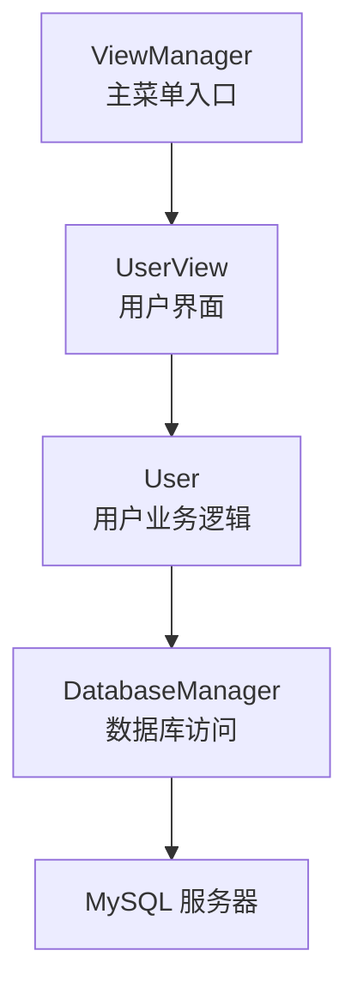
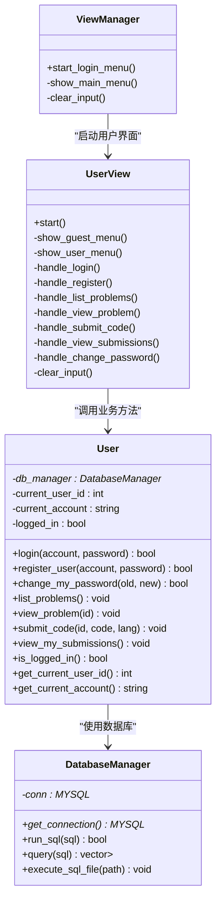
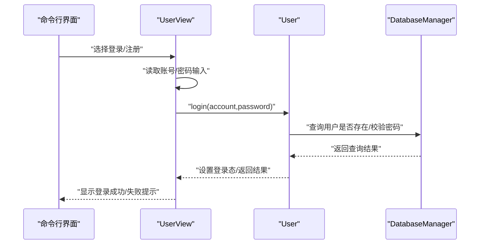
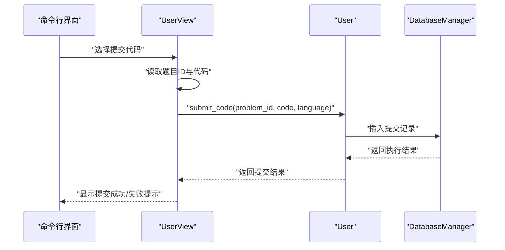
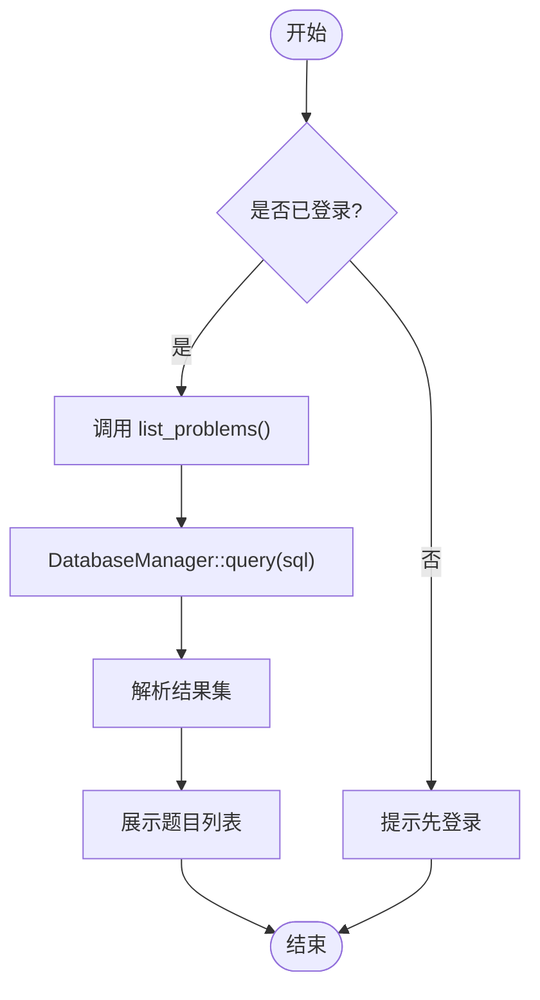
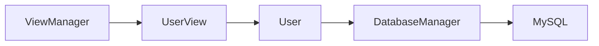
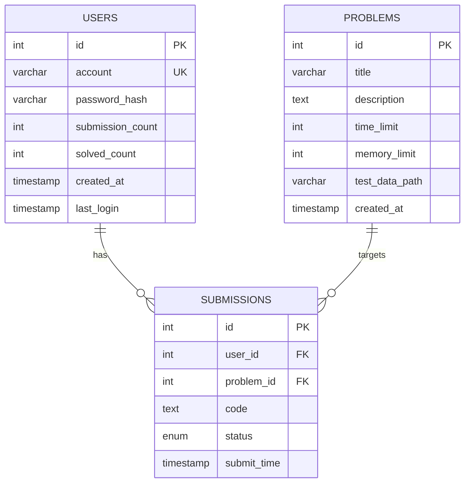

# 用户功能模块

<cite>
**本文引用的文件**
- [include/user.h](file://include/user.h)
- [src/user.cpp](file://src/user.cpp)
- [include/user_view.h](file://include/user_view.h)
- [src/user_view.cpp](file://src/user_view.cpp)
- [include/db_manager.h](file://include/db_manager.h)
- [src/db_manager.cpp](file://src/db_manager.cpp)
- [include/view_manager.h](file://include/view_manager.h)
- [src/view_manager.cpp](file://src/view_manager.cpp)
- [include/color_codes.h](file://include/color_codes.h)
- [src/main.cpp](file://src/main.cpp)
- [init.sql](file://init.sql)
</cite>

## 目录
1. [简介](#简介)
2. [项目结构](#项目结构)
3. [核心组件](#核心组件)
4. [架构总览](#架构总览)
5. [详细组件分析](#详细组件分析)
6. [依赖关系分析](#依赖关系分析)
7. [性能考虑](#性能考虑)
8. [故障排查指南](#故障排查指南)
9. [结论](#结论)
10. [附录](#附录)

## 简介
本文件面向“用户功能模块”的技术文档，聚焦于User类与UserView类的设计架构与实现细节，覆盖以下业务能力：
- 账户管理：注册、登录、密码修改
- 题目浏览：题目列表查看、题目详情获取
- 代码提交：提交评测、进度跟踪
- 界面交互：菜单导航、输入校验
- 数据层交互：与DatabaseManager的协作、SQL执行与结果解析
- 权限与安全：数据库用户权限分离、行级隔离策略

同时，文档提供流程图、时序图与类图，帮助开发者快速理解与扩展功能。

## 项目结构
该模块采用“界面层-业务层-数据层”三层组织方式：
- 界面层：ViewManager负责主菜单与角色入口；UserView负责用户模式的交互与输入处理
- 业务层：User封装用户业务逻辑，如登录、注册、密码修改、题目浏览、代码提交、查看提交记录
- 数据层：DatabaseManager封装MySQL连接、SQL执行与结果集解析

图表来源
- [src/view_manager.cpp:28-66](file://src/view_manager.cpp#L28-L66)
- [src/user_view.cpp:17-109](file://src/user_view.cpp#L17-L109)
- [src/user.cpp:4-86](file://src/user.cpp#L4-L86)
- [src/db_manager.cpp:8-20](file://src/db_manager.cpp#L8-L20)

章节来源
- [src/main.cpp:3-11](file://src/main.cpp#L3-L11)
- [src/view_manager.cpp:17-66](file://src/view_manager.cpp#L17-L66)
- [src/user_view.cpp:17-109](file://src/user_view.cpp#L17-L109)
- [src/user.cpp:4-86](file://src/user.cpp#L4-L86)
- [src/db_manager.cpp:8-20](file://src/db_manager.cpp#L8-L20)

## 核心组件
- User类：封装用户身份、登录状态与核心业务方法（登录、注册、密码修改、题目浏览、代码提交、查看提交记录）
- UserView类：负责命令行交互、菜单显示、输入校验与调用User方法
- DatabaseManager类：封装MySQL连接、SQL执行、查询结果解析与批量SQL文件执行
- ViewManager：系统入口，负责角色选择与子界面启动

章节来源
- [include/user.h:10-86](file://include/user.h#L10-L86)
- [src/user.cpp:4-86](file://src/user.cpp#L4-L86)
- [include/user_view.h:11-80](file://include/user_view.h#L11-L80)
- [src/user_view.cpp:8-221](file://src/user_view.cpp#L8-L221)
- [include/db_manager.h:12-51](file://include/db_manager.h#L12-L51)
- [src/db_manager.cpp:8-176](file://src/db_manager.cpp#L8-L176)
- [include/view_manager.h:11-40](file://include/view_manager.h#L11-L40)
- [src/view_manager.cpp:8-73](file://src/view_manager.cpp#L8-L73)

## 架构总览
用户功能模块遵循“界面-业务-数据”分层，职责清晰：
- 界面层：UserView负责与用户交互，收集输入并调用User方法；ViewManager负责角色入口
- 业务层：User持有DatabaseManager指针，封装业务规则与状态（登录态、当前用户ID、账号）
- 数据层：DatabaseManager提供统一的SQL执行与结果解析接口，并负责连接生命周期管理

图表来源
- [include/view_manager.h:11-40](file://include/view_manager.h#L11-L40)
- [src/view_manager.cpp:28-66](file://src/view_manager.cpp#L28-L66)
- [include/user_view.h:11-80](file://include/user_view.h#L11-L80)
- [src/user_view.cpp:17-221](file://src/user_view.cpp#L17-L221)
- [include/user.h:10-86](file://include/user.h#L10-L86)
- [src/user.cpp:4-86](file://src/user.cpp#L4-L86)
- [include/db_manager.h:12-51](file://include/db_manager.h#L12-L51)
- [src/db_manager.cpp:8-176](file://src/db_manager.cpp#L8-L176)

## 详细组件分析

### User类设计与实现
- 关键属性
  - 当前用户ID、账号、登录状态，用于维护会话状态
  - 持有DatabaseManager指针，用于数据访问
- 核心方法
  - 登录：接收账号与密码，设置登录态与当前用户信息
  - 注册：接收账号与密码，预留数据库写入
  - 修改密码：要求已登录，校验旧密码后更新
  - 题目浏览：查看题目列表与题目详情
  - 代码提交：提交代码并触发评测流程
  - 查看提交记录：展示当前用户的提交历史
- 设计要点
  - 方法命名清晰，职责单一，便于扩展
  - 登录态检查贯穿关键操作，避免未登录访问
  - 与DatabaseManager解耦，便于替换数据源

章节来源
- [include/user.h:10-86](file://include/user.h#L10-L86)
- [src/user.cpp:4-86](file://src/user.cpp#L4-L86)

### UserView类设计与实现
- 角色入口
  - 通过ViewManager启动用户模式，建立数据库连接
  - 使用受限权限的数据库用户连接，确保行级隔离
- 菜单与交互
  - 未登录菜单：登录、注册、返回
  - 已登录菜单：题目列表、题目详情、提交代码、查看提交、修改密码、退出登录
  - 输入校验：数字输入异常处理、清空输入缓冲区
- 与User的协作
  - 将用户输入转交给User对象执行具体业务
  - 展示User返回的结果或提示信息

章节来源
- [include/user_view.h:11-80](file://include/user_view.h#L11-L80)
- [src/user_view.cpp:8-221](file://src/user_view.cpp#L8-L221)
- [include/view_manager.h:11-40](file://include/view_manager.h#L11-L40)
- [src/view_manager.cpp:28-66](file://src/view_manager.cpp#L28-L66)

### DatabaseManager类设计与实现
- 连接管理
  - 构造时建立连接，析构时关闭并释放资源
  - 提供连接句柄供上层使用
- SQL执行
  - run_sql：执行任意SQL，打印结果或影响行数
  - query：执行查询并返回结构化结果（字段名->值的映射）
  - execute_sql_file：从文件读取并逐条执行SQL语句
- 错误处理
  - 统一输出错误信息，便于调试与定位问题

章节来源
- [include/db_manager.h:12-51](file://include/db_manager.h#L12-L51)
- [src/db_manager.cpp:8-176](file://src/db_manager.cpp#L8-L176)

### 登录与注册流程（时序图）

图表来源
- [src/user_view.cpp:138-156](file://src/user_view.cpp#L138-L156)
- [src/user.cpp:6-19](file://src/user.cpp#L6-L19)
- [src/db_manager.cpp:27-58](file://src/db_manager.cpp#L27-L58)

### 代码提交流程（时序图）

图表来源
- [src/user_view.cpp:177-199](file://src/user_view.cpp#L177-L199)
- [src/user.cpp:62-73](file://src/user.cpp#L62-L73)
- [src/db_manager.cpp:22-25](file://src/db_manager.cpp#L22-L25)

### 题目浏览流程（流程图）

图表来源
- [src/user.cpp:44-51](file://src/user.cpp#L44-L51)
- [src/db_manager.cpp:27-58](file://src/db_manager.cpp#L27-L58)

## 依赖关系分析
- User依赖DatabaseManager：用于执行业务相关的数据库操作
- UserView依赖User与DatabaseManager：负责交互与业务调度
- ViewManager依赖UserView：作为入口控制器
- DatabaseManager依赖MySQL C API：封装底层连接与查询

图表来源
- [src/view_manager.cpp:28-66](file://src/view_manager.cpp#L28-L66)
- [src/user_view.cpp:17-109](file://src/user_view.cpp#L17-L109)
- [src/user.cpp:4-86](file://src/user.cpp#L4-L86)
- [src/db_manager.cpp:8-20](file://src/db_manager.cpp#L8-L20)

章节来源
- [src/view_manager.cpp:28-66](file://src/view_manager.cpp#L28-L66)
- [src/user_view.cpp:17-109](file://src/user_view.cpp#L17-L109)
- [src/user.cpp:4-86](file://src/user.cpp#L4-L86)
- [src/db_manager.cpp:8-20](file://src/db_manager.cpp#L8-L20)

## 性能考虑
- 查询优化
  - 使用索引：users表的account与created_at索引，submissions表的user_id与problem_id索引
  - 避免N+1查询：在一次查询中获取所需数据，减少往返次数
- 连接管理
  - DatabaseManager在构造时建立连接，在析构时释放，避免连接泄漏
  - 用户模式使用受限权限连接，降低锁竞争与不必要的写操作
- I/O优化
  - 批量SQL文件执行时按分号分割语句，避免一次性加载大文件
- 业务层优化
  - 登录态缓存：User类内维护current_user_id与current_account，减少重复查询
  - 输入校验：在界面层提前过滤非法输入，减少无效请求

章节来源
- [init.sql:35-60](file://init.sql#L35-L60)
- [src/db_manager.cpp:60-101](file://src/db_manager.cpp#L60-L101)
- [src/user.cpp:4-86](file://src/user.cpp#L4-L86)

## 故障排查指南
- 数据库连接失败
  - 现象：用户模式启动时报错“数据库连接失败”
  - 排查：确认MySQL服务运行、凭据正确、网络可达；检查init.sql中oj_user权限配置
- 登录失败
  - 现象：登录后仍显示未登录
  - 排查：确认User.login中数据库校验逻辑已实现；检查users表是否存在对应账号
- 提交失败
  - 现象：提交代码后无响应或报错
  - 排查：确认submissions表可插入；检查语言参数与代码格式
- 输入异常
  - 现象：输入非数字导致程序卡死
  - 排查：使用UserView::clear_input清理输入缓冲区；对cin.fail()进行分支处理

章节来源
- [src/user_view.cpp:42-49](file://src/user_view.cpp#L42-L49)
- [src/user_view.cpp:167-172](file://src/user_view.cpp#L167-L172)
- [src/user.cpp:64-68](file://src/user.cpp#L64-L68)
- [src/db_manager.cpp:114-124](file://src/db_manager.cpp#L114-L124)

## 结论
用户功能模块以清晰的分层设计实现了账户管理、题目浏览与代码提交等核心业务。通过UserView与User的职责划分，以及DatabaseManager对数据库访问的抽象，模块具备良好的可维护性与扩展性。后续可在User类中完善数据库校验与写入逻辑，并在UserView中增强输入校验与结果展示格式化，进一步提升用户体验与安全性。

## 附录

### 数据模型概览（ER图）

图表来源
- [init.sql:14-60](file://init.sql#L14-L60)

### 权限与安全策略
- 数据库用户分离
  - oj_admin：全权限，用于管理员模式
  - oj_user：受限权限，仅允许对自身数据进行查询与更新
- 行级隔离
  - 应用层通过WHERE条件限制用户只能访问自己的数据
- 会话管理
  - User类维护登录态与当前用户信息，避免跨用户数据泄露

章节来源
- [init.sql:67-96](file://init.sql#L67-L96)
- [src/user.cpp:4-86](file://src/user.cpp#L4-L86)