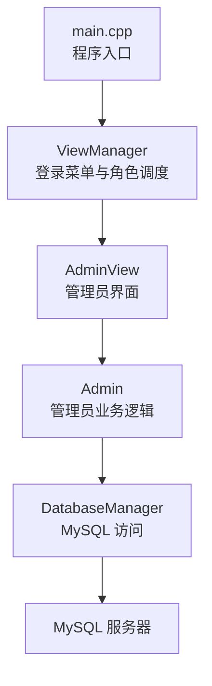
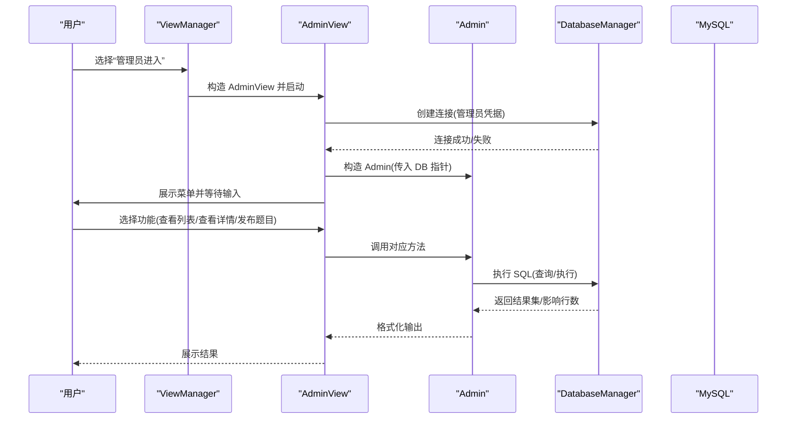
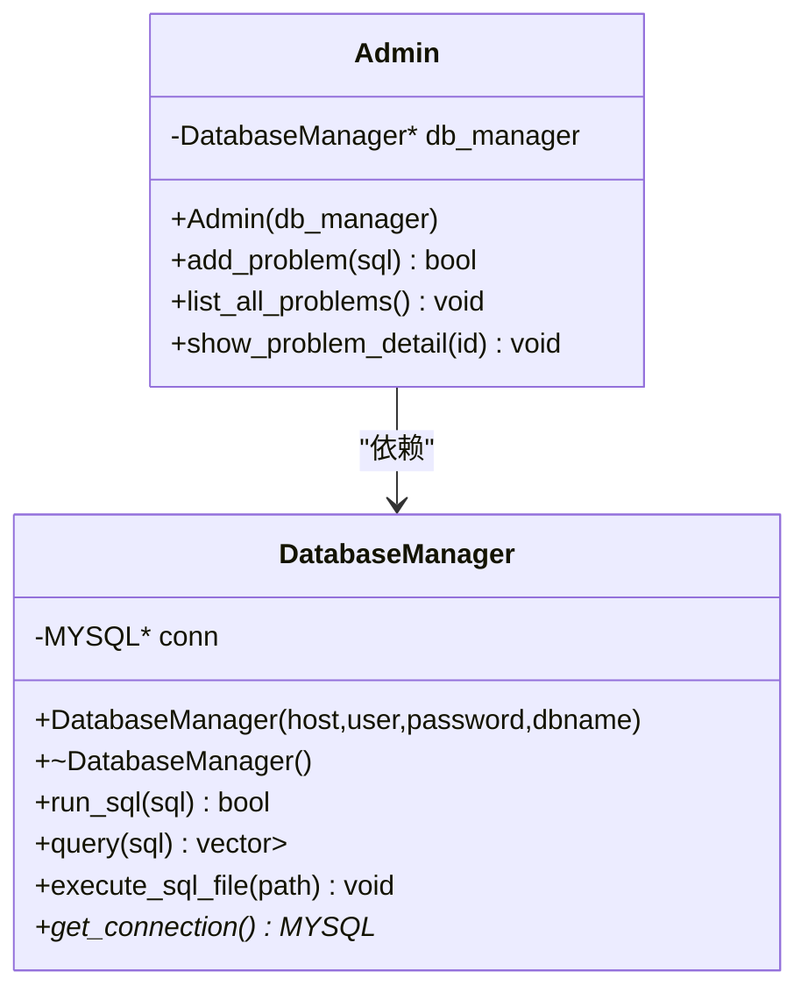
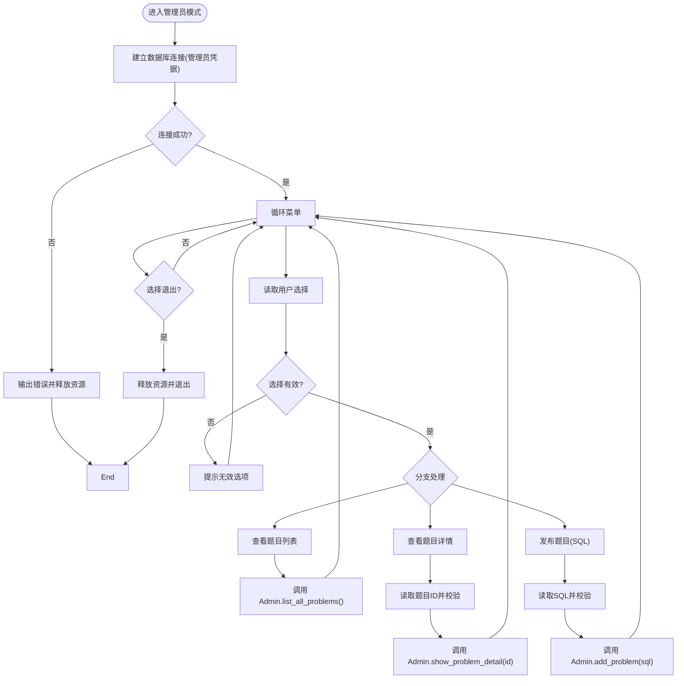
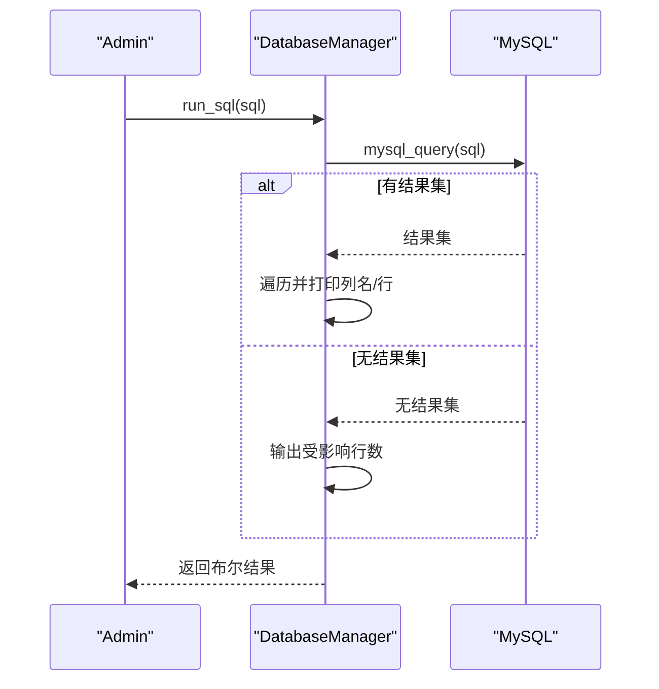

# 管理员功能模块

<cite>
**本文引用的文件**
- [src/admin.cpp](file://src/admin.cpp)
- [include/admin.h](file://include/admin.h)
- [src/admin_view.cpp](file://src/admin_view.cpp)
- [include/admin_view.h](file://include/admin_view.h)
- [src/db_manager.cpp](file://src/db_manager.cpp)
- [include/db_manager.h](file://include/db_manager.h)
- [src/view_manager.cpp](file://src/view_manager.cpp)
- [include/view_manager.h](file://include/view_manager.h)
- [src/main.cpp](file://src/main.cpp)
- [init.sql](file://init.sql)
</cite>

## 目录
1. [简介](#简介)
2. [项目结构](#项目结构)
3. [核心组件](#核心组件)
4. [架构总览](#架构总览)
5. [详细组件分析](#详细组件分析)
6. [依赖关系分析](#依赖关系分析)
7. [性能考虑](#性能考虑)
8. [故障排查指南](#故障排查指南)
9. [结论](#结论)
10. [附录](#附录)

## 简介
本文件面向管理员功能模块，系统性阐述 Admin 类与 AdminView 类的设计架构与实现细节，重点覆盖以下方面：
- 管理员题目管理能力：add_problem() 的 SQL 执行机制、list_all_problems() 的题目列表展示、show_problem_detail() 的题目详情查询。
- 管理员界面交互设计、菜单系统实现与用户输入处理流程。
- 与 DatabaseManager 的协作关系与数据流转过程。
- 错误处理策略、异常情况处理与安全验证机制。
- 新增管理员功能时的代码组织与最佳实践建议。

## 项目结构
该模块采用“视图层-业务层-数据访问层”的分层设计：
- 视图层：AdminView 负责管理员菜单与输入处理；ViewManager 统一调度登录入口与角色切换。
- 业务层：Admin 封装管理员专属业务逻辑，委托 DatabaseManager 执行数据库操作。
- 数据访问层：DatabaseManager 封装 MySQL 连接、SQL 执行与结果集解析。

图表来源
- [src/main.cpp:1-12](file://src/main.cpp#L1-L12)
- [src/view_manager.cpp:28-66](file://src/view_manager.cpp#L28-L66)
- [src/admin_view.cpp:12-66](file://src/admin_view.cpp#L12-L66)
- [src/admin.cpp:8-56](file://src/admin.cpp#L8-L56)
- [src/db_manager.cpp:8-25](file://src/db_manager.cpp#L8-L25)

章节来源
- [src/main.cpp:1-12](file://src/main.cpp#L1-L12)
- [src/view_manager.cpp:28-66](file://src/view_manager.cpp#L28-L66)
- [src/admin_view.cpp:12-66](file://src/admin_view.cpp#L12-L66)
- [src/admin.cpp:8-56](file://src/admin.cpp#L8-L56)
- [src/db_manager.cpp:8-25](file://src/db_manager.cpp#L8-L25)

## 核心组件
- Admin：封装管理员业务逻辑，提供题目发布、列表查询、详情查询等接口，内部持有 DatabaseManager 指针。
- AdminView：负责管理员菜单展示与用户输入处理，建立数据库连接并驱动 Admin 执行具体操作。
- DatabaseManager：封装 MySQL 连接、SQL 执行与结果集解析，提供 run_sql() 与 query() 两个关键接口。

章节来源
- [include/admin.h:10-37](file://include/admin.h#L10-L37)
- [include/admin_view.h:11-50](file://include/admin_view.h#L11-L50)
- [include/db_manager.h:12-51](file://include/db_manager.h#L12-L51)

## 架构总览
管理员功能的调用链路如下：
- 用户通过 ViewManager 进入管理员模式，AdminView 建立数据库连接并实例化 Admin。
- AdminView 根据用户选择调用 Admin 的相应方法。
- Admin 将请求委派给 DatabaseManager，DatabaseManager 执行 SQL 并返回结果。
- Admin 对结果进行格式化输出，AdminView 再将结果呈现给用户。

图表来源
- [src/view_manager.cpp:48-51](file://src/view_manager.cpp#L48-L51)
- [src/admin_view.cpp:17-22](file://src/admin_view.cpp#L17-L22)
- [src/admin_view.cpp:81-98](file://src/admin_view.cpp#L81-L98)
- [src/admin_view.cpp:100-118](file://src/admin_view.cpp#L100-L118)
- [src/admin.cpp:10-13](file://src/admin.cpp#L10-L13)
- [src/admin.cpp:15-39](file://src/admin.cpp#L15-L39)
- [src/admin.cpp:41-56](file://src/admin.cpp#L41-L56)
- [src/db_manager.cpp:22-25](file://src/db_manager.cpp#L22-L25)
- [src/db_manager.cpp:27-58](file://src/db_manager.cpp#L27-L58)

## 详细组件分析

### Admin 类设计与实现
职责与接口
- 构造函数：接收 DatabaseManager 指针，建立依赖注入。
- add_problem(sql)：执行任意 SQL，返回布尔值表示是否成功。
- list_all_problems()：查询并格式化输出题目列表。
- show_problem_detail(id)：按 ID 查询题目详情，并以 JSON 美化输出。

实现要点
- 依赖注入：Admin 通过构造函数接收 DatabaseManager 指针，便于单元测试与替换实现。
- SQL 执行：add_problem() 直接委派给 DatabaseManager::run_sql()，保持统一的错误处理与日志输出。
- 查询与展示：list_all_problems() 使用固定查询语句获取必要字段；show_problem_detail() 将单行结果转为 JSON 输出，便于调试与展示。

图表来源
- [include/admin.h:10-37](file://include/admin.h#L10-L37)
- [include/db_manager.h:12-51](file://include/db_manager.h#L12-L51)

章节来源
- [include/admin.h:10-37](file://include/admin.h#L10-L37)
- [src/admin.cpp:8-56](file://src/admin.cpp#L8-L56)

### AdminView 类设计与实现
职责与接口
- start()：建立管理员数据库连接，循环显示菜单并处理用户输入。
- show_menu()：展示管理员功能菜单。
- handle_list_problems()、handle_show_problem()、handle_add_problem()：分别委派给 Admin 的对应方法。
- clear_input()：清理输入缓冲区，防止格式错误导致的死循环。

输入处理与错误处理
- 数字输入校验：当输入非整数时，清空缓冲区并提示重新输入。
- SQL 输入校验：空 SQL 不允许执行。
- 连接失败处理：连接失败时输出错误信息并释放资源。

图表来源
- [src/admin_view.cpp:12-66](file://src/admin_view.cpp#L12-L66)
- [src/admin_view.cpp:81-98](file://src/admin_view.cpp#L81-L98)
- [src/admin_view.cpp:100-118](file://src/admin_view.cpp#L100-L118)

章节来源
- [include/admin_view.h:11-50](file://include/admin_view.h#L11-L50)
- [src/admin_view.cpp:12-66](file://src/admin_view.cpp#L12-L66)
- [src/admin_view.cpp:81-98](file://src/admin_view.cpp#L81-L98)
- [src/admin_view.cpp:100-118](file://src/admin_view.cpp#L100-L118)

### DatabaseManager 类设计与实现
职责与接口
- 构造与析构：初始化连接并在析构时释放资源。
- run_sql(sql)：执行任意 SQL，打印执行结果或影响行数。
- query(sql)：执行查询并返回结构化的结果集（列名->值的映射）。
- execute_sql_file(filepath)：从文件读取并逐条执行 SQL 语句。

数据流转
- run_sql：直接调用底层 mysql_query，若存在结果集则遍历输出，否则报告受影响行数。
- query：执行查询后将结果集转换为 vector<map<string,string>>，便于上层业务层使用。

图表来源
- [src/db_manager.cpp:22-25](file://src/db_manager.cpp#L22-L25)
- [src/db_manager.cpp:126-175](file://src/db_manager.cpp#L126-L175)

章节来源
- [include/db_manager.h:12-51](file://include/db_manager.h#L12-L51)
- [src/db_manager.cpp:8-25](file://src/db_manager.cpp#L8-L25)
- [src/db_manager.cpp:27-58](file://src/db_manager.cpp#L27-L58)
- [src/db_manager.cpp:126-175](file://src/db_manager.cpp#L126-L175)

### 管理员题目管理功能详解

#### add_problem() 方法的 SQL 执行机制
- 输入：管理员输入的完整 SQL 语句字符串。
- 流程：
  - Admin 接收 SQL 字符串并调用 DatabaseManager::run_sql(sql)。
  - DatabaseManager::run_sql 内部调用 mysql_query 执行 SQL。
  - 若 SQL 返回结果集，则遍历输出列名与行数据；否则输出受影响行数。
  - 返回布尔值指示执行是否成功。
- 安全与风险：
  - 该实现直接执行传入的 SQL，属于“管理员全权限”模式，适合受信任的运维场景。
  - 建议在生产环境中增加白名单校验、参数化执行或最小权限约束。

章节来源
- [src/admin.cpp:10-13](file://src/admin.cpp#L10-L13)
- [src/db_manager.cpp:22-25](file://src/db_manager.cpp#L22-L25)
- [src/db_manager.cpp:126-175](file://src/db_manager.cpp#L126-L175)

#### list_all_problems() 的题目列表展示
- 查询：固定查询 OJ.problems 表的 id、title、time_limit、memory_limit 字段。
- 展示：使用固定宽度列对齐输出，若结果为空则提示“题目列表为空”。

章节来源
- [src/admin.cpp:15-39](file://src/admin.cpp#L15-L39)

#### show_problem_detail() 的题目详情查询
- 查询：按 id 查询 OJ.problems 的全部字段。
- 展示：将第一行结果转换为 JSON 并以缩进格式输出，便于阅读与调试。
- 异常：若未找到匹配记录，输出“未找到”提示。

章节来源
- [src/admin.cpp:41-56](file://src/admin.cpp#L41-L56)

### 管理员界面交互设计与菜单系统
- 登录入口：ViewManager::start_login_menu() 提供“管理员进入/用户进入/退出系统”三选一菜单。
- 管理员模式：AdminView::start() 建立管理员数据库连接，随后循环展示“查看题目列表/查看题目详情/发布题目/返回登录菜单”。
- 输入处理：对数字输入与 SQL 输入进行严格校验，避免格式错误导致的异常行为。
- 资源管理：退出时自动释放 Admin 与 DatabaseManager 指针，确保连接关闭。

章节来源
- [src/view_manager.cpp:28-66](file://src/view_manager.cpp#L28-L66)
- [src/admin_view.cpp:12-66](file://src/admin_view.cpp#L12-L66)

## 依赖关系分析
- Admin 依赖 DatabaseManager：通过构造函数注入，形成清晰的依赖倒置。
- AdminView 依赖 Admin 与 DatabaseManager：负责 UI 与业务的桥接。
- ViewManager 依赖 AdminView 与 UserView：统一入口与角色切换。
- DatabaseManager 依赖 MySQL C API：封装底层连接与查询。

图表来源
- [include/view_manager.h:23-24](file://include/view_manager.h#L23-L24)
- [include/admin_view.h:23-24](file://include/admin_view.h#L23-L24)
- [include/admin.h:36](file://include/admin.h#L36)
- [include/db_manager.h:50](file://include/db_manager.h#L50)

章节来源
- [include/view_manager.h:23-24](file://include/view_manager.h#L23-L24)
- [include/admin_view.h:23-24](file://include/admin_view.h#L23-L24)
- [include/admin.h:36](file://include/admin.h#L36)
- [include/db_manager.h:50](file://include/db_manager.h#L50)

## 性能考虑
- 查询性能：list_all_problems() 查询固定字段，避免 SELECT *，减少网络与内存开销。
- 结果集处理：DatabaseManager::query() 将结果集转换为 vector<map<string,string>>，便于后续处理但会占用额外内存；对于大结果集应考虑分页或流式处理。
- I/O 优化：AdminView 的输入输出均为同步阻塞，建议在需要时引入缓冲与异步策略（当前命令行环境限制较多）。
- 连接复用：DatabaseManager 在构造时建立连接，生命周期内复用同一连接，避免频繁握手成本。

## 故障排查指南
常见问题与处理
- 数据库连接失败
  - 现象：输出“数据库连接失败，请检查管理员账号配置”。
  - 排查：确认主机、用户名、密码、数据库名正确；检查 MySQL 服务状态与网络连通性。
- 输入类型错误
  - 现象：输入非数字时提示“无效输入，请输入数字！”。
  - 处理：调用 clear_input() 清理缓冲区，重新输入。
- SQL 执行失败
  - 现象：add_problem() 返回 false 或输出“执行失败”。
  - 排查：检查 SQL 语法、权限与表结构；查看 MySQL 错误信息。
- 未找到题目
  - 现象：show_problem_detail() 输出“未找到 ID 为 ... 的题目”。
  - 处理：确认题目 ID 是否存在；核对数据库中 OJ.problems 表。

章节来源
- [src/admin_view.cpp:62-65](file://src/admin_view.cpp#L62-L65)
- [src/admin_view.cpp:30-35](file://src/admin_view.cpp#L30-L35)
- [src/admin_view.cpp:106-113](file://src/admin_view.cpp#L106-L113)
- [src/admin.cpp:47-50](file://src/admin.cpp#L47-L50)
- [src/db_manager.cpp:33-37](file://src/db_manager.cpp#L33-L37)

## 结论
管理员功能模块通过清晰的分层设计与依赖注入，实现了稳定的题目管理能力。AdminView 提供了直观的菜单与输入处理，Admin 将业务逻辑与数据访问解耦，DatabaseManager 统一封装底层 MySQL 操作。当前实现以“管理员全权限”为核心假设，适合受信任的运维场景；在生产环境中建议引入参数化执行、权限白名单与更严格的输入校验，以提升安全性与稳定性。

## 附录

### 数据库初始化与权限配置
- 数据库与表结构：init.sql 中定义了 OJ 数据库、problems 表、users 表与 submissions 表。
- 权限分配：
  - oj_admin：对 OJ.* 具有 SELECT/INSERT/UPDATE/DELETE 权限，用于管理员模式。
  - oj_user：对 users、submissions 表具备受限权限，配合应用层行级隔离实现用户权限控制。

章节来源
- [init.sql:8-96](file://init.sql#L8-L96)

### 代码实现示例（路径引用）
- 管理员题目发布（SQL 执行）
  - 调用链：AdminView::handle_add_problem() -> Admin::add_problem() -> DatabaseManager::run_sql()
  - 参考路径：[src/admin_view.cpp:100-118](file://src/admin_view.cpp#L100-L118)，[src/admin.cpp:10-13](file://src/admin.cpp#L10-L13)，[src/db_manager.cpp:22-25](file://src/db_manager.cpp#L22-L25)
- 查看题目列表
  - 调用链：AdminView::handle_list_problems() -> Admin::list_all_problems() -> DatabaseManager::query()
  - 参考路径：[src/admin_view.cpp:81-84](file://src/admin_view.cpp#L81-L84)，[src/admin.cpp:15-39](file://src/admin.cpp#L15-L39)，[src/db_manager.cpp:27-58](file://src/db_manager.cpp#L27-L58)
- 查看题目详情（JSON 输出）
  - 调用链：AdminView::handle_show_problem() -> Admin::show_problem_detail() -> DatabaseManager::query()
  - 参考路径：[src/admin_view.cpp:86-98](file://src/admin_view.cpp#L86-L98)，[src/admin.cpp:41-56](file://src/admin.cpp#L41-L56)

### 安全与最佳实践建议
- 参数化与白名单
  - 当前 add_problem() 直接执行传入 SQL，建议引入 SQL 语句白名单与参数化执行，限制可执行操作类型。
- 输入校验
  - 对用户输入进行更严格的校验与清洗，避免注入与异常输入。
- 权限最小化
  - 管理员凭据仅用于管理员模式；普通用户使用 oj_user 凭据，配合应用层行级隔离。
- 错误日志与审计
  - 记录 SQL 执行日志与错误信息，便于问题定位与审计追踪。
- 单元测试
  - 为 Admin 与 DatabaseManager 编写单元测试，模拟不同输入与异常场景，确保健壮性。