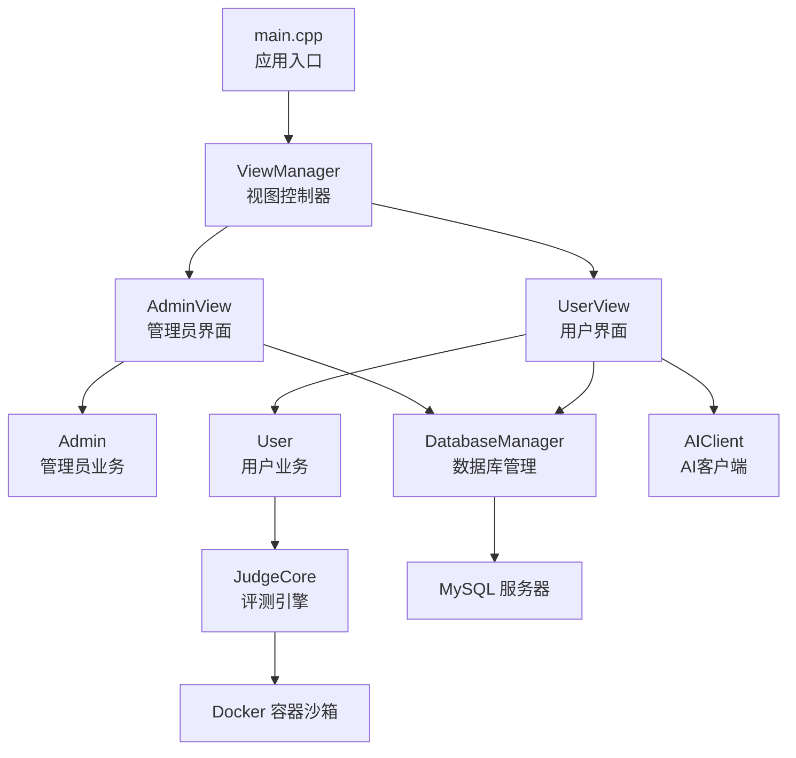
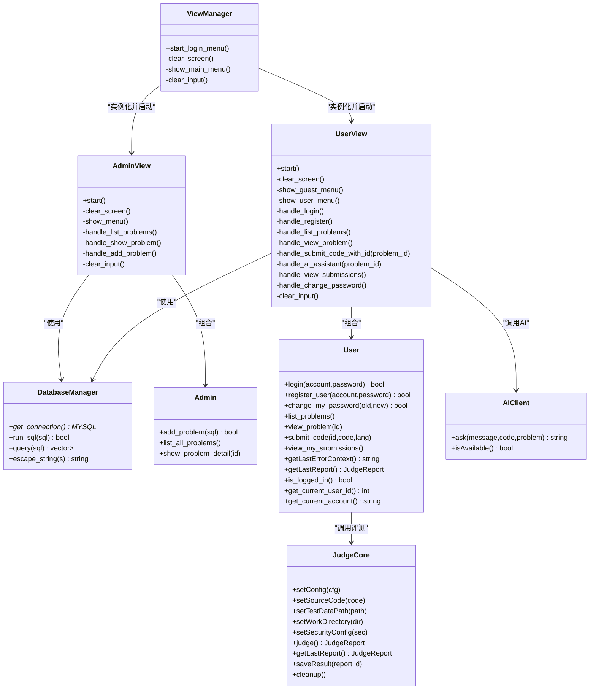
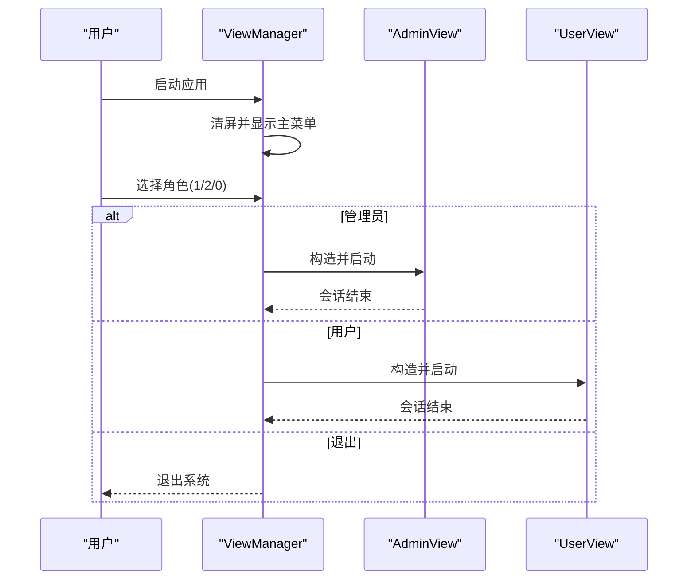
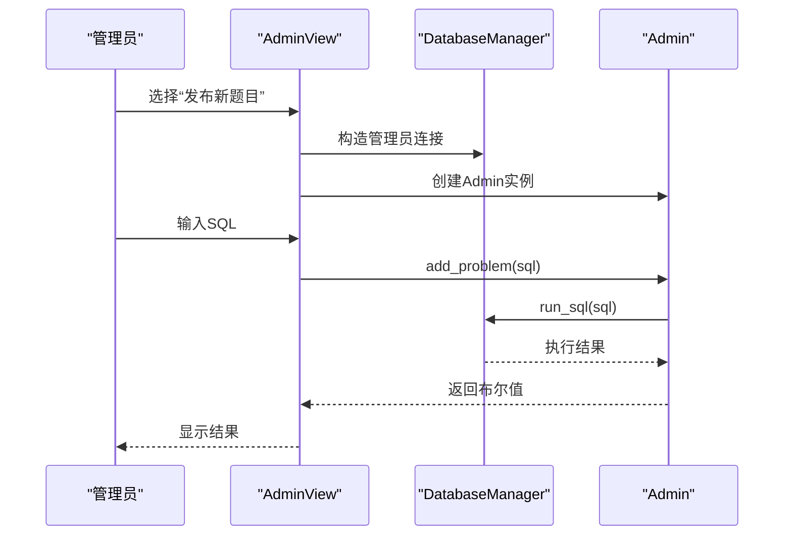
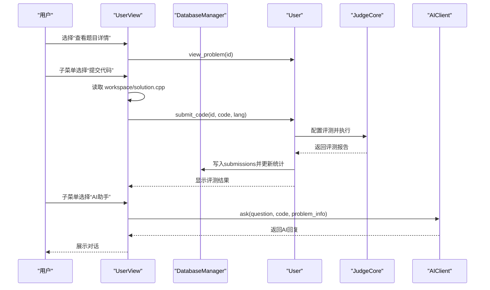
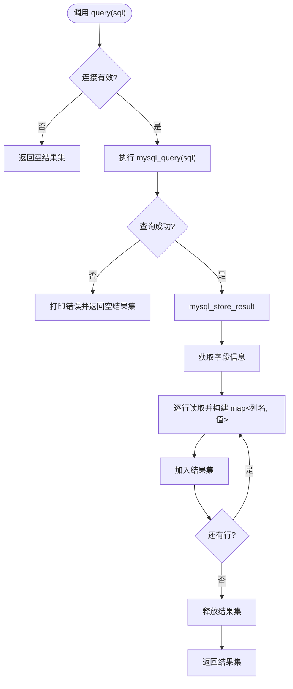
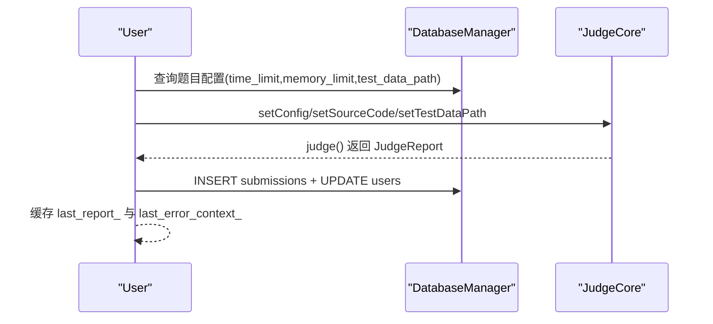
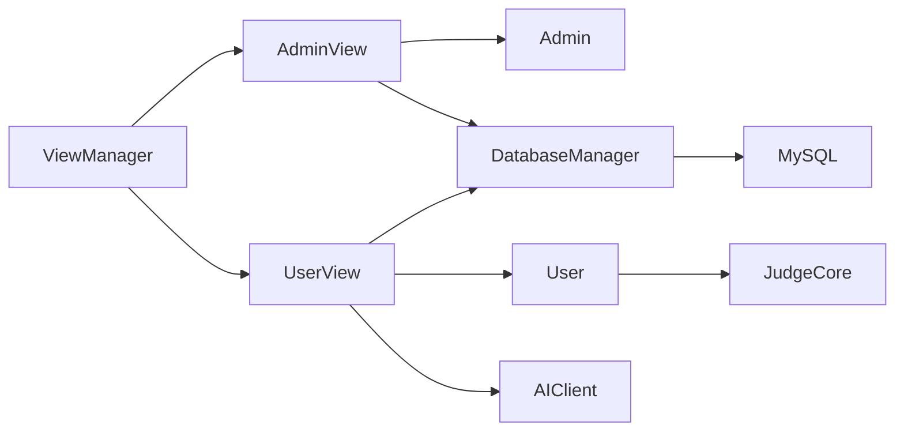

# 核心模块设计

<cite>
**本文引用的文件**
- [src/main.cpp](file://src/main.cpp)
- [include/view_manager.h](file://include/view_manager.h)
- [src/view_manager.cpp](file://src/view_manager.cpp)
- [include/admin_view.h](file://include/admin_view.h)
- [src/admin_view.cpp](file://src/admin_view.cpp)
- [include/user_view.h](file://include/user_view.h)
- [src/user_view.cpp](file://src/user_view.cpp)
- [include/db_manager.h](file://include/db_manager.h)
- [src/db_manager.cpp](file://src/db_manager.cpp)
- [include/admin.h](file://include/admin.h)
- [src/admin.cpp](file://src/admin.cpp)
- [include/user.h](file://include/user.h)
- [src/user.cpp](file://src/user.cpp)
- [include/judge_core.h](file://include/judge_core.h)
- [include/ai_client.h](file://include/ai_client.h)
- [src/ai_client.cpp](file://src/ai_client.cpp)
- [include/color_codes.h](file://include/color_codes.h)
</cite>

## 目录
1. [引言](#引言)
2. [项目结构](#项目结构)
3. [核心组件](#核心组件)
4. [架构总览](#架构总览)
5. [详细组件分析](#详细组件分析)
6. [依赖关系分析](#依赖关系分析)
7. [性能考虑](#性能考虑)
8. [故障排查指南](#故障排查指南)
9. [结论](#结论)
10. [附录](#附录)

## 引言
本文件面向OJ在线评测系统的核心模块，围绕视图管理层（ViewManager）、业务逻辑层（Admin/User）、数据访问层（DatabaseManager）以及评测与AI辅助模块，系统性地阐述其设计架构、交互流程、数据流转与接口规范。文档同时提供UML类图与时序图，帮助读者快速理解模块间的关系与职责划分。

## 项目结构
项目采用分层与职责分离的组织方式：
- 视图层：负责命令行界面展示与用户交互（ViewManager、AdminView、UserView）
- 业务逻辑层：封装管理员与用户特有的业务规则（Admin、User）
- 数据访问层：统一数据库连接、查询与执行（DatabaseManager）
- 评测与AI：JudgeCore负责容器化评测；AIClient封装外部AI服务调用
- 入口程序：main.cpp启动ViewManager并进入登录菜单

图表来源
- [src/main.cpp:1-14](file://src/main.cpp#L1-L14)
- [include/view_manager.h:1-43](file://include/view_manager.h#L1-L43)
- [src/view_manager.cpp:1-77](file://src/view_manager.cpp#L1-L77)
- [include/admin_view.h:1-58](file://include/admin_view.h#L1-L58)
- [src/admin_view.cpp:1-138](file://src/admin_view.cpp#L1-L138)
- [include/user_view.h:1-92](file://include/user_view.h#L1-L92)
- [src/user_view.cpp:1-415](file://src/user_view.cpp#L1-L415)
- [include/db_manager.h:1-60](file://include/db_manager.h#L1-L60)
- [src/db_manager.cpp:1-110](file://src/db_manager.cpp#L1-L110)
- [include/admin.h:1-40](file://include/admin.h#L1-L40)
- [src/admin.cpp:1-59](file://src/admin.cpp#L1-L59)
- [include/user.h:1-102](file://include/user.h#L1-L102)
- [src/user.cpp:1-560](file://src/user.cpp#L1-L560)
- [include/judge_core.h:1-189](file://include/judge_core.h#L1-L189)
- [include/ai_client.h:1-28](file://include/ai_client.h#L1-L28)
- [src/ai_client.cpp:1-124](file://src/ai_client.cpp#L1-L124)

章节来源
- [src/main.cpp:1-14](file://src/main.cpp#L1-L14)
- [include/view_manager.h:1-43](file://include/view_manager.h#L1-L43)
- [src/view_manager.cpp:1-77](file://src/view_manager.cpp#L1-L77)

## 核心组件
- 视图管理层（ViewManager）
  - 负责登录菜单与角色选择，根据用户选择实例化AdminView或UserView，并在会话结束后释放资源
  - 提供清屏、菜单展示与输入清理等通用能力
- 管理员界面（AdminView）
  - 建立管理员专用数据库连接，提供题目列表、详情查看与新增题目的SQL执行能力
- 用户界面（UserView）
  - 建立受限权限数据库连接，提供登录/注册、题目浏览、提交评测、查看提交记录、修改密码、AI助手等功能
- 数据库管理（DatabaseManager）
  - 封装MySQL连接、查询、执行与字符串转义，提供统一的SQL访问接口
- 管理员业务（Admin）
  - 基于DatabaseManager执行管理员操作，如列出题目、查看详情、执行新增题目的SQL
- 用户业务（User）
  - 实现用户认证、注册、改密、题目浏览、提交评测、查看提交历史等核心功能
- 评测引擎（JudgeCore）
  - 容器化评测核心，支持配置、源码注入、测试数据比对、资源限制与结果生成
- AI客户端（AIClient）
  - 封装Python脚本调用，向AI服务发送消息并接收响应，支持会话与上下文传递

章节来源
- [include/view_manager.h:1-43](file://include/view_manager.h#L1-L43)
- [src/view_manager.cpp:1-77](file://src/view_manager.cpp#L1-L77)
- [include/admin_view.h:1-58](file://include/admin_view.h#L1-L58)
- [src/admin_view.cpp:1-138](file://src/admin_view.cpp#L1-L138)
- [include/user_view.h:1-92](file://include/user_view.h#L1-L92)
- [src/user_view.cpp:1-415](file://src/user_view.cpp#L1-L415)
- [include/db_manager.h:1-60](file://include/db_manager.h#L1-L60)
- [src/db_manager.cpp:1-110](file://src/db_manager.cpp#L1-L110)
- [include/admin.h:1-40](file://include/admin.h#L1-L40)
- [src/admin.cpp:1-59](file://src/admin.cpp#L1-L59)
- [include/user.h:1-102](file://include/user.h#L1-L102)
- [src/user.cpp:1-560](file://src/user.cpp#L1-L560)
- [include/judge_core.h:1-189](file://include/judge_core.h#L1-L189)
- [include/ai_client.h:1-28](file://include/ai_client.h#L1-L28)
- [src/ai_client.cpp:1-124](file://src/ai_client.cpp#L1-L124)

## 架构总览
系统采用“视图-业务-数据访问”的分层架构，视图层仅负责交互与流程编排，业务层封装领域逻辑，数据访问层屏蔽底层存储细节。评测与AI作为独立模块通过接口与业务层耦合，保证核心流程清晰、可扩展性强。

图表来源
- [include/view_manager.h:1-43](file://include/view_manager.h#L1-L43)
- [src/view_manager.cpp:1-77](file://src/view_manager.cpp#L1-L77)
- [include/admin_view.h:1-58](file://include/admin_view.h#L1-L58)
- [src/admin_view.cpp:1-138](file://src/admin_view.cpp#L1-L138)
- [include/user_view.h:1-92](file://include/user_view.h#L1-L92)
- [src/user_view.cpp:1-415](file://src/user_view.cpp#L1-L415)
- [include/db_manager.h:1-60](file://include/db_manager.h#L1-L60)
- [src/db_manager.cpp:1-110](file://src/db_manager.cpp#L1-L110)
- [include/admin.h:1-40](file://include/admin.h#L1-L40)
- [src/admin.cpp:1-59](file://src/admin.cpp#L1-L59)
- [include/user.h:1-102](file://include/user.h#L1-L102)
- [src/user.cpp:1-560](file://src/user.cpp#L1-L560)
- [include/judge_core.h:1-189](file://include/judge_core.h#L1-L189)
- [include/ai_client.h:1-28](file://include/ai_client.h#L1-L28)
- [src/ai_client.cpp:1-124](file://src/ai_client.cpp#L1-L124)

## 详细组件分析

### 视图管理层（ViewManager）
- 职责
  - 提供登录主菜单，根据用户选择进入管理员或用户模式
  - 统一清屏、菜单展示与输入清理，避免重复逻辑
- 关键流程
  - 启动登录菜单循环，读取用户输入并路由到对应视图
  - 视图退出后自动释放资源，确保生命周期可控
- 错误处理
  - 输入非数字时清空缓冲区并提示
  - 默认分支提示无效选项

图表来源
- [src/view_manager.cpp:32-70](file://src/view_manager.cpp#L32-L70)
- [include/view_manager.h:20-40](file://include/view_manager.h#L20-L40)

章节来源
- [include/view_manager.h:1-43](file://include/view_manager.h#L1-L43)
- [src/view_manager.cpp:1-77](file://src/view_manager.cpp#L1-L77)

### 管理员界面（AdminView）
- 职责
  - 建立管理员数据库连接，提供题目管理菜单
  - 调用Admin对象执行SQL新增题目、列出题目、查看详情
- 关键流程
  - 连接成功后进入管理员菜单循环，处理各选项并调用Admin方法
  - 输入非数字时清空缓冲区并提示
- 错误处理
  - 数据库连接失败时提示并释放资源
  - 新增题目SQL为空或执行失败时提示

图表来源
- [src/admin_view.cpp:21-76](file://src/admin_view.cpp#L21-L76)
- [include/admin_view.h:20-54](file://include/admin_view.h#L20-L54)
- [src/admin.cpp:12-15](file://src/admin.cpp#L12-L15)
- [src/db_manager.cpp:22-25](file://src/db_manager.cpp#L22-L25)

章节来源
- [include/admin_view.h:1-58](file://include/admin_view.h#L1-L58)
- [src/admin_view.cpp:1-138](file://src/admin_view.cpp#L1-L138)
- [include/admin.h:1-40](file://include/admin.h#L1-L40)
- [src/admin.cpp:1-59](file://src/admin.cpp#L1-L59)
- [src/db_manager.cpp:1-110](file://src/db_manager.cpp#L1-L110)

### 用户界面（UserView）
- 职责
  - 建立受限权限数据库连接，提供登录/注册、题目浏览、提交评测、查看提交记录、修改密码、AI助手等功能
  - 在题目详情页提供“提交代码”和“AI助手”子菜单
- 关键流程
  - 未登录状态显示游客菜单，登录后切换为用户菜单
  - 提交代码前读取工作区文件，调用User::submit_code执行评测
  - AI助手根据题目信息与代码上下文调用AIClient
- 错误处理
  - 输入非数字时清空缓冲区并提示
  - AI服务不可用时提示并返回

图表来源
- [src/user_view.cpp:36-131](file://src/user_view.cpp#L36-L131)
- [src/user_view.cpp:213-274](file://src/user_view.cpp#L213-L274)
- [src/user_view.cpp:276-288](file://src/user_view.cpp#L276-L288)
- [src/user_view.cpp:290-374](file://src/user_view.cpp#L290-L374)
- [src/user.cpp:266-498](file://src/user.cpp#L266-L498)
- [include/user.h:55-75](file://include/user.h#L55-L75)
- [include/judge_core.h:111-186](file://include/judge_core.h#L111-L186)
- [include/ai_client.h:12-25](file://include/ai_client.h#L12-L25)
- [src/ai_client.cpp:85-112](file://src/ai_client.cpp#L85-L112)

章节来源
- [include/user_view.h:1-92](file://include/user_view.h#L1-L92)
- [src/user_view.cpp:1-415](file://src/user_view.cpp#L1-L415)
- [include/user.h:1-102](file://include/user.h#L1-L102)
- [src/user.cpp:1-560](file://src/user.cpp#L1-L560)
- [include/judge_core.h:1-189](file://include/judge_core.h#L1-L189)
- [include/ai_client.h:1-28](file://include/ai_client.h#L1-L28)
- [src/ai_client.cpp:1-124](file://src/ai_client.cpp#L1-L124)

### 数据访问层（DatabaseManager）
- 职责
  - 封装MySQL连接、查询与执行，提供字符串转义以防范SQL注入
- 关键接口
  - 构造/析构：建立与释放连接
  - run_sql：执行SQL并返回布尔结果
  - query：执行查询并返回行映射结果集
  - escape_string：对字符串进行转义
- 设计要点
  - 私有连接指针，避免外部直接操作
  - 查询结果以列名到值的映射形式返回，便于上层业务读取

图表来源
- [src/db_manager.cpp:36-67](file://src/db_manager.cpp#L36-L67)
- [include/db_manager.h:35-49](file://include/db_manager.h#L35-L49)

章节来源
- [include/db_manager.h:1-60](file://include/db_manager.h#L1-L60)
- [src/db_manager.cpp:1-110](file://src/db_manager.cpp#L1-L110)

### 业务逻辑层（Admin 与 User）
- Admin
  - 依赖DatabaseManager执行管理员操作，提供题目列表、详情查看与SQL新增
- User
  - 实现用户认证（SHA256哈希）、注册、改密、题目浏览、提交评测、查看提交历史
  - 评测流程：获取题目配置、准备测试数据、调用JudgeCore评测、写入submissions并更新统计、展示结果
  - 提供最近评测错误上下文，供AI分析使用

图表来源
- [src/user.cpp:266-498](file://src/user.cpp#L266-L498)
- [include/user.h:55-98](file://include/user.h#L55-L98)
- [include/judge_core.h:111-186](file://include/judge_core.h#L111-L186)

章节来源
- [include/admin.h:1-40](file://include/admin.h#L1-L40)
- [src/admin.cpp:1-59](file://src/admin.cpp#L1-L59)
- [include/user.h:1-102](file://include/user.h#L1-L102)
- [src/user.cpp:1-560](file://src/user.cpp#L1-L560)

### 评测引擎（JudgeCore）与AI客户端（AIClient）
- JudgeCore
  - 通过PIMPL隐藏实现细节，提供配置、源码注入、测试数据设置、安全配置、评测执行与结果持久化接口
- AIClient
  - 封装Python脚本调用，支持参数转义、会话标识与可用性检测

章节来源
- [include/judge_core.h:1-189](file://include/judge_core.h#L1-L189)
- [include/ai_client.h:1-28](file://include/ai_client.h#L1-L28)
- [src/ai_client.cpp:1-124](file://src/ai_client.cpp#L1-L124)

## 依赖关系分析
- 视图层对业务层的依赖
  - AdminView依赖Admin与DatabaseManager
  - UserView依赖User、DatabaseManager与AIClient
- 业务层对数据访问层的依赖
  - Admin与User均依赖DatabaseManager
- 评测与AI的集成
  - User通过JudgeCore完成评测；UserView通过AIClient调用AI服务
- 资源管理
  - 视图层使用智能指针管理业务对象生命周期，避免泄漏

图表来源
- [include/view_manager.h:4-6](file://include/view_manager.h#L4-L6)
- [include/admin_view.h:4-6](file://include/admin_view.h#L4-L6)
- [include/user_view.h:4-6](file://include/user_view.h#L4-L6)
- [include/admin.h:4](file://include/admin.h#L4)
- [include/user.h:4-5](file://include/user.h#L4-L5)

章节来源
- [include/view_manager.h:1-43](file://include/view_manager.h#L1-L43)
- [include/admin_view.h:1-58](file://include/admin_view.h#L1-L58)
- [include/user_view.h:1-92](file://include/user_view.h#L1-L92)
- [include/db_manager.h:1-60](file://include/db_manager.h#L1-L60)

## 性能考虑
- I/O与网络
  - 用户提交代码后评测可能涉及磁盘IO与Docker容器启动，建议合理设置时间/内存限制，避免超时与资源浪费
- 数据库查询
  - 列表与详情查询应尽量减少不必要的字段与排序，避免大结果集传输
- AI调用
  - Python脚本调用存在阻塞风险，建议在用户界面层增加超时与重试策略
- 内存与字符串处理
  - 用户密码哈希与字符串转义应避免重复分配，保持高效

## 故障排查指南
- 登录/注册失败
  - 检查数据库连接参数与账号是否存在
  - 确认密码哈希算法一致
- 提交评测无结果
  - 检查测试数据路径是否存在，或回退到本地data目录
  - 确认JudgeCore配置（时间/内存限制）合理
- AI助手不可用
  - 检查Python路径与脚本文件是否存在
  - 确认会话参数与上下文拼接正确
- 数据库错误
  - 查看错误日志，确认SQL语法与权限

章节来源
- [src/user.cpp:41-100](file://src/user.cpp#L41-L100)
- [src/user.cpp:266-498](file://src/user.cpp#L266-L498)
- [src/ai_client.cpp:85-123](file://src/ai_client.cpp#L85-L123)
- [src/db_manager.cpp:42-46](file://src/db_manager.cpp#L42-L46)

## 结论
本系统通过清晰的分层与职责分离，实现了稳定的命令行交互、可靠的业务逻辑与可扩展的数据访问。视图管理层承担流程编排，业务层封装领域规则，数据访问层提供统一接口，评测与AI模块作为横切关注点与核心流程解耦。整体设计兼顾了安全性（容器化评测、只读文件系统、能力降级）、可维护性与可扩展性。

## 附录
- 接口规范与数据流转说明
  - 视图层
    - start_login_menu(): 启动登录菜单循环，选择角色后进入对应视图
    - AdminView::start(): 建立管理员连接，进入菜单循环，调用Admin方法
    - UserView::start(): 建立用户连接，根据登录状态切换菜单，调用User方法
  - 业务层
    - Admin::add_problem(sql): 执行新增题目的SQL
    - User::submit_code(id, code, lang): 评测并写入提交记录
  - 数据访问层
    - DatabaseManager::query(sql): 返回行映射结果集
    - DatabaseManager::run_sql(sql): 执行SQL并返回布尔结果
  - 评测与AI
    - JudgeCore::judge(): 返回评测报告
    - AIClient::ask(message, code, problem): 返回AI回复

章节来源
- [include/view_manager.h:17-40](file://include/view_manager.h#L17-L40)
- [include/admin_view.h:17-54](file://include/admin_view.h#L17-L54)
- [include/user_view.h:17-88](file://include/user_view.h#L17-L88)
- [include/admin.h:17-33](file://include/admin.h#L17-L33)
- [include/user.h:19-90](file://include/user.h#L19-L90)
- [include/db_manager.h:25-49](file://include/db_manager.h#L25-L49)
- [include/judge_core.h:111-186](file://include/judge_core.h#L111-L186)
- [include/ai_client.h:12-25](file://include/ai_client.h#L12-L25)