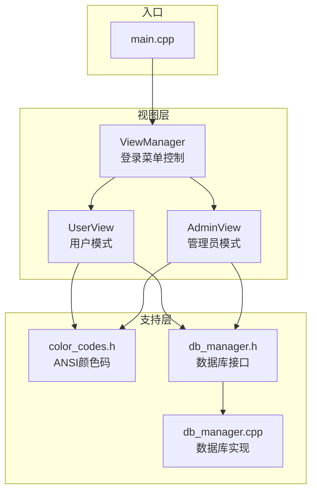
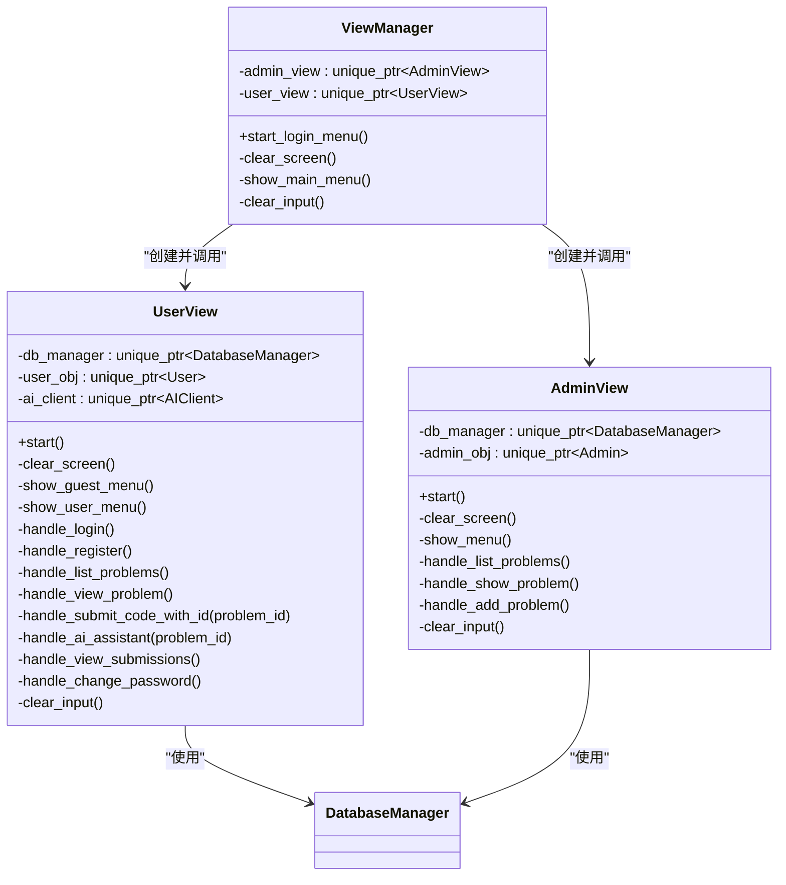
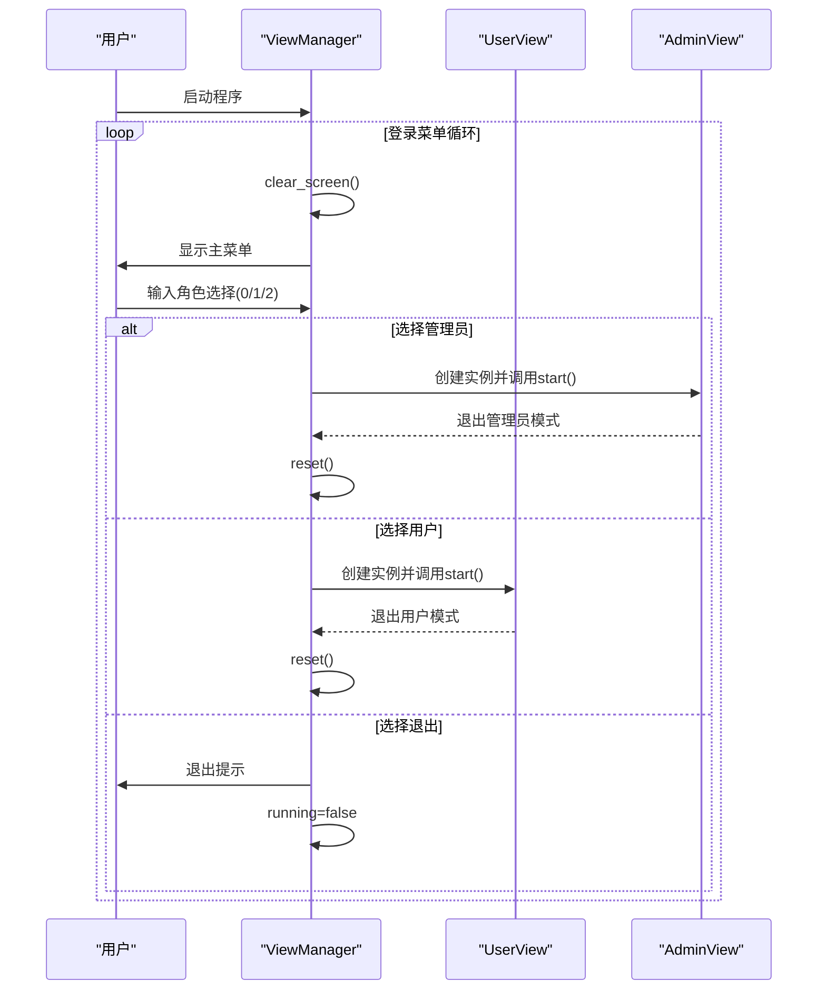
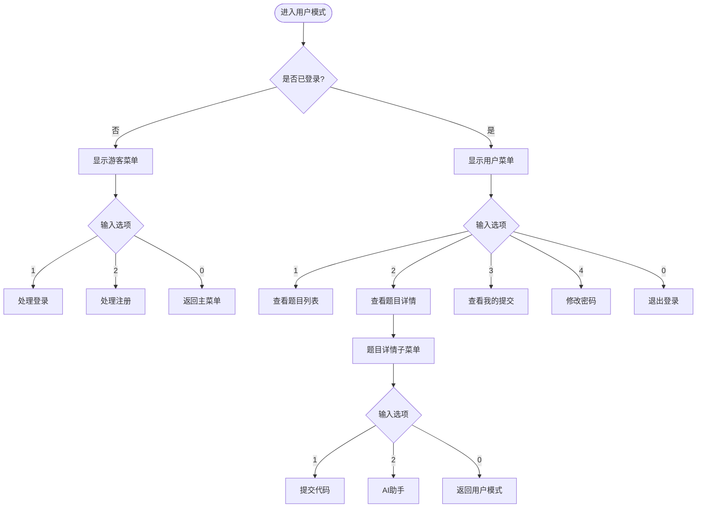
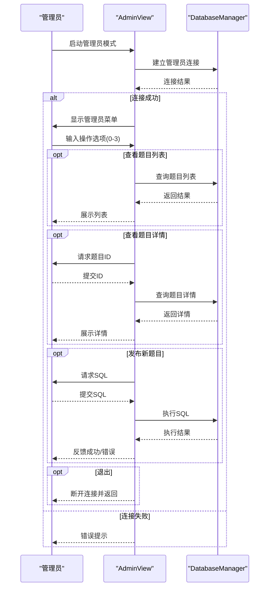
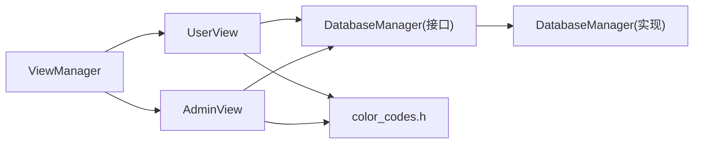

# 视图层设计

<cite>
**本文引用的文件**
- [main.cpp](file://src/main.cpp)
- [view_manager.h](file://include/view_manager.h)
- [view_manager.cpp](file://src/view_manager.cpp)
- [user_view.h](file://include/user_view.h)
- [user_view.cpp](file://src/user_view.cpp)
- [admin_view.h](file://include/admin_view.h)
- [admin_view.cpp](file://src/admin_view.cpp)
- [color_codes.h](file://include/color_codes.h)
- [db_manager.h](file://include/db_manager.h)
- [db_manager.cpp](file://src/db_manager.cpp)
</cite>

## 目录
1. [简介](#简介)
2. [项目结构](#项目结构)
3. [核心组件](#核心组件)
4. [架构总览](#架构总览)
5. [详细组件分析](#详细组件分析)
6. [依赖关系分析](#依赖关系分析)
7. [性能考虑](#性能考虑)
8. [故障排查指南](#故障排查指南)
9. [结论](#结论)
10. [附录](#附录)

## 简介
本文件面向OJ在线评测系统的视图层，系统化梳理ViewManager作为命令行界面主控制器的设计架构，深入解析登录菜单启动机制、主菜单显示逻辑与用户输入处理流程；详细说明UserView与AdminView的界面设计模式，包括菜单组织结构、用户交互处理与界面渲染机制；阐述视图层与业务逻辑层的解耦设计，包括接口抽象与数据传递协议；解释命令行界面的用户体验设计原则，包括提示信息、错误处理与导航逻辑；最后提供视图层的扩展性设计与自定义界面组件的实现方法，并给出界面流程图与用户交互序列图，帮助读者全面理解视图层工作机制。

## 项目结构
视图层位于include与src目录下，采用“头文件声明+源文件实现”的分层组织方式：
- include层：声明ViewManager、UserView、AdminView等视图类及其对外接口
- src层：实现视图类的具体逻辑，负责菜单渲染、输入处理、与业务对象交互
- color_codes.h：统一管理ANSI颜色码，用于终端高亮输出
- db_manager.h/db_manager.cpp：数据库访问层，被UserView/AdminView复用

图表来源
- [main.cpp:1-14](file://src/main.cpp#L1-L14)
- [view_manager.h:1-43](file://include/view_manager.h#L1-L43)
- [view_manager.cpp:1-77](file://src/view_manager.cpp#L1-L77)
- [user_view.h:1-92](file://include/user_view.h#L1-L92)
- [user_view.cpp:1-415](file://src/user_view.cpp#L1-L415)
- [admin_view.h:1-58](file://include/admin_view.h#L1-L58)
- [admin_view.cpp:1-138](file://src/admin_view.cpp#L1-L138)
- [color_codes.h:1-18](file://include/color_codes.h#L1-L18)
- [db_manager.h:1-59](file://include/db_manager.h#L1-L59)
- [db_manager.cpp:1-53](file://src/db_manager.cpp#L1-L53)

章节来源
- [main.cpp:1-14](file://src/main.cpp#L1-L14)
- [view_manager.h:1-43](file://include/view_manager.h#L1-L43)
- [view_manager.cpp:1-77](file://src/view_manager.cpp#L1-L77)
- [user_view.h:1-92](file://include/user_view.h#L1-L92)
- [user_view.cpp:1-415](file://src/user_view.cpp#L1-L415)
- [admin_view.h:1-58](file://include/admin_view.h#L1-L58)
- [admin_view.cpp:1-138](file://src/admin_view.cpp#L1-L138)
- [color_codes.h:1-18](file://include/color_codes.h#L1-L18)
- [db_manager.h:1-59](file://include/db_manager.h#L1-L59)
- [db_manager.cpp:1-53](file://src/db_manager.cpp#L1-L53)

## 核心组件
- ViewManager：命令行界面主控制器，负责登录菜单启动、主菜单展示与角色选择，协调UserView与AdminView的生命周期
- UserView：用户模式视图，提供游客菜单与登录后菜单，处理登录/注册/查看题目/提交代码/AI助手/查看提交/修改密码等交互
- AdminView：管理员模式视图，提供管理员菜单，处理题目列表查看、题目详情查看、新增题目（手动SQL）等操作
- color_codes.h：ANSI颜色常量，统一终端输出样式
- DatabaseManager：数据库访问层，被UserView/AdminView复用，提供连接、查询、SQL执行与转义能力

章节来源
- [view_manager.h:11-40](file://include/view_manager.h#L11-L40)
- [user_view.h:12-89](file://include/user_view.h#L12-L89)
- [admin_view.h:11-55](file://include/admin_view.h#L11-L55)
- [color_codes.h:4-15](file://include/color_codes.h#L4-L15)
- [db_manager.h:12-53](file://include/db_manager.h#L12-L53)

## 架构总览
视图层采用“主控制器 + 多视图模式”的架构：
- 主控制器ViewManager集中管理登录菜单与角色切换，按需创建UserView/AdminView实例，完成一次交互后销毁，避免跨会话状态污染
- UserView/AdminView各自维护独立的菜单状态机与输入处理循环，内部通过DatabaseManager与业务模型交互
- 终端渲染统一通过color_codes.h提供的ANSI颜色码，提升可读性与用户体验

图表来源
- [view_manager.h:11-40](file://include/view_manager.h#L11-L40)
- [user_view.h:12-89](file://include/user_view.h#L12-L89)
- [admin_view.h:11-55](file://include/admin_view.h#L11-L55)
- [db_manager.h:12-53](file://include/db_manager.h#L12-L53)

## 详细组件分析

### ViewManager：登录菜单与角色控制
- 登录菜单启动：start_login_menu()循环显示主菜单，接收用户选择，根据1/2进入管理员/用户模式，0退出系统
- 角色进入：选择对应角色时动态创建AdminView/UserView实例，调用其start()后立即reset()，确保会话隔离
- 输入处理：统一使用clear_input()清理输入缓冲区，防止非数字输入导致的输入流异常
- 清屏：clear_screen()使用ANSI转义序列清屏并重置光标位置，保证界面整洁

图表来源
- [view_manager.cpp:32-70](file://src/view_manager.cpp#L32-L70)

章节来源
- [view_manager.cpp:14-76](file://src/view_manager.cpp#L14-L76)
- [view_manager.h:11-40](file://include/view_manager.h#L11-L40)

### UserView：用户模式界面与交互
- 模式启动：start()建立数据库连接，根据登录状态切换游客菜单或用户菜单
- 菜单结构：
  - 未登录：登录/注册/返回主菜单
  - 已登录：题目列表/题目详情/我的提交/修改密码/退出登录
- 输入处理：统一的数字输入校验与clear_input()清理，对特殊返回值（如输入0）进行分支处理
- 题目详情子菜单：进入题目详情后提供“提交代码”“AI助手”“返回用户模式”，形成二级菜单
- AI助手：读取工作区代码与题目信息，结合上次评测错误上下文，支持与AI客户端交互；当AI请求题库数据时，按需加载题库列表并再次调用AI
- 文件读取：辅助函数read_file()安全读取workspace/solution.cpp，若为空则提示先编写代码

图表来源
- [user_view.cpp:36-131](file://src/user_view.cpp#L36-L131)
- [user_view.cpp:213-274](file://src/user_view.cpp#L213-L274)
- [user_view.cpp:276-288](file://src/user_view.cpp#L276-L288)
- [user_view.cpp:290-374](file://src/user_view.cpp#L290-L374)

章节来源
- [user_view.cpp:25-131](file://src/user_view.cpp#L25-L131)
- [user_view.cpp:133-157](file://src/user_view.cpp#L133-L157)
- [user_view.cpp:159-211](file://src/user_view.cpp#L159-L211)
- [user_view.cpp:213-274](file://src/user_view.cpp#L213-L274)
- [user_view.cpp:276-288](file://src/user_view.cpp#L276-L288)
- [user_view.cpp:290-374](file://src/user_view.cpp#L290-L374)
- [user_view.cpp:376-408](file://src/user_view.cpp#L376-L408)

### AdminView：管理员模式界面与交互
- 模式启动：start()建立管理员数据库连接，显示管理员菜单
- 菜单结构：查看所有题目/查看题目详情/发布新题目/返回登录菜单
- 输入处理：统一的数字输入校验与clear_input()清理，对空SQL语句进行保护
- 新增题目：支持手动输入SQL语句，执行后反馈成功或错误

图表来源
- [admin_view.cpp:21-76](file://src/admin_view.cpp#L21-L76)
- [admin_view.cpp:91-131](file://src/admin_view.cpp#L91-L131)

章节来源
- [admin_view.cpp:10-76](file://src/admin_view.cpp#L10-L76)
- [admin_view.cpp:78-89](file://src/admin_view.cpp#L78-L89)
- [admin_view.cpp:91-131](file://src/admin_view.cpp#L91-L131)

### 颜色与终端渲染
- color_codes.h提供ANSI颜色常量，ViewManager/UserView/AdminView在关键提示与错误信息中使用颜色码，提升可读性
- 清屏：各视图均使用ANSI转义序列清屏并重置光标，保证界面整洁

章节来源
- [color_codes.h:4-15](file://include/color_codes.h#L4-L15)
- [view_manager.cpp:14-19](file://src/view_manager.cpp#L14-L19)
- [user_view.cpp:29-34](file://src/user_view.cpp#L29-L34)
- [admin_view.cpp:14-19](file://src/admin_view.cpp#L14-L19)

## 依赖关系分析
- ViewManager依赖UserView/AdminView，二者均依赖DatabaseManager
- DatabaseManager封装MySQL连接与查询，提供转义与查询结果集
- color_codes.h被ViewManager/UserView/AdminView直接包含，统一终端输出风格

图表来源
- [view_manager.h:4-6](file://include/view_manager.h#L4-L6)
- [user_view.h:4-6](file://include/user_view.h#L4-L6)
- [admin_view.h:4-5](file://include/admin_view.h#L4-L5)
- [color_codes.h:1-18](file://include/color_codes.h#L1-L18)
- [db_manager.h:12-53](file://include/db_manager.h#L12-L53)
- [db_manager.cpp:1-53](file://src/db_manager.cpp#L1-L53)

章节来源
- [view_manager.h:4-6](file://include/view_manager.h#L4-L6)
- [user_view.h:4-6](file://include/user_view.h#L4-L6)
- [admin_view.h:4-5](file://include/admin_view.h#L4-L5)
- [db_manager.h:12-53](file://include/db_manager.h#L12-L53)
- [db_manager.cpp:1-53](file://src/db_manager.cpp#L1-L53)

## 性能考虑
- 输入处理：统一的输入校验与缓冲区清理，避免因格式错误导致的重复读取与死循环
- 清屏策略：仅在必要时清屏（如进入新菜单或子菜单），减少不必要的终端刷新
- AI交互：按需加载题库列表，避免一次性传输大量数据；对空输入进行忽略，减少无效请求
- 数据库访问：通过DatabaseManager统一管理连接与查询，避免重复连接与SQL注入风险

## 故障排查指南
- 登录菜单无法退出：检查start_login_menu()中的running标志与case 0分支
- 用户模式无法返回主菜单：检查UserView::start()中未登录状态下的返回逻辑
- 题目详情子菜单无法返回：检查handle_view_problem()中的子菜单循环与返回条件
- AI助手不可用：确认AIClient可用性与workspace/solution.cpp存在且非空
- 数据库连接失败：检查DatabaseManager构造参数与连接状态，查看错误提示

章节来源
- [view_manager.cpp:32-70](file://src/view_manager.cpp#L32-L70)
- [user_view.cpp:36-131](file://src/user_view.cpp#L36-L131)
- [user_view.cpp:213-274](file://src/user_view.cpp#L213-L274)
- [admin_view.cpp:21-76](file://src/admin_view.cpp#L21-L76)

## 结论
视图层通过ViewManager集中控制登录与角色切换，配合UserView/AdminView的菜单状态机与输入处理，实现了清晰的命令行交互体验。通过color_codes.h统一终端渲染，通过DatabaseManager解耦数据库访问，整体架构具备良好的可维护性与扩展性。建议后续可在以下方面进一步增强：引入更完善的日志记录、增加超时与重试机制、优化AI交互的上下文管理与缓存策略。

## 附录
- 扩展性设计建议：
  - 新增视图：遵循现有模式，新增头文件与实现文件，提供start()与菜单处理函数
  - 自定义界面组件：可抽象出通用的菜单渲染器与输入验证器，减少重复代码
  - 错误处理：统一错误码与提示模板，便于国际化与多语言支持
  - 性能优化：对频繁查询进行缓存，对大文本输出进行分页或延迟渲染