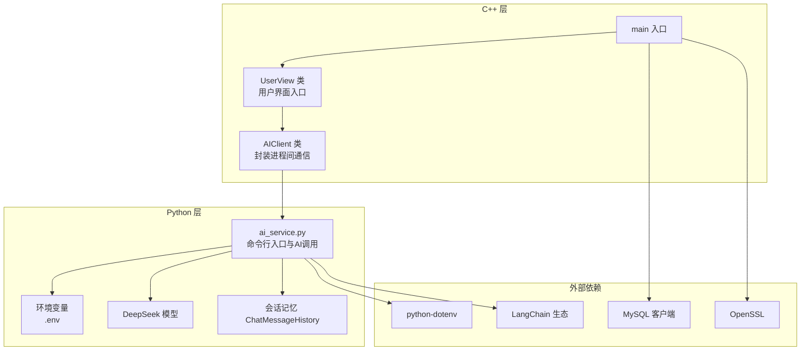
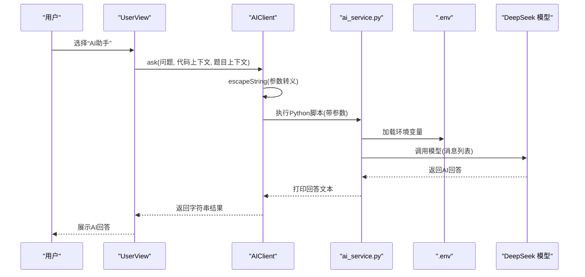
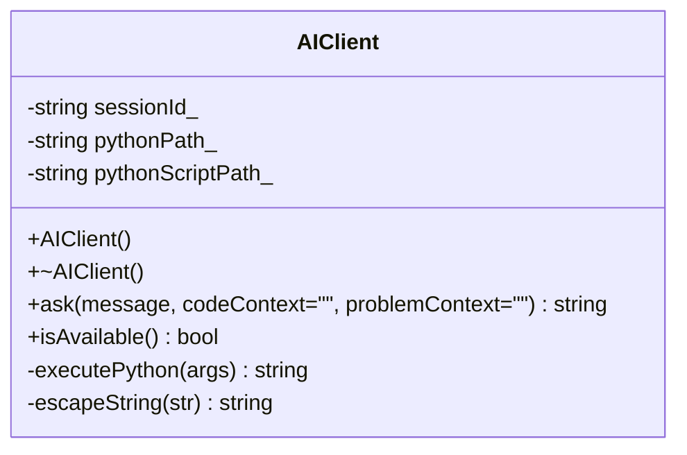
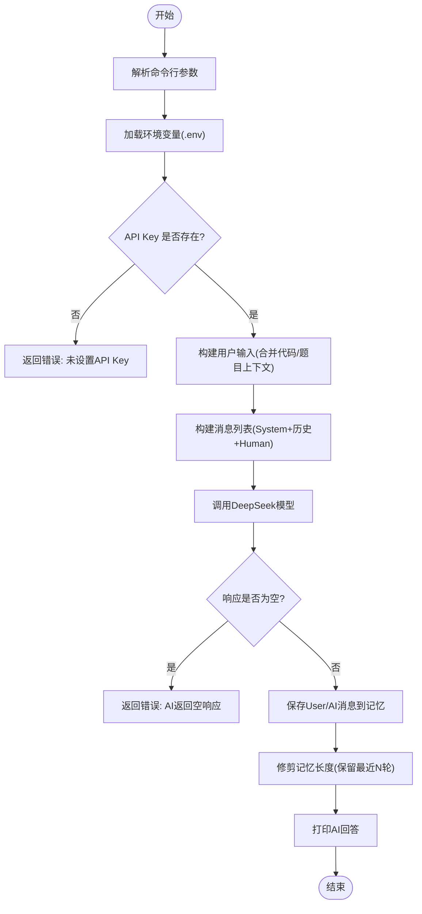
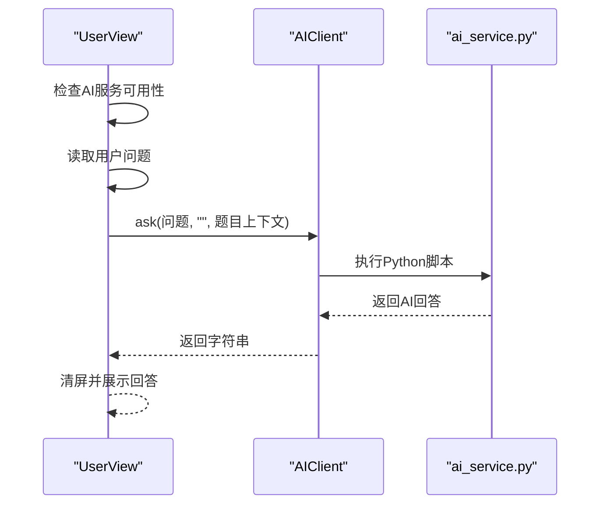
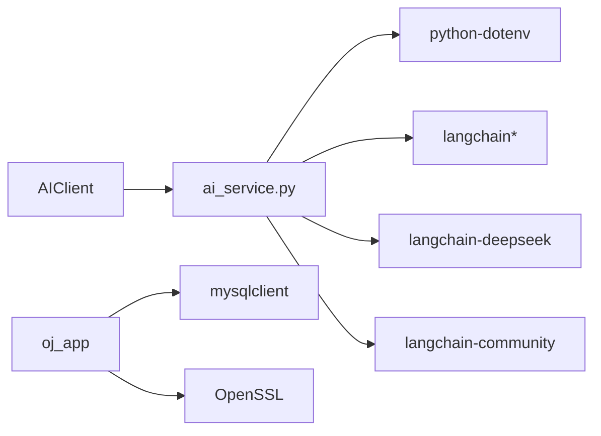

# AI服务客户端

<cite>
**本文引用的文件**
- [ai_client.h](file://include/ai_client.h)
- [ai_client.cpp](file://src/ai_client.cpp)
- [ai_service.py](file://ai/ai_service.py)
- [requirements.txt](file://ai/requirements.txt)
- [user_view.h](file://include/user_view.h)
- [user_view.cpp](file://src/user_view.cpp)
- [main.cpp](file://src/main.cpp)
- [CMakeLists.txt](file://CMakeLists.txt)
- [setup.sh](file://setup.sh)
- [init.sql](file://init.sql)
- [README.md](file://README.md)
- [ai.md](file://ai.md)
</cite>

## 目录
1. [简介](#简介)
2. [项目结构](#项目结构)
3. [核心组件](#核心组件)
4. [架构总览](#架构总览)
5. [详细组件分析](#详细组件分析)
6. [依赖分析](#依赖分析)
7. [性能考虑](#性能考虑)
8. [故障排除指南](#故障排除指南)
9. [结论](#结论)
10. [附录](#附录)

## 简介
本文件面向OJ系统的AI服务客户端，聚焦AIClient类的设计与实现，系统阐述其与Python AI服务之间的进程间通信机制、消息传递协议、会话管理与调用流程。文档同时提供在用户模块中集成AI辅助功能的实践指导、接口设计规范、配置指南、性能优化建议与故障排除方法，并说明如何扩展支持其他AI模型。

## 项目结构
- C++侧提供AIClient类，负责封装与Python AI服务的交互，包括命令拼装、参数转义、进程调用与结果解析。
- Python侧提供ai_service.py，负责加载环境变量、构建消息上下文、调用DeepSeek模型、维护会话记忆并返回结果。
- 用户界面层在用户模式下提供“AI助手”入口，调用AIClient完成问答。
- 构建系统通过CMake链接MySQL与OpenSSL，便于在Linux环境下编译运行。

**图表来源**
- [ai_client.cpp:1-124](file://src/ai_client.cpp#L1-L124)
- [ai_service.py:1-113](file://ai/ai_service.py#L1-L113)
- [user_view.cpp:275-311](file://src/user_view.cpp#L275-L311)
- [CMakeLists.txt:1-39](file://CMakeLists.txt#L1-L39)

**章节来源**
- [CMakeLists.txt:1-39](file://CMakeLists.txt#L1-L39)
- [README.md:1-2](file://README.md#L1-L2)

## 核心组件
- AIClient：C++侧AI客户端，负责：
  - 会话标识管理（默认会话ID）
  - Python解释器与脚本路径探测（优先虚拟环境，其次构建目录）
  - 参数转义与命令拼装
  - 通过管道执行Python脚本并收集标准输出
  - 可用性检测
- ai_service.py：Python侧AI服务，负责：
  - 命令行参数解析（消息、会话ID、代码上下文、题目上下文）
  - 系统提示词与“严师”模式策略
  - 会话记忆（ChatMessageHistory）与长度控制
  - DeepSeek模型调用与异常处理
  - 环境变量加载与API Key校验
- 用户界面集成：UserView在“查看题目详情”子菜单中提供“AI助手”入口，调用AIClient完成问答。

**章节来源**
- [ai_client.h:6-25](file://include/ai_client.h#L6-L25)
- [ai_client.cpp:8-23](file://src/ai_client.cpp#L8-L23)
- [ai_service.py:93-112](file://ai/ai_service.py#L93-L112)
- [user_view.h:69-73](file://include/user_view.h#L69-L73)
- [user_view.cpp:275-311](file://src/user_view.cpp#L275-L311)

## 架构总览
C++与Python之间通过命令行参数进行轻量级通信。C++侧构造参数字符串并以同步方式执行Python脚本，Python侧解析参数、构建消息列表、调用模型并打印响应文本。该架构简单可靠，适合CLI与终端场景。

**图表来源**
- [user_view.cpp:275-311](file://src/user_view.cpp#L275-L311)
- [ai_client.cpp:85-112](file://src/ai_client.cpp#L85-L112)
- [ai_service.py:93-112](file://ai/ai_service.py#L93-L112)

## 详细组件分析

### AIClient类设计与实现
- 设计要点
  - 会话隔离：通过会话ID区分不同用户的上下文
  - 路径自适应：优先使用ai/venv/bin/python，若不存在则回退到../ai/ai_service.py
  - 参数安全：对双引号、反斜杠、换行符等进行转义，避免Shell注入与解析错误
  - 同步执行：使用popen读取标准输出，处理尾随换行
  - 错误处理：对空结果与执行失败进行统一错误提示
- 关键方法
  - ask：拼装参数并调用executePython
  - executePython：拼装命令、执行脚本、收集输出
  - escapeString：对特殊字符进行转义
  - isAvailable：检查Python解释器与脚本是否存在

**图表来源**
- [ai_client.h:6-25](file://include/ai_client.h#L6-L25)
- [ai_client.cpp:8-123](file://src/ai_client.cpp#L8-L123)

**章节来源**
- [ai_client.h:6-25](file://include/ai_client.h#L6-L25)
- [ai_client.cpp:8-123](file://src/ai_client.cpp#L8-L123)

### Python AI服务接口与消息协议
- 命令行参数
  - --message：必填，用户问题
  - --session：可选，默认"default"
  - --code：可选，代码上下文
  - --problem：可选，题目上下文
- 上下文构建
  - 若提供代码上下文，将问题前拼接“我的代码”块
  - 若提供题目上下文，将问题前拼接“题目信息”块
- 会话记忆
  - 使用ChatMessageHistory维护每会话的消息历史
  - 限制消息总数（超过阈值时移除最早的一对User/AI消息）
- 异常处理
  - API Key缺失时返回明确错误
  - 捕获异常并打印堆栈到stderr，同时返回友好错误信息

**图表来源**
- [ai_service.py:93-112](file://ai/ai_service.py#L93-L112)
- [ai_service.py:40-91](file://ai/ai_service.py#L40-L91)

**章节来源**
- [ai_service.py:93-112](file://ai/ai_service.py#L93-L112)
- [ai_service.py:40-91](file://ai/ai_service.py#L40-L91)

### 用户模块集成与调用流程
- 入口位置
  - 在“查看题目详情”的子菜单中提供“AI助手”选项
- 调用步骤
  - 检查AIClient可用性
  - 读取用户问题
  - 调用ask，传入问题与题目上下文
  - 展示AI回答并等待用户确认

**图表来源**
- [user_view.cpp:275-311](file://src/user_view.cpp#L275-L311)
- [ai_client.cpp:85-112](file://src/ai_client.cpp#L85-L112)
- [ai_service.py:93-112](file://ai/ai_service.py#L93-L112)

**章节来源**
- [user_view.h:69-73](file://include/user_view.h#L69-L73)
- [user_view.cpp:275-311](file://src/user_view.cpp#L275-L311)

### 会话管理与上下文控制
- 会话隔离
  - 通过会话ID映射到独立的ChatMessageHistory对象，确保不同用户不互相干扰
- 上下文控制
  - 将“我的代码”和“题目信息”作为用户输入的一部分，帮助模型在特定问题域内回答
  - 限制记忆长度，避免上下文过长导致Token浪费或幻觉

**章节来源**
- [ai_service.py:33-37](file://ai/ai_service.py#L33-L37)
- [ai_service.py:56-66](file://ai/ai_service.py#L56-L66)
- [ai_service.py:79-82](file://ai/ai_service.py#L79-L82)

## 依赖分析
- Python依赖
  - python-dotenv：加载.env文件
  - langchain系列：消息与链路管理
  - langchain-deepseek：DeepSeek模型适配器
  - langchain-community：消息历史等工具
- C++构建依赖
  - MySQL客户端库（mysqlclient）
  - OpenSSL加密库
- 运行时路径
  - C++侧优先查找ai/venv/bin/python与ai/ai_service.py
  - 若未找到，则回退到../ai/路径

**图表来源**
- [requirements.txt:1-7](file://ai/requirements.txt#L1-L7)
- [CMakeLists.txt:11-34](file://CMakeLists.txt#L11-L34)
- [ai_client.cpp:10-22](file://src/ai_client.cpp#L10-L22)

**章节来源**
- [requirements.txt:1-7](file://ai/requirements.txt#L1-L7)
- [CMakeLists.txt:11-34](file://CMakeLists.txt#L11-L34)
- [ai_client.cpp:10-22](file://src/ai_client.cpp#L10-L22)

## 性能考虑
- 进程开销
  - 每次调用都会启动一次Python解释器，建议在高频场景下评估是否引入HTTP微服务以减少进程启动成本
- 上下文长度
  - 通过限制记忆轮数与合并上下文，降低Token消耗与延迟
- I/O吞吐
  - 使用固定大小缓冲区读取Python输出，避免大响应时的内存抖动
- 并发与重入
  - 当前实现为同步阻塞；若需并发，应考虑线程安全与会话锁

[本节为通用性能建议，无需特定文件引用]

## 故障排除指南
- AI服务不可用
  - 症状：提示“AI服务不可用，请检查配置”
  - 排查：确认ai/venv/bin/python与ai/ai_service.py存在；若在构建目录运行，确认../ai/路径正确
- 空响应
  - 症状：提示“AI返回空响应”
  - 排查：检查网络连通性与API Key配置；查看Python侧stderr输出
- API Key缺失
  - 症状：提示“未设置DEEPSEEK_API_KEY”
  - 排查：在.ai/.env文件中添加DEEPSEEK_API_KEY
- 参数转义问题
  - 症状：命令行参数解析异常
  - 排查：确认escapeString逻辑覆盖所有特殊字符；避免在消息中混入未转义的引号或换行
- 路径问题
  - 症状：找不到Python解释器或脚本
  - 排查：根据运行目录调整相对路径；或在构建后将资源复制到可执行文件同级目录

**章节来源**
- [ai_client.cpp:17-22](file://src/ai_client.cpp#L17-L22)
- [ai_client.cpp:67-70](file://src/ai_client.cpp#L67-L70)
- [ai_client.cpp:105-109](file://src/ai_client.cpp#L105-L109)
- [ai_service.py:42-44](file://ai/ai_service.py#L42-L44)
- [ai_service.py:85-90](file://ai/ai_service.py#L85-L90)

## 结论
AIClient与ai_service.py构成了一套简洁可靠的C++到Python进程间通信方案。通过命令行参数传递与标准输出回传，实现了稳定的AI问答能力。结合会话记忆与“严师”策略，满足OJ平台的教育场景需求。后续可在保证稳定性的前提下，逐步引入HTTP微服务与流式输出，进一步提升性能与体验。

[本节为总结性内容，无需特定文件引用]

## 附录

### 如何在用户模块中集成AI辅助功能
- 在用户菜单中添加“AI助手”选项（已在代码中实现）
- 在处理函数中调用AIClient::ask，传入问题与上下文
- 展示返回结果并等待用户确认

参考路径
- [user_view.h:69-73](file://include/user_view.h#L69-L73)
- [user_view.cpp:275-311](file://src/user_view.cpp#L275-L311)

**章节来源**
- [user_view.h:69-73](file://include/user_view.h#L69-L73)
- [user_view.cpp:275-311](file://src/user_view.cpp#L275-L311)

### 与Python AI服务的接口设计规范
- 参数传递
  - 必填：--message
  - 可选：--session、--code、--problem
- 结果处理
  - Python侧print输出即为最终结果；C++侧读取标准输出
- 错误处理
  - Python侧捕获异常并打印到stderr；C++侧对空结果与执行失败进行统一提示

参考路径
- [ai_service.py:93-112](file://ai/ai_service.py#L93-L112)
- [ai_client.cpp:56-83](file://src/ai_client.cpp#L56-L83)

**章节来源**
- [ai_service.py:93-112](file://ai/ai_service.py#L93-L112)
- [ai_client.cpp:56-83](file://src/ai_client.cpp#L56-L83)

### AI服务配置指南
- 环境准备
  - 安装Python依赖：参见requirements.txt
  - 在.ai/.env中配置DEEPSEEK_API_KEY
- 路径与运行
  - 确认ai/venv/bin/python与ai/ai_service.py存在
  - 若在构建目录运行，确认../ai/路径正确
- 数据库与权限
  - 使用init.sql初始化数据库与用户权限
  - 通过setup.sh一键部署与编译提示

参考路径
- [requirements.txt:1-7](file://ai/requirements.txt#L1-L7)
- [ai_service.py:15-16](file://ai/ai_service.py#L15-L16)
- [setup.sh:1-40](file://setup.sh#L1-L40)
- [init.sql:1-143](file://init.sql#L1-L143)

**章节来源**
- [requirements.txt:1-7](file://ai/requirements.txt#L1-L7)
- [ai_service.py:15-16](file://ai/ai_service.py#L15-L16)
- [setup.sh:1-40](file://setup.sh#L1-L40)
- [init.sql:1-143](file://init.sql#L1-L143)

### 性能优化建议
- 引入HTTP微服务：将ai_service.py改为FastAPI服务，C++侧通过HTTP调用，减少进程启动开销
- 流式输出：支持分块返回，提升交互体验
- 上下文压缩：对长代码与题目描述进行摘要或截断
- 并发控制：在高并发场景下引入线程池与会话锁

[本节为通用优化建议，无需特定文件引用]

### 故障排除清单
- 检查Python解释器与脚本路径
- 确认DEEPSEEK_API_KEY已配置
- 验证网络连通性
- 查看stderr输出定位异常
- 确认参数转义与命令行格式

参考路径
- [ai_client.cpp:17-22](file://src/ai_client.cpp#L17-L22)
- [ai_service.py:42-44](file://ai/ai_service.py#L42-L44)
- [ai_service.py:85-90](file://ai/ai_service.py#L85-L90)

**章节来源**
- [ai_client.cpp:17-22](file://src/ai_client.cpp#L17-L22)
- [ai_service.py:42-44](file://ai/ai_service.py#L42-L44)
- [ai_service.py:85-90](file://ai/ai_service.py#L85-L90)

### 如何扩展支持其他AI模型
- 替换模型适配器
  - 在ai_service.py中替换为对应LangChain适配器（如ChatOpenAI、ChatAnthropic等）
- 更新参数与提示词
  - 根据新模型的参数命名与能力调整invoke调用
- 维护兼容性
  - 保持命令行参数与返回格式不变，确保AIClient无需改动

参考路径
- [ai_service.py:47-52](file://ai/ai_service.py#L47-L52)

**章节来源**
- [ai_service.py:47-52](file://ai/ai_service.py#L47-L52)