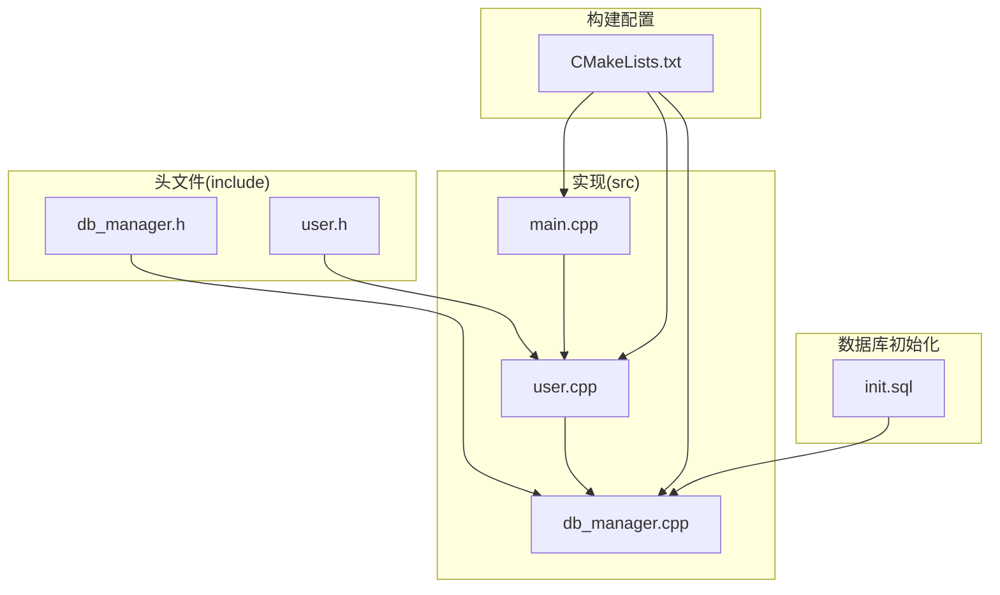
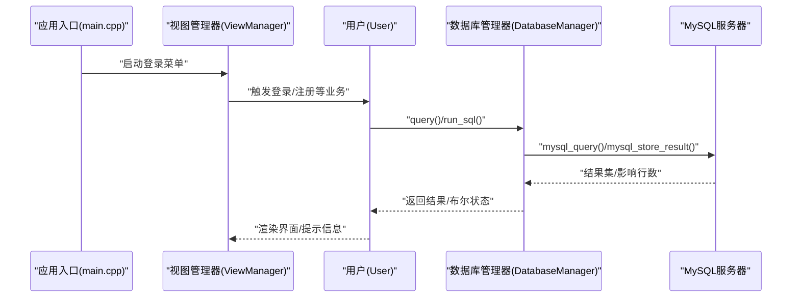
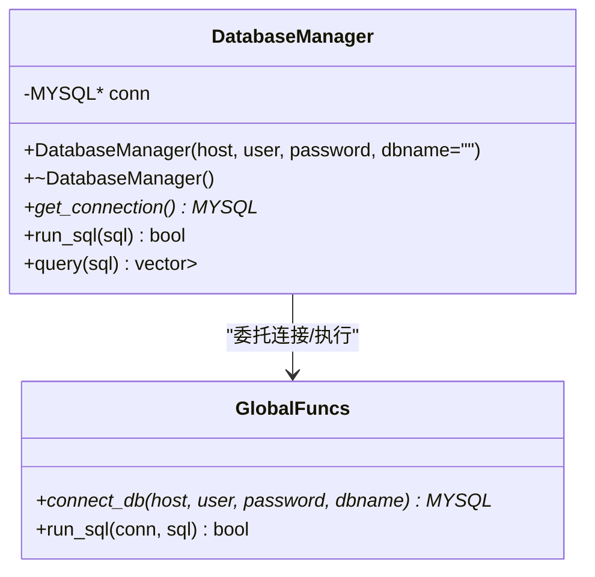
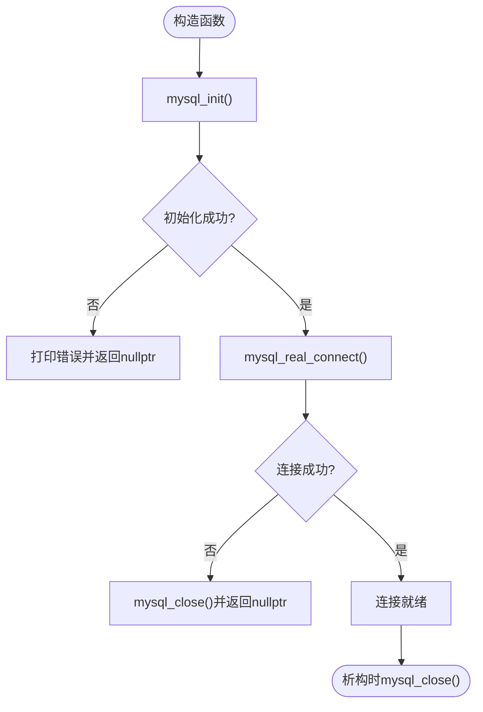
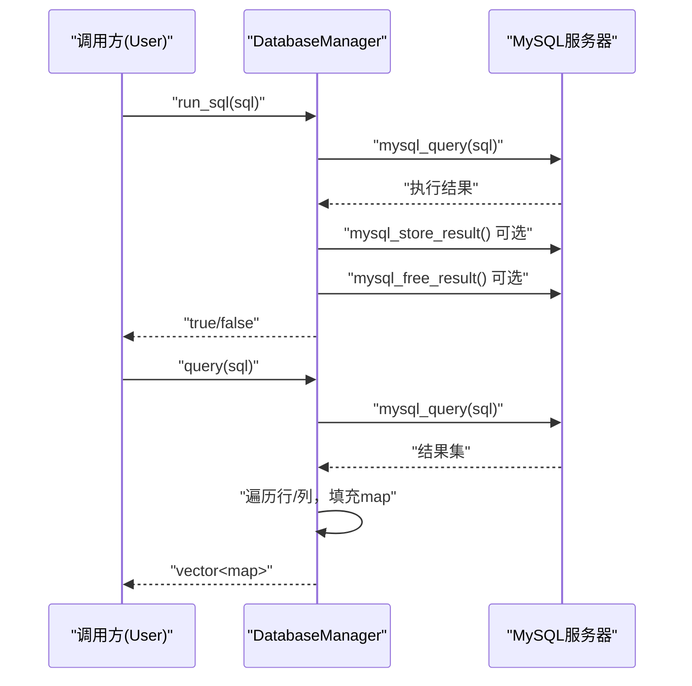
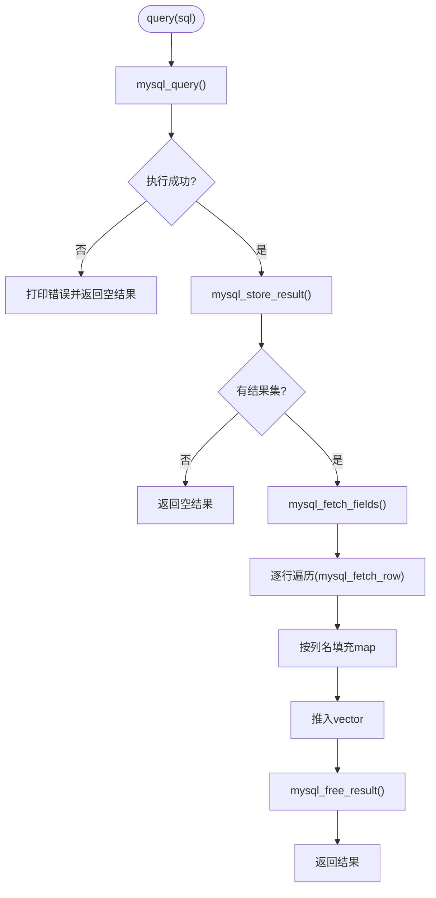
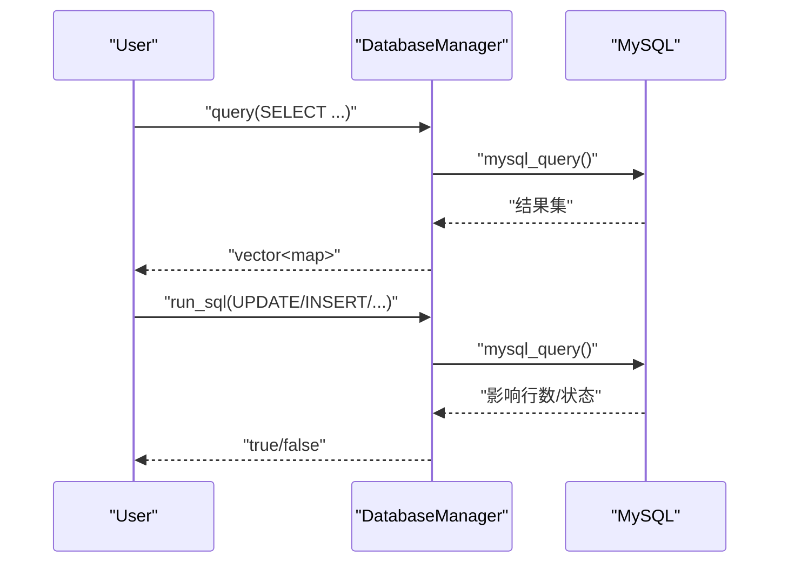
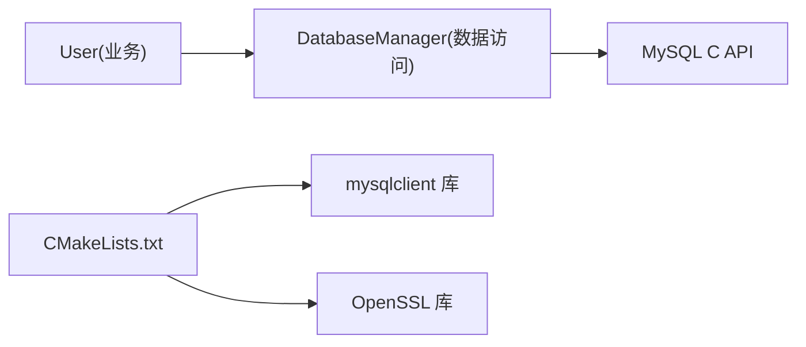

# 数据库管理器

<cite>
**本文引用的文件**
- [db_manager.h](file://include/db_manager.h)
- [db_manager.cpp](file://src/db_manager.cpp)
- [CMakeLists.txt](file://CMakeLists.txt)
- [init.sql](file://init.sql)
- [user.h](file://include/user.h)
- [user.cpp](file://src/user.cpp)
- [main.cpp](file://src/main.cpp)
</cite>

## 目录
1. [简介](#简介)
2. [项目结构](#项目结构)
3. [核心组件](#核心组件)
4. [架构总览](#架构总览)
5. [详细组件分析](#详细组件分析)
6. [依赖关系分析](#依赖关系分析)
7. [性能考量](#性能考量)
8. [故障排查指南](#故障排查指南)
9. [结论](#结论)
10. [附录](#附录)

## 简介
本文件面向数据库访问层的实现，系统性解析 DatabaseManager 类的设计与实现，涵盖：
- MySQL 连接管理与生命周期
- SQL 执行封装与结果集处理
- 错误处理与异常恢复
- 与上层业务逻辑（如用户模块）的接口设计与数据流转
- 并发访问控制与连接超时处理建议
- 常见数据库操作模式（CRUD、批量处理、事务管理）的实践要点

注意：当前仓库中的 DatabaseManager 未实现连接池与显式事务控制，本文在“架构总览”和“详细组件分析”中给出基于现有代码的实现视图，并在“性能考量”和“附录”中补充连接池与事务的改进建议与最佳实践。

## 项目结构
该项目采用分层组织方式：
- include：对外公开的头文件（接口定义）
- src：实现文件（含数据库管理器、业务逻辑、入口程序）
- init.sql：数据库初始化脚本（含表结构、权限与示例数据）
- CMakeLists.txt：构建配置（MySQL 客户端库与 OpenSSL 链接）

图表来源
- [db_manager.h:1-53](file://include/db_manager.h#L1-L53)
- [db_manager.cpp:1-100](file://src/db_manager.cpp#L1-L100)
- [user.h:1-89](file://include/user.h#L1-L89)
- [user.cpp:1-200](file://src/user.cpp#L1-L200)
- [main.cpp:1-14](file://src/main.cpp#L1-L14)
- [CMakeLists.txt:1-40](file://CMakeLists.txt#L1-L40)
- [init.sql:1-278](file://init.sql#L1-L278)

章节来源
- [CMakeLists.txt:1-40](file://CMakeLists.txt#L1-L40)
- [db_manager.h:1-53](file://include/db_manager.h#L1-L53)
- [db_manager.cpp:1-100](file://src/db_manager.cpp#L1-L100)
- [user.h:1-89](file://include/user.h#L1-L89)
- [user.cpp:1-200](file://src/user.cpp#L1-L200)
- [main.cpp:1-14](file://src/main.cpp#L1-L14)
- [init.sql:1-278](file://init.sql#L1-L278)

## 核心组件
- DatabaseManager：封装 MySQL 连接与 SQL 执行，提供查询与执行能力
- 全局连接函数：负责 mysql_init 与 mysql_real_connect 的调用
- 业务模块 User：通过 DatabaseManager 执行登录、注册、密码修改、题目列表等操作
- 构建系统：通过 pkg-config 检测 mysqlclient，链接 OpenSSL

关键职责与接口
- 连接管理：构造时建立连接，析构时关闭连接
- SQL 执行：run_sql 执行非查询语句并释放结果集
- 查询执行：query 将结果集转换为 vector<map<string,string>>
- 上层依赖：User 通过 DatabaseManager 的 query/run_sql 完成业务操作

章节来源
- [db_manager.h:12-46](file://include/db_manager.h#L12-L46)
- [db_manager.cpp:8-79](file://src/db_manager.cpp#L8-L79)
- [user.h:10-86](file://include/user.h#L10-L86)
- [user.cpp:39-137](file://src/user.cpp#L39-L137)

## 架构总览
DatabaseManager 作为数据访问层的核心，向上为业务模块提供统一的 SQL 访问接口，向下直接使用 MySQL C API。整体交互如下：

图表来源
- [main.cpp:5-10](file://src/main.cpp#L5-L10)
- [user.cpp:39-137](file://src/user.cpp#L39-L137)
- [db_manager.cpp:21-57](file://src/db_manager.cpp#L21-L57)

## 详细组件分析

### DatabaseManager 类设计
- 设计原则：面向对象封装 MySQL 连接与常用 SQL 操作，简化上层调用
- 关键成员：
  - 私有成员：MYSQL* conn
  - 公共接口：构造/析构、get_connection、run_sql、query
- 生命周期：构造时建立连接，析构时关闭连接，避免资源泄漏

图表来源
- [db_manager.h:12-46](file://include/db_manager.h#L12-L46)
- [db_manager.cpp:8-79](file://src/db_manager.cpp#L8-L79)

章节来源
- [db_manager.h:12-46](file://include/db_manager.h#L12-L46)
- [db_manager.cpp:8-79](file://src/db_manager.cpp#L8-L79)

### 连接管理与生命周期
- 初始化：mysql_init(nullptr)，检查返回值
- 连接：mysql_real_connect(host,user,password,db,3306,nullptr,0)
- 关闭：析构时 mysql_close(conn)
- 错误处理：连接失败打印错误并返回空指针

图表来源
- [db_manager.cpp:61-79](file://src/db_manager.cpp#L61-L79)

章节来源
- [db_manager.cpp:61-79](file://src/db_manager.cpp#L61-L79)

### SQL 执行封装
- run_sql：执行任意 SQL，若返回结果集则释放，返回布尔状态
- query：执行查询，遍历结果集，按列名映射到 map，形成 vector<map>

图表来源
- [db_manager.cpp:21-57](file://src/db_manager.cpp#L21-L57)

章节来源
- [db_manager.cpp:21-57](file://src/db_manager.cpp#L21-L57)

### 结果集处理与数据模型
- 返回类型：vector<map<string,string>>
- 列名映射：通过 mysql_fetch_fields 获取字段名
- 空值处理：将空值映射为 "NULL" 字符串
- 内存管理：使用 mysql_free_result 释放结果集

图表来源
- [db_manager.cpp:26-57](file://src/db_manager.cpp#L26-L57)

章节来源
- [db_manager.cpp:26-57](file://src/db_manager.cpp#L26-L57)

### 与上层业务的接口设计与数据流转
- User 通过 DatabaseManager 的 query/run_sql 完成业务操作
- 登录流程：查询用户信息 -> 校验密码哈希 -> 更新最近登录时间
- 注册流程：检查账号是否存在 -> 计算 SHA256 -> 插入用户记录
- 题目列表：查询题目信息并格式化输出

图表来源
- [user.cpp:39-137](file://src/user.cpp#L39-L137)
- [db_manager.cpp:21-57](file://src/db_manager.cpp#L21-L57)

章节来源
- [user.h:10-86](file://include/user.h#L10-L86)
- [user.cpp:39-137](file://src/user.cpp#L39-L137)
- [db_manager.cpp:21-57](file://src/db_manager.cpp#L21-L57)

### 数据库配置与初始化
- 数据库名称：OJ
- 字符集：utf8mb4
- 表结构：problems、users、submissions
- 权限设计：oj_admin 全权限；oj_user 限定权限（按表粒度）
- 示例数据：插入若干题目与示例用户

章节来源
- [init.sql:8-95](file://init.sql#L8-L95)
- [init.sql:97-278](file://init.sql#L97-L278)

## 依赖关系分析
- DatabaseManager 依赖 MySQL C API（mysql/mysql.h）
- 构建系统通过 pkg-config 检测 mysqlclient 并链接 OpenSSL
- User 依赖 DatabaseManager 接口

图表来源
- [user.h](file://include/user.h#L4)
- [db_manager.h](file://include/db_manager.h#L4)
- [CMakeLists.txt:12-34](file://CMakeLists.txt#L12-L34)

章节来源
- [CMakeLists.txt:12-34](file://CMakeLists.txt#L12-L34)
- [db_manager.h](file://include/db_manager.h#L4)
- [user.h](file://include/user.h#L4)

## 性能考量
当前实现特点与建议：
- 连接管理
  - 现状：每个 DatabaseManager 持有独立连接，构造时建立，析构时关闭
  - 建议：引入连接池（线程安全、最大/最小连接数、空闲回收），减少频繁连接/断开开销
- 查询参数绑定
  - 现状：字符串拼接 SQL，存在注入风险
  - 建议：使用预处理语句（mysql_stmt_*）进行参数绑定，提升安全性与性能
- 结果集处理
  - 现状：一次性获取结果集（mysql_store_result），可能占用较多内存
  - 建议：对大结果集采用流式读取（mysql_use_result），或分页查询
- 并发访问控制
  - 现状：未实现连接池与事务控制
  - 建议：在业务层加锁或使用连接池的并发控制；对写操作启用事务，保证一致性
- 连接超时与健康检查
  - 建议：设置 mysql_options 连接超时；定期 ping 检查连接可用性；失败自动重连

[本节为通用性能指导，不直接分析具体文件]

## 故障排查指南
常见问题与定位步骤：
- 连接失败
  - 现象：构造函数返回空连接或连接失败日志
  - 排查：确认主机、用户名、密码、数据库名；检查 MySQL 服务状态与网络连通性
- 查询失败
  - 现象：query 返回空结果并打印错误
  - 排查：检查 SQL 语法与表/列名；确认权限；验证连接有效性
- 执行失败
  - 现象：run_sql 返回 false 并打印错误
  - 排查：检查 SQL 语句；确认目标表存在且可写
- 结果集为空
  - 现象：query 返回空 vector
  - 排查：确认查询条件是否匹配；检查数据是否正确插入
- 中文显示问题
  - 现象：标题显示宽度异常或乱码
  - 排查：确保数据库字符集为 utf8mb4；客户端连接设置字符集；业务侧按 UTF-8 边界处理

章节来源
- [db_manager.cpp:32-36](file://src/db_manager.cpp#L32-L36)
- [db_manager.cpp:81-90](file://src/db_manager.cpp#L81-L90)
- [user.cpp:167-200](file://src/user.cpp#L167-L200)

## 结论
DatabaseManager 以简洁的接口封装了 MySQL 连接与 SQL 执行，满足基础 CRUD 与查询需求。结合 init.sql 的权限与表结构设计，配合业务模块 User 的调用，形成了清晰的数据访问层。为进一步提升可靠性与性能，建议引入连接池、参数化查询、事务控制与连接健康检查机制，并在上层业务中加强并发控制与错误恢复策略。

[本节为总结性内容，不直接分析具体文件]

## 附录

### 常见数据库操作模式与示例路径
- 登录校验
  - 查询用户信息：[user.cpp:44-45](file://src/user.cpp#L44-L45)
  - 校验密码哈希：[user.cpp](file://src/user.cpp#L54)
  - 更新最近登录时间：[user.cpp:66-67](file://src/user.cpp#L66-L67)
- 注册流程
  - 检查账号是否存在：[user.cpp:78-79](file://src/user.cpp#L78-L79)
  - 插入新用户：[user.cpp:88-89](file://src/user.cpp#L88-L89)
- 密码修改
  - 校验旧密码：[user.cpp:118-120](file://src/user.cpp#L118-L120)
  - 更新密码哈希：[user.cpp:127-128](file://src/user.cpp#L127-L128)
- 题目列表
  - 查询题目信息：[user.cpp:144-145](file://src/user.cpp#L144-L145)
  - 格式化输出标题：[user.cpp:167-200](file://src/user.cpp#L167-L200)

### 事务管理与批量处理建议
- 事务管理
  - 开启事务：使用 START TRANSACTION 或 mysql_autocommit(conn, 0)
  - 提交/回滚：COMMIT 或 ROLLBACK
  - 异常处理：捕获错误后立即回滚，避免半提交状态
- 批量处理
  - 使用多值 INSERT 或 REPLACE
  - 分批提交（控制批次大小），降低单次事务压力
  - 对重复数据使用 ON DUPLICATE KEY UPDATE

[本节为通用实践建议，不直接分析具体文件]