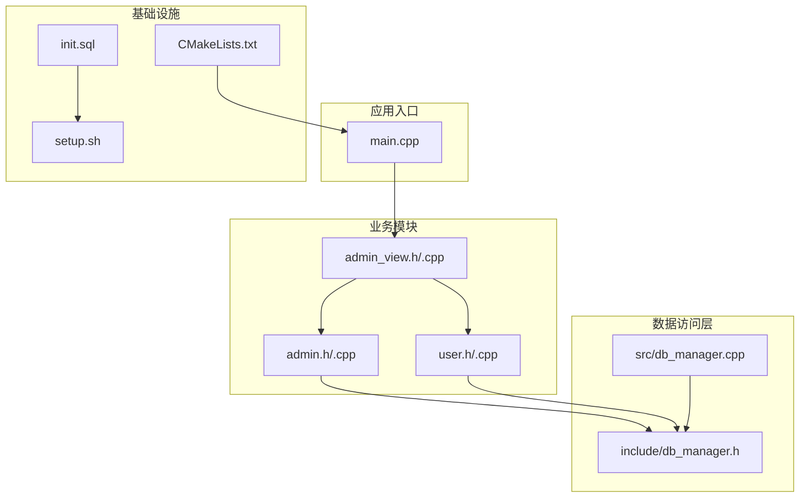
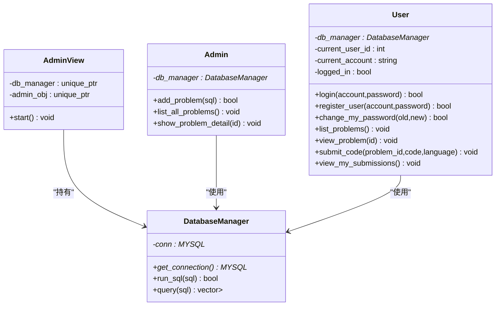
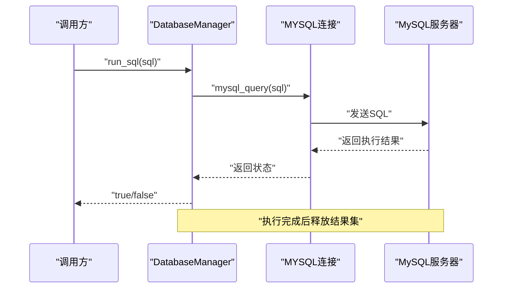
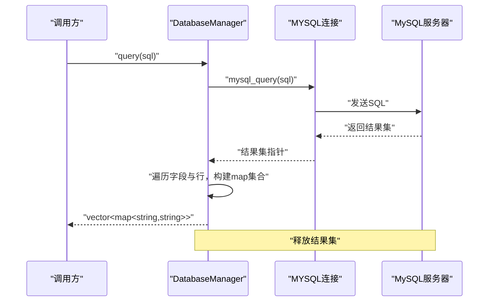
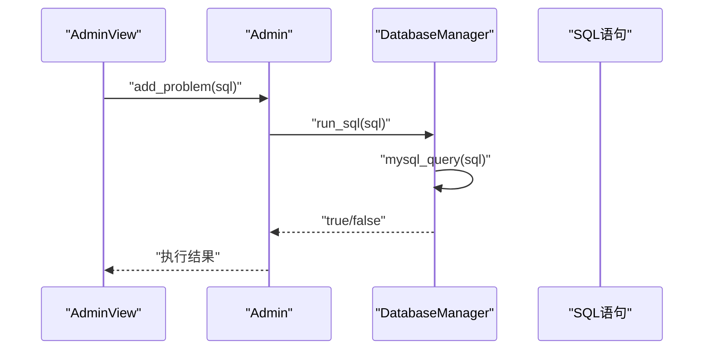
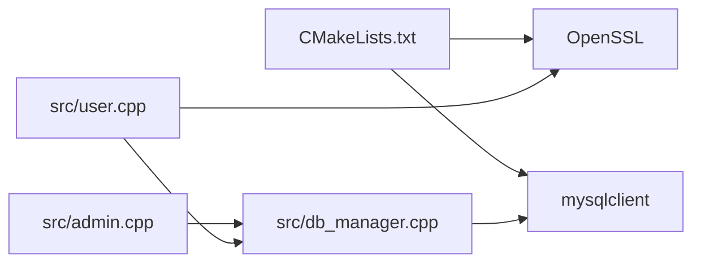

# 数据库管理器

<cite>
**本文引用的文件**
- [db_manager.h](file://include/db_manager.h)
- [db_manager.cpp](file://src/db_manager.cpp)
- [init.sql](file://init.sql)
- [CMakeLists.txt](file://CMakeLists.txt)
- [README.md](file://README.md)
- [setup.sh](file://setup.sh)
- [main.cpp](file://src/main.cpp)
- [admin.h](file://include/admin.h)
- [admin.cpp](file://src/admin.cpp)
- [admin_view.h](file://include/admin_view.h)
- [user.h](file://include/user.h)
- [user.cpp](file://src/user.cpp)
</cite>

## 目录
1. [简介](#简介)
2. [项目结构](#项目结构)
3. [核心组件](#核心组件)
4. [架构总览](#架构总览)
5. [详细组件分析](#详细组件分析)
6. [依赖关系分析](#依赖关系分析)
7. [性能考量](#性能考量)
8. [故障排查指南](#故障排查指南)
9. [结论](#结论)
10. [附录](#附录)

## 简介
本文件面向OJ系统的数据库管理器，系统性阐述DatabaseManager类的设计与实现，覆盖MySQL连接管理、SQL执行封装、查询结果解析、错误处理等核心能力，并结合业务模块Admin与User的使用方式，给出CRUD操作、批量数据处理、复杂查询的实践建议。同时提供数据库配置指南与故障诊断方法，帮助开发者在保证安全的前提下高效、稳定地使用数据库。

## 项目结构
该项目采用“头文件+源文件”的分层组织，数据库管理器位于include与src目录中，配合业务模块Admin与User共同构成完整的命令行交互式评测系统入口。

图表来源
- [main.cpp:1-14](file://src/main.cpp#L1-L14)
- [admin_view.h:1-58](file://include/admin_view.h#L1-L58)
- [admin.h:1-39](file://include/admin.h#L1-L39)
- [user.h:1-89](file://include/user.h#L1-L89)
- [db_manager.h:1-53](file://include/db_manager.h#L1-L53)
- [db_manager.cpp:1-100](file://src/db_manager.cpp#L1-L100)
- [init.sql:1-143](file://init.sql#L1-L143)
- [setup.sh:1-41](file://setup.sh#L1-L41)
- [CMakeLists.txt:1-40](file://CMakeLists.txt#L1-L40)

章节来源
- [main.cpp:1-14](file://src/main.cpp#L1-L14)
- [CMakeLists.txt:1-40](file://CMakeLists.txt#L1-L40)
- [README.md:1-2](file://README.md#L1-L2)

## 核心组件
- DatabaseManager类：封装MySQL连接、SQL执行与查询结果解析，提供简洁的接口给上层业务模块调用。
- 全局辅助函数：connect_db与run_sql，分别负责连接建立与SQL执行，被DatabaseManager内部复用。
- 业务模块Admin与User：通过DatabaseManager执行CRUD与查询，完成管理员发布题目、用户登录注册、查看题目、提交代码等场景。

章节来源
- [db_manager.h:12-46](file://include/db_manager.h#L12-L46)
- [db_manager.cpp:8-99](file://src/db_manager.cpp#L8-L99)
- [admin.h:10-36](file://include/admin.h#L10-L36)
- [user.h:10-86](file://include/user.h#L10-L86)

## 架构总览
DatabaseManager作为数据访问层的核心，向上为Admin与User提供统一的数据库操作接口；向下直接使用MySQL客户端库进行连接与查询。业务视图层AdminView负责交互与流程编排，按需创建DatabaseManager实例并传递给业务对象。

图表来源
- [db_manager.h:12-46](file://include/db_manager.h#L12-L46)
- [admin.h:10-36](file://include/admin.h#L10-L36)
- [user.h:10-86](file://include/user.h#L10-L86)
- [admin_view.h:11-55](file://include/admin_view.h#L11-L55)

## 详细组件分析

### DatabaseManager类设计与实现
- 设计原则
  - 单一职责：集中管理MySQL连接与SQL执行，屏蔽底层细节。
  - 资源管理：构造时建立连接，析构时关闭连接，避免泄漏。
  - 接口简洁：对外暴露run_sql与query两个核心方法，便于上层调用。
- 关键实现点
  - 连接建立：connect_db负责初始化MySQL句柄并建立真实连接，支持指定数据库名。
  - SQL执行：run_sql封装查询执行与结果释放，返回布尔值表示是否成功。
  - 查询解析：query执行查询后，遍历字段与行，构建列名到值的映射集合，便于上层以键值形式访问。
  - 错误处理：对连接失败、查询失败、执行失败等情况输出错误信息并返回空结果或false。

图表来源
- [db_manager.cpp:21-24](file://src/db_manager.cpp#L21-L24)
- [db_manager.cpp:81-99](file://src/db_manager.cpp#L81-L99)

图表来源
- [db_manager.cpp:26-57](file://src/db_manager.cpp#L26-L57)

章节来源
- [db_manager.h:12-46](file://include/db_manager.h#L12-L46)
- [db_manager.cpp:8-99](file://src/db_manager.cpp#L8-L99)

### 连接管理与生命周期
- 构造阶段：DatabaseManager构造函数委托connect_db建立连接，支持传入数据库名。
- 生命周期：析构时主动关闭连接，确保资源回收。
- 连接句柄：提供get_connection便于上层直接访问底层MYSQL指针（谨慎使用）。

章节来源
- [db_manager.cpp:8-19](file://src/db_manager.cpp#L8-L19)
- [db_manager.h:28](file://include/db_manager.h#L28)

### SQL执行封装
- run_sql：执行任意SQL（DDL/DML），自动释放结果集，返回布尔值表示是否成功。
- query：执行查询，返回结构化的结果集，便于上层以列名访问对应值。

章节来源
- [db_manager.cpp:21-24](file://src/db_manager.cpp#L21-L24)
- [db_manager.cpp:26-57](file://src/db_manager.cpp#L26-L57)

### 错误处理与健壮性
- 连接失败：connect_db在初始化或真实连接失败时输出错误并返回空指针。
- 查询失败：query在mysql_query失败时输出错误并返回空结果。
- 执行失败：run_sql在mysql_query失败时输出错误并返回false。
- 上层应基于返回值与空结果进行分支处理，避免误用。

章节来源
- [db_manager.cpp:61-79](file://src/db_manager.cpp#L61-L79)
- [db_manager.cpp:32-36](file://src/db_manager.cpp#L32-L36)
- [db_manager.cpp:86-90](file://src/db_manager.cpp#L86-L90)

### 业务模块对接
- Admin模块
  - 通过DatabaseManager执行管理员发布的SQL（如新增题目），并可查询题目列表与详情。
  - 依赖：include/admin.h与src/admin.cpp。
- User模块
  - 通过DatabaseManager执行登录、注册、改密、查看题目、提交代码等操作。
  - 依赖：include/user.h与src/user.cpp。
- AdminView
  - 负责交互流程，按需创建DatabaseManager实例并绑定Admin对象。

图表来源
- [admin.cpp:12-15](file://src/admin.cpp#L12-L15)
- [db_manager.cpp:21-24](file://src/db_manager.cpp#L21-L24)

章节来源
- [admin.h:10-36](file://include/admin.h#L10-L36)
- [admin.cpp:12-58](file://src/admin.cpp#L12-L58)
- [user.h:10-86](file://include/user.h#L10-L86)
- [user.cpp:39-222](file://src/user.cpp#L39-L222)
- [admin_view.h:11-55](file://include/admin_view.h#L11-L55)

### 安全防护与最佳实践
- SQL注入风险
  - 当前实现中，User与Admin在拼接SQL字符串时存在明文拼接，易受SQL注入攻击。
  - 建议：引入参数化查询（预处理语句）或严格的白名单校验与转义机制。
- 行级隔离
  - init.sql为普通用户授予有限权限，但行级隔离主要由应用层通过条件过滤实现（例如WHERE id = current_user_id）。
  - 建议：在应用层强制限定查询范围，避免越权访问。
- 密码存储
  - 使用SHA256进行密码哈希，建议配合盐值与更安全的密码学方案（如bcrypt）进一步提升安全性。

章节来源
- [user.cpp:44](file://src/user.cpp#L44)
- [user.cpp:88](file://src/user.cpp#L88)
- [user.cpp:108](file://src/user.cpp#L108)
- [user.cpp:127](file://src/user.cpp#L127)
- [admin.cpp:46](file://src/admin.cpp#L46)
- [init.sql:67-94](file://init.sql#L67-L94)

### 数据库配置与初始化
- 初始化脚本：init.sql负责创建数据库、表、索引、用户与权限，并提供示例数据。
- 一键部署：setup.sh自动创建目录、执行初始化脚本并提示编译步骤。
- CMake配置：CMakeLists.txt声明依赖mysqlclient与OpenSSL，设置C++17标准并导出编译命令。

章节来源
- [init.sql:1-143](file://init.sql#L1-L143)
- [setup.sh:1-41](file://setup.sh#L1-L41)
- [CMakeLists.txt:1-40](file://CMakeLists.txt#L1-L40)

## 依赖关系分析
- 外部依赖
  - mysqlclient：提供MySQL客户端API，用于连接与查询。
  - OpenSSL：用于密码哈希计算。
- 内部耦合
  - Admin与User均依赖DatabaseManager，形成清晰的分层。
  - AdminView持有DatabaseManager与Admin实例，协调交互流程。
- 可能的改进
  - 引入连接池：当前为单连接模型，建议在多线程场景下引入连接池以提升并发与稳定性。
  - 事务支持：当前未显式封装事务，可在DatabaseManager中增加begin/commit/rollback方法。

图表来源
- [CMakeLists.txt:12-34](file://CMakeLists.txt#L12-L34)
- [db_manager.cpp:1-100](file://src/db_manager.cpp#L1-L100)
- [user.cpp:6](file://src/user.cpp#L6)

章节来源
- [CMakeLists.txt:12-34](file://CMakeLists.txt#L12-L34)

## 性能考量
- 连接复用：当前每个业务对象持有独立连接，建议在业务层复用同一连接或引入连接池。
- 查询优化：
  - 为高频查询字段建立索引（如users.idx_account、submissions.idx_user_id等）。
  - 避免SELECT *，按需查询列。
- 批量处理：对于大量插入或更新，建议使用批量SQL或事务包裹以减少往返次数。
- 错误与超时：合理设置连接超时与查询超时，避免阻塞影响整体性能。

## 故障排查指南
- 连接失败
  - 检查MySQL服务状态与凭据配置。
  - 确认init.sql已正确创建数据库与用户，并刷新权限。
- 查询失败
  - 查看错误输出，确认SQL语法与表结构一致。
  - 检查字段名大小写与类型匹配。
- 权限不足
  - 确认普通用户权限范围符合预期（只读/受限写入）。
  - 应用层需严格限定查询范围，防止越权。
- 编译问题
  - 确认已安装mysqlclient与OpenSSL开发包。
  - 使用CMake导出compile_commands.json便于IDE与工具链识别。

章节来源
- [db_manager.cpp:61-79](file://src/db_manager.cpp#L61-L79)
- [db_manager.cpp:32-36](file://src/db_manager.cpp#L32-L36)
- [init.sql:67-94](file://init.sql#L67-L94)
- [CMakeLists.txt:12-34](file://CMakeLists.txt#L12-L34)

## 结论
DatabaseManager提供了简洁而实用的数据库访问抽象，结合Admin与User模块实现了完整的OJ系统数据操作能力。当前实现具备良好的可读性与可扩展性，但在安全性与性能方面仍有改进空间：建议引入参数化查询、连接池与事务支持，并强化行级隔离与密码存储策略。通过合理的配置与运维手段，可进一步提升系统的稳定性与安全性。

## 附录

### 使用示例（路径指引）
- 执行SQL（新增题目）
  - 调用Admin::add_problem，内部通过DatabaseManager::run_sql执行。
  - 参考：[admin.cpp:12-15](file://src/admin.cpp#L12-L15)，[db_manager.cpp:21-24](file://src/db_manager.cpp#L21-L24)
- 查询题目列表
  - 调用Admin::list_all_problems，内部通过DatabaseManager::query获取结果。
  - 参考：[admin.cpp:17-41](file://src/admin.cpp#L17-L41)，[db_manager.cpp:26-57](file://src/db_manager.cpp#L26-L57)
- 用户登录与注册
  - 调用User::login与User::register_user，内部通过DatabaseManager::query与run_sql完成。
  - 参考：[user.cpp:39-98](file://src/user.cpp#L39-L98)，[db_manager.cpp:26-57](file://src/db_manager.cpp#L26-L57)
- 查看题目详情
  - 调用User::view_problem，内部通过DatabaseManager::query获取结果。
  - 参考：[user.cpp:173-199](file://src/user.cpp#L173-L199)，[db_manager.cpp:26-57](file://src/db_manager.cpp#L26-L57)

### 数据库初始化与部署
- 初始化脚本：init.sql
  - 创建数据库、表、索引、用户与权限，并插入示例数据。
  - 参考：[init.sql:1-143](file://init.sql#L1-L143)
- 一键部署：setup.sh
  - 自动创建目录、执行初始化脚本并提示编译步骤。
  - 参考：[setup.sh:1-41](file://setup.sh#L1-L41)
- 编译配置：CMakeLists.txt
  - 声明依赖mysqlclient与OpenSSL，设置C++17标准。
  - 参考：[CMakeLists.txt:1-40](file://CMakeLists.txt#L1-L40)