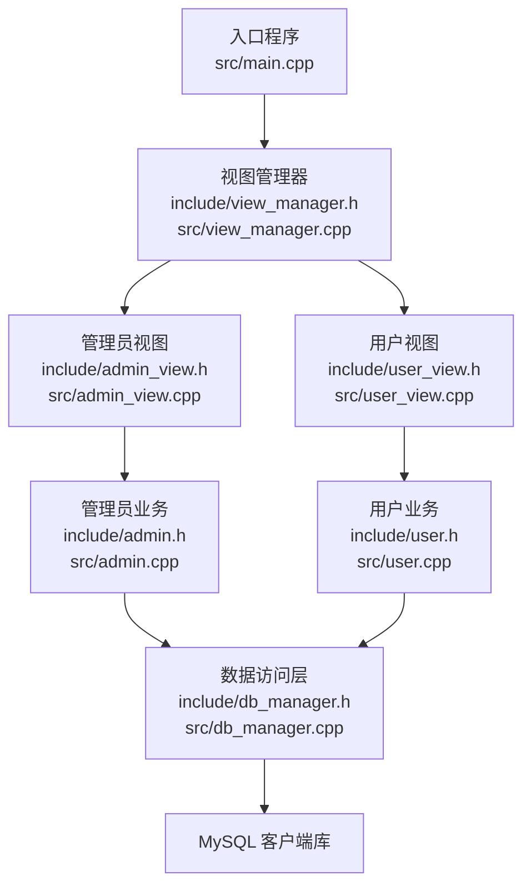
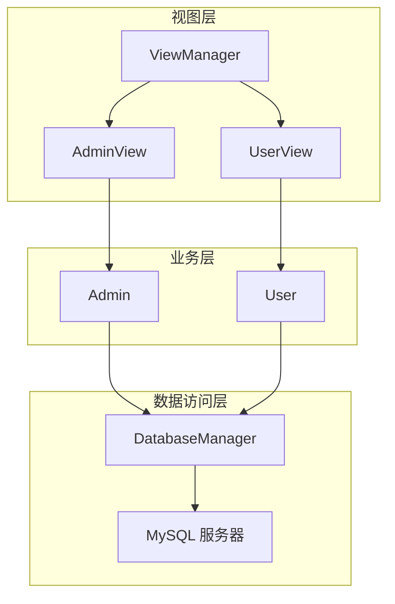
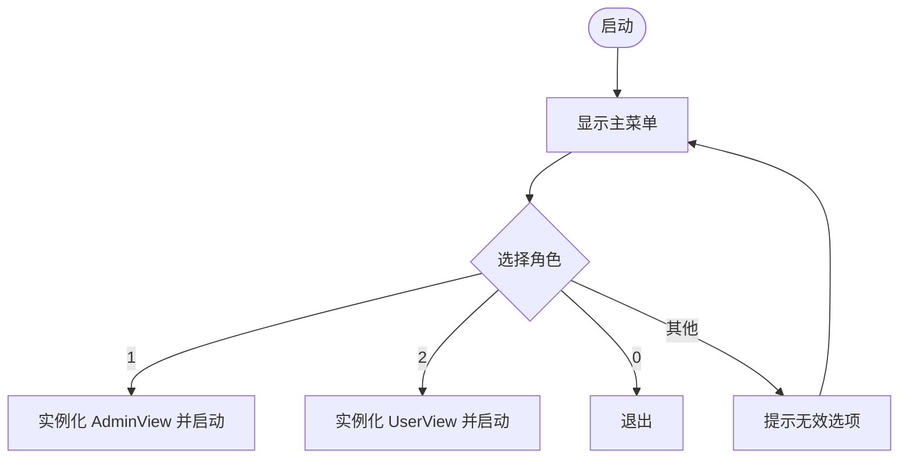
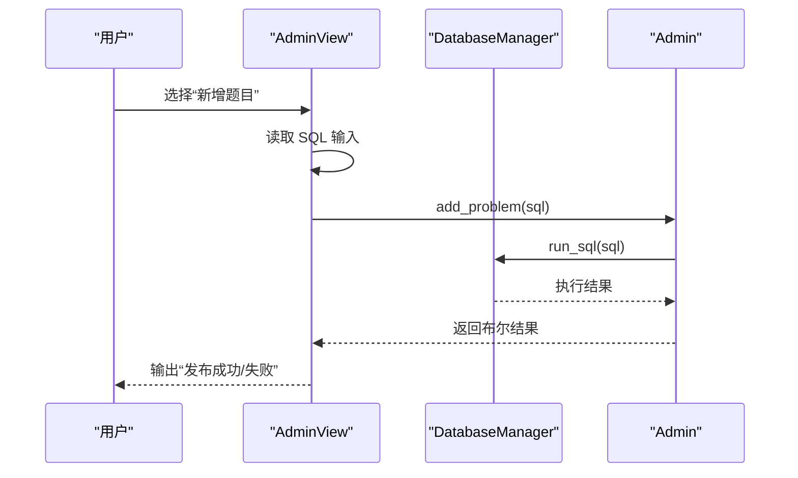
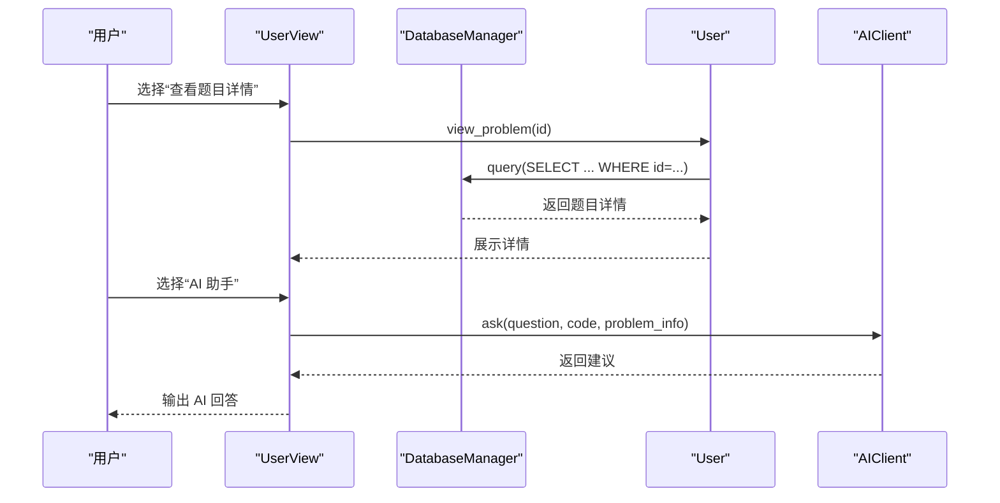
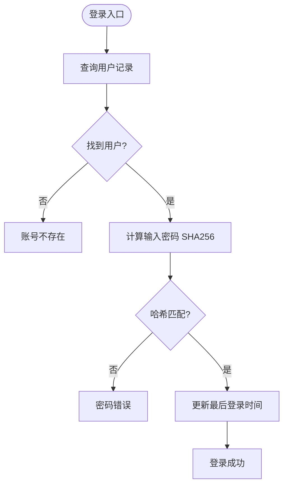
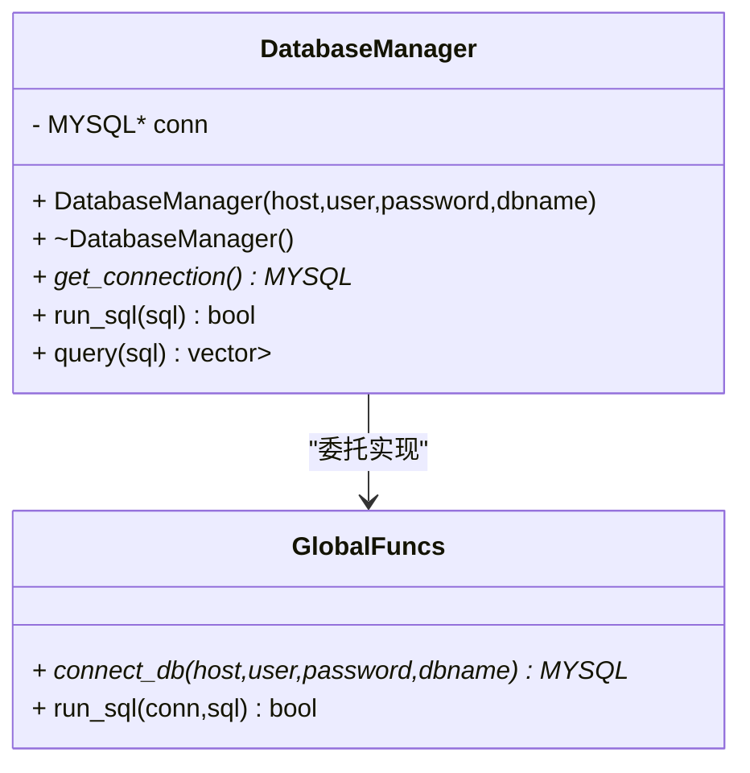
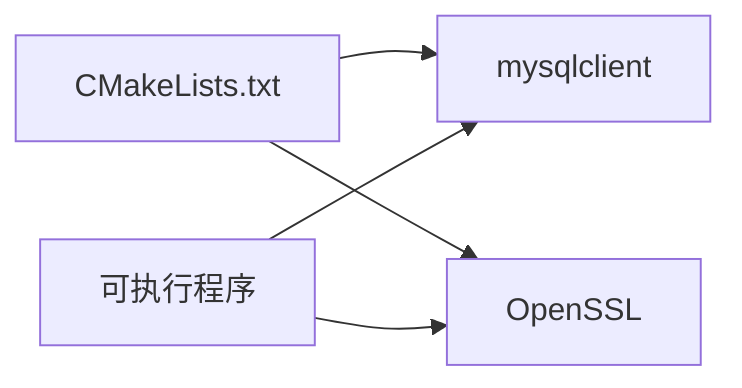

# 核心模块详解

<cite>
**本文引用的文件**
- [README.md](file://README.md)
- [CMakeLists.txt](file://CMakeLists.txt)
- [init.sql](file://init.sql)
- [src/main.cpp](file://src/main.cpp)
- [include/view_manager.h](file://include/view_manager.h)
- [src/view_manager.cpp](file://src/view_manager.cpp)
- [include/admin_view.h](file://include/admin_view.h)
- [src/admin_view.cpp](file://src/admin_view.cpp)
- [include/user_view.h](file://include/user_view.h)
- [src/user_view.cpp](file://src/user_view.cpp)
- [include/admin.h](file://include/admin.h)
- [src/admin.cpp](file://src/admin.cpp)
- [include/user.h](file://include/user.h)
- [src/user.cpp](file://src/user.cpp)
- [include/db_manager.h](file://include/db_manager.h)
- [src/db_manager.cpp](file://src/db_manager.cpp)
</cite>

## 目录
1. [简介](#简介)
2. [项目结构](#项目结构)
3. [核心组件](#核心组件)
4. [架构总览](#架构总览)
5. [详细组件分析](#详细组件分析)
6. [依赖分析](#依赖分析)
7. [性能考虑](#性能考虑)
8. [故障排查指南](#故障排查指南)
9. [结论](#结论)
10. [附录](#附录)

## 简介
本文件面向高级开发者，系统性解析 OJ 系统的核心模块，重点覆盖以下方面：
- 管理员模块与用户模块的业务逻辑与交互流程
- 认证机制与权限控制（基于数据库用户与应用内行级隔离）
- 数据验证与输入处理
- DatabaseManager 数据访问层设计（MySQL 连接管理、SQL 执行封装、结果集映射、错误处理）
- 模块间协作关系、接口契约与数据流
- 常见业务场景的处理流程与扩展点

## 项目结构
项目采用“头文件声明 + 源文件实现”的分层组织，按职责划分为：
- 视图层：负责命令行交互与菜单驱动
- 业务层：管理员与用户两类业务对象
- 数据访问层：统一的 DatabaseManager 封装 MySQL 连接与 SQL 执行
- 配置与初始化：CMake 构建、数据库初始化脚本

图表来源
- [src/main.cpp:1-14](file://src/main.cpp#L1-L14)
- [src/view_manager.cpp:1-77](file://src/view_manager.cpp#L1-L77)
- [src/admin_view.cpp:1-138](file://src/admin_view.cpp#L1-L138)
- [src/user_view.cpp:1-395](file://src/user_view.cpp#L1-L395)
- [src/admin.cpp:1-59](file://src/admin.cpp#L1-L59)
- [src/user.cpp:1-286](file://src/user.cpp#L1-L286)
- [src/db_manager.cpp:1-100](file://src/db_manager.cpp#L1-L100)

章节来源
- [README.md:1-2](file://README.md#L1-L2)
- [CMakeLists.txt:1-40](file://CMakeLists.txt#L1-L40)

## 核心组件
- 视图管理层（ViewManager）：启动登录菜单，根据用户选择进入管理员或用户视图，负责清屏、菜单展示与输入校验。
- 管理员视图（AdminView）：以管理员身份连接数据库，提供题目列表、详情查看与新增题目的 SQL 执行能力。
- 用户视图（UserView）：以受限权限连接数据库，提供登录/注册、题目浏览、提交代码占位、查看提交记录占位、修改密码等功能；集成 AI 助手调用。
- 管理员业务（Admin）：封装管理员特有操作，如新增题目（直接执行 SQL）、列出题目、查看题目详情。
- 用户业务（User）：封装用户认证（账号+密码哈希）、注册、改密、题目列表与详情查看、提交代码与提交记录查看（预留待实现）。
- 数据访问层（DatabaseManager）：封装 MySQL 连接、查询与执行，提供结果集映射为键值对集合，统一错误输出。

章节来源
- [include/view_manager.h:1-43](file://include/view_manager.h#L1-L43)
- [src/view_manager.cpp:1-77](file://src/view_manager.cpp#L1-L77)
- [include/admin_view.h:1-58](file://include/admin_view.h#L1-L58)
- [src/admin_view.cpp:1-138](file://src/admin_view.cpp#L1-L138)
- [include/user_view.h:1-92](file://include/user_view.h#L1-L92)
- [src/user_view.cpp:1-395](file://src/user_view.cpp#L1-L395)
- [include/admin.h:1-40](file://include/admin.h#L1-L40)
- [src/admin.cpp:1-59](file://src/admin.cpp#L1-L59)
- [include/user.h:1-89](file://include/user.h#L1-L89)
- [src/user.cpp:1-286](file://src/user.cpp#L1-L286)
- [include/db_manager.h:1-53](file://include/db_manager.h#L1-L53)
- [src/db_manager.cpp:1-100](file://src/db_manager.cpp#L1-L100)

## 架构总览
系统采用“视图层-业务层-数据访问层”三层架构，视图层负责用户交互与流程编排，业务层封装领域逻辑，数据访问层统一处理数据库交互。管理员与用户分别使用不同数据库用户与权限，应用层通过行级过滤实现访问隔离。

图表来源
- [src/view_manager.cpp:1-77](file://src/view_manager.cpp#L1-L77)
- [src/admin_view.cpp:1-138](file://src/admin_view.cpp#L1-L138)
- [src/user_view.cpp:1-395](file://src/user_view.cpp#L1-L395)
- [src/admin.cpp:1-59](file://src/admin.cpp#L1-L59)
- [src/user.cpp:1-286](file://src/user.cpp#L1-L286)
- [src/db_manager.cpp:1-100](file://src/db_manager.cpp#L1-L100)

## 详细组件分析

### 视图管理层（ViewManager）
- 职责：启动登录菜单，清屏与输入缓冲清理，根据用户选择实例化 AdminView 或 UserView 并进入对应流程。
- 关键流程：主菜单循环、角色选择、返回主菜单、输入合法性校验。
- 错误处理：非法输入时清空缓冲并提示；连接失败时提示检查配置。

图表来源
- [src/view_manager.cpp:32-70](file://src/view_manager.cpp#L32-L70)

章节来源
- [include/view_manager.h:1-43](file://include/view_manager.h#L1-L43)
- [src/view_manager.cpp:1-77](file://src/view_manager.cpp#L1-L77)

### 管理员视图（AdminView）
- 职责：以管理员身份连接数据库（oj_admin），提供题目列表、详情查看、新增题目（SQL 直接执行）。
- 关键流程：菜单循环、输入校验、调用 Admin 业务对象执行具体操作。
- 权限控制：使用管理员数据库用户，具备对 OJ 数据库的全权限，适合执行新增题目等写操作。

图表来源
- [src/admin_view.cpp:112-131](file://src/admin_view.cpp#L112-L131)
- [src/admin.cpp:12-15](file://src/admin.cpp#L12-L15)
- [src/db_manager.cpp:21-24](file://src/db_manager.cpp#L21-L24)

章节来源
- [include/admin_view.h:1-58](file://include/admin_view.h#L1-L58)
- [src/admin_view.cpp:1-138](file://src/admin_view.cpp#L1-L138)
- [include/admin.h:1-40](file://include/admin.h#L1-L40)
- [src/admin.cpp:1-59](file://src/admin.cpp#L1-L59)

### 用户视图（UserView）
- 职责：以受限权限连接数据库（oj_user），提供登录/注册、题目浏览、提交代码占位、查看提交记录占位、修改密码、AI 助手。
- 关键流程：未登录与已登录双菜单、输入校验、调用 User 业务对象与 AI 客户端。
- 权限控制：oj_user 对 problems/users/submissions 具有限制性权限，应用层通过行级过滤（WHERE id = current_user_id）实现隔离。

图表来源
- [src/user_view.cpp:219-274](file://src/user_view.cpp#L219-L274)
- [src/user.cpp:235-262](file://src/user.cpp#L235-L262)
- [src/db_manager.cpp:26-57](file://src/db_manager.cpp#L26-L57)
- [src/user_view.cpp:290-354](file://src/user_view.cpp#L290-L354)

章节来源
- [include/user_view.h:1-92](file://include/user_view.h#L1-L92)
- [src/user_view.cpp:1-395](file://src/user_view.cpp#L1-L395)
- [include/user.h:1-89](file://include/user.h#L1-L89)
- [src/user.cpp:1-286](file://src/user.cpp#L1-L286)

### 管理员业务（Admin）
- 职责：封装管理员特有业务，包括新增题目（直接执行 SQL）、列出题目、查看题目详情。
- 数据验证：依赖调用方输入校验（视图层），Admin 仅转发 SQL 给 DatabaseManager。
- 输出格式：题目列表使用表格化输出；题目详情以 JSON 美化输出。

章节来源
- [include/admin.h:1-40](file://include/admin.h#L1-L40)
- [src/admin.cpp:1-59](file://src/admin.cpp#L1-L59)

### 用户业务（User）
- 认证机制：登录时查询用户表，比对 SHA256 哈希；注册时检查账号唯一性并写入哈希；修改密码时先校验旧密码哈希再更新。
- 权限控制：通过行级过滤实现（WHERE id = current_user_id），配合数据库用户权限实现最小授权。
- 数据验证：输入参数校验（账号是否存在、密码是否正确、旧密码是否匹配）；题目列表与详情查询均通过 DatabaseManager 执行。
- 提交与查看：提交代码与查看提交记录为占位实现，后续可接入评测队列与 AI 服务。

图表来源
- [src/user.cpp:39-71](file://src/user.cpp#L39-L71)

章节来源
- [include/user.h:1-89](file://include/user.h#L1-L89)
- [src/user.cpp:1-286](file://src/user.cpp#L1-L286)

### 数据访问层（DatabaseManager）
- 连接管理：构造函数建立连接，析构函数关闭连接；提供 get_connection 获取句柄。
- SQL 执行封装：
  - run_sql：执行非查询语句，捕获错误并返回布尔结果。
  - query：执行查询语句，将结果集映射为 vector<map<string,string>>，字段名为键，值为字符串（含 NULL 处理）。
- 错误处理：统一通过标准错误输出错误信息，便于上层视图层提示用户。
- 事务支持：当前未显式封装事务 API；如需事务可在现有 run_sql/query 基础上增加事务控制封装。

图表来源
- [include/db_manager.h:12-46](file://include/db_manager.h#L12-L46)
- [src/db_manager.cpp:8-19](file://src/db_manager.cpp#L8-L19)
- [src/db_manager.cpp:21-57](file://src/db_manager.cpp#L21-L57)
- [src/db_manager.cpp:61-99](file://src/db_manager.cpp#L61-L99)

章节来源
- [include/db_manager.h:1-53](file://include/db_manager.h#L1-L53)
- [src/db_manager.cpp:1-100](file://src/db_manager.cpp#L1-L100)

## 依赖分析
- 构建依赖：CMake 通过 pkg-config 查找 mysqlclient，并链接 OpenSSL 加密库。
- 运行时依赖：MySQL 客户端库、OpenSSL；数据库用户权限由 init.sql 初始化。
- 模块耦合：视图层与业务层通过 DatabaseManager 解耦；业务层与数据访问层通过统一接口解耦。

图表来源
- [CMakeLists.txt:11-34](file://CMakeLists.txt#L11-L34)

章节来源
- [CMakeLists.txt:1-40](file://CMakeLists.txt#L1-L40)

## 性能考虑
- 连接复用：DatabaseManager 在视图生命周期内持有连接，避免频繁连接/断开带来的开销。
- 结果集映射：query 将结果集转为键值对集合，便于上层按列名访问；注意大数据量时内存占用。
- 输入处理：视图层对用户输入进行基本校验（数字、非空），减少无效 SQL 执行。
- 权限与隔离：数据库用户权限与应用行级过滤相结合，降低不必要的查询/写入成本。

## 故障排查指南
- 数据库连接失败
  - 现象：管理员或用户视图提示连接失败。
  - 排查：确认 init.sql 已执行、数据库用户权限已刷新、账号密码正确。
  - 参考：管理员视图与用户视图均在构造 DatabaseManager 时建立连接。
- 登录失败
  - 现象：账号不存在或密码错误。
  - 排查：确认账号已在数据库中存在，密码哈希一致；检查 SHA256 计算链路。
- 题目新增失败
  - 现象：新增题目返回失败。
  - 排查：检查 SQL 语法与权限；确认使用管理员连接（oj_admin）。
- 查询无结果
  - 现象：题目列表为空或题目详情为空。
  - 排查：确认数据库中是否存在相应记录；检查表名与列名大小写。

章节来源
- [src/admin_view.cpp:71-75](file://src/admin_view.cpp#L71-L75)
- [src/user_view.cpp:126-130](file://src/user_view.cpp#L126-L130)
- [src/user.cpp:47-51](file://src/user.cpp#L47-L51)
- [src/user.cpp:56-60](file://src/user.cpp#L56-L60)
- [src/admin.cpp:12-15](file://src/admin.cpp#L12-L15)
- [src/db_manager.cpp:32-36](file://src/db_manager.cpp#L32-L36)

## 结论
本系统通过清晰的三层架构实现了管理员与用户两大业务域，结合数据库用户权限与应用行级隔离，提供了基础但完整的认证与权限控制方案。DatabaseManager 作为数据访问层，统一了连接管理与 SQL 执行，具备良好的可维护性。后续可在事务封装、提交记录与评测对接、AI 服务集成等方面进一步扩展。

## 附录
- 数据库初始化脚本要点
  - 创建数据库与表（problems、users、submissions）
  - 创建数据库用户（oj_admin 全权限、oj_user 受限权限）
  - 插入示例数据与权限授予
- 构建与运行
  - 使用 CMake 生成构建系统，确保 mysqlclient 与 OpenSSL 可用
  - 先执行 init.sql 初始化数据库，再编译运行

章节来源
- [init.sql:1-278](file://init.sql#L1-L278)
- [CMakeLists.txt:1-40](file://CMakeLists.txt#L1-L40)