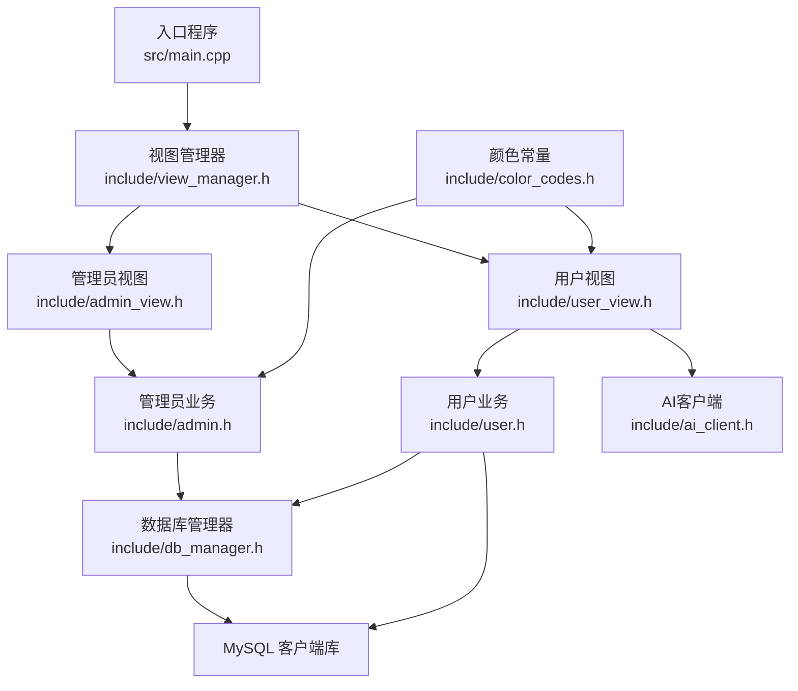
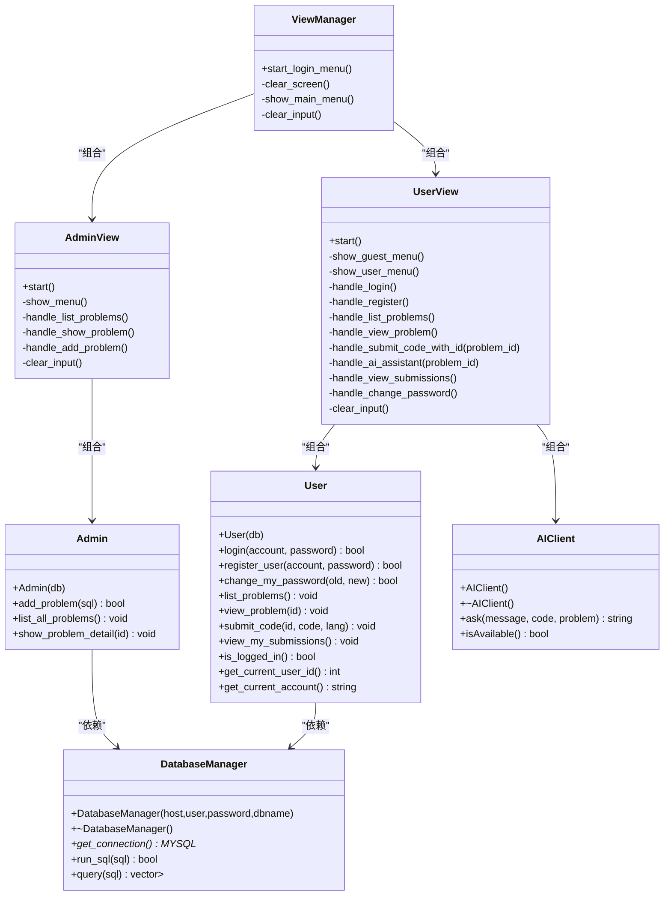
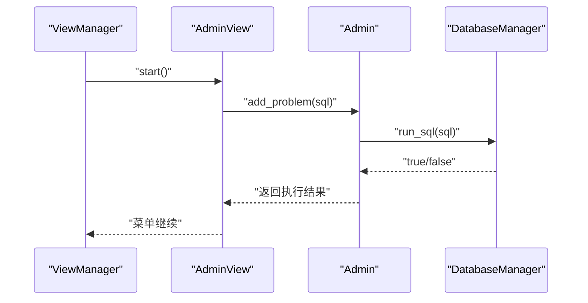
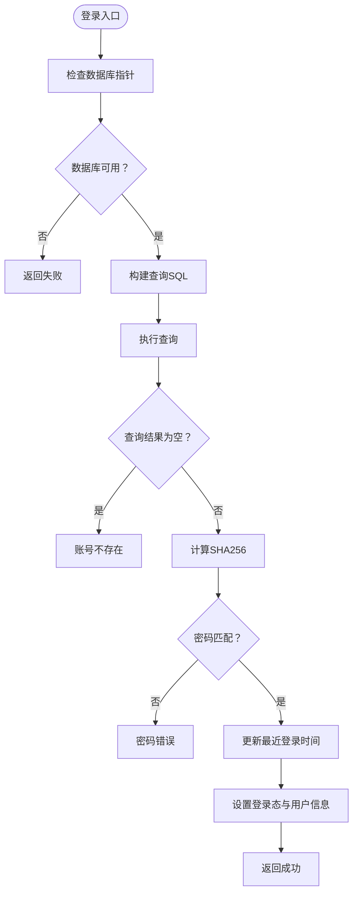
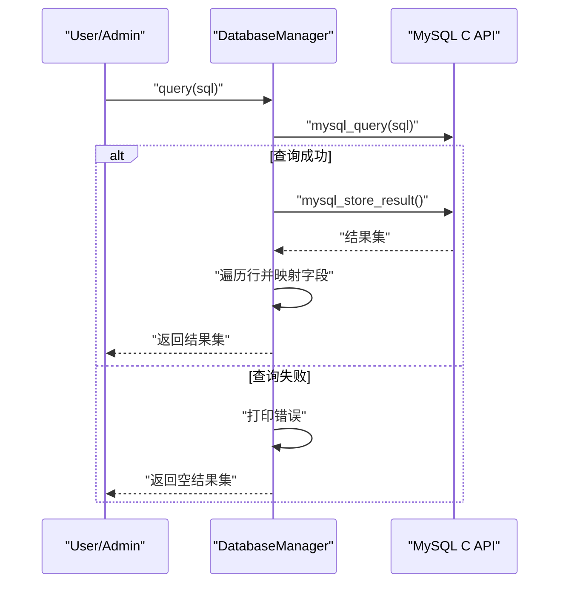
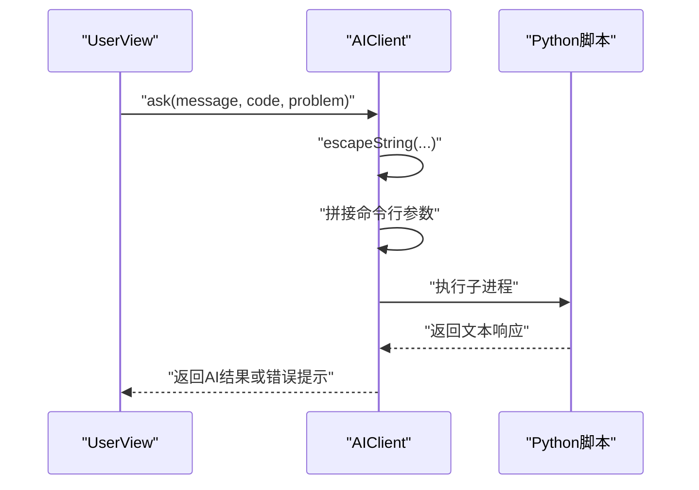
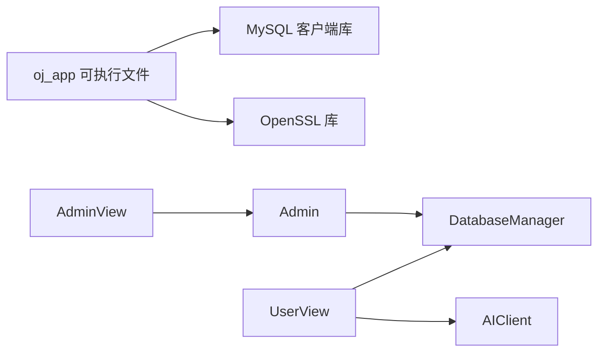

# 核心模块详解

<cite>
**本文引用的文件**
- [src/main.cpp](file://src/main.cpp)
- [CMakeLists.txt](file://CMakeLists.txt)
- [include/view_manager.h](file://include/view_manager.h)
- [include/admin_view.h](file://include/admin_view.h)
- [include/user_view.h](file://include/user_view.h)
- [include/admin.h](file://include/admin.h)
- [include/user.h](file://include/user.h)
- [include/db_manager.h](file://include/db_manager.h)
- [include/ai_client.h](file://include/ai_client.h)
- [include/color_codes.h](file://include/color_codes.h)
- [src/admin.cpp](file://src/admin.cpp)
- [src/user.cpp](file://src/user.cpp)
- [src/db_manager.cpp](file://src/db_manager.cpp)
- [src/ai_client.cpp](file://src/ai_client.cpp)
</cite>

## 目录
1. [引言](#引言)
2. [项目结构](#项目结构)
3. [核心组件](#核心组件)
4. [架构总览](#架构总览)
5. [详细组件分析](#详细组件分析)
6. [依赖分析](#依赖分析)
7. [性能考虑](#性能考虑)
8. [故障排查指南](#故障排查指南)
9. [结论](#结论)
10. [附录](#附录)

## 引言
本文件面向OJ系统的“核心模块”，系统性梳理管理员模块、用户模块、数据库管理器、AI客户端以及视图管理层之间的关系与职责边界，解释接口设计、数据流、控制流与错误处理策略，并给出常见问题的定位与修复建议。文档既适合初学者快速上手，也为有经验的开发者提供足够的技术深度。

## 项目结构
- 入口程序位于 src/main.cpp，负责启动视图管理器并进入登录流程。
- 视图管理层 include/view_manager.h 统一调度管理员视图与用户视图。
- 管理员与用户功能分别由 include/admin.h、include/user.h 定义，对应实现位于 src/admin.cpp、src/user.cpp。
- 数据库访问通过 include/db_manager.h 抽象，实现位于 src/db_manager.cpp。
- AI助手通过 include/ai_client.h 抽象，实现位于 src/ai_client.cpp。
- 颜色常量定义于 include/color_codes.h，用于命令行输出美化。
- 构建系统采用 CMake，目标为 oj_app，链接 MySQL 与 OpenSSL。

图表来源
- [src/main.cpp:5-12](file://src/main.cpp#L5-L12)
- [include/view_manager.h:11-40](file://include/view_manager.h#L11-L40)
- [include/admin_view.h:11-55](file://include/admin_view.h#L11-L55)
- [include/user_view.h:12-92](file://include/user_view.h#L12-L92)
- [include/admin.h:10-37](file://include/admin.h#L10-L37)
- [include/user.h:10-86](file://include/user.h#L10-L86)
- [include/db_manager.h:12-46](file://include/db_manager.h#L12-L46)
- [include/ai_client.h:6-25](file://include/ai_client.h#L6-L25)
- [include/color_codes.h:4-15](file://include/color_codes.h#L4-L15)

章节来源
- [src/main.cpp:1-14](file://src/main.cpp#L1-L14)
- [CMakeLists.txt:1-40](file://CMakeLists.txt#L1-L40)

## 核心组件
- 视图管理层：统一调度管理员与用户视图，负责菜单展示与输入分发。
- 管理员模块：提供题目发布、列表查看、详情查看等能力，依赖数据库管理器。
- 用户模块：提供登录、注册、改密、题目浏览、提交代码、查看提交记录等功能；部分功能预留待实现。
- 数据库管理器：封装MySQL连接、SQL执行与查询结果映射。
- AI客户端：封装Python子进程调用，向AI服务传递消息、代码上下文与题目上下文。
- 颜色常量：提供ANSI颜色码，用于命令行输出高亮。

章节来源
- [include/view_manager.h:11-40](file://include/view_manager.h#L11-L40)
- [include/admin.h:10-37](file://include/admin.h#L10-L37)
- [include/user.h:10-86](file://include/user.h#L10-L86)
- [include/db_manager.h:12-46](file://include/db_manager.h#L12-L46)
- [include/ai_client.h:6-25](file://include/ai_client.h#L6-L25)
- [include/color_codes.h:4-15](file://include/color_codes.h#L4-L15)

## 架构总览
系统采用“视图层-业务层-数据访问层”的分层架构：
- 视图层：AdminView/UserView负责交互与输入解析，触发相应业务方法。
- 业务层：Admin/User封装具体业务规则与流程控制。
- 数据访问层：DatabaseManager抽象数据库操作，屏蔽MySQL细节。
- AI集成：AIClient封装外部AI服务调用，支持会话、转义与错误兜底。

图表来源
- [include/view_manager.h:11-40](file://include/view_manager.h#L11-L40)
- [include/admin_view.h:11-55](file://include/admin_view.h#L11-L55)
- [include/user_view.h:12-92](file://include/user_view.h#L12-L92)
- [include/admin.h:10-37](file://include/admin.h#L10-L37)
- [include/user.h:10-86](file://include/user.h#L10-L86)
- [include/db_manager.h:12-46](file://include/db_manager.h#L12-L46)
- [include/ai_client.h:6-25](file://include/ai_client.h#L6-L25)

## 详细组件分析

### 视图管理层（ViewManager）
- 职责：启动登录菜单，根据用户角色进入管理员或用户视图；提供清屏、菜单展示与输入缓冲清理。
- 关键点：
  - 登录菜单启动后，依据用户选择实例化 AdminView 或 UserView。
  - 主菜单与游客菜单分流，避免未登录用户访问受限功能。
- 依赖：AdminView、UserView。

章节来源
- [include/view_manager.h:11-40](file://include/view_manager.h#L11-L40)

### 管理员模块（Admin）
- 职责：面向管理员的题目管理能力。
- 接口与行为：
  - add_problem(sql)：执行SQL发布题目，返回布尔结果。
  - list_all_problems()：查询并格式化输出题目列表（ID、标题、时间/内存限制）。
  - show_problem_detail(id)：按ID查询题目详情，以JSON格式美化输出。
- 数据访问：通过构造函数注入的 DatabaseManager 执行SQL与查询。
- 错误处理：对空结果与空数据库指针进行保护；查询失败打印错误信息。

图表来源
- [include/admin_view.h:11-55](file://include/admin_view.h#L11-L55)
- [include/admin.h:10-37](file://include/admin.h#L10-L37)
- [src/admin.cpp:12-15](file://src/admin.cpp#L12-L15)
- [include/db_manager.h:12-46](file://include/db_manager.h#L12-L46)
- [src/db_manager.cpp:21-24](file://src/db_manager.cpp#L21-L24)

章节来源
- [include/admin.h:10-37](file://include/admin.h#L10-L37)
- [src/admin.cpp:12-58](file://src/admin.cpp#L12-L58)

### 用户模块（User）
- 职责：面向普通用户的认证与学习相关能力。
- 接口与行为：
  - login(account, password)：校验账号是否存在，计算SHA256哈希比对，成功则更新最近登录时间并标记登录态。
  - register_user(account, password)：检测账号是否已存在，若不存在则插入新用户。
  - change_my_password(old, new)：仅允许已登录用户修改密码，旧密码需匹配。
  - list_problems()/view_problem(id)：查询并展示题目列表与详情。
  - submit_code(problem_id, code, language)/view_my_submissions()：预留接口，当前提示待实现。
- 安全与健壮性：
  - 使用OpenSSL EVP_Digest计算SHA256。
  - 对未登录状态进行前置校验。
  - 查询失败打印错误信息。
- 返回值规范：
  - login/register/change_my_password 返回布尔值表示成功与否。
  - list_problems/view_problem 无返回值，直接输出。
  - submit_code/view_my_submissions 输出提示信息，后续完善返回值。

图表来源
- [src/user.cpp:39-71](file://src/user.cpp#L39-L71)
- [include/user.h:18-24](file://include/user.h#L18-L24)

章节来源
- [include/user.h:10-86](file://include/user.h#L10-L86)
- [src/user.cpp:39-223](file://src/user.cpp#L39-L223)

### 数据库管理器（DatabaseManager）
- 职责：封装MySQL连接、SQL执行与查询结果映射。
- 接口与行为：
  - 构造函数：初始化并建立连接；析构函数关闭连接。
  - run_sql(sql)：执行非查询语句，返回布尔结果；失败时打印错误。
  - query(sql)：执行查询语句，返回行集合（每行以列名为键的字典），失败时打印错误并返回空结果。
- 结果映射：将MYSQL_RES的字段名与值映射到std::map<string,string>，并遍历所有行。
- 错误处理：对连接失败、查询失败进行错误输出与短路返回。

图表来源
- [include/db_manager.h:12-46](file://include/db_manager.h#L12-L46)
- [src/db_manager.cpp:26-57](file://src/db_manager.cpp#L26-L57)

章节来源
- [include/db_manager.h:12-46](file://include/db_manager.h#L12-L46)
- [src/db_manager.cpp:8-99](file://src/db_manager.cpp#L8-L99)

### AI客户端（AIClient）
- 职责：封装Python脚本调用，作为AI服务的轻量桥接。
- 接口与行为：
  - ask(message, codeContext="", problemContext="")：拼装参数并执行Python脚本，返回AI响应；若为空响应，返回错误提示。
  - isAvailable()：检测Python解释器与脚本文件是否存在。
  - 内部机制：escapeString用于转义特殊字符；executePython通过管道读取子进程输出。
- 配置与路径：
  - 优先使用 ai/venv/bin/python 与 ai/ai_service.py。
  - 若不可用，回退到 ../ai/... 相对路径。
- 注意事项：
  - 当前仅支持命令行参数形式的调用，后续可扩展HTTP或WebSocket。
  - 空响应与网络/配置异常需在上层进行重试或降级。

图表来源
- [include/ai_client.h:6-25](file://include/ai_client.h#L6-L25)
- [src/ai_client.cpp:85-112](file://src/ai_client.cpp#L85-L112)

章节来源
- [include/ai_client.h:6-25](file://include/ai_client.h#L6-L25)
- [src/ai_client.cpp:1-124](file://src/ai_client.cpp#L1-L124)

### 视图层（AdminView/UserView）
- 管理员视图：提供菜单、处理题目列表、详情与新增题目的交互逻辑；内部持有 DatabaseManager 与 Admin 实例。
- 用户视图：提供游客菜单与登录后菜单，处理登录、注册、题目浏览、提交、AI助手、查看提交记录与改密；内部持有 DatabaseManager、User 与 AIClient 实例。
- 输入处理：提供清屏与输入缓冲清理工具方法，保证交互体验。

章节来源
- [include/admin_view.h:11-55](file://include/admin_view.h#L11-L55)
- [include/user_view.h:12-92](file://include/user_view.h#L12-L92)

## 依赖分析
- 构建依赖：CMake查找mysqlclient与OpenSSL，包含头文件目录并链接库。
- 运行时依赖：oj_app运行时需正确加载MySQL客户端库与OpenSSL库。
- 模块耦合：
  - Admin/User均依赖DatabaseManager，形成稳定的“业务-数据”耦合。
  - UserView组合AIClient，体现“视图-外部服务”的弱耦合。
  - AdminView不直接依赖AIClient，降低管理员功能对AI的耦合度。

图表来源
- [CMakeLists.txt:11-34](file://CMakeLists.txt#L11-L34)

章节来源
- [CMakeLists.txt:11-34](file://CMakeLists.txt#L11-L34)

## 性能考虑
- 查询性能：
  - query接口一次性拉取结果集，适合中小规模数据；对于大结果集应考虑分页或游标。
  - 列名映射为字符串键，建议在高频路径避免重复构建键集合。
- IO与网络：
  - AIClient通过子进程执行Python脚本，存在进程启动开销；可考虑复用会话或引入本地HTTP服务。
- 加密成本：
  - SHA256计算为CPU密集型，建议在批量注册/登录场景下评估并发与缓存策略。
- 连接管理：
  - DatabaseManager在构造时建立连接，建议在多线程场景下为每个线程维护独立连接或引入连接池。

## 故障排查指南
- 登录失败
  - 现象：账号不存在或密码错误。
  - 排查：确认账号是否已注册；检查数据库中password_hash是否正确；确认SHA256计算链路。
  - 参考位置：[src/user.cpp:39-71](file://src/user.cpp#L39-L71)
- 查询失败
  - 现象：控制台打印错误信息且返回空结果。
  - 排查：检查SQL语法、表权限与连接参数；确认DatabaseManager::query返回路径。
  - 参考位置：[src/db_manager.cpp:32-36](file://src/db_manager.cpp#L32-L36)
- AI服务不可用
  - 现象：返回“无法执行AI服务”或空响应。
  - 排查：确认Python解释器路径与脚本文件存在；检查网络与API Key配置；验证参数转义。
  - 参考位置：[src/ai_client.cpp:17-22](file://src/ai_client.cpp#L17-L22)，[src/ai_client.cpp:105-111](file://src/ai_client.cpp#L105-L111)
- 提交/查看提交记录未实现
  - 现象：输出“待实现”提示。
  - 排查：按需扩展User::submit_code与User::view_my_submissions，接入评测队列与存储。
  - 参考位置：[src/user.cpp:201-222](file://src/user.cpp#L201-L222)

章节来源
- [src/user.cpp:39-71](file://src/user.cpp#L39-L71)
- [src/db_manager.cpp:32-36](file://src/db_manager.cpp#L32-L36)
- [src/ai_client.cpp:17-22](file://src/ai_client.cpp#L17-L22)
- [src/ai_client.cpp:105-111](file://src/ai_client.cpp#L105-L111)
- [src/user.cpp:201-222](file://src/user.cpp#L201-L222)

## 结论
本系统通过清晰的分层与职责划分，实现了管理员与用户两大角色的差异化功能，同时以DatabaseManager抽象数据库访问，以AIClient桥接AI服务。建议后续在以下方面持续演进：完善用户提交与评测流程、引入连接池与缓存、增强AI服务的容错与可观测性、补充单元测试与集成测试覆盖。

## 附录
- 配置与参数
  - 数据库连接：host、user、password、dbname（可选）。
  - AI客户端：pythonPath、pythonScriptPath（自动探测）、sessionId。
- 返回值规范
  - run_sql/query：布尔/结果集；失败时打印错误并返回默认值。
  - login/register/change_my_password：布尔；失败时打印错误信息。
  - ask：字符串；空响应时返回错误提示。
- 最佳实践
  - 在业务层统一进行输入校验与状态检查。
  - 在数据访问层集中处理错误与日志。
  - 在视图层保持薄逻辑，专注于交互与路由。