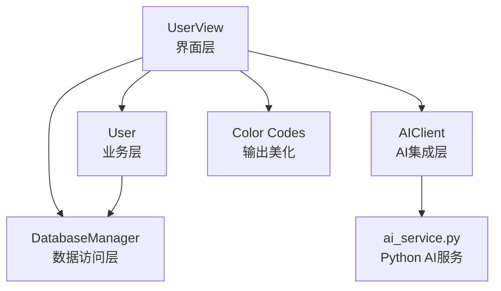
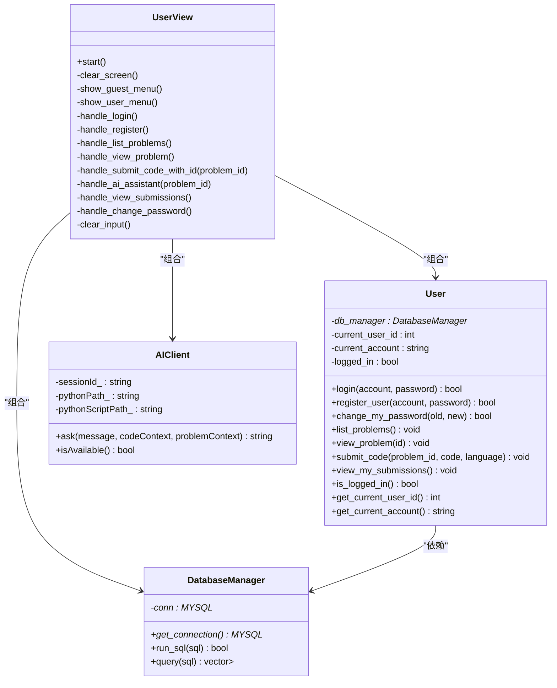
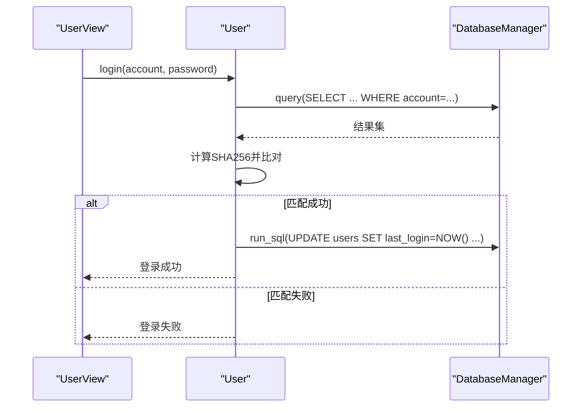
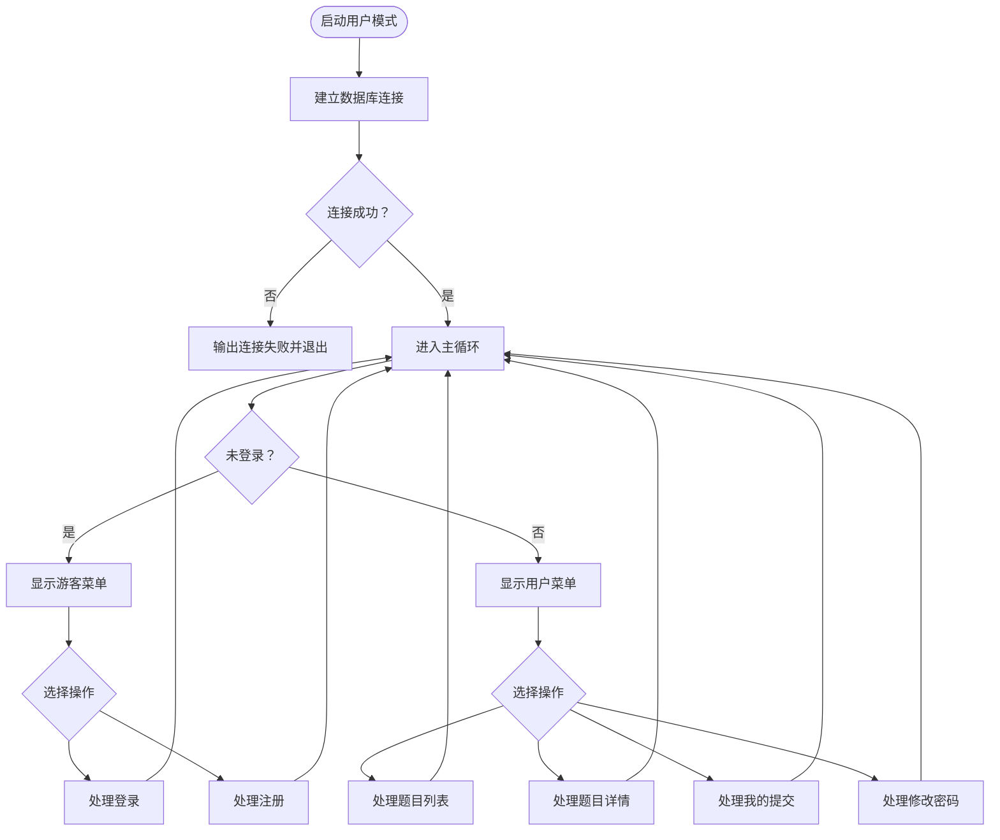
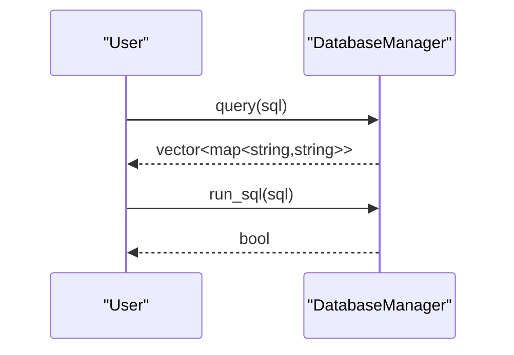
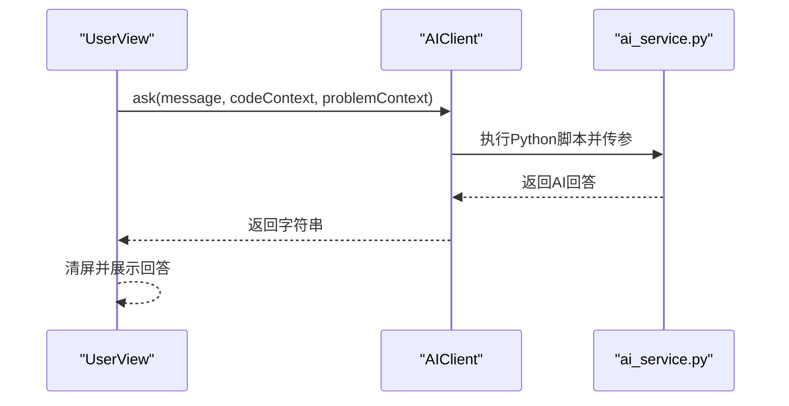
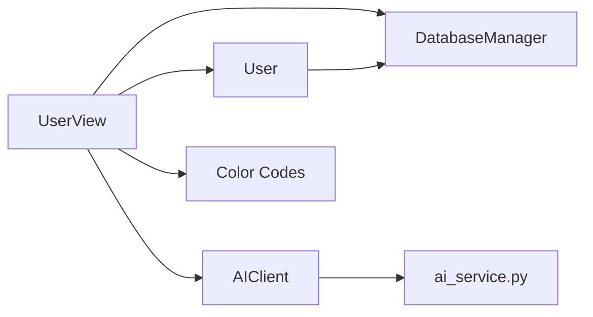
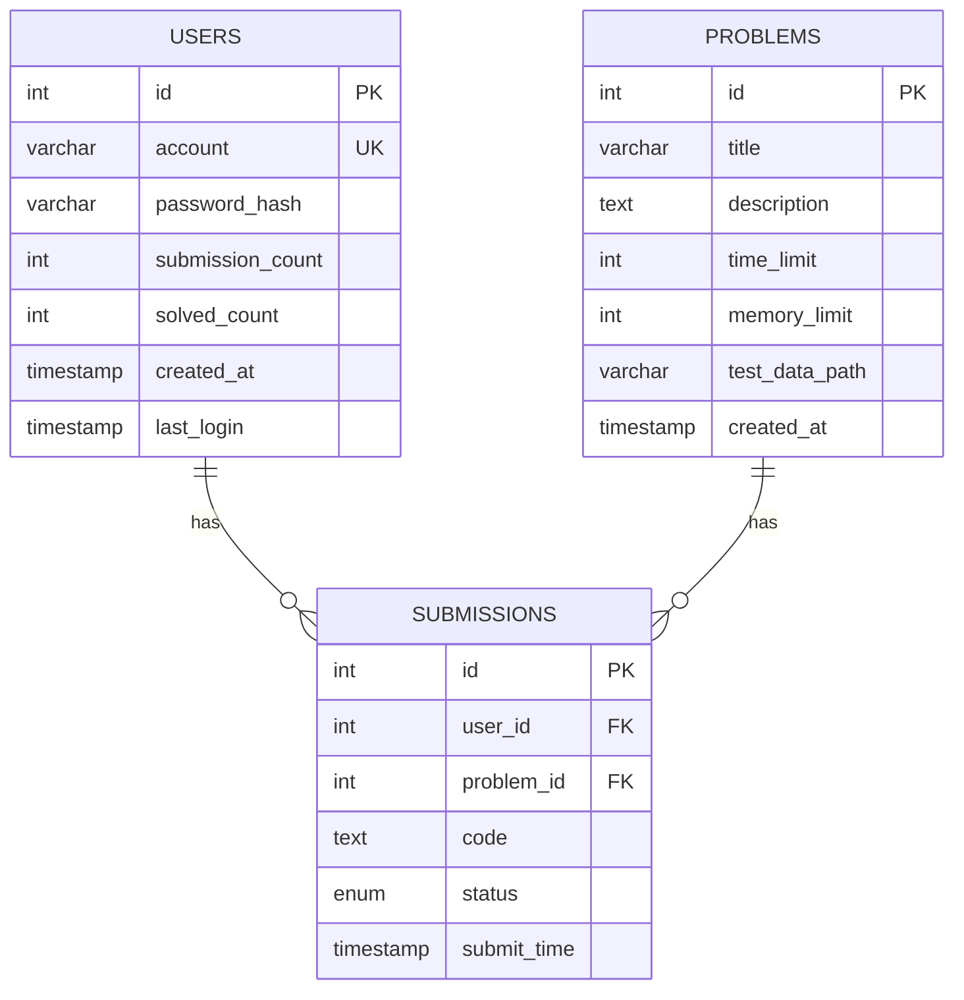

# 用户模块

<cite>
**本文引用的文件**
- [include/user.h](file://include/user.h)
- [src/user.cpp](file://src/user.cpp)
- [include/user_view.h](file://include/user_view.h)
- [src/user_view.cpp](file://src/user_view.cpp)
- [include/db_manager.h](file://include/db_manager.h)
- [src/db_manager.cpp](file://src/db_manager.cpp)
- [include/ai_client.h](file://include/ai_client.h)
- [src/ai_client.cpp](file://src/ai_client.cpp)
- [include/color_codes.h](file://include/color_codes.h)
- [ai/ai_service.py](file://ai/ai_service.py)
- [init.sql](file://init.sql)
</cite>

## 目录
1. [简介](#简介)
2. [项目结构](#项目结构)
3. [核心组件](#核心组件)
4. [架构总览](#架构总览)
5. [详细组件分析](#详细组件分析)
6. [依赖关系分析](#依赖关系分析)
7. [性能考量](#性能考量)
8. [故障排除指南](#故障排除指南)
9. [结论](#结论)
10. [附录](#附录)

## 简介
本文件面向OJ系统“用户模块”的技术文档，聚焦于User类的业务逻辑与UserView界面层的交互设计，涵盖用户认证、密码管理、题目浏览、代码提交、状态查看等核心功能；同时阐述与DatabaseManager和AIClient的协作关系，并给出AI辅助功能的集成方式、用户体验优化建议与故障排除指南。文档以循序渐进的方式呈现，既适合开发者深入理解实现细节，也便于非技术读者快速掌握使用流程。

## 项目结构
用户模块主要由以下层次构成：
- 界面层：UserView负责命令行交互、菜单展示与用户输入处理
- 业务层：User封装用户相关业务逻辑（认证、密码变更、题目浏览、提交、状态查看）
- 数据访问层：DatabaseManager封装MySQL连接与SQL执行
- AI集成层：AIClient封装Python子进程调用，桥接本地AI服务
- 工具与常量：color_codes.h提供ANSI颜色常量，便于美化输出

图表来源
- [include/user_view.h:12-89](file://include/user_view.h#L12-L89)
- [include/user.h:10-86](file://include/user.h#L10-L86)
- [include/db_manager.h:12-46](file://include/db_manager.h#L12-L46)
- [include/ai_client.h:6-25](file://include/ai_client.h#L6-L25)
- [include/color_codes.h:5-15](file://include/color_codes.h#L5-L15)
- [ai/ai_service.py:1-113](file://ai/ai_service.py#L1-L113)

章节来源
- [include/user_view.h:12-89](file://include/user_view.h#L12-L89)
- [include/user.h:10-86](file://include/user.h#L10-L86)
- [include/db_manager.h:12-46](file://include/db_manager.h#L12-L46)
- [include/ai_client.h:6-25](file://include/ai_client.h#L6-L25)
- [include/color_codes.h:5-15](file://include/color_codes.h#L5-L15)
- [ai/ai_service.py:1-113](file://ai/ai_service.py#L1-L113)

## 核心组件
- User类：封装用户认证、注册、密码修改、题目列表/详情查看、代码提交、提交记录查看等业务方法；维护当前登录状态、用户ID与账号信息
- UserView类：提供命令行交互界面，根据登录状态切换菜单，处理用户输入并调用User与AIClient
- DatabaseManager类：封装MySQL连接、查询与执行，提供统一的SQL接口
- AIClient类：封装Python子进程调用，桥接本地AI服务，支持消息、代码与题目上下文传递
- Color Codes：提供ANSI颜色常量，提升终端输出可读性

章节来源
- [include/user.h:10-86](file://include/user.h#L10-L86)
- [src/user.cpp:11-223](file://src/user.cpp#L11-L223)
- [include/user_view.h:12-89](file://include/user_view.h#L12-L89)
- [src/user_view.cpp:10-352](file://src/user_view.cpp#L10-L352)
- [include/db_manager.h:12-46](file://include/db_manager.h#L12-L46)
- [src/db_manager.cpp:8-100](file://src/db_manager.cpp#L8-L100)
- [include/ai_client.h:6-25](file://include/ai_client.h#L6-L25)
- [src/ai_client.cpp:8-124](file://src/ai_client.cpp#L8-L124)
- [include/color_codes.h:5-15](file://include/color_codes.h#L5-L15)

## 架构总览
用户模块采用分层架构：
- 界面层（UserView）负责用户交互与流程编排
- 业务层（User）负责领域逻辑与数据访问协调
- 数据访问层（DatabaseManager）负责数据库连接与SQL执行
- AI集成层（AIClient）负责与Python AI服务通信

图表来源
- [include/user_view.h:12-89](file://include/user_view.h#L12-L89)
- [include/user.h:10-86](file://include/user.h#L10-L86)
- [include/db_manager.h:12-46](file://include/db_manager.h#L12-L46)
- [include/ai_client.h:6-25](file://include/ai_client.h#L6-L25)

## 详细组件分析

### User类业务逻辑
- 认证与会话
  - login：查询用户表，比对SHA256哈希，成功则更新last_login并标记登录态
  - register_user：检查账号唯一性，生成SHA256哈希后插入用户表
  - change_my_password：校验旧密码哈希，成功则更新新哈希
- 题目浏览
  - list_problems：查询problems表并格式化输出
  - view_problem：按ID查询并输出题目详情
- 提交流程
  - submit_code：当前登录态校验，预留扩展点（当前输出待实现）
  - view_my_submissions：当前登录态校验，预留扩展点（当前输出待实现）

图表来源
- [src/user.cpp:39-71](file://src/user.cpp#L39-L71)
- [src/db_manager.cpp:26-57](file://src/db_manager.cpp#L26-L57)

章节来源
- [include/user.h:10-86](file://include/user.h#L10-L86)
- [src/user.cpp:39-137](file://src/user.cpp#L39-L137)
- [src/db_manager.cpp:26-57](file://src/db_manager.cpp#L26-L57)

### UserView界面层设计
- 初始化与连接
  - 构造时创建DatabaseManager（受限账号）、User与AIClient实例
  - start中循环显示菜单，区分未登录与已登录状态
- 菜单与交互
  - 未登录：登录、注册、返回主菜单
  - 已登录：题目列表、题目详情、我的提交、修改密码、退出登录
- 输入处理
  - 统一使用getline处理字符串输入，cin >> 整数并配合clear_input清理缓冲
  - 支持“0返回”约定，便于快速导航
- 输出美化
  - 使用Color Codes命名空间输出彩色提示与表格

图表来源
- [src/user_view.cpp:21-116](file://src/user_view.cpp#L21-L116)
- [src/user_view.cpp:118-142](file://src/user_view.cpp#L118-L142)
- [src/user_view.cpp:144-196](file://src/user_view.cpp#L144-L196)
- [src/user_view.cpp:198-345](file://src/user_view.cpp#L198-L345)

章节来源
- [include/user_view.h:12-89](file://include/user_view.h#L12-L89)
- [src/user_view.cpp:10-352](file://src/user_view.cpp#L10-L352)
- [include/color_codes.h:5-15](file://include/color_codes.h#L5-L15)

### 与DatabaseManager的协作
- 连接建立：UserView构造时以受限账号连接数据库
- 查询与执行：User在认证、注册、密码修改、题目浏览等场景调用query/run_sql
- 错误处理：DatabaseManager在查询/执行失败时输出错误信息并返回空结果或false

图表来源
- [src/user.cpp:44-45](file://src/user.cpp#L44-L45)
- [src/db_manager.cpp:26-57](file://src/db_manager.cpp#L26-L57)
- [src/db_manager.cpp:21-24](file://src/db_manager.cpp#L21-L24)

章节来源
- [include/db_manager.h:12-46](file://include/db_manager.h#L12-L46)
- [src/db_manager.cpp:8-100](file://src/db_manager.cpp#L8-L100)
- [src/user.cpp:44-45](file://src/user.cpp#L44-L45)

### 与AIClient的协作与AI集成
- AIClient封装Python子进程调用，支持会话ID、消息、代码上下文与题目上下文
- UserView在题目详情页提供“AI助手”入口，调用AIClient.ask并展示结果
- ai_service.py作为Python服务端，加载环境变量、构建消息历史、调用模型并返回内容

图表来源
- [src/user_view.cpp:275-311](file://src/user_view.cpp#L275-L311)
- [src/ai_client.cpp:85-112](file://src/ai_client.cpp#L85-L112)
- [ai/ai_service.py:40-83](file://ai/ai_service.py#L40-L83)

章节来源
- [include/ai_client.h:6-25](file://include/ai_client.h#L6-L25)
- [src/ai_client.cpp:8-124](file://src/ai_client.cpp#L8-L124)
- [ai/ai_service.py:1-113](file://ai/ai_service.py#L1-L113)

### 代码示例：命令行在线练习与提交
以下示例展示用户如何通过命令行界面进行在线练习和提交（基于现有实现）：
- 启动用户模式并连接数据库
- 未登录状态下选择“登录”，输入账号与密码
- 登录成功后进入用户菜单，选择“查看题目列表”
- 选择具体题目ID，进入题目详情子菜单
- 在题目详情子菜单中选择“提交代码”，输入C++代码（以END结束），随后调用User.submit_code
- 在题目详情子菜单中选择“AI助手”，输入问题，调用AIClient.ask获取回答

章节来源
- [src/user_view.cpp:21-116](file://src/user_view.cpp#L21-L116)
- [src/user_view.cpp:198-259](file://src/user_view.cpp#L198-L259)
- [src/user_view.cpp:261-273](file://src/user_view.cpp#L261-L273)
- [src/user_view.cpp:275-311](file://src/user_view.cpp#L275-L311)
- [src/user.cpp:201-211](file://src/user.cpp#L201-L211)

## 依赖关系分析
- User依赖DatabaseManager进行数据访问
- UserView组合User、DatabaseManager与AIClient，承担流程编排与交互
- AIClient依赖Python脚本与环境变量，通过子进程调用ai_service.py
- color_codes.h被UserView与User用于输出美化

图表来源
- [include/user_view.h:24-26](file://include/user_view.h#L24-L26)
- [include/user.h:82](file://include/user.h#L82)
- [include/ai_client.h:18-24](file://include/ai_client.h#L18-L24)
- [include/color_codes.h:5-15](file://include/color_codes.h#L5-L15)

章节来源
- [include/user_view.h:12-89](file://include/user_view.h#L12-L89)
- [include/user.h:10-86](file://include/user.h#L10-L86)
- [include/db_manager.h:12-46](file://include/db_manager.h#L12-L46)
- [include/ai_client.h:6-25](file://include/ai_client.h#L6-L25)
- [include/color_codes.h:5-15](file://include/color_codes.h#L5-L15)

## 性能考量
- 数据库查询
  - 使用索引：users表的account字段与创建时间索引有助于加速登录与统计
  - 查询范围：题目列表与详情查询均为单表查询，建议保持SQL简洁，避免不必要的JOIN
- 密码哈希
  - 使用SHA256进行哈希存储，满足基本安全需求；建议后续升级为bcrypt或scrypt以增强抗攻击能力
- AI调用
  - Python子进程调用存在启动开销，建议在高频场景下考虑缓存或长驻进程方案
- I/O与缓冲
  - 统一使用getline处理文本输入，结合clear_input清理缓冲，减少输入错误导致的阻塞

[本节为通用性能建议，无需特定文件引用]

## 故障排除指南
- 数据库连接失败
  - 现象：启动用户模式后提示连接失败
  - 排查：确认init.sql已正确初始化数据库与用户权限；检查UserView构造时使用的主机、用户名、密码与数据库名
  - 参考
    - [src/user_view.cpp:27](file://src/user_view.cpp#L27)
    - [init.sql:67-94](file://init.sql#L67-L94)
- 登录失败
  - 现象：账号不存在或密码错误
  - 排查：确认账号已在users表中存在且密码哈希一致；检查SHA256计算与存储一致性
  - 参考
    - [src/user.cpp:47-60](file://src/user.cpp#L47-L60)
- 注册失败
  - 现象：账号已存在
  - 排查：确保注册时账号唯一；确认insert语句执行成功
  - 参考
    - [src/user.cpp:78-97](file://src/user.cpp#L78-L97)
- 题目列表为空
  - 现象：题目列表显示暂无题目
  - 排查：确认init.sql已插入示例题目；检查problems表是否存在数据
  - 参考
    - [init.sql:96-132](file://init.sql#L96-L132)
- AI服务不可用
  - 现象：AI助手提示服务不可用或返回空响应
  - 排查：确认ai/ai_service.py与虚拟环境路径存在；检查DEEPSEEK_API_KEY环境变量；验证Python依赖安装
  - 参考
    - [src/user_view.cpp:280](file://src/user_view.cpp#L280)
    - [src/ai_client.cpp:114-123](file://src/ai_client.cpp#L114-L123)
    - [ai/ai_service.py:42-44](file://ai/ai_service.py#L42-L44)

章节来源
- [src/user_view.cpp:27-116](file://src/user_view.cpp#L27-L116)
- [src/user.cpp:47-97](file://src/user.cpp#L47-L97)
- [init.sql:67-132](file://init.sql#L67-L132)
- [src/ai_client.cpp:114-123](file://src/ai_client.cpp#L114-L123)
- [ai/ai_service.py:42-44](file://ai/ai_service.py#L42-L44)

## 结论
用户模块通过清晰的分层设计实现了从界面交互到业务逻辑再到数据访问与AI集成的完整闭环。User类承担了核心业务逻辑，UserView提供了直观的命令行交互体验，DatabaseManager与AIClient分别负责数据访问与AI辅助能力。当前实现已覆盖用户认证、注册、密码修改、题目浏览与AI助手等关键功能，提交与状态查看功能预留扩展点，便于后续完善评测与反馈机制。

[本节为总结性内容，无需特定文件引用]

## 附录

### 数据模型概览
- users表：存储平台用户信息，包含唯一账号、密码哈希、统计字段与登录时间
- problems表：存储题目信息，包含标题、描述、时间与内存限制
- submissions表：存储提交记录，包含用户ID、题目ID、代码、评测状态与提交时间

图表来源
- [init.sql:25-38](file://init.sql#L25-L38)
- [init.sql:14-23](file://init.sql#L14-L23)
- [init.sql:40-60](file://init.sql#L40-L60)

章节来源
- [init.sql:14-60](file://init.sql#L14-L60)