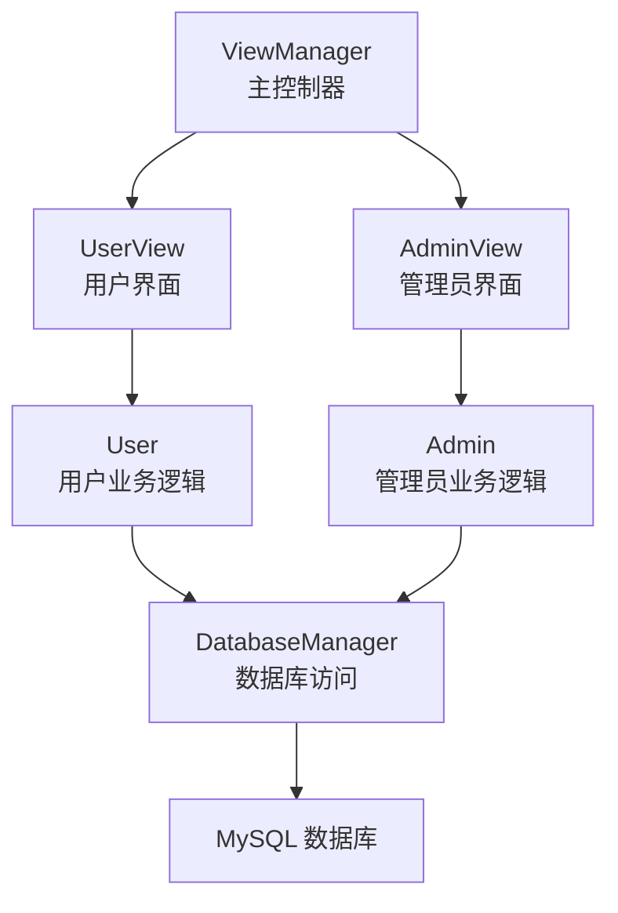
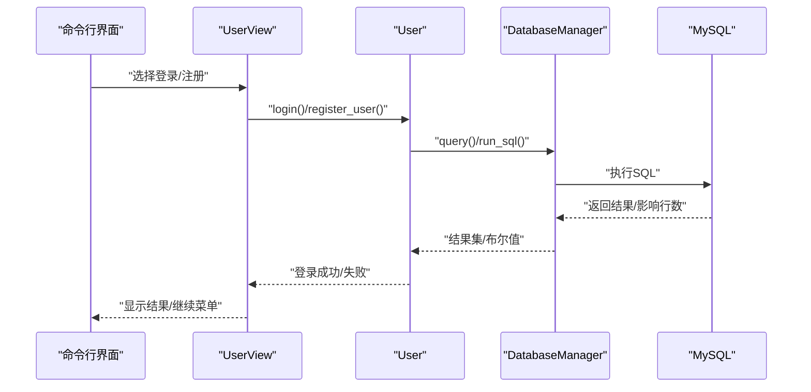
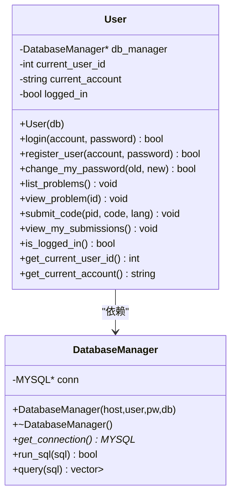
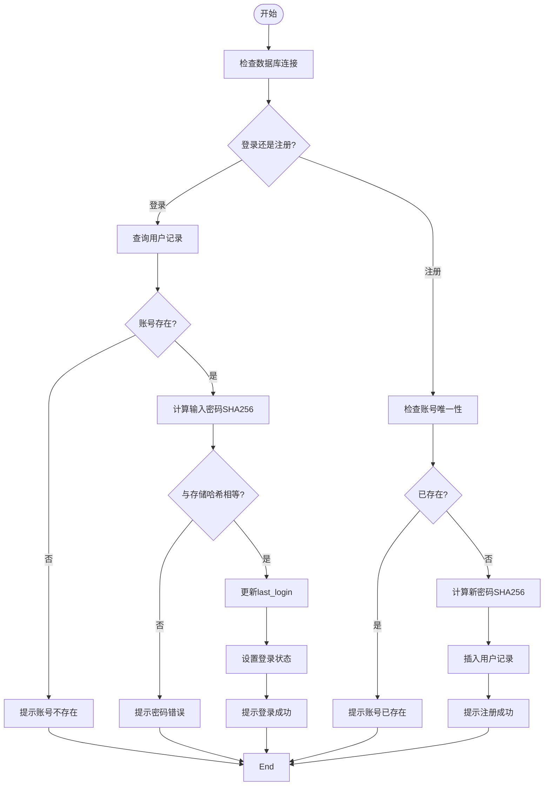
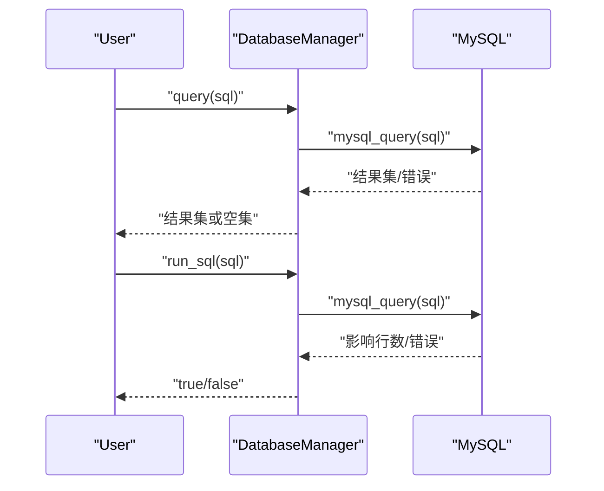
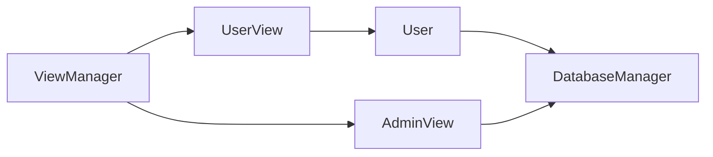
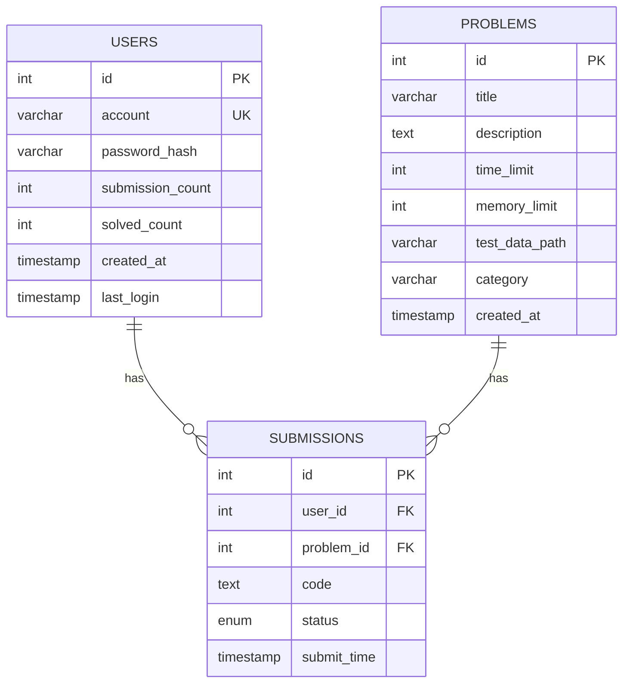

# 用户模块

<cite>
**本文引用的文件**
- [include/user.h](file://include/user.h)
- [src/user.cpp](file://src/user.cpp)
- [include/db_manager.h](file://include/db_manager.h)
- [src/db_manager.cpp](file://src/db_manager.cpp)
- [include/user_view.h](file://include/user_view.h)
- [src/user_view.cpp](file://src/user_view.cpp)
- [include/view_manager.h](file://include/view_manager.h)
- [src/main.cpp](file://src/main.cpp)
- [init.sql](file://init.sql)
</cite>

## 目录
1. [简介](#简介)
2. [项目结构](#项目结构)
3. [核心组件](#核心组件)
4. [架构总览](#架构总览)
5. [详细组件分析](#详细组件分析)
6. [依赖关系分析](#依赖关系分析)
7. [性能考量](#性能考量)
8. [故障排查指南](#故障排查指南)
9. [结论](#结论)
10. [附录](#附录)

## 简介
本文件面向开发者，系统性梳理用户模块的设计与实现，重点覆盖以下方面：
- User类的职责边界与业务逻辑：登录、注册、密码修改、题目浏览、提交代码、查看提交记录等
- 认证与密码处理：基于 SHA256 的密码哈希策略与校验流程
- 与DatabaseManager的交互模式：查询、更新、错误处理
- 会话管理与权限控制：基于登录状态的访问控制
- 用户界面层(UserView)与业务层(User)的解耦
- 数据验证与输入处理：菜单选择、输入清理、中文标题显示宽度计算
- 与管理员模块的协作与角色分离

## 项目结构
用户模块位于命令行交互式在线判题系统(OJ)中，采用分层架构：
- 视图层(ViewManager/UserView/AdminView)：负责用户交互与菜单调度
- 业务层(User/Admin)：封装具体业务逻辑
- 数据访问层(DatabaseManager)：封装MySQL连接与SQL执行
- 数据模型：users、problems、submissions三张核心表

图表来源
- [include/view_manager.h:11-40](file://include/view_manager.h#L11-L40)
- [include/user_view.h:12-89](file://include/user_view.h#L12-L89)
- [include/admin_view.h:11-55](file://include/admin_view.h#L11-L55)
- [include/user.h:10-86](file://include/user.h#L10-L86)
- [include/admin.h:10-37](file://include/admin.h#L10-L37)
- [include/db_manager.h:12-46](file://include/db_manager.h#L12-L46)

章节来源
- [src/main.cpp:5-12](file://src/main.cpp#L5-L12)
- [include/view_manager.h:11-40](file://include/view_manager.h#L11-L40)

## 核心组件
- User类：封装普通用户的全部业务逻辑，包括登录、注册、密码修改、题目浏览、提交代码、查看提交记录等
- DatabaseManager类：封装MySQL连接、查询与执行，提供统一的SQL接口
- UserView类：用户模式的界面控制器，负责菜单展示、输入处理、调用User业务方法
- ViewManager类：应用入口，负责启动登录菜单并引导进入用户/管理员模式

章节来源
- [include/user.h:10-86](file://include/user.h#L10-L86)
- [include/db_manager.h:12-46](file://include/db_manager.h#L12-L46)
- [include/user_view.h:12-89](file://include/user_view.h#L12-L89)
- [include/view_manager.h:11-40](file://include/view_manager.h#L11-L40)

## 架构总览
用户模块遵循“视图-业务-数据访问”的分层设计：
- 视图层(UserView)接收用户输入，调用User对象的方法
- User对象通过DatabaseManager执行数据库操作
- DatabaseManager封装MySQL C API，负责连接、查询、执行与错误处理
- ViewManager作为应用入口，协调用户与管理员两种角色

图表来源
- [src/user_view.cpp:159-184](file://src/user_view.cpp#L159-L184)
- [src/user.cpp:39-71](file://src/user.cpp#L39-L71)
- [src/db_manager.cpp:26-57](file://src/db_manager.cpp#L26-L57)

## 详细组件分析

### User类设计与业务逻辑
- 关键属性
  - current_user_id：当前登录用户ID
  - current_account：当前登录账号
  - logged_in：登录状态
  - db_manager：指向DatabaseManager的指针
- 关键方法
  - login(account, password)：查询用户表，比对SHA256哈希，成功则更新last_login并设置登录状态
  - register_user(account, password)：检查账号唯一性，生成SHA256哈希并插入用户记录
  - change_my_password(old_password, new_password)：要求已登录，校验旧密码哈希，更新为新哈希
  - list_problems()/view_problem(id)/submit_code()/view_my_submissions()：面向用户的题目浏览与提交能力
- 设计要点
  - 通过构造函数注入DatabaseManager，实现依赖倒置
  - 登录成功后更新last_login字段，便于审计与统计
  - 所有数据库交互均通过DatabaseManager完成，避免直接操作MySQL C API

图表来源
- [include/user.h:10-86](file://include/user.h#L10-L86)
- [include/db_manager.h:12-46](file://include/db_manager.h#L12-L46)

章节来源
- [include/user.h:10-86](file://include/user.h#L10-L86)
- [src/user.cpp:11-137](file://src/user.cpp#L11-L137)

### 认证机制与密码哈希处理
- 登录流程
  - 通过账号查询用户记录，若不存在则提示“账号不存在”
  - 对输入密码计算SHA256哈希并与存储的password_hash比较
  - 若一致则设置登录状态、更新last_login并提示“登录成功”
- 注册流程
  - 先检查账号是否已存在
  - 对密码计算SHA256哈希并插入users表
- 密码修改流程
  - 要求已登录
  - 查询当前用户记录，比对旧密码哈希
  - 更新为新密码的SHA256哈希
- 哈希实现
  - 使用OpenSSL EVP接口计算SHA256
  - 将二进制哈希转换为十六进制字符串

图表来源
- [src/user.cpp:39-98](file://src/user.cpp#L39-L98)
- [src/user.cpp:14-37](file://src/user.cpp#L14-L37)

章节来源
- [src/user.cpp:39-98](file://src/user.cpp#L39-L98)
- [src/user.cpp:14-37](file://src/user.cpp#L14-L37)

### 个人信息管理与题目浏览
- list_problems()
  - 查询problems表并格式化输出，支持中文标题宽度计算与截断，确保终端显示正确
  - 输出包含ID、标题（按显示宽度截断）、分类
- view_problem(id)
  - 查询并展示题目详情，包含题号、标题、分类、时间/内存限制、描述
- submit_code(problem_id, code, language)
  - 当前版本为占位实现，预留后续评测集成
- view_my_submissions()
  - 当前版本为占位实现，预留后续提交历史展示

章节来源
- [src/user.cpp:139-285](file://src/user.cpp#L139-L285)

### 与DatabaseManager的交互模式
- 查询与执行
  - query(sql)：执行SELECT，返回行集合（列名->值的映射）
  - run_sql(sql)：执行INSERT/UPDATE/DELETE，返回布尔值
- 错误处理
  - query/run_sql内部捕获MySQL错误并输出到标准错误流
  - 返回空结果集或false时，调用方根据返回值决定后续逻辑
- 连接生命周期
  - DatabaseManager在析构时关闭连接，避免资源泄漏

图表来源
- [src/db_manager.cpp:26-57](file://src/db_manager.cpp#L26-L57)
- [src/db_manager.cpp:81-99](file://src/db_manager.cpp#L81-L99)

章节来源
- [include/db_manager.h:25-42](file://include/db_manager.h#L25-L42)
- [src/db_manager.cpp:21-57](file://src/db_manager.cpp#L21-L57)
- [src/db_manager.cpp:81-99](file://src/db_manager.cpp#L81-L99)

### 会话管理与权限验证
- 会话状态
  - 通过User对象的logged_in/current_user_id/current_account维护会话
  - 登录成功后设置状态，登出通过重新实例化User或重置状态实现
- 权限控制
  - 部分操作（如提交代码、查看提交记录）在User层检查登录状态
  - 数据库层面通过单一用户账号连接，应用层通过WHERE id = current_user_id实现行级隔离
- 菜单切换
  - UserView根据User.is_logged_in()动态切换游客菜单与用户菜单

章节来源
- [src/user.cpp:69-74](file://src/user.cpp#L69-L74)
- [src/user_view.cpp:50-121](file://src/user_view.cpp#L50-L121)

### 输入处理与数据验证
- 输入清理
  - 使用clear_input()清空cin缓冲区，避免非数字输入导致的死循环
  - 在菜单选择与题目ID输入处进行类型检查
- 中文标题显示宽度
  - 自定义UTF-8字符宽度计算与截断逻辑，确保标题在终端中对齐美观
- 文件读取
  - 读取工作区代码用于AI辅助功能

章节来源
- [src/user_view.cpp:390-394](file://src/user_view.cpp#L390-L394)
- [src/user.cpp:167-229](file://src/user.cpp#L167-L229)

### 与管理员模块的协作
- 角色分离
  - UserView与AdminView分别管理用户与管理员的独立菜单与业务
  - ViewManager负责启动登录菜单并引导进入对应模式
- 数据库权限
  - 用户模式使用受限账号(oj_user)，具备对problems/users/submissions的有限权限
  - 管理员模式使用全权限账号(oj_admin)，通过Admin类直接执行SQL

章节来源
- [include/view_manager.h:11-40](file://include/view_manager.h#L11-L40)
- [include/admin_view.h:11-55](file://include/admin_view.h#L11-L55)
- [include/admin.h:10-37](file://include/admin.h#L10-L37)

## 依赖关系分析
- User依赖DatabaseManager
- UserView依赖User与DatabaseManager
- ViewManager依赖UserView与AdminView
- DatabaseManager依赖MySQL C API

图表来源
- [include/user_view.h:24-26](file://include/user_view.h#L24-L26)
- [include/user.h:82](file://include/user.h#L82)
- [include/view_manager.h:23-24](file://include/view_manager.h#L23-L24)

章节来源
- [include/user_view.h:24-26](file://include/user_view.h#L24-L26)
- [include/user.h:82](file://include/user.h#L82)
- [include/view_manager.h:23-24](file://include/view_manager.h#L23-L24)

## 性能考量
- 查询优化
  - users表对account建立索引，提升登录与注册时的查找效率
  - problems表默认按id排序输出，利于前端分页与缓存
- 哈希计算
  - SHA256计算为CPU密集型，建议在高并发场景下考虑异步或缓存策略
- 终端输出
  - 中文标题宽度计算为线性复杂度，题目较多时可能产生额外开销
- 数据库连接
  - 单用户账号连接，减少连接池开销；注意长事务与超时设置

## 故障排查指南
- 登录失败
  - 检查账号是否存在与密码哈希是否匹配
  - 确认数据库连接正常，查看错误日志
- 注册失败
  - 确认账号未重复；检查数据库写入权限
- 密码修改失败
  - 确认已登录；核对旧密码哈希；检查数据库更新权限
- 题目列表为空
  - 检查problems表是否有数据；确认数据库连接与权限
- 数据库连接失败
  - 检查MySQL服务状态、账号权限与网络连通性
  - 参考初始化脚本中的权限配置

章节来源
- [src/db_manager.cpp:32-36](file://src/db_manager.cpp#L32-L36)
- [src/db_manager.cpp:86-90](file://src/db_manager.cpp#L86-L90)

## 结论
用户模块通过清晰的分层设计实现了完整的用户生命周期管理：从登录认证、密码哈希、个人信息管理到题目浏览与提交准备。其依赖注入与错误处理策略保证了代码的可维护性与健壮性。后续可在以下方面进一步完善：
- 引入更安全的密码哈希方案（如bcrypt/scrypt）
- 实现提交代码与查看提交记录的具体逻辑
- 增强输入验证与异常处理
- 优化中文标题显示与性能

## 附录

### 数据模型概览
- users表：存储平台用户信息，包含唯一账号、密码哈希、统计字段与审计字段
- problems表：存储题目信息，包含标题、描述、限制与分类
- submissions表：存储提交记录，关联用户与题目，记录评测状态

图表来源
- [init.sql:26-39](file://init.sql#L26-L39)
- [init.sql:14-24](file://init.sql#L14-L24)
- [init.sql:41-61](file://init.sql#L41-L61)

### 用户操作流程示例（路径指引）
- 注册流程
  - UserView.handle_register() -> User.register_user() -> DatabaseManager.run_sql()
  - 参考路径：[src/user_view.cpp:186-211](file://src/user_view.cpp#L186-L211), [src/user.cpp:73-98](file://src/user.cpp#L73-L98), [src/db_manager.cpp:21-24](file://src/db_manager.cpp#L21-L24)
- 登录流程
  - UserView.handle_login() -> User.login() -> DatabaseManager.query()/run_sql()
  - 参考路径：[src/user_view.cpp:159-184](file://src/user_view.cpp#L159-L184), [src/user.cpp:39-71](file://src/user.cpp#L39-L71), [src/db_manager.cpp:26-24](file://src/db_manager.cpp#L26-L24)
- 密码修改流程
  - UserView.handle_change_password() -> User.change_my_password() -> DatabaseManager.query()/run_sql()
  - 参考路径：[src/user_view.cpp:362-388](file://src/user_view.cpp#L362-L388), [src/user.cpp:100-137](file://src/user.cpp#L100-L137), [src/db_manager.cpp:26-24](file://src/db_manager.cpp#L26-L24)
- 题目列表与详情
  - UserView.handle_list_problems()/handle_view_problem() -> User.list_problems()/view_problem() -> DatabaseManager.query()
  - 参考路径：[src/user_view.cpp:213-274](file://src/user_view.cpp#L213-L274), [src/user.cpp:139-262](file://src/user.cpp#L139-L262), [src/db_manager.cpp:26-57](file://src/db_manager.cpp#L26-L57)