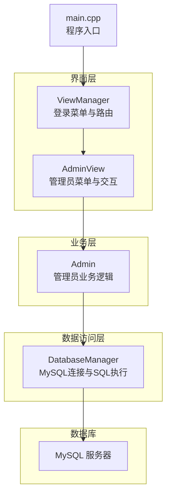
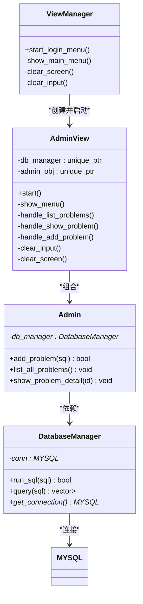
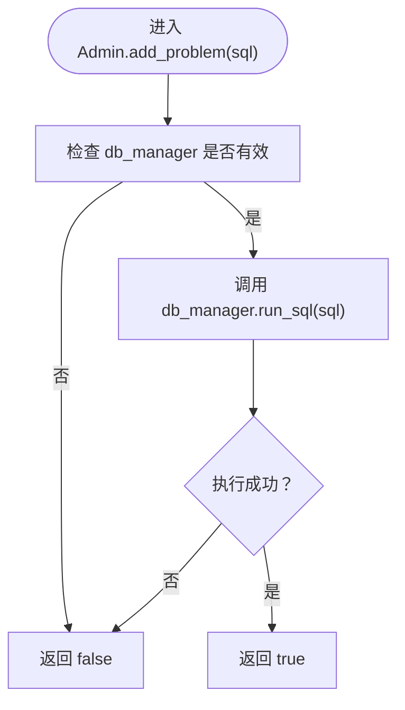
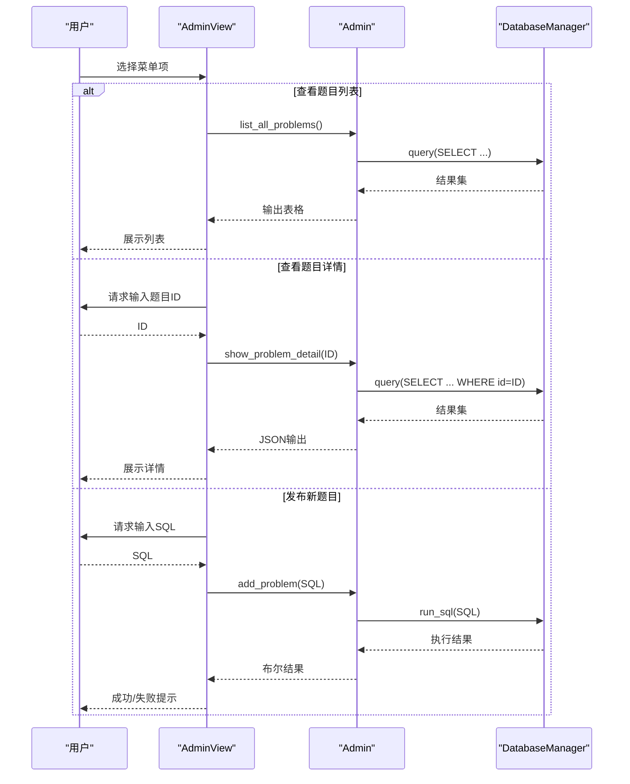
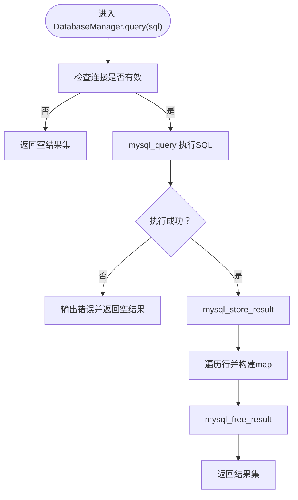
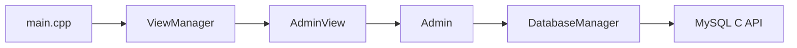
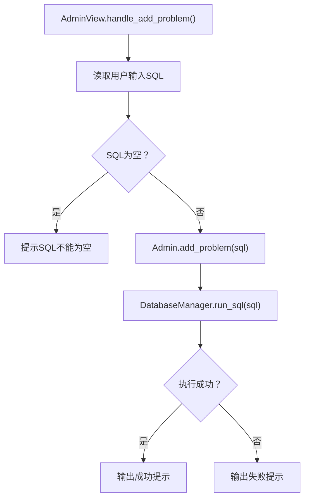

# 管理员模块

<cite>
**本文引用的文件**
- [src/admin.cpp](file://src/admin.cpp)
- [include/admin.h](file://include/admin.h)
- [src/admin_view.cpp](file://src/admin_view.cpp)
- [include/admin_view.h](file://include/admin_view.h)
- [src/db_manager.cpp](file://src/db_manager.cpp)
- [include/db_manager.h](file://include/db_manager.h)
- [src/view_manager.cpp](file://src/view_manager.cpp)
- [include/view_manager.h](file://include/view_manager.h)
- [include/color_codes.h](file://include/color_codes.h)
- [src/main.cpp](file://src/main.cpp)
- [init.sql](file://init.sql)
</cite>

## 目录
1. [简介](#简介)
2. [项目结构](#项目结构)
3. [核心组件](#核心组件)
4. [架构总览](#架构总览)
5. [详细组件分析](#详细组件分析)
6. [依赖关系分析](#依赖关系分析)
7. [性能考量](#性能考量)
8. [故障排查指南](#故障排查指南)
9. [结论](#结论)
10. [附录](#附录)

## 简介
本文件面向OJ系统的管理员模块，围绕Admin类的业务逻辑与AdminView界面层展开，系统性阐述以下能力：
- 发布题目(add_problem)的SQL执行流程
- 题目列表展示(list_all_problems)
- 题目详情查看(show_problem_detail)
- 界面层菜单设计、用户交互与错误处理
- 与DatabaseManager的协作关系
- 权限控制机制（基于数据库用户与授权策略）
- 常见问题解决方案与最佳实践

该模块采用C++实现，结合MySQL C API进行数据库访问，并通过命令行界面提供直观的操作体验。

## 项目结构
管理员模块位于src与include目录下，核心文件如下：
- 管理员业务逻辑：src/admin.cpp、include/admin.h
- 管理员界面层：src/admin_view.cpp、include/admin_view.h
- 数据库访问层：src/db_manager.cpp、include/db_manager.h
- 视图控制器：src/view_manager.cpp、include/view_manager.h
- 主入口：src/main.cpp
- 颜色常量：include/color_codes.h
- 初始化脚本：init.sql

图表来源
- [src/main.cpp:5-13](file://src/main.cpp#L5-L13)
- [src/view_manager.cpp:32-70](file://src/view_manager.cpp#L32-L70)
- [src/admin_view.cpp:21-76](file://src/admin_view.cpp#L21-L76)
- [src/admin.cpp:10-58](file://src/admin.cpp#L10-L58)
- [src/db_manager.cpp:8-99](file://src/db_manager.cpp#L8-L99)

章节来源
- [src/main.cpp:5-13](file://src/main.cpp#L5-L13)
- [src/view_manager.cpp:32-70](file://src/view_manager.cpp#L32-L70)
- [src/admin_view.cpp:21-76](file://src/admin_view.cpp#L21-L76)
- [src/admin.cpp:10-58](file://src/admin.cpp#L10-L58)
- [src/db_manager.cpp:8-99](file://src/db_manager.cpp#L8-L99)

## 核心组件
- Admin：封装管理员特有业务逻辑，依赖DatabaseManager执行SQL与查询。
- AdminView：提供管理员菜单、输入校验、错误提示与调用Admin方法。
- DatabaseManager：封装MySQL连接、查询与执行，提供统一接口。
- ViewManager：负责登录菜单与角色分发，触发AdminView启动。
- 颜色常量：提供ANSI颜色输出，增强界面可读性。

章节来源
- [include/admin.h:10-37](file://include/admin.h#L10-L37)
- [include/admin_view.h:11-55](file://include/admin_view.h#L11-L55)
- [include/db_manager.h:12-46](file://include/db_manager.h#L12-L46)
- [include/view_manager.h:11-40](file://include/view_manager.h#L11-L40)
- [include/color_codes.h:4-15](file://include/color_codes.h#L4-L15)

## 架构总览
管理员模块遵循“界面层-业务层-数据访问层”的分层设计：
- 界面层(ViewManager/AdminView)负责用户交互与流程控制
- 业务层(Admin)封装管理员操作的业务规则
- 数据访问层(DatabaseManager)屏蔽MySQL细节，提供稳定接口

图表来源
- [include/view_manager.h:11-40](file://include/view_manager.h#L11-L40)
- [include/admin_view.h:11-55](file://include/admin_view.h#L11-L55)
- [include/admin.h:10-37](file://include/admin.h#L10-L37)
- [include/db_manager.h:12-46](file://include/db_manager.h#L12-L46)

## 详细组件分析

### Admin类：管理员业务逻辑
- 构造函数：接收DatabaseManager指针，建立依赖注入
- add_problem(sql)：委托DatabaseManager执行SQL，返回布尔结果
- list_all_problems()：查询problems表的关键字段并格式化输出
- show_problem_detail(id)：按ID查询并以JSON格式美化输出

图表来源
- [src/admin.cpp:12-15](file://src/admin.cpp#L12-L15)
- [src/db_manager.cpp:21-24](file://src/db_manager.cpp#L21-L24)

章节来源
- [src/admin.cpp:10-58](file://src/admin.cpp#L10-L58)
- [include/admin.h:10-37](file://include/admin.h#L10-L37)

### AdminView：管理员界面层
- 启动流程：清屏、以管理员账号连接数据库、进入循环菜单
- 菜单设计：查看题目列表、查看题目详情、发布新题目、返回登录菜单
- 用户交互：输入校验、错误提示、清空输入缓冲区
- 错误处理：无效输入、数据库连接失败、查询无结果、SQL执行失败

图表来源
- [src/admin_view.cpp:21-76](file://src/admin_view.cpp#L21-L76)
- [src/admin_view.cpp:91-131](file://src/admin_view.cpp#L91-L131)
- [src/admin.cpp:17-58](file://src/admin.cpp#L17-L58)
- [src/db_manager.cpp:21-57](file://src/db_manager.cpp#L21-L57)

章节来源
- [src/admin_view.cpp:21-138](file://src/admin_view.cpp#L21-L138)
- [include/admin_view.h:11-55](file://include/admin_view.h#L11-L55)

### DatabaseManager：数据库访问层
- 连接管理：构造时建立连接，析构时关闭
- SQL执行：run_sql执行任意SQL并返回布尔结果
- 查询接口：query执行查询并将结果映射为列名到字符串值的map集合
- 错误处理：在关键位置输出错误信息并返回空结果或false

图表来源
- [src/db_manager.cpp:26-57](file://src/db_manager.cpp#L26-L57)

章节来源
- [src/db_manager.cpp:8-99](file://src/db_manager.cpp#L8-L99)
- [include/db_manager.h:12-46](file://include/db_manager.h#L12-L46)

### 权限控制机制
- 数据库用户分离：oj_admin（管理员全权限）、oj_user（平台用户通用账号）
- 授权策略：
  - oj_admin：对OJ.*具有SELECT/INSERT/UPDATE/DELETE权限
  - oj_user：对problems/users/submissions分别授予只读/读写/插入/查询等权限
- 应用层隔离：普通用户通过oj_user连接，应用在业务层通过WHERE条件实现行级隔离

章节来源
- [init.sql:67-94](file://init.sql#L67-L94)

## 依赖关系分析
- Admin依赖DatabaseManager（组合/依赖）
- AdminView依赖Admin与DatabaseManager（组合）
- ViewManager依赖AdminView/UserView（组合），负责角色分发
- DatabaseManager依赖MySQL C API（外部库）

图表来源
- [src/main.cpp:5-13](file://src/main.cpp#L5-L13)
- [src/view_manager.cpp:32-70](file://src/view_manager.cpp#L32-L70)
- [src/admin_view.cpp:21-76](file://src/admin_view.cpp#L21-L76)
- [src/admin.cpp:10-58](file://src/admin.cpp#L10-L58)
- [src/db_manager.cpp:8-99](file://src/db_manager.cpp#L8-L99)

章节来源
- [src/main.cpp:5-13](file://src/main.cpp#L5-L13)
- [src/view_manager.cpp:32-70](file://src/view_manager.cpp#L32-L70)
- [src/admin_view.cpp:21-76](file://src/admin_view.cpp#L21-L76)
- [src/admin.cpp:10-58](file://src/admin.cpp#L10-L58)
- [src/db_manager.cpp:8-99](file://src/db_manager.cpp#L8-L99)

## 性能考量
- 查询性能：list_all_problems仅查询必要字段，避免大文本列传输
- 结果集处理：DatabaseManager将结果映射为字符串，便于后续格式化输出
- I/O优化：界面层使用ANSI转义清屏，减少不必要的屏幕刷新
- 建议：
  - 对频繁查询的题目列表增加索引（如按ID或时间排序）
  - 控制单次查询返回的行数，避免超大数据集
  - 在AdminView中对输入进行更严格的SQL白名单校验，降低执行风险

## 故障排查指南
- 数据库连接失败
  - 现象：启动管理员模式时报错
  - 排查：确认MySQL服务运行、网络可达、凭据正确
  - 参考：[src/admin_view.cpp:27](file://src/admin_view.cpp#L27)、[src/db_manager.cpp:61-79](file://src/db_manager.cpp#L61-L79)
- 无效输入
  - 现象：菜单选择或ID输入非数字
  - 排查：使用clear_input清理缓冲区，确保输入类型正确
  - 参考：[src/admin_view.cpp:40-46](file://src/admin_view.cpp#L40-L46)、[src/admin_view.cpp:102-107](file://src/admin_view.cpp#L102-L107)
- 查询无结果
  - 现象：查看题目详情时提示未找到
  - 排查：确认ID是否存在，核对problems表
  - 参考：[src/admin.cpp:49-52](file://src/admin.cpp#L49-L52)
- SQL执行失败
  - 现象：发布题目失败
  - 排查：检查SQL语法、权限、表结构；查看错误输出
  - 参考：[src/db_manager.cpp:81-99](file://src/db_manager.cpp#L81-L99)

章节来源
- [src/admin_view.cpp:27-76](file://src/admin_view.cpp#L27-L76)
- [src/admin.cpp:49-52](file://src/admin.cpp#L49-L52)
- [src/db_manager.cpp:81-99](file://src/db_manager.cpp#L81-L99)

## 结论
管理员模块通过清晰的分层设计实现了稳定的题目管理能力：
- Admin聚焦业务规则，AdminView专注用户交互，DatabaseManager抽象底层细节
- 权限模型与应用层隔离共同保障了系统安全
- 建议在生产环境中进一步强化SQL输入校验与审计日志，提升安全性与可观测性

## 附录

### 管理员操作示例（命令行）
- 启动系统并进入管理员模式
  - 步骤：运行程序 → 选择“管理员进入” → 进入管理员面板
  - 参考：[src/main.cpp:5-13](file://src/main.cpp#L5-L13)、[src/view_manager.cpp:52-56](file://src/view_manager.cpp#L52-L56)
- 查看所有题目列表
  - 步骤：在管理员面板选择“查看所有题目列表”
  - 参考：[src/admin_view.cpp:91-95](file://src/admin_view.cpp#L91-L95)、[src/admin.cpp:17-41](file://src/admin.cpp#L17-L41)
- 查看题目详情
  - 步骤：在管理员面板选择“查看题目详细信息”，输入题目ID
  - 参考：[src/admin_view.cpp:97-110](file://src/admin_view.cpp#L97-L110)、[src/admin.cpp:43-58](file://src/admin.cpp#L43-L58)
- 发布新题目
  - 步骤：在管理员面板选择“发布新题目”，输入完整SQL
  - 参考：[src/admin_view.cpp:112-131](file://src/admin_view.cpp#L112-L131)、[src/admin.cpp:12-15](file://src/admin.cpp#L12-L15)

### 关键流程图：发布题目SQL执行

图表来源
- [src/admin_view.cpp:112-131](file://src/admin_view.cpp#L112-L131)
- [src/admin.cpp:12-15](file://src/admin.cpp#L12-L15)
- [src/db_manager.cpp:21-24](file://src/db_manager.cpp#L21-L24)