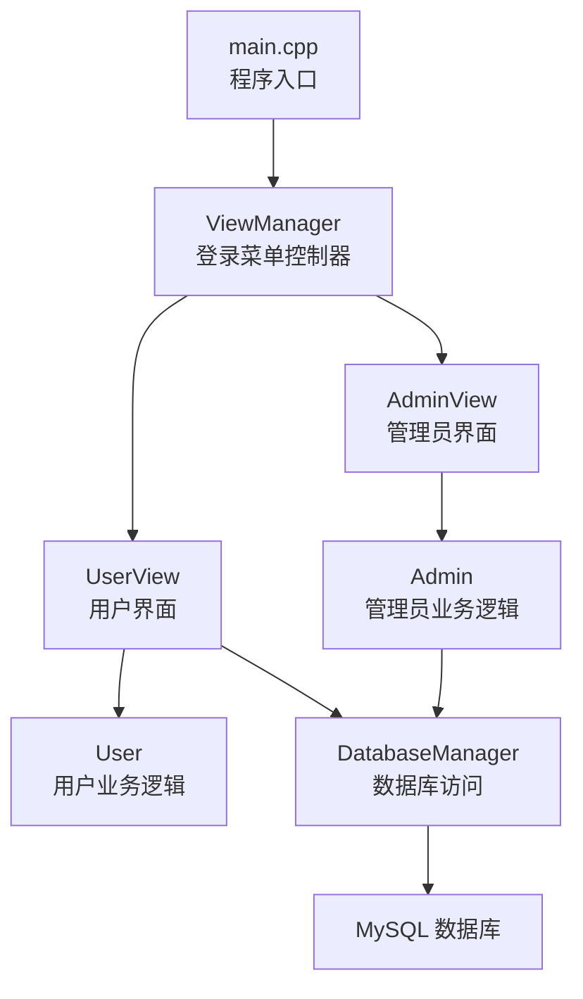
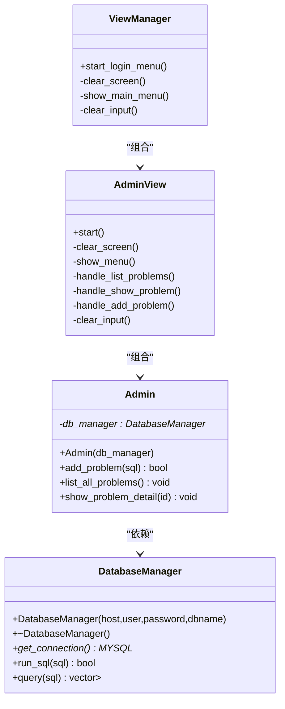
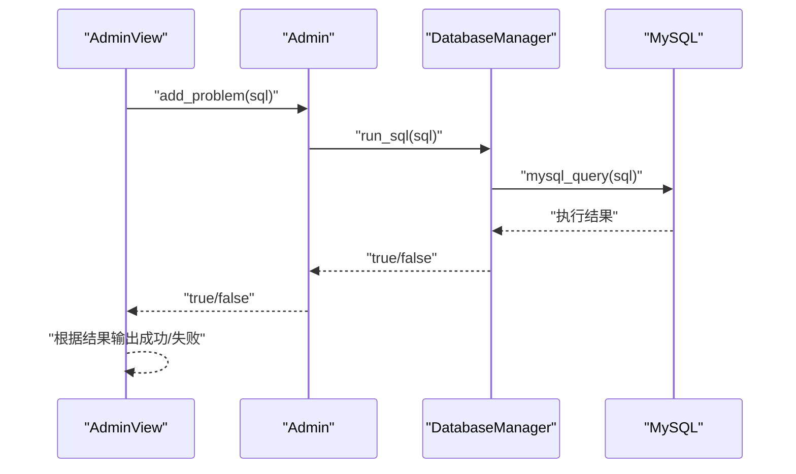
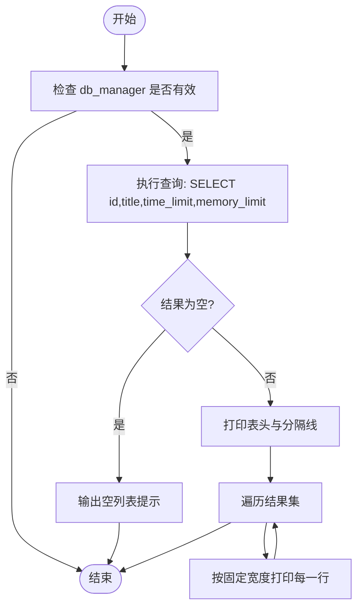
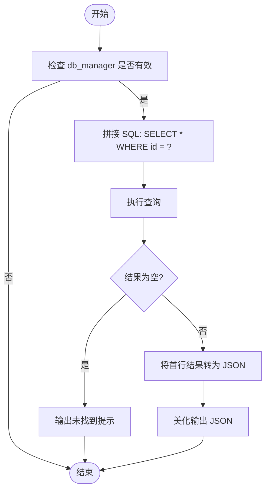
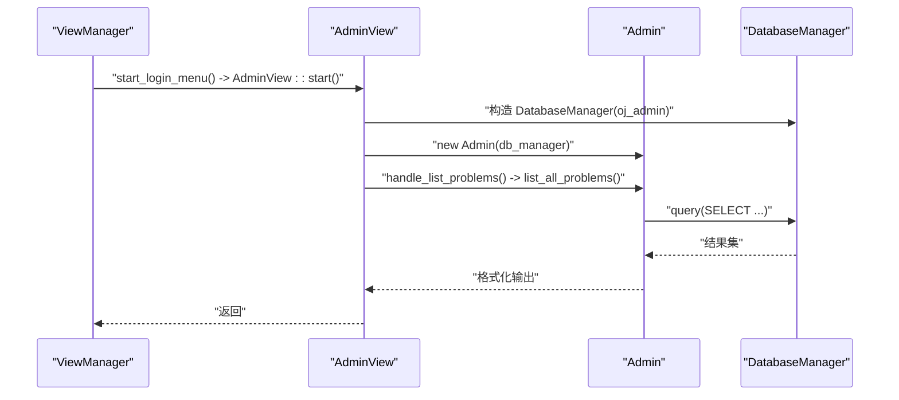
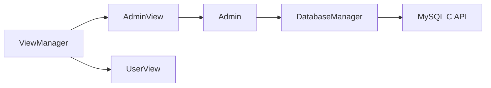

# 管理员模块

<cite>
**本文引用的文件**
- [src/admin.cpp](file://src/admin.cpp)
- [include/admin.h](file://include/admin.h)
- [src/db_manager.cpp](file://src/db_manager.cpp)
- [include/db_manager.h](file://include/db_manager.h)
- [src/admin_view.cpp](file://src/admin_view.cpp)
- [include/admin_view.h](file://include/admin_view.h)
- [src/view_manager.cpp](file://src/view_manager.cpp)
- [include/view_manager.h](file://include/view_manager.h)
- [src/main.cpp](file://src/main.cpp)
- [init.sql](file://init.sql)
- [include/color_codes.h](file://include/color_codes.h)
- [src/user_view.cpp](file://src/user_view.cpp)
- [include/user_view.h](file://include/user_view.h)
</cite>

## 目录
1. [简介](#简介)
2. [项目结构](#项目结构)
3. [核心组件](#核心组件)
4. [架构总览](#架构总览)
5. [详细组件分析](#详细组件分析)
6. [依赖关系分析](#依赖关系分析)
7. [性能考虑](#性能考虑)
8. [故障排查指南](#故障排查指南)
9. [结论](#结论)
10. [附录](#附录)

## 简介
本文件面向开发者，系统性解析管理员模块的设计与实现，重点覆盖以下方面：
- Admin 类的构造与职责边界、与数据库管理器的耦合关系
- add_problem 方法的 SQL 执行流程与安全风险点
- list_all_problems 的题目列表展示逻辑与格式化输出
- show_problem_detail 的题目详情查询与 JSON 序列化输出
- 管理员权限控制机制（基于数据库用户与权限授权）
- SQL 注入防护现状与改进建议
- 错误处理与异常管理策略
- 与其他模块的接口交互关系（AdminView、ViewManager、DatabaseManager）

## 项目结构
管理员模块位于命令行交互式 OJ 系统中，采用分层架构：
- 视图层：AdminView、UserView、ViewManager 负责用户交互与菜单驱动
- 业务层：Admin 负责管理员特有业务逻辑
- 数据访问层：DatabaseManager 封装 MySQL 连接与 SQL 执行
- 入口：main.cpp 启动 ViewManager，引导用户进入管理员或用户模式

图表来源
- [src/main.cpp:5-12](file://src/main.cpp#L5-L12)
- [src/view_manager.cpp:32-70](file://src/view_manager.cpp#L32-L70)
- [src/admin_view.cpp:21-76](file://src/admin_view.cpp#L21-L76)
- [src/user_view.cpp:36-131](file://src/user_view.cpp#L36-L131)
- [include/admin.h:10-36](file://include/admin.h#L10-L36)
- [include/db_manager.h:12-46](file://include/db_manager.h#L12-L46)

章节来源
- [src/main.cpp:1-14](file://src/main.cpp#L1-L14)
- [src/view_manager.cpp:1-77](file://src/view_manager.cpp#L1-L77)
- [src/admin_view.cpp:1-138](file://src/admin_view.cpp#L1-L138)
- [src/user_view.cpp:1-395](file://src/user_view.cpp#L1-L395)
- [include/admin.h:1-40](file://include/admin.h#L1-L40)
- [include/db_manager.h:1-53](file://include/db_manager.h#L1-L53)

## 核心组件
- Admin：封装管理员特有业务，包括发布题目、列出题目、查看题目详情
- DatabaseManager：封装 MySQL 连接、SQL 执行与查询结果集解析
- AdminView：管理员交互界面，负责菜单展示与输入校验
- ViewManager：系统入口与角色选择，协调管理员/用户模式切换

章节来源
- [include/admin.h:10-36](file://include/admin.h#L10-L36)
- [include/db_manager.h:12-46](file://include/db_manager.h#L12-L46)
- [include/admin_view.h:11-55](file://include/admin_view.h#L11-L55)
- [include/view_manager.h:11-40](file://include/view_manager.h#L11-L40)

## 架构总览
管理员模块遵循“视图-业务-数据访问”的分层设计：
- 视图层负责用户交互与输入校验
- 业务层负责领域逻辑与调用数据访问层
- 数据访问层负责与数据库交互，屏蔽底层细节

图表来源
- [include/admin_view.h:11-55](file://include/admin_view.h#L11-L55)
- [include/admin.h:10-36](file://include/admin.h#L10-L36)
- [include/db_manager.h:12-46](file://include/db_manager.h#L12-L46)
- [include/view_manager.h:11-40](file://include/view_manager.h#L11-L40)

## 详细组件分析

### Admin 类设计与业务逻辑
- 构造函数：接收 DatabaseManager 指针，建立弱耦合依赖，便于单元测试替换
- add_problem：直接委托 DatabaseManager::run_sql 执行 SQL，返回布尔结果
- list_all_problems：构建固定字段查询，格式化输出表格样式
- show_problem_detail：拼接 WHERE 条件查询，将首行结果转为 JSON 输出

图表来源
- [src/admin_view.cpp:112-131](file://src/admin_view.cpp#L112-L131)
- [src/admin.cpp:12-15](file://src/admin.cpp#L12-L15)
- [src/db_manager.cpp:21-24](file://src/db_manager.cpp#L21-L24)
- [src/db_manager.cpp:81-99](file://src/db_manager.cpp#L81-L99)

章节来源
- [include/admin.h:10-36](file://include/admin.h#L10-L36)
- [src/admin.cpp:10-58](file://src/admin.cpp#L10-L58)

### list_all_problems 列表展示逻辑
- 查询固定字段：id、title、time_limit、memory_limit
- 格式化输出：使用固定宽度列对齐，打印表头与分隔线
- 空结果处理：输出提示信息

图表来源
- [src/admin.cpp:17-41](file://src/admin.cpp#L17-L41)

章节来源
- [src/admin.cpp:17-41](file://src/admin.cpp#L17-L41)

### show_problem_detail 详情查询实现
- 拼接 WHERE 条件查询题目详情
- 空结果处理：输出未找到提示
- 使用 JSON 序列化输出，美化缩进

图表来源
- [src/admin.cpp:43-58](file://src/admin.cpp#L43-L58)

章节来源
- [src/admin.cpp:43-58](file://src/admin.cpp#L43-L58)

### 管理员权限控制机制
- 数据库用户分离：oj_admin（管理员全权限）、oj_user（受限权限）
- 权限授予：管理员对 OJ.* 具有 SELECT/INSERT/UPDATE/DELETE 权限
- 连接策略：AdminView 在启动时使用管理员账号建立连接，确保具备发布题目的能力
- 行级隔离：用户模式通过 WHERE 条件限制可见范围，配合数据库用户权限实现基本隔离

章节来源
- [src/admin_view.cpp:26-32](file://src/admin_view.cpp#L26-L32)
- [init.sql:70-95](file://init.sql#L70-L95)

### SQL 注入防护措施与建议
- 当前实现：
  - add_problem 直接透传 SQL 字符串，存在注入风险
  - list_all_problems 固定查询字段，无参数化风险
  - show_problem_detail 拼接 WHERE 条件，存在注入风险
- 改进建议：
  - 对所有用户输入的 SQL 片段进行白名单校验或参数化
  - 引入 SQL 解析器，仅允许受控的 DML/DQL 操作
  - 对 show_problem_detail 的 id 参数进行数值校验与范围检查

章节来源
- [src/admin.cpp:12-15](file://src/admin.cpp#L12-L15)
- [src/admin.cpp:46](file://src/admin.cpp#L46)
- [src/admin_view.cpp:112-131](file://src/admin_view.cpp#L112-L131)

### 错误处理与异常管理
- 空指针保护：各方法均检查 db_manager 是否有效
- 数据库错误：DatabaseManager 在查询/执行失败时输出错误信息并返回空结果或 false
- 输入校验：AdminView 对菜单选择、题目 ID、SQL 输入进行基本校验
- 流程控制：遇到无效输入时清理输入缓冲区并提示重试

章节来源
- [src/admin.cpp:13-14](file://src/admin.cpp#L13-L14)
- [src/admin.cpp:22-25](file://src/admin.cpp#L22-L25)
- [src/admin.cpp:49-51](file://src/admin.cpp#L49-L51)
- [src/db_manager.cpp:32-36](file://src/db_manager.cpp#L32-L36)
- [src/db_manager.cpp:86-90](file://src/db_manager.cpp#L86-L90)
- [src/admin_view.cpp:40-46](file://src/admin_view.cpp#L40-L46)
- [src/admin_view.cpp:102-108](file://src/admin_view.cpp#L102-L108)
- [src/admin_view.cpp:119-122](file://src/admin_view.cpp#L119-L122)

### 与其他模块的接口交互关系
- AdminView 与 Admin：AdminView 负责输入与展示，Admin 负责业务逻辑
- Admin 与 DatabaseManager：Admin 通过 DatabaseManager 执行 SQL 与查询
- ViewManager 与 AdminView/UserView：统一调度管理员/用户模式
- 颜色输出：Color 命名空间提供 ANSI 颜色常量，用于美化界面

图表来源
- [src/view_manager.cpp:32-70](file://src/view_manager.cpp#L32-L70)
- [src/admin_view.cpp:21-76](file://src/admin_view.cpp#L21-L76)
- [src/admin.cpp:17-41](file://src/admin.cpp#L17-L41)
- [src/db_manager.cpp:26-57](file://src/db_manager.cpp#L26-L57)

章节来源
- [include/admin_view.h:23-24](file://include/admin_view.h#L23-L24)
- [include/admin.h:36](file://include/admin.h#L36)
- [include/db_manager.h:45](file://include/db_manager.h#L45)
- [include/color_codes.h:5-15](file://include/color_codes.h#L5-L15)

## 依赖关系分析
- Admin 依赖 DatabaseManager（弱依赖，通过指针传递）
- AdminView 依赖 Admin 与 DatabaseManager（组合关系）
- ViewManager 依赖 AdminView 与 UserView（组合关系）
- DatabaseManager 依赖 MySQL C API（底层连接与查询）

图表来源
- [include/admin_view.h:23-24](file://include/admin_view.h#L23-L24)
- [include/admin.h:36](file://include/admin.h#L36)
- [include/db_manager.h:45](file://include/db_manager.h#L45)
- [include/view_manager.h:23-24](file://include/view_manager.h#L23-L24)

章节来源
- [include/admin.h:36](file://include/admin.h#L36)
- [include/db_manager.h:45](file://include/db_manager.h#L45)
- [include/admin_view.h:23-24](file://include/admin_view.h#L23-L24)
- [include/view_manager.h:23-24](file://include/view_manager.h#L23-L24)

## 性能考虑
- 查询性能：list_all_problems 仅查询少量必要字段，避免大文本列传输
- 结果集处理：DatabaseManager 使用 mysql_store_result 一次性获取结果，适合中小规模数据
- I/O 优化：AdminView 使用 ANSI 清屏与格式化输出，减少不必要的刷新
- 建议：对于大规模题目列表，可引入分页查询与缓存策略

## 故障排查指南
- 数据库连接失败
  - 检查管理员账号与密码配置
  - 确认 MySQL 服务运行与网络可达
- SQL 执行失败
  - 查看错误输出中的具体错误信息
  - 确认 SQL 语法与权限
- 输入异常
  - 清理输入缓冲区后重新输入
  - 确认菜单选项与数据类型

章节来源
- [src/admin_view.cpp:72-75](file://src/admin_view.cpp#L72-L75)
- [src/db_manager.cpp:34](file://src/db_manager.cpp#L34)
- [src/db_manager.cpp:88](file://src/db_manager.cpp#L88)
- [src/admin_view.cpp:40-46](file://src/admin_view.cpp#L40-L46)
- [src/admin_view.cpp:102-108](file://src/admin_view.cpp#L102-L108)

## 结论
管理员模块通过清晰的分层设计实现了题目发布、列表展示与详情查看等核心功能。其优点在于职责明确、依赖可控；同时存在 SQL 注入风险与输入校验不足等问题。建议优先引入参数化与白名单校验，完善输入验证与错误恢复机制，以提升安全性与稳定性。

## 附录

### 管理员操作流程示例（路径指引）
- 题目发布
  - 路径：[src/admin_view.cpp:112-131](file://src/admin_view.cpp#L112-L131)
  - 关键步骤：输入 SQL -> 调用 Admin::add_problem -> DatabaseManager::run_sql
- 题目列表管理
  - 路径：[src/admin_view.cpp:91-95](file://src/admin_view.cpp#L91-L95) -> [src/admin.cpp:17-41](file://src/admin.cpp#L17-L41)
  - 关键步骤：AdminView 调用 Admin::list_all_problems -> DatabaseManager::query
- 题目详情查看
  - 路径：[src/admin_view.cpp:97-110](file://src/admin_view.cpp#L97-L110) -> [src/admin.cpp:43-58](file://src/admin.cpp#L43-L58)
  - 关键步骤：输入 ID -> Admin::show_problem_detail -> DatabaseManager::query -> JSON 输出

章节来源
- [src/admin_view.cpp:91-131](file://src/admin_view.cpp#L91-L131)
- [src/admin.cpp:17-58](file://src/admin.cpp#L17-L58)