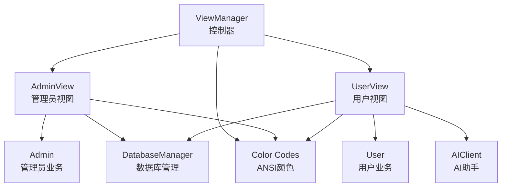
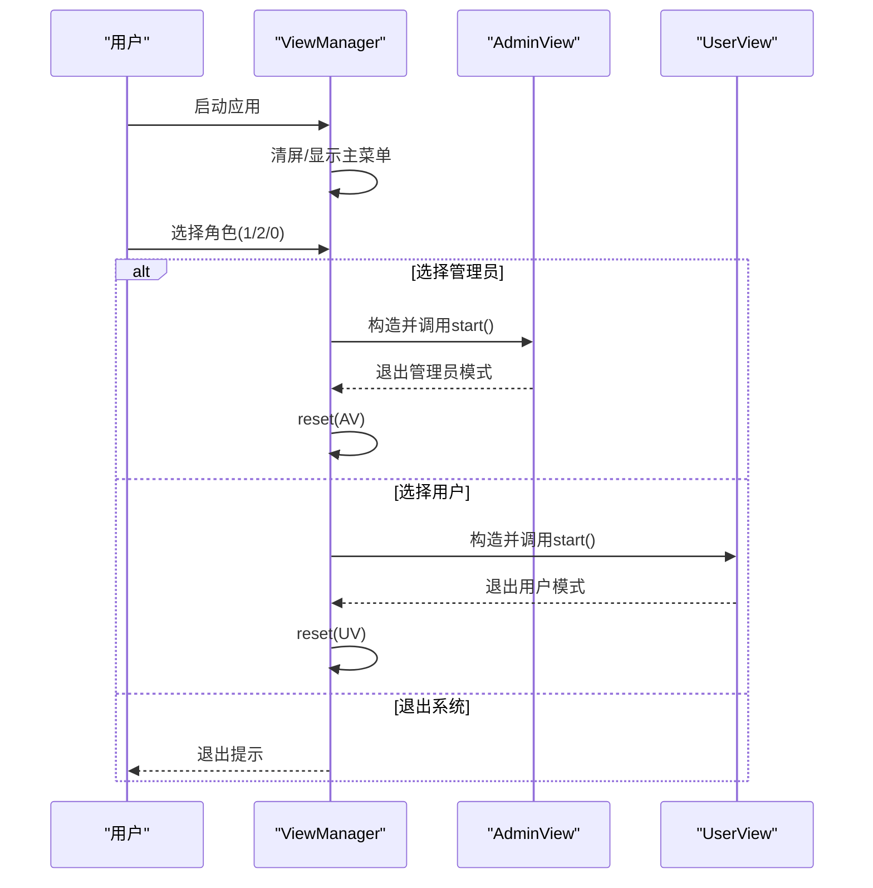
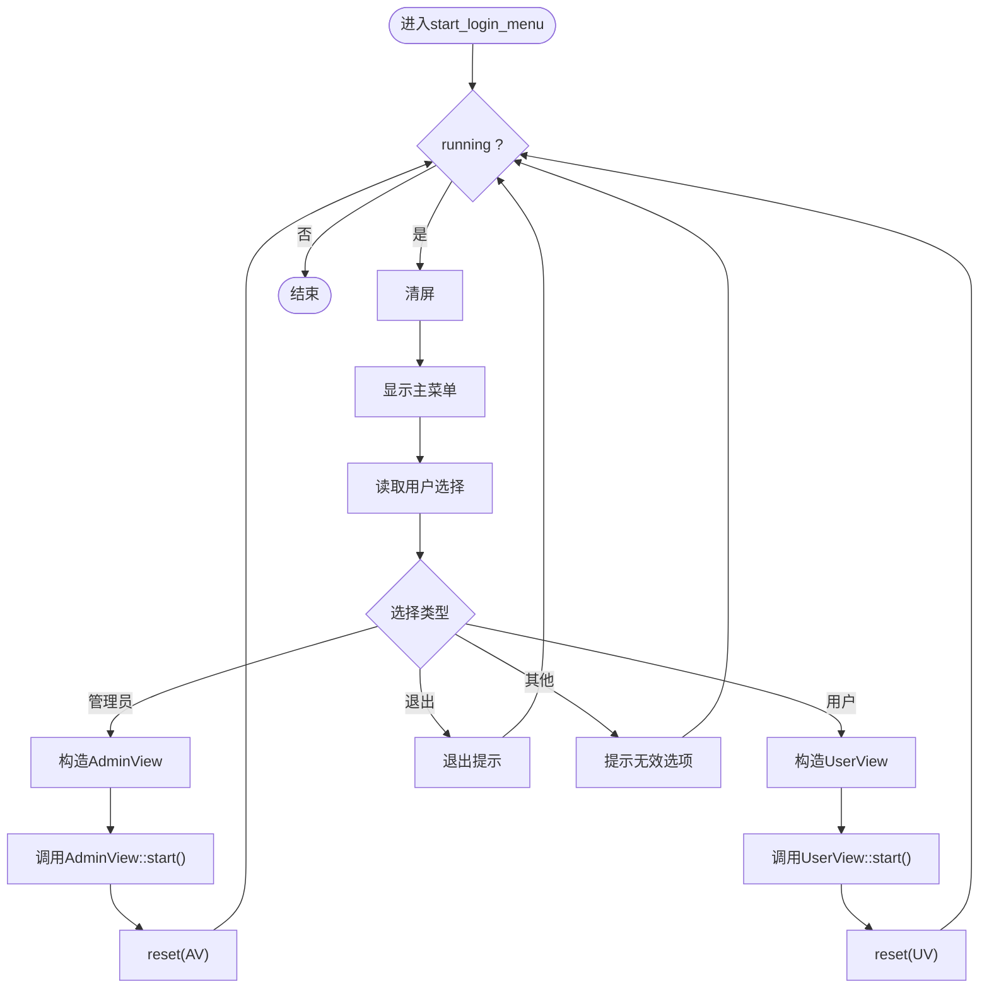
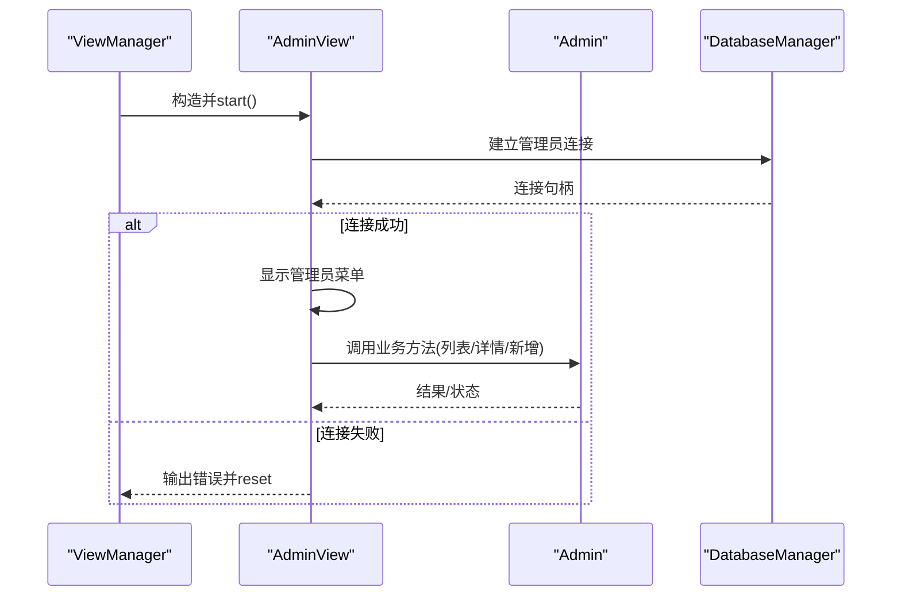
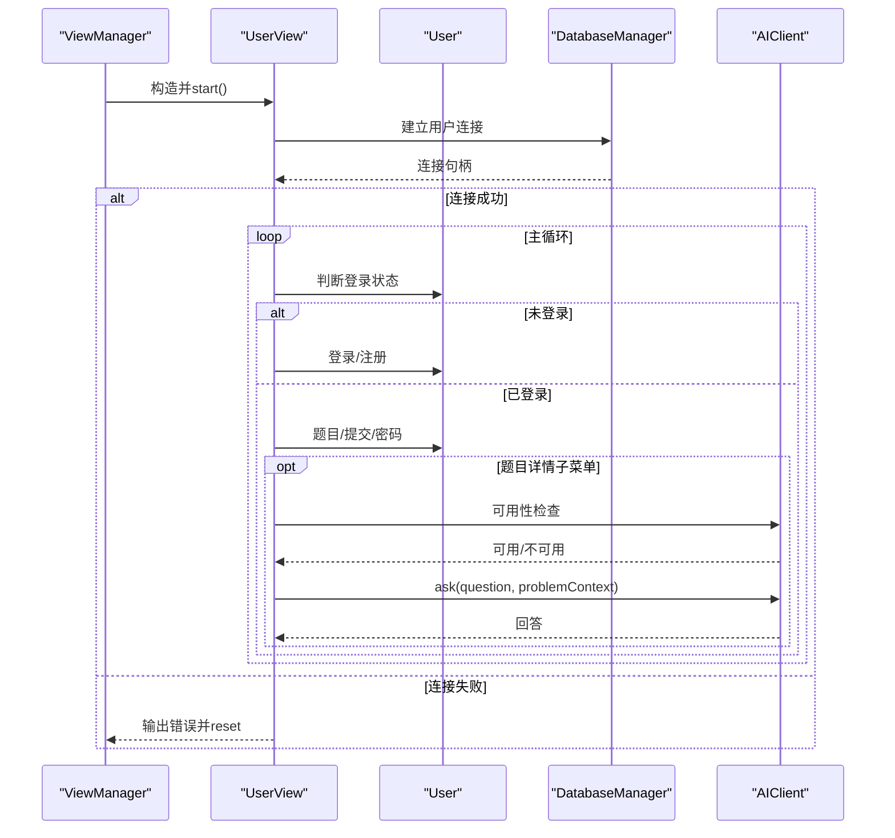
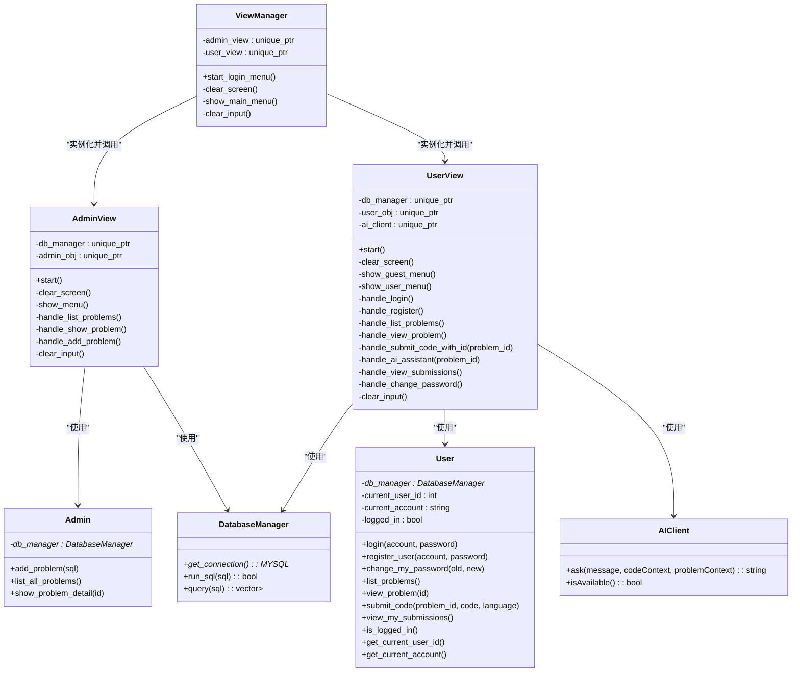
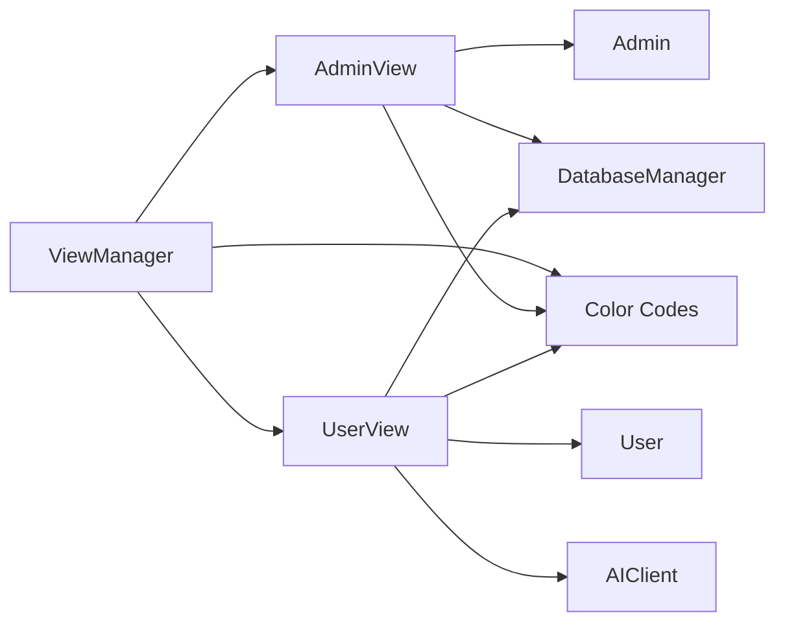

# 视图管理层

<cite>
**本文引用的文件**
- [view_manager.h](file://include/view_manager.h)
- [view_manager.cpp](file://src/view_manager.cpp)
- [admin_view.h](file://include/admin_view.h)
- [admin_view.cpp](file://src/admin_view.cpp)
- [user_view.h](file://include/user_view.h)
- [user_view.cpp](file://src/user_view.cpp)
- [admin.h](file://include/admin.h)
- [user.h](file://include/user.h)
- [db_manager.h](file://include/db_manager.h)
- [ai_client.h](file://include/ai_client.h)
- [color_codes.h](file://include/color_codes.h)
- [main.cpp](file://src/main.cpp)
</cite>

## 目录
1. [简介](#简介)
2. [项目结构](#项目结构)
3. [核心组件](#核心组件)
4. [架构总览](#架构总览)
5. [详细组件分析](#详细组件分析)
6. [依赖分析](#依赖分析)
7. [性能考虑](#性能考虑)
8. [故障排查指南](#故障排查指南)
9. [结论](#结论)
10. [附录](#附录)

## 简介
本文件面向OJ系统的“视图管理层”，聚焦于ViewManager控制器的设计与实现，阐述其在管理员与用户两种角色之间的界面调度机制、菜单系统与输入分发流程，并解释与AdminView、UserView的协作关系及模块解耦策略。文档同时提供调试技巧与扩展建议，帮助开发者快速理解并维护该层逻辑。

## 项目结构
视图管理层位于include与src目录下，采用“控制器+视图”的分层设计：
- 控制器：ViewManager负责启动登录菜单、角色选择与视图实例化
- 视图：AdminView与UserView分别承载管理员与用户界面逻辑
- 支撑：DatabaseManager、Admin、User、AIClient、颜色常量等

图表来源
- [view_manager.h:11-40](file://include/view_manager.h#L11-L40)
- [admin_view.h:11-55](file://include/admin_view.h#L11-L55)
- [user_view.h:12-89](file://include/user_view.h#L12-L89)
- [admin.h:10-37](file://include/admin.h#L10-L37)
- [user.h:10-86](file://include/user.h#L10-L86)
- [db_manager.h:12-46](file://include/db_manager.h#L12-L46)
- [ai_client.h:6-25](file://include/ai_client.h#L6-L25)
- [color_codes.h:5-15](file://include/color_codes.h#L5-L15)

章节来源
- [main.cpp:5-12](file://src/main.cpp#L5-L12)
- [view_manager.h:11-40](file://include/view_manager.h#L11-L40)
- [view_manager.cpp:32-70](file://src/view_manager.cpp#L32-L70)

## 核心组件
- ViewManager：命令行界面主控制器，负责登录菜单、角色选择、清屏与输入清理；根据用户选择实例化AdminView或UserView并调用其start方法，结束后重置指针，确保生命周期与作用域隔离。
- AdminView：管理员模式视图，负责管理员菜单、题目列表、题目详情、新增题目等；内部持有DatabaseManager与Admin对象，建立数据库连接后进入循环菜单。
- UserView：用户模式视图，支持游客态与登录态两套菜单；提供登录、注册、查看题目、提交代码、查看提交记录、修改密码等功能；集成AIClient用于AI辅助。
- Admin/User：业务逻辑封装，与DatabaseManager交互完成数据操作。
- DatabaseManager：数据库连接与SQL执行封装。
- AIClient：AI助手客户端，提供问答能力。
- Color Codes：ANSI颜色常量，统一控制台输出样式。

章节来源
- [view_manager.h:11-40](file://include/view_manager.h#L11-L40)
- [view_manager.cpp:14-76](file://src/view_manager.cpp#L14-L76)
- [admin_view.h:11-55](file://include/admin_view.h#L11-L55)
- [admin_view.cpp:21-76](file://src/admin_view.cpp#L21-L76)
- [user_view.h:12-89](file://include/user_view.h#L12-L89)
- [user_view.cpp:21-116](file://src/user_view.cpp#L21-L116)
- [admin.h:10-37](file://include/admin.h#L10-L37)
- [user.h:10-86](file://include/user.h#L10-L86)
- [db_manager.h:12-46](file://include/db_manager.h#L12-L46)
- [ai_client.h:6-25](file://include/ai_client.h#L6-L25)
- [color_codes.h:5-15](file://include/color_codes.h#L5-L15)

## 架构总览
ViewManager作为入口控制器，承担以下职责：
- 启动登录菜单并接收用户输入
- 分发到AdminView或UserView
- 统一清屏与输入缓冲区清理
- 保证视图生命周期隔离（每次进入时构造，退出时reset）

图表来源
- [view_manager.cpp:32-70](file://src/view_manager.cpp#L32-L70)
- [admin_view.cpp:21-76](file://src/admin_view.cpp#L21-L76)
- [user_view.cpp:21-116](file://src/user_view.cpp#L21-L116)

## 详细组件分析

### ViewManager 控制器
- 设计要点
  - 单例风格的无状态控制器：仅在start_login_menu期间活跃，避免跨会话状态污染
  - 角色切换：通过唯一指针持有AdminView/UserView，确保每次只存在一个活动视图
  - 输入健壮性：统一的输入流清理与错误提示，防止格式错误导致的死循环
  - 清屏与样式：使用ANSI转义序列清屏并配合颜色常量美化输出
- 关键流程
  - 清屏与菜单展示
  - 接收并校验用户输入
  - 分发到对应视图的start方法
  - 异常分支：非法输入、默认分支提示
- 与AdminView/UserView的协作
  - 通过构造函数注入视图实例，调用其start后立即reset，实现解耦与资源回收

图表来源
- [view_manager.cpp:32-70](file://src/view_manager.cpp#L32-L70)

章节来源
- [view_manager.h:11-40](file://include/view_manager.h#L11-L40)
- [view_manager.cpp:14-76](file://src/view_manager.cpp#L14-L76)

### AdminView 管理员视图
- 设计要点
  - 专用数据库连接参数，限定管理员权限
  - 循环菜单驱动，支持题目列表、详情查看、新增题目
  - 输入校验与错误提示，防止非法ID与空SQL
- 关键流程
  - 连接数据库成功后进入管理员菜单
  - 读取并分发管理员操作
  - 子功能调用Admin业务对象
- 与Admin的协作
  - AdminView持有Admin对象，Admin封装数据库操作细节

图表来源
- [admin_view.cpp:21-76](file://src/admin_view.cpp#L21-L76)
- [admin.h:10-37](file://include/admin.h#L10-L37)
- [db_manager.h:12-46](file://include/db_manager.h#L12-L46)

章节来源
- [admin_view.h:11-55](file://include/admin_view.h#L11-L55)
- [admin_view.cpp:21-131](file://src/admin_view.cpp#L21-L131)
- [admin.h:10-37](file://include/admin.h#L10-L37)

### UserView 用户视图
- 设计要点
  - 双态菜单：未登录态（登录/注册）与登录态（题目/提交/密码）
  - 题目详情子菜单：提交代码、AI助手
  - AI集成：AIClient可用性检查与问答流程
  - 输入健壮性：多处输入校验与返回逻辑
- 关键流程
  - 连接数据库后判断登录状态
  - 未登录：登录/注册；登录成功后清屏
  - 登录态：题目浏览、提交、查看提交记录、修改密码
  - 题目详情：提交代码、调用AI助手

图表来源
- [user_view.cpp:21-311](file://src/user_view.cpp#L21-L311)
- [user.h:10-86](file://include/user.h#L10-L86)
- [ai_client.h:6-25](file://include/ai_client.h#L6-L25)
- [db_manager.h:12-46](file://include/db_manager.h#L12-L46)

章节来源
- [user_view.h:12-89](file://include/user_view.h#L12-L89)
- [user_view.cpp:21-351](file://src/user_view.cpp#L21-L351)
- [user.h:10-86](file://include/user.h#L10-L86)
- [ai_client.h:6-25](file://include/ai_client.h#L6-L25)

### 类关系图

图表来源
- [view_manager.h:11-40](file://include/view_manager.h#L11-L40)
- [admin_view.h:11-55](file://include/admin_view.h#L11-L55)
- [user_view.h:12-89](file://include/user_view.h#L12-L89)
- [admin.h:10-37](file://include/admin.h#L10-L37)
- [user.h:10-86](file://include/user.h#L10-L86)
- [db_manager.h:12-46](file://include/db_manager.h#L12-L46)
- [ai_client.h:6-25](file://include/ai_client.h#L6-L25)

## 依赖分析
- ViewManager依赖AdminView与UserView，二者均依赖DatabaseManager与各自业务类（Admin/User），UserView还依赖AIClient
- 颜色常量集中定义，被各视图共享，便于统一风格
- 数据库连接参数在AdminView与UserView内硬编码，建议后续抽象为配置或参数注入，提升可测试性与可维护性

图表来源
- [view_manager.h:4-6](file://include/view_manager.h#L4-L6)
- [admin_view.h:4-6](file://include/admin_view.h#L4-L6)
- [user_view.h:4-7](file://include/user_view.h#L4-L7)
- [color_codes.h:5-15](file://include/color_codes.h#L5-L15)

章节来源
- [view_manager.h:4-6](file://include/view_manager.h#L4-L6)
- [admin_view.h:4-6](file://include/admin_view.h#L4-L6)
- [user_view.h:4-7](file://include/user_view.h#L4-L7)
- [color_codes.h:5-15](file://include/color_codes.h#L5-L15)

## 性能考虑
- I/O与清屏：频繁清屏与颜色输出可能影响终端渲染性能，建议在高频刷新场景减少清屏次数，或采用增量更新策略
- 输入缓冲区清理：统一的输入清理逻辑有效避免阻塞，但需注意在长文本输入时的性能开销
- 数据库连接：AdminView与UserView分别建立连接，建议在业务层引入连接池或复用策略，降低连接成本
- AI调用：AIClient封装了外部脚本调用，建议增加超时与重试机制，避免阻塞UI线程

## 故障排查指南
- 输入异常
  - 现象：输入非数字导致循环卡死
  - 处理：使用统一的输入清理函数，确保cin状态恢复与缓冲区清空
  - 参考路径：[view_manager.cpp:72-76](file://src/view_manager.cpp#L72-L76)、[admin_view.cpp:133-137](file://src/admin_view.cpp#L133-L137)、[user_view.cpp:347-351](file://src/user_view.cpp#L347-L351)
- 数据库连接失败
  - 现象：管理员/用户连接失败
  - 处理：检查主机、用户名、密码、数据库名配置；确认MySQL服务运行
  - 参考路径：[admin_view.cpp:27-32](file://src/admin_view.cpp#L27-L32)、[user_view.cpp:27-33](file://src/user_view.cpp#L27-L33)
- AI服务不可用
  - 现象：AI助手无法使用
  - 处理：检查AIClient可用性与脚本路径配置；确认Python环境与依赖
  - 参考路径：[user_view.cpp:280-286](file://src/user_view.cpp#L280-L286)
- 角色切换异常
  - 现象：退出角色后再次进入出现状态残留
  - 处理：确保每次退出时reset视图指针，避免悬挂引用
  - 参考路径：[view_manager.cpp:55-61](file://src/view_manager.cpp#L55-L61)

章节来源
- [view_manager.cpp:72-76](file://src/view_manager.cpp#L72-L76)
- [admin_view.cpp:27-32](file://src/admin_view.cpp#L27-L32)
- [user_view.cpp:27-33](file://src/user_view.cpp#L27-L33)
- [user_view.cpp:280-286](file://src/user_view.cpp#L280-L286)
- [view_manager.cpp:55-61](file://src/view_manager.cpp#L55-L61)

## 结论
ViewManager通过清晰的角色分发与视图生命周期管理，实现了管理员与用户两种界面模式的统一入口与解耦协作。AdminView与UserView分别封装各自的业务流程与输入校验，配合DatabaseManager与AIClient形成稳定的支撑层。未来可在配置注入、连接池、AI超时与重试等方面进一步优化，以提升可维护性与用户体验。

## 附录
- 入口程序：应用从main开始，初始化ViewManager并启动登录菜单
  - 参考路径：[main.cpp:5-12](file://src/main.cpp#L5-L12)
- 颜色常量：ANSI颜色常量集中定义，便于统一风格
  - 参考路径：[color_codes.h:5-15](file://include/color_codes.h#L5-L15)