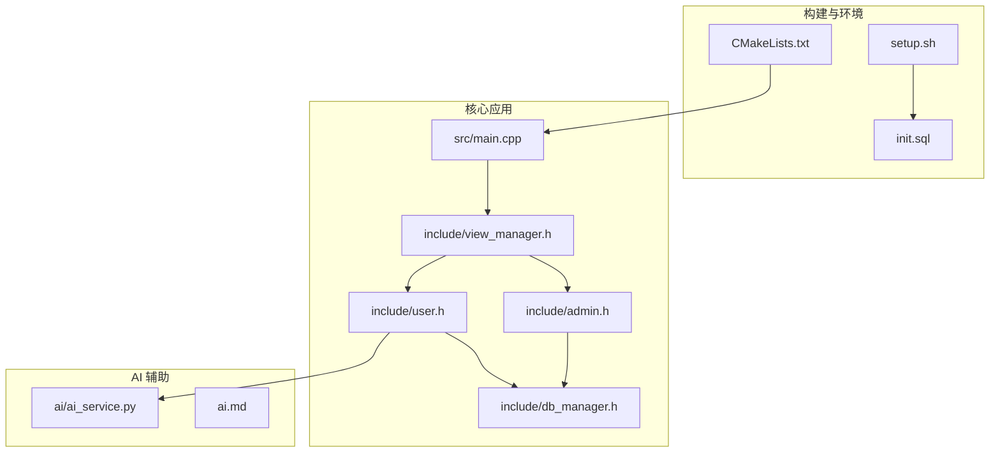
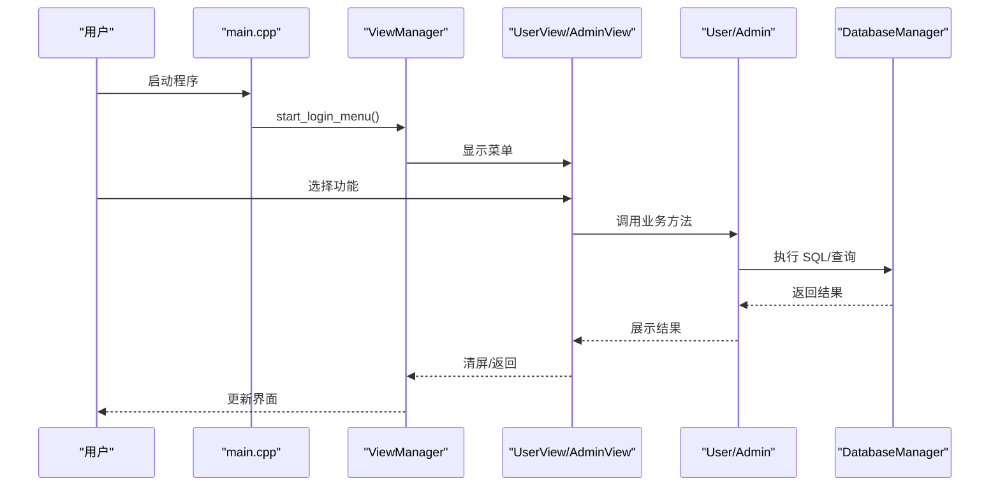
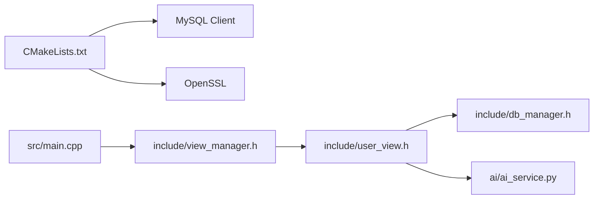

# 版本历史

<cite>
**本文引用的文件**
- [History/OJ_v0.1.md](file://History/OJ_v0.1.md)
- [History/OJ_v0.2.md](file://History/OJ_v0.2.md)
- [CMakeLists.txt](file://CMakeLists.txt)
- [README.md](file://README.md)
- [init.sql](file://init.sql)
- [setup.sh](file://setup.sh)
- [src/main.cpp](file://src/main.cpp)
- [include/admin.h](file://include/admin.h)
- [include/user.h](file://include/user.h)
- [include/db_manager.h](file://include/db_manager.h)
- [include/view_manager.h](file://include/view_manager.h)
- [include/user_view.h](file://include/user_view.h)
- [ai/ai_service.py](file://ai/ai_service.py)
- [ai.md](file://ai.md)
</cite>

## 目录
1. [简介](#简介)
2. [项目结构](#项目结构)
3. [核心组件](#核心组件)
4. [架构总览](#架构总览)
5. [详细组件分析](#详细组件分析)
6. [依赖关系分析](#依赖关系分析)
7. [性能考量](#性能考量)
8. [故障排查指南](#故障排查指南)
9. [结论](#结论)
10. [附录](#附录)

## 简介
本版本历史文档系统梳理 OJ 在线判题系统从 v0.1 到 v0.2 的演进历程，覆盖版本概述、变更日志、架构与组件、数据模型、兼容性与迁移路径、技术升级计划与路线图、社区贡献与参与方式，以及里程碑事件与社区反馈处理情况。目标是帮助用户与开发者清晰把握系统演进方向与使用要点。

## 项目结构
项目采用 C++17 + MySQL + CMake 的传统 CLI 架构，配合 v0.2 引入的 OpenSSL 依赖；同时保留了 v0.1 的核心模块划分：视图层、业务层、数据库访问层，并在 v0.2 中进一步完善用户认证与 CLI 清屏体验。AI 助手以独立 Python 服务形式存在，通过命令行参数与 C++ 客户端交互，体现“C++ 宿主 + Python 微服务”的解耦设计。

图表来源
- [CMakeLists.txt:1-40](file://CMakeLists.txt#L1-L40)
- [setup.sh:1-41](file://setup.sh#L1-L41)
- [init.sql:1-143](file://init.sql#L1-L143)
- [src/main.cpp:1-14](file://src/main.cpp#L1-L14)
- [include/view_manager.h:1-43](file://include/view_manager.h#L1-L43)
- [include/admin.h:1-40](file://include/admin.h#L1-L40)
- [include/user.h:1-89](file://include/user.h#L1-L89)
- [include/db_manager.h:1-53](file://include/db_manager.h#L1-L53)
- [ai/ai_service.py:1-113](file://ai/ai_service.py#L1-L113)
- [ai.md:1-76](file://ai.md#L1-L76)

章节来源
- [CMakeLists.txt:1-40](file://CMakeLists.txt#L1-L40)
- [setup.sh:1-41](file://setup.sh#L1-L41)
- [init.sql:1-143](file://init.sql#L1-L143)
- [src/main.cpp:1-14](file://src/main.cpp#L1-L14)
- [README.md:1-2](file://README.md#L1-L2)

## 核心组件
- 视图管理层：负责主菜单、清屏、输入缓冲区清理与角色模式切换。
- 管理员模块：提供题目发布、列表查看与详情展示。
- 用户模块：提供登录、注册、密码修改、题目浏览、提交代码、查看提交记录等。
- 数据库访问层：封装 MySQL 连接、SQL 执行与查询结果集。
- AI 客户端与服务：提供“严师”模式的智能问答与代码引导能力（v0.2 引入预留接口，v0.3+ 完成）。

章节来源
- [include/view_manager.h:1-43](file://include/view_manager.h#L1-L43)
- [include/admin.h:1-40](file://include/admin.h#L1-L40)
- [include/user.h:1-89](file://include/user.h#L1-L89)
- [include/db_manager.h:1-53](file://include/db_manager.h#L1-L53)
- [include/user_view.h:1-92](file://include/user_view.h#L1-L92)

## 架构总览
v0.1 采用“主入口 → 视图管理器 → 角色视图 → 业务对象 → 数据库”的同步调用链；v0.2 在此基础上强化了 CLI 清屏与返回机制，优化了 SQL 输出策略，并为后续 AI 助手与评测核心预留了扩展点。

图表来源
- [src/main.cpp:1-14](file://src/main.cpp#L1-L14)
- [include/view_manager.h:1-43](file://include/view_manager.h#L1-L43)
- [include/user_view.h:1-92](file://include/user_view.h#L1-L92)
- [include/admin.h:1-40](file://include/admin.h#L1-L40)
- [include/user.h:1-89](file://include/user.h#L1-L89)
- [include/db_manager.h:1-53](file://include/db_manager.h#L1-L53)

## 详细组件分析

### v0.1 版本（2025 年）
- 技术栈：C++17 / MySQL / CMake 3.10+
- 核心模块：ViewManager、AdminView、UserView、Admin、User、DatabaseManager
- 数据库表：problems、users、submissions
- 用户认证：SHA256 哈希（计划在 v0.2 实现）
- CLI 优化：清屏、绿色分隔线、视图按角色拆分
- 待实现：用户与数据库交互、代码评测核心、沙箱安全、标签分类、排行榜、Docker 部署

章节来源
- [History/OJ_v0.1.md:1-383](file://History/OJ_v0.1.md#L1-L383)
- [include/db_manager.h:1-53](file://include/db_manager.h#L1-L53)
- [include/admin.h:1-40](file://include/admin.h#L1-L40)
- [include/user.h:1-89](file://include/user.h#L1-L89)
- [include/view_manager.h:1-43](file://include/view_manager.h#L1-L43)
- [init.sql:1-143](file://init.sql#L1-L143)

### v0.2 版本（2025 年）
- 技术栈：C++17 / MySQL / CMake 3.10+ / OpenSSL
- 新增功能：用户认证（登录/注册/修改密码）、题目浏览（列表/详情）、题目详情子菜单（提交/AI 助手）、全面清屏、using namespace std 简化代码
- 改进优化：SQL 输出静默化、清屏彻底清除滚动缓冲区、输入 0 返回上一步、提交入口从主菜单迁移到题目详情子菜单
- 数据库权限更新：oj_user 需要 INSERT 权限以支持注册
- 待实现：代码评测核心、沙箱安全、标签分类、排行榜、AI 助手完整实现、Docker 部署

章节来源
- [History/OJ_v0.2.md:1-429](file://History/OJ_v0.2.md#L1-L429)
- [CMakeLists.txt:1-40](file://CMakeLists.txt#L1-L40)
- [init.sql:215-221](file://init.sql#L215-L221)
- [include/user_view.h:132-171](file://include/user_view.h#L132-L171)
- [include/db_manager.h:193-206](file://include/db_manager.h#L193-L206)

### 数据模型（与 v0.1 保持一致）
- problems：题目基本信息与限制
- users：平台用户信息与统计字段
- submissions：提交记录与评测状态

章节来源
- [History/OJ_v0.1.md:215-262](file://History/OJ_v0.1.md#L215-L262)
- [History/OJ_v0.2.md:209-211](file://History/OJ_v0.2.md#L209-L211)
- [init.sql:14-60](file://init.sql#L14-L60)

### AI 助手（v0.2 引入预留接口，v0.3+ 实现）
- 设计思路：C++ 宿主 + Python AI 微服务，通过命令行参数传递上下文，实现“严师”模式与会话记忆
- 当前状态：Python 服务已实现，C++ 端预留接口与调用点
- 路线图：Phase 1~4 的逐步集成与优化

章节来源
- [ai.md:1-76](file://ai.md#L1-L76)
- [ai/ai_service.py:1-113](file://ai/ai_service.py#L1-L113)
- [include/user_view.h:6-7](file://include/user_view.h#L6-L7)

## 依赖关系分析
- 构建系统：CMake 3.10+，C++17 标准，链接 MySQL client 与 OpenSSL
- 运行时：MySQL 数据库、oj_admin/oj_user 数据库用户、示例数据
- 开发辅助：compile_commands.json 便于编辑器索引

图表来源
- [CMakeLists.txt:11-34](file://CMakeLists.txt#L11-L34)
- [src/main.cpp:1-14](file://src/main.cpp#L1-L14)
- [include/view_manager.h:1-43](file://include/view_manager.h#L1-L43)
- [include/user_view.h:1-92](file://include/user_view.h#L1-L92)
- [include/db_manager.h:1-53](file://include/db_manager.h#L1-L53)
- [ai/ai_service.py:1-113](file://ai/ai_service.py#L1-L113)

章节来源
- [CMakeLists.txt:1-40](file://CMakeLists.txt#L1-L40)

## 性能考量
- v0.1：SQL 输出与错误提示较为冗余，可能影响交互流畅度
- v0.2：SQL 输出静默化，仅在失败时提示，减少控制台噪声；清屏彻底清除滚动缓冲区，提升界面切换体验
- 后续建议：引入连接池、批量查询、缓存热点题目详情、异步提交与评测队列

## 故障排查指南
- 数据库初始化失败
  - 确认 MySQL 服务运行与 root 密码正确
  - 检查 init.sql 是否存在且权限足够
  - 参考一键部署脚本的执行流程
- 构建失败
  - 确认 CMake >= 3.10、MySQL client、OpenSSL 已安装
  - 查看 CMake 输出中的库路径与链接信息
- 运行时异常
  - 检查数据库用户权限（oj_admin/oj_user）
  - 确认示例数据已导入
  - 如使用 AI 助手，确认 DEEPSEEK_API_KEY 环境变量已设置

章节来源
- [setup.sh:14-29](file://setup.sh#L14-L29)
- [CMakeLists.txt:11-34](file://CMakeLists.txt#L11-L34)
- [init.sql:67-94](file://init.sql#L67-L94)
- [ai/ai_service.py:42-44](file://ai/ai_service.py#L42-L44)

## 结论
v0.1 奠定了 OJ 系统的基础框架，v0.2 在用户认证、界面交互与数据库权限方面取得关键进展，并为 v0.3+ 的评测核心、沙箱安全、AI 助手与部署方案预留了清晰路径。建议按路线图稳步推进，优先完善评测与安全，再扩展 AI 与运维能力。

## 附录

### 版本间兼容性与迁移路径
- v0.1 → v0.2
  - 数据库权限：oj_user 需要 INSERT 权限以支持注册
  - CLI 行为：清屏方式优化、返回机制、SQL 输出静默化
  - 代码风格：统一使用 using namespace std
  - AI 助手：预留接口，Python 服务可用
- 迁移建议
  - 执行 init.sql 更新权限
  - 使用一键部署脚本完成环境初始化
  - 按 v0.2 的交互流程调整使用习惯

章节来源
- [History/OJ_v0.2.md:213-221](file://History/OJ_v0.2.md#L213-L221)
- [History/OJ_v0.2.md:224-254](file://History/OJ_v0.2.md#L224-L254)
- [History/OJ_v0.2.md:257-268](file://History/OJ_v0.2.md#L257-L268)
- [setup.sh:14-29](file://setup.sh#L14-L29)

### 技术升级计划与发展路线图
- v0.3：实现代码评测核心（编译+运行+判题）、沙箱安全机制、题目标签分类、排行榜
- v0.4：AI 助手完整实现（“严师”模式、会话记忆、流式传输）、Docker 部署支持
- v0.5：CI/CD 集成、监控与日志、多语言评测扩展

章节来源
- [History/OJ_v0.1.md:345-352](file://History/OJ_v0.1.md#L345-L352)
- [History/OJ_v0.2.md:319-327](file://History/OJ_v0.2.md#L319-L327)
- [ai.md:71-76](file://ai.md#L71-L76)

### 社区贡献指南与参与方式
- 提交 Issue：报告缺陷、提出改进建议
- 分支与 PR：遵循仓库分支策略，提交代码审查
- 文档与翻译：完善 README、版本历史与使用说明
- 测试与反馈：提供使用反馈与回归测试建议
- 讨论与协作：通过 Issues/PR 与维护者沟通

（本节为通用实践建议，不直接分析具体文件）

### 里程碑事件与社区反馈
- v0.1 发布：基础框架与核心模块上线
- v0.2 发布：用户认证、CLI 优化、AI 助手预留接口
- 社区反馈：关注 Issues 中关于评测稳定性、AI 体验与部署便捷性的讨论

（本节为概念性总结，不直接分析具体文件）