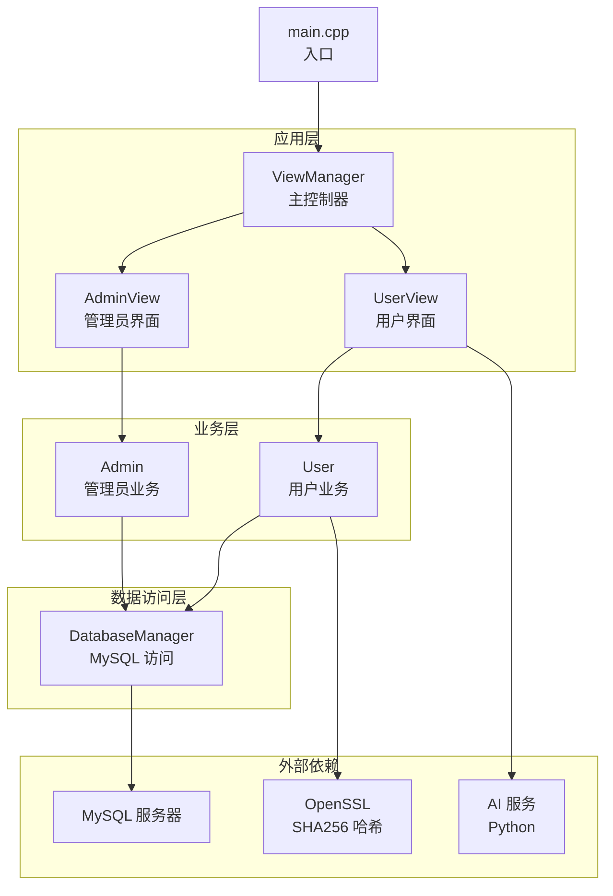
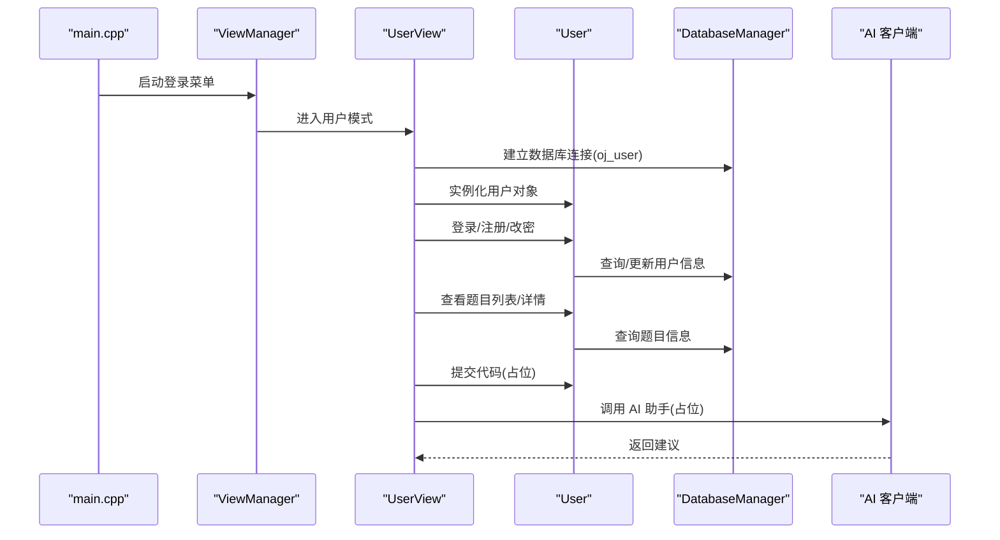
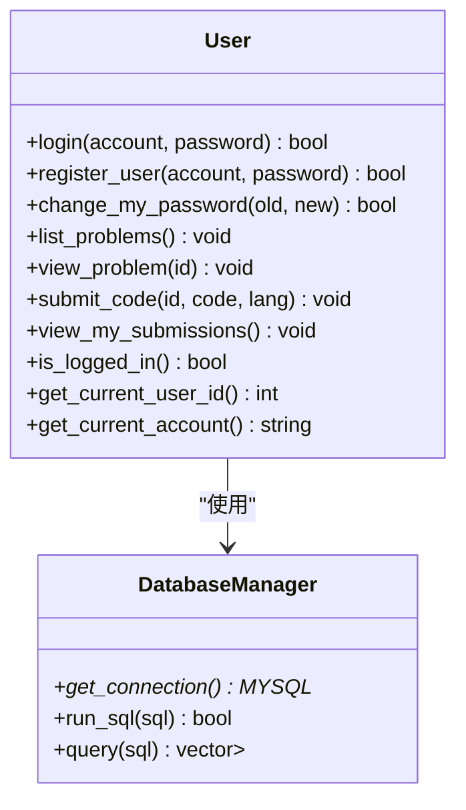
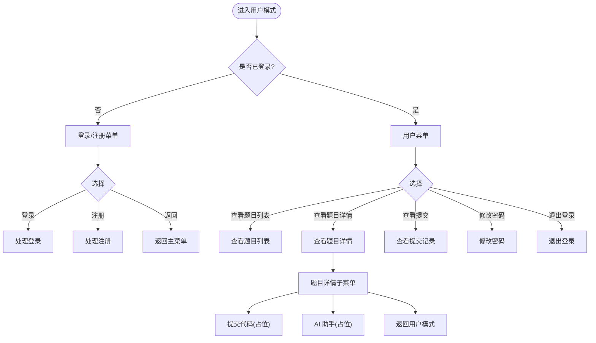
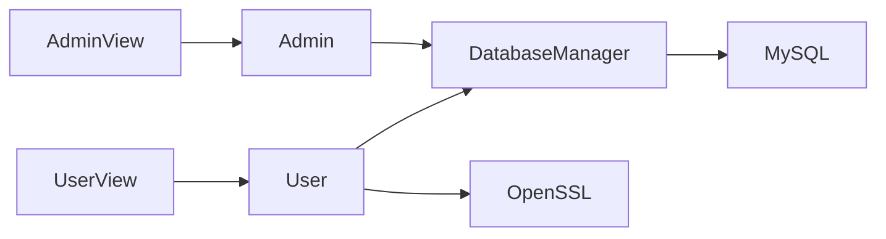

# 版本演进历史

<cite>
**本文引用的文件**
- [README.md](file://README.md)
- [OJ_v0.1.md](file://History/OJ_v0.1.md)
- [OJ_v0.2.md](file://History/OJ_v0.2.md)
- [CMakeLists.txt](file://CMakeLists.txt)
- [init.sql](file://init.sql)
- [setup.sh](file://setup.sh)
- [main.cpp](file://src/main.cpp)
- [user.cpp](file://src/user.cpp)
- [user_view.cpp](file://src/user_view.cpp)
- [db_manager.cpp](file://src/db_manager.cpp)
- [user.h](file://include/user.h)
- [user_view.h](file://include/user_view.h)
- [admin_view.h](file://include/admin_view.h)
- [view_manager.h](file://include/view_manager.h)
</cite>

## 目录
1. [简介](#简介)
2. [项目结构](#项目结构)
3. [核心组件](#核心组件)
4. [架构总览](#架构总览)
5. [详细组件分析](#详细组件分析)
6. [依赖关系分析](#依赖关系分析)
7. [性能考量](#性能考量)
8. [故障排查指南](#故障排查指南)
9. [结论](#结论)
10. [附录](#附录)

## 简介
本文件基于仓库中的历史文档与源代码，梳理 OJ 在线判题系统从 v0.1 到 v0.2 的版本演进。重点覆盖功能迭代、架构改进、性能优化、设计决策与技术选型、关键问题的解决、经验教训与最佳实践、版本兼容性与迁移指南，以及社区反馈与需求演进过程。读者可据此获得完整的项目发展历程参考。

## 项目结构
项目采用 C++17 + MySQL + CMake 的传统 CLI 架构，按“视图-业务-数据访问”分层组织。主要目录与文件如下：
- History：版本历史文档（v0.1、v0.2）
- include：各模块头文件（视图、业务、数据库、颜色、AI客户端等）
- src：对应实现文件（main、视图、业务、数据库等）
- docs：设计文档（如评测核心设计、判题实现计划）
- ai：AI 服务相关（Python 实现，供 v0.2 中预留的 AI 助手调用）
- 其他：构建脚本、初始化 SQL、一键部署脚本等

图表来源
- [main.cpp:1-14](file://src/main.cpp#L1-L14)
- [view_manager.h:1-43](file://include/view_manager.h#L1-L43)
- [user_view.h:1-92](file://include/user_view.h#L1-L92)
- [admin_view.h:1-58](file://include/admin_view.h#L1-L58)
- [user.h:1-89](file://include/user.h#L1-L89)
- [db_manager.h:1-53](file://include/db_manager.h#L1-L53)

章节来源
- [README.md:1-2](file://README.md#L1-L2)
- [CMakeLists.txt:1-40](file://CMakeLists.txt#L1-L40)
- [setup.sh:1-41](file://setup.sh#L1-L41)

## 核心组件
- ViewManager：主控制器，负责启动登录菜单与模式切换，统一清屏与输入清理。
- UserView：用户模式界面，提供登录/注册/查看题目/提交代码/修改密码/清屏等能力，并集成 AI 助手入口。
- AdminView：管理员模式界面，提供题目管理与查看。
- User：用户业务逻辑，包含登录、注册、改密、题目浏览、提交代码占位、提交记录占位等。
- DatabaseManager：MySQL 访问封装，提供连接、查询、SQL 执行等能力。
- CMakeLists：构建配置，启用 C++17、OpenSSL、MySQL 客户端库链接。
- init.sql：数据库初始化脚本，创建表、用户、示例数据与权限。
- setup.sh：一键部署脚本，创建目录、初始化数据库并提示编译步骤。

章节来源
- [OJ_v0.1.md:13-65](file://History/OJ_v0.1.md#L13-L65)
- [OJ_v0.2.md:39-92](file://History/OJ_v0.2.md#L39-L92)
- [user.h:1-89](file://include/user.h#L1-L89)
- [user_view.h:1-92](file://include/user_view.h#L1-L92)
- [admin_view.h:1-58](file://include/admin_view.h#L1-L58)
- [view_manager.h:1-43](file://include/view_manager.h#L1-L43)
- [db_manager.h:1-53](file://include/db_manager.h#L1-L53)

## 架构总览
v0.1 与 v0.2 的架构基本一致，均采用“入口 -> 视图控制器 -> 视图 -> 业务 -> 数据库”的分层结构。v0.2 在以下方面进行了优化与扩展：
- 用户模块完整实现数据库交互（登录/注册/改密），并引入 SHA256 密码哈希。
- 题目浏览模块优化，支持题目详情子菜单（提交代码、AI 助手）。
- CLI 界面清屏规范统一，彻底清除滚动缓冲区。
- 代码风格优化，统一使用 using namespace std。
- 数据库权限调整，oj_user 增加 INSERT 权限以支持注册。
- 构建配置增加 OpenSSL 依赖，用于密码哈希。

图表来源
- [main.cpp:5-12](file://src/main.cpp#L5-L12)
- [user_view.cpp:36-131](file://src/user_view.cpp#L36-L131)
- [user.cpp:39-137](file://src/user.cpp#L39-L137)
- [db_manager.cpp:21-57](file://src/db_manager.cpp#L21-L57)

章节来源
- [OJ_v0.1.md:13-65](file://History/OJ_v0.1.md#L13-L65)
- [OJ_v0.2.md:39-92](file://History/OJ_v0.2.md#L39-L92)

## 详细组件分析

### 用户模块（v0.2 完整实现）
- 登录：校验账号是否存在，计算输入密码 SHA256 与存储哈希比对，成功后更新最后登录时间。
- 注册：检查账号是否已存在，计算 SHA256 后插入 users 表。
- 修改密码：登录态下验证旧密码哈希，成功后更新新哈希。
- 题目浏览：支持题目列表（含分类、时间/内存限制）、题目详情展示。
- 提交代码与查看提交：占位实现，预留后续评测核心接入。
- 清屏与返回机制：在用户模式各菜单间统一清屏；登录/注册/改密支持输入 0 返回上一步。

图表来源
- [user.h:10-86](file://include/user.h#L10-L86)
- [db_manager.h:12-46](file://include/db_manager.h#L12-L46)

章节来源
- [OJ_v0.2.md:98-130](file://History/OJ_v0.2.md#L98-L130)
- [user.cpp:39-137](file://src/user.cpp#L39-L137)

### 用户界面（v0.2 增强）
- 清屏：使用 ANSI 转义序列彻底清除屏幕与滚动缓冲区。
- 子菜单：查看题目详情时进入子菜单，支持“提交代码”“AI 助手”“返回用户模式”。
- 返回机制：登录/注册/改密支持输入 0 返回上一步。
- AI 助手：预留接口，读取工作区代码与题目信息，调用 AI 客户端。

图表来源
- [user_view.cpp:133-394](file://src/user_view.cpp#L133-L394)

章节来源
- [OJ_v0.2.md:132-171](file://History/OJ_v0.2.md#L132-L171)
- [user_view.cpp:29-131](file://src/user_view.cpp#L29-L131)

### 管理员界面（v0.2 新增清屏）
- 在管理员模式下提供统一清屏能力，覆盖进入模式、查看题目列表、查看题目详情、发布新题目等场景。

章节来源
- [OJ_v0.2.md:173-191](file://History/OJ_v0.2.md#L173-L191)
- [admin_view.h:11-55](file://include/admin_view.h#L11-L55)

### 数据库管理（v0.2 优化）
- SQL 输出优化：run_sql/query 默认静默执行，仅失败时输出错误；析构/连接改为静默。
- 权限调整：oj_user 增加 INSERT 权限，支持用户注册。

章节来源
- [OJ_v0.2.md:193-206](file://History/OJ_v0.2.md#L193-L206)
- [db_manager.cpp:21-57](file://src/db_manager.cpp#L21-L57)
- [init.sql:87-92](file://init.sql#L87-L92)

### 构建与部署（v0.2 引入 OpenSSL）
- CMakeLists：启用 C++17、查找 MySQL 与 OpenSSL，链接 OpenSSL::Crypto。
- setup.sh：一键创建 build/test_data 目录、执行 init.sql 初始化数据库、提示编译步骤。

章节来源
- [CMakeLists.txt:1-40](file://CMakeLists.txt#L1-L40)
- [setup.sh:1-41](file://setup.sh#L1-L41)

## 依赖关系分析
- 组件耦合：UserView 依赖 User 与 DatabaseManager；AdminView 依赖 Admin 与 DatabaseManager；ViewManager 统一调度两者。
- 外部依赖：MySQL 客户端库、OpenSSL（用于 SHA256 哈希）。
- 数据库权限：oj_user 对 users/submissions 具有 SELECT/INSERT 权限，problems 只读；oj_admin 全权限。

图表来源
- [user_view.h:24-26](file://include/user_view.h#L24-L26)
- [admin_view.h:23-24](file://include/admin_view.h#L23-L24)
- [user.h:82](file://include/user.h#L82)
- [db_manager.h:45](file://include/db_manager.h#L45)
- [CMakeLists.txt:12-34](file://CMakeLists.txt#L12-L34)

章节来源
- [OJ_v0.1.md:266-272](file://History/OJ_v0.1.md#L266-L272)
- [init.sql:68-95](file://init.sql#L68-L95)

## 性能考量
- v0.1 到 v0.2 的性能优化主要体现在：
  - SQL 输出静默化：减少控制台冗余输出，降低 I/O 开销。
  - 清屏优化：彻底清除滚动缓冲区，避免界面渲染抖动与额外刷新。
  - 代码风格统一：using namespace std 简化代码，减少模板实例化复杂度（微幅收益）。
- 后续版本建议：
  - 引入连接池与预编译语句，减少连接建立与解析开销。
  - 对题目列表与详情查询增加分页与缓存。
  - 将密码哈希迁移至更安全的 PBKDF2/argon2（当前为简化版 SHA256）。

## 故障排查指南
- 数据库连接失败
  - 检查 init.sql 是否正确执行，确认 oj_user/oj_admin 权限。
  - 确认 MySQL 服务运行与网络可达。
- 登录/注册失败
  - 确认密码哈希一致性（v0.2 使用 SHA256）。
  - 检查账号是否已存在或被锁定。
- 清屏异常
  - 确认终端支持 ANSI 转义序列；若不支持，可在本地自定义清屏实现。
- 构建失败
  - 确认已安装 MySQL 客户端与 OpenSSL 开发包；CMake 能找到 pkg-config。
- AI 助手不可用
  - 检查 ai/requirements.txt 与 Python 环境；确认 AIClient 可用。

章节来源
- [db_manager.cpp:61-79](file://src/db_manager.cpp#L61-L79)
- [user.cpp:39-98](file://src/user.cpp#L39-L98)
- [user_view.cpp:29-34](file://src/user_view.cpp#L29-L34)
- [CMakeLists.txt:11-34](file://CMakeLists.txt#L11-L34)
- [setup.sh:14-29](file://setup.sh#L14-L29)

## 结论
v0.2 在 v0.1 的基础上完成了用户模块的数据库交互闭环，统一了 CLI 界面清屏规范，引入了 SHA256 密码哈希与权限优化，并为后续评测核心、沙箱、标签分类、排行榜与 AI 助手完整实现打下了坚实基础。版本演进体现了“先稳定后扩展”的设计思路：先保证核心业务可用与体验一致，再逐步引入高级特性。

## 附录

### 版本对比与兼容性
- v0.1 → v0.2
  - 新增：用户认证完整实现、题目详情子菜单、全面清屏、using namespace std、OpenSSL 依赖。
  - 变更：SQL 输出静默化、oj_user 权限调整、构建配置升级。
  - 兼容性：数据库表结构保持一致；用户侧行为变化（清屏、返回机制、权限）需注意迁移。

章节来源
- [OJ_v0.1.md:324-352](file://History/OJ_v0.1.md#L324-L352)
- [OJ_v0.2.md:298-327](file://History/OJ_v0.2.md#L298-L327)

### 迁移指南（v0.1 → v0.2）
- 数据库权限
  - 执行 init.sql 以更新 oj_user 权限（增加 INSERT）。
- 构建环境
  - 安装 OpenSSL 开发包；确保 CMake 能找到 OpenSSL 与 MySQL 客户端。
- 行为差异
  - 用户登录/注册/改密支持输入 0 返回；清屏方式统一为彻底清除滚动缓冲区。
  - 题目详情页新增“提交代码/AI 助手”子菜单。
- 代码风格
  - 所有 .cpp 文件统一使用 using namespace std；如需兼容旧风格，可逐文件恢复 std:: 前缀。

章节来源
- [OJ_v0.2.md:213-221](file://History/OJ_v0.2.md#L213-L221)
- [OJ_v0.2.md:257-268](file://History/OJ_v0.2.md#L257-L268)
- [CMakeLists.txt:14](file://CMakeLists.txt#L14)

### 社区反馈与需求演进
- v0.1 待实现功能（v0.2+）：用户模式与数据库交互、代码评测核心、沙箱安全机制、题目标签分类、排行榜、Docker 部署。
- v0.2 已实现：用户认证完整数据库交互、题目浏览优化、CLI 清屏规范、using namespace std。
- v0.2 待实现功能（v0.3+）：评测核心、沙箱、标签分类、排行榜、AI 助手完整实现、Docker 部署。

章节来源
- [OJ_v0.1.md:345-352](file://History/OJ_v0.1.md#L345-L352)
- [OJ_v0.2.md:19-36](file://History/OJ_v0.2.md#L19-L36)
- [OJ_v0.2.md:319-327](file://History/OJ_v0.2.md#L319-L327)