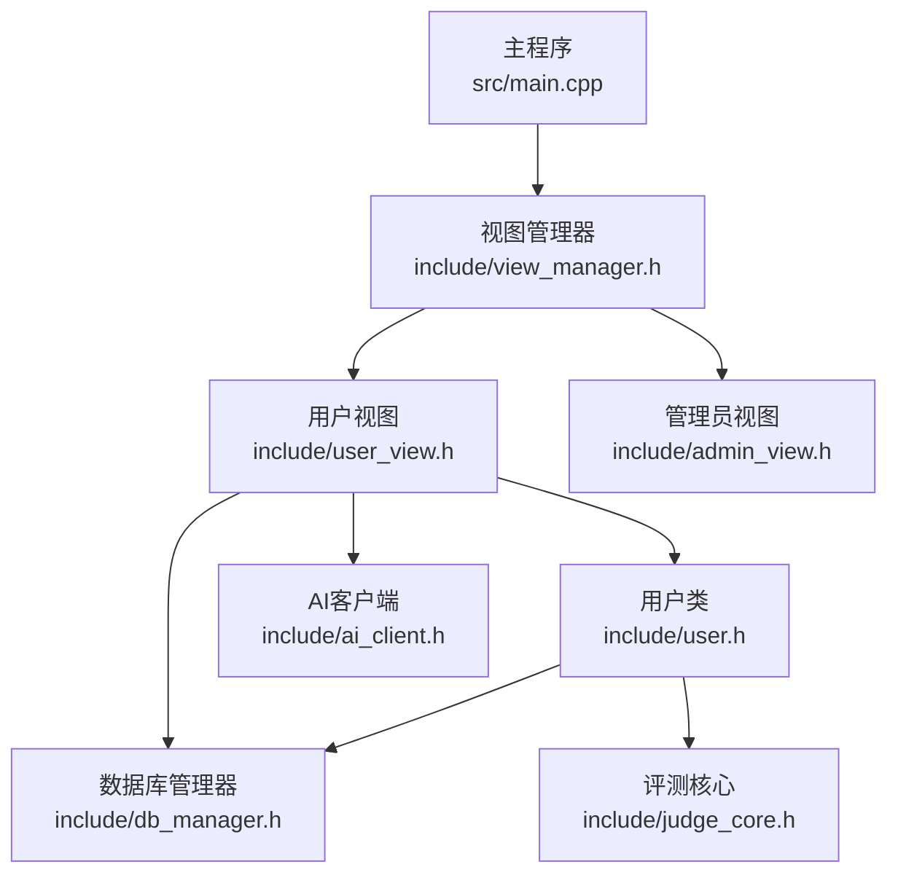
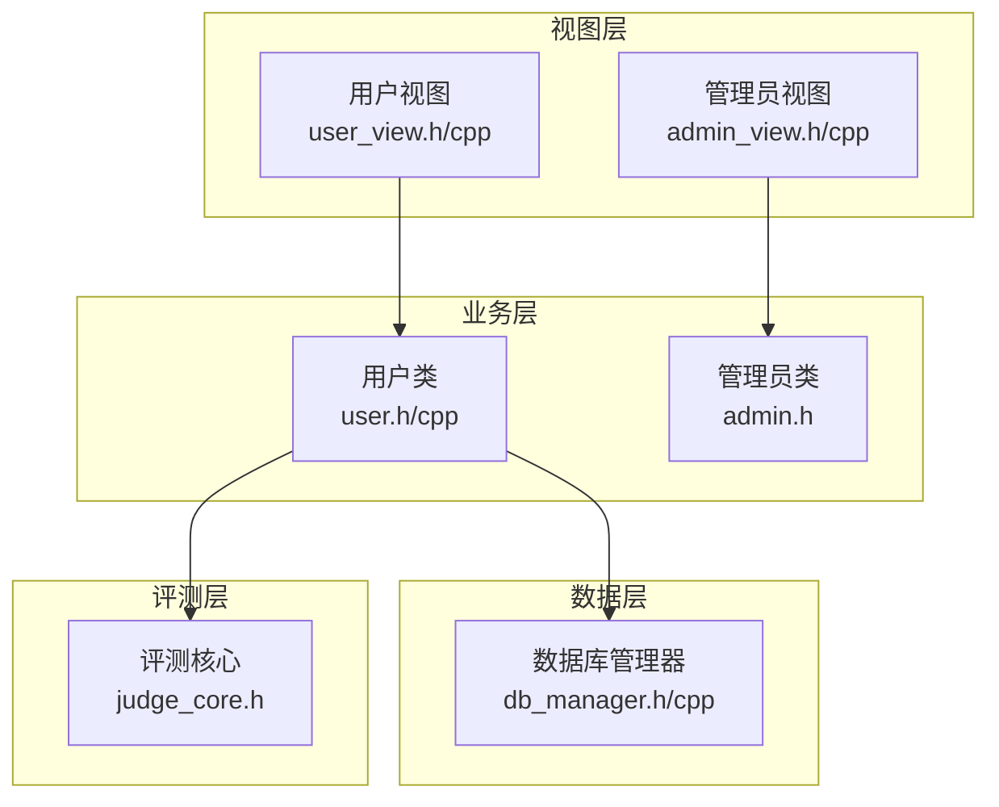
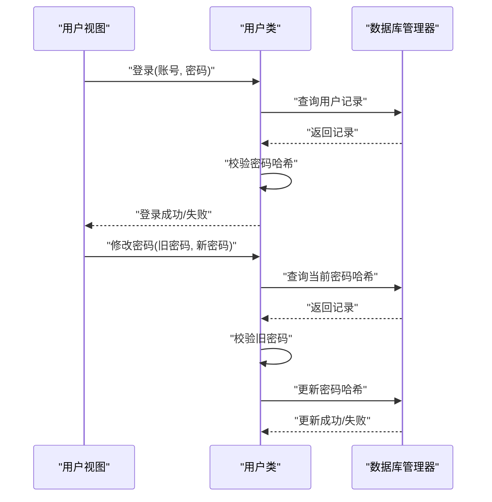
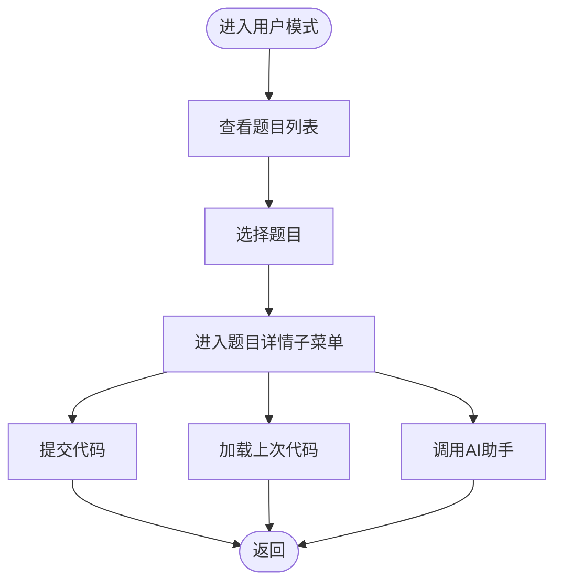
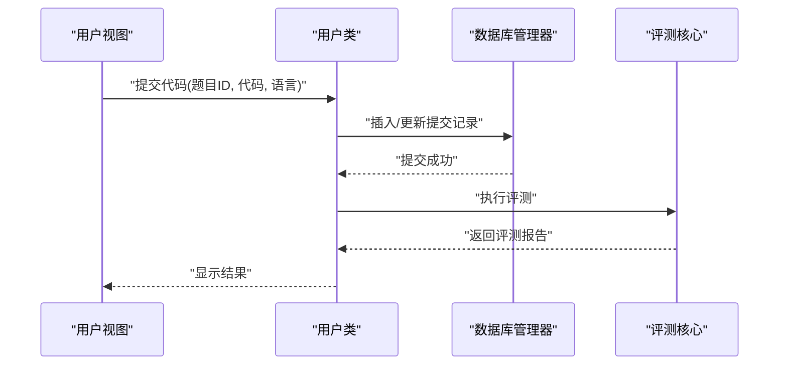
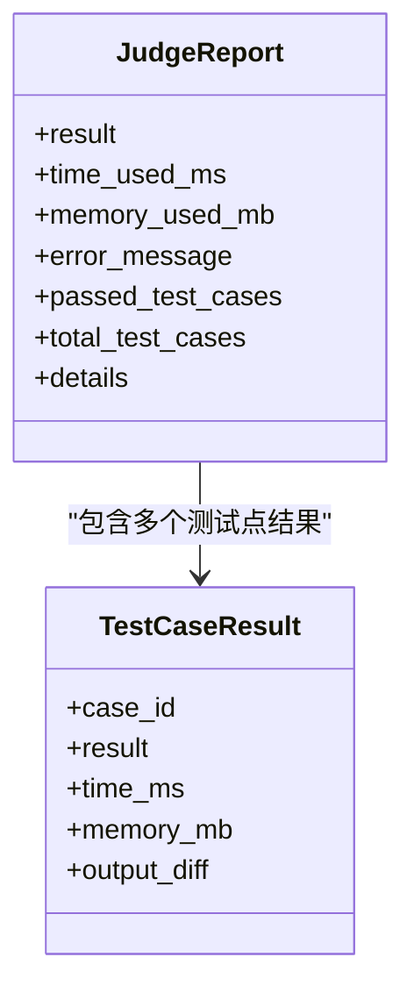
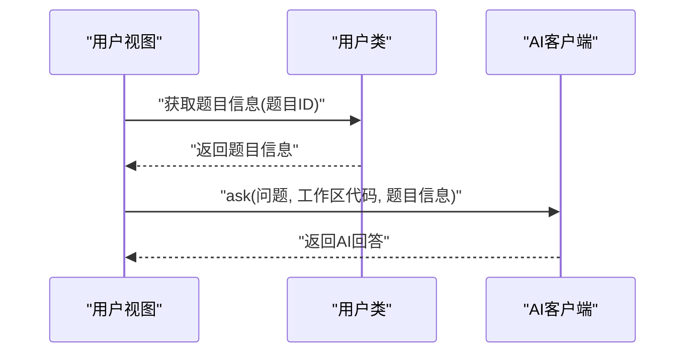
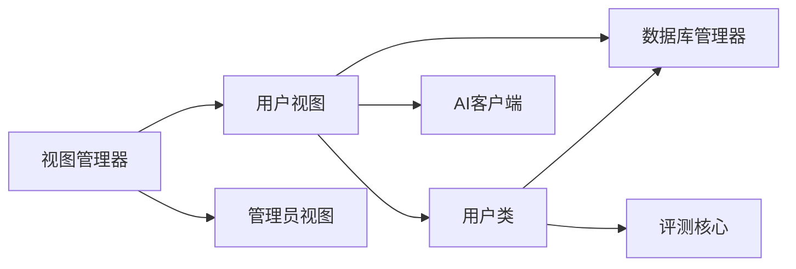
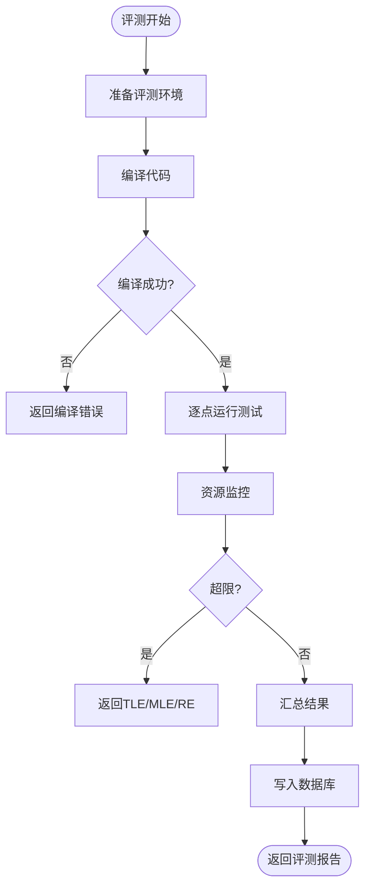

# 用户使用指南

<cite>
**本文引用的文件**
- [README.md](file://README.md)
- [main.cpp](file://src/main.cpp)
- [view_manager.h](file://include/view_manager.h)
- [view_manager.cpp](file://src/view_manager.cpp)
- [user_view.h](file://include/user_view.h)
- [user_view.cpp](file://src/user_view.cpp)
- [user.h](file://include/user.h)
- [user.cpp](file://src/user.cpp)
- [admin_view.h](file://include/admin_view.h)
- [admin_view.cpp](file://src/admin_view.cpp)
- [db_manager.h](file://include/db_manager.h)
- [db_manager.cpp](file://src/db_manager.cpp)
- [judge_core.h](file://include/judge_core.h)
- [judge_implementation_plan.md](file://docs/judge_implementation_plan.md)
- [code_submission_design.md](file://docs/code_submission_design.md)
- [init.sql](file://init.sql)
- [ai_client.h](file://include/ai_client.h)
- [ai_client.cpp](file://src/ai_client.cpp)
</cite>

## 目录
1. [简介](#简介)
2. [项目结构](#项目结构)
3. [核心组件](#核心组件)
4. [架构总览](#架构总览)
5. [详细组件分析](#详细组件分析)
6. [依赖关系分析](#依赖关系分析)
7. [性能与安全特性](#性能与安全特性)
8. [常见操作与最佳实践](#常见操作与最佳实践)
9. [故障排除指南](#故障排除指南)
10. [结论](#结论)

## 简介
本指南面向OJ在线评测系统的最终用户，帮助您完成从注册登录、浏览题目、编写与提交代码，到查看评测结果与使用AI助手的全流程操作。同时提供常用技巧与故障排除建议，帮助您高效、稳定地使用系统。

## 项目结构
系统采用命令行界面（CLI）交互方式，主要入口为主程序，通过视图管理器协调用户模式与管理员模式的界面流转；业务逻辑由用户类、数据库管理类与评测核心类协作完成；AI助手通过独立客户端对接外部服务。

**图表来源**
- [main.cpp:1-14](file://src/main.cpp#L1-L14)
- [view_manager.h:11-43](file://include/view_manager.h#L11-L43)
- [user_view.h:12-92](file://include/user_view.h#L12-L92)
- [admin_view.h:11-58](file://include/admin_view.h#L11-L58)
- [user.h:11-102](file://include/user.h#L11-L102)
- [db_manager.h:12-60](file://include/db_manager.h#L12-L60)
- [judge_core.h:111-189](file://include/judge_core.h#L111-L189)
- [ai_client.h:6-28](file://include/ai_client.h#L6-L28)

**章节来源**
- [README.md:1-2](file://README.md#L1-L2)
- [main.cpp:1-14](file://src/main.cpp#L1-L14)
- [view_manager.cpp:32-77](file://src/view_manager.cpp#L32-L77)

## 核心组件
- 视图管理器：负责登录菜单与角色选择，驱动用户/管理员视图进入各自模式。
- 用户视图：提供登录、注册、查看题目、提交代码、查看提交历史、修改密码、调用AI助手等功能入口。
- 用户类：封装用户业务逻辑，包括认证、密码管理、题目浏览、提交代码、历史查询与评测结果获取。
- 数据库管理器：封装MySQL连接与SQL执行，提供查询与执行能力。
- 评测核心：定义评测配置、资源限制、评测结果模型与评测流程接口，支撑代码编译、运行与结果汇总。
- AI客户端：封装与外部AI服务的交互，支持携带代码上下文与题目上下文进行问答。

**章节来源**
- [view_manager.h:11-43](file://include/view_manager.h#L11-L43)
- [user_view.h:12-92](file://include/user_view.h#L12-L92)
- [user.h:11-102](file://include/user.h#L11-L102)
- [db_manager.h:12-60](file://include/db_manager.h#L12-L60)
- [judge_core.h:111-189](file://include/judge_core.h#L111-L189)
- [ai_client.h:6-28](file://include/ai_client.h#L6-L28)

## 架构总览
系统采用“视图层-业务层-数据层-评测层”的分层架构：
- 视图层：用户视图与管理员视图分别处理用户交互与菜单跳转。
- 业务层：用户类封装用户相关业务，管理员类封装管理相关业务。
- 数据层：数据库管理器统一处理SQL执行与查询。
- 评测层：评测核心定义评测配置与结果模型，支撑编译、运行与结果汇总。

**图表来源**
- [user_view.h:12-92](file://include/user_view.h#L12-L92)
- [admin_view.h:11-58](file://include/admin_view.h#L11-L58)
- [user.h:11-102](file://include/user.h#L11-L102)
- [admin.h:10-40](file://include/admin.h#L10-L40)
- [db_manager.h:12-60](file://include/db_manager.h#L12-L60)
- [judge_core.h:111-189](file://include/judge_core.h#L111-L189)

## 详细组件分析

### 用户注册与登录流程
- 登录流程
  - 用户在游客菜单选择登录，输入账号与密码。
  - 系统通过用户类调用数据库管理器查询用户记录，校验密码哈希。
  - 登录成功后更新最后登录时间，进入用户模式菜单。
- 注册流程
  - 用户在游客菜单选择注册，输入新账号与密码。
  - 系统检查账号是否已存在，若不存在则生成SHA256哈希并插入用户表。
- 密码管理
  - 用户可修改密码，需提供旧密码与新密码，系统校验旧密码正确性后更新哈希。

**图表来源**
- [user_view.cpp:159-200](file://src/user_view.cpp#L159-L200)
- [user.cpp:41-139](file://src/user.cpp#L41-L139)
- [db_manager.h:12-60](file://include/db_manager.h#L12-L60)

**章节来源**
- [user_view.cpp:159-200](file://src/user_view.cpp#L159-L200)
- [user.cpp:41-139](file://src/user.cpp#L41-L139)
- [init.sql:26-39](file://init.sql#L26-L39)

### 题目浏览与查看
- 题目列表
  - 用户在用户模式菜单选择“查看题目列表”，系统查询题目表并按ID排序展示。
- 题目详情
  - 用户选择“查看题目详情”，进入题目详情子菜单，可进行提交代码、加载上次代码、调用AI助手等操作。
- 测试数据预览
  - 题目详情中可查看题目基本信息（标题、描述、时间/内存限制），测试数据位于宿主机路径，由评测核心在容器中读取。

**图表来源**
- [user_view.cpp:101-120](file://src/user_view.cpp#L101-L120)
- [user_view.cpp:54-67](file://src/user_view.cpp#L54-L67)
- [user.cpp:141-200](file://src/user.cpp#L141-L200)
- [init.sql:14-24](file://init.sql#L14-L24)

**章节来源**
- [user_view.cpp:101-120](file://src/user_view.cpp#L101-L120)
- [user_view.cpp:54-67](file://src/user_view.cpp#L54-L67)
- [user.cpp:141-200](file://src/user.cpp#L141-L200)
- [init.sql:14-24](file://init.sql#L14-L24)

### 代码提交流程（含工作区与历史）
- 工作区文件机制
  - 系统在首次使用时创建工作区文件，用户始终在此编辑代码。
  - 提交时读取工作区文件内容，保存至数据库submissions表的code字段，文件本身保持不变。
- 提交流程
  - 在题目详情子菜单选择“提交代码”，系统读取工作区文件内容，调用用户类提交代码。
  - 用户类将代码写入数据库并触发评测核心执行评测。
- 历史管理
  - 用户可在“查看我的提交”中查看提交列表，支持下载指定提交代码到本地历史目录，或加载到工作区继续编辑。

**图表来源**
- [code_submission_design.md:36-128](file://docs/code_submission_design.md#L36-L128)
- [user_view.cpp:66-67](file://src/user_view.cpp#L66-L67)
- [user.h:54-65](file://include/user.h#L54-L65)
- [judge_core.h:111-189](file://include/judge_core.h#L111-L189)

**章节来源**
- [code_submission_design.md:36-128](file://docs/code_submission_design.md#L36-L128)
- [user_view.cpp:66-67](file://src/user_view.cpp#L66-L67)
- [user.h:54-65](file://include/user.h#L54-L65)

### 评测结果查看与解读
- 结果模型
  - 评测结果包含总体结果、时间/内存使用、错误信息、通过/总数、每个测试点详情等。
- 结果展示
  - 用户在提交后可查看评测报告，系统根据结果类型输出相应提示（如AC、WA、TLE、MLE、RE、CE）。
- 错误上下文
  - 用户类提供获取最近一次评测错误上下文的能力，便于AI辅助定位问题。

**图表来源**
- [judge_core.h:93-102](file://include/judge_core.h#L93-L102)
- [judge_core.h:81-88](file://include/judge_core.h#L81-L88)

**章节来源**
- [judge_core.h:93-102](file://include/judge_core.h#L93-L102)
- [judge_core.h:81-88](file://include/judge_core.h#L81-L88)

### AI助手使用指南
- 上下文增强
  - 调用AI助手时，系统自动读取工作区代码与题目信息，作为上下文传给AI，提升指导准确性。
- 交互流程
  - 在题目详情子菜单选择“AI助手”，输入问题后，系统将代码与题目上下文发送至AI服务，返回针对性建议。

**图表来源**
- [user_view.cpp:72-73](file://src/user_view.cpp#L72-L73)
- [user.h:68-75](file://include/user.h#L68-L75)
- [ai_client.h:6-28](file://include/ai_client.h#L6-L28)

**章节来源**
- [user_view.cpp:72-73](file://src/user_view.cpp#L72-L73)
- [user.h:68-75](file://include/user.h#L68-L75)
- [ai_client.h:6-28](file://include/ai_client.h#L6-L28)

## 依赖关系分析
- 组件耦合
  - 用户视图依赖用户类、数据库管理器与AI客户端；用户类依赖数据库管理器与评测核心。
  - 视图管理器负责角色选择与视图切换，降低用户/管理员视图之间的耦合。
- 外部依赖
  - 数据库：MySQL，通过数据库管理器封装连接与SQL执行。
  - 评测：评测核心通过容器化与资源监控实现安全隔离与精确计时。
  - AI：AI客户端通过外部脚本与服务交互，支持上下文传递。

**图表来源**
- [view_manager.h:23-24](file://include/view_manager.h#L23-L24)
- [user_view.h:24-26](file://include/user_view.h#L24-L26)
- [user.h:93-98](file://include/user.h#L93-L98)
- [judge_core.h:111-189](file://include/judge_core.h#L111-L189)

**章节来源**
- [view_manager.h:23-24](file://include/view_manager.h#L23-L24)
- [user_view.h:24-26](file://include/user_view.h#L24-L26)
- [user.h:93-98](file://include/user.h#L93-L98)

## 性能与安全特性
- 容器化评测
  - 基于Docker容器实现安全隔离，禁用网络、只读文件系统、丢弃capabilities、Seccomp过滤等多重安全策略。
- 资源限制与监控
  - 通过cgroup与Docker限制CPU、内存、进程数与输出大小，实时监控资源使用，精确判定TLE/MLE。
- 并行评测
  - 容器池管理支持多任务并发评测，提高系统吞吐量。

**图表来源**
- [judge_implementation_plan.md:395-440](file://docs/judge_implementation_plan.md#L395-L440)
- [judge_implementation_plan.md:312-375](file://docs/judge_implementation_plan.md#L312-L375)
- [judge_implementation_plan.md:127-216](file://docs/judge_implementation_plan.md#L127-L216)

**章节来源**
- [judge_implementation_plan.md:395-440](file://docs/judge_implementation_plan.md#L395-L440)
- [judge_implementation_plan.md:312-375](file://docs/judge_implementation_plan.md#L312-L375)
- [judge_implementation_plan.md:127-216](file://docs/judge_implementation_plan.md#L127-L216)

## 常见操作与最佳实践
- 使用工作区文件
  - 始终在工作区文件中编写代码，提交时系统会读取该文件内容，避免频繁切换。
- 提交前检查
  - 在提交前确认题目ID、语言选择与工作区代码完整性，减少编译错误与运行时错误。
- 查看评测结果
  - 关注总体结果与通过测试点数量，结合错误信息定位问题；必要时使用AI助手获取指导。
- 历史管理
  - 使用“查看我的提交”功能管理历史代码，下载到本地以便复习与对比；也可加载到工作区继续优化。
- 安全与规范
  - 不要在代码中硬编码敏感信息；遵守时间/内存限制，避免TLE/MLE。

[本节为通用指导，不直接分析具体文件，故无“章节来源”]

## 故障排除指南
- 登录失败
  - 检查账号是否存在与密码是否正确；确认数据库连接正常。
- 提交无响应
  - 确认工作区文件存在且可读；检查网络与Docker服务状态；查看评测核心日志。
- 评测结果异常
  - 若出现系统错误或超时，检查容器池健康状况与资源限制设置；必要时重启评测服务。
- AI助手不可用
  - 确认AI客户端可用性与外部服务连通性；检查上下文参数是否正确传递。

**章节来源**
- [user_view.cpp:159-200](file://src/user_view.cpp#L159-L200)
- [user.cpp:41-139](file://src/user.cpp#L41-L139)
- [judge_implementation_plan.md:591-637](file://docs/judge_implementation_plan.md#L591-L637)

## 结论
本指南覆盖了OJ系统的用户使用全流程：从注册登录、题目浏览、代码提交，到评测结果解读与AI助手辅助学习。通过工作区文件与历史管理机制，用户可以高效地组织与追踪自己的编程练习；借助容器化评测与资源监控，系统在安全性与性能方面提供了可靠保障。建议用户遵循最佳实践，充分利用AI助手与历史记录，持续提升编程能力。