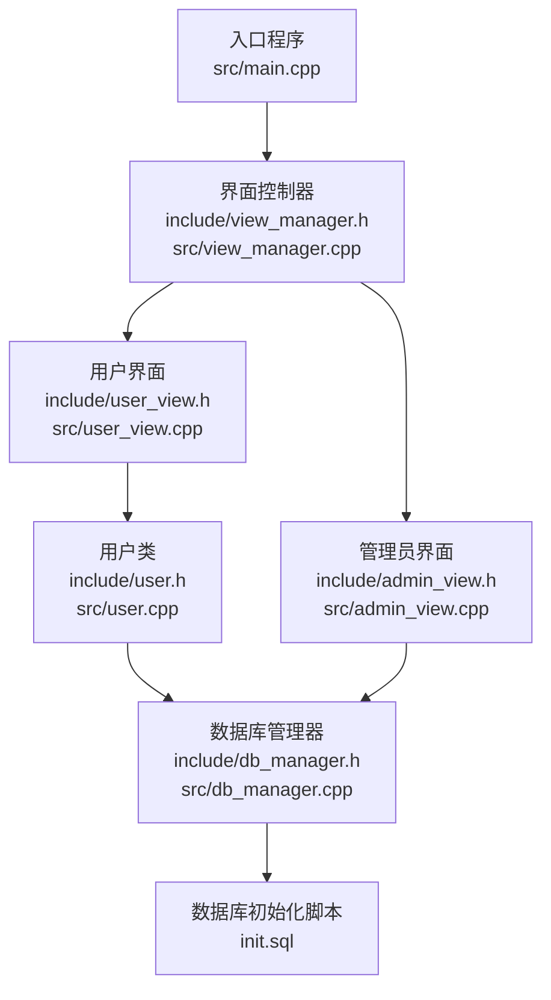
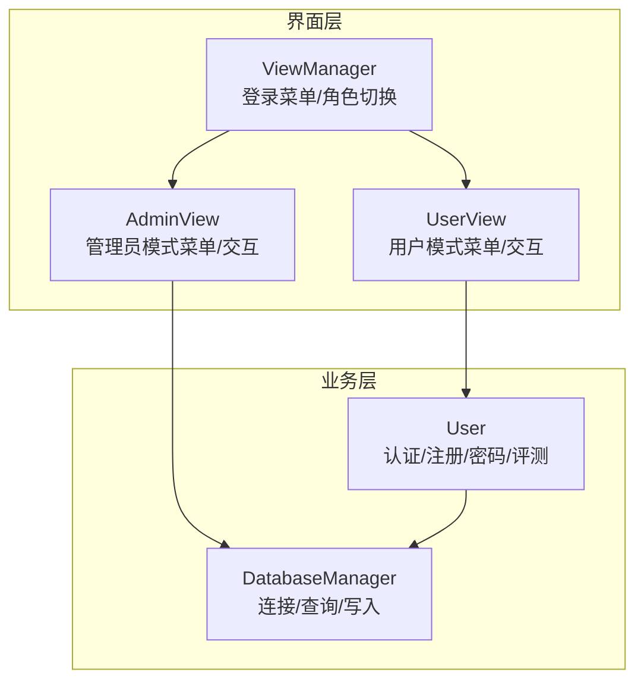
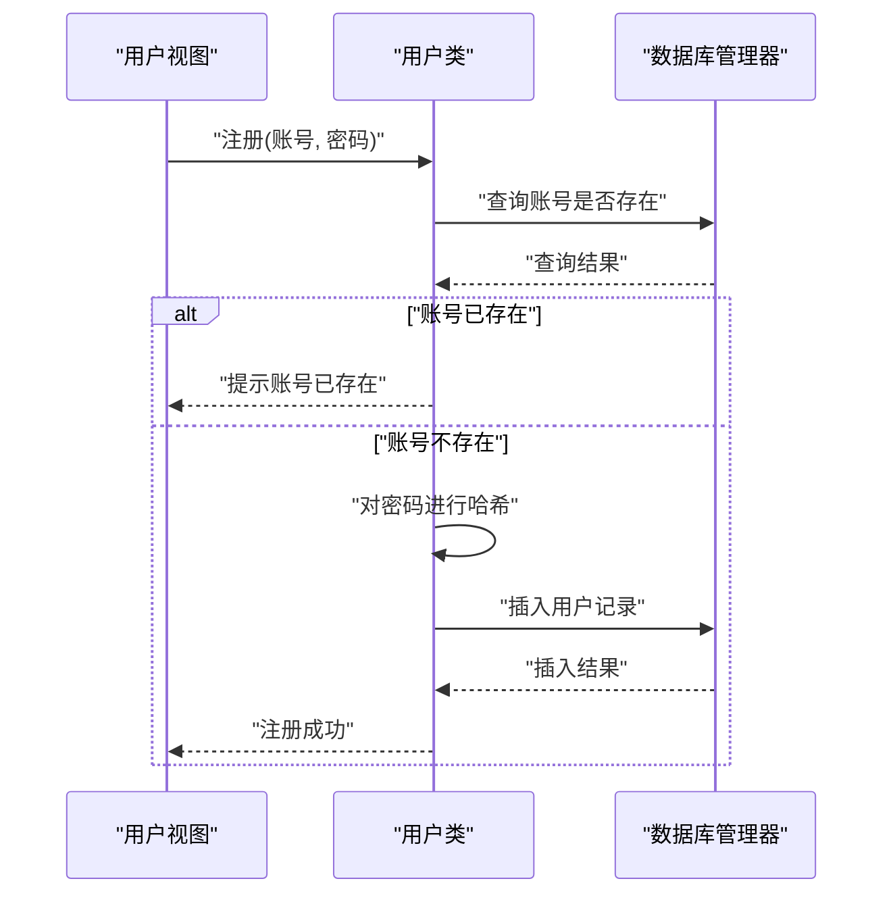
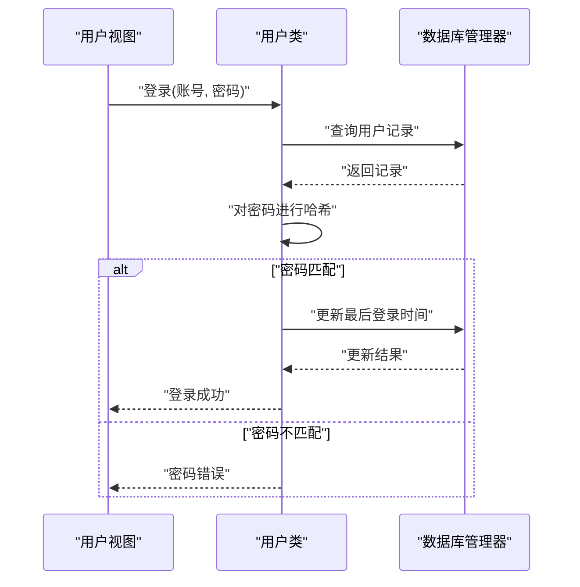
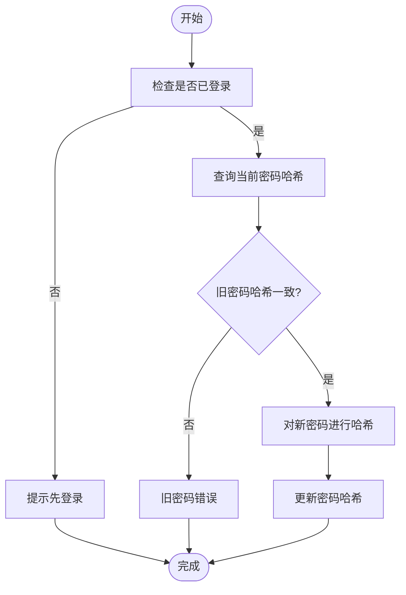
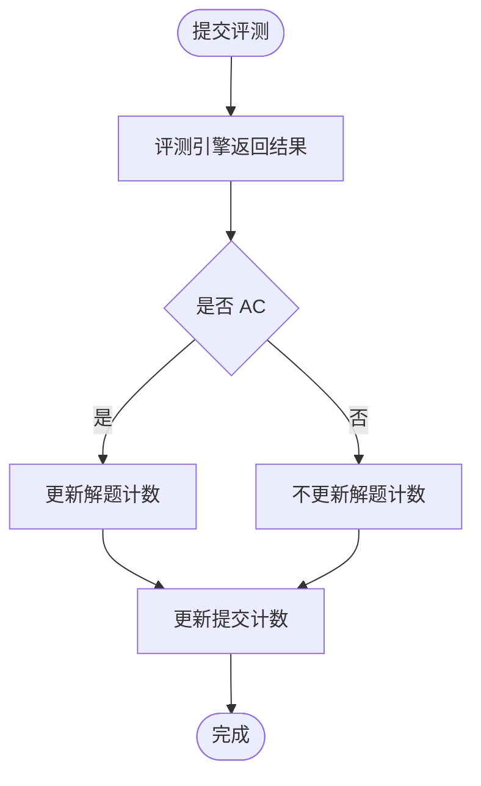
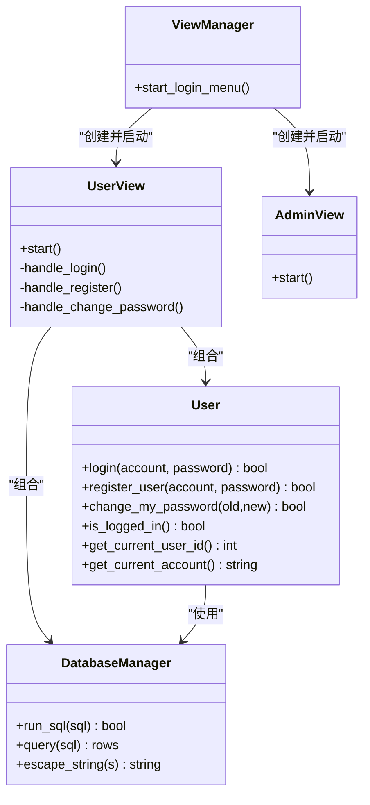

# 用户认证与账户管理

<cite>
**本文引用的文件**
- [main.cpp](file://src/main.cpp)
- [view_manager.h](file://include/view_manager.h)
- [view_manager.cpp](file://src/view_manager.cpp)
- [user_view.h](file://include/user_view.h)
- [user_view.cpp](file://src/user_view.cpp)
- [user.h](file://include/user.h)
- [user.cpp](file://src/user.cpp)
- [db_manager.h](file://include/db_manager.h)
- [db_manager.cpp](file://src/db_manager.cpp)
- [init.sql](file://init.sql)
</cite>

## 目录
1. [简介](#简介)
2. [项目结构](#项目结构)
3. [核心组件](#核心组件)
4. [架构总览](#架构总览)
5. [详细组件分析](#详细组件分析)
6. [依赖关系分析](#依赖关系分析)
7. [性能考量](#性能考量)
8. [故障排查指南](#故障排查指南)
9. [结论](#结论)
10. [附录](#附录)

## 简介
本指南面向使用 OJ 在线判题系统的用户与维护者，聚焦“用户认证与账户管理”能力，覆盖以下主题：
- 用户注册流程：账号与密码策略、邮箱验证说明
- 用户登录机制：凭据校验、会话状态与自动登录
- 密码管理：修改密码、忘记密码与安全设置
- 账户状态管理：活跃度指标、登录历史与安全审计
- 常见问题与排障：登录失败、账户锁定、密码重置
- 最佳安全实践与账户保护建议

说明：当前代码库未实现邮箱验证与“自动登录”持久化会话功能，本文在相应章节明确现状与建议。

## 项目结构
系统采用分层与职责分离的组织方式：
- 入口程序负责启动界面控制器
- 界面控制器根据角色进入用户或管理员模式
- 用户模式提供注册、登录、密码修改、题目浏览与提交等功能
- 数据库管理器封装 MySQL 连接与 SQL 执行
- 用户类封装认证、密码变更与评测提交等业务逻辑

图表来源
- [main.cpp:5-13](file://src/main.cpp#L5-L13)
- [view_manager.cpp:32-70](file://src/view_manager.cpp#L32-L70)
- [user_view.cpp:36-131](file://src/user_view.cpp#L36-L131)
- [user.cpp:41-100](file://src/user.cpp#L41-L100)
- [db_manager.cpp:9-25](file://src/db_manager.cpp#L9-L25)
- [init.sql:8-39](file://init.sql#L8-L39)

章节来源
- [main.cpp:5-13](file://src/main.cpp#L5-L13)
- [view_manager.h:11-41](file://include/view_manager.h#L11-L41)
- [view_manager.cpp:32-70](file://src/view_manager.cpp#L32-L70)
- [user_view.h:12-91](file://include/user_view.h#L12-L91)
- [user_view.cpp:36-131](file://src/user_view.cpp#L36-L131)
- [user.h:11-101](file://include/user.h#L11-L101)
- [user.cpp:41-100](file://src/user.cpp#L41-L100)
- [db_manager.h:12-53](file://include/db_manager.h#L12-L53)
- [db_manager.cpp:9-67](file://src/db_manager.cpp#L9-L67)
- [init.sql:8-39](file://init.sql#L8-L39)

## 核心组件
- 界面控制器：负责登录菜单与角色切换，驱动用户/管理员视图
- 用户视图：提供未登录/已登录菜单，处理注册、登录、密码修改、题目浏览与提交
- 用户类：封装认证、注册、密码修改、提交评测与统计更新
- 数据库管理器：封装连接、查询、写入与转义，屏蔽底层 MySQL 细节
- 数据模型：users、problems、submissions 三张表，支持基本认证与评测追踪

章节来源
- [view_manager.h:11-41](file://include/view_manager.h#L11-L41)
- [view_manager.cpp:32-70](file://src/view_manager.cpp#L32-L70)
- [user_view.h:12-91](file://include/user_view.h#L12-L91)
- [user_view.cpp:36-131](file://src/user_view.cpp#L36-L131)
- [user.h:11-101](file://include/user.h#L11-L101)
- [user.cpp:41-100](file://src/user.cpp#L41-L100)
- [db_manager.h:12-53](file://include/db_manager.h#L12-L53)
- [db_manager.cpp:9-67](file://src/db_manager.cpp#L9-L67)
- [init.sql:14-61](file://init.sql#L14-L61)

## 架构总览
系统采用“界面层-业务层-数据访问层”的分层架构，用户认证与账户管理主要集中在用户视图与用户类中，数据访问通过数据库管理器完成。

图表来源
- [view_manager.cpp:32-70](file://src/view_manager.cpp#L32-L70)
- [user_view.cpp:36-131](file://src/user_view.cpp#L36-L131)
- [user.cpp:41-100](file://src/user.cpp#L41-L100)
- [db_manager.cpp:9-25](file://src/db_manager.cpp#L9-L25)

## 详细组件分析

### 用户注册流程
- 触发路径：用户视图未登录菜单选择“注册新账号”
- 输入参数：账号、密码
- 核心步骤：
  1) 检查账号是否已存在
  2) 对密码进行哈希处理
  3) 写入 users 表，初始提交计数与解题计数为 0
- 关键接口与实现位置：
  - 用户视图处理注册输入与调用用户类注册方法
  - 用户类执行账号重复性检查与插入
  - 数据库管理器负责 SQL 执行与转义

图表来源
- [user_view.cpp:186-211](file://src/user_view.cpp#L186-L211)
- [user.cpp:75-100](file://src/user.cpp#L75-L100)
- [db_manager.cpp:22-25](file://src/db_manager.cpp#L22-L25)

章节来源
- [user_view.cpp:186-211](file://src/user_view.cpp#L186-L211)
- [user.cpp:75-100](file://src/user.cpp#L75-L100)
- [db_manager.cpp:22-25](file://src/db_manager.cpp#L22-L25)
- [init.sql:26-39](file://init.sql#L26-L39)

### 用户登录机制
- 触发路径：用户视图未登录菜单选择“登录”
- 输入参数：账号、密码
- 核心步骤：
  1) 根据账号查询用户记录
  2) 对输入密码进行哈希并与存储的哈希比对
  3) 登录成功后更新最后登录时间
  4) 设置当前用户状态与会话标识
- 会话与自动登录：
  - 当前实现为内存态会话（进程内），不包含“记住我”或持久化令牌
  - 退出用户模式即结束会话

图表来源
- [user_view.cpp:159-184](file://src/user_view.cpp#L159-L184)
- [user.cpp:41-73](file://src/user.cpp#L41-L73)
- [db_manager.cpp:22-25](file://src/db_manager.cpp#L22-L25)

章节来源
- [user_view.cpp:159-184](file://src/user_view.cpp#L159-L184)
- [user.cpp:41-73](file://src/user.cpp#L41-L73)
- [init.sql:26-39](file://init.sql#L26-L39)

### 密码管理功能
- 修改密码：
  - 仅限已登录用户
  - 校验旧密码哈希一致性后更新为新密码哈希
- 忘记密码：
  - 当前未实现“忘记密码”自助重置流程
  - 建议方案：引入一次性验证码/令牌、邮件发送与有效期控制
- 安全设置：
  - 建议：最小密码长度、复杂度要求、历史密码禁止、强制定期轮换

图表来源
- [user.cpp:102-139](file://src/user.cpp#L102-L139)

章节来源
- [user.cpp:102-139](file://src/user.cpp#L102-L139)

### 账户状态管理
- 活跃状态与统计：
  - users 表包含提交计数与解题计数字段，提交评测成功后更新
- 登录历史：
  - users 表包含最后登录时间字段，登录成功后更新
- 安全审计：
  - 可基于 submissions 表与登录时间字段进行行为追踪
  - 建议：增加登录失败次数阈值与临时封禁策略

图表来源
- [user.cpp:365-412](file://src/user.cpp#L365-L412)
- [init.sql:26-39](file://init.sql#L26-L39)

章节来源
- [user.cpp:365-412](file://src/user.cpp#L365-L412)
- [init.sql:26-39](file://init.sql#L26-L39)

### 邮箱验证与自动登录
- 邮箱验证：
  - 当前未实现邮箱字段与邮箱验证流程
  - 建议：在 users 表新增邮箱字段、唯一索引与验证状态；实现验证码发送与校验
- 自动登录：
  - 当前未实现“记住我”或持久化会话
  - 建议：引入短期令牌与安全存储，结合前端或外部会话存储实现

章节来源
- [init.sql:26-39](file://init.sql#L26-L39)
- [user.cpp:41-73](file://src/user.cpp#L41-L73)

## 依赖关系分析
- 用户视图依赖用户类与数据库管理器
- 用户类依赖数据库管理器与评测核心（用于提交评测）
- 数据库管理器依赖 MySQL C API
- 界面控制器依赖用户/管理员视图

图表来源
- [view_manager.h:11-41](file://include/view_manager.h#L11-L41)
- [user_view.h:12-91](file://include/user_view.h#L12-L91)
- [user.h:11-101](file://include/user.h#L11-L101)
- [db_manager.h:12-53](file://include/db_manager.h#L12-L53)

章节来源
- [view_manager.h:11-41](file://include/view_manager.h#L11-L41)
- [user_view.h:12-91](file://include/user_view.h#L12-L91)
- [user.h:11-101](file://include/user.h#L11-L101)
- [db_manager.h:12-53](file://include/db_manager.h#L12-L53)

## 性能考量
- 认证与注册：哈希计算为 CPU 密集型，建议在高并发场景下评估哈希算法成本
- 数据库查询：users 表对 account 建有索引，登录与注册查询具备良好性能
- 评测提交：评测过程独立于认证模块，建议优化评测引擎与 I/O

## 故障排查指南
- 登录失败
  - 症状：账号不存在或密码错误
  - 排查：确认账号大小写、特殊字符；检查数据库连接与权限
  - 参考实现位置：[user.cpp:41-73](file://src/user.cpp#L41-L73)
- 账号已存在
  - 症状：注册时报错“账号已存在”
  - 排查：更换账号或清理测试数据
  - 参考实现位置：[user.cpp:75-100](file://src/user.cpp#L75-L100)
- 密码修改失败
  - 症状：旧密码错误或未登录
  - 排查：确保已登录；核对旧密码；检查数据库写入权限
  - 参考实现位置：[user.cpp:102-139](file://src/user.cpp#L102-L139)
- 数据库连接失败
  - 症状：用户/管理员模式无法连接数据库
  - 排查：确认 MySQL 服务、账号密码、网络与权限
  - 参考实现位置：[db_manager.cpp:9-25](file://src/db_manager.cpp#L9-L25)
- 提交评测无结果
  - 症状：提交后无评测记录
  - 排查：确认题目 ID 存在、测试数据路径可读、工作区代码存在
  - 参考实现位置：[user.cpp:266-498](file://src/user.cpp#L266-L498)

章节来源
- [user.cpp:41-73](file://src/user.cpp#L41-L73)
- [user.cpp:75-100](file://src/user.cpp#L75-L100)
- [user.cpp:102-139](file://src/user.cpp#L102-L139)
- [db_manager.cpp:9-25](file://src/db_manager.cpp#L9-L25)
- [user.cpp:266-498](file://src/user.cpp#L266-L498)

## 结论
本系统提供了基础的用户认证与账户管理能力：注册、登录、密码修改与提交评测统计。当前未实现邮箱验证与自动登录持久化，建议后续引入邮箱验证、一次性令牌与“记住我”机制，以提升安全性与用户体验。同时建议增强登录失败防护与密码强度策略。

## 附录
- 数据库初始化脚本要点
  - users 表：包含账号、密码哈希、提交与解题计数、注册与最后登录时间
  - 权限分配：管理员与普通用户分别使用不同数据库账号
  - 示例数据：包含若干样例题目与示例用户

章节来源
- [init.sql:8-39](file://init.sql#L8-L39)
- [init.sql:68-95](file://init.sql#L68-L95)
- [init.sql:251-278](file://init.sql#L251-L278)