# 界面交互与美化

<cite>
**本文档引用的文件**
- [color_codes.h](file://include/color_codes.h)
- [main.cpp](file://src/main.cpp)
- [view_manager.h](file://include/view_manager.h)
- [view_manager.cpp](file://src/view_manager.cpp)
- [admin_view.h](file://include/admin_view.h)
- [admin_view.cpp](file://src/admin_view.cpp)
- [user_view.h](file://include/user_view.h)
- [user_view.cpp](file://src/user_view.cpp)
- [db_manager.h](file://include/db_manager.h)
- [db_manager.cpp](file://src/db_manager.cpp)
- [CMakeLists.txt](file://CMakeLists.txt)
- [README.md](file://README.md)
</cite>

## 目录
1. [简介](#简介)
2. [项目结构](#项目结构)
3. [核心组件](#核心组件)
4. [架构概览](#架构概览)
5. [详细组件分析](#详细组件分析)
6. [依赖关系分析](#依赖关系分析)
7. [性能考虑](#性能考虑)
8. [故障排除指南](#故障排除指南)
9. [结论](#结论)

## 简介

本文件专注于OJ系统界面交互和美化功能的技术文档。该系统采用命令行界面设计，通过ANSI颜色代码实现视觉美化，提供管理员和用户两种角色的完整交互体验。系统实现了清屏、菜单导航、输入验证和错误处理等核心功能，为用户提供直观的操作界面。

## 项目结构

OJ系统采用模块化设计，主要分为以下层次：

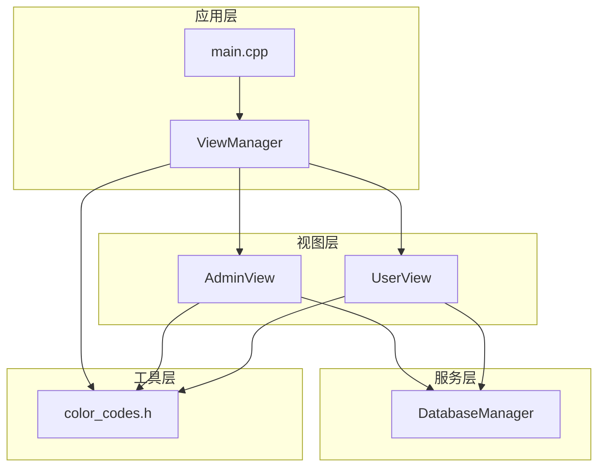

**图表来源**
- [main.cpp:1-12](file://src/main.cpp#L1-L12)
- [view_manager.cpp:1-73](file://src/view_manager.cpp#L1-L73)
- [admin_view.cpp:1-125](file://src/admin_view.cpp#L1-L125)
- [user_view.cpp:1-221](file://src/user_view.cpp#L1-L221)

**章节来源**
- [CMakeLists.txt:1-36](file://CMakeLists.txt#L1-L36)
- [README.md:1-2](file://README.md#L1-L2)

## 核心组件

### 颜色管理系统

颜色系统基于ANSI转义序列实现，提供标准化的颜色输出功能：

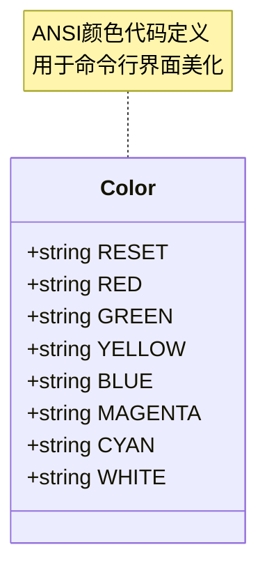

**图表来源**
- [color_codes.h:4-15](file://include/color_codes.h#L4-L15)

### 视图管理器

ViewManager作为主控制器，负责整体界面流程管理和角色切换：

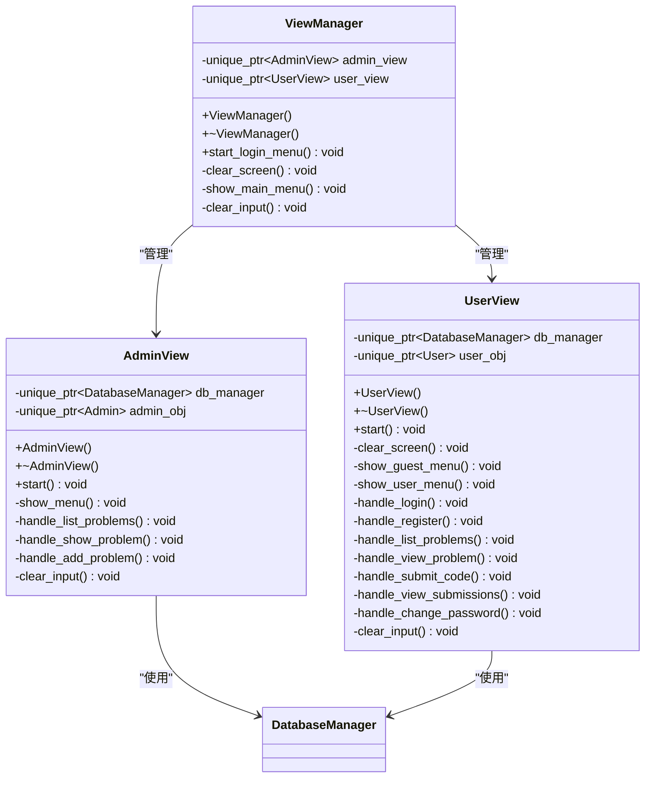

**图表来源**
- [view_manager.h:11-40](file://include/view_manager.h#L11-L40)
- [admin_view.h:11-50](file://include/admin_view.h#L11-L50)
- [user_view.h:11-80](file://include/user_view.h#L11-L80)

**章节来源**
- [view_manager.h:8-40](file://include/view_manager.h#L8-L40)
- [view_manager.cpp:12-73](file://src/view_manager.cpp#L12-L73)

## 架构概览

系统采用分层架构设计，实现了清晰的关注点分离：

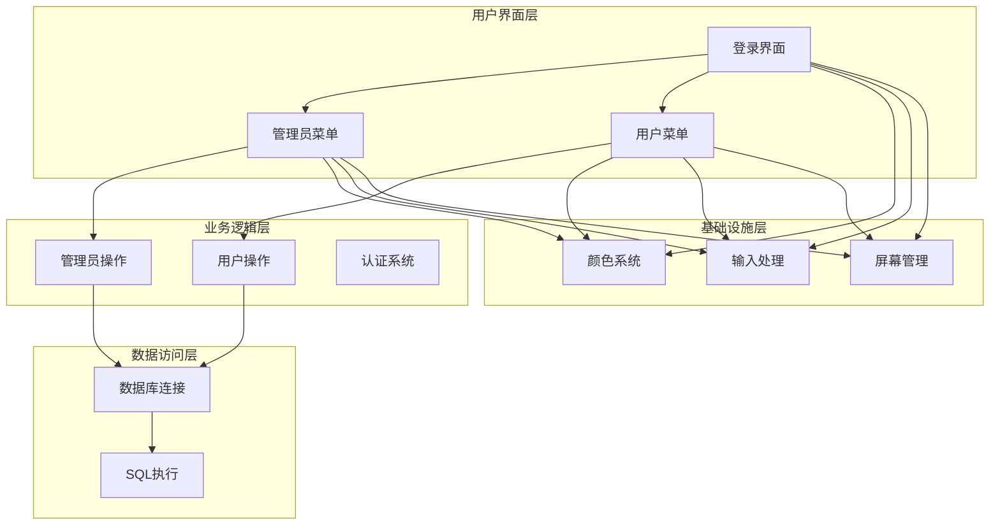

**图表来源**
- [main.cpp:3-8](file://src/main.cpp#L3-L8)
- [view_manager.cpp:28-66](file://src/view_manager.cpp#L28-L66)
- [admin_view.cpp:12-66](file://src/admin_view.cpp#L12-L66)
- [user_view.cpp:17-109](file://src/user_view.cpp#L17-L109)

## 详细组件分析

### 颜色输出系统

#### ANSI颜色代码实现

颜色系统通过命名空间Color提供统一的颜色常量：

| 颜色名称 | ANSI代码 | 用途 |
|---------|----------|------|
| RESET | `\033[0m` | 重置颜色 |
| RED | `\033[31m` | 错误提示 |
| GREEN | `\033[32m` | 成功状态 |
| YELLOW | `\033[33m` | 警告信息 |
| BLUE | `\033[34m` | 标题信息 |
| MAGENTA | `\033[35m` | 特殊强调 |
| CYAN | `\033[36m` | 一般文本 |
| WHITE | `\033[37m` | 默认文本 |

#### 颜色使用模式

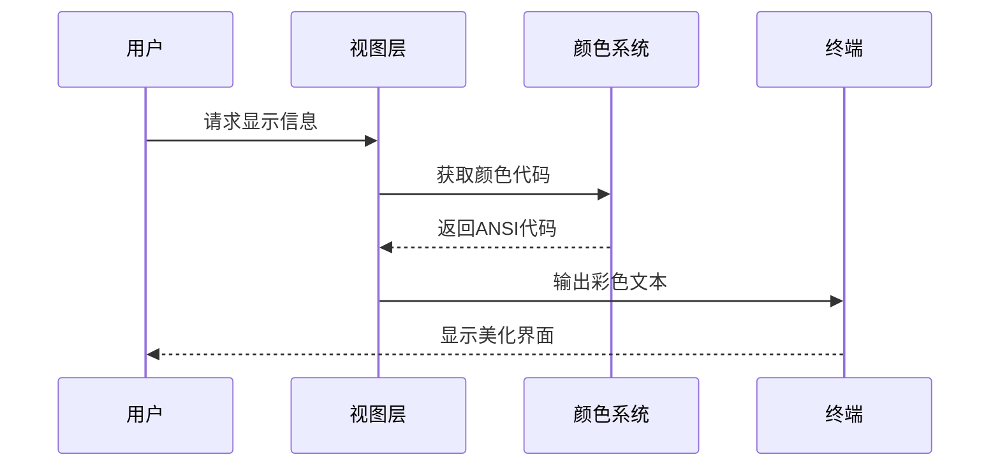

**图表来源**
- [color_codes.h:5-14](file://include/color_codes.h#L5-L14)
- [view_manager.cpp:19-25](file://src/view_manager.cpp#L19-L25)

**章节来源**
- [color_codes.h:1-18](file://include/color_codes.h#L1-L18)

### 清屏功能实现

系统提供了统一的清屏机制，确保界面整洁：

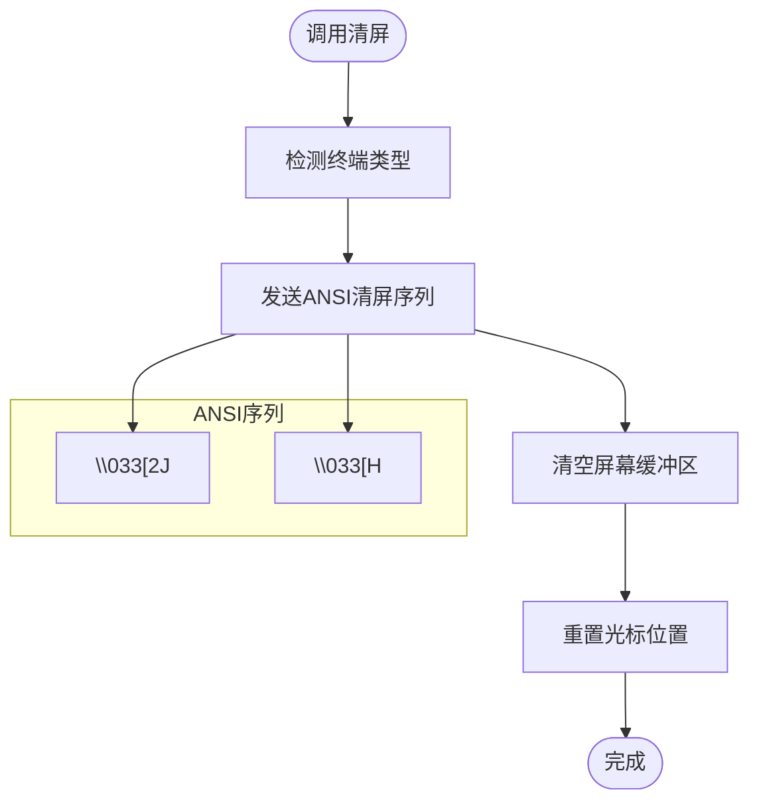

**图表来源**
- [view_manager.cpp:12-15](file://src/view_manager.cpp#L12-L15)
- [user_view.cpp:12-15](file://src/user_view.cpp#L12-L15)

#### 清屏实现细节

- **ANSI序列**: 使用`\033[2J`清空屏幕，`\033[H`将光标移动到左上角
- **跨平台兼容**: ANSI序列在大多数Unix-like系统和Windows 10+中有效
- **性能考虑**: 清屏操作相对轻量，适合频繁使用

**章节来源**
- [view_manager.cpp:12-15](file://src/view_manager.cpp#L12-L15)
- [user_view.cpp:12-15](file://src/user_view.cpp#L12-L15)

### 菜单导航系统

#### 主菜单设计

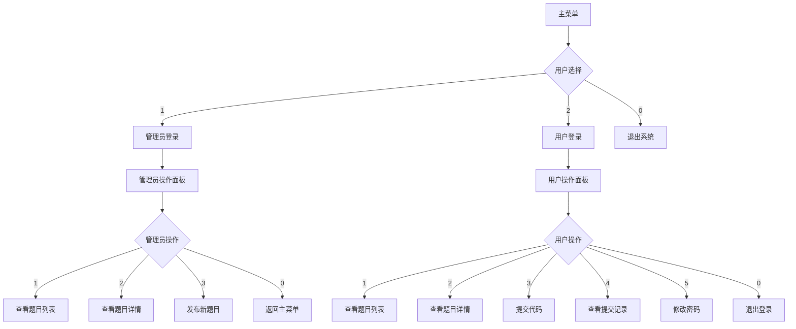

**图表来源**
- [view_manager.cpp:17-26](file://src/view_manager.cpp#L17-L26)
- [admin_view.cpp:68-79](file://src/admin_view.cpp#L68-L79)
- [user_view.cpp:111-136](file://src/user_view.cpp#L111-L136)

#### 菜单渲染机制

每个菜单都遵循统一的渲染模式：
- **标题装饰**: 使用绿色边框线突出显示
- **选项编号**: 便于快速选择
- **状态指示**: 根据用户登录状态动态显示

**章节来源**
- [view_manager.cpp:17-26](file://src/view_manager.cpp#L17-L26)
- [admin_view.cpp:68-79](file://src/admin_view.cpp#L68-L79)
- [user_view.cpp:111-136](file://src/user_view.cpp#L111-L136)

### 用户输入处理

#### 输入验证机制

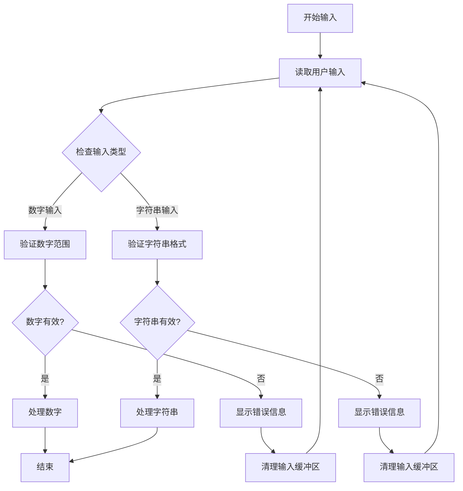

**图表来源**
- [view_manager.cpp:36-44](file://src/view_manager.cpp#L36-L44)
- [admin_view.cpp:28-36](file://src/admin_view.cpp#L28-L36)
- [user_view.cpp:42-50](file://src/user_view.cpp#L42-L50)

#### 输入缓冲区清理

系统实现了完善的输入缓冲区清理机制：

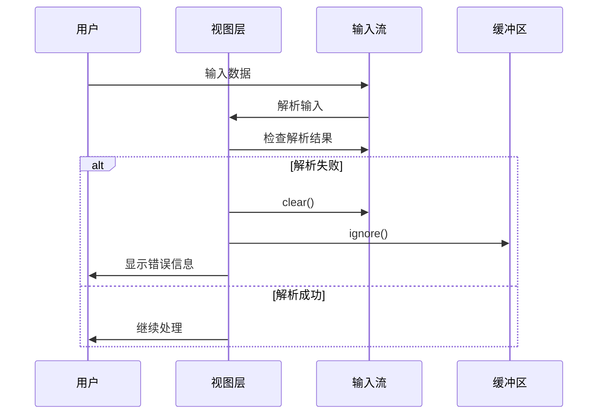

**图表来源**
- [view_manager.cpp:68-72](file://src/view_manager.cpp#L68-L72)
- [admin_view.cpp:120-124](file://src/admin_view.cpp#L120-L124)
- [user_view.cpp:216-220](file://src/user_view.cpp#L216-L220)

**章节来源**
- [view_manager.cpp:36-44](file://src/view_manager.cpp#L36-L44)
- [view_manager.cpp:68-72](file://src/view_manager.cpp#L68-L72)
- [admin_view.cpp:28-36](file://src/admin_view.cpp#L28-L36)
- [admin_view.cpp:120-124](file://src/admin_view.cpp#L120-L124)
- [user_view.cpp:42-50](file://src/user_view.cpp#L42-L50)
- [user_view.cpp:216-220](file://src/user_view.cpp#L216-L220)

### 错误处理与反馈机制

#### 错误分类与处理

| 错误类型 | 颜色标识 | 处理方式 | 用户反馈 |
|---------|---------|---------|---------|
| 输入验证错误 | 红色 | 清理缓冲区 | 显示错误信息 |
| 数据库连接失败 | 红色 | 断开连接 | 显示连接状态 |
| 操作执行失败 | 红色 | 记录错误日志 | 显示失败原因 |
| 成功操作 | 绿色 | 更新状态 | 显示成功消息 |
| 警告信息 | 黄色 | 提示用户 | 显示警告内容 |

#### 反馈机制设计

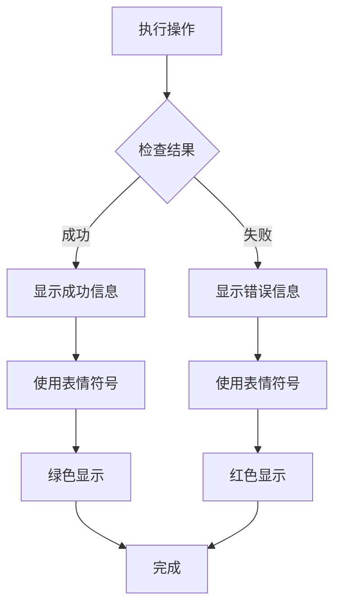

**图表来源**
- [view_manager.cpp:41-43](file://src/view_manager.cpp#L41-L43)
- [admin_view.cpp:63-65](file://src/admin_view.cpp#L63-L65)
- [user_view.cpp:106-108](file://src/user_view.cpp#L106-L108)

**章节来源**
- [view_manager.cpp:41-43](file://src/view_manager.cpp#L41-L43)
- [admin_view.cpp:63-65](file://src/admin_view.cpp#L63-L65)
- [admin_view.cpp:110-117](file://src/admin_view.cpp#L110-L117)
- [user_view.cpp:106-108](file://src/user_view.cpp#L106-L108)
- [user_view.cpp:145](file://src/user_view.cpp#L145)
- [user_view.cpp:155](file://src/user_view.cpp#L155)
- [user_view.cpp:213](file://src/user_view.cpp#L213)

## 依赖关系分析

### 外部依赖

系统主要依赖MySQL客户端库进行数据库操作：

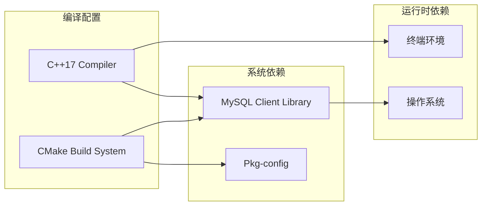

**图表来源**
- [CMakeLists.txt:11-31](file://CMakeLists.txt#L11-L31)

### 内部依赖关系

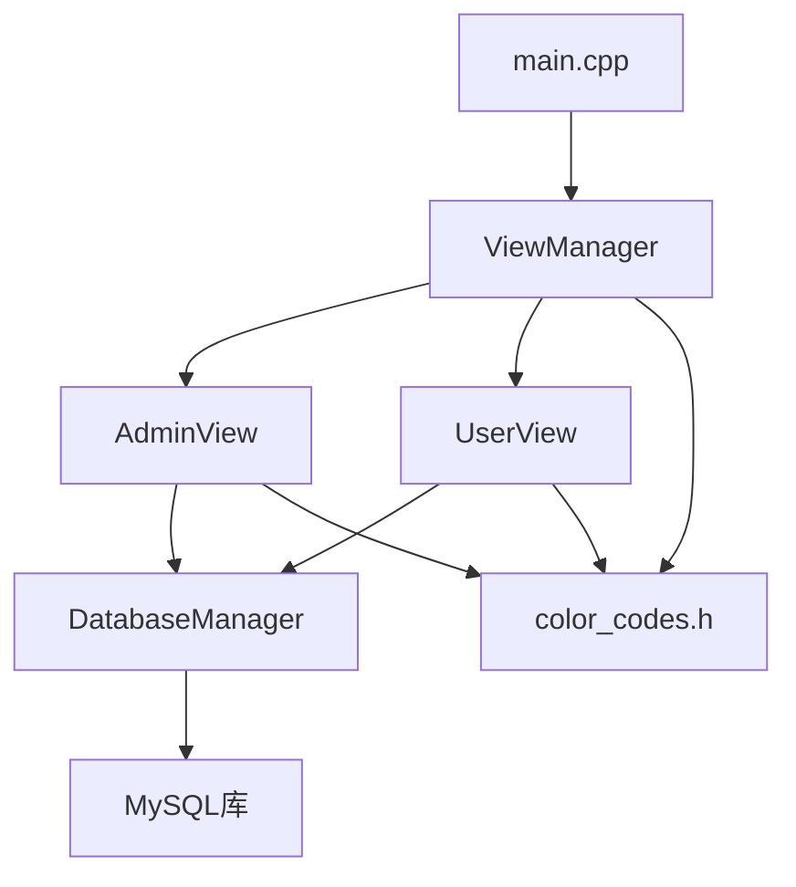

**图表来源**
- [main.cpp:1](file://src/main.cpp#L1)
- [view_manager.cpp:1](file://src/view_manager.cpp#L1)
- [admin_view.cpp:1](file://src/admin_view.cpp#L1)
- [user_view.cpp:1](file://src/user_view.cpp#L1)
- [db_manager.cpp:1](file://src/db_manager.cpp#L1)

**章节来源**
- [CMakeLists.txt:11-31](file://CMakeLists.txt#L11-L31)

## 性能考虑

### 界面渲染优化

1. **延迟加载**: 菜单和界面元素按需渲染，减少初始开销
2. **缓冲区管理**: 有效的输入缓冲区清理避免内存泄漏
3. **颜色缓存**: ANSI代码作为常量存储，避免重复计算

### 内存管理

- **智能指针**: 使用`std::unique_ptr`自动管理资源生命周期
- **RAII原则**: 确保数据库连接和对象在作用域结束时正确释放
- **异常安全**: 数据库连接失败时自动清理资源

### I/O性能

- **批量输出**: 菜单渲染使用连续的输出操作
- **最小化刷新**: 仅在必要时刷新屏幕内容
- **输入验证**: 实时验证用户输入，避免无效操作

## 故障排除指南

### 常见问题及解决方案

#### 颜色显示问题

**症状**: 屏幕显示ANSI代码而非彩色文本
**可能原因**:
- 终端不支持ANSI颜色
- 环境变量设置问题
- 终端类型不被识别

**解决方法**:
1. 检查终端是否支持ANSI颜色
2. 确认`TERM`环境变量设置正确
3. 尝试在不同终端中运行程序

#### 输入处理问题

**症状**: 程序卡在输入等待状态
**可能原因**:
- 输入缓冲区未正确清理
- 字符串输入处理错误
- 流状态异常

**解决方法**:
1. 确保调用`clear_input()`方法
2. 检查输入流的状态标志
3. 验证输入验证逻辑

#### 数据库连接问题

**症状**: 程序启动时数据库连接失败
**可能原因**:
- MySQL服务未启动
- 连接参数错误
- 权限不足

**解决方法**:
1. 检查MySQL服务状态
2. 验证主机、用户名、密码配置
3. 确认用户权限设置

**章节来源**
- [db_manager.cpp:105-124](file://src/db_manager.cpp#L105-L124)
- [view_manager.cpp:68-72](file://src/view_manager.cpp#L68-L72)
- [admin_view.cpp:120-124](file://src/admin_view.cpp#L120-L124)

## 结论

OJ系统的界面交互与美化功能展现了良好的工程实践：

### 设计优势

1. **模块化设计**: 清晰的职责分离使系统易于维护和扩展
2. **用户体验**: 通过颜色系统和友好的界面提升了用户交互质量
3. **错误处理**: 完善的输入验证和错误反馈机制提高了系统稳定性
4. **跨平台兼容**: 基于标准ANSI序列的颜色输出具有良好的兼容性

### 技术亮点

- **ANSI颜色系统**: 提供了丰富的视觉表达能力
- **智能输入处理**: 实现了健壮的用户输入验证机制
- **资源管理**: 使用现代C++特性确保内存安全
- **架构清晰**: 分层设计便于功能扩展和维护

### 改进建议

1. **主题系统**: 可以考虑实现可配置的主题系统
2. **国际化**: 添加多语言支持以服务更广泛的用户群体
3. **键盘快捷键**: 增加键盘快捷键支持提升操作效率
4. **响应式布局**: 根据终端大小动态调整界面布局

该系统为命令行应用程序的界面设计提供了优秀的参考范例，其设计理念和实现方式值得在类似项目中借鉴和学习。