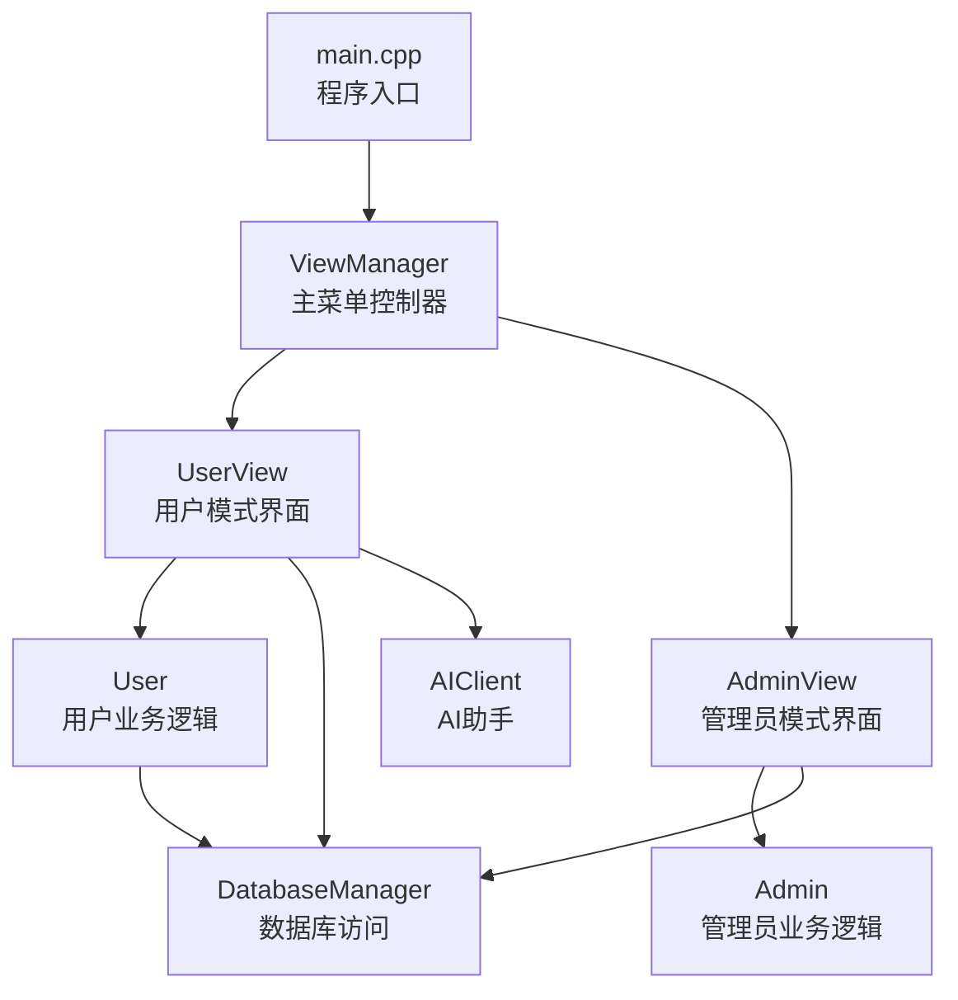
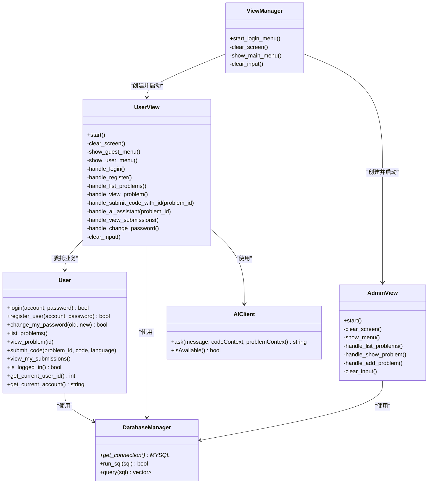
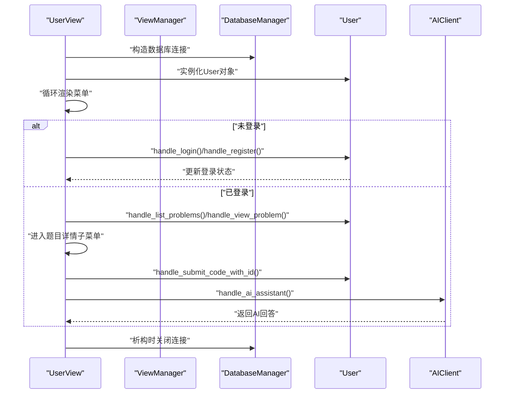
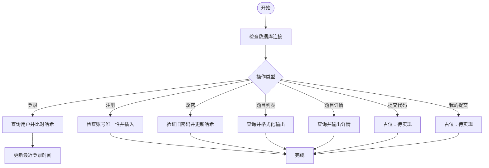
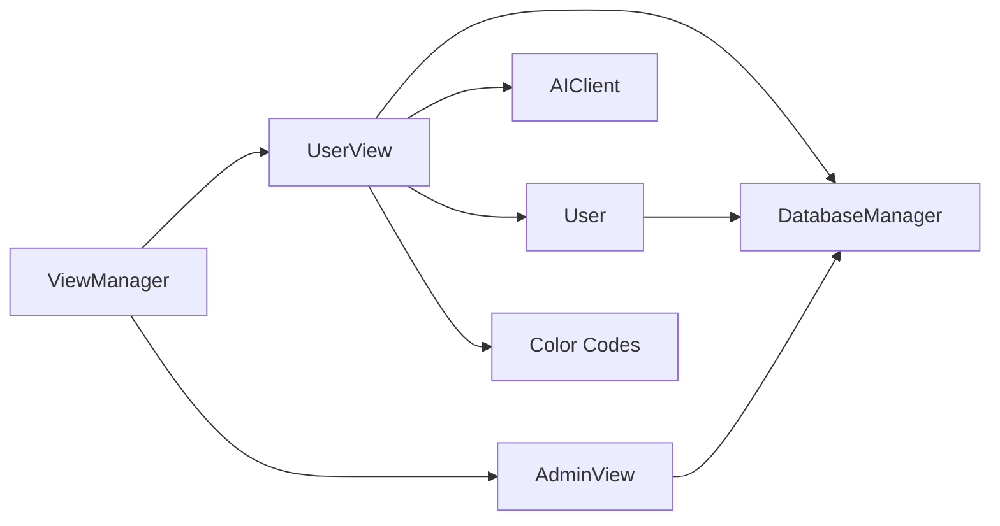

# 用户界面

<cite>
**本文引用的文件**
- [include/user_view.h](file://include/user_view.h)
- [src/user_view.cpp](file://src/user_view.cpp)
- [include/user.h](file://include/user.h)
- [src/user.cpp](file://src/user.cpp)
- [include/view_manager.h](file://include/view_manager.h)
- [src/view_manager.cpp](file://src/view_manager.cpp)
- [include/db_manager.h](file://include/db_manager.h)
- [src/db_manager.cpp](file://src/db_manager.cpp)
- [include/admin_view.h](file://include/admin_view.h)
- [src/admin_view.cpp](file://src/admin_view.cpp)
- [include/ai_client.h](file://include/ai_client.h)
- [src/ai_client.cpp](file://src/ai_client.cpp)
- [include/color_codes.h](file://include/color_codes.h)
- [src/main.cpp](file://src/main.cpp)
- [init.sql](file://init.sql)
</cite>

## 目录
1. [简介](#简介)
2. [项目结构](#项目结构)
3. [核心组件](#核心组件)
4. [架构总览](#架构总览)
5. [详细组件分析](#详细组件分析)
6. [依赖关系分析](#依赖关系分析)
7. [性能考虑](#性能考虑)
8. [故障排查指南](#故障排查指南)
9. [结论](#结论)
10. [附录](#附录)

## 简介
本文件面向OJ系统的用户界面，围绕UserView类的设计理念与实现架构展开，系统性阐述用户菜单设计、功能导航与交互体验优化。文档覆盖用户界面的核心功能流程：题目浏览、题目详情与代码提交、历史记录查看、个人设置管理；同时说明认证状态管理、界面响应机制与错误处理策略，并提供个性化定制方案（主题、布局与功能扩展）以及最佳实践与优化建议，帮助开发者高效完成用户界面的开发与维护。

## 项目结构
本项目采用“分层+职责分离”的组织方式：
- 视图层：ViewManager负责主菜单与角色入口；UserView负责用户模式的菜单与交互；AdminView负责管理员模式。
- 业务层：User封装普通用户的业务逻辑（登录、注册、密码修改、题目浏览、提交、历史记录等）。
- 数据访问层：DatabaseManager封装MySQL连接与SQL执行。
- AI集成：AIClient封装Python侧AI服务调用。
- 入口：main.cpp启动ViewManager，引导用户进入相应模式。

图表来源
- [src/main.cpp:1-14](file://src/main.cpp#L1-L14)
- [src/view_manager.cpp:1-77](file://src/view_manager.cpp#L1-L77)
- [include/view_manager.h:1-43](file://include/view_manager.h#L1-L43)
- [include/user_view.h:1-92](file://include/user_view.h#L1-L92)
- [src/user_view.cpp:1-395](file://src/user_view.cpp#L1-L395)
- [include/user.h:1-89](file://include/user.h#L1-L89)
- [src/user.cpp:1-286](file://src/user.cpp#L1-L286)
- [include/db_manager.h:1-53](file://include/db_manager.h#L1-L53)
- [src/db_manager.cpp:1-100](file://src/db_manager.cpp#L1-L100)
- [include/admin_view.h:1-58](file://include/admin_view.h#L1-L58)
- [src/admin_view.cpp:1-138](file://src/admin_view.cpp#L1-L138)
- [include/ai_client.h:1-28](file://include/ai_client.h#L1-L28)
- [src/ai_client.cpp:1-124](file://src/ai_client.cpp#L1-L124)

章节来源
- [src/main.cpp:1-14](file://src/main.cpp#L1-L14)
- [src/view_manager.cpp:1-77](file://src/view_manager.cpp#L1-L77)
- [include/view_manager.h:1-43](file://include/view_manager.h#L1-L43)

## 核心组件
- UserView：用户模式的界面控制器，负责菜单展示、输入处理、状态切换与功能分发。
- User：封装用户业务逻辑，包括认证、密码修改、题目浏览、提交与历史记录查看。
- DatabaseManager：封装MySQL连接、查询与执行，提供统一的数据访问接口。
- AIClient：封装Python侧AI服务调用，支持会话、消息传递与上下文注入。
- ViewManager：系统入口控制器，提供主菜单与角色选择，协调用户/管理员模式的生命周期。

章节来源
- [include/user_view.h:1-92](file://include/user_view.h#L1-L92)
- [src/user_view.cpp:1-395](file://src/user_view.cpp#L1-L395)
- [include/user.h:1-89](file://include/user.h#L1-L89)
- [src/user.cpp:1-286](file://src/user.cpp#L1-L286)
- [include/db_manager.h:1-53](file://include/db_manager.h#L1-L53)
- [src/db_manager.cpp:1-100](file://src/db_manager.cpp#L1-L100)
- [include/ai_client.h:1-28](file://include/ai_client.h#L1-L28)
- [src/ai_client.cpp:1-124](file://src/ai_client.cpp#L1-L124)
- [include/view_manager.h:1-43](file://include/view_manager.h#L1-L43)
- [src/view_manager.cpp:1-77](file://src/view_manager.cpp#L1-L77)

## 架构总览
用户界面采用“视图-业务-数据”三层架构：
- 视图层：UserView/AdminView负责UI呈现与用户输入解析。
- 业务层：User/Admin封装领域逻辑，调用DatabaseManager执行数据库操作。
- 数据层：DatabaseManager基于MySQL C API封装连接与查询。
- AI集成：AIClient通过进程调用Python脚本，实现代码与题目上下文的智能问答。

图表来源
- [include/view_manager.h:1-43](file://include/view_manager.h#L1-L43)
- [src/view_manager.cpp:1-77](file://src/view_manager.cpp#L1-L77)
- [include/user_view.h:1-92](file://include/user_view.h#L1-L92)
- [src/user_view.cpp:1-395](file://src/user_view.cpp#L1-L395)
- [include/user.h:1-89](file://include/user.h#L1-L89)
- [src/user.cpp:1-286](file://src/user.cpp#L1-L286)
- [include/db_manager.h:1-53](file://include/db_manager.h#L1-L53)
- [src/db_manager.cpp:1-100](file://src/db_manager.cpp#L1-L100)
- [include/admin_view.h:1-58](file://include/admin_view.h#L1-L58)
- [src/admin_view.cpp:1-138](file://src/admin_view.cpp#L1-L138)
- [include/ai_client.h:1-28](file://include/ai_client.h#L1-L28)
- [src/ai_client.cpp:1-124](file://src/ai_client.cpp#L1-L124)

## 详细组件分析

### UserView：用户模式界面控制器
设计理念
- 单一职责：集中处理用户模式的菜单、输入、状态切换与功能分发。
- 状态驱动：根据User对象的登录状态决定显示菜单与可执行操作。
- 可扩展性：新增功能通过新增处理函数与菜单项即可接入。

关键流程
- 启动流程：建立数据库连接，实例化User与AIClient，循环渲染菜单并处理用户输入。
- 未登录菜单：登录、注册、返回主菜单。
- 已登录菜单：题目列表、题目详情、我的提交、修改密码、退出登录。
- 题目详情子菜单：提交代码、AI助手、返回用户模式。

交互与错误处理
- 输入校验：对非数字输入进行清理与提示；对空输入与非法选项给出明确反馈。
- 清屏与颜色：使用ANSI转义序列清屏与着色，提升可读性与一致性。
- AI助手：检查服务可用性，读取工作区代码，组合题目信息，循环问答直至退出。

图表来源
- [src/user_view.cpp:36-131](file://src/user_view.cpp#L36-L131)
- [src/user_view.cpp:133-157](file://src/user_view.cpp#L133-L157)
- [src/user_view.cpp:159-211](file://src/user_view.cpp#L159-L211)
- [src/user_view.cpp:213-274](file://src/user_view.cpp#L213-L274)
- [src/user_view.cpp:276-288](file://src/user_view.cpp#L276-L288)
- [src/user_view.cpp:290-354](file://src/user_view.cpp#L290-L354)
- [src/user_view.cpp:356-388](file://src/user_view.cpp#L356-L388)
- [src/user_view.cpp:390-394](file://src/user_view.cpp#L390-L394)
- [src/db_manager.cpp:8-19](file://src/db_manager.cpp#L8-L19)

章节来源
- [include/user_view.h:12-89](file://include/user_view.h#L12-L89)
- [src/user_view.cpp:25-131](file://src/user_view.cpp#L25-L131)
- [src/user_view.cpp:133-157](file://src/user_view.cpp#L133-L157)
- [src/user_view.cpp:159-211](file://src/user_view.cpp#L159-L211)
- [src/user_view.cpp:213-274](file://src/user_view.cpp#L213-L274)
- [src/user_view.cpp:276-288](file://src/user_view.cpp#L276-L288)
- [src/user_view.cpp:290-354](file://src/user_view.cpp#L290-L354)
- [src/user_view.cpp:356-388](file://src/user_view.cpp#L356-L388)
- [src/user_view.cpp:390-394](file://src/user_view.cpp#L390-L394)

### User：用户业务逻辑封装
职责范围
- 认证：登录、注册、修改密码（含SHA256哈希）。
- 题目：列出题目、查看题目详情。
- 提交与历史：提交代码占位、查看我的提交占位。
- 状态：维护当前用户ID、账号与登录状态。

实现要点
- 登录流程：查询用户表，比对SHA256哈希，更新最近登录时间。
- 注册流程：检查账号唯一性，生成哈希后写入用户表。
- 密码修改：验证旧密码哈希，更新为新哈希。
- 题目列表：UTF-8中文宽度计算与安全截断，确保终端显示不乱码。
- 提交与历史：当前为占位，后续可接入评测队列与结果查询。

图表来源
- [src/user.cpp:39-71](file://src/user.cpp#L39-L71)
- [src/user.cpp:73-98](file://src/user.cpp#L73-L98)
- [src/user.cpp:100-137](file://src/user.cpp#L100-L137)
- [src/user.cpp:139-233](file://src/user.cpp#L139-L233)
- [src/user.cpp:235-262](file://src/user.cpp#L235-L262)
- [src/user.cpp:264-285](file://src/user.cpp#L264-L285)

章节来源
- [include/user.h:10-86](file://include/user.h#L10-L86)
- [src/user.cpp:11-137](file://src/user.cpp#L11-L137)
- [src/user.cpp:139-262](file://src/user.cpp#L139-L262)
- [src/user.cpp:264-285](file://src/user.cpp#L264-L285)

### DatabaseManager：数据库访问层
职责范围
- 连接管理：初始化、连接、关闭。
- 查询执行：执行查询并返回结果集，执行SQL并处理错误。
- 错误处理：统一输出错误信息，避免崩溃。

实现要点
- 连接参数：主机、用户名、密码、数据库名。
- 查询封装：字段名映射到map，逐行收集结果。
- 执行封装：自动释放结果集，返回布尔状态。

章节来源
- [include/db_manager.h:12-46](file://include/db_manager.h#L12-L46)
- [src/db_manager.cpp:8-57](file://src/db_manager.cpp#L8-L57)
- [src/db_manager.cpp:81-99](file://src/db_manager.cpp#L81-L99)

### AIClient：AI助手客户端
职责范围
- 会话与消息：支持带会话ID的消息请求。
- 上下文注入：支持代码上下文与题目信息注入。
- 可用性检测：检查Python解释器与脚本文件是否存在。

实现要点
- 路径探测：优先使用项目内虚拟环境，其次回退到构建目录相对路径。
- 参数转义：对特殊字符进行转义，避免命令行解析错误。
- 进程执行：通过管道捕获Python脚本输出，处理空响应与错误提示。

章节来源
- [include/ai_client.h:6-25](file://include/ai_client.h#L6-L25)
- [src/ai_client.cpp:8-23](file://src/ai_client.cpp#L8-L23)
- [src/ai_client.cpp:56-83](file://src/ai_client.cpp#L56-L83)
- [src/ai_client.cpp:85-112](file://src/ai_client.cpp#L85-L112)
- [src/ai_client.cpp:114-123](file://src/ai_client.cpp#L114-L123)

### ViewManager：主菜单控制器
职责范围
- 主菜单：管理员进入、用户进入、退出系统。
- 生命周期：创建并启动对应模式，结束后回收资源。

章节来源
- [include/view_manager.h:11-40](file://include/view_manager.h#L11-L40)
- [src/view_manager.cpp:14-70](file://src/view_manager.cpp#L14-L70)

## 依赖关系分析
- UserView依赖User、DatabaseManager、AIClient与颜色常量。
- User依赖DatabaseManager与加密库（SHA256）。
- AdminView依赖Admin与DatabaseManager。
- DatabaseManager依赖MySQL C API。
- AIClient依赖Python解释器与脚本文件。

图表来源
- [include/user_view.h:4-6](file://include/user_view.h#L4-L6)
- [src/user_view.cpp:1-7](file://src/user_view.cpp#L1-L7)
- [include/user.h:4](file://include/user.h#L4)
- [include/admin_view.h:4](file://include/admin_view.h#L4)
- [include/view_manager.h:4](file://include/view_manager.h#L4)
- [include/color_codes.h:5-15](file://include/color_codes.h#L5-L15)

章节来源
- [include/user_view.h:4-6](file://include/user_view.h#L4-L6)
- [src/user_view.cpp:1-7](file://src/user_view.cpp#L1-L7)
- [include/user.h:4](file://include/user.h#L4)
- [include/admin_view.h:4](file://include/admin_view.h#L4)
- [include/view_manager.h:4](file://include/view_manager.h#L4)
- [include/color_codes.h:5-15](file://include/color_codes.h#L5-L15)

## 性能考虑
- 终端渲染：大量题目列表输出时，建议分页或延迟加载，减少一次性渲染压力。
- 数据库查询：题目列表与详情查询应使用索引字段，避免全表扫描；批量输出时注意网络往返次数。
- AI调用：Python进程启动成本较高，建议引入会话复用与缓存策略，避免频繁重启。
- 输入处理：对非数字输入及时清理，避免阻塞流；长文本输入建议分块处理。
- 加密开销：SHA256在高频场景下可考虑硬件加速或缓存热点哈希。

## 故障排查指南
常见问题与定位
- 数据库连接失败：检查主机、用户名、密码与数据库名；确认MySQL服务运行与网络连通。
- 用户认证失败：确认账号存在、密码哈希一致；检查SHA256生成逻辑与存储格式。
- 题目列表乱码：关注UTF-8宽度计算与截断逻辑，确保终端编码为UTF-8。
- AI服务不可用：检查Python解释器路径与脚本文件是否存在；确认网络与API Key配置。
- 输入异常：确认输入缓冲区清理与异常分支处理，避免死循环或悬挂输入。

章节来源
- [src/db_manager.cpp:61-79](file://src/db_manager.cpp#L61-L79)
- [src/db_manager.cpp:81-99](file://src/db_manager.cpp#L81-L99)
- [src/user.cpp:39-71](file://src/user.cpp#L39-L71)
- [src/user.cpp:139-233](file://src/user.cpp#L139-L233)
- [src/ai_client.cpp:114-123](file://src/ai_client.cpp#L114-L123)
- [src/user_view.cpp:62-69](file://src/user_view.cpp#L62-L69)

## 结论
UserView作为用户界面的核心控制器，通过清晰的状态机与菜单分发，实现了从认证到题目浏览、提交与AI辅助的完整闭环。配合User的业务封装与DatabaseManager的稳定数据访问，系统具备良好的可扩展性与可维护性。建议后续完善提交与历史记录的具体实现，并引入更多交互优化与个性化配置能力。

## 附录

### 用户界面功能一览与流程
- 登录/注册/退出登录：在游客菜单中完成，成功后进入用户模式。
- 题目浏览：查看题目列表，支持中文标题安全截断与对齐。
- 题目详情：查看题目描述、限制与分类；支持提交代码与AI助手。
- 我的提交：查看个人提交记录（占位）。
- 修改密码：验证旧密码并更新为新密码哈希。

章节来源
- [src/user_view.cpp:133-157](file://src/user_view.cpp#L133-L157)
- [src/user_view.cpp:213-274](file://src/user_view.cpp#L213-L274)
- [src/user_view.cpp:276-288](file://src/user_view.cpp#L276-L288)
- [src/user_view.cpp:290-354](file://src/user_view.cpp#L290-L354)
- [src/user_view.cpp:356-388](file://src/user_view.cpp#L356-L388)
- [src/user.cpp:139-262](file://src/user.cpp#L139-L262)
- [src/user.cpp:264-285](file://src/user.cpp#L264-L285)

### 数据模型概览（与界面相关的表）
- 用户表：存储账号、密码哈希、统计与登录时间。
- 题目表：存储题目标题、描述、限制与分类。
- 提交记录表：存储用户提交、题目、代码与评测状态。

章节来源
- [init.sql:26-39](file://init.sql#L26-L39)
- [init.sql:14-24](file://init.sql#L14-L24)
- [init.sql:41-61](file://init.sql#L41-L61)