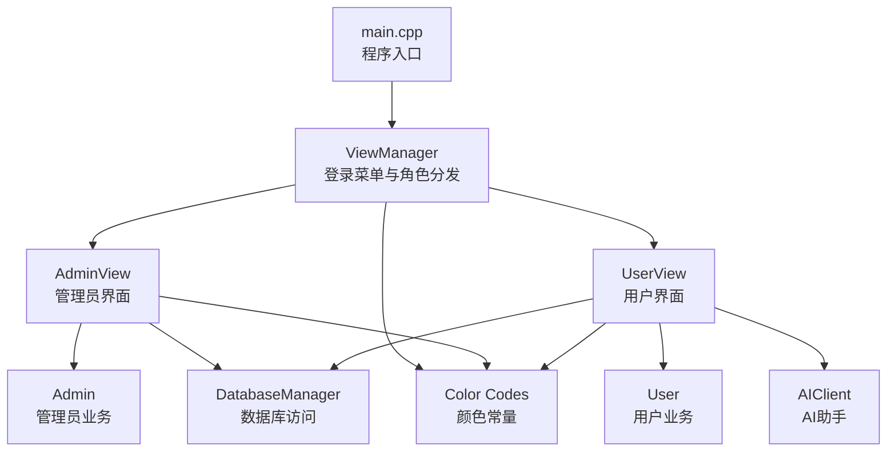
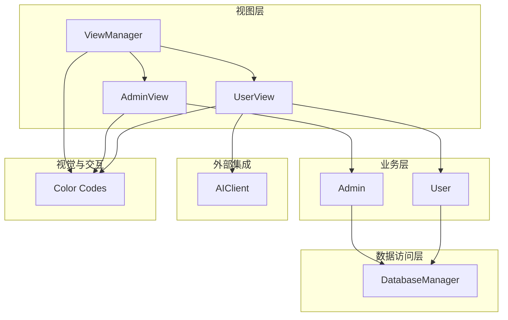
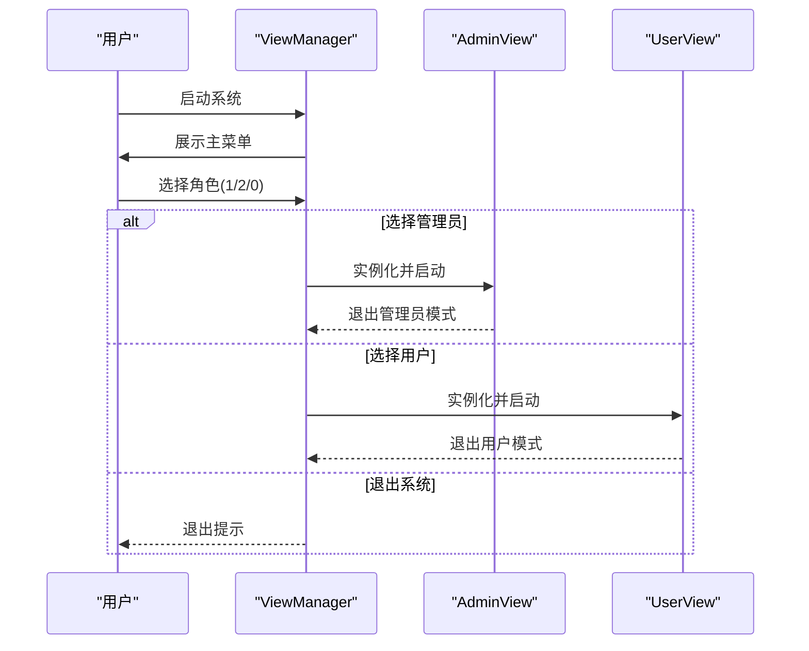
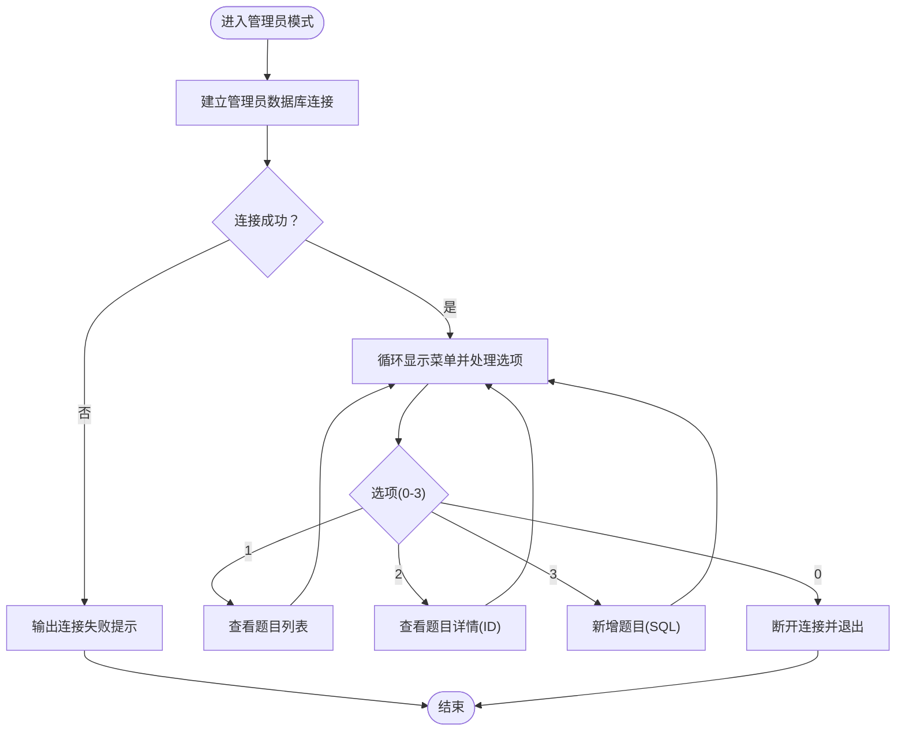
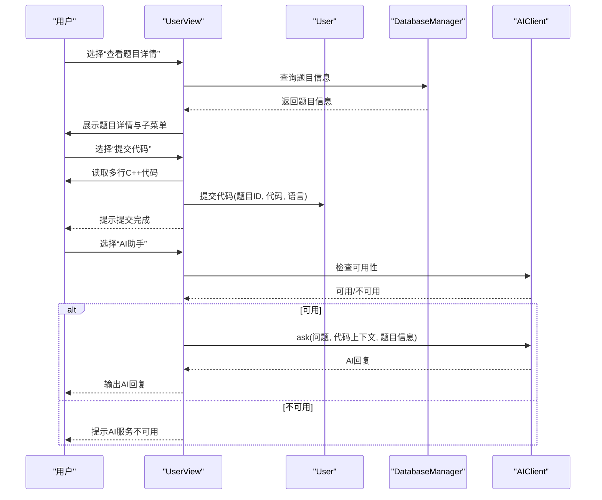
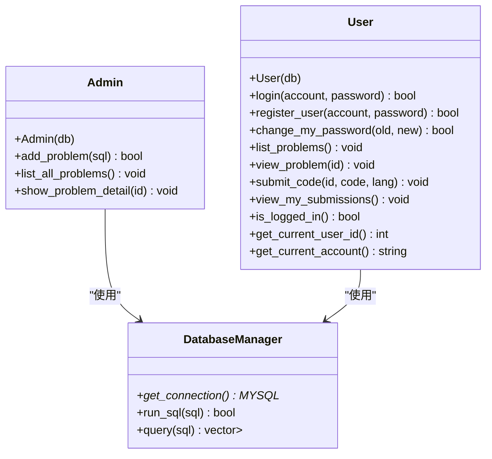
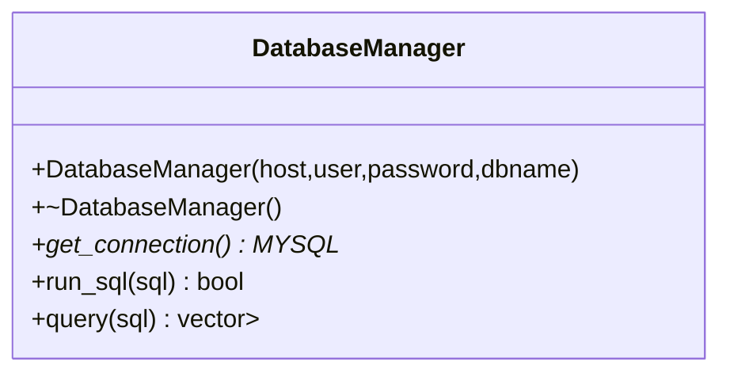
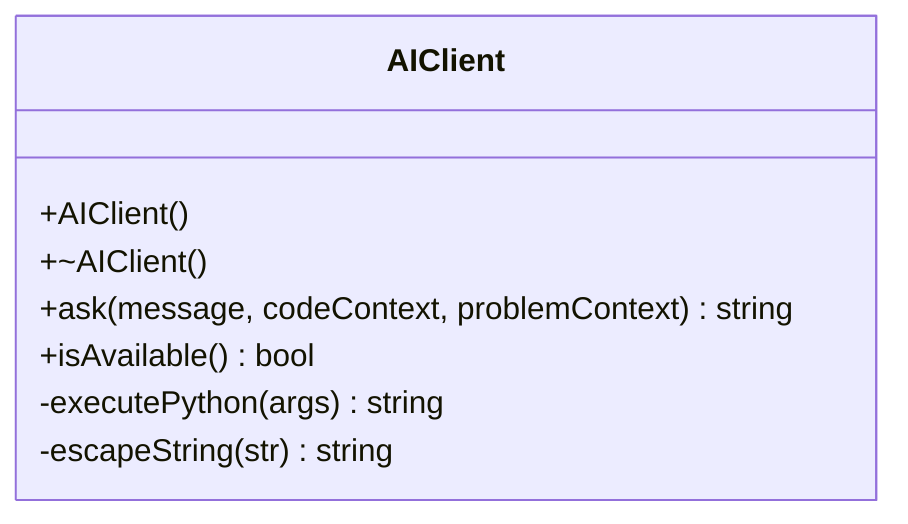
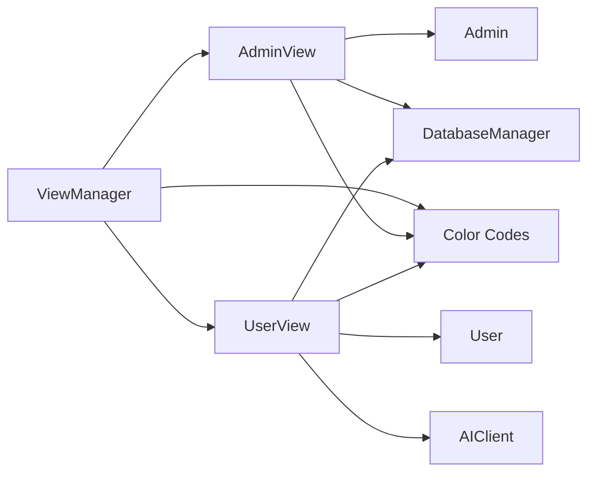

# 界面系统设计

<cite>
**本文引用的文件**
- [main.cpp](file://src/main.cpp)
- [view_manager.h](file://include/view_manager.h)
- [view_manager.cpp](file://src/view_manager.cpp)
- [admin_view.h](file://include/admin_view.h)
- [admin_view.cpp](file://src/admin_view.cpp)
- [user_view.h](file://include/user_view.h)
- [user_view.cpp](file://src/user_view.cpp)
- [admin.h](file://include/admin.h)
- [user.h](file://include/user.h)
- [db_manager.h](file://include/db_manager.h)
- [db_manager.cpp](file://src/db_manager.cpp)
- [ai_client.h](file://include/ai_client.h)
- [color_codes.h](file://include/color_codes.h)
</cite>

## 目录
1. [引言](#引言)
2. [项目结构](#项目结构)
3. [核心组件](#核心组件)
4. [架构总览](#架构总览)
5. [详细组件分析](#详细组件分析)
6. [依赖关系分析](#依赖关系分析)
7. [性能考虑](#性能考虑)
8. [故障排查指南](#故障排查指南)
9. [结论](#结论)
10. [附录](#附录)

## 引言
本文件面向OJ系统的界面交互设计，聚焦管理员界面与用户界面的设计理念、菜单布局、交互流程与用户体验优化。文档深入解析AdminView与UserView类的实现细节，包括界面渲染、用户输入处理、状态管理与错误提示机制；阐述不同角色界面的差异化设计与权限控制实现；给出界面元素的视觉设计规范与交互模式说明，并提供界面扩展与定制化技术方案，为前端界面开发提供指导。

## 项目结构
系统采用命令行界面（CLI）架构，入口位于main.cpp，通过ViewManager统一调度管理员与用户两种视图模式。AdminView与UserView分别封装管理员与用户场景下的菜单、输入处理与业务调用；Admin与User类承载具体业务逻辑；DatabaseManager负责数据库连接与SQL执行；AIClient提供AI问答能力；color_codes.h提供ANSI颜色常量以增强可读性与体验。

图表来源
- [main.cpp:1-14](file://src/main.cpp#L1-L14)
- [view_manager.cpp:32-70](file://src/view_manager.cpp#L32-L70)
- [admin_view.cpp:21-76](file://src/admin_view.cpp#L21-L76)
- [user_view.cpp:36-131](file://src/user_view.cpp#L36-L131)
- [admin.h:10-37](file://include/admin.h#L10-L37)
- [user.h:10-86](file://include/user.h#L10-L86)
- [db_manager.h:12-46](file://include/db_manager.h#L12-L46)
- [ai_client.h:6-25](file://include/ai_client.h#L6-L25)
- [color_codes.h:4-15](file://include/color_codes.h#L4-L15)

章节来源
- [main.cpp:1-14](file://src/main.cpp#L1-L14)
- [view_manager.h:11-40](file://include/view_manager.h#L11-L40)
- [view_manager.cpp:32-70](file://src/view_manager.cpp#L32-L70)

## 核心组件
- ViewManager：命令行主控制器，负责登录菜单展示与角色选择，根据用户选择实例化并启动AdminView或UserView。
- AdminView：管理员模式界面，提供题目列表查看、题目详情查看、新增题目（SQL直连）等管理功能。
- UserView：用户模式界面，支持游客态（登录/注册）与登录态（题目浏览、提交、查看提交记录、修改密码），并集成AI助手。
- Admin/User：封装管理员与用户业务逻辑，如登录、注册、查看题目、提交代码、修改密码等。
- DatabaseManager：封装MySQL连接、SQL执行与查询结果集返回。
- AIClient：封装AI问答能力，支持传入代码上下文与题目信息进行智能问答。
- Color Codes：提供ANSI颜色常量，用于界面高亮与提示。

章节来源
- [view_manager.h:11-40](file://include/view_manager.h#L11-L40)
- [admin_view.h:11-55](file://include/admin_view.h#L11-L55)
- [user_view.h:12-89](file://include/user_view.h#L12-L89)
- [admin.h:10-37](file://include/admin.h#L10-L37)
- [user.h:10-86](file://include/user.h#L10-L86)
- [db_manager.h:12-46](file://include/db_manager.h#L12-L46)
- [ai_client.h:6-25](file://include/ai_client.h#L6-L25)
- [color_codes.h:4-15](file://include/color_codes.h#L4-L15)

## 架构总览
系统采用“视图层-业务层-数据访问层”的分层架构：
- 视图层：ViewManager、AdminView、UserView负责界面渲染与用户交互。
- 业务层：Admin、User封装业务规则与流程控制。
- 数据访问层：DatabaseManager封装数据库连接与SQL执行。
- 外部集成：AIClient通过Python脚本提供AI问答能力。
- 视觉与交互：color_codes.h提供颜色常量，ANSI转义序列实现清屏与高亮。

图表来源
- [view_manager.cpp:32-70](file://src/view_manager.cpp#L32-L70)
- [admin_view.cpp:21-76](file://src/admin_view.cpp#L21-L76)
- [user_view.cpp:36-131](file://src/user_view.cpp#L36-L131)
- [admin.h:10-37](file://include/admin.h#L10-L37)
- [user.h:10-86](file://include/user.h#L10-L86)
- [db_manager.h:12-46](file://include/db_manager.h#L12-L46)
- [ai_client.h:6-25](file://include/ai_client.h#L6-L25)
- [color_codes.h:4-15](file://include/color_codes.h#L4-L15)

## 详细组件分析

### ViewManager（登录菜单与角色分发）
- 职责：展示主菜单，接收用户角色选择，实例化并启动对应视图，处理退出逻辑。
- 关键点：
  - 清屏与主菜单渲染使用ANSI转义与颜色常量提升可读性。
  - 输入校验与异常处理：非数字输入时清空缓冲区并提示。
  - 角色分发：选择1进入管理员模式，选择2进入用户模式，选择0退出系统。

图表来源
- [view_manager.cpp:32-70](file://src/view_manager.cpp#L32-L70)
- [view_manager.h:23-24](file://include/view_manager.h#L23-L24)
- [admin_view.h:20](file://include/admin_view.h#L20)
- [user_view.h:21](file://include/user_view.h#L21)

章节来源
- [view_manager.h:11-40](file://include/view_manager.h#L11-L40)
- [view_manager.cpp:21-70](file://src/view_manager.cpp#L21-L70)

### AdminView（管理员界面）
- 职责：管理员模式的菜单展示与操作处理，包括题目列表查看、题目详情查看、新增题目（SQL直连）。
- 关键点：
  - 独立数据库连接（管理员账号），连接成功后进入循环菜单。
  - 菜单循环：1查看题目列表、2查看题目详情、3新增题目、0返回登录菜单。
  - 输入校验与错误提示：非数字输入清空缓冲区并提示；新增题目时对空SQL进行校验。
  - 清屏与颜色高亮：使用ANSI转义与颜色常量美化界面。
  - 退出清理：重置对象指针，断开数据库连接。

图表来源
- [admin_view.cpp:21-76](file://src/admin_view.cpp#L21-L76)
- [admin_view.cpp:78-89](file://src/admin_view.cpp#L78-L89)
- [admin_view.cpp:91-131](file://src/admin_view.cpp#L91-L131)

章节来源
- [admin_view.h:11-55](file://include/admin_view.h#L11-L55)
- [admin_view.cpp:21-138](file://src/admin_view.cpp#L21-L138)

### UserView（用户界面）
- 职责：用户模式的菜单展示与操作处理，支持游客态与登录态，提供题目浏览、提交、查看提交记录、修改密码与AI助手。
- 关键点：
  - 双态菜单：未登录时显示登录/注册菜单；登录后显示用户菜单。
  - 输入处理：登录/注册/改密均支持“0”快速返回；题目详情页提供“提交代码/AI助手/返回”子菜单。
  - 代码提交：支持多行C++代码输入，以特定结束符标记结束。
  - AI助手：检查可用性、读取工作区代码、拼装题目信息，与AIClient交互。
  - 错误提示与清屏：统一使用ANSI转义与颜色常量，非数字输入清空缓冲区并提示。
  - 退出清理：重置对象指针，断开数据库连接。

图表来源
- [user_view.cpp:213-274](file://src/user_view.cpp#L213-L274)
- [user_view.cpp:276-288](file://src/user_view.cpp#L276-L288)
- [user_view.cpp:290-354](file://src/user_view.cpp#L290-L354)
- [user.h:44-64](file://include/user.h#L44-L64)
- [db_manager.h:35-42](file://include/db_manager.h#L35-L42)
- [ai_client.h:12-16](file://include/ai_client.h#L12-L16)

章节来源
- [user_view.h:12-89](file://include/user_view.h#L12-L89)
- [user_view.cpp:36-395](file://src/user_view.cpp#L36-L395)

### Admin与User（业务逻辑）
- Admin：封装管理员业务，包括新增题目（执行SQL）、查看题目列表、查看题目详情。
- User：封装用户业务，包括登录、注册、修改密码、查看题目、提交代码、查看个人提交记录；提供登录状态、当前用户ID与账号查询接口。

图表来源
- [admin.h:10-37](file://include/admin.h#L10-L37)
- [user.h:10-86](file://include/user.h#L10-L86)
- [db_manager.h:12-46](file://include/db_manager.h#L12-L46)

章节来源
- [admin.h:10-37](file://include/admin.h#L10-L37)
- [user.h:10-86](file://include/user.h#L10-L86)

### DatabaseManager（数据访问）
- 职责：封装MySQL连接、SQL执行与查询结果集返回；提供连接句柄获取与查询接口。
- 关键点：构造函数建立连接，析构释放资源；run_sql执行非查询语句；query执行查询并返回结构化结果。

图表来源
- [db_manager.h:12-46](file://include/db_manager.h#L12-L46)

章节来源
- [db_manager.h:12-46](file://include/db_manager.h#L12-L46)
- [db_manager.cpp](file://src/db_manager.cpp)

### AIClient（AI助手）
- 职责：封装AI问答能力，支持检查可用性、发起提问并返回回答；内部封装Python脚本调用与字符串转义。
- 关键点：构造与析构、ask接口、isAvailable接口；executePython与escapeString用于与Python脚本交互。

图表来源
- [ai_client.h:6-25](file://include/ai_client.h#L6-L25)

章节来源
- [ai_client.h:6-25](file://include/ai_client.h#L6-L25)

### 视觉设计规范与交互模式
- 颜色规范：使用Color命名空间中的ANSI颜色常量进行高亮与提示，如绿色用于菜单与提示，红色用于错误提示。
- 清屏与定位：使用ANSI转义序列实现清屏并将光标定位至左上角，确保界面整洁。
- 交互模式：
  - 数字输入校验：非数字输入时清空缓冲区并提示，避免阻塞。
  - “0”快速返回：在登录/注册/改密/题目详情等场景支持“0”快速返回上一步。
  - 子菜单嵌套：题目详情页提供“提交代码/AI助手/返回”子菜单，提升操作效率。
  - AI助手：支持连续对话，输入“0”或“/quit”退出，忽略空输入。

章节来源
- [color_codes.h:4-15](file://include/color_codes.h#L4-L15)
- [admin_view.cpp:14-19](file://src/admin_view.cpp#L14-L19)
- [user_view.cpp:29-34](file://src/user_view.cpp#L29-L34)
- [view_manager.cpp:14-19](file://src/view_manager.cpp#L14-L19)
- [user_view.cpp:236-274](file://src/user_view.cpp#L236-L274)
- [user_view.cpp:334-353](file://src/user_view.cpp#L334-L353)

## 依赖关系分析
- 组件耦合：
  - ViewManager仅依赖AdminView与UserView的接口，低耦合。
  - AdminView与UserView均依赖DatabaseManager与各自业务类（Admin/User），并通过颜色常量提升可读性。
  - UserView额外依赖AIClient，实现AI助手功能。
- 外部依赖：
  - DatabaseManager依赖MySQL客户端库。
  - AIClient依赖Python环境与脚本路径配置。
- 循环依赖：无直接循环依赖，职责清晰。

图表来源
- [view_manager.h:23-24](file://include/view_manager.h#L23-L24)
- [admin_view.h:23-24](file://include/admin_view.h#L23-L24)
- [user_view.h:24-26](file://include/user_view.h#L24-L26)
- [admin.h:36](file://include/admin.h#L36)
- [user.h:82](file://include/user.h#L82)
- [db_manager.h:45](file://include/db_manager.h#L45)
- [ai_client.h:19-24](file://include/ai_client.h#L19-L24)
- [color_codes.h:4-15](file://include/color_codes.h#L4-L15)

章节来源
- [view_manager.h:23-24](file://include/view_manager.h#L23-L24)
- [admin_view.h:23-24](file://include/admin_view.h#L23-L24)
- [user_view.h:24-26](file://include/user_view.h#L24-L26)

## 性能考虑
- I/O与缓冲区：
  - 使用ANSI转义序列清屏与定位，减少闪烁与重绘开销。
  - 输入流异常处理与缓冲区清空，避免阻塞与重复读取。
- 数据库访问：
  - 采用短生命周期连接（进入模式时建立，退出时释放），降低连接占用。
  - 查询结果集以结构化形式返回，便于后续处理。
- AI交互：
  - AI服务可用性检查前置，避免无效调用。
  - Python脚本调用与字符串转义在AIClient内部封装，降低调用方复杂度。

## 故障排查指南
- 数据库连接失败：
  - 现象：管理员/用户模式连接失败提示。
  - 排查：确认主机、用户名、密码、数据库名配置正确；检查MySQL服务状态。
- 非数字输入：
  - 现象：提示无效输入并要求重新输入。
  - 排查：检查输入类型与缓冲区状态，确保清空非数字字符。
- 新增题目SQL为空：
  - 现象：提示SQL语句不能为空。
  - 排查：确认输入内容非空，检查SQL语法。
- AI服务不可用：
  - 现象：提示AI服务不可用。
  - 排查：检查Python路径与脚本路径配置，确认Python环境可用。

章节来源
- [admin_view.cpp:72-75](file://src/admin_view.cpp#L72-L75)
- [user_view.cpp:126-130](file://src/user_view.cpp#L126-L130)
- [user_view.cpp:294-301](file://src/user_view.cpp#L294-L301)

## 结论
本界面系统通过清晰的角色分离与分层架构，实现了管理员与用户两种模式的差异化设计与权限控制。AdminView与UserView在输入处理、状态管理与错误提示方面具备良好的健壮性与用户体验。结合颜色常量与ANSI转义序列，界面呈现简洁、直观且易于导航。未来可在保持现有分层与职责边界的基础上，进一步扩展主题样式、国际化与可插拔的UI组件，以满足更丰富的前端定制需求。

## 附录
- 扩展与定制化建议：
  - 主题与样式：引入主题配置文件，抽象颜色与格式化逻辑，便于切换主题。
  - 国际化：为菜单与提示文本提供本地化映射，支持多语言。
  - 可插拔UI：定义UI适配层接口，允许替换为图形化界面或Web界面。
  - 日志与审计：在关键操作处增加日志记录，便于审计与排错。
  - 安全加固：对输入进行更严格的校验与过滤，防止注入与越权。