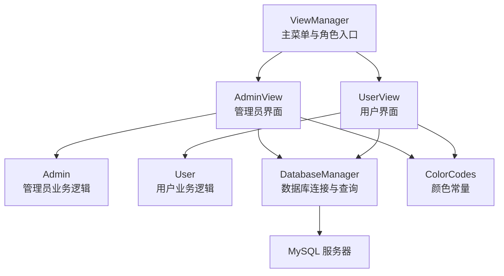
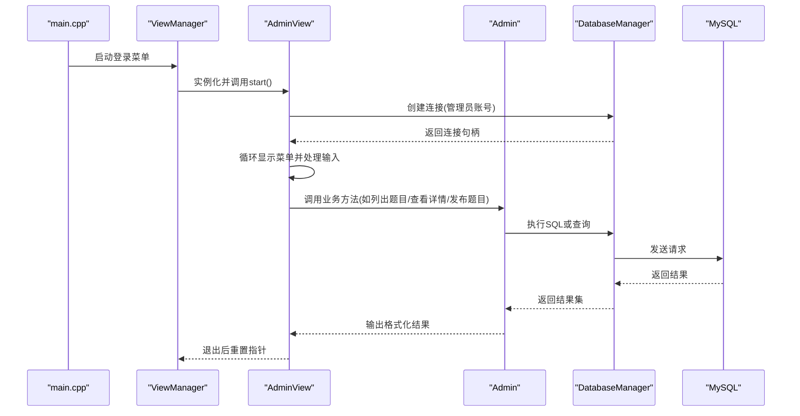
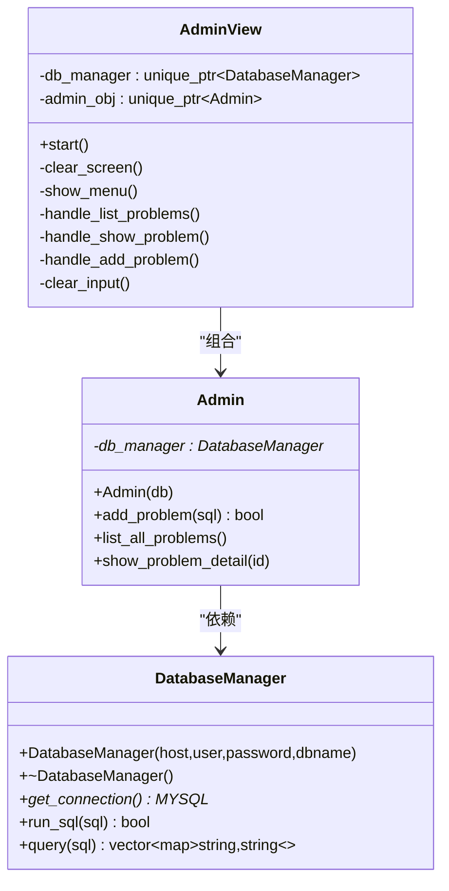
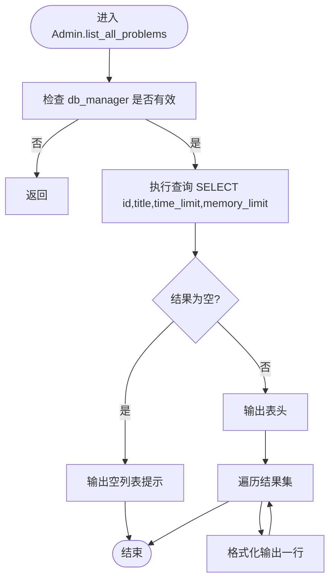
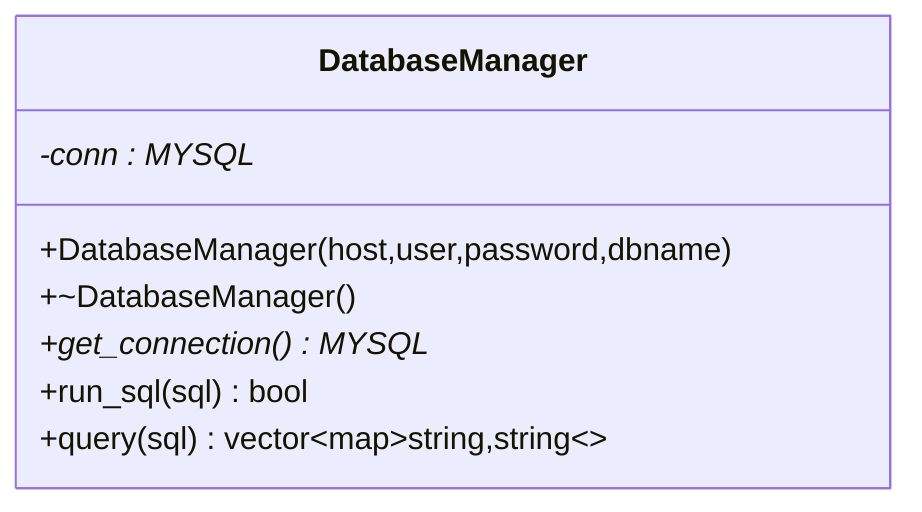
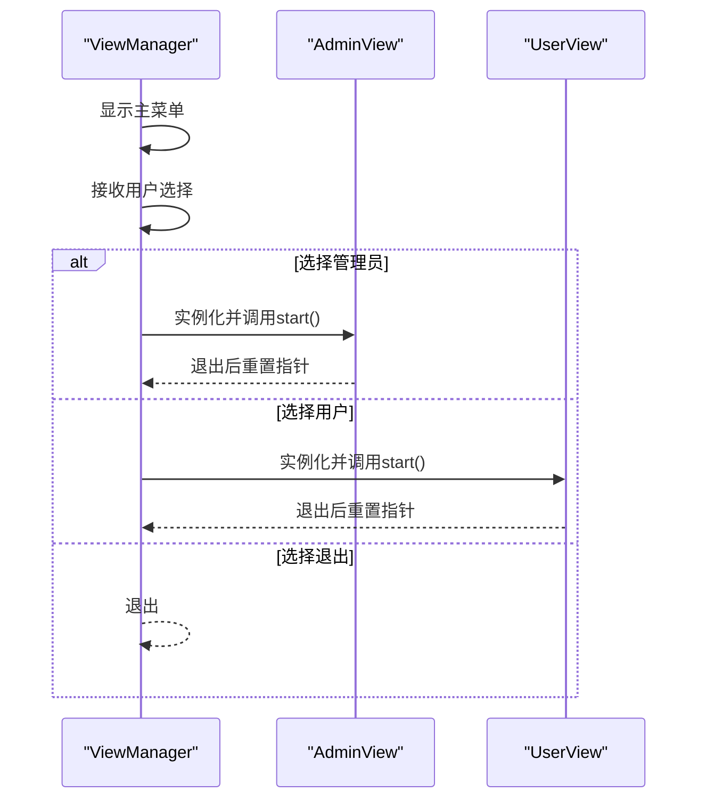
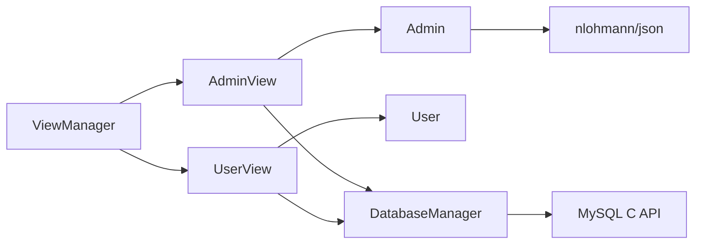

# 管理员界面

<cite>
**本文引用的文件**
- [main.cpp](file://src/main.cpp)
- [view_manager.h](file://include/view_manager.h)
- [view_manager.cpp](file://src/view_manager.cpp)
- [admin_view.h](file://include/admin_view.h)
- [admin_view.cpp](file://src/admin_view.cpp)
- [admin.h](file://include/admin.h)
- [admin.cpp](file://src/admin.cpp)
- [db_manager.h](file://include/db_manager.h)
- [db_manager.cpp](file://src/db_manager.cpp)
- [color_codes.h](file://include/color_codes.h)
- [user_view.h](file://include/user_view.h)
- [user_view.cpp](file://src/user_view.cpp)
- [user.h](file://include/user.h)
</cite>

## 目录
1. [简介](#简介)
2. [项目结构](#项目结构)
3. [核心组件](#核心组件)
4. [架构总览](#架构总览)
5. [详细组件分析](#详细组件分析)
6. [依赖关系分析](#依赖关系分析)
7. [性能与安全考量](#性能与安全考量)
8. [故障排查指南](#故障排查指南)
9. [结论](#结论)
10. [附录：扩展开发指南](#附录扩展开发指南)

## 简介
本文件面向OJ系统的管理员界面，围绕AdminView类及其协作组件展开，系统性解析其设计架构、菜单布局、功能选项、用户交互流程、权限验证机制、数据展示格式与操作确认流程，并提供扩展开发指南与最佳实践。读者无需深厚的C++背景即可理解管理员界面的工作原理与维护要点。

## 项目结构
本项目采用“分层+职责分离”的组织方式：
- 视图层：ViewManager负责主菜单与角色入口；AdminView负责管理员菜单与操作；UserView负责用户菜单与操作。
- 业务层：Admin负责管理员特有业务（题目发布、列表查看、详情查看）；User负责用户业务（登录、注册、提交、查看提交等）。
- 数据访问层：DatabaseManager封装MySQL连接与SQL执行/查询。
- 可视化与颜色：color_codes.h提供ANSI颜色常量，统一界面风格。

图表来源
- [view_manager.cpp:32-70](file://src/view_manager.cpp#L32-L70)
- [admin_view.cpp:21-76](file://src/admin_view.cpp#L21-L76)
- [user_view.cpp:36-131](file://src/user_view.cpp#L36-L131)
- [admin.cpp:12-58](file://src/admin.cpp#L12-L58)
- [db_manager.cpp:8-57](file://src/db_manager.cpp#L8-L57)

章节来源
- [main.cpp:5-13](file://src/main.cpp#L5-L13)
- [view_manager.h:11-40](file://include/view_manager.h#L11-L40)
- [view_manager.cpp:32-70](file://src/view_manager.cpp#L32-L70)

## 核心组件
- ViewManager：命令行主控制器，负责显示主菜单、接收用户选择、实例化并调度AdminView/UserView。
- AdminView：管理员界面，负责管理员菜单展示、输入校验、调用Admin业务方法、与DatabaseManager交互。
- Admin：管理员业务逻辑，封装题目发布、题目列表查询、题目详情查询。
- DatabaseManager：数据库连接与SQL执行/查询封装，提供run_sql与query接口。
- ColorCodes：ANSI颜色常量，用于控制台彩色输出。

章节来源
- [view_manager.h:11-40](file://include/view_manager.h#L11-L40)
- [admin_view.h:11-55](file://include/admin_view.h#L11-L55)
- [admin.h:10-37](file://include/admin.h#L10-L37)
- [db_manager.h:12-46](file://include/db_manager.h#L12-L46)
- [color_codes.h:5-15](file://include/color_codes.h#L5-L15)

## 架构总览
管理员界面的启动与流转如下：
- 主程序启动后由ViewManager显示主菜单，选择“管理员进入”后实例化AdminView。
- AdminView建立数据库连接（使用管理员账号），进入管理员菜单循环。
- 用户在菜单中选择相应功能，AdminView调用Admin对应方法，Admin通过DatabaseManager执行SQL或查询。
- 所有界面输出均使用ANSI颜色常量进行美化。

图表来源
- [main.cpp:5-13](file://src/main.cpp#L5-L13)
- [view_manager.cpp:52-68](file://src/view_manager.cpp#L52-L68)
- [admin_view.cpp:21-76](file://src/admin_view.cpp#L21-L76)
- [admin.cpp:12-58](file://src/admin.cpp#L12-L58)
- [db_manager.cpp:21-57](file://src/db_manager.cpp#L21-L57)

## 详细组件分析

### AdminView类分析
- 设计目标：提供管理员专用的命令行界面，支持题目管理、查看题目详情、发布新题目等。
- 关键职责：
  - 启动管理员模式并建立数据库连接。
  - 展示菜单并处理用户输入，调用Admin业务方法。
  - 清屏与输入缓冲区清理，保证交互健壮性。
- 菜单与功能：
  - 查看所有题目列表：调用Admin.list_all_problems。
  - 查看题目详情：根据ID查询并以JSON格式输出。
  - 发布新题目：接收管理员输入的SQL并执行。
  - 返回登录菜单：退出当前会话并断开连接。
- 权限与安全：
  - 使用管理员账号连接数据库，具备更高的数据库权限，适合执行DDL/DML。
  - 对输入进行基本校验（数字ID、非空SQL），并在异常时提示。
- 数据展示：
  - 列表以表格形式输出字段（ID、标题、时间限制、内存限制）。
  - 详情以JSON格式输出，便于管理员核对字段值。
- 用户体验：
  - 清屏与颜色输出提升可读性。
  - 输入错误时给出明确提示并要求重新输入。

图表来源
- [admin_view.h:11-55](file://include/admin_view.h#L11-L55)
- [admin.h:10-37](file://include/admin.h#L10-L37)
- [db_manager.h:12-46](file://include/db_manager.h#L12-L46)

章节来源
- [admin_view.h:11-55](file://include/admin_view.h#L11-L55)
- [admin_view.cpp:21-137](file://src/admin_view.cpp#L21-L137)

### Admin类分析
- 设计目标：封装管理员特有业务逻辑，屏蔽DatabaseManager细节。
- 关键方法：
  - add_problem：直接委托DatabaseManager.run_sql执行SQL。
  - list_all_problems：查询problems表的关键字段并格式化输出。
  - show_problem_detail：按ID查询并以JSON格式输出。
- 错误处理：
  - 若db_manager为空则直接返回。
  - 查询为空时输出友好提示。
- 性能与复杂度：
  - 查询为O(n)遍历结果集，n为返回行数。
  - JSON序列化为O(m)（m为字段数量）。

图表来源
- [admin.cpp:17-41](file://src/admin.cpp#L17-L41)

章节来源
- [admin.h:10-37](file://include/admin.h#L10-L37)
- [admin.cpp:12-58](file://src/admin.cpp#L12-L58)

### DatabaseManager类分析
- 设计目标：统一数据库连接与SQL执行/查询，隐藏MySQL C API细节。
- 关键能力：
  - 构造时建立连接，析构时关闭连接。
  - run_sql：执行SQL并返回布尔结果，内部捕获错误并输出。
  - query：执行查询并将结果集映射为vector<map<string,string>>。
- 安全与健壮性：
  - 对空连接进行保护。
  - 查询失败时输出错误信息并返回空结果集。
- 复杂度：
  - run_sql：O(1)执行，但网络I/O受服务器影响。
  - query：O(n*m)（n为行数，m为列数）。

图表来源
- [db_manager.h:12-46](file://include/db_manager.h#L12-L46)

章节来源
- [db_manager.h:12-46](file://include/db_manager.h#L12-L46)
- [db_manager.cpp:8-99](file://src/db_manager.cpp#L8-L99)

### ViewManager与主流程
- 设计目标：作为CLI入口，负责角色选择与视图切换。
- 关键流程：
  - 显示主菜单，接收用户选择。
  - 选择“管理员进入”时实例化AdminView并调用其start()。
  - 选择“用户进入”时实例化UserView并调用其start()。
  - 选择“退出系统”时优雅退出。
- 输入健壮性：统一的输入缓冲区清理与错误提示。

图表来源
- [view_manager.cpp:32-70](file://src/view_manager.cpp#L32-L70)

章节来源
- [view_manager.h:11-40](file://include/view_manager.h#L11-L40)
- [view_manager.cpp:32-76](file://src/view_manager.cpp#L32-L76)

### 用户交互流程与确认机制
- 管理员菜单交互：
  - 清屏后显示菜单，等待数字输入。
  - 输入非数字时清理缓冲区并提示重新输入。
  - 选项0返回登录菜单，其他选项调用对应处理函数。
- 查看题目详情：
  - 输入题目ID，非数字时提示并返回。
  - 未找到题目时输出提示信息。
- 发布新题目：
  - 输入SQL，空SQL提示并拒绝执行。
  - 执行失败时输出错误提示，成功时输出成功信息。
- 颜色与提示：
  - 使用ANSI颜色常量输出成功/警告/错误信息，提升可读性。

章节来源
- [admin_view.cpp:38-131](file://src/admin_view.cpp#L38-L131)
- [color_codes.h:5-15](file://include/color_codes.h#L5-L15)

## 依赖关系分析
- 组件耦合：
  - AdminView依赖Admin与DatabaseManager，Admin依赖DatabaseManager。
  - ViewManager依赖AdminView与UserView，形成角色入口与视图层的解耦。
- 外部依赖：
  - MySQL C API：DatabaseManager封装了连接、查询与错误处理。
  - nlohmann/json：Admin在输出题目详情时使用JSON序列化。
- 可能的循环依赖：
  - 无直接循环依赖，各层职责清晰。
- 接口契约：
  - DatabaseManager提供run_sql与query两个稳定接口，Admin与UserView通过该接口访问数据库。

图表来源
- [view_manager.h:23-24](file://include/view_manager.h#L23-L24)
- [admin_view.h:23-24](file://include/admin_view.h#L23-L24)
- [admin.cpp](file://src/admin.cpp#L4)
- [db_manager.cpp:81-99](file://src/db_manager.cpp#L81-L99)

章节来源
- [view_manager.h:23-24](file://include/view_manager.h#L23-L24)
- [admin_view.h:23-24](file://include/admin_view.h#L23-L24)
- [db_manager.h](file://include/db_manager.h#L4)

## 性能与安全考量
- 性能特性：
  - 查询与输出为O(n*m)，n为行数，m为列数；在题目规模较小的情况下可接受。
  - JSON序列化在详情输出时进行，对性能影响有限。
- 安全风险与缓解：
  - 管理员SQL直连：Admin.add_problem直接执行SQL，存在注入与误操作风险。建议：
    - 引入白名单SQL类型与参数化校验。
    - 限制可执行SQL范围（仅允许特定DML/DDL）。
    - 记录审计日志（可在DatabaseManager层增加日志接口）。
  - 输入校验：已对ID与SQL进行基础校验，可进一步增强（例如长度限制、关键字过滤）。
  - 连接管理：DatabaseManager在析构时自动关闭连接，避免资源泄漏。
- 可靠性：
  - 查询失败与执行失败均有错误输出，便于定位问题。
  - 输入缓冲区清理防止“脏读”。

[本节为通用指导，不直接分析具体文件，故无章节来源]

## 故障排查指南
- 数据库连接失败：
  - 现象：启动管理员模式时报错“数据库连接失败，请检查管理员账号配置”。
  - 排查：确认主机、用户名、密码、数据库名正确；检查MySQL服务状态。
  - 参考路径：[admin_view.cpp:71-75](file://src/admin_view.cpp#L71-L75)
- 题目列表为空：
  - 现象：输出“题目列表为空”。
  - 排查：确认problems表是否存在数据；检查查询SQL是否正确。
  - 参考路径：[admin.cpp:22-24](file://src/admin.cpp#L22-L24)
- 题目详情未找到：
  - 现象：输出“未找到 ID 为 ... 的题目”。
  - 排查：确认题目ID是否存在；检查查询SQL。
  - 参考路径：[admin.cpp:49-51](file://src/admin.cpp#L49-L51)
- SQL执行失败：
  - 现象：输出“输入错误”或MySQL错误信息。
  - 排查：检查SQL语法；确认管理员账号权限；查看错误输出。
  - 参考路径：[admin_view.cpp:123-126](file://src/admin_view.cpp#L123-L126), [db_manager.cpp:86-89](file://src/db_manager.cpp#L86-L89)
- 输入异常：
  - 现象：提示“无效输入，请输入数字！”。
  - 排查：确保输入为整数；检查缓冲区清理逻辑。
  - 参考路径：[admin_view.cpp:40-45](file://src/admin_view.cpp#L40-L45), [view_manager.cpp:42-47](file://src/view_manager.cpp#L42-L47)

章节来源
- [admin_view.cpp:40-75](file://src/admin_view.cpp#L40-L75)
- [admin.cpp:22-58](file://src/admin.cpp#L22-L58)
- [db_manager.cpp:86-99](file://src/db_manager.cpp#L86-L99)
- [view_manager.cpp:42-68](file://src/view_manager.cpp#L42-L68)

## 结论
AdminView类通过清晰的职责划分与稳健的输入校验，实现了管理员对题目的增删改查与系统运维的基本需求。配合Admin与DatabaseManager，形成了从界面到业务再到数据访问的完整链路。建议在后续版本中引入更严格的SQL白名单与审计日志，以提升安全性与可维护性。

[本节为总结性内容，不直接分析具体文件，故无章节来源]

## 附录：扩展开发指南

### 新功能添加步骤
- 在AdminView中新增菜单项与处理函数：
  - 在头文件中声明新方法，在cpp中实现处理逻辑。
  - 在show_menu中添加新选项，并在switch中处理。
  - 参考路径：[admin_view.h:31-55](file://include/admin_view.h#L31-L55), [admin_view.cpp:78-131](file://src/admin_view.cpp#L78-L131)
- 在Admin中新增业务方法：
  - 在头文件中声明方法签名，在cpp中实现查询或SQL执行。
  - 参考路径：[admin.h:17-33](file://include/admin.h#L17-L33), [admin.cpp:12-58](file://src/admin.cpp#L12-L58)
- 在DatabaseManager中新增接口（如需）：
  - 如需新的查询封装，可在头文件声明并在cpp实现。
  - 参考路径：[db_manager.h:30-42](file://include/db_manager.h#L30-L42), [db_manager.cpp:26-57](file://src/db_manager.cpp#L26-L57)

### 界面定制建议
- 颜色与提示：
  - 使用ColorCodes中的颜色常量统一风格，避免硬编码颜色。
  - 参考路径：[color_codes.h:5-15](file://include/color_codes.h#L5-L15)
- 清屏与布局：
  - 使用统一的清屏函数，保持页面整洁。
  - 参考路径：[admin_view.cpp:14-19](file://src/admin_view.cpp#L14-L19), [view_manager.cpp:14-19](file://src/view_manager.cpp#L14-L19)

### 用户体验优化建议
- 输入校验：
  - 对所有数值输入进行范围校验与提示。
  - 参考路径：[admin_view.cpp:100-107](file://src/admin_view.cpp#L100-L107)
- 交互反馈：
  - 成功/失败/警告信息使用不同颜色提示，增强可读性。
  - 参考路径：[admin_view.cpp:123-130](file://src/admin_view.cpp#L123-L130), [admin.cpp:49-51](file://src/admin.cpp#L49-L51)

### 最佳实践
- 权限最小化：
  - 管理员账号仅用于必要操作，避免长期持有高权限。
- 审计与日志：
  - 在DatabaseManager层增加SQL执行日志接口，记录关键操作。
- 错误处理：
  - 对所有外部调用（MySQL）进行错误捕获与用户友好提示。
  - 参考路径：[db_manager.cpp:32-36](file://src/db_manager.cpp#L32-L36), [db_manager.cpp:86-89](file://src/db_manager.cpp#L86-L89)