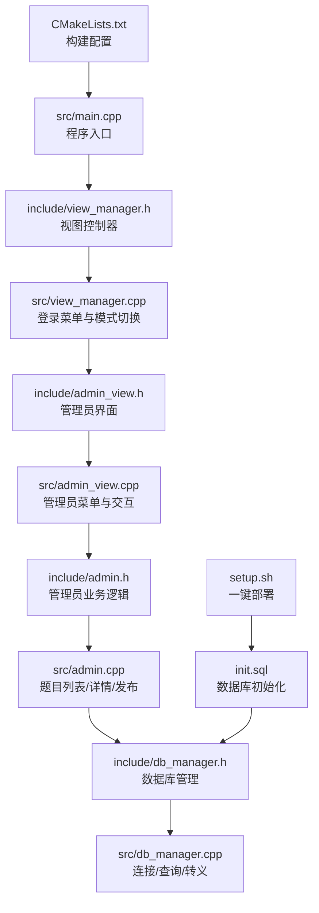
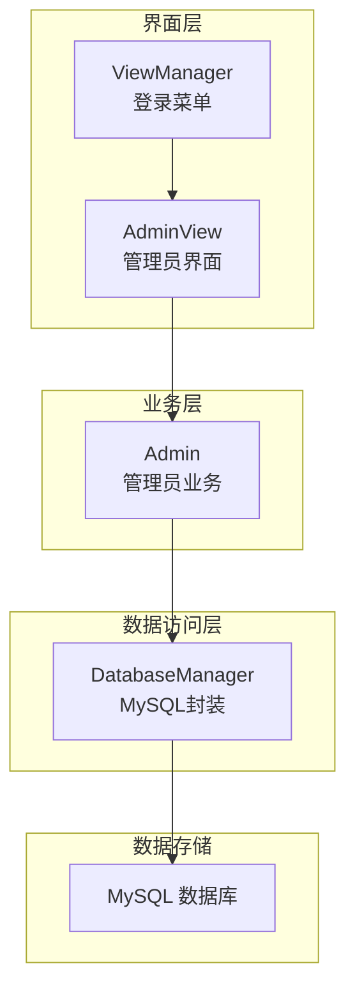
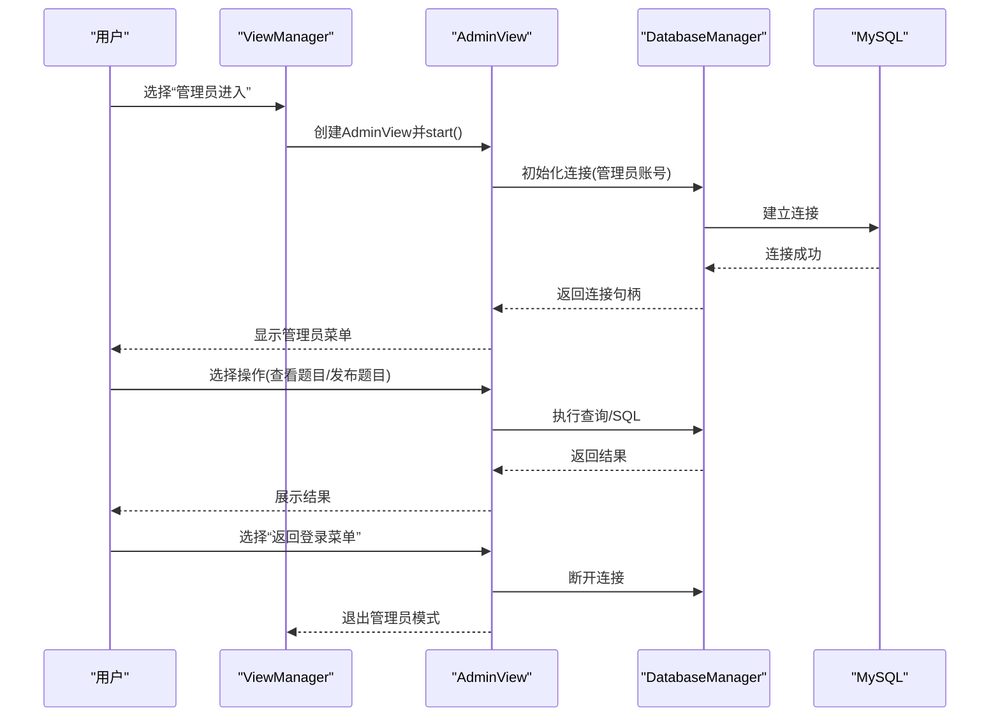
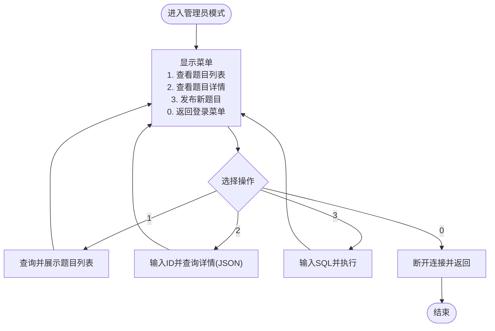
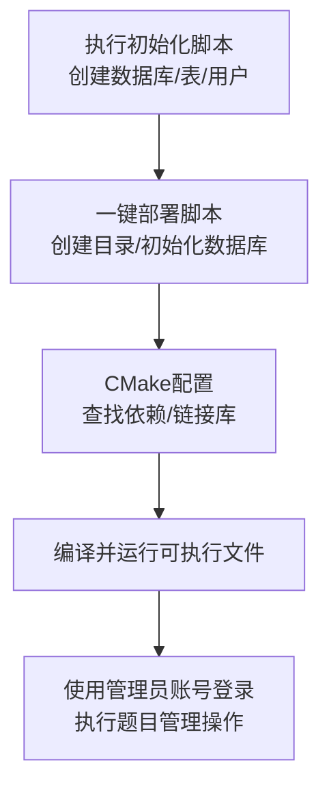
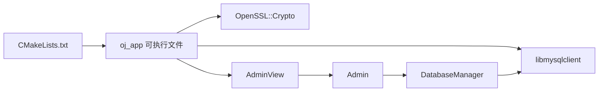

# 管理员操作手册

<cite>
**本文引用的文件**
- [README.md](file://README.md)
- [CMakeLists.txt](file://CMakeLists.txt)
- [setup.sh](file://setup.sh)
- [init.sql](file://init.sql)
- [src/main.cpp](file://src/main.cpp)
- [include/view_manager.h](file://include/view_manager.h)
- [src/view_manager.cpp](file://src/view_manager.cpp)
- [include/admin_view.h](file://include/admin_view.h)
- [src/admin_view.cpp](file://src/admin_view.cpp)
- [include/admin.h](file://include/admin.h)
- [src/admin.cpp](file://src/admin.cpp)
- [include/db_manager.h](file://include/db_manager.h)
- [src/db_manager.cpp](file://src/db_manager.cpp)
- [include/color_codes.h](file://include/color_codes.h)
- [History/OJ_v1.0.md](file://History/OJ_v1.0.md)
- [docs/code_submission_design.md](file://docs/code_submission_design.md)
- [docs/judge_implementation_plan.md](file://docs/judge_implementation_plan.md)
</cite>

## 目录
1. [简介](#简介)
2. [项目结构](#项目结构)
3. [核心组件](#核心组件)
4. [架构总览](#架构总览)
5. [详细组件分析](#详细组件分析)
6. [依赖分析](#依赖分析)
7. [性能考量](#性能考量)
8. [故障排查指南](#故障排查指南)
9. [结论](#结论)
10. [附录](#附录)

## 简介
本手册面向OJ在线评测系统的管理员，提供从权限获取、登录流程、题目发布与管理、用户管理、系统配置与维护、统计报表到日常运维与应急处理的完整操作指南。系统采用C++17开发，使用MySQL存储平台数据，结合Docker容器化评测引擎，具备安全隔离与资源限制能力。

## 项目结构
- 源码组织采用“头文件在include、实现文件在src”的分层方式，便于模块化管理与维护。
- 构建系统使用CMake，依赖MySQL客户端与OpenSSL。
- 初始化脚本负责数据库与用户创建、样例数据填充。
- 历史文档与设计文档详细描述评测引擎、容器池、安全隔离与交互流程。

**图表来源**
- [src/main.cpp:1-14](file://src/main.cpp#L1-L14)
- [include/view_manager.h:1-43](file://include/view_manager.h#L1-L43)
- [src/view_manager.cpp:1-77](file://src/view_manager.cpp#L1-L77)
- [include/admin_view.h:1-58](file://include/admin_view.h#L1-L58)
- [src/admin_view.cpp:1-138](file://src/admin_view.cpp#L1-L138)
- [include/admin.h:1-40](file://include/admin.h#L1-L40)
- [src/admin.cpp:1-59](file://src/admin.cpp#L1-L59)
- [include/db_manager.h:1-60](file://include/db_manager.h#L1-L60)
- [src/db_manager.cpp:1-110](file://src/db_manager.cpp#L1-L110)
- [CMakeLists.txt:1-40](file://CMakeLists.txt#L1-L40)
- [init.sql:1-278](file://init.sql#L1-L278)
- [setup.sh:1-41](file://setup.sh#L1-L41)

**章节来源**
- [CMakeLists.txt:1-40](file://CMakeLists.txt#L1-L40)
- [README.md:1-2](file://README.md#L1-L2)

## 核心组件
- 视图控制器与登录菜单：负责角色选择（管理员/用户），并根据选择进入相应界面。
- 管理员界面与业务逻辑：提供题目列表查看、题目详情查看、手动SQL发布新题等功能。
- 数据库管理：封装MySQL连接、查询、执行与字符串转义，保障SQL注入防护。
- 颜色编码：提供ANSI颜色常量，用于终端友好输出。

**章节来源**
- [include/view_manager.h:1-43](file://include/view_manager.h#L1-L43)
- [src/view_manager.cpp:1-77](file://src/view_manager.cpp#L1-L77)
- [include/admin_view.h:1-58](file://include/admin_view.h#L1-L58)
- [src/admin_view.cpp:1-138](file://src/admin_view.cpp#L1-L138)
- [include/admin.h:1-40](file://include/admin.h#L1-L40)
- [src/admin.cpp:1-59](file://src/admin.cpp#L1-L59)
- [include/db_manager.h:1-60](file://include/db_manager.h#L1-L60)
- [src/db_manager.cpp:1-110](file://src/db_manager.cpp#L1-L110)
- [include/color_codes.h:1-18](file://include/color_codes.h#L1-L18)

## 架构总览
管理员操作主要通过命令行界面完成，登录后进入管理员模式，连接数据库后执行题目管理与查询操作。系统整体架构围绕“视图层-业务层-数据访问层”展开，并与MySQL数据库交互。

**图表来源**
- [src/view_manager.cpp:32-70](file://src/view_manager.cpp#L32-L70)
- [src/admin_view.cpp:21-76](file://src/admin_view.cpp#L21-L76)
- [src/admin.cpp:10-58](file://src/admin.cpp#L10-L58)
- [src/db_manager.cpp:9-109](file://src/db_manager.cpp#L9-L109)

## 详细组件分析

### 管理员权限获取与登录流程
- 登录入口：程序启动后显示主菜单，选择“管理员进入”进入管理员模式。
- 连接建立：管理员界面使用专用数据库账号连接数据库，连接成功后进入管理员操作面板。
- 退出与清理：退出管理员模式时断开数据库连接，释放资源。

**图表来源**
- [src/view_manager.cpp:32-70](file://src/view_manager.cpp#L32-L70)
- [src/admin_view.cpp:21-76](file://src/admin_view.cpp#L21-L76)
- [src/db_manager.cpp:71-89](file://src/db_manager.cpp#L71-L89)

**章节来源**
- [src/view_manager.cpp:21-70](file://src/view_manager.cpp#L21-L70)
- [src/admin_view.cpp:21-76](file://src/admin_view.cpp#L21-L76)
- [src/db_manager.cpp:71-89](file://src/db_manager.cpp#L71-L89)

### 题目发布与管理
- 查看所有题目：列出题目ID、标题、时间限制、内存限制。
- 查看题目详情：按ID查询并以JSON格式输出。
- 发布新题目：通过管理员专用账号执行SQL语句，实现题目的创建与参数设置。

**图表来源**
- [src/admin_view.cpp:78-131](file://src/admin_view.cpp#L78-L131)
- [src/admin.cpp:17-58](file://src/admin.cpp#L17-L58)

**章节来源**
- [src/admin_view.cpp:78-131](file://src/admin_view.cpp#L78-L131)
- [src/admin.cpp:12-58](file://src/admin.cpp#L12-L58)

### 用户管理功能
- 用户信息查看：可通过查询users表获取用户账号、提交次数、解决次数、注册时间、最后登录时间等信息。
- 权限管理：平台用户复用受限数据库账号，行级隔离由应用层控制；管理员拥有全权限数据库账号。
- 账户状态控制：通过更新users表字段或在应用层逻辑中进行状态控制（例如封禁、重置密码等）。

说明：当前管理员界面未提供直接的用户编辑功能，但可通过数据库查询与手动SQL实现用户状态控制。

**章节来源**
- [init.sql:26-39](file://init.sql#L26-L39)
- [init.sql:70-95](file://init.sql#L70-L95)
- [src/db_manager.cpp:36-67](file://src/db_manager.cpp#L36-L67)

### 系统配置与维护
- 数据库初始化：使用初始化脚本创建数据库、表、用户并授予相应权限。
- 一键部署：部署脚本自动创建目录、初始化数据库并提示后续编译步骤。
- 构建配置：CMake查找MySQL与OpenSSL，链接库并生成可执行文件。
- 安全与隔离：评测引擎采用Docker容器化、只读文件系统、禁网、非特权运行等多重隔离措施。

**图表来源**
- [setup.sh:14-41](file://setup.sh#L14-L41)
- [init.sql:8-95](file://init.sql#L8-L95)
- [CMakeLists.txt:11-34](file://CMakeLists.txt#L11-L34)

**章节来源**
- [setup.sh:14-41](file://setup.sh#L14-L41)
- [init.sql:8-95](file://init.sql#L8-L95)
- [CMakeLists.txt:11-34](file://CMakeLists.txt#L11-L34)

### 统计报表功能
- 提交记录与统计：submissions表记录每次提交的状态、时间、内存、通过点数等，可用于统计分析。
- 用户活跃度：通过users表的提交次数、解决次数与最后登录时间进行分析。
- 题目完成情况：按题目维度统计各题的通过率、平均耗时、内存使用等。
- 系统使用情况：结合评测引擎的容器池与资源监控，评估系统负载与资源利用率。

说明：统计功能可通过查询submissions与users表实现，管理员可使用数据库工具或在应用层扩展查询接口。

**章节来源**
- [init.sql:42-61](file://init.sql#L42-L61)
- [init.sql:26-39](file://init.sql#L26-L39)
- [History/OJ_v1.0.md:312-327](file://History/OJ_v1.0.md#L312-L327)

### 日常运维最佳实践
- 定期备份：定期导出数据库，确保数据安全。
- 权限最小化：平台用户使用受限账号，避免不必要的写权限。
- 资源监控：关注容器池使用情况与系统负载，及时扩容或优化。
- 日志审计：记录管理员操作与关键事件，便于追踪与审计。

### 应急处理方案
- 数据库连接失败：检查管理员账号配置与MySQL服务状态，确认init.sql执行成功。
- 容器异常：重启评测引擎或重建容器，检查Docker守护进程与镜像。
- 权限不足：确认管理员账号权限与应用层行级隔离逻辑。

**章节来源**
- [src/admin_view.cpp:71-76](file://src/admin_view.cpp#L71-L76)
- [src/db_manager.cpp:71-89](file://src/db_manager.cpp#L71-L89)
- [History/OJ_v1.0.md:594-603](file://History/OJ_v1.0.md#L594-L603)

## 依赖分析
- 构建依赖：CMake查找mysqlclient与OpenSSL，链接至可执行文件。
- 运行时依赖：MySQL客户端库、OpenSSL加密库、Docker运行时（评测引擎）。
- 模块耦合：AdminView依赖Admin与DatabaseManager；Admin依赖DatabaseManager；DatabaseManager封装MySQL接口。

**图表来源**
- [CMakeLists.txt:11-34](file://CMakeLists.txt#L11-L34)
- [src/admin_view.cpp:27](file://src/admin_view.cpp#L27)
- [src/admin.cpp:10](file://src/admin.cpp#L10)
- [src/db_manager.cpp:9-24](file://src/db_manager.cpp#L9-L24)

**章节来源**
- [CMakeLists.txt:11-34](file://CMakeLists.txt#L11-L34)
- [src/admin_view.cpp:27](file://src/admin_view.cpp#L27)
- [src/admin.cpp:10](file://src/admin.cpp#L10)
- [src/db_manager.cpp:9-24](file://src/db_manager.cpp#L9-L24)

## 性能考量
- 容器池策略：默认预创建常驻容器，按需创建临时容器，最大并发受控，健康检查自动重建失联容器。
- 资源限制：评测容器禁网、只读、非特权、内存与进程数限制，确保稳定与安全。
- 评测流程：编译→逐点测试→输出比对，支持彩色终端输出与详细报告。

**章节来源**
- [History/OJ_v1.0.md:157-178](file://History/OJ_v1.0.md#L157-L178)
- [docs/judge_implementation_plan.md:129-158](file://docs/judge_implementation_plan.md#L129-L158)

## 故障排查指南
- 登录失败：确认管理员账号与密码正确，检查init.sql执行与MySQL服务状态。
- 查询异常：检查DatabaseManager的查询接口与错误输出，确认SQL语法与权限。
- 发布失败：检查SQL语句合法性与管理员账号权限，查看执行失败提示。

**章节来源**
- [src/admin_view.cpp:71-76](file://src/admin_view.cpp#L71-L76)
- [src/db_manager.cpp:36-67](file://src/db_manager.cpp#L36-L67)
- [src/admin.cpp:12-15](file://src/admin.cpp#L12-L15)

## 结论
管理员操作手册覆盖了从登录到题目管理、用户状态控制、系统配置与维护、统计分析与运维应急的全流程。通过严格的权限分离、容器化隔离与完善的数据库接口，系统在保证安全性的同时提供了清晰的管理路径。建议管理员在日常运维中遵循最小权限原则与定期备份策略，确保系统稳定可靠。

## 附录
- 常用命令示例
  - 初始化数据库：执行初始化脚本
  - 构建项目：进入build目录，执行CMake与make
  - 运行系统：在build目录下执行可执行文件
- 测试账号
  - 管理员数据库用户：oj_admin / 090800
  - 平台用户示例：test_user / 123456

**章节来源**
- [setup.sh:14-41](file://setup.sh#L14-L41)
- [CMakeLists.txt:26-34](file://CMakeLists.txt#L26-L34)
- [History/OJ_v1.0.md:517-521](file://History/OJ_v1.0.md#L517-L521)