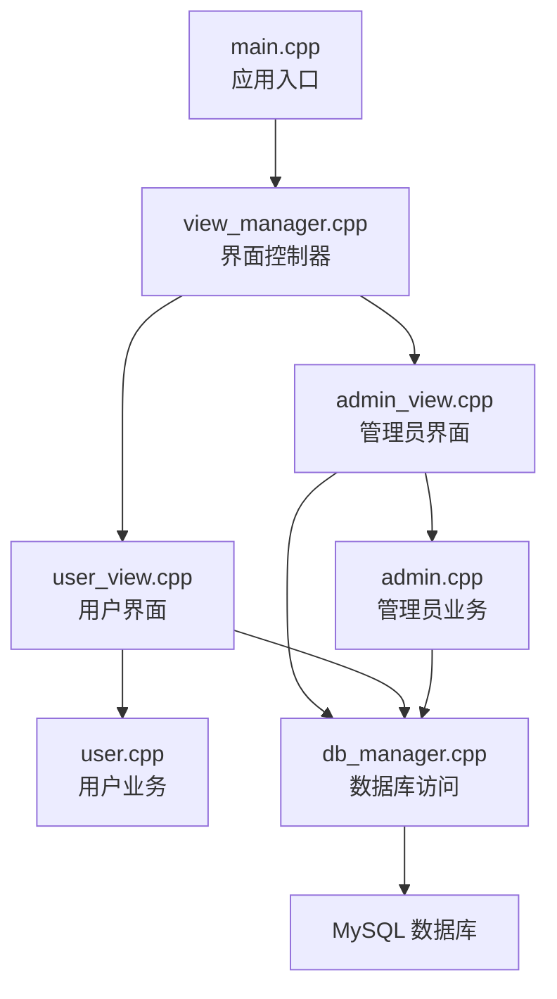
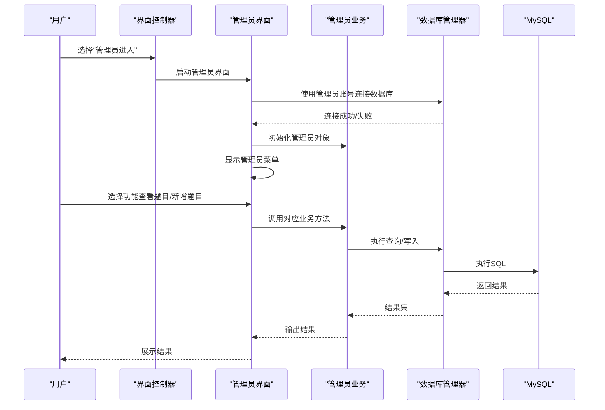
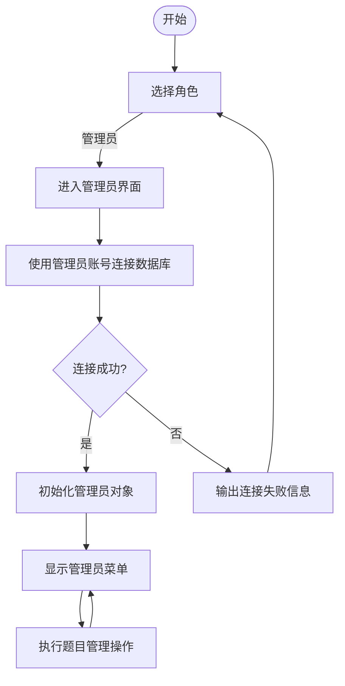
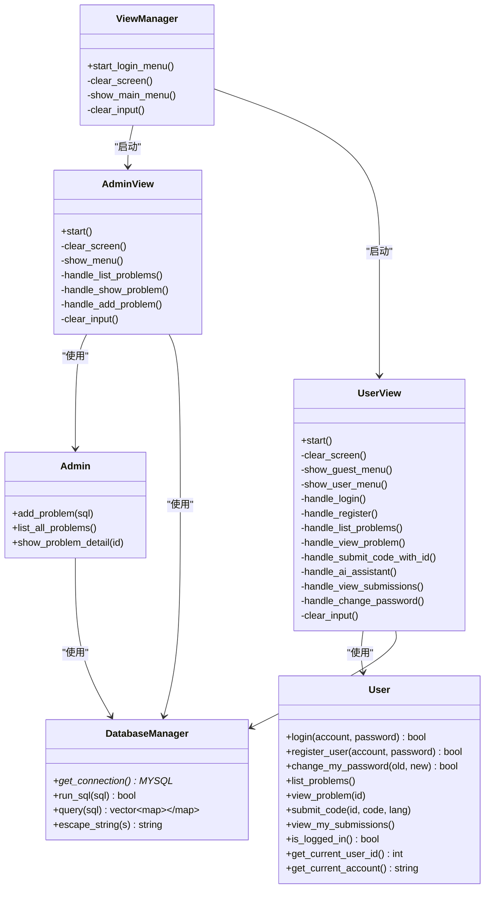

# 管理员身份验证

<cite>
**本文引用的文件**
- [main.cpp](file://src/main.cpp)
- [view_manager.h](file://include/view_manager.h)
- [view_manager.cpp](file://src/view_manager.cpp)
- [admin_view.h](file://include/admin_view.h)
- [admin_view.cpp](file://src/admin_view.cpp)
- [admin.h](file://include/admin.h)
- [admin.cpp](file://src/admin.cpp)
- [db_manager.h](file://include/db_manager.h)
- [db_manager.cpp](file://src/db_manager.cpp)
- [user.h](file://include/user.h)
- [user.cpp](file://src/user.cpp)
- [user_view.h](file://include/user_view.h)
- [user_view.cpp](file://src/user_view.cpp)
- [init.sql](file://init.sql)
- [setup.sh](file://setup.sh)
</cite>

## 目录
1. [简介](#简介)
2. [项目结构](#项目结构)
3. [核心组件](#核心组件)
4. [架构总览](#架构总览)
5. [详细组件分析](#详细组件分析)
6. [依赖关系分析](#依赖关系分析)
7. [性能考虑](#性能考虑)
8. [故障排查指南](#故障排查指南)
9. [结论](#结论)
10. [附录](#附录)

## 简介
本文件面向管理员身份验证功能，系统性说明管理员账户的创建与权限分配、登录流程（用户名验证、密码校验与权限检查）、会话管理与安全退出机制，并提供账户管理最佳实践（密码策略、账户锁定与审计日志）。同时给出登录命令示例与错误处理说明，帮助读者快速理解并正确使用管理员功能。

## 项目结构
系统采用分层与职责分离的设计：入口程序启动界面控制器，界面控制器根据用户选择进入管理员或用户模式；管理员模式直接连接数据库并提供题目管理能力；用户模式提供登录/注册与题目评测等通用功能；数据库管理器封装底层连接与SQL执行。

图表来源
- [main.cpp:5-13](file://src/main.cpp#L5-L13)
- [view_manager.cpp:32-70](file://src/view_manager.cpp#L32-L70)
- [admin_view.cpp:21-76](file://src/admin_view.cpp#L21-L76)
- [user_view.cpp:36-131](file://src/user_view.cpp#L36-L131)
- [admin.cpp:10-15](file://src/admin.cpp#L10-L15)
- [user.cpp:13-13](file://src/user.cpp#L13-L13)
- [db_manager.cpp:9-25](file://src/db_manager.cpp#L9-L25)

章节来源
- [main.cpp:5-13](file://src/main.cpp#L5-L13)
- [view_manager.h:11-41](file://include/view_manager.h#L11-L41)
- [view_manager.cpp:32-70](file://src/view_manager.cpp#L32-L70)

## 核心组件
- 界面控制器：负责显示主菜单、接收用户选择并启动相应模式。
- 管理员界面：建立管理员数据库连接、提供题目列表、详情查看与新增题目的交互式菜单。
- 用户界面：提供游客菜单（登录/注册）与登录后的用户菜单，支持题目浏览、提交评测与密码修改。
- 数据库管理器：封装连接、查询与SQL执行，提供转义接口防止注入。
- 管理员业务：封装管理员特有操作（如新增题目、列出题目、查看详情）。
- 用户业务：封装用户登录、注册、提交评测与密码修改等。

章节来源
- [admin_view.h:11-55](file://include/admin_view.h#L11-L55)
- [admin.h:10-37](file://include/admin.h#L10-L37)
- [user_view.h:12-92](file://include/user_view.h#L12-L92)
- [user.h:11-102](file://include/user.h#L11-L102)
- [db_manager.h:12-53](file://include/db_manager.h#L12-L53)

## 架构总览
管理员身份验证与会话管理遵循“界面层-业务层-数据访问层”的分层架构。管理员模式在进入时即建立数据库连接，使用管理员专用账号，完成权限检查后进入交互式菜单；用户模式则通过登录流程完成用户名与密码校验，成功后进入用户会话。

图表来源
- [view_manager.cpp:50-68](file://src/view_manager.cpp#L50-L68)
- [admin_view.cpp:26-76](file://src/admin_view.cpp#L26-L76)
- [admin.cpp:12-58](file://src/admin.cpp#L12-L58)
- [db_manager.cpp:22-67](file://src/db_manager.cpp#L22-L67)

## 详细组件分析

### 管理员账户创建与权限分配
- 数据库用户创建：初始化脚本为管理员创建专用数据库用户，并授予对目标库的完整权限，确保管理员具备新增题目的写入能力。
- 应用侧连接：管理员界面在启动时使用管理员账号建立数据库连接，连接成功后方可进入管理员功能。
- 权限检查：由于管理员账号具备写权限，系统在管理员模式下无需额外的“权限检查”步骤即可执行新增题目等写操作。

章节来源
- [init.sql:70-95](file://init.sql#L70-L95)
- [admin_view.cpp:26-32](file://src/admin_view.cpp#L26-L32)

### 管理员登录流程
- 角色选择：通过主菜单选择“管理员进入”，界面控制器启动管理员界面。
- 连接建立：管理员界面使用固定参数（主机、用户名、密码、数据库名）连接数据库。
- 会话建立：连接成功后初始化管理员对象，进入交互式菜单；失败则输出错误信息并返回主菜单。

图表来源
- [view_manager.cpp:50-68](file://src/view_manager.cpp#L50-L68)
- [admin_view.cpp:26-76](file://src/admin_view.cpp#L26-L76)

章节来源
- [view_manager.cpp:50-68](file://src/view_manager.cpp#L50-L68)
- [admin_view.cpp:26-76](file://src/admin_view.cpp#L26-L76)

### 管理员会话管理与安全退出
- 会话生命周期：管理员界面在连接成功后创建管理员对象并进入循环菜单；用户在选择退出时，界面重置对象并断开数据库连接，完成安全退出。
- 资源释放：析构函数中显式关闭数据库连接，避免资源泄漏。

章节来源
- [admin_view.cpp:68-76](file://src/admin_view.cpp#L68-L76)
- [db_manager.cpp:14-20](file://src/db_manager.cpp#L14-L20)

### 管理员账户管理最佳实践
- 密码策略
  - 强密码要求：建议使用至少8位字符，包含大小写字母、数字与特殊符号，定期轮换。
  - 最小暴露面：仅在受信任的本地主机使用管理员账号，避免远程直连。
- 账户锁定
  - 建议在数据库层面设置失败尝试次数上限与锁定时间，或在应用层维护失败计数并在阈值触发时临时锁定。
- 审计日志
  - 记录管理员登录时间、IP地址、操作行为与受影响的数据范围，便于事后审计与追踪。
- 数据库权限最小化
  - 仅授予管理员必要的写权限，避免过度授权；定期审查权限变更。

### 具体登录命令示例与错误处理
- 登录命令示例
  - 主菜单选择“管理员进入”，随后系统自动使用管理员账号连接数据库。
  - 若连接失败，系统输出错误信息并返回主菜单。
- 错误处理说明
  - 输入非数字：清理输入缓冲区并提示重新选择。
  - 无效选项：提示重新选择。
  - 数据库连接失败：提示检查管理员账号配置。

章节来源
- [admin_view.cpp:39-46](file://src/admin_view.cpp#L39-L46)
- [admin_view.cpp:63-75](file://src/admin_view.cpp#L63-L75)
- [view_manager.cpp:42-48](file://src/view_manager.cpp#L42-L48)
- [view_manager.cpp:67-68](file://src/view_manager.cpp#L67-L68)

## 依赖关系分析
管理员身份验证涉及的主要依赖如下：
- 界面控制器依赖管理员界面与用户界面。
- 管理员界面依赖数据库管理器与管理员业务。
- 用户界面依赖数据库管理器与用户业务。
- 数据库管理器依赖MySQL客户端库。

图表来源
- [view_manager.h:11-41](file://include/view_manager.h#L11-L41)
- [admin_view.h:11-55](file://include/admin_view.h#L11-L55)
- [user_view.h:12-92](file://include/user_view.h#L12-L92)
- [admin.h:10-37](file://include/admin.h#L10-L37)
- [user.h:11-102](file://include/user.h#L11-L102)
- [db_manager.h:12-53](file://include/db_manager.h#L12-L53)

章节来源
- [view_manager.h:11-41](file://include/view_manager.h#L11-L41)
- [admin_view.h:11-55](file://include/admin_view.h#L11-L55)
- [user_view.h:12-92](file://include/user_view.h#L12-L92)
- [admin.h:10-37](file://include/admin.h#L10-L37)
- [user.h:11-102](file://include/user.h#L11-L102)
- [db_manager.h:12-53](file://include/db_manager.h#L12-L53)

## 性能考虑
- 连接复用：管理员界面在会话期间复用数据库连接，减少频繁连接/断开带来的开销。
- 查询优化：管理员界面的查询为轻量级列表与详情展示，建议在数据库层面为相关字段建立索引以提升查询效率。
- 输入处理：对用户输入进行缓冲区清理与类型校验，避免阻塞与异常。

## 故障排查指南
- 数据库连接失败
  - 检查管理员账号与密码是否正确，确认MySQL服务运行正常。
  - 参考连接建立与错误输出位置。
- 输入异常
  - 非数字输入会被清理并提示重新选择。
  - 空输入或非法选项会提示重新输入。
- 权限不足
  - 管理员账号应具备对目标库的完整权限；若执行写操作失败，检查数据库权限配置。

章节来源
- [admin_view.cpp:73-75](file://src/admin_view.cpp#L73-L75)
- [view_manager.cpp:42-48](file://src/view_manager.cpp#L42-L48)
- [view_manager.cpp:67-68](file://src/view_manager.cpp#L67-L68)
- [init.sql:70-95](file://init.sql#L70-L95)

## 结论
管理员身份验证通过“角色选择—连接建立—会话管理—安全退出”的闭环实现，结合数据库层面的权限控制与应用层的输入校验，形成较为完整的管理员操作体系。建议在生产环境中进一步强化密码策略、账户锁定与审计日志机制，确保管理员操作的安全可控。

## 附录
- 环境初始化与部署
  - 使用一键部署脚本初始化数据库与用户，随后按提示进行编译与运行。
- 数据库初始化脚本
  - 包含数据库创建、表结构定义、示例数据与管理员/普通用户权限配置。

章节来源
- [setup.sh:17-29](file://setup.sh#L17-L29)
- [init.sql:8-95](file://init.sql#L8-L95)