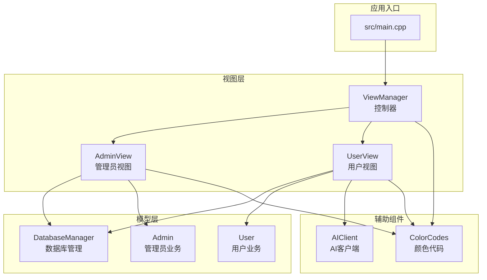
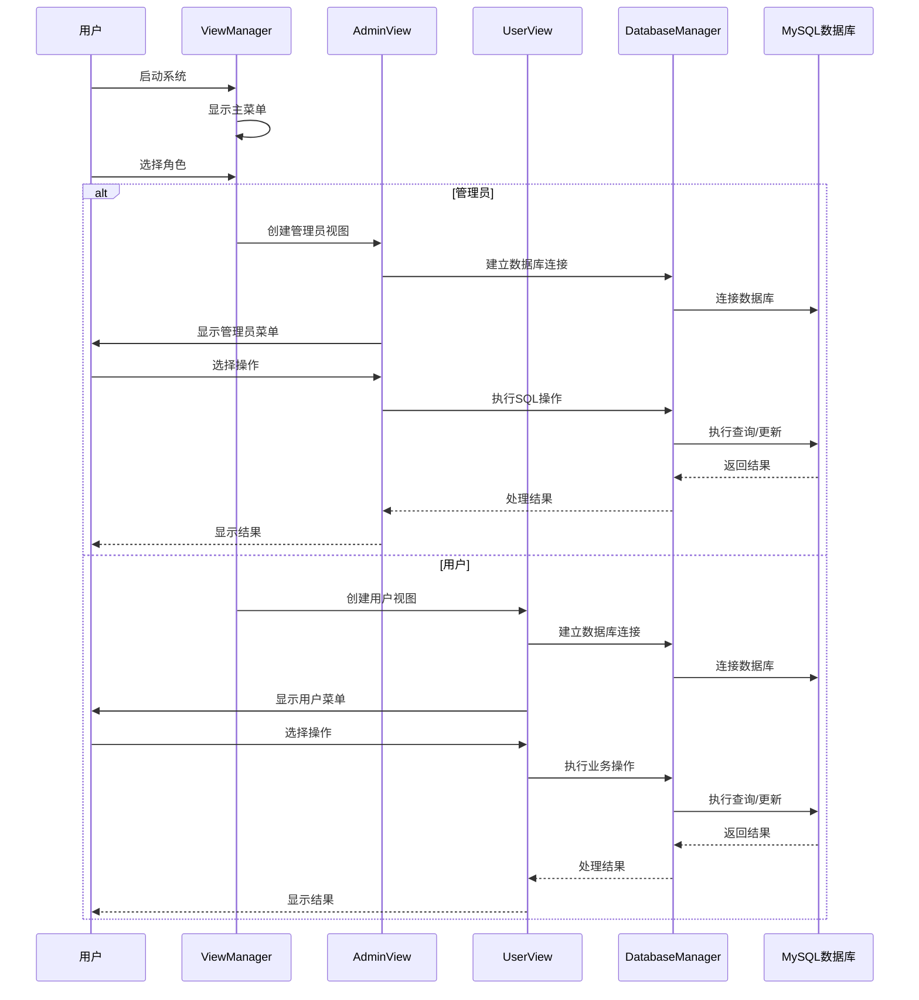
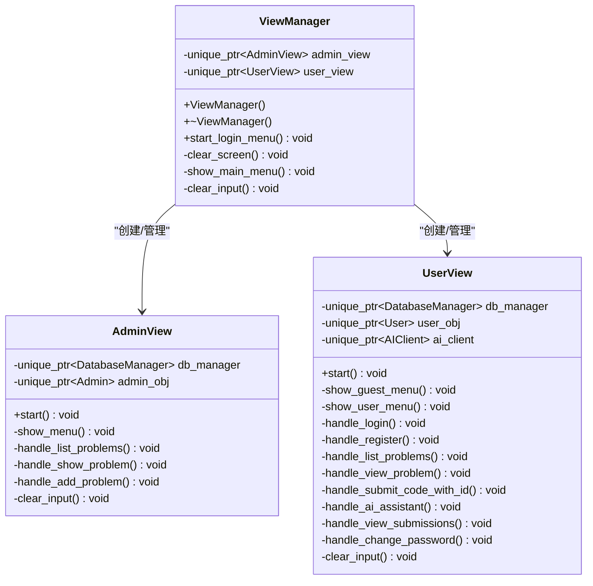
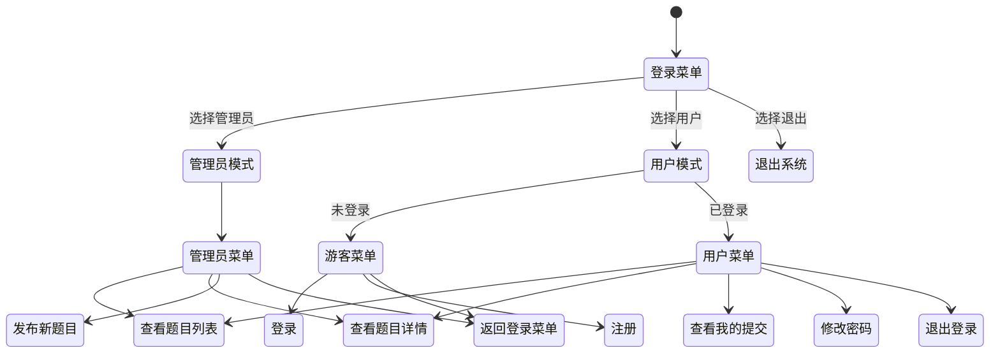
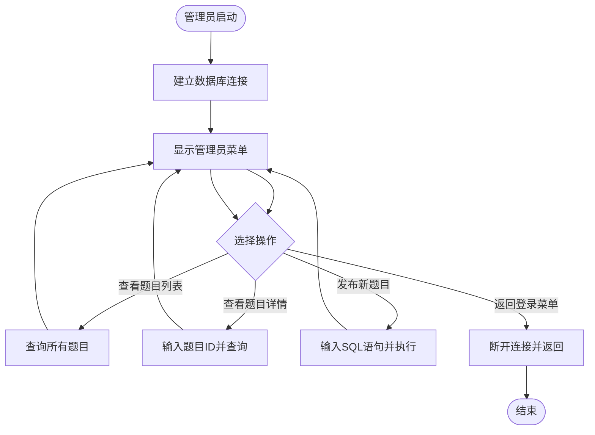
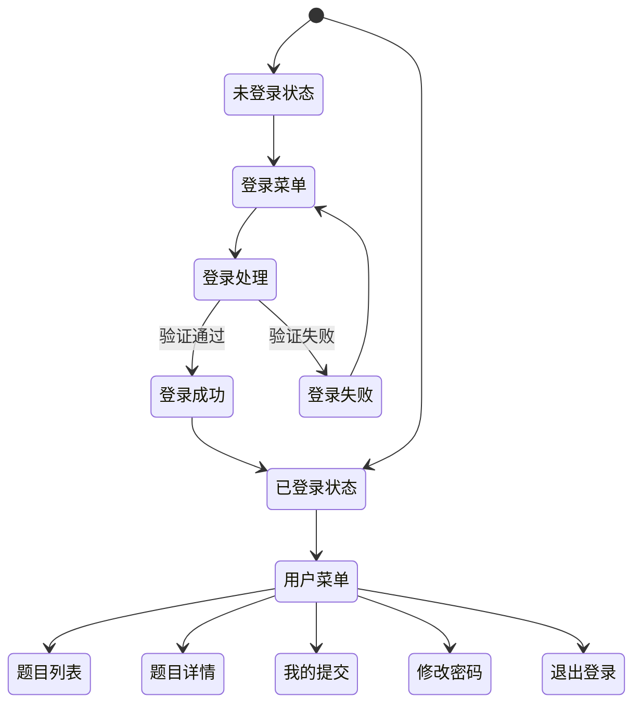
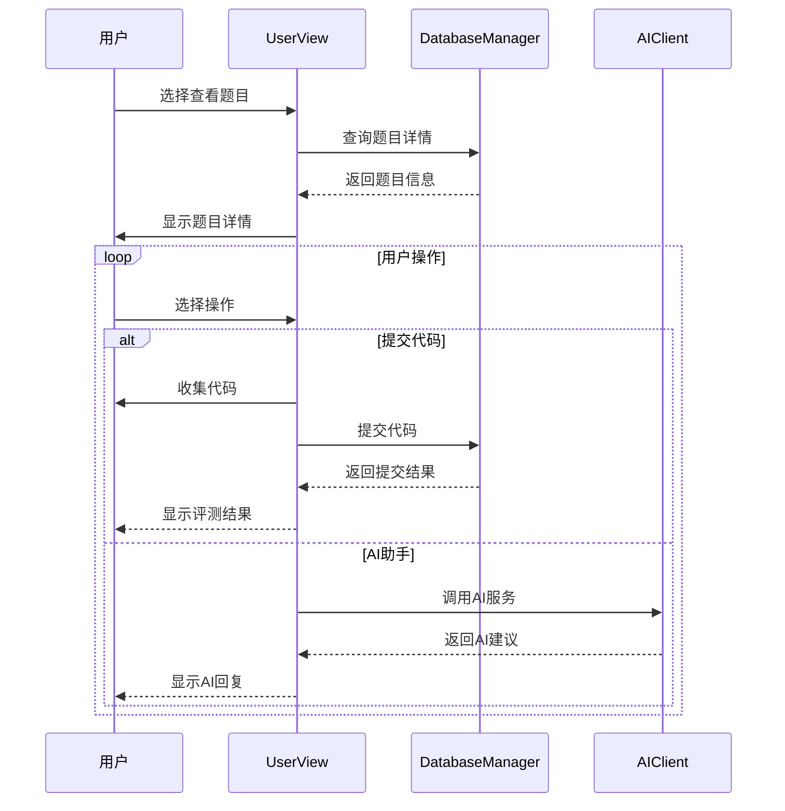
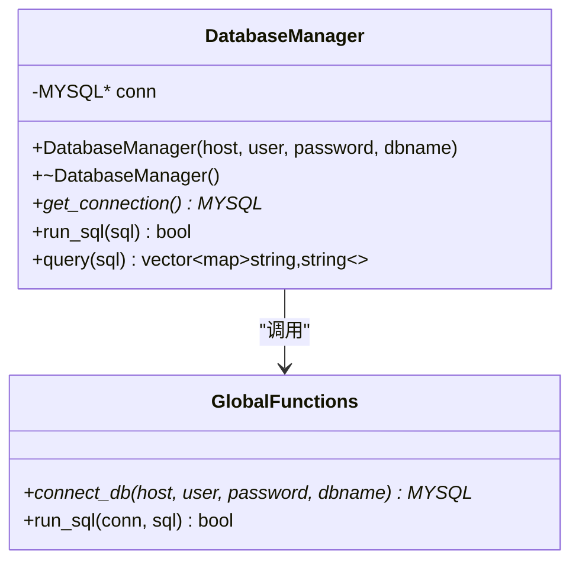
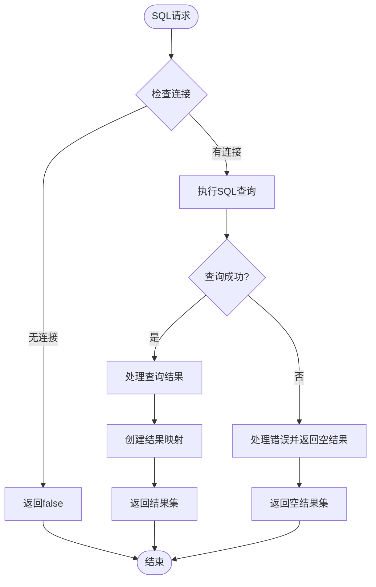
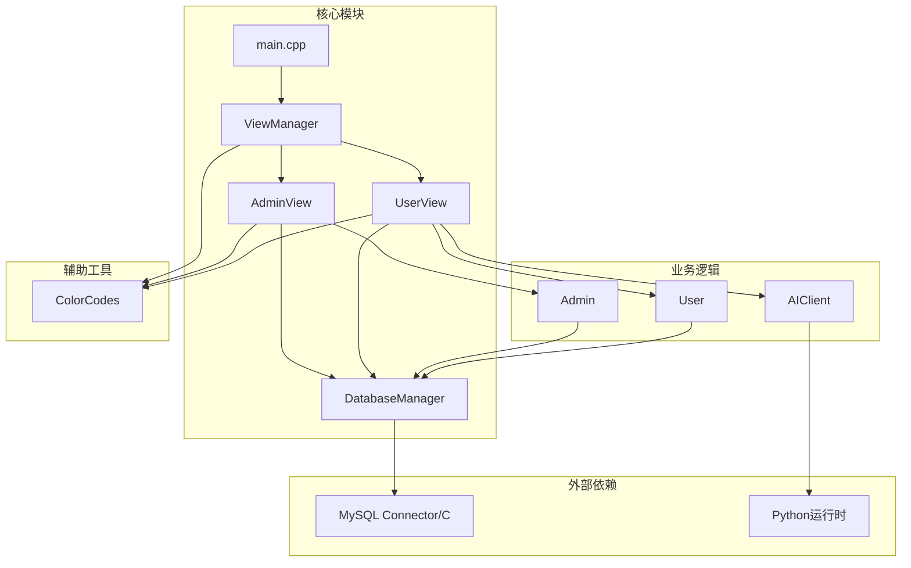

# MVC架构模式实现

<cite>
**本文档引用的文件**
- [main.cpp](file://src/main.cpp)
- [view_manager.cpp](file://src/view_manager.cpp)
- [admin_view.cpp](file://src/admin_view.cpp)
- [user_view.cpp](file://src/user_view.cpp)
- [db_manager.cpp](file://src/db_manager.cpp)
- [view_manager.h](file://include/view_manager.h)
- [admin_view.h](file://include/admin_view.h)
- [user_view.h](file://include/user_view.h)
- [db_manager.h](file://include/db_manager.h)
- [admin.h](file://include/admin.h)
- [user.h](file://include/user.h)
- [ai_client.h](file://include/ai_client.h)
- [color_codes.h](file://include/color_codes.h)
</cite>

## 目录
1. [简介](#简介)
2. [项目结构](#项目结构)
3. [核心组件](#核心组件)
4. [架构概览](#架构概览)
5. [详细组件分析](#详细组件分析)
6. [依赖关系分析](#依赖关系分析)
7. [性能考虑](#性能考虑)
8. [故障排除指南](#故障排除指南)
9. [结论](#结论)

## 简介

本项目是一个基于MVC（Model-View-Controller）架构模式实现的在线判题系统（OJ）。该系统采用命令行界面设计，通过菜单驱动的方式实现用户交互，实现了管理员和普通用户两种不同的业务场景。系统的核心特色在于其独特的MVC实现方式，其中ViewManager作为控制器的核心，AdminView和UserView分别实现管理员和用户的不同业务逻辑。

## 项目结构

该项目采用清晰的分层架构设计，按照功能模块进行组织：

**图表来源**
- [main.cpp:1-14](file://src/main.cpp#L1-L14)
- [view_manager.cpp:10-25](file://src/view_manager.cpp#L10-L25)
- [admin_view.cpp:10-25](file://src/admin_view.cpp#L10-L25)
- [user_view.cpp:25-27](file://src/user_view.cpp#L25-L27)

**章节来源**
- [main.cpp:1-14](file://src/main.cpp#L1-L14)
- [view_manager.h:11-40](file://include/view_manager.h#L11-L40)

## 核心组件

### 视图层（View）

视图层负责用户界面展示和用户交互，包含以下关键组件：

- **ViewManager**：作为系统的主控制器，管理用户角色选择和菜单导航
- **AdminView**：管理员专用界面，提供题目管理和发布功能
- **UserView**：用户界面，支持登录、注册、题目浏览和代码提交

### 模型层（Model）

模型层封装了数据访问和业务逻辑：

- **DatabaseManager**：数据库连接管理，提供SQL执行和查询功能
- **Admin**：管理员业务逻辑，处理题目发布和管理
- **User**：用户业务逻辑，处理用户认证和题目操作

### 控制器层

在本系统中，控制器的概念主要体现在ViewManager的设计中，它协调用户输入和系统响应。

**章节来源**
- [view_manager.h:11-40](file://include/view_manager.h#L11-L40)
- [admin_view.h:11-55](file://include/admin_view.h#L11-L55)
- [user_view.h:12-89](file://include/user_view.h#L12-L89)
- [db_manager.h:12-46](file://include/db_manager.h#L12-L46)

## 架构概览

系统采用经典的MVC架构模式，但在命令行环境下进行了特殊实现：

**图表来源**
- [view_manager.cpp:32-70](file://src/view_manager.cpp#L32-L70)
- [admin_view.cpp:21-76](file://src/admin_view.cpp#L21-L76)
- [user_view.cpp:36-131](file://src/user_view.cpp#L36-L131)
- [db_manager.cpp:8-24](file://src/db_manager.cpp#L8-L24)

## 详细组件分析

### ViewManager - 控制器核心

ViewManager是系统的核心控制器，承担着以下职责：

#### 主要功能
- **角色管理**：根据用户选择启动管理员或用户模式
- **菜单控制**：提供主登录菜单和状态管理
- **生命周期管理**：负责视图对象的创建和销毁

#### 关键方法分析

**图表来源**
- [view_manager.h:11-40](file://include/view_manager.h#L11-L40)
- [admin_view.h:11-55](file://include/admin_view.h#L11-L55)
- [user_view.h:12-89](file://include/user_view.h#L12-L89)

#### 状态管理机制

ViewManager实现了完整的状态管理机制：

**图表来源**
- [view_manager.cpp:32-70](file://src/view_manager.cpp#L32-L70)
- [admin_view.cpp:21-76](file://src/admin_view.cpp#L21-L76)
- [user_view.cpp:36-131](file://src/user_view.cpp#L36-L131)

**章节来源**
- [view_manager.cpp:10-77](file://src/view_manager.cpp#L10-L77)
- [view_manager.h:11-40](file://include/view_manager.h#L11-L40)

### AdminView - 管理员视图

AdminView专门处理管理员的业务需求，具有以下特点：

#### 数据访问模式
- **专用数据库连接**：使用管理员账户建立数据库连接
- **受限权限操作**：仅能执行管理员权限范围内的操作
- **直接SQL执行**：允许管理员直接执行SQL语句发布题目

#### 核心业务流程

**图表来源**
- [admin_view.cpp:21-76](file://src/admin_view.cpp#L21-L76)
- [admin_view.cpp:91-131](file://src/admin_view.cpp#L91-L131)

#### 错误处理机制
- **输入验证**：对用户输入进行严格验证
- **数据库错误处理**：捕获并报告数据库操作错误
- **状态恢复**：确保异常情况下资源正确释放

**章节来源**
- [admin_view.cpp:10-138](file://src/admin_view.cpp#L10-L138)
- [admin_view.h:11-55](file://include/admin_view.h#L11-L55)

### UserView - 用户视图

UserView实现了复杂的用户交互逻辑，包含多种状态和业务场景：

#### 双态菜单系统

**图表来源**
- [user_view.cpp:36-131](file://src/user_view.cpp#L36-L131)
- [user_view.cpp:133-157](file://src/user_view.cpp#L133-L157)

#### 题目详情交互流程

**图表来源**
- [user_view.cpp:213-274](file://src/user_view.cpp#L213-L274)
- [user_view.cpp:290-354](file://src/user_view.cpp#L290-L354)

**章节来源**
- [user_view.cpp:25-395](file://src/user_view.cpp#L25-L395)
- [user_view.h:12-89](file://include/user_view.h#L12-L89)

### DatabaseManager - 数据访问层

DatabaseManager是数据访问层的核心组件，提供了统一的数据库操作接口：

#### 数据库连接管理

**图表来源**
- [db_manager.h:12-46](file://include/db_manager.h#L12-L46)
- [db_manager.cpp:8-24](file://src/db_manager.cpp#L8-L24)

#### SQL操作流程

**图表来源**
- [db_manager.cpp:26-57](file://src/db_manager.cpp#L26-L57)

**章节来源**
- [db_manager.cpp:1-100](file://src/db_manager.cpp#L1-L100)
- [db_manager.h:12-53](file://include/db_manager.h#L12-L53)

### 颜色编码系统

系统实现了ANSI颜色编码支持，用于美化命令行界面：

#### 颜色常量定义

| 颜色名称 | ANSI代码 | 用途 |
|---------|---------|------|
| RESET | `\033[0m` | 重置颜色 |
| RED | `\033[31m` | 错误提示 |
| GREEN | `\033[32m` | 成功提示 |
| YELLOW | `\033[33m` | 警告提示 |
| BLUE | `\033[34m` | 信息显示 |
| MAGENTA | `\033[35m` | 特殊标记 |
| CYAN | `\033[36m` | 代码高亮 |
| WHITE | `\033[37m` | 一般文本 |

**章节来源**
- [color_codes.h:5-15](file://include/color_codes.h#L5-L15)

## 依赖关系分析

系统采用了清晰的依赖层次结构，确保了良好的模块化设计：

**图表来源**
- [main.cpp:1](file://src/main.cpp#L1)
- [view_manager.cpp:1](file://src/view_manager.cpp#L1)
- [admin_view.cpp:1](file://src/admin_view.cpp#L1)
- [user_view.cpp:1](file://src/user_view.cpp#L1)
- [db_manager.cpp:1](file://src/db_manager.cpp#L1)

### 组件耦合度分析

- **低耦合设计**：各组件之间通过接口进行通信，减少了直接依赖
- **单一职责原则**：每个类都有明确的职责分工
- **可扩展性**：新增功能时不需要修改现有代码结构

**章节来源**
- [view_manager.h:4-6](file://include/view_manager.h#L4-L6)
- [admin_view.h:4-6](file://include/admin_view.h#L4-L6)
- [user_view.h:4-7](file://include/user_view.h#L4-L7)

## 性能考虑

### 内存管理优化

系统采用了智能指针进行自动内存管理：
- **RAII原则**：资源获取即初始化，确保资源正确释放
- **unique_ptr使用**：避免重复引用和内存泄漏
- **作用域管理**：在适当的作用域内创建和销毁对象

### 数据库连接优化

- **连接池概念**：虽然不是真正的连接池，但通过合理的连接管理减少资源浪费
- **延迟初始化**：只有在需要时才建立数据库连接
- **异常安全**：确保异常情况下连接正确关闭

### I/O操作优化

- **批量查询**：数据库查询结果一次性处理
- **缓冲区管理**：合理管理输入输出缓冲区
- **颜色编码优化**：避免不必要的颜色切换

## 故障排除指南

### 常见问题及解决方案

#### 数据库连接失败

**症状**：系统提示数据库连接失败
**原因**：
- MySQL服务器未启动
- 用户凭据错误
- 网络连接问题

**解决方案**：
1. 检查MySQL服务状态
2. 验证用户名和密码
3. 确认网络连通性

#### 用户输入错误

**症状**：系统提示无效输入
**原因**：
- 输入类型不匹配
- 超出有效范围
- 格式不符合要求

**解决方案**：
1. 检查输入格式
2. 确认输入类型
3. 遵循系统提示

#### AI服务不可用

**症状**：AI助手功能无法使用
**原因**：
- Python环境未安装
- 脚本路径配置错误
- 权限不足

**解决方案**：
1. 安装Python运行时
2. 检查脚本路径配置
3. 确认执行权限

**章节来源**
- [admin_view.cpp:72-75](file://src/admin_view.cpp#L72-L75)
- [user_view.cpp:295-301](file://src/user_view.cpp#L295-L301)
- [db_manager.cpp:71-76](file://src/db_manager.cpp#L71-L76)

## 结论

本OJ系统成功实现了MVC架构模式在命令行环境下的特殊应用。通过ViewManager作为控制器核心，AdminView和UserView分别实现管理员和用户的不同业务逻辑，DatabaseManager提供统一的数据访问接口，形成了清晰的分层架构。

### 主要优势

1. **清晰的职责分离**：每个组件都有明确的职责分工
2. **良好的扩展性**：新的功能可以轻松添加而不影响现有代码
3. **强健的错误处理**：完善的异常处理和状态管理机制
4. **用户友好的界面**：通过颜色编码和菜单驱动提升用户体验

### 技术亮点

- **命令行MVC实现**：在非图形界面环境中成功应用MVC模式
- **双态用户界面**：灵活的状态管理适应不同用户需求
- **集成AI助手**：将现代AI技术融入传统OJ系统
- **跨平台兼容**：基于标准C++和MySQL，具有良好移植性

该系统为类似命令行应用的开发提供了优秀的参考模板，展示了如何在约束环境下实现优雅的软件架构设计。