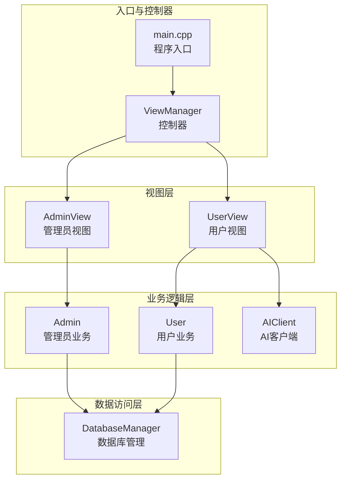
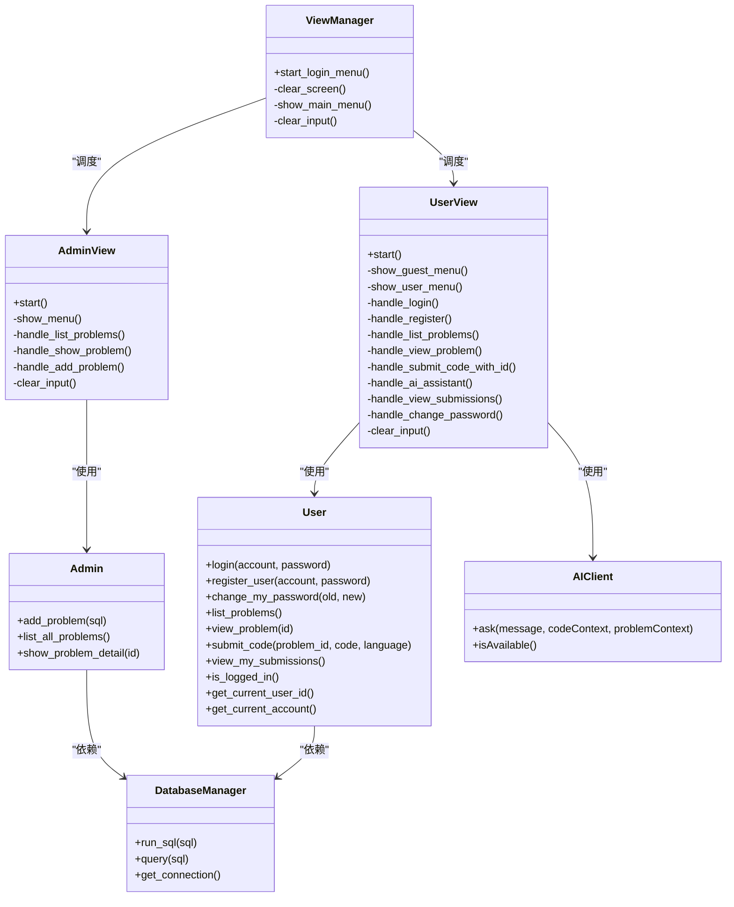
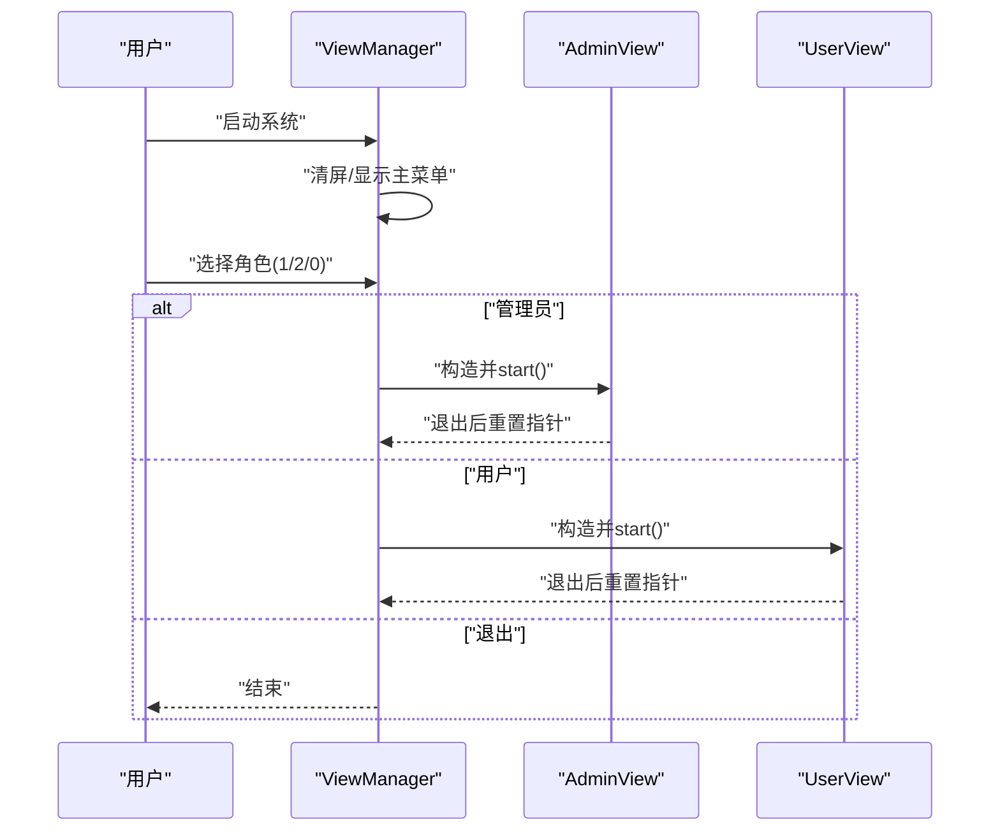
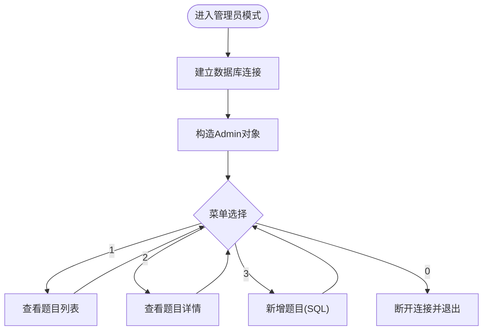
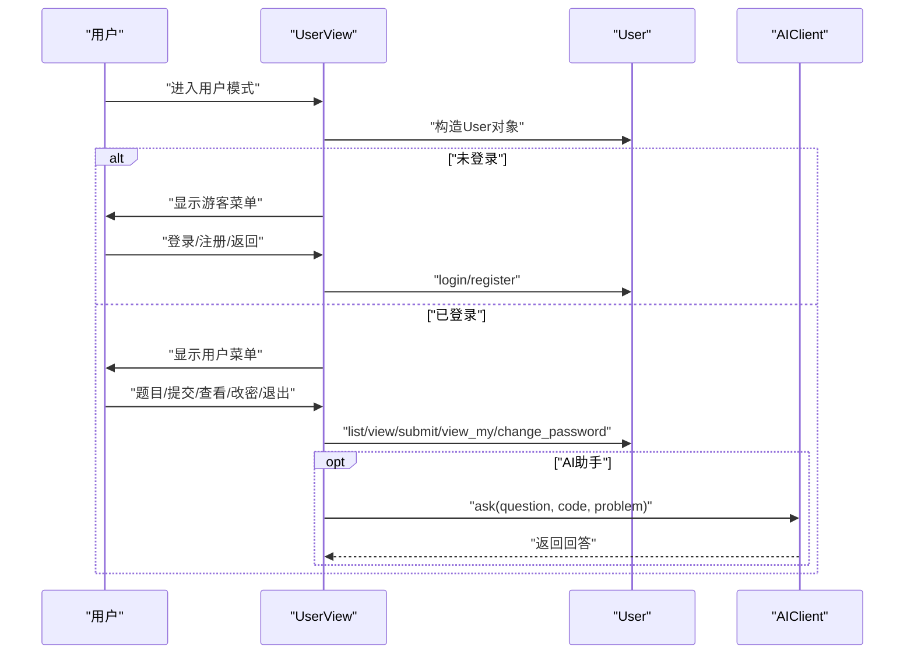
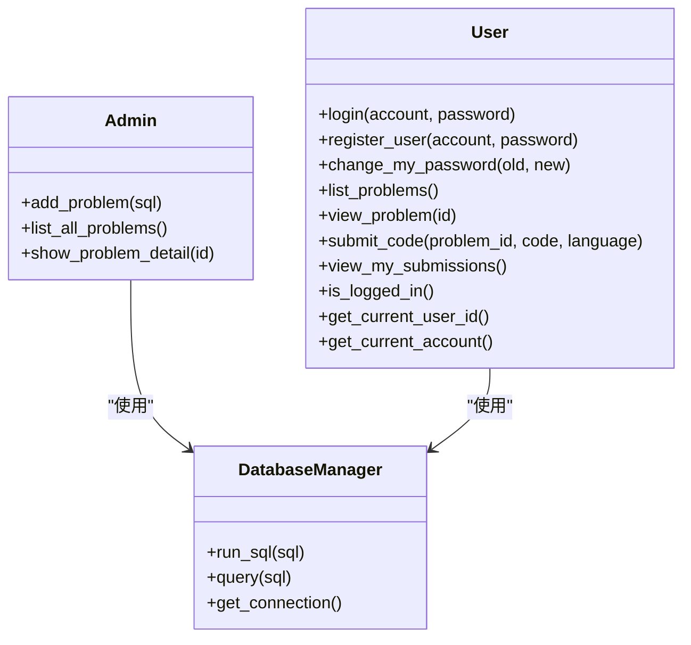
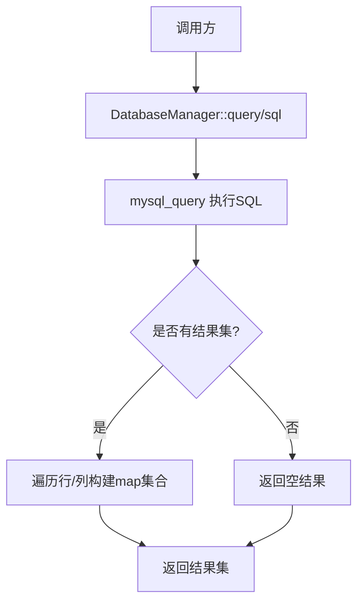
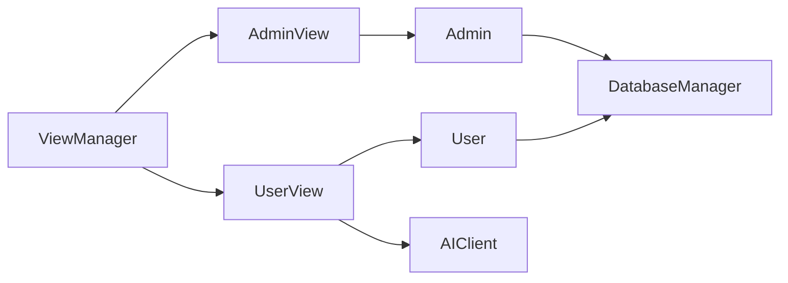

# MVC设计模式应用

<cite>
**本文档引用的文件**
- [main.cpp](file://src/main.cpp)
- [view_manager.h](file://include/view_manager.h)
- [view_manager.cpp](file://src/view_manager.cpp)
- [admin_view.h](file://include/admin_view.h)
- [admin_view.cpp](file://src/admin_view.cpp)
- [user_view.h](file://include/user_view.h)
- [user_view.cpp](file://src/user_view.cpp)
- [admin.h](file://include/admin.h)
- [admin.cpp](file://src/admin.cpp)
- [user.h](file://include/user.h)
- [user.cpp](file://src/user.cpp)
- [db_manager.h](file://include/db_manager.h)
- [db_manager.cpp](file://src/db_manager.cpp)
- [ai_client.h](file://include/ai_client.h)
- [ai_client.cpp](file://src/ai_client.cpp)
</cite>

## 目录
1. [引言](#引言)
2. [项目结构](#项目结构)
3. [核心组件](#核心组件)
4. [架构总览](#架构总览)
5. [详细组件分析](#详细组件分析)
6. [依赖关系分析](#依赖关系分析)
7. [性能考虑](#性能考虑)
8. [故障排除指南](#故障排除指南)
9. [结论](#结论)

## 引言
本文件系统性阐述该OJ系统中MVC（Model-View-Controller）设计模式的具体落地方式，重点说明：
- 控制器（ViewManager）如何协调视图与业务逻辑
- 视图层（AdminView、UserView）如何处理用户交互
- 业务逻辑（Admin、User）如何与数据访问层（DatabaseManager）解耦
- 各层职责划分、数据流向与控制流程
- 通过实际代码路径示例展示模式应用，并总结该架构带来的可复用性、可测试性与可维护性优势

## 项目结构
该项目采用分层清晰的组织方式：
- include/：对外暴露的头文件，定义接口与类声明
- src/：实现文件，包含控制器、视图、业务逻辑与数据访问层
- ai/：AI辅助功能模块（与用户视图集成）

图表来源
- [main.cpp:5-12](file://src/main.cpp#L5-L12)
- [view_manager.h:11-40](file://include/view_manager.h#L11-L40)
- [admin_view.h:11-55](file://include/admin_view.h#L11-L55)
- [user_view.h:12-89](file://include/user_view.h#L12-L89)
- [admin.h:10-37](file://include/admin.h#L10-L37)
- [user.h:10-86](file://include/user.h#L10-L86)
- [db_manager.h:12-46](file://include/db_manager.h#L12-L46)
- [ai_client.h:6-25](file://include/ai_client.h#L6-L25)

章节来源
- [main.cpp:1-14](file://src/main.cpp#L1-L14)
- [view_manager.h:1-43](file://include/view_manager.h#L1-L43)
- [admin_view.h:1-58](file://include/admin_view.h#L1-L58)
- [user_view.h:1-92](file://include/user_view.h#L1-L92)
- [admin.h:1-40](file://include/admin.h#L1-L40)
- [user.h:1-89](file://include/user.h#L1-L89)
- [db_manager.h:1-53](file://include/db_manager.h#L1-L53)
- [ai_client.h:1-28](file://include/ai_client.h#L1-L28)

## 核心组件
- 控制器（ViewManager）
  - 职责：统一启动登录菜单、根据用户选择实例化并调度AdminView/UserView；负责清屏、输入清理等通用UI行为
  - 关键方法：启动登录菜单、显示主菜单、清屏、清空输入缓冲区
  - 代码路径参考：[view_manager.cpp:32-70](file://src/view_manager.cpp#L32-L70)，[view_manager.h:20-40](file://include/view_manager.h#L20-L40)

- 视图层（AdminView、UserView）
  - AdminView：面向管理员的菜单与交互，负责题目增删改查、列表展示等
  - UserView：面向普通用户的菜单与交互，负责登录/注册、题目浏览、提交代码、查看提交记录、修改密码、AI助手等
  - 共同点：均持有DatabaseManager与业务对象指针，负责用户输入收集、菜单展示、调用业务逻辑并呈现结果
  - 代码路径参考：
    - [admin_view.cpp:21-76](file://src/admin_view.cpp#L21-L76)，[admin_view.h:20-55](file://include/admin_view.h#L20-L55)
    - [user_view.cpp:21-116](file://src/user_view.cpp#L21-L116)，[user_view.h:21-89](file://include/user_view.h#L21-L89)

- 业务逻辑层（Admin、User）
  - Admin：封装管理员特有业务，如发布题目、列出题目、查看题目详情
  - User：封装用户业务，如登录/注册/改密、查看题目、提交代码、查看提交记录
  - 两者均依赖DatabaseManager执行SQL与查询
  - 代码路径参考：
    - [admin.cpp:12-58](file://src/admin.cpp#L12-L58)，[admin.h:15-37](file://include/admin.h#L15-L37)
    - [user.cpp:39-222](file://src/user.cpp#L39-L222)，[user.h:16-86](file://include/user.h#L16-L86)

- 数据访问层（DatabaseManager）
  - 职责：封装MySQL连接、SQL执行、查询结果解析为键值映射集合
  - 代码路径参考：[db_manager.cpp:8-57](file://src/db_manager.cpp#L8-L57)，[db_manager.h:18-46](file://include/db_manager.h#L18-L46)

- AI客户端（AIClient）
  - 职责：封装Python脚本调用，向AI服务发起请求并返回结果
  - 代码路径参考：[ai_client.cpp:85-112](file://src/ai_client.cpp#L85-L112)，[ai_client.h:12-25](file://include/ai_client.h#L12-L25)

章节来源
- [view_manager.cpp:10-76](file://src/view_manager.cpp#L10-L76)
- [admin_view.cpp:10-137](file://src/admin_view.cpp#L10-L137)
- [user_view.cpp:10-351](file://src/user_view.cpp#L10-L351)
- [admin.cpp:10-58](file://src/admin.cpp#L10-L58)
- [user.cpp:11-222](file://src/user.cpp#L11-L222)
- [db_manager.cpp:8-99](file://src/db_manager.cpp#L8-L99)
- [ai_client.cpp:85-123](file://src/ai_client.cpp#L85-L123)

## 架构总览
MVC在本项目中的体现：
- Model（模型）：Admin、User、DatabaseManager
- View（视图）：AdminView、UserView
- Controller（控制器）：ViewManager

图表来源
- [view_manager.h:11-40](file://include/view_manager.h#L11-L40)
- [admin_view.h:11-55](file://include/admin_view.h#L11-L55)
- [user_view.h:12-89](file://include/user_view.h#L12-L89)
- [admin.h:10-37](file://include/admin.h#L10-L37)
- [user.h:10-86](file://include/user.h#L10-L86)
- [db_manager.h:12-46](file://include/db_manager.h#L12-L46)
- [ai_client.h:6-25](file://include/ai_client.h#L6-L25)

## 详细组件分析

### 控制器：ViewManager
- 职责边界
  - 仅负责控制流与视图调度，不直接参与业务逻辑
  - 统一处理输入校验、清屏、菜单展示等横切关注点
- 控制流程
  - 启动登录菜单 → 接收用户角色选择 → 实例化对应视图 → 视图内部完成业务循环 → 视图退出后释放资源
- 关键路径
  - [view_manager.cpp:32-70](file://src/view_manager.cpp#L32-L70)：登录菜单与角色分发
  - [view_manager.cpp:14-19](file://src/view_manager.cpp#L14-L19)：清屏实现
  - [view_manager.cpp:72-76](file://src/view_manager.cpp#L72-L76)：输入缓冲区清理

图表来源
- [view_manager.cpp:32-70](file://src/view_manager.cpp#L32-L70)
- [admin_view.cpp:21-76](file://src/admin_view.cpp#L21-L76)
- [user_view.cpp:21-116](file://src/user_view.cpp#L21-L116)

章节来源
- [view_manager.cpp:10-76](file://src/view_manager.cpp#L10-L76)
- [view_manager.h:11-40](file://include/view_manager.h#L11-L40)

### 视图层：AdminView
- 职责
  - 管理员专用菜单与交互，负责题目管理（列表、详情、新增）
  - 内部持有DatabaseManager与Admin对象，负责UI与业务调用的桥接
- 控制流程
  - 连接数据库 → 构造Admin对象 → 进入管理员菜单循环 → 分发到具体处理函数 → 退出时释放资源
- 关键路径
  - [admin_view.cpp:21-76](file://src/admin_view.cpp#L21-L76)：start与菜单循环
  - [admin_view.cpp:91-131](file://src/admin_view.cpp#L91-L131)：题目列表、详情、新增处理
  - [admin_view.h:20-55](file://include/admin_view.h#L20-L55)：成员变量与私有方法声明

图表来源
- [admin_view.cpp:21-76](file://src/admin_view.cpp#L21-L76)
- [admin_view.cpp:91-131](file://src/admin_view.cpp#L91-L131)

章节来源
- [admin_view.cpp:10-137](file://src/admin_view.cpp#L10-L137)
- [admin_view.h:11-55](file://include/admin_view.h#L11-L55)

### 视图层：UserView
- 职责
  - 支持游客态（未登录）与登录态（已登录）双菜单
  - 提供登录/注册、题目浏览、提交代码、查看提交记录、修改密码、AI助手等功能
- 控制流程
  - 连接数据库 → 构造User对象 → 判断登录状态 → 展示相应菜单 → 分发处理 → 退出时释放资源
- 关键路径
  - [user_view.cpp:21-116](file://src/user_view.cpp#L21-L116)：start与登录/注册分支
  - [user_view.cpp:198-259](file://src/user_view.cpp#L198-L259)：题目详情与子菜单（提交代码/AI助手）
  - [user_view.cpp:275-311](file://src/user_view.cpp#L275-L311)：AI助手调用
  - [user_view.h:21-89](file://include/user_view.h#L21-L89)：成员变量与方法声明

图表来源
- [user_view.cpp:21-116](file://src/user_view.cpp#L21-L116)
- [user_view.cpp:198-311](file://src/user_view.cpp#L198-L311)
- [user.cpp:39-222](file://src/user.cpp#L39-L222)
- [ai_client.cpp:85-112](file://src/ai_client.cpp#L85-L112)

章节来源
- [user_view.cpp:10-351](file://src/user_view.cpp#L10-L351)
- [user_view.h:12-89](file://include/user_view.h#L12-L89)

### 业务逻辑层：Admin与User
- Admin
  - 依赖DatabaseManager执行SQL与查询
  - 提供题目管理能力：新增、列表、详情
  - 关键路径：[admin.cpp:12-58](file://src/admin.cpp#L12-L58)
- User
  - 提供认证与个人信息管理：登录、注册、改密
  - 提供题目与提交相关能力：列表、详情、提交、查看提交记录
  - 关键路径：[user.cpp:39-222](file://src/user.cpp#L39-L222)

图表来源
- [admin.h:10-37](file://include/admin.h#L10-L37)
- [user.h:10-86](file://include/user.h#L10-L86)
- [db_manager.h:12-46](file://include/db_manager.h#L12-L46)

章节来源
- [admin.cpp:10-58](file://src/admin.cpp#L10-L58)
- [user.cpp:11-222](file://src/user.cpp#L11-L222)
- [admin.h:10-37](file://include/admin.h#L10-L37)
- [user.h:10-86](file://include/user.h#L10-L86)
- [db_manager.h:12-46](file://include/db_manager.h#L12-L46)

### 数据访问层：DatabaseManager
- 职责
  - 封装MySQL连接生命周期、SQL执行与查询结果解析
  - 对外提供run_sql与query两个核心接口
- 关键路径
  - [db_manager.cpp:8-57](file://src/db_manager.cpp#L8-L57)：run_sql与query实现
  - [db_manager.cpp:61-79](file://src/db_manager.cpp#L61-L79)：connect_db实现
  - [db_manager.h:18-46](file://include/db_manager.h#L18-L46)：接口声明

图表来源
- [db_manager.cpp:26-57](file://src/db_manager.cpp#L26-L57)

章节来源
- [db_manager.cpp:8-99](file://src/db_manager.cpp#L8-L99)
- [db_manager.h:12-46](file://include/db_manager.h#L12-L46)

### AI客户端：AIClient
- 职责
  - 封装Python脚本调用，支持转义特殊字符、执行命令并读取标准输出
  - 提供isAvailable检测可用性
- 关键路径
  - [ai_client.cpp:85-112](file://src/ai_client.cpp#L85-L112)：ask实现
  - [ai_client.cpp:114-123](file://src/ai_client.cpp#L114-L123)：isAvailable实现
  - [ai_client.h:12-25](file://include/ai_client.h#L12-L25)：接口声明

章节来源
- [ai_client.cpp:8-123](file://src/ai_client.cpp#L8-L123)
- [ai_client.h:6-25](file://include/ai_client.h#L6-L25)

## 依赖关系分析
- 控制器依赖视图：ViewManager通过智能指针持有AdminView/UserView，实现运行时动态调度
- 视图依赖业务：AdminView/UserView分别持有Admin/User对象，用于封装业务调用
- 业务依赖数据访问：Admin/User均依赖DatabaseManager执行SQL与查询
- 视图可选依赖AI：UserView在需要时使用AIClient与外部AI服务通信
- 反向依赖方向：数据访问层不依赖业务/视图，保持低耦合

图表来源
- [view_manager.h:23-24](file://include/view_manager.h#L23-L24)
- [admin_view.h:23-24](file://include/admin_view.h#L23-L24)
- [user_view.h:24-26](file://include/user_view.h#L24-L26)
- [admin.h:36](file://include/admin.h#L36)
- [user.h:82](file://include/user.h#L82)
- [db_manager.h:45](file://include/db_manager.h#L45)
- [ai_client.h:19-21](file://include/ai_client.h#L19-L21)

章节来源
- [view_manager.h:23-24](file://include/view_manager.h#L23-L24)
- [admin_view.h:23-24](file://include/admin_view.h#L23-L24)
- [user_view.h:24-26](file://include/user_view.h#L24-L26)
- [admin.h:36](file://include/admin.h#L36)
- [user.h:82](file://include/user.h#L82)
- [db_manager.h:45](file://include/db_manager.h#L45)
- [ai_client.h:19-21](file://include/ai_client.h#L19-L21)

## 性能考虑
- I/O密集型：数据库查询与AI服务调用均为阻塞I/O，建议在高并发场景下引入异步或连接池策略（当前版本为CLI单线程，无需过度优化）
- 字符串拼接：SQL拼接存在安全风险与性能开销，建议后续引入参数化查询与预编译语句
- 输出格式化：大量使用字符串拼接与setw格式化，建议集中到统一的输出工具模块，便于维护与国际化
- 资源管理：智能指针确保RAII，避免显式delete，降低内存泄漏风险

## 故障排除指南
- 登录失败
  - 现象：账号不存在/密码错误
  - 定位：User::login的查询与哈希比对逻辑
  - 参考路径：[user.cpp:39-71](file://src/user.cpp#L39-L71)
- 注册失败
  - 现象：账号已存在
  - 定位：User::register_user的重复检查与插入
  - 参考路径：[user.cpp:73-98](file://src/user.cpp#L73-L98)
- 题目不存在
  - 现象：查看题目详情时报错
  - 定位：Admin/User的view_problem/detail查询
  - 参考路径：[admin.cpp:43-58](file://src/admin.cpp#L43-L58)，[user.cpp:173-199](file://src/user.cpp#L173-L199)
- 数据库连接失败
  - 现象：连接失败提示
  - 定位：DatabaseManager::connect_db与构造函数
  - 参考路径：[db_manager.cpp:61-79](file://src/db_manager.cpp#L61-L79)
- AI服务不可用
  - 现象：AI助手提示不可用
  - 定位：AIClient::isAvailable与ask
  - 参考路径：[ai_client.cpp:114-123](file://src/ai_client.cpp#L114-L123)，[ai_client.cpp:85-112](file://src/ai_client.cpp#L85-L112)

章节来源
- [user.cpp:39-222](file://src/user.cpp#L39-L222)
- [admin.cpp:43-58](file://src/admin.cpp#L43-L58)
- [db_manager.cpp:61-79](file://src/db_manager.cpp#L61-L79)
- [ai_client.cpp:85-123](file://src/ai_client.cpp#L85-L123)

## 结论
该OJ系统通过清晰的MVC分层实现了职责分离：
- 控制器（ViewManager）专注于流程编排与视图调度，保持极简
- 视图层（AdminView/UserView）专注用户交互与菜单驱动，便于扩展新功能
- 业务逻辑层（Admin/User）与数据访问层（DatabaseManager）解耦，利于单元测试与重构
- 与AI服务的集成通过AIClient抽象，不影响核心MVC结构

这种架构带来的收益包括：
- 可复用性：Admin/User可被不同视图共享；DatabaseManager可被多业务复用
- 可测试性：业务逻辑与数据访问可独立Mock，便于编写单元测试
- 可维护性：变更集中在单一职责模块内，降低跨层影响