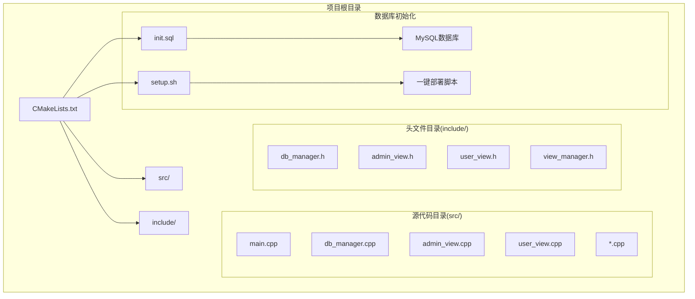
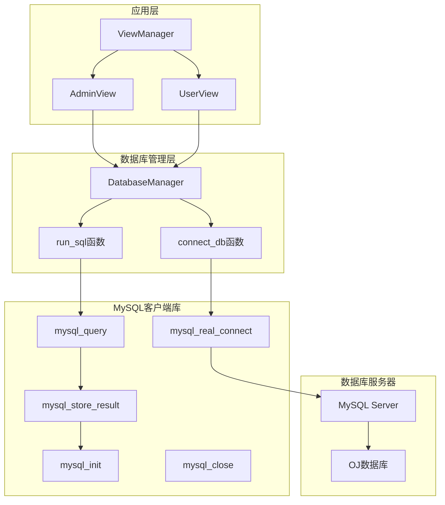
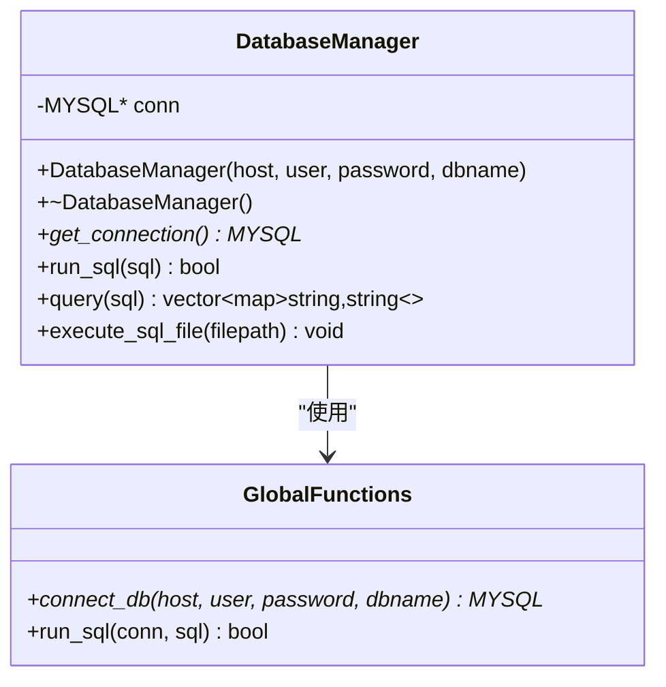
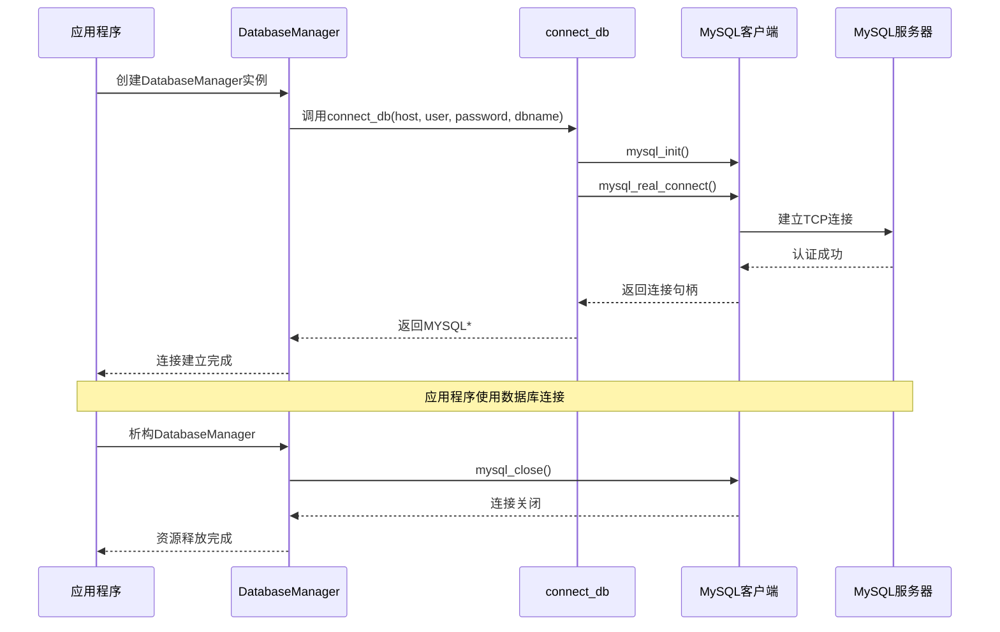
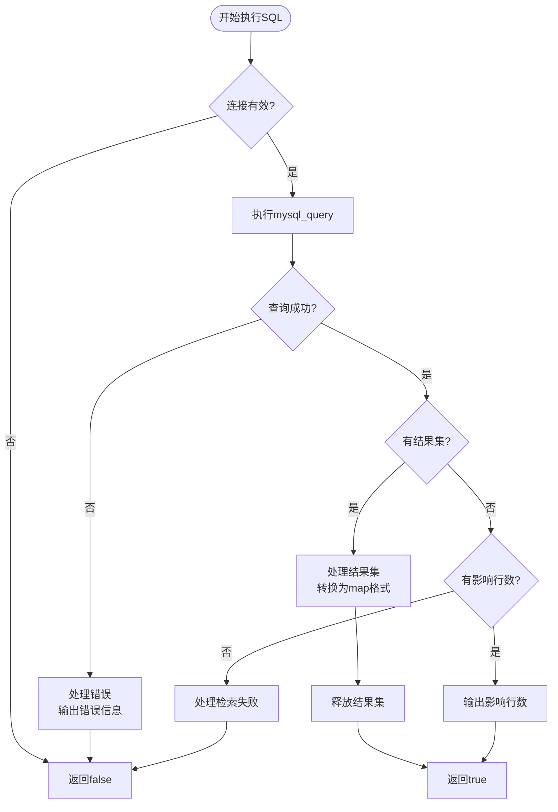
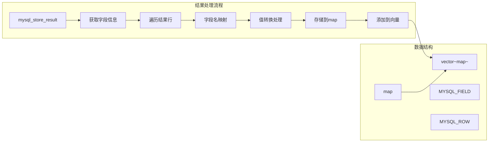
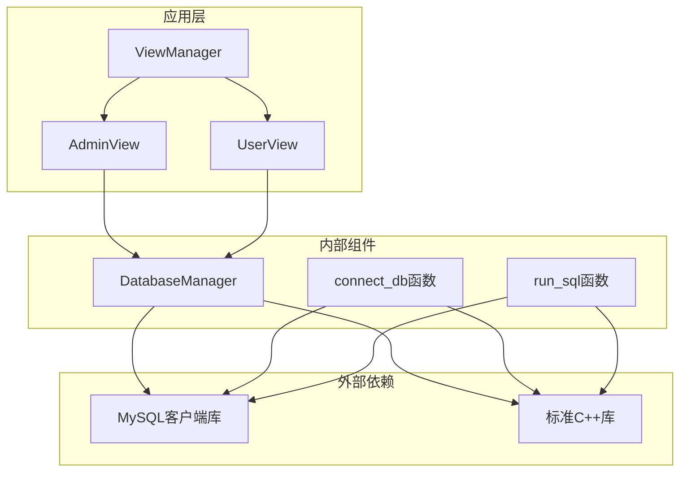
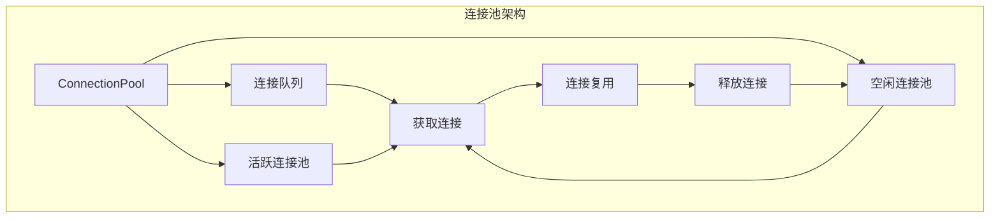

# 数据库管理层设计

<cite>
**本文档引用的文件**
- [db_manager.h](file://include/db_manager.h)
- [db_manager.cpp](file://src/db_manager.cpp)
- [CMakeLists.txt](file://CMakeLists.txt)
- [init.sql](file://init.sql)
- [main.cpp](file://src/main.cpp)
- [admin_view.cpp](file://src/admin_view.cpp)
- [user_view.cpp](file://src/user_view.cpp)
- [view_manager.h](file://include/view_manager.h)
</cite>

## 目录
1. [简介](#简介)
2. [项目结构](#项目结构)
3. [核心组件](#核心组件)
4. [架构概览](#架构概览)
5. [详细组件分析](#详细组件分析)
6. [依赖关系分析](#依赖关系分析)
7. [性能考虑](#性能考虑)
8. [故障排除指南](#故障排除指南)
9. [结论](#结论)

## 简介

OJ系统数据库管理层采用MySQL客户端库实现，提供了简洁高效的数据库连接管理和SQL执行封装。该模块设计遵循RAII资源管理模式，通过智能指针管理数据库连接生命周期，实现了自动化的资源清理和异常安全。

数据库管理层的核心设计理念包括：
- **RAII资源管理**：通过构造函数建立连接，析构函数自动释放资源
- **连接池缺失**：当前实现为单连接模式，适合命令行应用场景
- **异常处理机制**：基于MySQL客户端库的错误报告和状态检查
- **参数化查询支持**：通过字符串拼接实现基本的参数绑定

## 项目结构

OJ系统采用模块化设计，数据库管理层位于独立的头文件和实现文件中，通过CMake构建系统进行编译和链接。

**图表来源**
- [CMakeLists.txt:1-36](file://CMakeLists.txt#L1-L36)
- [main.cpp:1-12](file://src/main.cpp#L1-L12)

**章节来源**
- [CMakeLists.txt:1-36](file://CMakeLists.txt#L1-L36)
- [db_manager.h:1-58](file://include/db_manager.h#L1-L58)

## 核心组件

数据库管理层主要包含以下核心组件：

### DatabaseManager类
- **职责**：封装MySQL连接和SQL执行操作
- **接口**：提供连接管理、SQL执行、结果处理等功能
- **资源管理**：采用RAII模式自动管理连接生命周期

### 连接管理组件
- **连接建立**：通过mysql_real_connect建立数据库连接
- **连接验证**：检查连接状态并处理连接失败情况
- **连接关闭**：在析构函数中自动释放连接资源

### SQL执行组件
- **查询执行**：支持SELECT语句的结果集处理
- **更新执行**：支持INSERT、UPDATE、DELETE语句
- **批量执行**：支持从SQL文件批量执行语句

**章节来源**
- [db_manager.h:12-51](file://include/db_manager.h#L12-L51)
- [db_manager.cpp:8-20](file://src/db_manager.cpp#L8-L20)

## 架构概览

数据库管理层采用分层架构设计，将MySQL客户端库调用封装在高层接口之后，为上层业务逻辑提供统一的数据访问接口。

**图表来源**
- [db_manager.cpp:105-124](file://src/db_manager.cpp#L105-L124)
- [db_manager.cpp:126-175](file://src/db_manager.cpp#L126-L175)

## 详细组件分析

### DatabaseManager类设计

DatabaseManager类采用面向对象设计，封装了MySQL连接的所有细节，为上层应用提供简洁的接口。

**图表来源**
- [db_manager.h:12-51](file://include/db_manager.h#L12-L51)
- [db_manager.cpp:8-20](file://src/db_manager.cpp#L8-L20)

#### 构造函数设计
构造函数负责建立数据库连接，采用RAII模式确保资源正确管理：
- 参数验证和默认值处理
- 调用connect_db函数建立连接
- 异常情况下的错误处理

#### 析构函数设计
析构函数实现自动资源清理：
- 检查连接有效性
- 调用mysql_close关闭连接
- 输出资源释放状态信息

#### 关键方法实现

**run_sql方法**：执行任意SQL语句并处理结果
- 调用全局run_sql函数
- 支持查询和非查询语句
- 自动处理结果集输出

**query方法**：执行查询语句并返回结构化结果
- 执行SQL查询
- 处理结果集转换为map格式
- 支持字段名映射和NULL值处理

**execute_sql_file方法**：从文件批量执行SQL语句
- 读取SQL文件内容
- 解析SQL语句（按分号分割）
- 逐条执行并处理错误

**章节来源**
- [db_manager.cpp:22-58](file://src/db_manager.cpp#L22-L58)
- [db_manager.cpp:60-101](file://src/db_manager.cpp#L60-L101)

### 连接管理机制

数据库连接管理采用RAII模式，通过智能指针和构造/析构函数实现自动资源管理。

**图表来源**
- [db_manager.cpp:8-20](file://src/db_manager.cpp#L8-L20)
- [db_manager.cpp:105-124](file://src/db_manager.cpp#L105-L124)

### SQL执行流程

SQL执行流程根据语句类型分为不同的处理路径，确保不同类型的操作得到正确的处理。

**图表来源**
- [db_manager.cpp:126-175](file://src/db_manager.cpp#L126-L175)

### MySQL客户端库集成

数据库管理层直接集成MySQL客户端库，通过标准的C API进行数据库操作。

#### 编译时依赖配置
- **包管理器**：使用pkg-config查找mysqlclient库
- **包含目录**：自动添加MySQL头文件路径
- **链接库**：动态链接MySQL客户端库

#### 运行时连接建立
- **初始化**：调用mysql_init创建连接对象
- **认证**：使用mysql_real_connect进行用户认证
- **配置**：设置连接参数（主机、端口、数据库名）

#### 安全连接参数
- **用户名密码**：通过构造函数参数传递
- **数据库选择**：支持指定目标数据库
- **连接超时**：默认使用MySQL客户端库的超时设置

**章节来源**
- [CMakeLists.txt:11-31](file://CMakeLists.txt#L11-L31)
- [db_manager.cpp:105-124](file://src/db_manager.cpp#L105-L124)

### 参数绑定和安全考虑

当前实现采用字符串拼接的方式处理参数，存在SQL注入风险。建议改进方案：

#### 现状分析
- **字符串拼接**：直接将用户输入拼接到SQL语句中
- **无参数绑定**：缺少预处理语句和参数绑定机制
- **安全风险**：容易受到SQL注入攻击

#### 改进建议
- **预处理语句**：使用mysql_stmt_*系列函数
- **参数绑定**：通过mysql_stmt_bind_param绑定参数
- **类型安全**：确保参数类型与数据库字段匹配

### 查询结果处理

查询结果处理采用灵活的数据结构，支持不同类型的查询结果。

**图表来源**
- [db_manager.cpp:27-58](file://src/db_manager.cpp#L27-L58)

**章节来源**
- [db_manager.cpp:27-58](file://src/db_manager.cpp#L27-L58)

## 依赖关系分析

数据库管理层的依赖关系相对简单，主要依赖于MySQL客户端库和标准C++库。

**图表来源**
- [db_manager.h:4](file://include/db_manager.h#L4)
- [CMakeLists.txt:13](file://CMakeLists.txt#L13)

### 依赖特性分析

**耦合度评估**：
- **低耦合**：DatabaseManager类封装了所有MySQL细节
- **清晰接口**：对外提供简洁的C++接口
- **易于替换**：可以方便地替换为其他数据库实现

**内聚性分析**：
- **高内聚**：所有数据库相关功能集中在单一类中
- **功能完整**：包含连接管理、SQL执行、结果处理
- **职责明确**：单一职责原则得到良好体现

**潜在问题**：
- **连接池缺失**：当前为单连接模式，不适合高并发场景
- **线程安全**：未实现线程安全机制
- **连接重用**：缺乏连接池管理

**章节来源**
- [db_manager.h:12-51](file://include/db_manager.h#L12-L51)
- [CMakeLists.txt:11-31](file://CMakeLists.txt#L11-L31)

## 性能考虑

数据库管理层在性能方面具有以下特点和优化空间：

### 当前性能特征
- **单连接模型**：每个DatabaseManager实例维护一个连接
- **阻塞I/O**：MySQL客户端库使用同步阻塞模式
- **内存管理**：自动管理结果集内存分配和释放

### 性能优化建议

#### 连接池实现

#### 并发访问优化
- **线程安全**：实现连接池的线程安全机制
- **连接复用**：避免频繁建立和关闭连接
- **批量操作**：支持事务批量提交

#### 查询优化
- **索引利用**：确保数据库表有适当的索引
- **查询缓存**：实现查询结果缓存机制
- **连接超时**：合理设置连接超时参数

### 内存管理优化
- **结果集分页**：对于大量数据采用分页处理
- **智能释放**：及时释放不再使用的内存
- **内存池**：考虑使用内存池减少分配开销

## 故障排除指南

### 常见连接问题

**连接失败排查**：
1. 检查MySQL服务是否启动
2. 验证用户名和密码正确性
3. 确认网络连接正常
4. 检查防火墙设置

**连接超时问题**：
- 调整MySQL服务器的wait_timeout参数
- 实现连接健康检查机制
- 考虑实现连接重试逻辑

### SQL执行错误处理

**查询失败诊断**：
- 检查SQL语法正确性
- 验证表名和字段名存在
- 确认用户权限足够

**结果集处理问题**：
- 检查mysql_store_result返回值
- 确保正确释放结果集内存
- 处理NULL值和空字符串

### 资源管理问题

**内存泄漏检测**：
- 确保每次mysql_store_result都有对应的mysql_free_result
- 检查连接关闭时机
- 使用智能指针管理连接生命周期

**章节来源**
- [db_manager.cpp:33-37](file://src/db_manager.cpp#L33-L37)
- [db_manager.cpp:91-94](file://src/db_manager.cpp#L91-L94)

## 结论

OJ系统的DatabaseManager模块设计简洁高效，成功实现了MySQL数据库的连接管理和SQL执行封装。模块采用RAII资源管理模式，通过智能指针确保资源的正确管理，为上层应用提供了统一的数据访问接口。

### 主要优势
- **设计简洁**：接口设计直观易用
- **资源安全**：RAII模式确保资源正确释放
- **功能完整**：涵盖连接管理、SQL执行、结果处理
- **易于集成**：与现有项目结构无缝集成

### 改进建议
- **实现连接池**：支持多连接并发访问
- **增强安全性**：引入参数化查询防止SQL注入
- **提升性能**：优化查询执行和结果处理
- **扩展功能**：支持事务管理和批量操作

该模块为OJ系统的数据持久化提供了坚实的基础，通过合理的架构设计和资源管理，确保了系统的稳定性和可靠性。随着功能需求的增长，可以在保持现有接口不变的前提下进行扩展和优化。