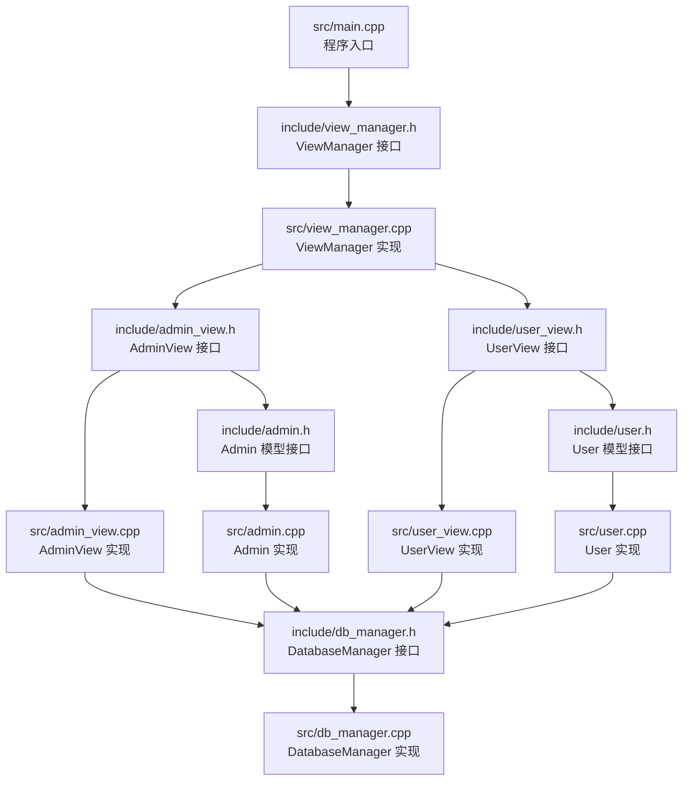
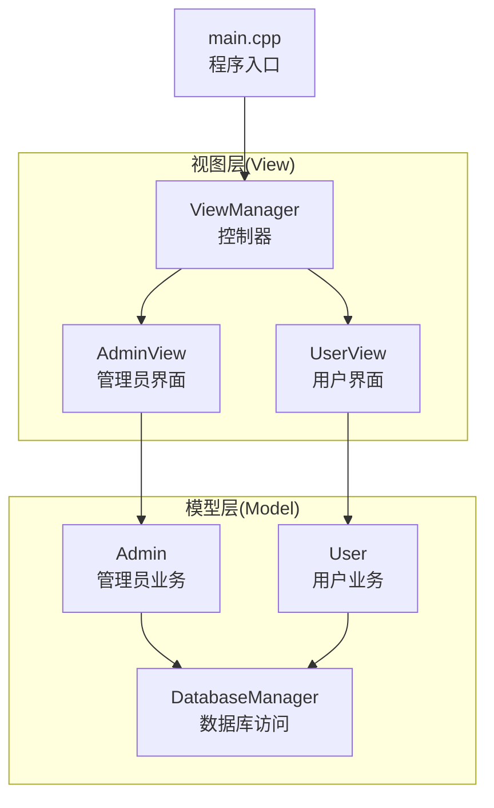
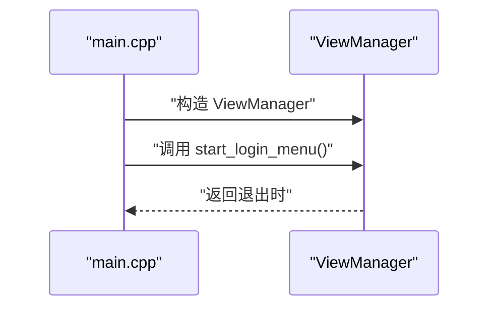
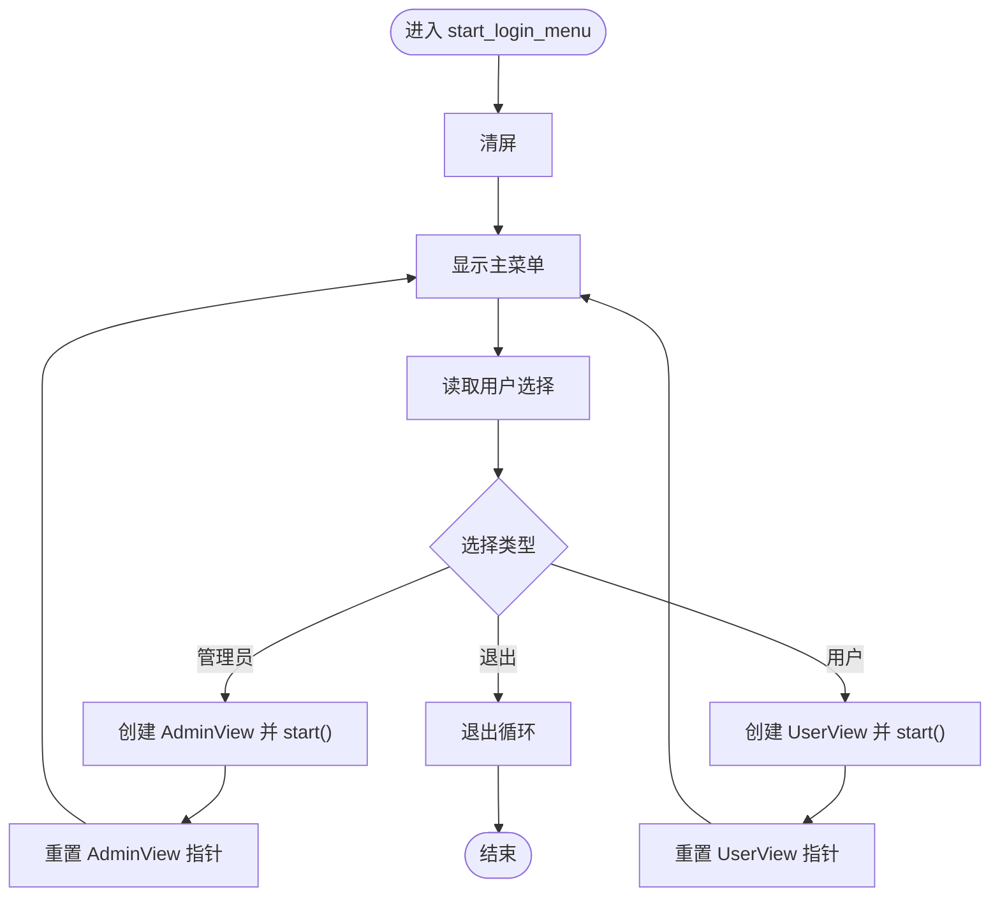
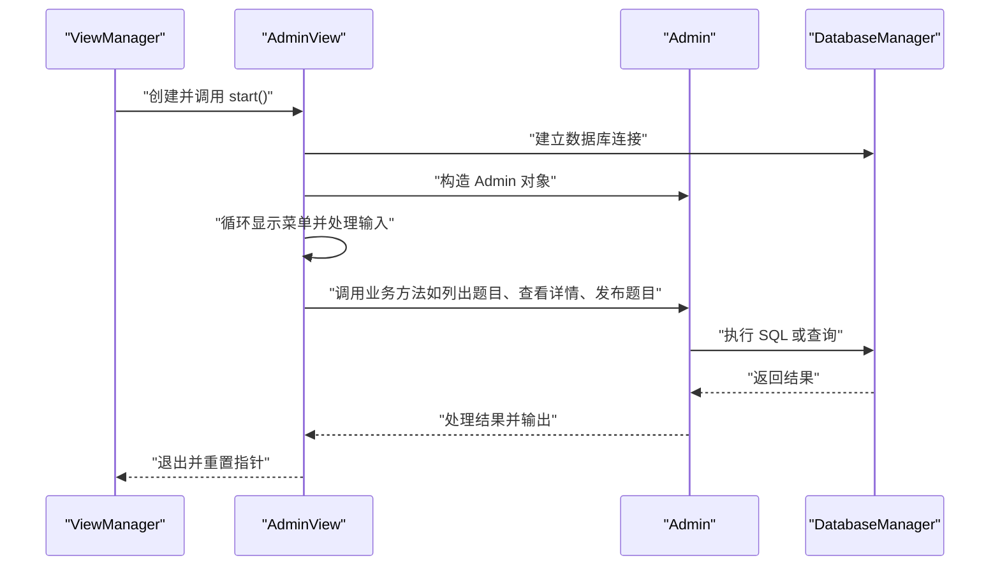
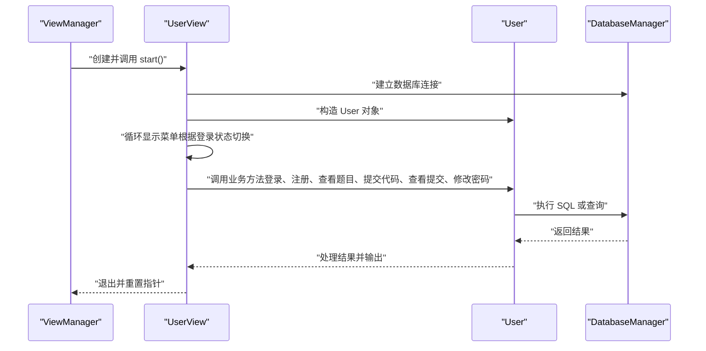
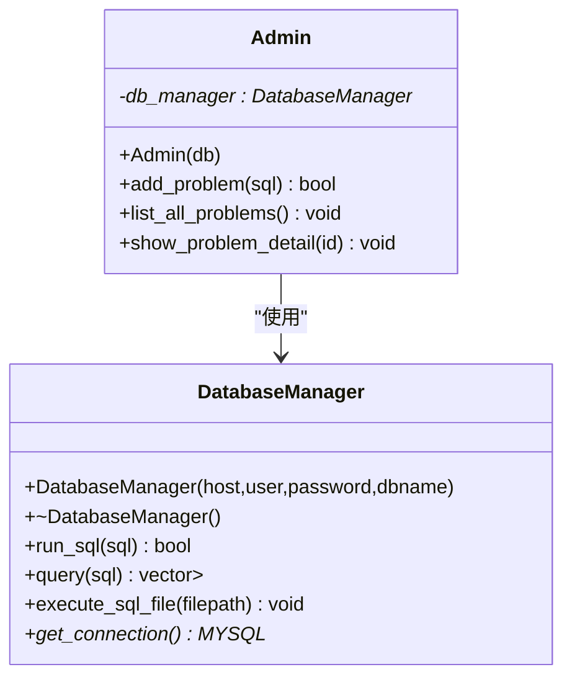
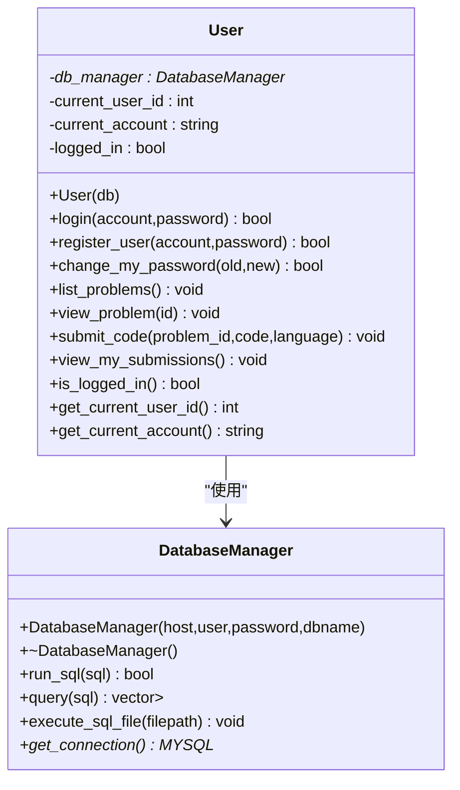
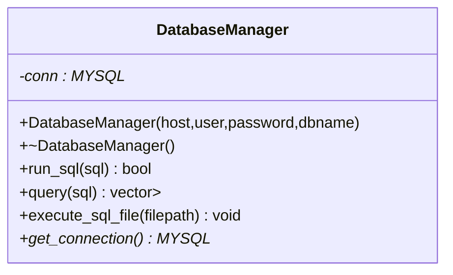
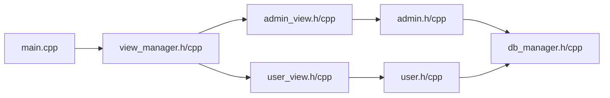

# 整体架构概览

<cite>
**本文档引用的文件**
- [main.cpp](file://src/main.cpp)
- [view_manager.h](file://include/view_manager.h)
- [view_manager.cpp](file://src/view_manager.cpp)
- [admin_view.h](file://include/admin_view.h)
- [admin_view.cpp](file://src/admin_view.cpp)
- [user_view.h](file://include/user_view.h)
- [user_view.cpp](file://src/user_view.cpp)
- [admin.h](file://include/admin.h)
- [admin.cpp](file://src/admin.cpp)
- [user.h](file://include/user.h)
- [user.cpp](file://src/user.cpp)
- [db_manager.h](file://include/db_manager.h)
- [db_manager.cpp](file://src/db_manager.cpp)
- [CMakeLists.txt](file://CMakeLists.txt)
- [README.md](file://README.md)
</cite>

## 目录
1. [简介](#简介)
2. [项目结构](#项目结构)
3. [核心组件](#核心组件)
4. [架构总览](#架构总览)
5. [详细组件分析](#详细组件分析)
6. [依赖关系分析](#依赖关系分析)
7. [性能考虑](#性能考虑)
8. [故障排除指南](#故障排除指南)
9. [结论](#结论)

## 简介
本文件为在线判题系统（OJ）的整体架构概览文档，聚焦于系统的高层设计模式与MVC架构思想在命令行界面中的落地实践。系统采用清晰的分层与职责分离：
- 视图层（View）：负责用户界面呈现与交互，如登录菜单、角色选择、各功能菜单等。
- 控制器层（Controller）：由ViewManager承担，协调视图与业务逻辑，处理用户输入与流程控制。
- 模型层（Model）：封装业务逻辑与数据访问，如用户与管理员的业务方法、数据库访问与查询。

系统从程序入口main函数启动，创建ViewManager并调用其登录菜单启动流程，随后根据用户选择进入管理员或用户模式，建立数据库连接并进入各自的功能循环。该设计遵循单一职责与高内聚低耦合原则，便于扩展与维护。

## 项目结构
项目采用头文件与实现文件分离的组织方式，按模块划分：
- include：对外公开的接口头文件，定义类与接口。
- src：实现文件，包含业务逻辑、视图与控制器的具体实现。
- CMakeLists.txt：构建配置，声明C++标准、依赖查找与链接。
- README.md：项目简要说明。

图表来源
- [main.cpp:1-12](file://src/main.cpp#L1-L12)
- [view_manager.h:1-43](file://include/view_manager.h#L1-L43)
- [view_manager.cpp:1-73](file://src/view_manager.cpp#L1-L73)
- [admin_view.h:1-53](file://include/admin_view.h#L1-L53)
- [admin_view.cpp:1-125](file://src/admin_view.cpp#L1-L125)
- [user_view.h:1-83](file://include/user_view.h#L1-L83)
- [user_view.cpp:1-221](file://src/user_view.cpp#L1-L221)
- [admin.h:1-40](file://include/admin.h#L1-L40)
- [admin.cpp:1-57](file://src/admin.cpp#L1-L57)
- [user.h:1-89](file://include/user.h#L1-L89)
- [user.cpp:1-86](file://src/user.cpp#L1-L86)
- [db_manager.h:1-58](file://include/db_manager.h#L1-L58)
- [db_manager.cpp:1-176](file://src/db_manager.cpp#L1-L176)

章节来源
- [CMakeLists.txt:1-36](file://CMakeLists.txt#L1-L36)
- [README.md:1-2](file://README.md#L1-L2)

## 核心组件
- 程序入口与启动流程
  - main函数创建ViewManager实例，并调用其登录菜单启动函数，完成系统初始化与控制流移交。
- ViewManager（控制器）
  - 负责清屏、显示主菜单、接收用户选择并分发至管理员或用户视图；提供输入缓冲区清理工具。
- AdminView（视图）
  - 管理员模式的界面与交互，负责菜单展示、输入处理与调用Admin模型执行业务。
- UserView（视图）
  - 用户模式的界面与交互，支持登录/注册、题目浏览、提交代码、查看提交记录等功能；根据登录状态切换菜单。
- Admin（模型）
  - 管理员业务逻辑封装，提供题目列表查询、题目详情查看、新增题目等能力。
- User（模型）
  - 用户业务逻辑封装，提供登录、注册、修改密码、题目查看、代码提交、查看提交记录等能力。
- DatabaseManager（模型/数据访问）
  - 数据库连接、SQL执行、查询结果解析、批量执行SQL文件等。

章节来源
- [main.cpp:1-12](file://src/main.cpp#L1-L12)
- [view_manager.h:11-43](file://include/view_manager.h#L11-L43)
- [view_manager.cpp:12-73](file://src/view_manager.cpp#L12-L73)
- [admin_view.h:11-53](file://include/admin_view.h#L11-L53)
- [admin_view.cpp:12-125](file://src/admin_view.cpp#L12-L125)
- [user_view.h:11-83](file://include/user_view.h#L11-L83)
- [user_view.cpp:17-221](file://src/user_view.cpp#L17-L221)
- [admin.h:10-40](file://include/admin.h#L10-L40)
- [admin.cpp:10-57](file://src/admin.cpp#L10-L57)
- [user.h:10-89](file://include/user.h#L10-L89)
- [user.cpp:6-86](file://src/user.cpp#L6-L86)
- [db_manager.h:12-58](file://include/db_manager.h#L12-L58)
- [db_manager.cpp:8-176](file://src/db_manager.cpp#L8-L176)

## 架构总览
系统采用MVC思想在命令行界面中的映射：
- View（视图层）：AdminView、UserView负责UI呈现与用户交互。
- Controller（控制器）：ViewManager负责流程控制与视图调度。
- Model（模型层）：Admin、User封装业务逻辑；DatabaseManager封装数据访问。

图表来源
- [main.cpp:3-11](file://src/main.cpp#L3-L11)
- [view_manager.cpp:28-66](file://src/view_manager.cpp#L28-L66)
- [admin_view.cpp:12-66](file://src/admin_view.cpp#L12-L66)
- [user_view.cpp:17-109](file://src/user_view.cpp#L17-L109)
- [admin.cpp:8-13](file://src/admin.cpp#L8-L13)
- [user.cpp:4-19](file://src/user.cpp#L4-L19)
- [db_manager.cpp:8-25](file://src/db_manager.cpp#L8-L25)

## 详细组件分析

### 组件一：程序入口与启动流程（main）
- 职责
  - 创建ViewManager实例，调用其登录菜单启动函数，建立系统控制流。
- 关键路径
  - [main函数:3-11](file://src/main.cpp#L3-L11)

图表来源
- [main.cpp:3-11](file://src/main.cpp#L3-L11)
- [view_manager.cpp:28-66](file://src/view_manager.cpp#L28-L66)

章节来源
- [main.cpp:1-12](file://src/main.cpp#L1-L12)

### 组件二：ViewManager（控制器）
- 职责
  - 清屏、显示主菜单、接收用户选择并分发到AdminView或UserView；提供输入缓冲区清理。
- 流程控制
  - 主循环持续显示菜单与处理输入，根据选择创建对应视图并进入其start循环，退出后重置指针。
- 关键路径
  - [ViewManager接口:11-43](file://include/view_manager.h#L11-L43)
  - [ViewManager实现:12-73](file://src/view_manager.cpp#L12-L73)

图表来源
- [view_manager.cpp:28-66](file://src/view_manager.cpp#L28-L66)

章节来源
- [view_manager.h:11-43](file://include/view_manager.h#L11-L43)
- [view_manager.cpp:12-73](file://src/view_manager.cpp#L12-L73)

### 组件三：AdminView（视图层）
- 职责
  - 管理员模式界面与交互，负责菜单展示、输入处理与调用Admin模型执行业务。
- 数据库连接
  - 使用管理员专用账号建立数据库连接，失败则提示并退出。
- 功能菜单
  - 查看题目列表、查看题目详情、发布新题目（手动输入SQL），返回登录菜单。
- 关键路径
  - [AdminView接口:11-53](file://include/admin_view.h#L11-L53)
  - [AdminView实现:12-125](file://src/admin_view.cpp#L12-125)

图表来源
- [admin_view.cpp:12-66](file://src/admin_view.cpp#L12-L66)
- [admin.cpp:10-57](file://src/admin.cpp#L10-L57)
- [db_manager.cpp:22-58](file://src/db_manager.cpp#L22-L58)

章节来源
- [admin_view.h:11-53](file://include/admin_view.h#L11-L53)
- [admin_view.cpp:12-125](file://src/admin_view.cpp#L12-L125)
- [admin.h:10-40](file://include/admin.h#L10-L40)
- [admin.cpp:10-57](file://src/admin.cpp#L10-L57)

### 组件四：UserView（视图层）
- 职责
  - 用户模式界面与交互，支持登录/注册、题目浏览、提交代码、查看提交记录等功能；根据登录状态切换菜单。
- 数据库连接
  - 使用普通用户账号建立数据库连接，失败则提示并退出。
- 功能菜单
  - 未登录态：登录、注册、返回主菜单；
  - 已登录态：查看题目列表、查看题目详情、提交代码、查看我的提交、修改密码、退出登录。
- 关键路径
  - [UserView接口:11-83](file://include/user_view.h#L11-83)
  - [UserView实现:17-221](file://src/user_view.cpp#L17-221)

图表来源
- [user_view.cpp:17-109](file://src/user_view.cpp#L17-L109)
- [user.cpp:6-86](file://src/user.cpp#L6-L86)
- [db_manager.cpp:22-58](file://src/db_manager.cpp#L22-L58)

章节来源
- [user_view.h:11-83](file://include/user_view.h#L11-L83)
- [user_view.cpp:17-221](file://src/user_view.cpp#L17-L221)
- [user.h:10-89](file://include/user.h#L10-L89)
- [user.cpp:6-86](file://src/user.cpp#L6-L86)

### 组件五：Admin（模型层）
- 职责
  - 管理员业务逻辑封装，提供题目列表查询、题目详情查看、新增题目等能力。
- 关键路径
  - [Admin接口:10-40](file://include/admin.h#L10-40)
  - [Admin实现:10-57](file://src/admin.cpp#L10-57)

图表来源
- [admin.h:10-40](file://include/admin.h#L10-L40)
- [admin.cpp:8-57](file://src/admin.cpp#L8-L57)
- [db_manager.h:12-58](file://include/db_manager.h#L12-L58)
- [db_manager.cpp:8-25](file://src/db_manager.cpp#L8-L25)

章节来源
- [admin.h:10-40](file://include/admin.h#L10-L40)
- [admin.cpp:10-57](file://src/admin.cpp#L10-L57)

### 组件六：User（模型层）
- 职责
  - 用户业务逻辑封装，提供登录、注册、修改密码、题目查看、代码提交、查看提交记录等能力。
- 关键路径
  - [User接口:10-89](file://include/user.h#L10-89)
  - [User实现:6-86](file://src/user.cpp#L6-86)

图表来源
- [user.h:10-89](file://include/user.h#L10-L89)
- [user.cpp:4-86](file://src/user.cpp#L4-L86)
- [db_manager.h:12-58](file://include/db_manager.h#L12-L58)
- [db_manager.cpp:8-25](file://src/db_manager.cpp#L8-L25)

章节来源
- [user.h:10-89](file://include/user.h#L10-L89)
- [user.cpp:6-86](file://src/user.cpp#L6-L86)

### 组件七：DatabaseManager（模型/数据访问）
- 职责
  - 数据库连接、SQL执行、查询结果解析、批量执行SQL文件等。
- 关键路径
  - [DatabaseManager接口:12-58](file://include/db_manager.h#L12-58)
  - [DatabaseManager实现:8-176](file://src/db_manager.cpp#L8-176)

图表来源
- [db_manager.h:12-58](file://include/db_manager.h#L12-L58)
- [db_manager.cpp:8-25](file://src/db_manager.cpp#L8-L25)

章节来源
- [db_manager.h:12-58](file://include/db_manager.h#L12-L58)
- [db_manager.cpp:8-176](file://src/db_manager.cpp#L8-L176)

## 依赖关系分析
- 模块间依赖
  - main依赖ViewManager。
  - ViewManager依赖AdminView与UserView。
  - AdminView依赖Admin与DatabaseManager。
  - UserView依赖User与DatabaseManager。
  - Admin与User均依赖DatabaseManager。
- 构建与外部依赖
  - CMake使用PkgConfig查找mysqlclient并链接，包含头文件目录与源文件收集。

图表来源
- [main.cpp:1-12](file://src/main.cpp#L1-L12)
- [view_manager.h:4-6](file://include/view_manager.h#L4-L6)
- [admin_view.h:4-6](file://include/admin_view.h#L4-L6)
- [user_view.h:4-6](file://include/user_view.h#L4-L6)
- [CMakeLists.txt:11-31](file://CMakeLists.txt#L11-L31)

章节来源
- [CMakeLists.txt:1-36](file://CMakeLists.txt#L1-L36)

## 性能考虑
- I/O与交互
  - 大量使用标准输入输出进行交互，建议在用户输入处理中增加更严格的边界检查与超时控制，避免阻塞。
- 数据库访问
  - 查询与执行SQL时应关注网络延迟与结果集大小，必要时引入连接池与分页查询。
- 内存管理
  - 使用智能指针管理对象生命周期，减少泄漏风险；在异常路径确保资源正确释放。
- 可扩展性
  - 将菜单与业务逻辑解耦，便于新增功能模块而不影响现有流程。

## 故障排除指南
- 数据库连接失败
  - 现象：连接失败提示。
  - 排查：确认主机、用户名、密码、数据库名配置是否正确；检查MySQL服务状态与网络连通性。
  - 相关实现参考：[数据库连接函数:105-124](file://src/db_manager.cpp#L105-L124)
- 输入非法或缓冲区残留
  - 现象：输入非数字或换行符导致后续读取异常。
  - 排查：使用输入缓冲区清理函数；在读取整数后调用清理逻辑。
  - 相关实现参考：[输入清理:68-72](file://src/view_manager.cpp#L68-L72)、[输入清理:120-124](file://src/admin_view.cpp#L120-L124)、[输入清理:216-220](file://src/user_view.cpp#L216-L220)
- 管理员/用户功能待实现
  - 现象：部分功能输出“待实现”提示。
  - 排查：根据TODO注释逐步完善数据库查询与业务逻辑。
  - 相关实现参考：[User功能占位:44-86](file://src/user.cpp#L44-L86)、[Admin功能占位:15-57](file://src/admin.cpp#L15-L57)

章节来源
- [db_manager.cpp:105-124](file://src/db_manager.cpp#L105-L124)
- [view_manager.cpp:68-72](file://src/view_manager.cpp#L68-L72)
- [admin_view.cpp:120-124](file://src/admin_view.cpp#L120-L124)
- [user_view.cpp:216-220](file://src/user_view.cpp#L216-L220)
- [user.cpp:44-86](file://src/user.cpp#L44-L86)
- [admin.cpp:15-57](file://src/admin.cpp#L15-L57)

## 结论
本系统以MVC思想指导命令行界面的分层设计：ViewManager作为控制器统一调度AdminView与UserView，Admin与User分别封装管理员与用户业务逻辑，DatabaseManager提供数据访问能力。该架构职责清晰、耦合度低、易于扩展。后续可在数据库访问、输入校验与功能完善方面进一步优化，以提升稳定性与用户体验。