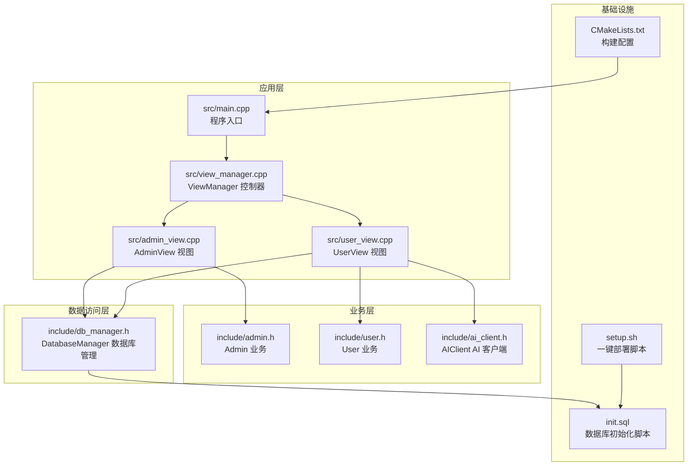
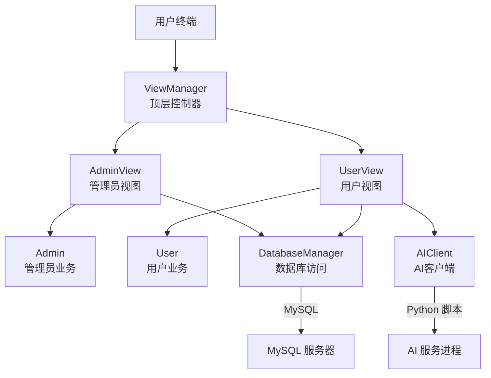
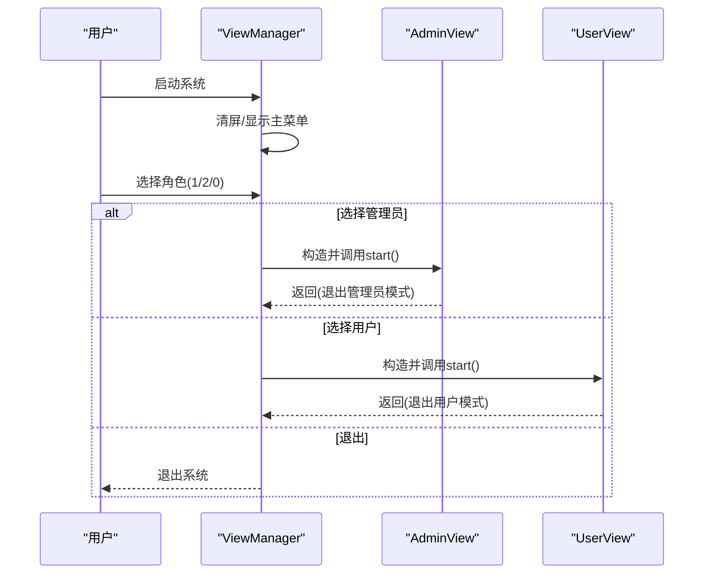
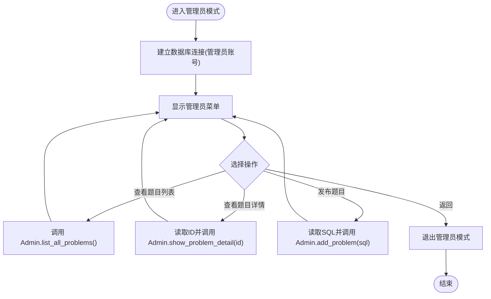
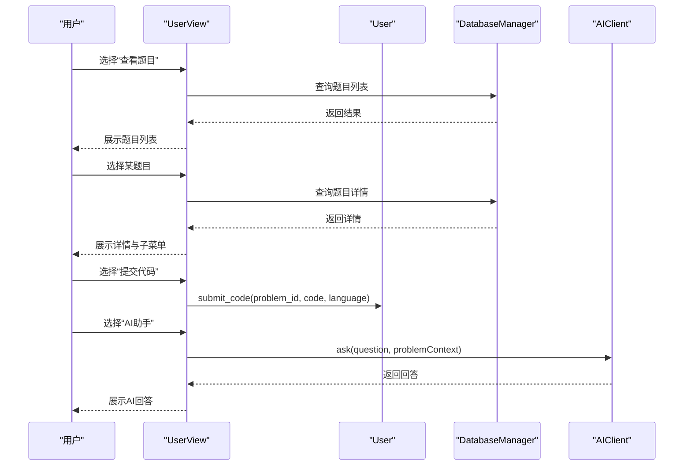
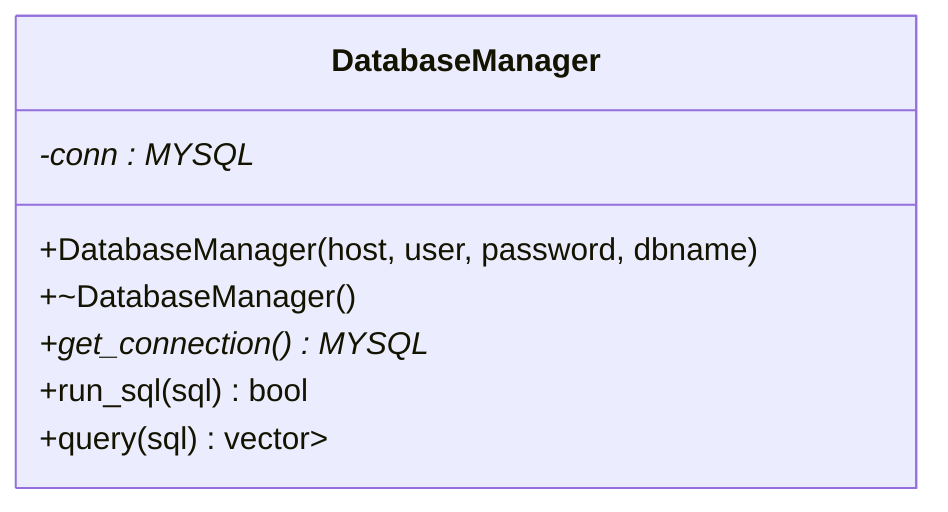
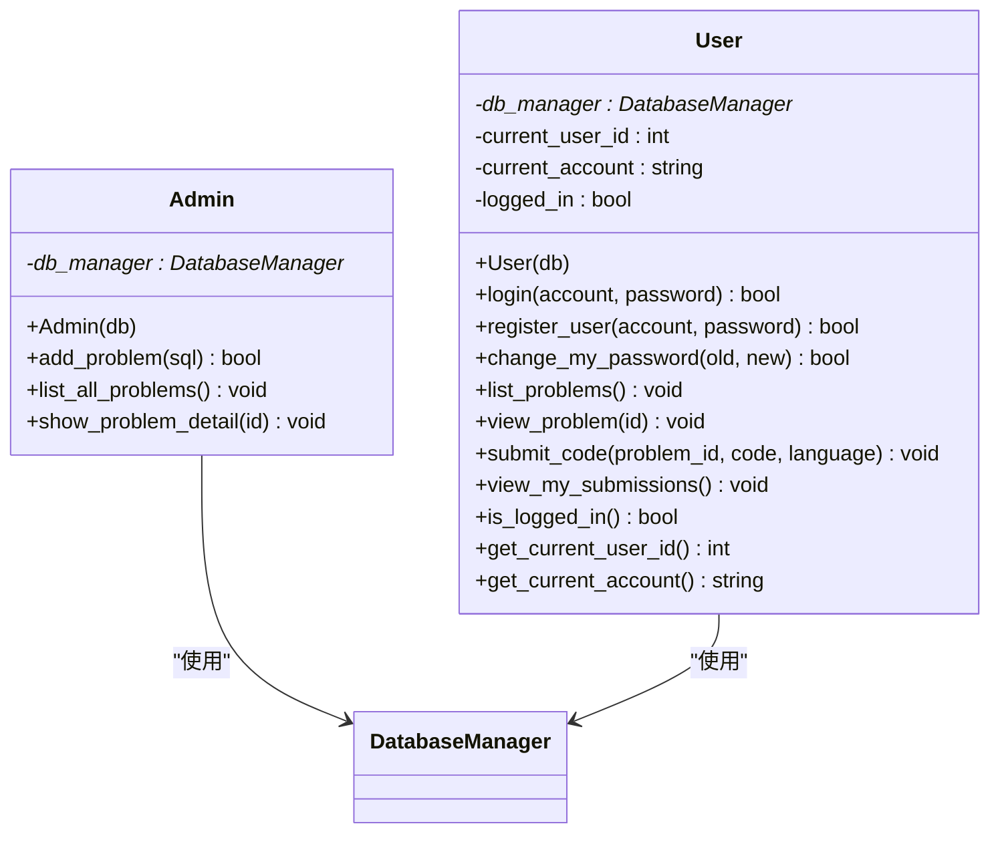
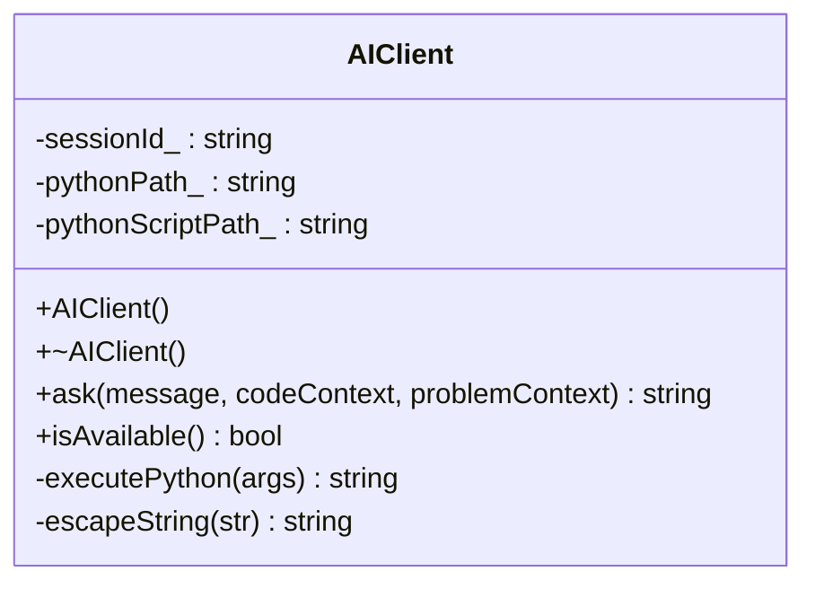
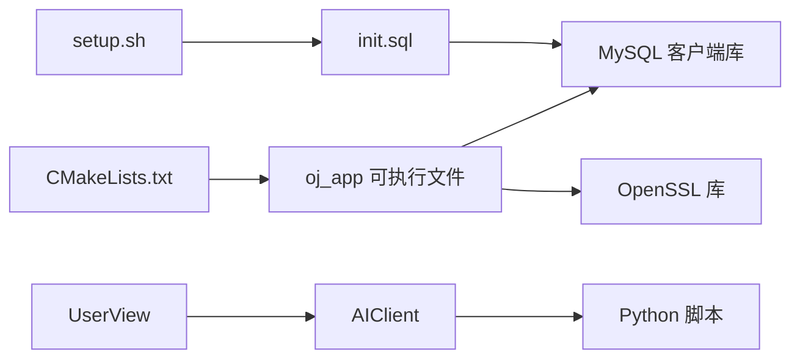

# 整体架构概览

<cite>
**本文档引用的文件**
- [README.md](file://README.md)
- [CMakeLists.txt](file://CMakeLists.txt)
- [setup.sh](file://setup.sh)
- [init.sql](file://init.sql)
- [src/main.cpp](file://src/main.cpp)
- [src/view_manager.cpp](file://src/view_manager.cpp)
- [include/view_manager.h](file://include/view_manager.h)
- [src/admin_view.cpp](file://src/admin_view.cpp)
- [include/admin_view.h](file://include/admin_view.h)
- [src/user_view.cpp](file://src/user_view.cpp)
- [include/user_view.h](file://include/user_view.h)
- [include/db_manager.h](file://include/db_manager.h)
- [include/admin.h](file://include/admin.h)
- [include/user.h](file://include/user.h)
- [include/ai_client.h](file://include/ai_client.h)
</cite>

## 目录
1. [简介](#简介)
2. [项目结构](#项目结构)
3. [核心组件](#核心组件)
4. [架构总览](#架构总览)
5. [详细组件分析](#详细组件分析)
6. [依赖关系分析](#依赖关系分析)
7. [性能考量](#性能考量)
8. [故障排查指南](#故障排查指南)
9. [结论](#结论)
10. [附录](#附录)

## 简介
本文件面向开发者与运维人员，提供OJ评测系统的整体架构概览。系统采用命令行界面（CLI）与菜单驱动交互方式，围绕“视图-控制器-模型”思想组织代码，通过ViewManager作为顶层控制器协调管理员与用户两种角色的交互流程；数据库访问由DatabaseManager统一封装；AI辅助功能通过独立客户端模块集成。本文档涵盖系统边界、模块化设计、数据流与控制流、技术栈选择与权衡、基础设施需求、可扩展性与部署拓扑等。

## 项目结构
项目采用分层与模块化结合的设计：入口程序位于src/main.cpp，核心控制器为ViewManager，分别委派给AdminView与UserView处理不同角色的菜单与业务；业务实体Admin与User封装各自领域逻辑；DatabaseManager提供数据库连接与SQL执行能力；AI辅助功能由AIClient提供；CMakeLists.txt定义构建与链接规则；setup.sh与init.sql负责环境初始化与数据库部署。

图表来源
- [src/main.cpp:1-14](file://src/main.cpp#L1-L14)
- [src/view_manager.cpp:1-77](file://src/view_manager.cpp#L1-L77)
- [src/admin_view.cpp:1-138](file://src/admin_view.cpp#L1-L138)
- [src/user_view.cpp:1-352](file://src/user_view.cpp#L1-L352)
- [include/admin.h:1-40](file://include/admin.h#L1-L40)
- [include/user.h:1-89](file://include/user.h#L1-L89)
- [include/ai_client.h:1-28](file://include/ai_client.h#L1-L28)
- [include/db_manager.h:1-53](file://include/db_manager.h#L1-L53)
- [CMakeLists.txt:1-40](file://CMakeLists.txt#L1-L40)
- [setup.sh:1-41](file://setup.sh#L1-L41)
- [init.sql:1-143](file://init.sql#L1-L143)

章节来源
- [README.md:1-2](file://README.md#L1-L2)
- [CMakeLists.txt:1-40](file://CMakeLists.txt#L1-L40)
- [setup.sh:1-41](file://setup.sh#L1-L41)
- [init.sql:1-143](file://init.sql#L1-L143)

## 核心组件
- 程序入口与启动流程
  - 入口文件负责实例化ViewManager并启动登录菜单，随后根据用户选择进入管理员或用户模式。
- ViewManager（控制器）
  - 作为顶层控制器，负责清屏、显示主菜单、接收用户输入并分发至AdminView或UserView；同时维护输入缓冲清理与异常处理。
- AdminView（管理员视图）
  - 管理员专用菜单，支持查看题目列表、查看题目详情、发布新题目（直接执行SQL），并在退出时释放资源。
- UserView（用户视图）
  - 用户模式菜单分为“未登录”和“已登录”两套；支持登录、注册、查看题目、提交代码、查看提交记录、修改密码；在题目详情页提供“提交代码”和“AI助手”子菜单。
- Admin与User（业务实体）
  - Admin封装管理员业务方法（如发布题目、列出题目、查看详情）；User封装用户认证、个人信息与提交相关业务。
- DatabaseManager（数据访问）
  - 统一封装MySQL连接、SQL执行与查询结果集返回，提供run_sql与query接口。
- AIClient（AI客户端）
  - 封装调用Python脚本的逻辑，提供ask与可用性检测接口，用于向AI服务发起请求。
- 构建与部署
  - CMakeLists.txt设置C++17标准、查找MySQL与OpenSSL依赖、收集源文件并链接库；setup.sh负责创建目录、初始化数据库与用户权限，并输出编译运行指引；init.sql创建数据库、表结构、示例数据与数据库用户。

章节来源
- [src/main.cpp:1-14](file://src/main.cpp#L1-L14)
- [src/view_manager.cpp:1-77](file://src/view_manager.cpp#L1-L77)
- [include/view_manager.h:1-43](file://include/view_manager.h#L1-L43)
- [src/admin_view.cpp:1-138](file://src/admin_view.cpp#L1-L138)
- [include/admin_view.h:1-58](file://include/admin_view.h#L1-L58)
- [src/user_view.cpp:1-352](file://src/user_view.cpp#L1-L352)
- [include/user_view.h:1-92](file://include/user_view.h#L1-L92)
- [include/admin.h:1-40](file://include/admin.h#L1-L40)
- [include/user.h:1-89](file://include/user.h#L1-L89)
- [include/db_manager.h:1-53](file://include/db_manager.h#L1-L53)
- [include/ai_client.h:1-28](file://include/ai_client.h#L1-L28)
- [CMakeLists.txt:1-40](file://CMakeLists.txt#L1-L40)
- [setup.sh:1-41](file://setup.sh#L1-L41)
- [init.sql:1-143](file://init.sql#L1-L143)

## 架构总览
系统采用“菜单驱动”的命令行架构，遵循MVC思想的轻量实现：
- 视图（View）：AdminView与UserView负责渲染菜单、接收输入与展示结果。
- 控制器（Controller）：ViewManager作为顶层控制器，协调角色切换与流程控制。
- 模型（Model）：Admin与User封装业务模型；DatabaseManager封装数据模型访问；AIClient封装外部AI服务访问。
- 系统边界：命令行交互边界清晰，数据库与AI服务作为外部依赖通过接口抽象接入。

图表来源
- [src/view_manager.cpp:1-77](file://src/view_manager.cpp#L1-L77)
- [src/admin_view.cpp:1-138](file://src/admin_view.cpp#L1-L138)
- [src/user_view.cpp:1-352](file://src/user_view.cpp#L1-L352)
- [include/admin.h:1-40](file://include/admin.h#L1-L40)
- [include/user.h:1-89](file://include/user.h#L1-L89)
- [include/db_manager.h:1-53](file://include/db_manager.h#L1-L53)
- [include/ai_client.h:1-28](file://include/ai_client.h#L1-L28)

## 详细组件分析

### ViewManager（控制器）
- 职责
  - 清屏与主菜单展示；循环接收用户输入并分发到管理员或用户视图；处理无效输入与异常；退出时终止循环。
- 关键流程
  - 启动登录菜单：清屏 → 展示主菜单 → 读取选择 → 分支处理（管理员/用户/退出）。
  - 输入清理：统一使用clear_input处理缓冲区溢出与格式错误。
- 设计要点
  - 使用智能指针管理AdminView与UserView生命周期，避免资源泄漏。
  - 菜单驱动的交互模式简化了分支逻辑，便于扩展新角色或新功能。

图表来源
- [src/view_manager.cpp:32-70](file://src/view_manager.cpp#L32-L70)
- [src/admin_view.cpp:21-76](file://src/admin_view.cpp#L21-L76)
- [src/user_view.cpp:21-116](file://src/user_view.cpp#L21-L116)

章节来源
- [src/view_manager.cpp:1-77](file://src/view_manager.cpp#L1-L77)
- [include/view_manager.h:1-43](file://include/view_manager.h#L1-L43)

### AdminView（管理员视图）
- 职责
  - 管理员专用菜单与业务处理：列出题目、查看题目详情、发布新题目（直接执行SQL）。
- 关键流程
  - 启动时以管理员账号连接数据库；进入循环菜单；根据选择调用Admin对象的方法；退出时释放资源。
- 安全与约束
  - 直接执行SQL需谨慎，建议在生产环境增加参数化与白名单校验。

图表来源
- [src/admin_view.cpp:21-131](file://src/admin_view.cpp#L21-L131)
- [include/admin.h:1-40](file://include/admin.h#L1-L40)

章节来源
- [src/admin_view.cpp:1-138](file://src/admin_view.cpp#L1-L138)
- [include/admin_view.h:1-58](file://include/admin_view.h#L1-L58)
- [include/admin.h:1-40](file://include/admin.h#L1-L40)

### UserView（用户视图）
- 职责
  - 未登录与已登录双态菜单：登录/注册、查看题目、查看提交、修改密码；在题目详情页提供“提交代码”和“AI助手”。
- 关键流程
  - 启动时以受限账号连接数据库；根据登录状态切换菜单；处理用户输入与异常；在题目详情页进入子菜单。
- AI集成
  - 调用AIClient前先检查可用性；若不可用则提示并返回；成功后展示AI回答。

图表来源
- [src/user_view.cpp:21-352](file://src/user_view.cpp#L21-L352)
- [include/user.h:1-89](file://include/user.h#L1-L89)
- [include/ai_client.h:1-28](file://include/ai_client.h#L1-L28)

章节来源
- [src/user_view.cpp:1-352](file://src/user_view.cpp#L1-L352)
- [include/user_view.h:1-92](file://include/user_view.h#L1-L92)
- [include/user.h:1-89](file://include/user.h#L1-L89)
- [include/ai_client.h:1-28](file://include/ai_client.h#L1-L28)

### DatabaseManager（数据访问）
- 职责
  - 封装MySQL连接、SQL执行与查询结果集返回；提供run_sql与query接口。
- 设计要点
  - 对外暴露MYSQL*连接句柄，便于与底层库配合；提供查询结果映射为行（map）集合，便于上层业务解析。

图表来源
- [include/db_manager.h:1-53](file://include/db_manager.h#L1-L53)

章节来源
- [include/db_manager.h:1-53](file://include/db_manager.h#L1-L53)

### Admin与User（业务实体）
- Admin
  - 关联DatabaseManager，提供发布题目、列出题目、查看题目详情等方法。
- User
  - 关联DatabaseManager，提供登录、注册、修改密码、查看题目、提交代码、查看提交记录等方法；维护当前登录状态与用户信息。

图表来源
- [include/admin.h:1-40](file://include/admin.h#L1-L40)
- [include/user.h:1-89](file://include/user.h#L1-L89)
- [include/db_manager.h:1-53](file://include/db_manager.h#L1-L53)

章节来源
- [include/admin.h:1-40](file://include/admin.h#L1-L40)
- [include/user.h:1-89](file://include/user.h#L1-L89)

### AI客户端（AIClient）
- 职责
  - 封装调用Python脚本的逻辑，提供ask与可用性检测接口；支持转义字符串与会话管理。
- 集成点
  - UserView在题目详情页调用AIClient.ask发起问题；若不可用则提示并返回。

图表来源
- [include/ai_client.h:1-28](file://include/ai_client.h#L1-L28)

章节来源
- [include/ai_client.h:1-28](file://include/ai_client.h#L1-L28)

## 依赖关系分析
- 构建与链接
  - CMakeLists.txt设置C++17标准，查找mysqlclient与OpenSSL，收集src目录下所有.cpp文件，生成oj_app可执行文件并链接所需库。
- 运行时依赖
  - MySQL服务器：提供数据库访问；数据库用户oj_admin与oj_user分别用于管理员与普通用户模式。
  - Python/AI服务：AIClient通过Python脚本与AI服务通信，需保证脚本路径与服务可用性。
- 环境初始化
  - setup.sh执行数据库初始化脚本init.sql，创建数据库、表、示例数据与数据库用户；随后输出编译运行步骤。

图表来源
- [CMakeLists.txt:1-40](file://CMakeLists.txt#L1-L40)
- [setup.sh:1-41](file://setup.sh#L1-L41)
- [init.sql:1-143](file://init.sql#L1-L143)
- [src/user_view.cpp:275-311](file://src/user_view.cpp#L275-L311)
- [include/ai_client.h:1-28](file://include/ai_client.h#L1-L28)

章节来源
- [CMakeLists.txt:1-40](file://CMakeLists.txt#L1-L40)
- [setup.sh:1-41](file://setup.sh#L1-L41)
- [init.sql:1-143](file://init.sql#L1-L143)

## 性能考量
- I/O与交互
  - 菜单驱动的同步I/O适合小规模评测场景；若并发用户增多，建议引入异步I/O或事件循环以提升吞吐。
- 数据库访问
  - 当前通过DatabaseManager直接执行SQL；建议在高频查询处增加索引与缓存，减少重复查询；对写操作使用事务包裹，确保一致性。
- AI调用
  - AI请求可能成为瓶颈；建议引入超时控制、重试机制与本地缓存常见问题的答案。
- 内存与资源
  - 使用智能指针管理视图与业务对象生命周期，避免资源泄漏；在长会话中定期清理输入缓冲与临时数据。

## 故障排查指南
- 数据库连接失败
  - 确认MySQL服务运行正常；检查init.sql中创建的数据库用户与权限；确认连接参数（主机、用户名、密码、数据库名）正确。
- 权限不足
  - 管理员模式使用oj_admin全权限账号；用户模式使用oj_user受限账号；若出现权限错误，检查init.sql授权段落。
- AI服务不可用
  - 检查AIClient的Python路径与脚本路径配置；确认AI服务进程可用；在UserView中调用前先调用isAvailable()。
- 输入异常
  - 若出现输入卡死或格式错误，检查ViewManager与各View中的clear_input实现；确保在读取数字后清理非数字字符。
- 编译与链接错误
  - 确认CMake能够找到mysqlclient与OpenSSL；检查CMakeLists.txt中的include与link指令；必要时导出compile_commands.json辅助诊断。

章节来源
- [src/admin_view.cpp:27-75](file://src/admin_view.cpp#L27-L75)
- [src/user_view.cpp:27-115](file://src/user_view.cpp#L27-L115)
- [src/user_view.cpp:280-286](file://src/user_view.cpp#L280-L286)
- [src/view_manager.cpp:72-76](file://src/view_manager.cpp#L72-L76)
- [CMakeLists.txt:11-34](file://CMakeLists.txt#L11-L34)

## 结论
本OJ系统以ViewManager为核心控制器，采用菜单驱动的命令行交互模式，清晰分离视图、控制器与业务模型，具备良好的模块化与可扩展性。通过DatabaseManager统一数据访问，结合AI客户端实现智能化辅助，满足基础评测与教学场景需求。建议在后续版本中增强安全校验、引入缓存与异步处理、完善日志与监控，以支撑更高并发与更复杂的评测需求。

## 附录
- 技术栈选择与权衡
  - C++17：现代C++特性提升开发效率与安全性；与MySQL C API与OpenSSL良好兼容。
  - MySQL：成熟的关系型数据库，适合存储题目、用户与提交记录；通过init.sql预置表结构与示例数据。
  - OpenSSL：提供加密与安全通信能力，适用于密码哈希与敏感数据保护。
  - Python/AI：通过AIClient桥接到AI服务，便于扩展与替换。
- 基础设施需求
  - 操作系统：Linux/Unix类系统（支持ANSI转义序列与shell脚本）。
  - 数据库：MySQL服务器（版本需兼容mysqlclient）。
  - 运行时：oj_app可执行文件；AI服务（可选）。
- 可扩展性设计
  - 角色扩展：新增角色只需新增View与业务类，并在ViewManager中注册。
  - 功能扩展：在现有菜单体系中增加新选项；通过DatabaseManager扩展数据访问。
  - 部署拓扑
    - 单机部署：oj_app与MySQL在同一主机；AI服务可独立部署并通过网络访问。
    - 分布式部署：数据库与AI服务独立节点，oj_app通过网络访问；注意网络延迟与容错。