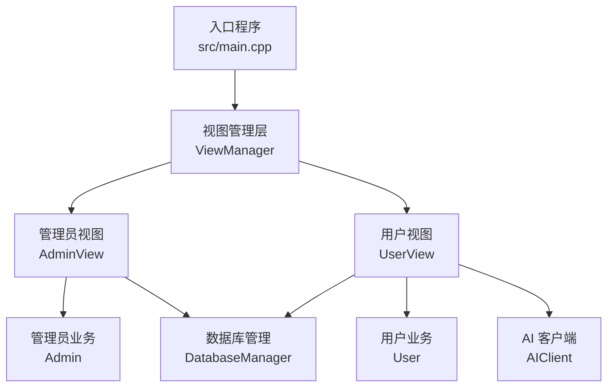
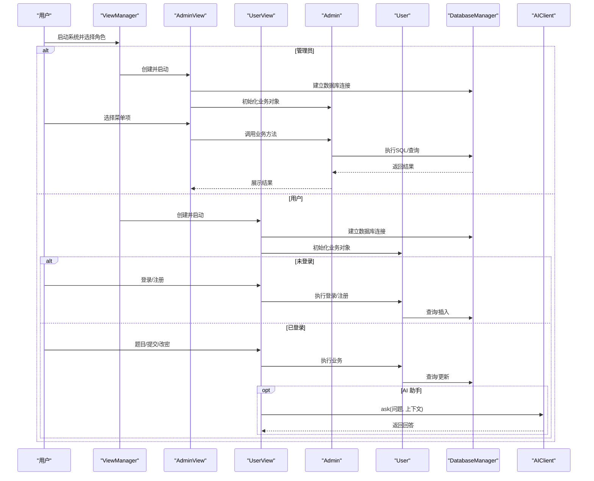
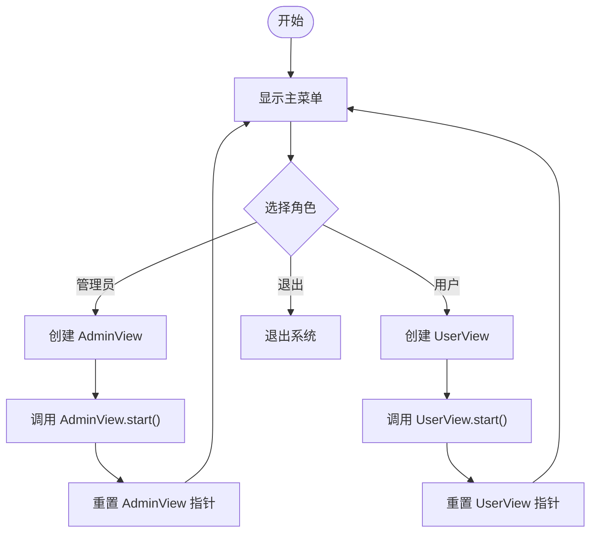
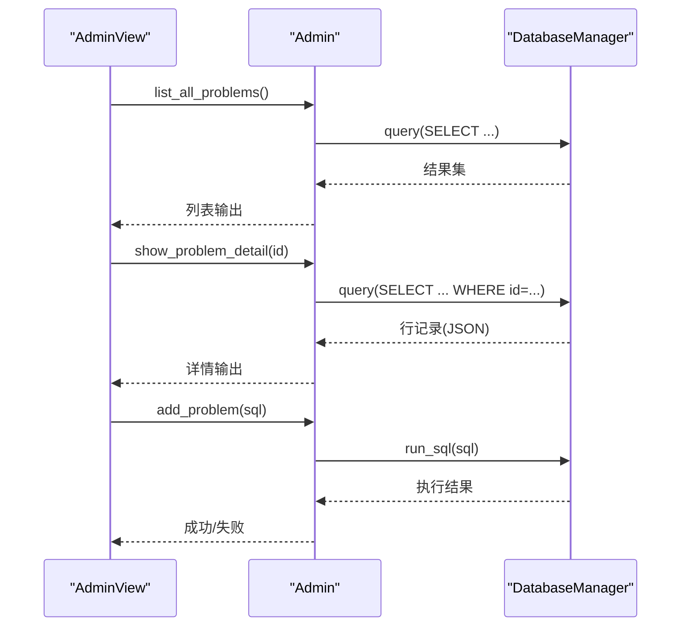
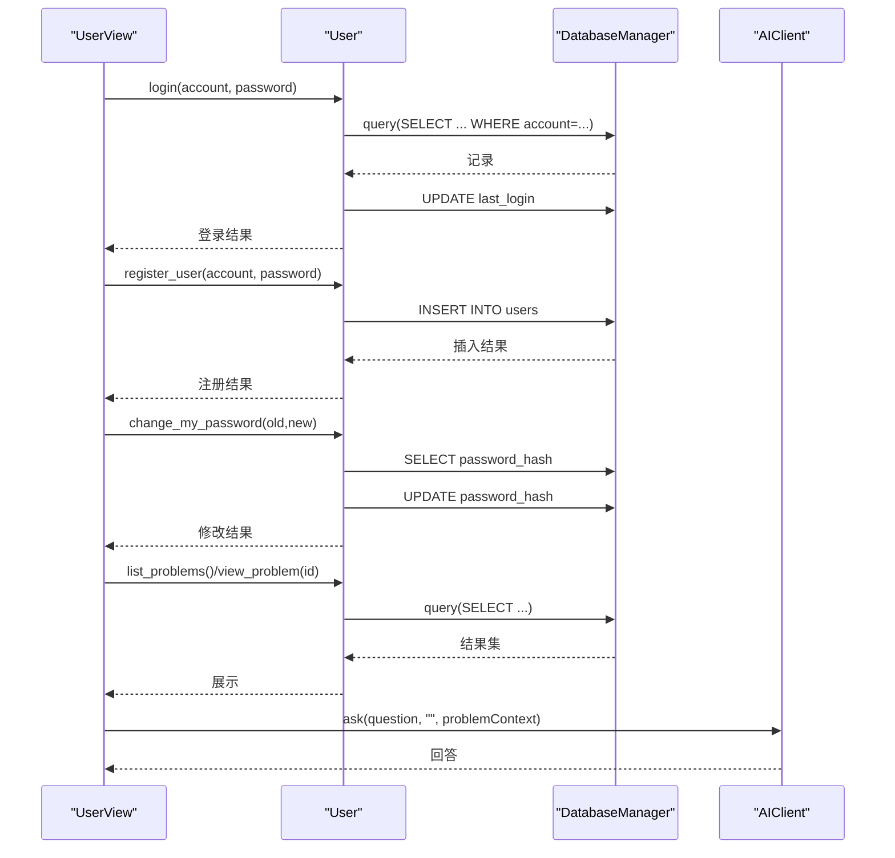
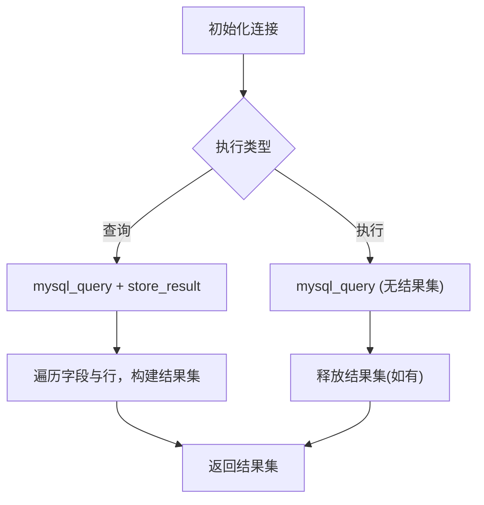
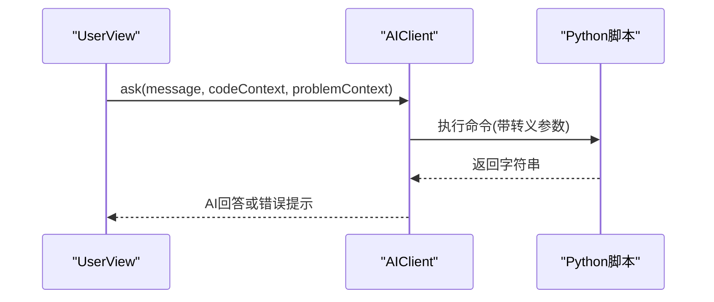
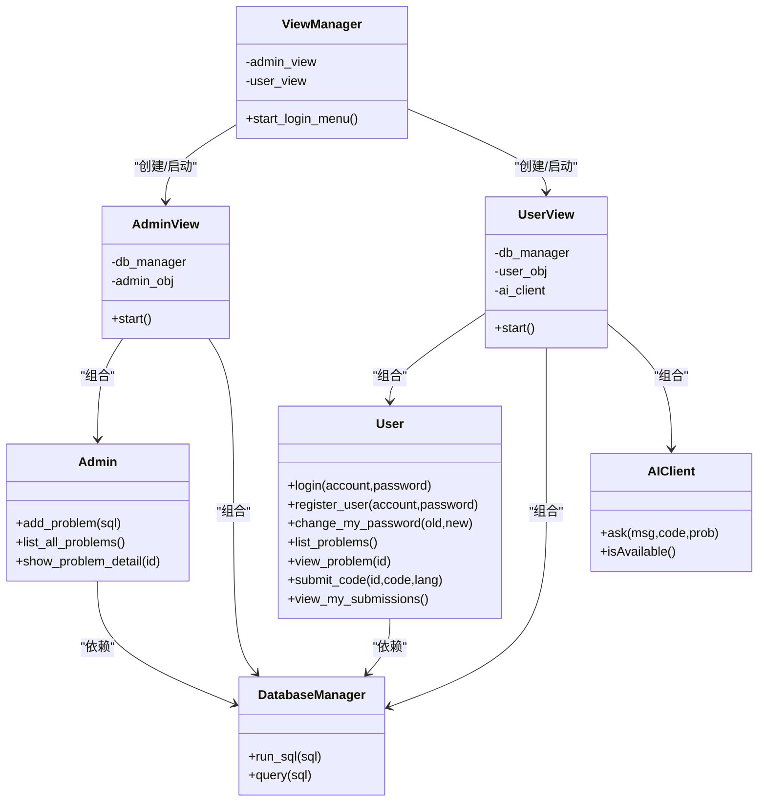

# 模块关系与交互

<cite>
**本文引用的文件**
- [main.cpp](file://src/main.cpp)
- [view_manager.h](file://include/view_manager.h)
- [view_manager.cpp](file://src/view_manager.cpp)
- [admin_view.h](file://include/admin_view.h)
- [admin_view.cpp](file://src/admin_view.cpp)
- [user_view.h](file://include/user_view.h)
- [user_view.cpp](file://src/user_view.cpp)
- [admin.h](file://include/admin.h)
- [user.h](file://include/user.h)
- [admin.cpp](file://src/admin.cpp)
- [user.cpp](file://src/user.cpp)
- [db_manager.h](file://include/db_manager.h)
- [db_manager.cpp](file://src/db_manager.cpp)
- [ai_client.h](file://include/ai_client.h)
- [ai_client.cpp](file://src/ai_client.cpp)
</cite>

## 目录
1. [引言](#引言)
2. [项目结构](#项目结构)
3. [核心组件](#核心组件)
4. [架构总览](#架构总览)
5. [详细组件分析](#详细组件分析)
6. [依赖分析](#依赖分析)
7. [性能考虑](#性能考虑)
8. [故障排查指南](#故障排查指南)
9. [结论](#结论)
10. [附录](#附录)

## 引言
本文件聚焦于OJ系统中各模块之间的依赖关系与交互模式，重点阐述ViewManager如何协调Admin、User、DatabaseManager与AIClient等模块的工作；并提供模块依赖图、调用时序图与数据传递流程说明。文档同时总结模块间解耦设计、接口抽象与扩展机制，并给出通信协议、错误传播与异常处理策略，以及模块替换与扩展的最佳实践。

## 项目结构
- 入口程序位于 src/main.cpp，负责启动 ViewManager。
- 视图层由 ViewManager 统一调度 AdminView 与 UserView。
- 业务层分别由 Admin 与 User 实现管理员与用户功能。
- 数据访问层由 DatabaseManager 提供统一的数据库连接与查询执行能力。
- AI 辅助层由 AIClient 提供外部Python脚本调用能力。

图表来源
- [main.cpp:5-12](file://src/main.cpp#L5-L12)
- [view_manager.cpp:32-70](file://src/view_manager.cpp#L32-L70)
- [admin_view.cpp:21-76](file://src/admin_view.cpp#L21-L76)
- [user_view.cpp:21-116](file://src/user_view.cpp#L21-L116)
- [admin.cpp:10](file://src/admin.cpp#L10)
- [user.cpp:11](file://src/user.cpp#L11)
- [db_manager.cpp:8-19](file://src/db_manager.cpp#L8-L19)
- [ai_client.cpp:8-23](file://src/ai_client.cpp#L8-L23)

章节来源
- [main.cpp:1-14](file://src/main.cpp#L1-L14)
- [view_manager.h:11-40](file://include/view_manager.h#L11-L40)
- [view_manager.cpp:10-76](file://src/view_manager.cpp#L10-L76)

## 核心组件
- ViewManager：命令行界面主控制器，负责登录菜单与角色分发，持有 AdminView 与 UserView 的生命周期。
- AdminView：管理员模式的视图控制器，负责菜单展示与输入处理，内部持有 DatabaseManager 与 Admin。
- UserView：用户模式的视图控制器，负责游客/登录态菜单切换与输入处理，内部持有 DatabaseManager、User 与 AIClient。
- Admin：管理员业务逻辑封装，委托 DatabaseManager 执行 SQL 与查询。
- User：用户业务逻辑封装，委托 DatabaseManager 执行登录、注册、改密、题目浏览与提交占位等。
- DatabaseManager：数据库连接与SQL执行封装，提供 run_sql 与 query 接口。
- AIClient：AI 助手客户端，封装Python脚本调用与参数转义，提供 ask 与可用性检测。

章节来源
- [view_manager.h:11-40](file://include/view_manager.h#L11-L40)
- [admin_view.h:11-55](file://include/admin_view.h#L11-L55)
- [user_view.h:12-90](file://include/user_view.h#L12-L90)
- [admin.h:10-37](file://include/admin.h#L10-L37)
- [user.h:10-86](file://include/user.h#L10-L86)
- [db_manager.h:12-46](file://include/db_manager.h#L12-L46)
- [ai_client.h:6-25](file://include/ai_client.h#L6-L25)

## 架构总览
- 控制流自上而下：main -> ViewManager -> AdminView/UserView -> Admin/User -> DatabaseManager。
- 视图层仅负责交互与流程编排，业务层与数据层分离，便于替换与扩展。
- UserView 可选集成 AIClient，用于AI问答辅助。

图表来源
- [view_manager.cpp:32-70](file://src/view_manager.cpp#L32-L70)
- [admin_view.cpp:21-76](file://src/admin_view.cpp#L21-L76)
- [user_view.cpp:21-116](file://src/user_view.cpp#L21-L116)
- [admin.cpp:12-58](file://src/admin.cpp#L12-L58)
- [user.cpp:39-222](file://src/user.cpp#L39-L222)
- [db_manager.cpp:21-57](file://src/db_manager.cpp#L21-L57)
- [ai_client.cpp:85-112](file://src/ai_client.cpp#L85-L112)

## 详细组件分析

### ViewManager 协调机制
- 职责：提供登录菜单、角色选择、清屏与输入清理。
- 协调方式：根据用户选择动态创建 AdminView 或 UserView 的实例，调用其 start()，并在退出后重置指针，确保生命周期可控。
- 解耦点：ViewManager 不直接依赖具体业务细节，仅通过视图接口进行交互。

图表来源
- [view_manager.cpp:32-70](file://src/view_manager.cpp#L32-L70)

章节来源
- [view_manager.h:11-40](file://include/view_manager.h#L11-L40)
- [view_manager.cpp:10-76](file://src/view_manager.cpp#L10-L76)

### AdminView 与 Admin 的协作
- AdminView 负责菜单展示与输入处理，AdminView 内部持有 DatabaseManager 与 Admin。
- Admin 将业务请求委托给 DatabaseManager，Admin 不直接管理连接。
- 错误处理：AdminView 对无效输入与空SQL进行提示；Admin 对空结果进行友好提示。

图表来源
- [admin_view.cpp:91-131](file://src/admin_view.cpp#L91-L131)
- [admin.cpp:12-58](file://src/admin.cpp#L12-L58)
- [db_manager.cpp:26-57](file://src/db_manager.cpp#L26-L57)

章节来源
- [admin_view.h:11-55](file://include/admin_view.h#L11-L55)
- [admin_view.cpp:10-76](file://src/admin_view.cpp#L10-L76)
- [admin.h:10-37](file://include/admin.h#L10-L37)
- [admin.cpp:1-59](file://src/admin.cpp#L1-L59)
- [db_manager.h:12-46](file://include/db_manager.h#L12-L46)
- [db_manager.cpp:1-100](file://src/db_manager.cpp#L1-L100)

### UserView 与 User 的协作
- UserView 负责游客/登录态菜单切换与输入处理；UserView 内部持有 DatabaseManager、User 与 AIClient。
- User 将业务请求委托给 DatabaseManager，User 不直接管理连接。
- 登录/注册/改密采用哈希校验；题目浏览与提交为占位实现，便于后续扩展。

图表来源
- [user_view.cpp:144-196](file://src/user_view.cpp#L144-L196)
- [user_view.cpp:275-311](file://src/user_view.cpp#L275-L311)
- [user.cpp:39-137](file://src/user.cpp#L39-L137)
- [user.cpp:139-222](file://src/user.cpp#L139-L222)
- [db_manager.cpp:26-57](file://src/db_manager.cpp#L26-L57)
- [ai_client.cpp:85-112](file://src/ai_client.cpp#L85-L112)

章节来源
- [user_view.h:12-90](file://include/user_view.h#L12-L90)
- [user_view.cpp:10-116](file://src/user_view.cpp#L10-L116)
- [user.h:10-86](file://include/user.h#L10-L86)
- [user.cpp:1-223](file://src/user.cpp#L1-L223)

### DatabaseManager 数据访问层
- 负责数据库连接初始化、查询执行与结果解析；提供 run_sql 与 query 两个核心接口。
- 错误处理：对连接失败、查询失败、执行失败进行日志输出，避免崩溃并返回布尔结果。

图表来源
- [db_manager.cpp:21-57](file://src/db_manager.cpp#L21-L57)
- [db_manager.cpp:61-99](file://src/db_manager.cpp#L61-L99)

章节来源
- [db_manager.h:12-46](file://include/db_manager.h#L12-L46)
- [db_manager.cpp:1-100](file://src/db_manager.cpp#L1-L100)

### AIClient AI 辅助层
- 通过可执行Python脚本提供AI问答能力；支持会话标识、消息与上下文参数传递。
- 提供 isAvailable 检测脚本与解释器是否存在；ask 返回空响应时进行兜底提示。

图表来源
- [ai_client.cpp:56-83](file://src/ai_client.cpp#L56-L83)
- [ai_client.cpp:85-112](file://src/ai_client.cpp#L85-L112)

章节来源
- [ai_client.h:6-25](file://include/ai_client.h#L6-L25)
- [ai_client.cpp:1-124](file://src/ai_client.cpp#L1-L124)

## 依赖分析
- ViewManager 依赖 AdminView 与 UserView，但不依赖具体业务实现，体现高层控制与低层细节解耦。
- AdminView 依赖 Admin 与 DatabaseManager；UserView 依赖 User、DatabaseManager 与 AIClient。
- Admin 与 User 仅依赖 DatabaseManager 接口，避免直接耦合底层MySQL实现。
- DatabaseManager 依赖 MySQL C API，提供统一的 run_sql/query 抽象。
- AIClient 依赖外部Python环境与脚本，UserView 可选启用。

图表来源
- [view_manager.h:11-40](file://include/view_manager.h#L11-L40)
- [admin_view.h:11-55](file://include/admin_view.h#L11-L55)
- [user_view.h:12-90](file://include/user_view.h#L12-L90)
- [admin.h:10-37](file://include/admin.h#L10-L37)
- [user.h:10-86](file://include/user.h#L10-L86)
- [db_manager.h:12-46](file://include/db_manager.h#L12-L46)
- [ai_client.h:6-25](file://include/ai_client.h#L6-L25)

章节来源
- [view_manager.h:11-40](file://include/view_manager.h#L11-L40)
- [admin_view.h:11-55](file://include/admin_view.h#L11-L55)
- [user_view.h:12-90](file://include/user_view.h#L12-L90)
- [admin.h:10-37](file://include/admin.h#L10-L37)
- [user.h:10-86](file://include/user.h#L10-L86)
- [db_manager.h:12-46](file://include/db_manager.h#L12-L46)
- [ai_client.h:6-25](file://include/ai_client.h#L6-L25)

## 性能考虑
- I/O 与网络：DatabaseManager 的查询与执行为阻塞式，建议在高并发场景引入连接池与异步I/O。
- 字符串处理：AIClient 的参数转义与命令拼接存在额外拷贝成本，建议优化为更高效的参数序列化。
- 输出格式：Admin/ User 的表格输出使用固定宽度格式，建议在大数据量时采用分页与流式输出。
- 资源管理：构造/析构中显式关闭连接与释放结果集，避免资源泄漏。

## 故障排查指南
- 数据库连接失败
  - 现象：AdminView/UserView 在连接阶段输出失败信息并重置资源。
  - 排查：确认主机、用户名、密码与数据库名配置正确；检查 MySQL 服务状态。
- 查询/执行失败
  - 现象：DatabaseManager 在失败时输出错误信息并返回空结果或false。
  - 排查：检查SQL语法与权限；确认表结构与字段存在。
- 输入异常
  - 现象：View 层对非数字输入进行清空与提示；UserView/AdminView 对空SQL进行提示。
  - 排查：确保输入缓冲区被正确清理；避免空输入导致逻辑分支异常。
- AI 服务不可用
  - 现象：AIClient 的 isAvailable 返回false；ask 返回兜底错误提示。
  - 排查：确认Python解释器与脚本路径存在；检查网络与API Key配置。

章节来源
- [admin_view.cpp:71-75](file://src/admin_view.cpp#L71-L75)
- [user_view.cpp:111-115](file://src/user_view.cpp#L111-L115)
- [db_manager.cpp:32-36](file://src/db_manager.cpp#L32-L36)
- [db_manager.cpp:86-90](file://src/db_manager.cpp#L86-L90)
- [user_view.cpp:280-286](file://src/user_view.cpp#L280-L286)
- [ai_client.cpp:114-123](file://src/ai_client.cpp#L114-L123)

## 结论
本系统通过 ViewManager 对 AdminView/UserView 进行统一调度，业务层 Admin/User 与数据层 DatabaseManager 解耦，AI 层 AIClient 可插拔集成。整体采用“视图编排 + 业务委托 + 数据抽象”的架构，具备良好的扩展性与可维护性。后续可在数据库访问层引入连接池、在AI层增加缓存与超时控制，并完善用户提交评测与提交记录的业务实现。

## 附录
- 模块替换与扩展最佳实践
  - 替换数据库访问：新增适配器类实现 DatabaseManager 接口，保持 Admin/User 不变。
  - 替换AI服务：新增适配器类实现 AIClient 接口，支持不同模型或本地/云端切换。
  - 增强用户功能：在 User 中补充提交评测与记录查询的具体实现，逐步替代占位逻辑。
  - 日志与监控：在 DatabaseManager/AIClient 中增加日志与指标上报，便于运维观测。