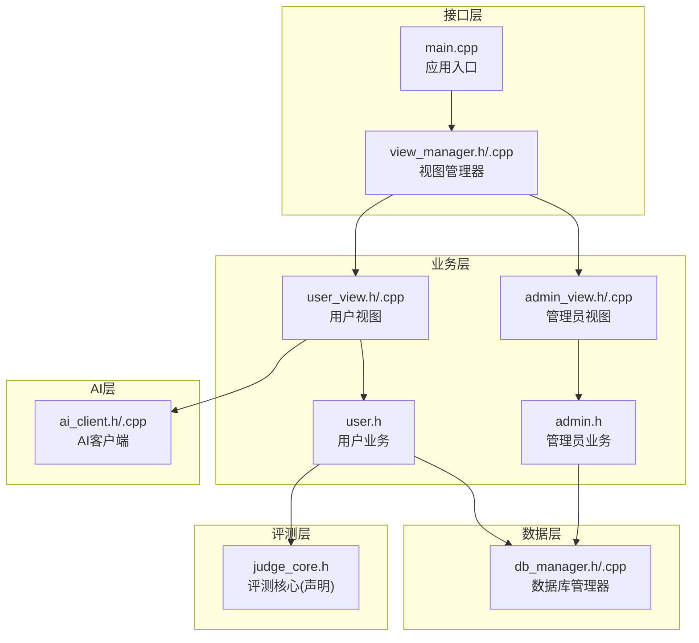
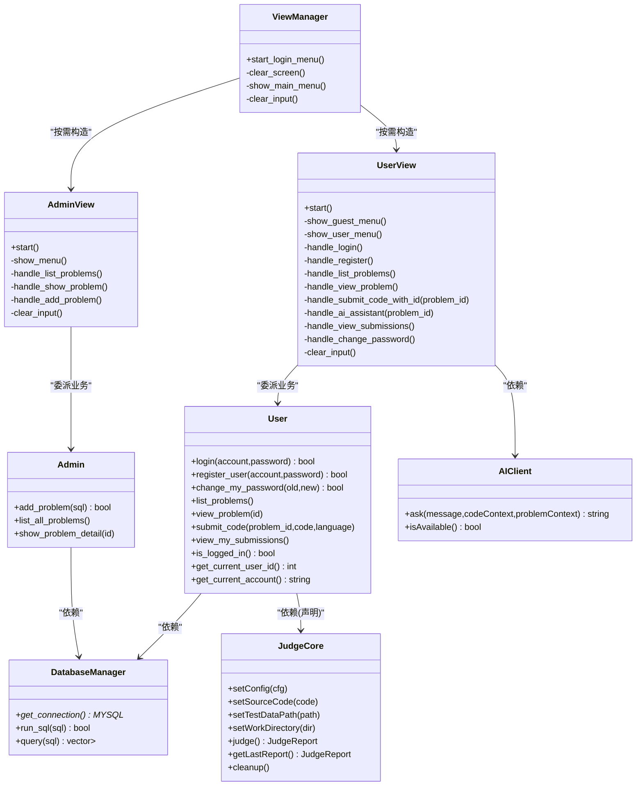
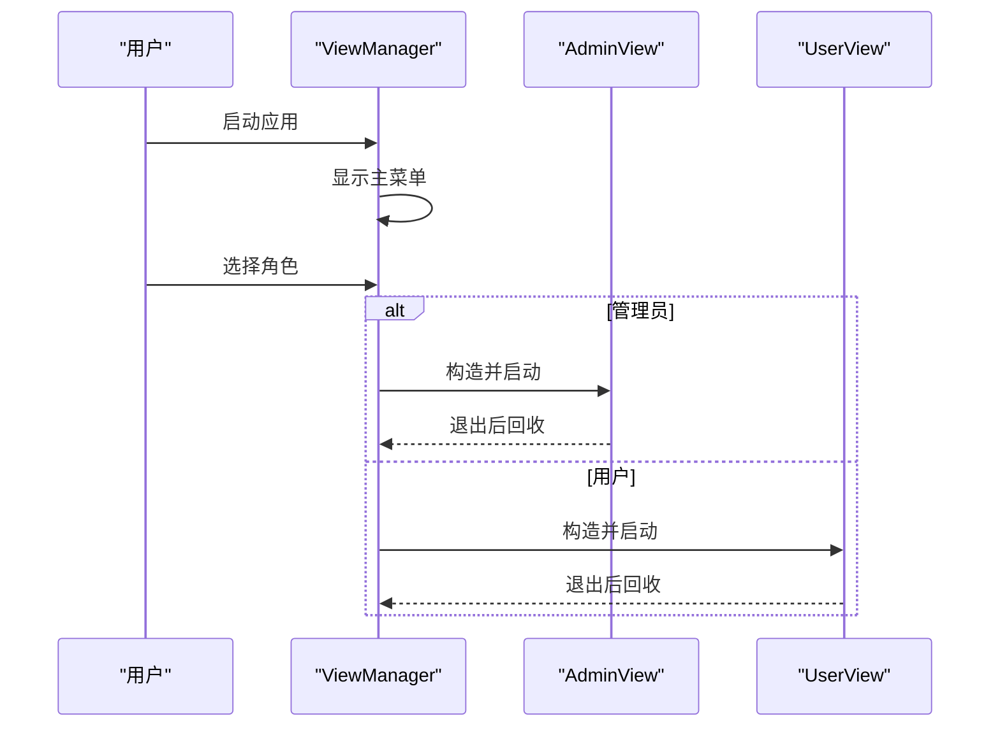
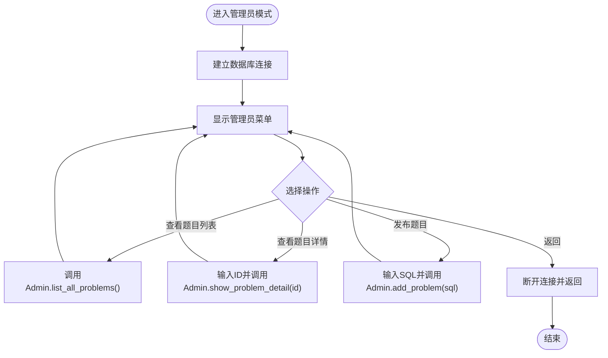
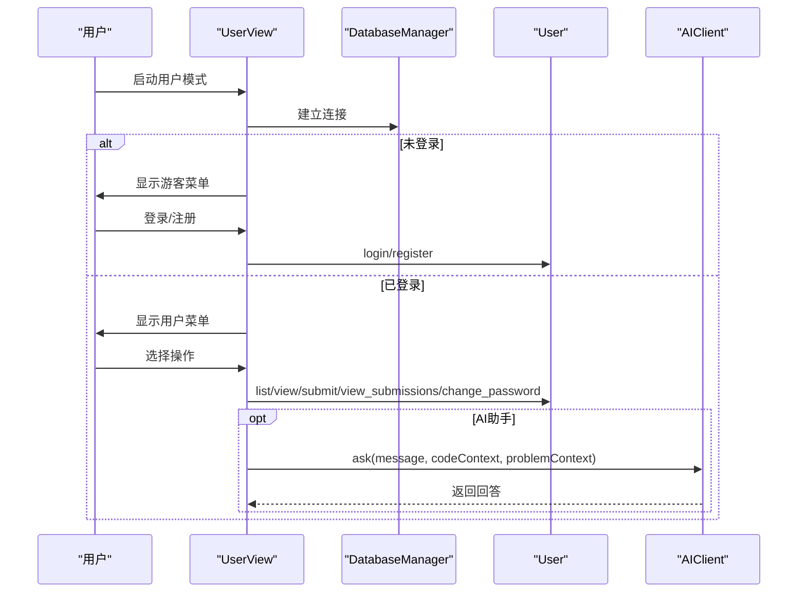
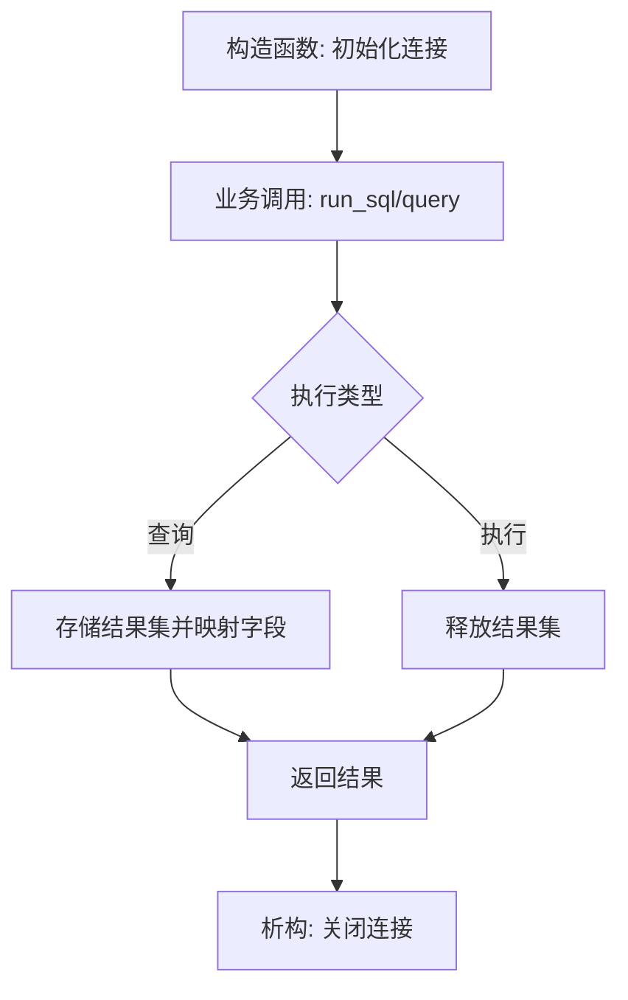
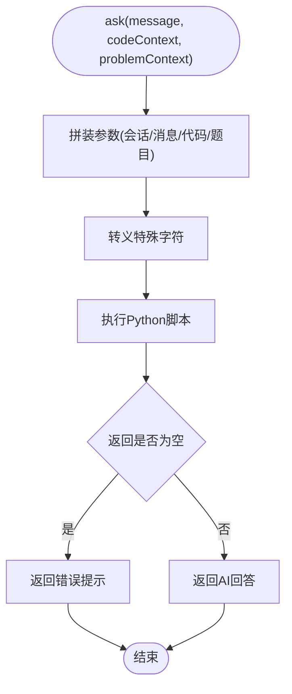
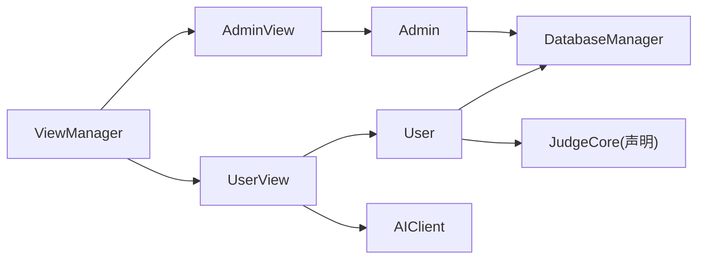

# 模块化设计原则

<cite>
**本文引用的文件**
- [README.md](file://README.md)
- [CMakeLists.txt](file://CMakeLists.txt)
- [src/main.cpp](file://src/main.cpp)
- [include/view_manager.h](file://include/view_manager.h)
- [src/view_manager.cpp](file://src/view_manager.cpp)
- [include/admin_view.h](file://include/admin_view.h)
- [src/admin_view.cpp](file://src/admin_view.cpp)
- [include/user_view.h](file://include/user_view.h)
- [src/user_view.cpp](file://src/user_view.cpp)
- [include/db_manager.h](file://include/db_manager.h)
- [src/db_manager.cpp](file://src/db_manager.cpp)
- [include/admin.h](file://include/admin.h)
- [include/user.h](file://include/user.h)
- [include/ai_client.h](file://include/ai_client.h)
- [src/ai_client.cpp](file://src/ai_client.cpp)
- [include/judge_core.h](file://include/judge_core.h)
</cite>

## 目录
1. [引言](#引言)
2. [项目结构](#项目结构)
3. [核心组件](#核心组件)
4. [架构总览](#架构总览)
5. [详细组件分析](#详细组件分析)
6. [依赖分析](#依赖分析)
7. [性能考虑](#性能考虑)
8. [故障排查指南](#故障排查指南)
9. [结论](#结论)
10. [附录](#附录)

## 引言
本文件围绕OJ系统的模块化设计原则展开，系统性阐述如何通过模块化实现关注点分离，并结合现有代码结构说明接口抽象、依赖注入、模块边界定义等设计思想在项目中的落地方式。文档同时给出模块职责划分建议、解耦策略（依赖倒置、接口隔离、开闭原则）以及模块化重构与扩展的最佳实践，帮助开发者理解并维护清晰的模块化结构。

## 项目结构
该项目采用分层+模块化的组织方式：
- 接口层：命令行界面入口与视图管理器，负责交互与流程编排
- 业务层：管理员与用户两类视图，分别承载管理员与普通用户的业务逻辑
- 数据层：数据库管理器封装MySQL访问，提供统一的查询与执行能力
- AI层：AI客户端封装外部Python服务调用，提供问答与辅助能力
- 评测层：评测核心类负责编译、运行、资源控制与结果汇总（声明于头文件）

图表来源
- [src/main.cpp:1-14](file://src/main.cpp#L1-L14)
- [include/view_manager.h:1-43](file://include/view_manager.h#L1-L43)
- [src/view_manager.cpp:1-77](file://src/view_manager.cpp#L1-L77)
- [include/admin_view.h:1-58](file://include/admin_view.h#L1-L58)
- [src/admin_view.cpp:1-138](file://src/admin_view.cpp#L1-L138)
- [include/user_view.h:1-92](file://include/user_view.h#L1-L92)
- [src/user_view.cpp:1-395](file://src/user_view.cpp#L1-L395)
- [include/db_manager.h:1-53](file://include/db_manager.h#L1-L53)
- [src/db_manager.cpp:1-100](file://src/db_manager.cpp#L1-L100)
- [include/admin.h:1-40](file://include/admin.h#L1-L40)
- [include/user.h:1-89](file://include/user.h#L1-L89)
- [include/ai_client.h:1-28](file://include/ai_client.h#L1-L28)
- [src/ai_client.cpp:1-124](file://src/ai_client.cpp#L1-L124)
- [include/judge_core.h:1-120](file://include/judge_core.h#L1-L120)

章节来源
- [CMakeLists.txt:1-40](file://CMakeLists.txt#L1-L40)
- [README.md:1-2](file://README.md#L1-L2)

## 核心组件
- 视图管理器：负责登录菜单与角色选择，按需构建管理员/用户视图实例，承担流程编排与清屏等通用交互功能
- 管理员视图：封装管理员专用数据库连接与菜单交互，委派具体业务到管理员对象
- 用户视图：封装普通用户数据库连接、登录/注册、题目浏览、提交代码、查看提交记录、修改密码等功能；集成AI客户端提供智能问答
- 数据库管理器：封装MySQL连接、查询与执行，提供统一的查询结果映射
- AI客户端：封装Python脚本调用，提供会话、消息、代码上下文与题目上下文的组合参数传递
- 评测核心：定义评测配置、结果枚举与评测报告结构，提供设置源码、测试数据、工作目录与执行评测的接口（声明于头文件）

章节来源
- [include/view_manager.h:1-43](file://include/view_manager.h#L1-L43)
- [src/view_manager.cpp:1-77](file://src/view_manager.cpp#L1-L77)
- [include/admin_view.h:1-58](file://include/admin_view.h#L1-L58)
- [src/admin_view.cpp:1-138](file://src/admin_view.cpp#L1-L138)
- [include/user_view.h:1-92](file://include/user_view.h#L1-L92)
- [src/user_view.cpp:1-395](file://src/user_view.cpp#L1-L395)
- [include/db_manager.h:1-53](file://include/db_manager.h#L1-L53)
- [src/db_manager.cpp:1-100](file://src/db_manager.cpp#L1-L100)
- [include/ai_client.h:1-28](file://include/ai_client.h#L1-L28)
- [src/ai_client.cpp:1-124](file://src/ai_client.cpp#L1-L124)
- [include/judge_core.h:1-120](file://include/judge_core.h#L1-L120)

## 架构总览
系统采用“视图-业务-数据-外部服务”的分层架构，通过视图管理器统一调度，业务层通过依赖注入持有数据层与AI层实例，实现关注点分离与低耦合。

图表来源
- [include/view_manager.h:1-43](file://include/view_manager.h#L1-L43)
- [src/view_manager.cpp:1-77](file://src/view_manager.cpp#L1-L77)
- [include/admin_view.h:1-58](file://include/admin_view.h#L1-L58)
- [src/admin_view.cpp:1-138](file://src/admin_view.cpp#L1-L138)
- [include/user_view.h:1-92](file://include/user_view.h#L1-L92)
- [src/user_view.cpp:1-395](file://src/user_view.cpp#L1-L395)
- [include/admin.h:1-40](file://include/admin.h#L1-L40)
- [include/user.h:1-89](file://include/user.h#L1-L89)
- [include/db_manager.h:1-53](file://include/db_manager.h#L1-L53)
- [src/db_manager.cpp:1-100](file://src/db_manager.cpp#L1-L100)
- [include/ai_client.h:1-28](file://include/ai_client.h#L1-L28)
- [src/ai_client.cpp:1-124](file://src/ai_client.cpp#L1-L124)
- [include/judge_core.h:1-120](file://include/judge_core.h#L1-L120)

## 详细组件分析

### 视图管理器（ViewManager）
- 职责：统一登录菜单、角色选择、清屏与输入清理；按需创建管理员/用户视图实例并驱动其生命周期
- 关注点分离：将界面交互与业务逻辑解耦，视图管理器不直接处理业务细节
- 依赖注入：通过构造函数注入AdminView/UserView指针，便于替换与测试
- 模块边界：仅暴露启动方法，内部私有化交互细节，避免跨模块侵入

图表来源
- [src/view_manager.cpp:32-70](file://src/view_manager.cpp#L32-L70)
- [include/admin_view.h:20-25](file://include/admin_view.h#L20-L25)
- [include/user_view.h:21-26](file://include/user_view.h#L21-L26)

章节来源
- [include/view_manager.h:11-40](file://include/view_manager.h#L11-L40)
- [src/view_manager.cpp:10-77](file://src/view_manager.cpp#L10-L77)

### 管理员视图（AdminView）
- 职责：管理员专用菜单、题目列表/详情查看、新增题目（SQL直写），并在进入时建立数据库连接
- 依赖注入：持有DatabaseManager与Admin实例，业务委托给Admin对象
- 解耦策略：通过Admin对象隐藏数据库细节，AdminView仅负责UI与输入输出

图表来源
- [src/admin_view.cpp:21-76](file://src/admin_view.cpp#L21-L76)
- [include/admin.h:22-33](file://include/admin.h#L22-L33)

章节来源
- [include/admin_view.h:11-55](file://include/admin_view.h#L11-L55)
- [src/admin_view.cpp:10-138](file://src/admin_view.cpp#L10-L138)
- [include/admin.h:10-37](file://include/admin.h#L10-L37)

### 用户视图（UserView）
- 职责：游客菜单（登录/注册）、用户菜单（题目浏览、提交、查看提交、改密）、AI助手集成
- 依赖注入：持有DatabaseManager、User、AIClient实例
- 关注点分离：AI交互独立封装，用户视图仅负责交互与调用
- 模块边界：对外暴露start()，内部封装菜单与分支逻辑

图表来源
- [src/user_view.cpp:36-131](file://src/user_view.cpp#L36-L131)
- [src/user_view.cpp:290-354](file://src/user_view.cpp#L290-L354)
- [include/user.h:24-85](file://include/user.h#L24-L85)
- [include/ai_client.h:12-16](file://include/ai_client.h#L12-L16)

章节来源
- [include/user_view.h:12-89](file://include/user_view.h#L12-L89)
- [src/user_view.cpp:25-395](file://src/user_view.cpp#L25-L395)
- [include/user.h:10-86](file://include/user.h#L10-L86)

### 数据库管理器（DatabaseManager）
- 职责：封装MySQL连接、查询与执行；提供连接句柄与结果映射
- 设计要点：构造时建立连接，析构时释放；查询返回结构化结果，便于上层业务使用
- 模块边界：向上提供简洁接口，向下封装底层细节

图表来源
- [src/db_manager.cpp:8-57](file://src/db_manager.cpp#L8-L57)
- [include/db_manager.h:18-42](file://include/db_manager.h#L18-L42)

章节来源
- [include/db_manager.h:12-51](file://include/db_manager.h#L12-L51)
- [src/db_manager.cpp:7-99](file://src/db_manager.cpp#L7-L99)

### AI客户端（AIClient）
- 职责：封装Python脚本调用，提供会话、消息、代码与题目上下文参数传递
- 设计要点：自动检测可执行路径，转义特殊字符，处理空响应与错误
- 模块边界：对外暴露ask/isAvailable，内部封装进程执行细节

图表来源
- [src/ai_client.cpp:85-112](file://src/ai_client.cpp#L85-L112)
- [src/ai_client.cpp:56-83](file://src/ai_client.cpp#L56-L83)
- [src/ai_client.cpp:114-123](file://src/ai_client.cpp#L114-L123)

章节来源
- [include/ai_client.h:6-25](file://include/ai_client.h#L6-L25)
- [src/ai_client.cpp:8-124](file://src/ai_client.cpp#L8-L124)

### 评测核心（JudgeCore）
- 职责：定义评测配置、结果枚举与报告结构；提供设置源码、测试数据、工作目录与执行评测的接口
- 设计要点：禁止拷贝与赋值，确保资源安全；提供清理接口
- 模块边界：面向使用者暴露清晰的配置与执行接口

章节来源
- [include/judge_core.h:53-117](file://include/judge_core.h#L53-L117)

## 依赖分析
- 视图层依赖业务层：视图管理器按需创建管理员/用户视图；视图持有业务对象实例
- 业务层依赖数据层：管理员与用户业务均依赖数据库管理器
- 用户视图依赖AI层：提供AI问答能力
- 评测层与业务层：用户业务声明依赖评测核心（当前为头文件声明，未见实现文件）

图表来源
- [include/view_manager.h:23-24](file://include/view_manager.h#L23-L24)
- [include/admin_view.h:23-24](file://include/admin_view.h#L23-L24)
- [include/user_view.h:24-26](file://include/user_view.h#L24-L26)
- [include/admin.h:36](file://include/admin.h#L36)
- [include/user.h:82](file://include/user.h#L82)
- [include/ai_client.h:6](file://include/ai_client.h#L6)
- [include/judge_core.h:53](file://include/judge_core.h#L53)

章节来源
- [include/view_manager.h:23-24](file://include/view_manager.h#L23-L24)
- [include/admin_view.h:23-24](file://include/admin_view.h#L23-L24)
- [include/user_view.h:24-26](file://include/user_view.h#L24-L26)
- [include/admin.h:36](file://include/admin.h#L36)
- [include/user.h:82](file://include/user.h#L82)
- [include/ai_client.h:6](file://include/ai_client.h#L6)
- [include/judge_core.h:53](file://include/judge_core.h#L53)

## 性能考虑
- I/O与连接管理：数据库连接在视图进入时建立，退出时回收，避免长连接占用；查询结果一次性读取并释放，减少内存驻留
- AI调用：Python脚本调用为同步阻塞，建议在高并发场景下引入异步队列或限流策略
- 评测执行：评测核心提供资源限制与报告结构，建议在实际实现中加入超时与内存监控
- 输入处理：统一的输入清理与异常分支处理，降低重复I/O与错误重试成本

## 故障排查指南
- 数据库连接失败
  - 现象：管理员/用户视图提示连接失败
  - 排查：确认主机、用户名、密码与数据库名配置；检查MySQL服务状态
  - 参考
    - [src/admin_view.cpp:27-75](file://src/admin_view.cpp#L27-L75)
    - [src/user_view.cpp:42-130](file://src/user_view.cpp#L42-L130)
    - [src/db_manager.cpp:61-79](file://src/db_manager.cpp#L61-L79)
- AI服务不可用
  - 现象：AI助手提示服务不可用
  - 排查：确认Python可执行路径与脚本路径存在；检查虚拟环境与依赖安装
  - 参考
    - [src/user_view.cpp:295-301](file://src/user_view.cpp#L295-L301)
    - [src/ai_client.cpp:114-123](file://src/ai_client.cpp#L114-L123)
- 输入异常
  - 现象：菜单输入非数字或空输入
  - 排查：使用统一的输入清理函数，确保缓冲区正确清空
  - 参考
    - [src/view_manager.cpp:72-76](file://src/view_manager.cpp#L72-L76)
    - [src/admin_view.cpp:133-137](file://src/admin_view.cpp#L133-L137)
    - [src/user_view.cpp:390-394](file://src/user_view.cpp#L390-L394)

章节来源
- [src/admin_view.cpp:27-75](file://src/admin_view.cpp#L27-L75)
- [src/user_view.cpp:42-130](file://src/user_view.cpp#L42-L130)
- [src/db_manager.cpp:61-79](file://src/db_manager.cpp#L61-L79)
- [src/user_view.cpp:295-301](file://src/user_view.cpp#L295-L301)
- [src/ai_client.cpp:114-123](file://src/ai_client.cpp#L114-L123)
- [src/view_manager.cpp:72-76](file://src/view_manager.cpp#L72-L76)
- [src/admin_view.cpp:133-137](file://src/admin_view.cpp#L133-L137)
- [src/user_view.cpp:390-394](file://src/user_view.cpp#L390-L394)

## 结论
本项目通过视图-业务-数据-外部服务的分层与模块化设计，实现了关注点分离与职责清晰划分。视图管理器承担流程编排，业务层通过依赖注入与委托实现低耦合，数据层与AI层提供稳定的接口边界。遵循依赖倒置、接口隔离与开闭原则，有助于后续扩展评测能力、接入更多外部服务与增强用户体验。

## 附录
- 模块化重构最佳实践
  - 明确接口契约：以头文件形式定义稳定接口，避免实现细节泄露
  - 依赖倒置：高层模块不依赖低层模块，二者共同依赖抽象
  - 接口隔离：按需拆分接口，避免“胖接口”
  - 开闭原则：对扩展开放，对修改封闭，通过继承或组合扩展功能
- 扩展指导
  - 评测模块：在现有评测核心基础上增加多语言支持与容器沙箱
  - AI模块：引入会话管理与缓存机制，优化调用性能
  - 数据模块：抽象出Repository/Service层，提升可测试性与可替换性
  - 视图模块：引入模板方法或策略模式，统一菜单与输入处理