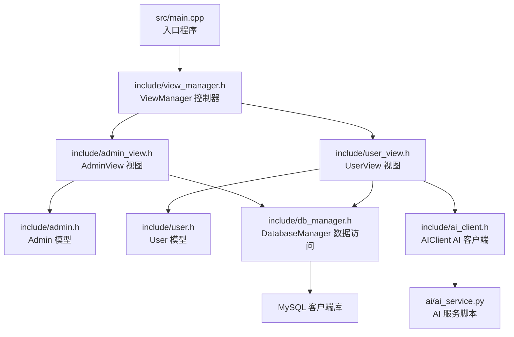
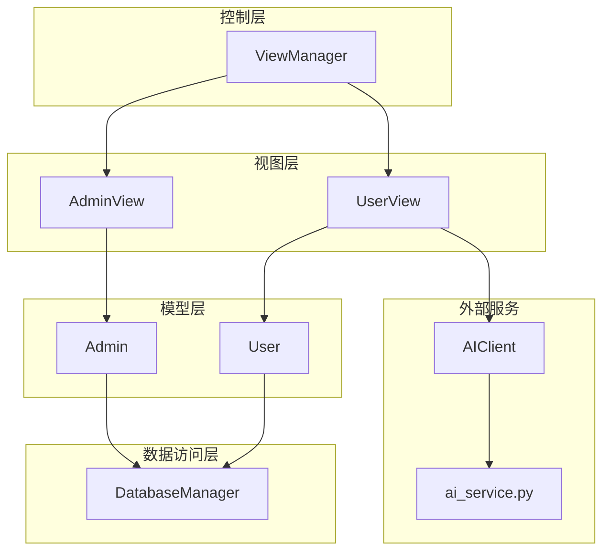
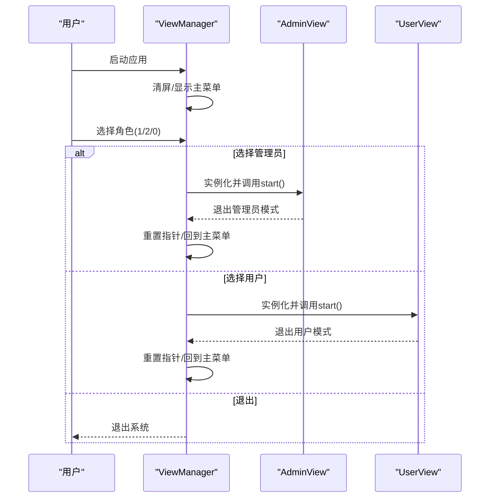
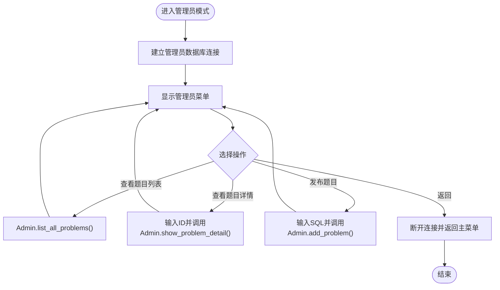
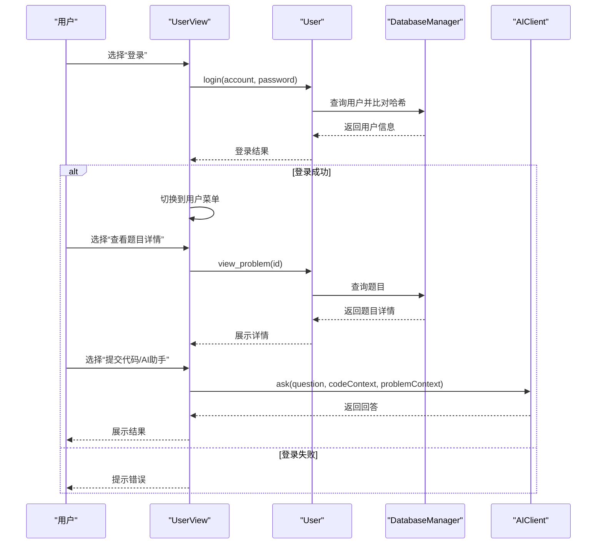
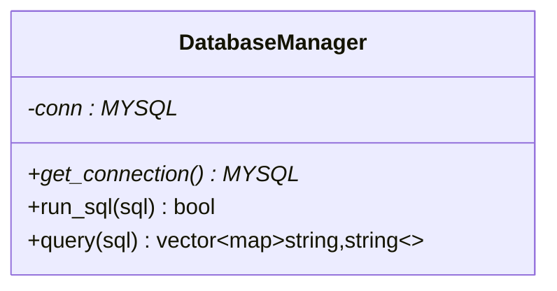
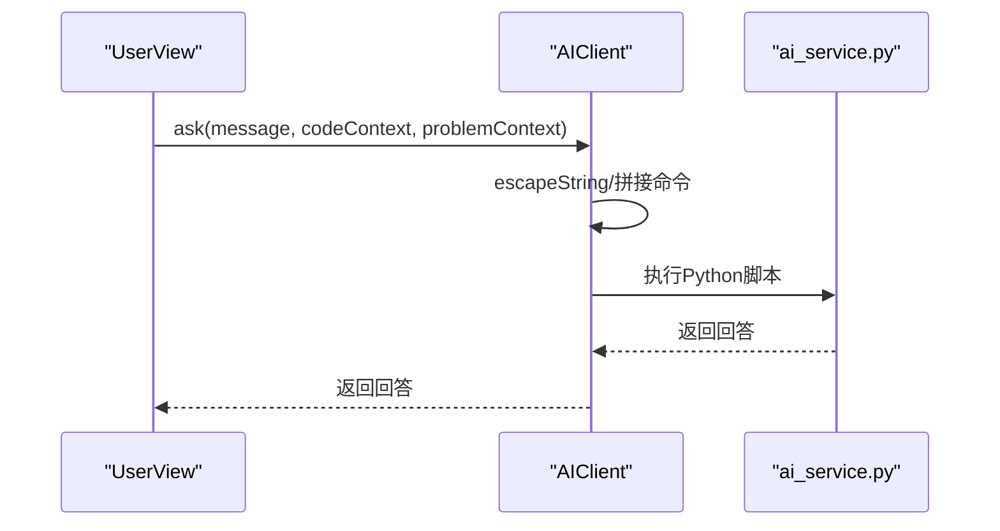
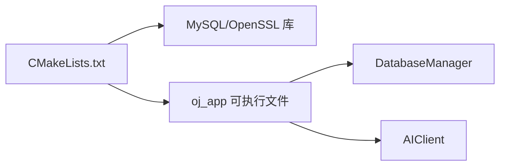

# 系统架构设计

<cite>
**本文档引用的文件**
- [README.md](file://README.md)
- [CMakeLists.txt](file://CMakeLists.txt)
- [src/main.cpp](file://src/main.cpp)
- [include/view_manager.h](file://include/view_manager.h)
- [src/view_manager.cpp](file://src/view_manager.cpp)
- [include/admin_view.h](file://include/admin_view.h)
- [src/admin_view.cpp](file://src/admin_view.cpp)
- [include/user_view.h](file://include/user_view.h)
- [src/user_view.cpp](file://src/user_view.cpp)
- [include/db_manager.h](file://include/db_manager.h)
- [src/db_manager.cpp](file://src/db_manager.cpp)
- [include/admin.h](file://include/admin.h)
- [src/admin.cpp](file://src/admin.cpp)
- [include/user.h](file://include/user.h)
- [src/user.cpp](file://src/user.cpp)
- [include/ai_client.h](file://include/ai_client.h)
- [src/ai_client.cpp](file://src/ai_client.cpp)
</cite>

## 目录
1. [引言](#引言)
2. [项目结构](#项目结构)
3. [核心组件](#核心组件)
4. [架构总览](#架构总览)
5. [详细组件分析](#详细组件分析)
6. [依赖关系分析](#依赖关系分析)
7. [性能考虑](#性能考虑)
8. [故障排查指南](#故障排查指南)
9. [结论](#结论)
10. [附录](#附录)

## 引言
本文件面向OJ评测系统的架构设计文档，聚焦于整体架构模式（MVC设计思想的体现）、模块化设计原则与组件交互关系。重点阐释ViewManager控制器的设计理念、角色切换机制的工作原理，以及菜单系统的实现方式。同时给出系统架构图、模块关系图与数据流图，并讨论技术决策、架构权衡与约束条件，帮助开发者快速理解系统上下文、基础设施需求、可扩展性与部署拓扑。

## 项目结构
项目采用分层+模块化的组织方式：
- include：对外公开的头文件，定义接口与抽象类型（视图、模型、控制器等）
- src：实现文件，包含控制器、视图、模型与辅助模块
- 示例与历史：示例与版本演进记录
- ai：AI服务相关脚本与依赖
- 其他根级文件：构建配置、说明文档、初始化脚本与SQL

图表来源
- [src/main.cpp:1-14](file://src/main.cpp#L1-L14)
- [include/view_manager.h:1-43](file://include/view_manager.h#L1-L43)
- [include/admin_view.h:1-58](file://include/admin_view.h#L1-L58)
- [include/user_view.h:1-92](file://include/user_view.h#L1-L92)
- [include/admin.h:1-40](file://include/admin.h#L1-L40)
- [include/user.h:1-89](file://include/user.h#L1-L89)
- [include/db_manager.h:1-53](file://include/db_manager.h#L1-L53)
- [include/ai_client.h:1-28](file://include/ai_client.h#L1-L28)

章节来源
- [CMakeLists.txt:1-40](file://CMakeLists.txt#L1-L40)
- [README.md:1-2](file://README.md#L1-L2)

## 核心组件
- 控制器层
  - ViewManager：命令行主控制器，负责启动登录菜单与角色切换；持有AdminView与UserView的生命周期管理
- 视图层
  - AdminView：管理员模式界面，提供题目列表、题目详情、发布题目的菜单与处理
  - UserView：用户模式界面，支持未登录游客菜单与登录后的用户菜单，包含登录、注册、查看题目、提交代码、AI助手、查看提交记录、改密等功能
- 模型层
  - Admin：封装管理员特有业务逻辑（如发布题目、列出题目、查看题目详情）
  - User：封装用户业务逻辑（登录、注册、改密、查看题目、提交代码、查看提交记录），内置SHA256密码哈希
- 数据访问层
  - DatabaseManager：封装MySQL连接与SQL执行/查询，提供统一的查询结果映射
- AI集成
  - AIClient：封装Python子进程调用，向ai_service.py发起请求，提供会话与消息参数化

章节来源
- [include/view_manager.h:11-40](file://include/view_manager.h#L11-L40)
- [include/admin_view.h:11-55](file://include/admin_view.h#L11-L55)
- [include/user_view.h:12-89](file://include/user_view.h#L12-L89)
- [include/admin.h:10-37](file://include/admin.h#L10-L37)
- [include/user.h:10-86](file://include/user.h#L10-L86)
- [include/db_manager.h:12-46](file://include/db_manager.h#L12-L46)
- [include/ai_client.h:6-25](file://include/ai_client.h#L6-L25)

## 架构总览
系统采用“控制器-视图-模型-数据访问”的分层架构，结合MVC思想：
- 控制器（ViewManager）协调视图（AdminView/UserView）与模型（Admin/User）交互
- 视图负责用户交互与菜单展示，调用模型完成业务动作
- 模型负责业务规则与数据校验，通过数据访问层与数据库交互
- 数据访问层屏蔽底层MySQL细节，提供统一接口

图表来源
- [include/view_manager.h:11-40](file://include/view_manager.h#L11-L40)
- [include/admin_view.h:11-55](file://include/admin_view.h#L11-L55)
- [include/user_view.h:12-89](file://include/user_view.h#L12-L89)
- [include/admin.h:10-37](file://include/admin.h#L10-L37)
- [include/user.h:10-86](file://include/user.h#L10-L86)
- [include/db_manager.h:12-46](file://include/db_manager.h#L12-L46)
- [include/ai_client.h:6-25](file://include/ai_client.h#L6-L25)

## 详细组件分析

### ViewManager 控制器
- 设计思想
  - 作为命令行主控制器，集中管理登录菜单与角色切换，避免跨模块耦合
  - 通过智能指针管理AdminView/UserView生命周期，确保资源及时释放
- 角色切换机制
  - 登录菜单循环读取用户输入，根据选择实例化对应视图并启动其start流程
  - 退出当前角色后重置视图指针，回到登录菜单
- 菜单系统
  - 提供主菜单（管理员/用户/退出），并在各角色内提供子菜单
  - 统一清屏与输入缓冲区清理，提升交互体验

图表来源
- [src/view_manager.cpp:32-70](file://src/view_manager.cpp#L32-L70)
- [include/view_manager.h:20-40](file://include/view_manager.h#L20-L40)

章节来源
- [src/view_manager.cpp:10-77](file://src/view_manager.cpp#L10-L77)
- [include/view_manager.h:11-40](file://include/view_manager.h#L11-L40)

### AdminView 管理员视图
- 职责
  - 管理员专用菜单：查看题目列表、查看题目详情、发布新题目（直接输入SQL）
  - 建立管理员专用数据库连接，保证权限隔离
- 交互流程
  - 登录成功后进入管理员面板，循环处理菜单选项
  - 调用Admin模型执行业务逻辑，再由DatabaseManager执行SQL

图表来源
- [src/admin_view.cpp:21-76](file://src/admin_view.cpp#L21-L76)
- [include/admin_view.h:20-55](file://include/admin_view.h#L20-L55)
- [src/admin.cpp:17-58](file://src/admin.cpp#L17-L58)

章节来源
- [src/admin_view.cpp:10-138](file://src/admin_view.cpp#L10-L138)
- [include/admin_view.h:11-55](file://include/admin_view.h#L11-L55)
- [src/admin.cpp:10-59](file://src/admin.cpp#L10-L59)

### UserView 用户视图
- 职责
  - 游客菜单（未登录）：登录、注册、返回
  - 登录后用户菜单：查看题目列表、查看题目详情、查看我的提交、修改密码、退出登录
  - 题目详情子菜单：提交代码、AI助手
- 特殊能力
  - 集成AIClient，提供AI助手功能
  - 根据登录状态动态切换菜单

图表来源
- [src/user_view.cpp:21-116](file://src/user_view.cpp#L21-L116)
- [src/user.cpp:39-71](file://src/user.cpp#L39-L71)
- [include/user_view.h:20-89](file://include/user_view.h#L20-L89)
- [include/user.h:24-79](file://include/user.h#L24-L79)
- [src/ai_client.cpp:85-112](file://src/ai_client.cpp#L85-L112)

章节来源
- [src/user_view.cpp:10-352](file://src/user_view.cpp#L10-L352)
- [include/user_view.h:12-89](file://include/user_view.h#L12-L89)
- [src/user.cpp:11-223](file://src/user.cpp#L11-L223)
- [include/user.h:10-86](file://include/user.h#L10-L86)

### DatabaseManager 数据访问层
- 职责
  - 封装MySQL连接、查询与执行，提供统一接口
  - 查询结果映射为键值对集合，便于上层视图渲染
- 设计要点
  - 构造时建立连接，析构时关闭连接
  - run_sql用于DDL/DML执行，query用于SELECT查询并返回结构化结果

图表来源
- [include/db_manager.h:12-46](file://include/db_manager.h#L12-L46)
- [src/db_manager.cpp:8-57](file://src/db_manager.cpp#L8-L57)

章节来源
- [include/db_manager.h:12-46](file://include/db_manager.h#L12-L46)
- [src/db_manager.cpp:8-100](file://src/db_manager.cpp#L8-L100)

### AIClient AI客户端
- 职责
  - 通过Python子进程调用ai_service.py，传递会话ID、消息、代码上下文与题目上下文
  - 提供可用性检测与字符串转义，保障参数安全
- 部署要求
  - 需要ai/venv/bin/python与ai/ai_service.py存在

图表来源
- [src/ai_client.cpp:85-112](file://src/ai_client.cpp#L85-L112)
- [include/ai_client.h:12-24](file://include/ai_client.h#L12-L24)

章节来源
- [src/ai_client.cpp:8-124](file://src/ai_client.cpp#L8-L124)
- [include/ai_client.h:6-25](file://include/ai_client.h#L6-L25)

## 依赖关系分析
- 构建与链接
  - CMake查找mysqlclient与OpenSSL，包含头文件目录，链接目标库
  - 生成oj_app可执行文件，导出编译命令以便工具链使用
- 运行时依赖
  - MySQL服务器（本地或远程）
  - Python运行时与ai_service.py脚本（AI功能）

图表来源
- [CMakeLists.txt:11-34](file://CMakeLists.txt#L11-L34)

章节来源
- [CMakeLists.txt:1-40](file://CMakeLists.txt#L1-L40)

## 性能考虑
- I/O与交互
  - 控制器与视图均采用循环菜单与清屏策略，减少重复渲染开销
  - 输入缓冲区清理避免格式错误导致的阻塞
- 数据访问
  - 查询结果一次性加载并映射为键值对，便于格式化输出
  - 对于大结果集建议分页或限制字段，避免内存压力
- 安全与健壮性
  - 用户密码采用SHA256哈希存储，避免明文泄露
  - AI客户端对参数进行转义，降低注入风险
- 可扩展性
  - 视图与模型解耦，新增功能可通过扩展视图与模型实现
  - 数据访问层抽象便于替换数据库或引入缓存

## 故障排查指南
- 登录失败
  - 检查账号是否存在与密码哈希是否匹配
  - 确认DatabaseManager连接参数正确
- 数据库连接失败
  - 核对主机、用户名、密码与数据库名
  - 确认MySQL服务正常运行
- AI功能不可用
  - 检查ai/venv/bin/python与ai/ai_service.py路径是否存在
  - 确认Python虚拟环境与脚本可执行
- 输入异常
  - 使用clear_input清理缓冲区，避免非数字输入导致循环卡死

章节来源
- [src/user.cpp:39-71](file://src/user.cpp#L39-L71)
- [src/db_manager.cpp:61-79](file://src/db_manager.cpp#L61-L79)
- [src/ai_client.cpp:14-23](file://src/ai_client.cpp#L14-L23)
- [src/view_manager.cpp:72-77](file://src/view_manager.cpp#L72-L77)

## 结论
本系统以ViewManager为核心控制器，结合AdminView/UserView实现清晰的角色分离与菜单体系；Admin/User模型封装各自业务逻辑；DatabaseManager统一数据访问；AIClient提供可选的AI增强能力。该架构遵循MVC思想与模块化设计原则，具备良好的可维护性与扩展性。部署时需满足MySQL与Python运行时依赖，并注意输入校验与安全策略。

## 附录
- 基础设施需求
  - MySQL数据库（含用户与表结构）
  - OpenSSL库（密码哈希）
  - Python运行时与ai_service.py脚本
- 部署拓扑建议
  - 单机部署：本地MySQL + 本地AI服务
  - 分离部署：独立MySQL与AI服务，通过网络访问
- 可扩展方向
  - 引入缓存层（如Redis）优化热点查询
  - 增强AI功能（多轮对话、代码补全）
  - 引入日志与监控，提升可观测性