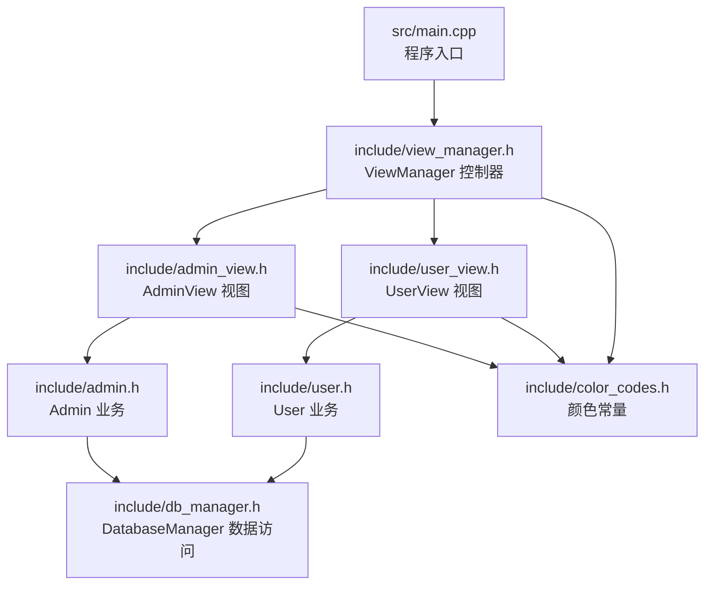
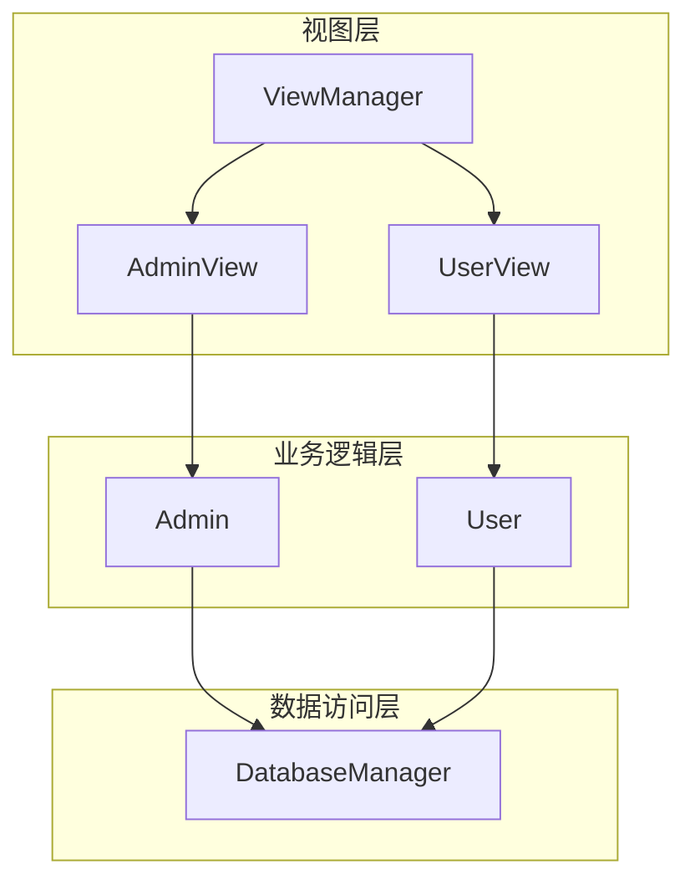
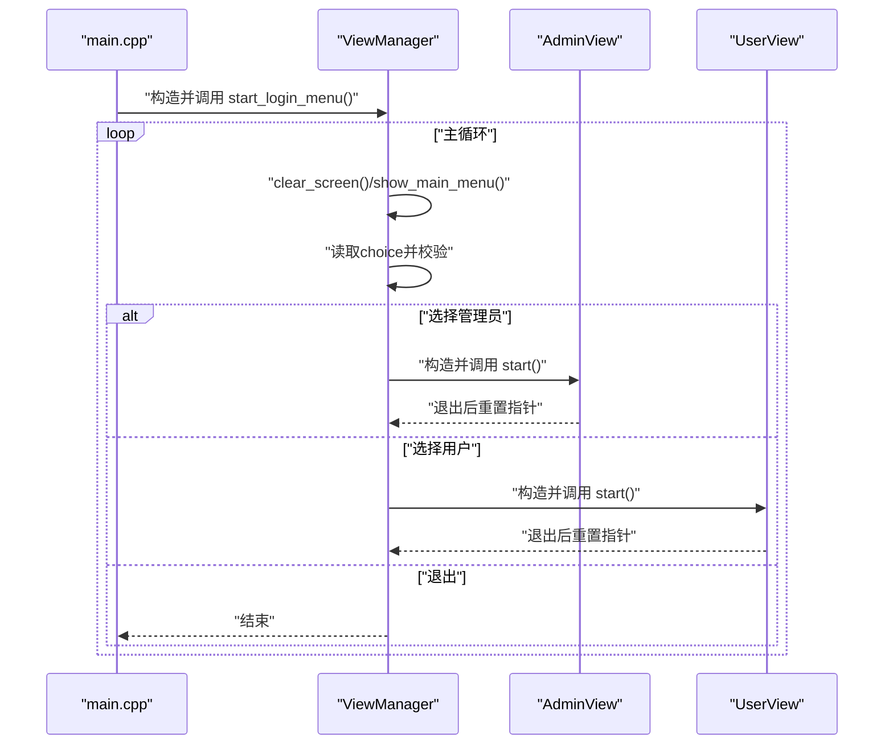
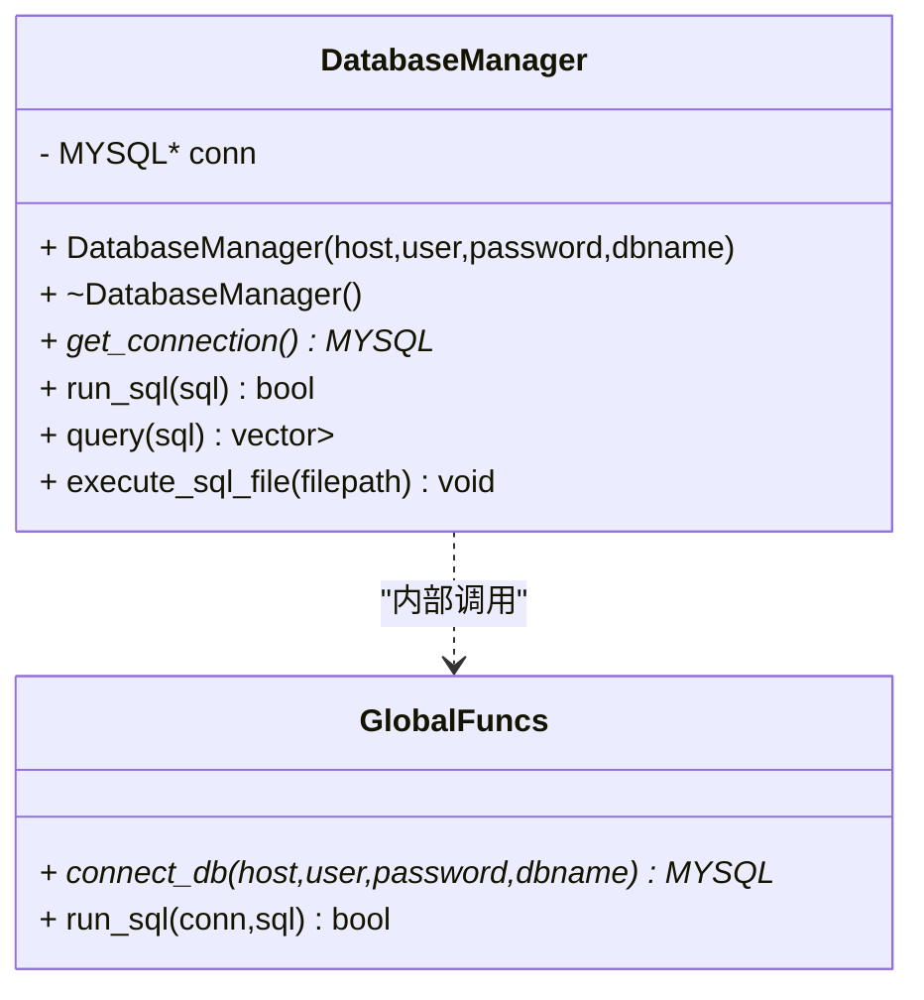
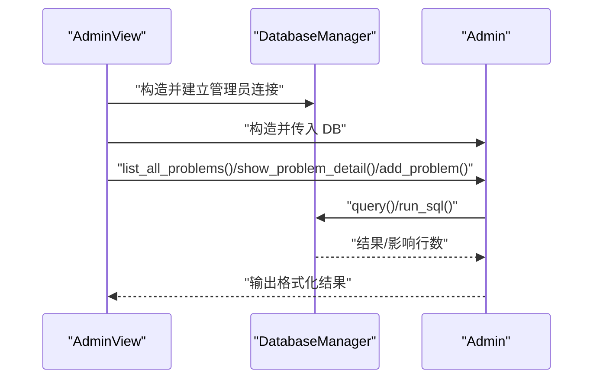
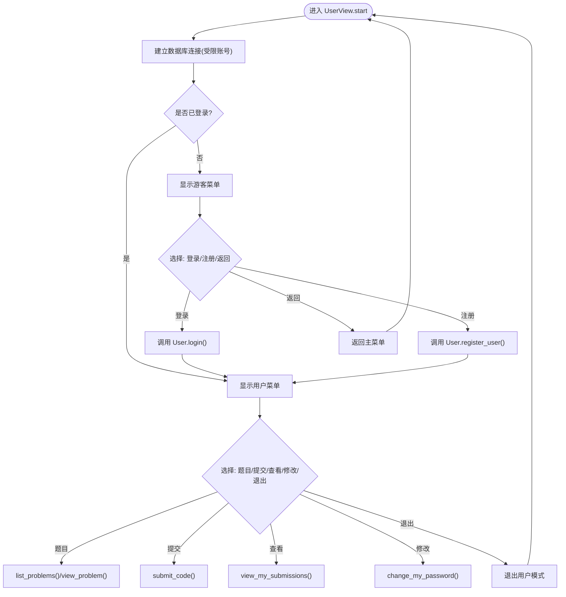
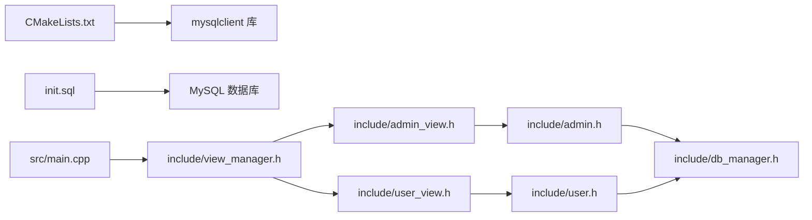

# 系统架构设计

<cite>
**本文引用的文件**
- [README.md](file://README.md)
- [CMakeLists.txt](file://CMakeLists.txt)
- [init.sql](file://init.sql)
- [src/main.cpp](file://src/main.cpp)
- [include/view_manager.h](file://include/view_manager.h)
- [src/view_manager.cpp](file://src/view_manager.cpp)
- [include/admin_view.h](file://include/admin_view.h)
- [src/admin_view.cpp](file://src/admin_view.cpp)
- [include/user_view.h](file://include/user_view.h)
- [src/user_view.cpp](file://src/user_view.cpp)
- [include/db_manager.h](file://include/db_manager.h)
- [src/db_manager.cpp](file://src/db_manager.cpp)
- [include/admin.h](file://include/admin.h)
- [src/admin.cpp](file://src/admin.cpp)
- [include/user.h](file://include/user.h)
- [src/user.cpp](file://src/user.cpp)
- [include/color_codes.h](file://include/color_codes.h)
</cite>

## 目录
1. [简介](#简介)
2. [项目结构](#项目结构)
3. [核心组件](#核心组件)
4. [架构总览](#架构总览)
5. [详细组件分析](#详细组件分析)
6. [依赖分析](#依赖分析)
7. [性能考虑](#性能考虑)
8. [故障排查指南](#故障排查指南)
9. [结论](#结论)
10. [附录](#附录)

## 简介
本文件为在线判题（OJ）系统的架构设计文档，面向开发者与技术评审人员，系统采用命令行界面与分层架构组织，遵循“视图-业务-数据访问”三层分离的设计原则。系统入口为 ViewManager 控制器，负责调度管理员与用户两种角色的视图；业务逻辑由 Admin 与 User 类承载；数据访问层由 DatabaseManager 统一封装 MySQL 连接与 SQL 执行。

## 项目结构
项目采用按职责分层的组织方式：
- include：对外公开的头文件，定义接口与类声明
- src：实现文件，包含各层的具体实现
- CMakeLists.txt：构建配置，链接 MySQL 客户端库
- init.sql：数据库初始化脚本，定义表结构与权限配置
- README.md：项目简述

图表来源
- [src/main.cpp:1-12](file://src/main.cpp#L1-L12)
- [include/view_manager.h:11-40](file://include/view_manager.h#L11-L40)
- [include/admin_view.h:11-50](file://include/admin_view.h#L11-L50)
- [include/user_view.h:11-80](file://include/user_view.h#L11-L80)
- [include/admin.h:10-37](file://include/admin.h#L10-L37)
- [include/user.h:10-86](file://include/user.h#L10-L86)
- [include/db_manager.h:12-51](file://include/db_manager.h#L12-L51)
- [include/color_codes.h:5-15](file://include/color_codes.h#L5-L15)

章节来源
- [CMakeLists.txt:1-36](file://CMakeLists.txt#L1-L36)
- [README.md:1-2](file://README.md#L1-L2)

## 核心组件
- ViewManager：命令行主控制器，负责登录菜单与角色选择，根据用户选择实例化 AdminView 或 UserView，并在调用结束后释放资源
- AdminView：管理员视图，负责展示管理员菜单、接收用户输入并调用 Admin 业务逻辑；在进入时建立数据库连接
- UserView：用户视图，负责游客态与登录态菜单切换、用户输入处理与 User 业务交互；在进入时建立数据库连接
- Admin：管理员业务逻辑，封装题目增删改查等操作，委托 DatabaseManager 执行 SQL
- User：用户业务逻辑，封装登录、注册、密码修改、题目浏览、提交代码、查看提交记录等流程
- DatabaseManager：数据访问层，封装 MySQL 连接、SQL 执行、查询结果映射、批量执行 SQL 文件等功能

章节来源
- [include/view_manager.h:11-40](file://include/view_manager.h#L11-L40)
- [src/view_manager.cpp:28-66](file://src/view_manager.cpp#L28-L66)
- [include/admin_view.h:11-50](file://include/admin_view.h#L11-L50)
- [src/admin_view.cpp:12-66](file://src/admin_view.cpp#L12-L66)
- [include/user_view.h:11-80](file://include/user_view.h#L11-L80)
- [src/user_view.cpp:17-109](file://src/user_view.cpp#L17-L109)
- [include/admin.h:10-37](file://include/admin.h#L10-L37)
- [src/admin.cpp:8-56](file://src/admin.cpp#L8-L56)
- [include/user.h:10-86](file://include/user.h#L10-L86)
- [src/user.cpp:4-85](file://src/user.cpp#L4-L85)
- [include/db_manager.h:12-51](file://include/db_manager.h#L12-L51)
- [src/db_manager.cpp:8-175](file://src/db_manager.cpp#L8-L175)

## 架构总览
系统采用经典的 MVC 思想在命令行层面落地：
- 视图层：ViewManager、AdminView、UserView 负责用户交互与菜单展示
- 业务逻辑层：Admin、User 负责业务规则与流程编排
- 数据访问层：DatabaseManager 负责数据库连接与 SQL 执行

图表来源
- [include/view_manager.h:11-40](file://include/view_manager.h#L11-L40)
- [include/admin_view.h:11-50](file://include/admin_view.h#L11-L50)
- [include/user_view.h:11-80](file://include/user_view.h#L11-L80)
- [include/admin.h:10-37](file://include/admin.h#L10-L37)
- [include/user.h:10-86](file://include/user.h#L10-L86)
- [include/db_manager.h:12-51](file://include/db_manager.h#L12-L51)

## 详细组件分析

### ViewManager 控制器
- 职责：启动登录菜单，根据用户选择进入管理员或用户视图；负责清屏、输入清理等通用 UI 行为
- 关键流程：循环显示主菜单 → 读取用户输入 → 分派到 AdminView 或 UserView → 退出时释放资源
- 错误处理：输入非整数时清理缓冲区并提示；默认分支提示无效选项

图表来源
- [src/main.cpp:3-10](file://src/main.cpp#L3-L10)
- [src/view_manager.cpp:28-66](file://src/view_manager.cpp#L28-L66)
- [src/admin_view.cpp:12-66](file://src/admin_view.cpp#L12-L66)
- [src/user_view.cpp:17-109](file://src/user_view.cpp#L17-L109)

章节来源
- [include/view_manager.h:11-40](file://include/view_manager.h#L11-L40)
- [src/view_manager.cpp:12-72](file://src/view_manager.cpp#L12-L72)
- [src/main.cpp:1-12](file://src/main.cpp#L1-L12)

### DatabaseManager 数据访问层
- 职责：封装 MySQL 连接生命周期、SQL 执行、查询结果集映射、从文件批量执行 SQL
- 关键能力：连接初始化与关闭、查询结果转为键值映射列表、按分号分割执行 SQL 文件
- 设计要点：对外暴露 MYSQL 句柄便于兼容性；提供便捷的查询与执行接口；对异常进行日志输出

图表来源
- [include/db_manager.h:12-51](file://include/db_manager.h#L12-L51)
- [src/db_manager.cpp:8-175](file://src/db_manager.cpp#L8-L175)

章节来源
- [include/db_manager.h:12-51](file://include/db_manager.h#L12-L51)
- [src/db_manager.cpp:8-175](file://src/db_manager.cpp#L8-L175)

### AdminView 与 Admin 业务
- AdminView：负责管理员菜单展示与输入处理；在进入时以管理员账号建立数据库连接；调用 Admin 的业务方法
- Admin：封装管理员特有操作，如列出题目、查看题目详情、发布题目（执行 SQL）

图表来源
- [src/admin_view.cpp:12-66](file://src/admin_view.cpp#L12-L66)
- [src/admin.cpp:10-56](file://src/admin.cpp#L10-L56)
- [src/db_manager.cpp:22-58](file://src/db_manager.cpp#L22-L58)

章节来源
- [include/admin_view.h:11-50](file://include/admin_view.h#L11-L50)
- [src/admin_view.cpp:12-118](file://src/admin_view.cpp#L12-L118)
- [include/admin.h:10-37](file://include/admin.h#L10-L37)
- [src/admin.cpp:8-56](file://src/admin.cpp#L8-L56)

### UserView 与 User 业务
- UserView：区分游客态与登录态菜单；处理登录、注册、查看题目、提交代码、查看提交记录、修改密码等
- User：封装用户登录态维护与业务操作；当前多数功能为占位实现，后续可接入真实数据库操作

图表来源
- [src/user_view.cpp:17-221](file://src/user_view.cpp#L17-L221)
- [src/user.cpp:6-85](file://src/user.cpp#L6-L85)

章节来源
- [include/user_view.h:11-80](file://include/user_view.h#L11-L80)
- [src/user_view.cpp:17-221](file://src/user_view.cpp#L17-L221)
- [include/user.h:10-86](file://include/user.h#L10-L86)
- [src/user.cpp:4-85](file://src/user.cpp#L4-L85)

### 颜色与终端输出
- color_codes.h 提供 ANSI 颜色常量，用于增强命令行界面的可读性与用户体验

章节来源
- [include/color_codes.h:5-15](file://include/color_codes.h#L5-L15)

## 依赖分析
- 构建与外部依赖：CMake 通过 pkg-config 查找 mysqlclient 并链接；导出 compile_commands.json 便于工具链使用
- 运行时依赖：系统需具备 MySQL 客户端库；init.sql 脚本用于初始化数据库、权限与示例数据
- 模块耦合：视图层仅依赖业务层接口；业务层仅依赖数据访问层接口；数据访问层依赖 MySQL 客户端库

图表来源
- [CMakeLists.txt:11-31](file://CMakeLists.txt#L11-L31)
- [init.sql:8-96](file://init.sql#L8-L96)
- [src/main.cpp:1-12](file://src/main.cpp#L1-L12)
- [include/view_manager.h:4-6](file://include/view_manager.h#L4-L6)
- [include/admin_view.h:4-6](file://include/admin_view.h#L4-L6)
- [include/user_view.h:4-6](file://include/user_view.h#L4-L6)
- [include/admin.h:4](file://include/admin.h#L4)
- [include/user.h:4](file://include/user.h#L4)
- [include/db_manager.h:4](file://include/db_manager.h#L4)

章节来源
- [CMakeLists.txt:1-36](file://CMakeLists.txt#L1-L36)
- [init.sql:1-143](file://init.sql#L1-L143)

## 性能考虑
- 连接管理：DatabaseManager 在析构时主动关闭连接，避免资源泄漏；建议在高频操作场景下考虑连接池以减少频繁握手开销
- 查询优化：查询结果集映射为键值对列表，适合小规模数据展示；对于大结果集应考虑分页或流式处理
- I/O 优化：批量执行 SQL 文件时按分号切分语句，不支持引号内分号；建议在生产环境使用更健壮的 SQL 解析器
- 权限与隔离：通过数据库用户权限与应用层行级过滤实现数据隔离，降低跨用户数据泄露风险

## 故障排查指南
- 数据库连接失败
  - 现象：管理员或用户视图提示连接失败
  - 排查：确认 init.sql 已正确初始化数据库与用户权限；核对主机、用户名、密码与数据库名配置
- 输入异常
  - 现象：输入非数字导致菜单异常
  - 排查：ViewManager 与各视图均实现了输入缓冲区清理逻辑，确保再次输入有效
- SQL 执行失败
  - 现象：执行 SQL 或查询失败并输出错误信息
  - 排查：检查 SQL 语法与目标表是否存在；确认数据库用户权限是否满足操作需求
- 权限不足
  - 现象：受限账号无法写入或修改用户信息
  - 排查：参考 init.sql 中对 oj_user 的授权范围，确认业务逻辑是否符合行级隔离策略

章节来源
- [src/admin_view.cpp:62-65](file://src/admin_view.cpp#L62-L65)
- [src/user_view.cpp:104-108](file://src/user_view.cpp#L104-L108)
- [src/db_manager.cpp:133-137](file://src/db_manager.cpp#L133-L137)
- [init.sql:70-93](file://init.sql#L70-L93)

## 结论
该 OJ 系统以清晰的分层架构实现了命令行交互、业务编排与数据访问的解耦。ViewManager 作为入口控制器协调管理员与用户视图，Admin 与 User 负责各自领域的业务逻辑，DatabaseManager 提供统一的数据访问抽象。未来可在连接池、SQL 解析器、权限模型与业务功能实现上进一步完善，以支撑更大规模的评测场景。

## 附录
- 系统边界
  - 内部：命令行界面、业务逻辑、数据访问层
  - 外部：MySQL 数据库、操作系统终端
- 集成模式
  - 构建期：CMake 通过 pkg-config 自动发现 mysqlclient
  - 运行期：init.sql 初始化数据库与权限；程序启动后按角色建立连接
- 扩展点
  - 业务层：User 的多数方法为占位实现，可逐步接入真实数据库操作
  - 数据访问层：可引入连接池、SQL 解析器、事务封装与结果集缓存
  - 视图层：可增加更多菜单项与交互细节，提升用户体验