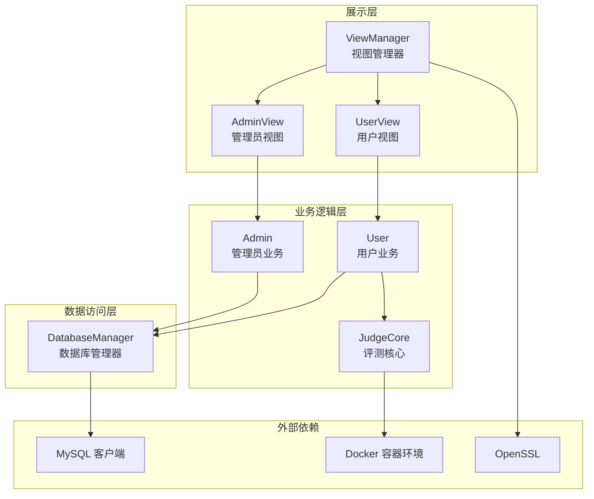
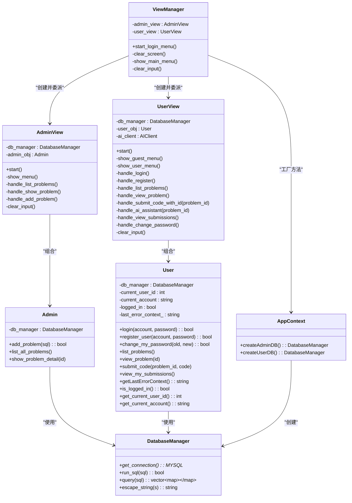
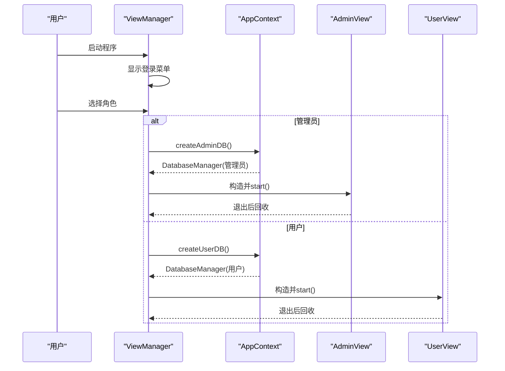
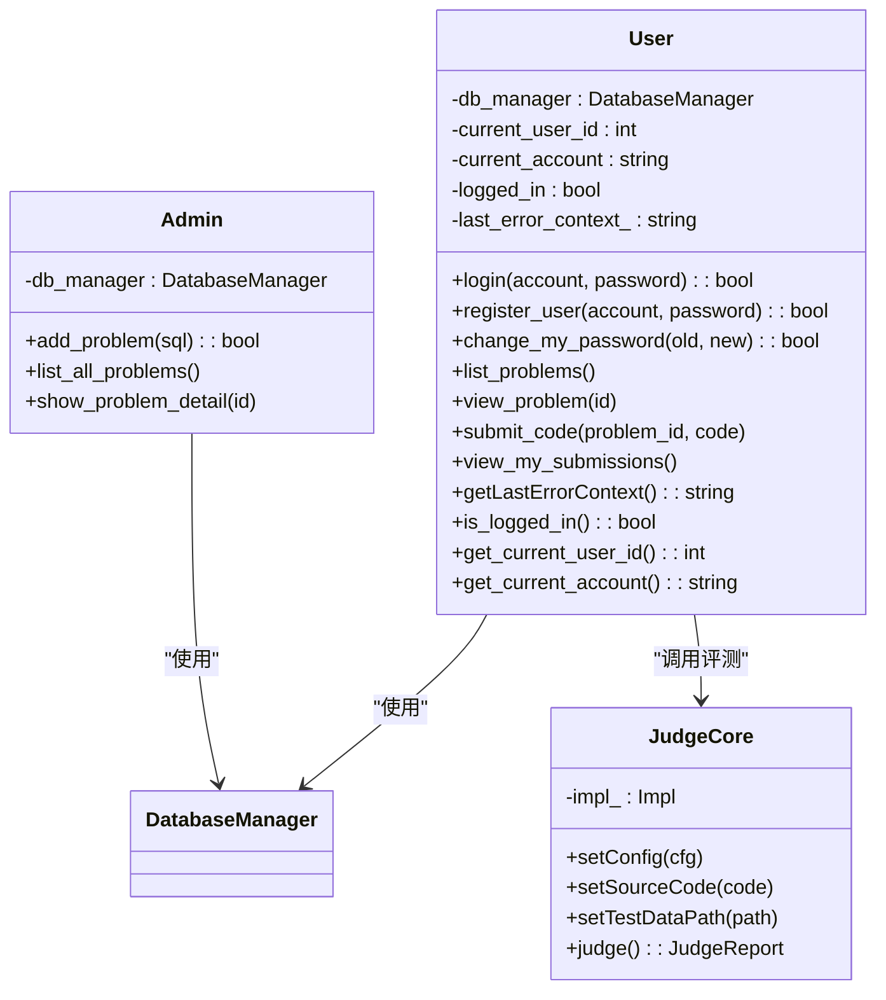
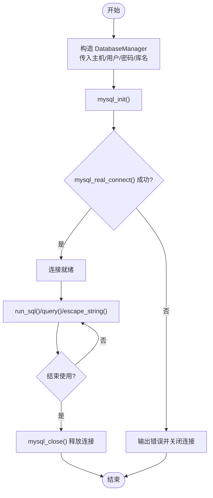
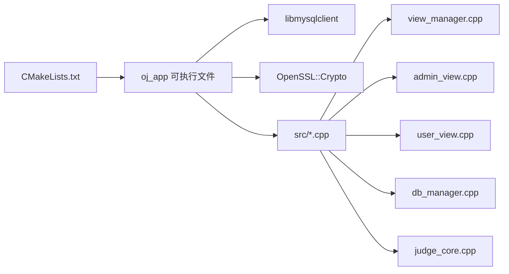

# 系统架构设计

<cite>
**本文引用的文件**
- [CMakeLists.txt](file://CMakeLists.txt)
- [main.cpp](file://src/main.cpp)
- [view_manager.h](file://include/view_manager.h)
- [view_manager.cpp](file://src/view_manager.cpp)
- [app_context.h](file://include/app_context.h)
- [app_context.cpp](file://src/app_context.cpp)
- [db_manager.h](file://include/db_manager.h)
- [db_manager.cpp](file://src/db_manager.cpp)
- [admin_view.h](file://include/admin_view.h)
- [admin_view.cpp](file://src/admin_view.cpp)
- [user_view.h](file://include/user_view.h)
- [user_view.cpp](file://src/user_view.cpp)
- [admin.h](file://include/admin.h)
- [user.h](file://include/user.h)
- [judge_core.h](file://include/judge_core.h)
</cite>

## 目录
1. [引言](#引言)
2. [项目结构](#项目结构)
3. [核心组件](#核心组件)
4. [架构总览](#架构总览)
5. [详细组件分析](#详细组件分析)
6. [依赖分析](#依赖分析)
7. [性能考虑](#性能考虑)
8. [故障排查指南](#故障排查指南)
9. [结论](#结论)
10. [附录](#附录)

## 引言
本文件为在线判题系统（OJ）的架构设计文档，面向技术与非技术读者，系统性阐述系统的整体架构模式、分层设计、模块化组织与组件交互关系。重点覆盖视图管理层、业务逻辑层、数据访问层的职责划分与协作机制；解析核心设计模式（如PIMPL、工厂方法、观察者思想的体现）；说明扩展性、可维护性与性能优化策略；给出系统边界、集成接口与第三方依赖管理。

## 项目结构
系统采用分层+模块化的组织方式：
- 展示层：命令行界面（CLI），通过视图管理器协调管理员与用户两种角色的交互。
- 业务逻辑层：管理员与用户两类业务对象，封装各自的操作流程与规则。
- 数据访问层：统一的数据库管理器封装MySQL连接、查询与转义，提供稳定的访问接口。
- 评测核心：基于容器沙箱的评测能力，采用PIMPL隐藏实现细节。
- 构建与依赖：CMake统一构建，链接MySQL与OpenSSL。

图表来源
- [view_manager.h:10-31](file://include/view_manager.h#L10-L31)
- [admin_view.h:10-40](file://include/admin_view.h#L10-L40)
- [user_view.h:10-65](file://include/user_view.h#L10-L65)
- [admin.h:9-29](file://include/admin.h#L9-L29)
- [user.h:10-77](file://include/user.h#L10-L77)
- [judge_core.h:60-101](file://include/judge_core.h#L60-L101)
- [db_manager.h:11-46](file://include/db_manager.h#L11-L46)
- [CMakeLists.txt:11-34](file://CMakeLists.txt#L11-L34)

章节来源
- [CMakeLists.txt:1-40](file://CMakeLists.txt#L1-L40)
- [main.cpp:1-14](file://src/main.cpp#L1-L14)
- [view_manager.h:1-34](file://include/view_manager.h#L1-L34)
- [view_manager.cpp:1-78](file://src/view_manager.cpp#L1-L78)
- [app_context.h:1-35](file://include/app_context.h#L1-L35)
- [app_context.cpp:1-16](file://src/app_context.cpp#L1-L16)
- [db_manager.h:1-51](file://include/db_manager.h#L1-L51)
- [db_manager.cpp:1-108](file://src/db_manager.cpp#L1-L108)
- [admin_view.h:1-43](file://include/admin_view.h#L1-L43)
- [admin_view.cpp:1-138](file://src/admin_view.cpp#L1-L138)
- [user_view.h:1-68](file://include/user_view.h#L1-L68)
- [user_view.cpp:1-385](file://src/user_view.cpp#L1-L385)
- [admin.h:1-32](file://include/admin.h#L1-L32)
- [user.h:1-80](file://include/user.h#L1-L80)
- [judge_core.h:1-104](file://include/judge_core.h#L1-L104)

## 核心组件
- 视图管理器（ViewManager）：作为CLI主控制器，负责登录菜单与角色切换，注入数据库连接并委派到对应视图。
- 管理员视图（AdminView）：提供管理员功能入口，封装题目列表、详情与发布等操作。
- 用户视图（UserView）：提供游客/登录态菜单，支持登录、注册、题目浏览、提交、查看提交记录、修改密码，并集成AI助手。
- 应用上下文（AppContext）：工厂方法提供不同权限的数据库连接（管理员/普通用户）。
- 数据库管理器（DatabaseManager）：封装MySQL连接、查询、转义与资源释放。
- 管理员业务（Admin）、用户业务（User）：封装各自业务逻辑，依赖数据库管理器。
- 评测核心（JudgeCore）：评测引擎，采用PIMPL隐藏实现，提供配置与评测接口，结合容器沙箱执行代码。

章节来源
- [view_manager.h:10-31](file://include/view_manager.h#L10-L31)
- [admin_view.h:10-40](file://include/admin_view.h#L10-L40)
- [user_view.h:10-65](file://include/user_view.h#L10-L65)
- [app_context.h:15-32](file://include/app_context.h#L15-L32)
- [db_manager.h:11-46](file://include/db_manager.h#L11-L46)
- [admin.h:9-29](file://include/admin.h#L9-L29)
- [user.h:10-77](file://include/user.h#L10-L77)
- [judge_core.h:60-101](file://include/judge_core.h#L60-L101)

## 架构总览
系统采用经典的三层架构：
- 表现层：命令行界面，负责用户交互与流程控制。
- 业务层：管理员与用户两类业务对象，封装领域逻辑。
- 数据层：统一的数据库管理器，屏蔽底层MySQL细节。

同时引入应用上下文作为工厂方法，集中管理数据库连接的创建与配置，避免视图层直接耦合数据库细节。

图表来源
- [view_manager.h:10-31](file://include/view_manager.h#L10-L31)
- [admin_view.h:10-40](file://include/admin_view.h#L10-L40)
- [user_view.h:10-65](file://include/user_view.h#L10-L65)
- [app_context.h:15-32](file://include/app_context.h#L15-L32)
- [db_manager.h:11-46](file://include/db_manager.h#L11-L46)
- [admin.h:9-29](file://include/admin.h#L9-L29)
- [user.h:10-77](file://include/user.h#L10-L77)

## 详细组件分析

### 视图管理层
- 职责：统一入口、菜单驱动、角色切换、输入清理与清屏。
- 控制流：启动登录菜单 → 选择角色 → 注入数据库连接 → 进入对应视图循环 → 退出回收资源。
- 设计要点：使用智能指针管理视图生命周期；通过AppContext集中创建数据库连接；提供清晰的输入校验与异常分支。

图表来源
- [view_manager.cpp:33-71](file://src/view_manager.cpp#L33-L71)
- [app_context.cpp:5-15](file://src/app_context.cpp#L5-L15)
- [admin_view.cpp:22-76](file://src/admin_view.cpp#L22-L76)
- [user_view.cpp:39-134](file://src/user_view.cpp#L39-L134)

章节来源
- [view_manager.h:10-31](file://include/view_manager.h#L10-L31)
- [view_manager.cpp:1-78](file://src/view_manager.cpp#L1-L78)
- [app_context.h:15-32](file://include/app_context.h#L15-L32)
- [app_context.cpp:1-16](file://src/app_context.cpp#L1-L16)

### 业务逻辑层
- 管理员业务（Admin）：封装题目发布、列表与详情查询，直接依赖DatabaseManager。
- 用户业务（User）：封装登录、注册、改密、题目浏览、提交、查看提交记录；提供评测错误上下文供AI分析；暴露当前登录状态与用户信息。
- 评测核心（JudgeCore）：评测配置、源码设置、测试数据路径设置与评测执行；采用PIMPL隐藏实现细节，禁止拷贝与赋值。

图表来源
- [admin.h:9-29](file://include/admin.h#L9-L29)
- [user.h:10-77](file://include/user.h#L10-L77)
- [judge_core.h:60-101](file://include/judge_core.h#L60-L101)
- [db_manager.h:11-46](file://include/db_manager.h#L11-L46)

章节来源
- [admin.h:1-32](file://include/admin.h#L1-L32)
- [user.h:1-80](file://include/user.h#L1-L80)
- [judge_core.h:1-104](file://include/judge_core.h#L1-L104)

### 数据访问层
- DatabaseManager：封装MySQL连接初始化、查询执行、结果集处理、字符串转义与资源释放；对外提供简洁接口，屏蔽底层细节。
- AppContext：工厂方法集中创建不同权限的DatabaseManager实例，便于后续扩展与配置管理。

图表来源
- [db_manager.cpp:89-107](file://src/db_manager.cpp#L89-L107)
- [db_manager.cpp:9-20](file://src/db_manager.cpp#L9-L20)
- [db_manager.cpp:22-84](file://src/db_manager.cpp#L22-L84)

章节来源
- [db_manager.h:1-51](file://include/db_manager.h#L1-L51)
- [db_manager.cpp:1-108](file://src/db_manager.cpp#L1-L108)
- [app_context.h:15-32](file://include/app_context.h#L15-L32)
- [app_context.cpp:1-16](file://src/app_context.cpp#L1-L16)

### 核心设计模式
- PIMPL（Pointers to IMplementation）：评测核心（JudgeCore）通过私有Impl指针隐藏实现细节，提升编译期隔离与ABI稳定性。
- 工厂方法（AppContext.createAdminDB/createUserDB）：集中创建不同权限的数据库连接，降低视图层耦合度，便于未来扩展其他连接类型。
- 观察者思想（事件驱动的菜单循环）：视图层通过循环与switch响应用户输入，类似观察者模式中的“事件回调”，将UI与业务解耦。

章节来源
- [judge_core.h:94-101](file://include/judge_core.h#L94-L101)
- [app_context.h:22-28](file://include/app_context.h#L22-L28)
- [view_manager.cpp:33-71](file://src/view_manager.cpp#L33-L71)

## 依赖分析
- 构建与编译：CMake要求C++17，启用编译命令导出，查找MySQL与OpenSSL，收集src目录下所有源文件并链接。
- 运行时依赖：MySQL客户端库、OpenSSL加密库；评测环节依赖Docker容器环境（容器池与沙箱组件在头文件中声明，实际实现位于独立目录）。
- 模块间依赖：视图层依赖业务层；业务层依赖数据访问层；评测核心依赖容器沙箱；应用上下文为视图层提供数据库连接。

图表来源
- [CMakeLists.txt:11-34](file://CMakeLists.txt#L11-L34)
- [main.cpp:1-14](file://src/main.cpp#L1-L14)

章节来源
- [CMakeLists.txt:1-40](file://CMakeLists.txt#L1-L40)
- [main.cpp:1-14](file://src/main.cpp#L1-L14)

## 性能考虑
- I/O与网络：数据库查询与AI交互可能成为瓶颈，建议：
  - 使用连接池（当前通过AppContext集中创建，可扩展为池化）。
  - 对频繁查询结果进行缓存（如题目列表、用户状态）。
- 评测性能：评测核心涉及磁盘IO与容器启动，建议：
  - 复用容器与测试数据缓存，减少重复初始化。
  - 限制并发评测队列，避免资源争用。
- UI交互：命令行输入/输出频繁，建议：
  - 批量输出与清屏优化，减少闪烁与延迟。
  - 输入校验前置，降低无效交互次数。

## 故障排查指南
- 数据库连接失败
  - 检查AppContext中主机、用户名、密码与库名配置是否正确。
  - 确认MySQL服务运行与网络可达。
- 查询异常
  - 使用DatabaseManager.escape_string对用户输入进行转义。
  - 捕获并记录mysql_error输出，定位SQL语法或权限问题。
- 评测失败
  - 检查容器沙箱与测试数据路径是否存在。
  - 关注评测报告中的错误类别（编译错误、运行时错误、超时/超内存等）。
- 视图层输入异常
  - 使用ViewManager/UserView的输入清理函数，避免缓冲区污染导致的死循环。

章节来源
- [app_context.cpp:5-15](file://src/app_context.cpp#L5-L15)
- [db_manager.cpp:22-43](file://src/db_manager.cpp#L22-L43)
- [db_manager.cpp:60-84](file://src/db_manager.cpp#L60-L84)
- [user_view.cpp:380-384](file://src/user_view.cpp#L380-L384)

## 结论
本系统采用清晰的三层架构与模块化设计，通过视图管理器统一入口、业务对象封装领域逻辑、数据库管理器屏蔽底层细节，实现了良好的可维护性与扩展性。工厂方法与PIMPL等设计模式提升了模块解耦与接口稳定性。未来可在连接池、评测缓存与容器复用等方面进一步优化性能，并完善日志与监控体系以增强可观测性。

## 附录
- 系统边界
  - 内部：CLI视图、业务对象、数据库管理器、评测核心。
  - 外部：MySQL数据库、OpenSSL、Docker容器环境。
- 集成接口
  - 数据库接口：DatabaseManager提供连接、查询、转义与结果集处理。
  - 评测接口：JudgeCore提供配置与评测主入口。
  - 角色接入：AppContext提供管理员与用户两种数据库连接工厂。
- 第三方依赖管理
  - CMake统一查找与链接MySQL与OpenSSL；可通过包管理器或系统库安装。