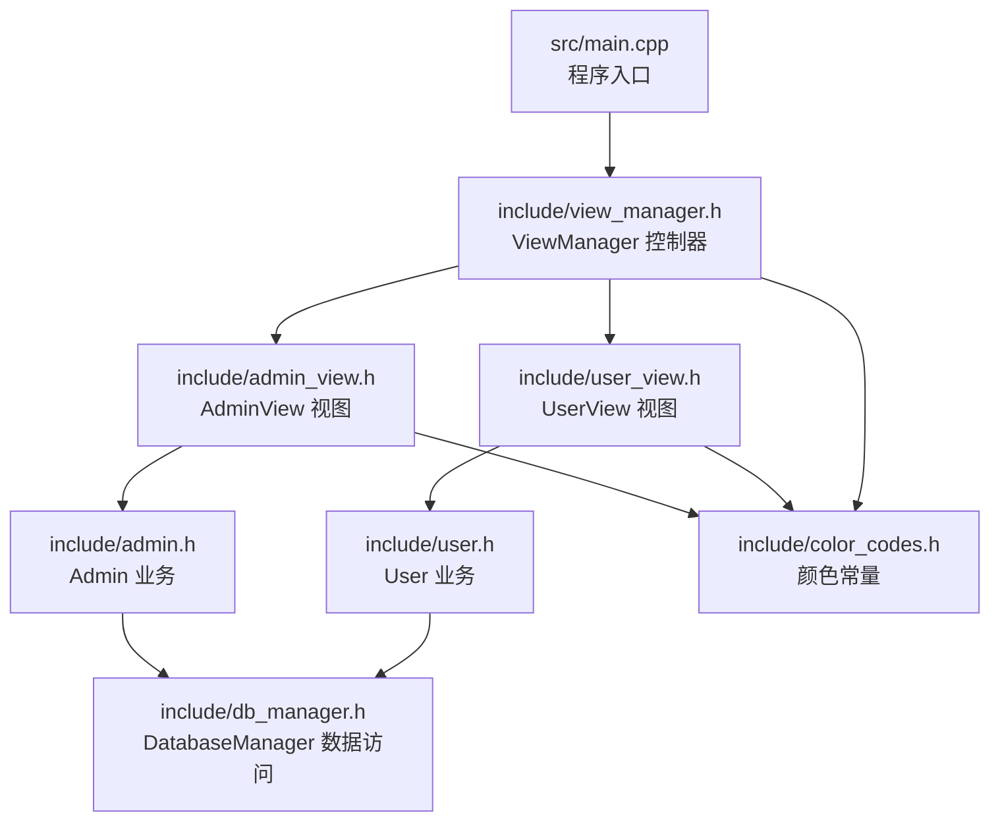
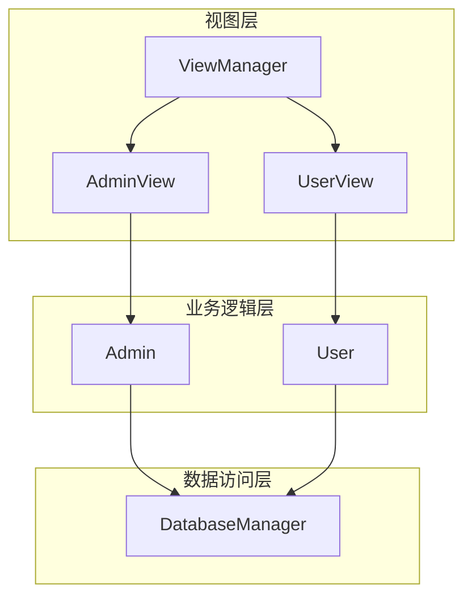
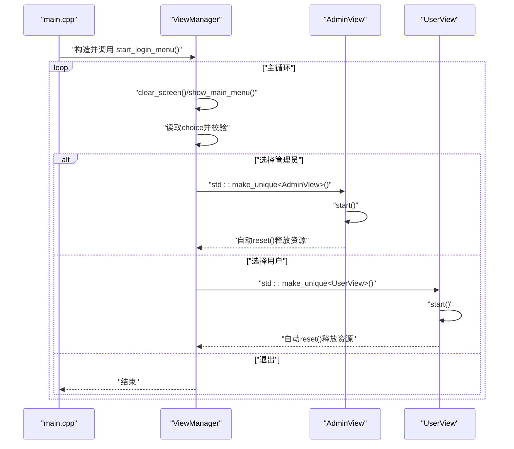
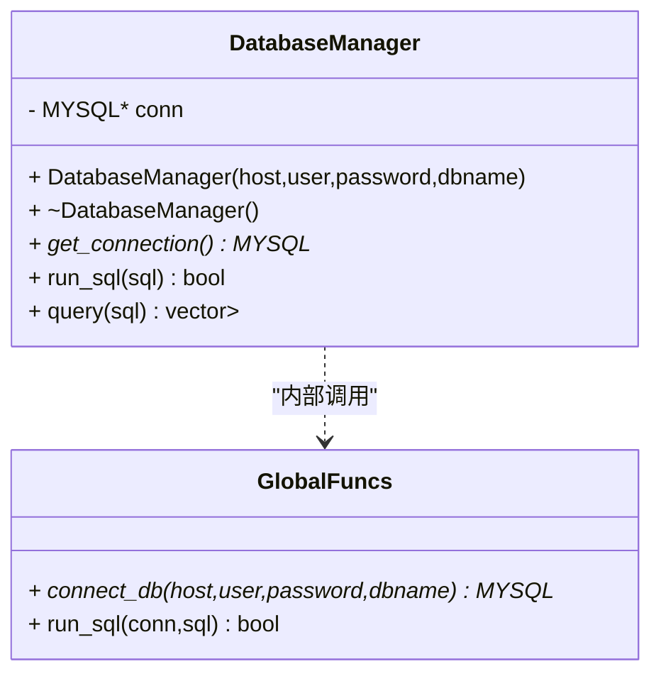
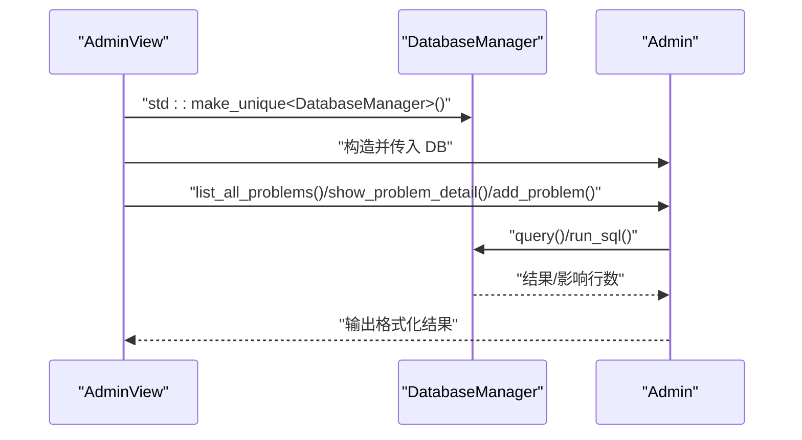
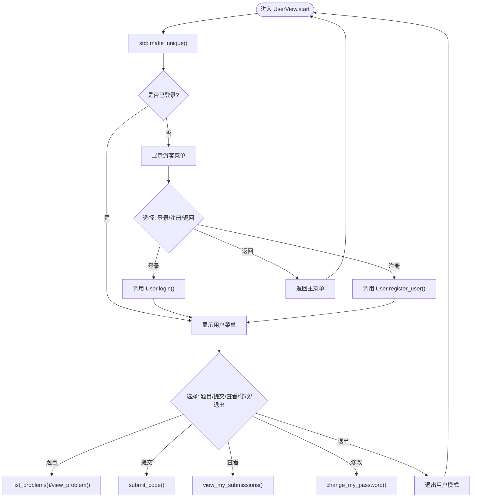
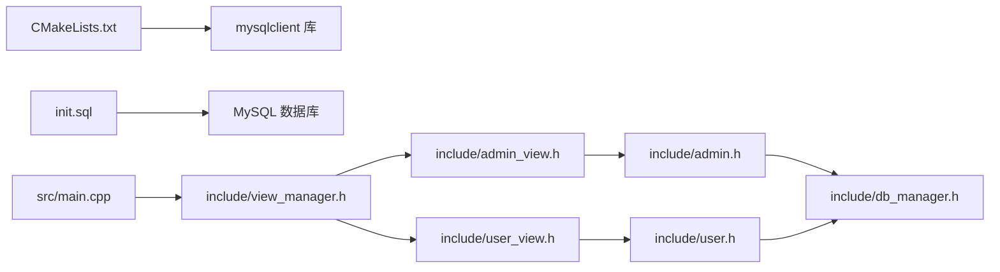

# 系统架构设计

<cite>
**本文档引用的文件**
- [README.md](file://README.md)
- [CMakeLists.txt](file://CMakeLists.txt)
- [init.sql](file://init.sql)
- [src/main.cpp](file://src/main.cpp)
- [include/view_manager.h](file://include/view_manager.h)
- [src/view_manager.cpp](file://src/view_manager.cpp)
- [include/admin_view.h](file://include/admin_view.h)
- [src/admin_view.cpp](file://src/admin_view.cpp)
- [include/user_view.h](file://include/user_view.h)
- [src/user_view.cpp](file://src/user_view.cpp)
- [include/db_manager.h](file://include/db_manager.h)
- [src/db_manager.cpp](file://src/db_manager.cpp)
- [include/admin.h](file://include/admin.h)
- [src/admin.cpp](file://src/admin.cpp)
- [include/user.h](file://include/user.h)
- [src/user.cpp](file://src/user.cpp)
- [include/color_codes.h](file://include/color_codes.h)
</cite>

## 更新摘要
**变更内容**
- 重构了数据库访问层，从直接MySQL操作转向面向对象的DatabaseManager类封装
- 引入了ViewManager作为统一的程序入口控制器，替代之前的直接操作模式
- 新增了AdminView和UserView类，实现了更清晰的视图层分离
- 采用智能指针管理资源，增强了内存安全性和自动资源回收
- 改进了错误处理机制，提供了更好的用户体验

## 目录
1. [简介](#简介)
2. [项目结构](#项目结构)
3. [核心组件](#核心组件)
4. [架构总览](#架构总览)
5. [详细组件分析](#详细组件分析)
6. [依赖分析](#依赖分析)
7. [性能考虑](#性能考虑)
8. [故障排查指南](#故障排查指南)
9. [结论](#结论)
10. [附录](#附录)

## 简介
本文件为在线判题（OJ）系统的架构设计文档，面向开发者与技术评审人员。系统采用命令行界面与分层架构组织，遵循"视图-业务-数据访问"三层分离的设计原则。经过重大架构更新，系统现在采用面向对象的视图管理器模式，通过DatabaseManager类统一封装数据库访问操作，实现了更好的代码组织、资源管理和可维护性。

## 项目结构
项目采用按职责分层的组织方式，经过重构后结构更加清晰：
- include：对外公开的头文件，定义接口与类声明
- src：实现文件，包含各层的具体实现
- CMakeLists.txt：构建配置，链接 MySQL 客户端库
- init.sql：数据库初始化脚本，定义表结构与权限配置
- README.md：项目简述

**图表来源**
- [src/main.cpp:1-14](file://src/main.cpp#L1-L14)
- [include/view_manager.h:11-43](file://include/view_manager.h#L11-L43)
- [include/admin_view.h:11-58](file://include/admin_view.h#L11-L58)
- [include/user_view.h:11-90](file://include/user_view.h#L11-L90)
- [include/admin.h:10-40](file://include/admin.h#L10-L40)
- [include/user.h:10-89](file://include/user.h#L10-L89)
- [include/db_manager.h:12-53](file://include/db_manager.h#L12-L53)
- [include/color_codes.h:5-18](file://include/color_codes.h#L5-L18)

**章节来源**
- [CMakeLists.txt:1-40](file://CMakeLists.txt#L1-L40)
- [README.md:1-2](file://README.md#L1-L2)

## 核心组件
经过架构重构后，系统的核心组件包括：

- **ViewManager**：命令行界面主控制器，负责登录菜单与角色选择，采用智能指针管理AdminView和UserView实例，确保资源自动释放
- **AdminView**：管理员视图，负责展示管理员菜单、接收用户输入并调用Admin业务逻辑；在进入时以管理员账号建立DatabaseManager连接
- **UserView**：用户视图，负责游客态与登录态菜单切换、用户输入处理与User业务交互；在进入时以受限账号建立DatabaseManager连接
- **Admin**：管理员业务逻辑，封装题目增删改查等操作，委托DatabaseManager执行SQL
- **User**：用户业务逻辑，封装登录、注册、密码修改、题目浏览、提交代码、查看提交记录等流程，当前多数功能为占位实现
- **DatabaseManager**：全新的数据访问层，封装MySQL连接、SQL执行、查询结果映射、批量执行SQL文件等功能，提供面向对象的数据库操作接口

**章节来源**
- [include/view_manager.h:11-43](file://include/view_manager.h#L11-L43)
- [src/view_manager.cpp:10-77](file://src/view_manager.cpp#L10-L77)
- [include/admin_view.h:11-58](file://include/admin_view.h#L11-L58)
- [src/admin_view.cpp:10-138](file://src/admin_view.cpp#L10-L138)
- [include/user_view.h:11-90](file://include/user_view.h#L11-L90)
- [src/user_view.cpp:10-324](file://src/user_view.cpp#L10-L324)
- [include/admin.h:10-40](file://include/admin.h#L10-L40)
- [src/admin.cpp:10-59](file://src/admin.cpp#L10-L59)
- [include/user.h:10-89](file://include/user.h#L10-L89)
- [src/user.cpp:11-223](file://src/user.cpp#L11-L223)
- [include/db_manager.h:12-53](file://include/db_manager.h#L12-L53)
- [src/db_manager.cpp:8-100](file://src/db_manager.cpp#L8-L100)

## 架构总览
系统采用经典的 MVC 思想在命令行层面落地，经过重构后架构更加清晰：
- **视图层**：ViewManager、AdminView、UserView 负责用户交互与菜单展示
- **业务逻辑层**：Admin、User 负责业务规则与流程编排
- **数据访问层**：DatabaseManager 负责数据库连接与 SQL 执行

**图表来源**
- [include/view_manager.h:11-43](file://include/view_manager.h#L11-L43)
- [include/admin_view.h:11-58](file://include/admin_view.h#L11-L58)
- [include/user_view.h:11-90](file://include/user_view.h#L11-L90)
- [include/admin.h:10-40](file://include/admin.h#L10-L40)
- [include/user.h:10-89](file://include/user.h#L10-L89)
- [include/db_manager.h:12-53](file://include/db_manager.h#L12-L53)

## 详细组件分析

### ViewManager 控制器
**更新** 重构为统一的程序入口控制器，采用智能指针管理子视图实例

- **职责**：启动登录菜单，根据用户选择进入管理员或用户视图；负责清屏、输入清理等通用 UI 行为；使用std::unique_ptr自动管理资源
- **关键流程**：循环显示主菜单 → 读取用户输入 → 分派到AdminView或UserView → 退出时自动释放资源
- **错误处理**：输入非整数时清理缓冲区并提示；默认分支提示无效选项
- **资源管理**：使用智能指针确保View实例的自动销毁，避免内存泄漏

**图表来源**
- [src/main.cpp:5-13](file://src/main.cpp#L5-L13)
- [src/view_manager.cpp:32-77](file://src/view_manager.cpp#L32-L77)
- [src/admin_view.cpp:21-77](file://src/admin_view.cpp#L21-L77)
- [src/user_view.cpp:21-115](file://src/user_view.cpp#L21-L115)

**章节来源**
- [include/view_manager.h:11-43](file://include/view_manager.h#L11-L43)
- [src/view_manager.cpp:10-77](file://src/view_manager.cpp#L10-L77)
- [src/main.cpp:1-14](file://src/main.cpp#L1-L14)

### DatabaseManager 数据访问层
**更新** 全新的面向对象数据库访问层，替代之前的直接MySQL操作

- **职责**：封装MySQL连接生命周期、SQL执行、查询结果集映射、从文件批量执行SQL
- **关键能力**：构造函数自动连接数据库、析构函数自动关闭连接、提供run_sql和query方法、支持批量SQL文件执行
- **设计要点**：对外暴露MYSQL*句柄便于兼容性；提供便捷的查询与执行接口；对异常进行日志输出；支持智能指针管理
- **安全性**：自动资源管理，防止连接泄漏；提供错误处理和日志输出

**图表来源**
- [include/db_manager.h:12-53](file://include/db_manager.h#L12-L53)
- [src/db_manager.cpp:8-100](file://src/db_manager.cpp#L8-L100)

**章节来源**
- [include/db_manager.h:12-53](file://include/db_manager.h#L12-L53)
- [src/db_manager.cpp:8-100](file://src/db_manager.cpp#L8-L100)

### AdminView 与 Admin 业务
**更新** 采用DatabaseManager实例而非直接MySQL操作

- **AdminView**：负责管理员菜单展示与输入处理；在进入时以管理员账号建立DatabaseManager连接；调用Admin的业务方法
- **Admin**：封装管理员特有操作，如列出题目、查看题目详情、发布题目（通过DatabaseManager执行SQL）

**图表来源**
- [src/admin_view.cpp:21-77](file://src/admin_view.cpp#L21-L77)
- [src/admin.cpp:12-59](file://src/admin.cpp#L12-L59)
- [src/db_manager.cpp:21-57](file://src/db_manager.cpp#L21-L57)

**章节来源**
- [include/admin_view.h:11-58](file://include/admin_view.h#L11-L58)
- [src/admin_view.cpp:10-138](file://src/admin_view.cpp#L10-L138)
- [include/admin.h:10-40](file://include/admin.h#L10-L40)
- [src/admin.cpp:10-59](file://src/admin.cpp#L10-L59)

### UserView 与 User 业务
**更新** 采用DatabaseManager实例，改进了登录状态管理

- **UserView**：区分游客态与登录态菜单；处理登录、注册、查看题目、提交代码、查看提交记录、修改密码等
- **User**：封装用户登录态维护与业务操作；当前多数功能为占位实现，使用SHA256进行密码哈希

**图表来源**
- [src/user_view.cpp:21-115](file://src/user_view.cpp#L21-L115)
- [src/user.cpp:39-223](file://src/user.cpp#L39-L223)

**章节来源**
- [include/user_view.h:11-90](file://include/user_view.h#L11-L90)
- [src/user_view.cpp:10-324](file://src/user_view.cpp#L10-L324)
- [include/user.h:10-89](file://include/user.h#L10-L89)
- [src/user.cpp:11-223](file://src/user.cpp#L11-L223)

### 颜色与终端输出
- **color_codes.h** 提供 ANSI 颜色常量，用于增强命令行界面的可读性与用户体验

**章节来源**
- [include/color_codes.h:5-18](file://include/color_codes.h#L5-L18)

## 依赖分析
**更新** 重构后的依赖关系更加清晰和模块化

- **构建与外部依赖**：CMake 通过 pkg-config 查找 mysqlclient 并链接；导出 compile_commands.json 便于工具链使用
- **运行时依赖**：系统需具备 MySQL 客户端库；init.sql 脚本用于初始化数据库、权限与示例数据
- **模块耦合**：视图层仅依赖业务层接口；业务层仅依赖数据访问层接口；数据访问层依赖 MySQL 客户端库
- **资源管理**：所有视图类使用std::unique_ptr管理DatabaseManager和业务对象实例

**图表来源**
- [CMakeLists.txt:11-34](file://CMakeLists.txt#L11-L34)
- [init.sql:8-143](file://init.sql#L8-L143)
- [src/main.cpp:1-14](file://src/main.cpp#L1-L14)
- [include/view_manager.h:4-6](file://include/view_manager.h#L4-L6)
- [include/admin_view.h:4-6](file://include/admin_view.h#L4-L6)
- [include/user_view.h:4-6](file://include/user_view.h#L4-L6)
- [include/admin.h:4](file://include/admin.h#L4)
- [include/user.h:4](file://include/user.h#L4)
- [include/db_manager.h:4](file://include/db_manager.h#L4)

**章节来源**
- [CMakeLists.txt:1-40](file://CMakeLists.txt#L1-L40)
- [init.sql:1-143](file://init.sql#L1-L143)

## 性能考虑
**更新** 新增了资源管理和智能指针使用的性能考量

- **连接管理**：DatabaseManager在析构时主动关闭连接，避免资源泄漏；建议在高频操作场景下考虑连接池以减少频繁握手开销
- **内存管理**：使用std::unique_ptr自动管理视图和业务对象实例，减少内存泄漏风险
- **查询优化**：查询结果集映射为键值对列表，适合小规模数据展示；对于大结果集应考虑分页或流式处理
- **I/O 优化**：批量执行 SQL 文件时按分号切分语句，不支持引号内分号；建议在生产环境使用更健壮的 SQL 解析器
- **权限与隔离**：通过数据库用户权限与应用层行级过滤实现数据隔离，降低跨用户数据泄露风险

## 故障排查指南
**更新** 新增了DatabaseManager和智能指针相关的故障排查

- **数据库连接失败**
  - 现象：管理员或用户视图提示连接失败
  - 排查：确认init.sql已正确初始化数据库与用户权限；核对主机、用户名、密码与数据库名配置；检查DatabaseManager构造函数的参数传递
- **智能指针相关问题**
  - 现象：资源未正确释放或重复释放
  - 排查：确认使用std::unique_ptr的正确生命周期管理；检查reset()调用时机
- **输入异常**
  - 现象：输入非数字导致菜单异常
  - 排查：ViewManager与各视图均实现了输入缓冲区清理逻辑，确保再次输入有效
- **SQL执行失败**
  - 现象：执行 SQL 或查询失败并输出错误信息
  - 排查：检查 SQL 语法与目标表是否存在；确认数据库用户权限是否满足操作需求；验证DatabaseManager的run_sql和query方法
- **权限不足**
  - 现象：受限账号无法写入或修改用户信息
  - 排查：参考init.sql中对oj_user的授权范围，确认业务逻辑是否符合行级隔离策略

**章节来源**
- [src/admin_view.cpp:71-76](file://src/admin_view.cpp#L71-L76)
- [src/user_view.cpp:110-115](file://src/user_view.cpp#L110-L115)
- [src/db_manager.cpp:81-99](file://src/db_manager.cpp#L81-L99)
- [init.sql:70-93](file://init.sql#L70-L93)

## 结论
经过重大架构更新，该 OJ 系统以更加清晰的分层架构实现了命令行交互、业务编排与数据访问的解耦。新的ViewManager作为统一入口控制器协调管理员与用户视图，DatabaseManager提供统一的数据访问抽象，所有组件都采用了智能指针进行资源管理。这种面向对象的设计模式显著提升了代码的可维护性、可扩展性和安全性。未来可在连接池、SQL 解析器、权限模型与业务功能实现上进一步完善，以支撑更大规模的评测场景。

## 附录
- **系统边界**
  - 内部：命令行界面、业务逻辑、数据访问层
  - 外部：MySQL 数据库、操作系统终端
- **集成模式**
  - 构建期：CMake 通过 pkg-config 自动发现 mysqlclient
  - 运行期：init.sql 初始化数据库与权限；程序启动后按角色建立连接
- **扩展点**
  - 业务层：User 的多数方法为占位实现，可逐步接入真实数据库操作
  - 数据访问层：可引入连接池、SQL 解析器、事务封装与结果集缓存
  - 视图层：可增加更多菜单项与交互细节，提升用户体验
- **架构优势**
  - 资源管理自动化：智能指针确保内存安全
  - 接口清晰：DatabaseManager提供统一的数据访问接口
  - 可测试性强：面向对象设计便于单元测试
  - 可扩展性好：新增功能不影响现有架构