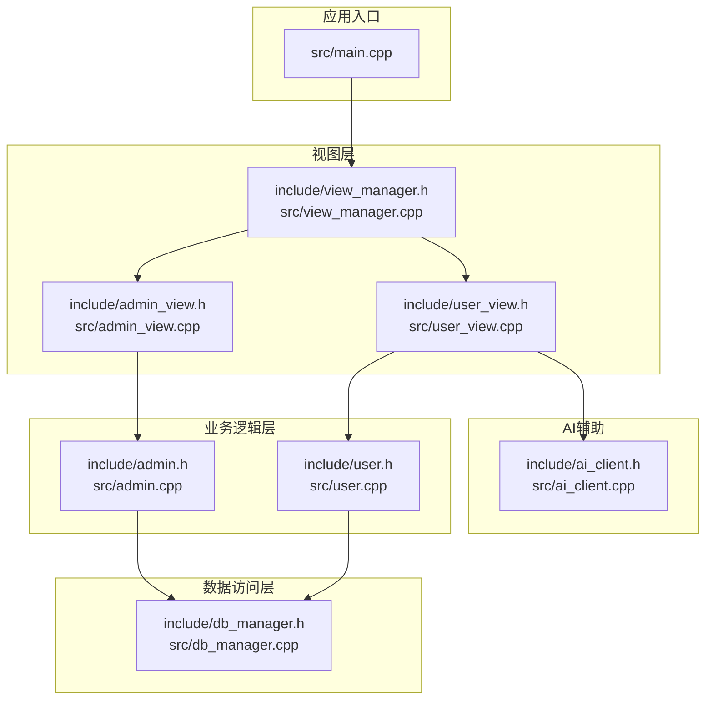
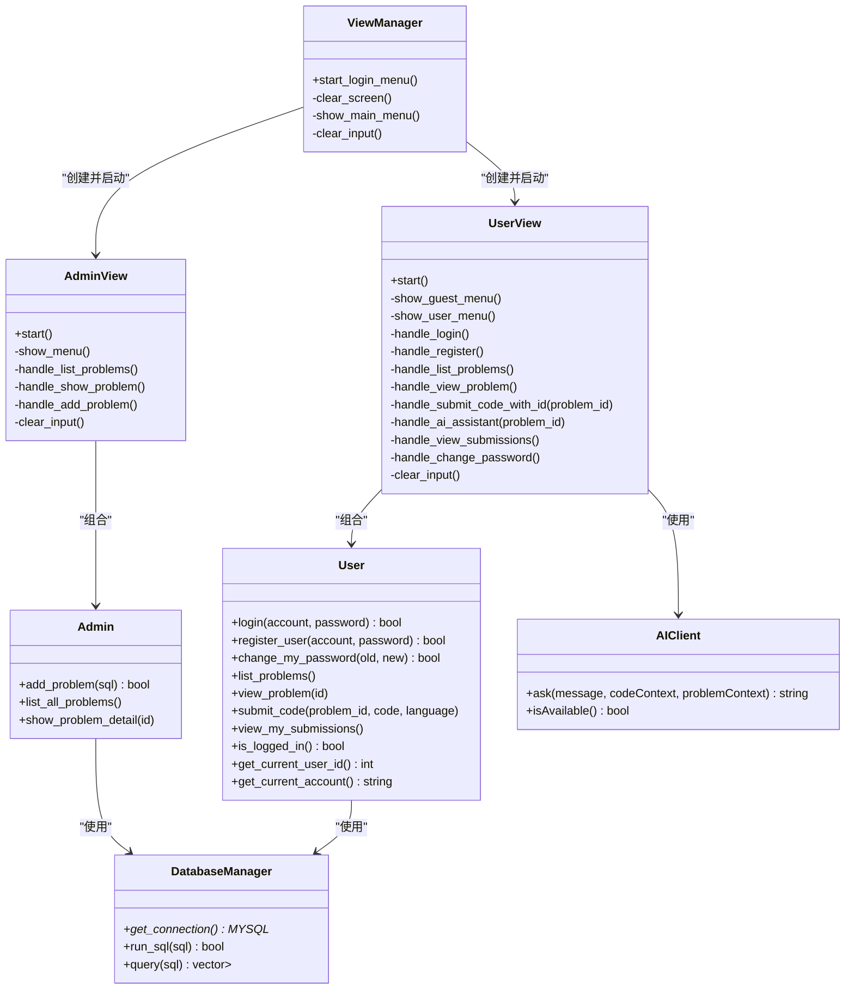
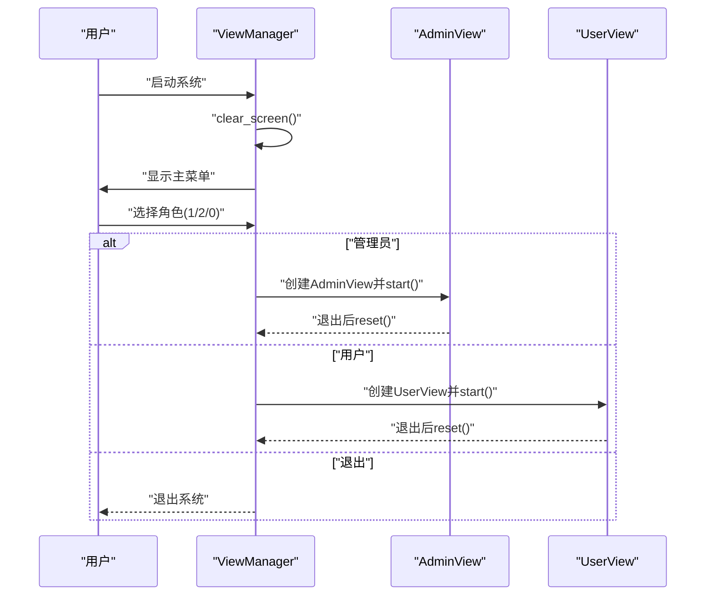
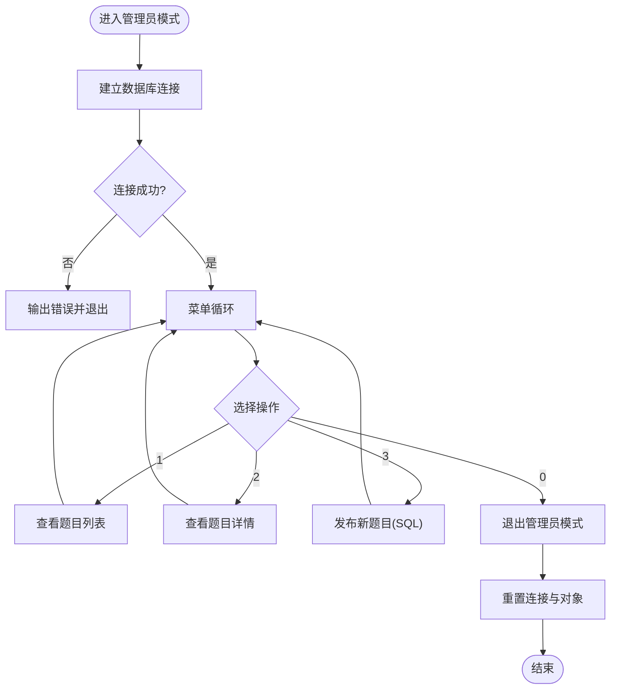
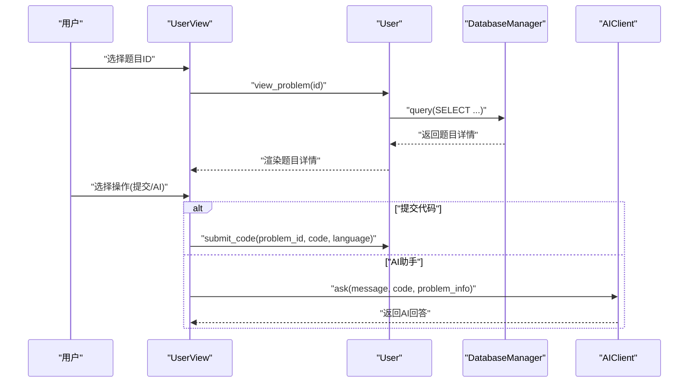
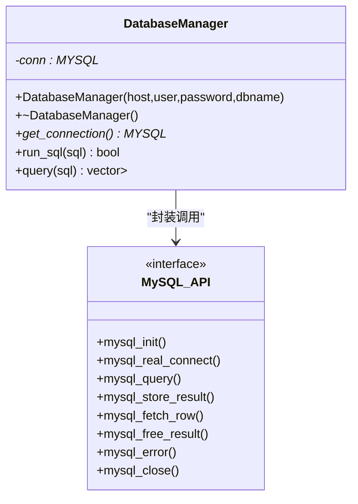
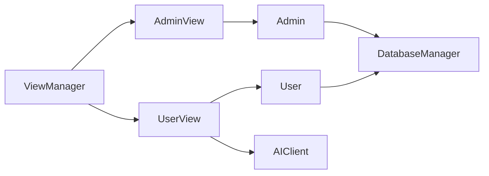

# 系统架构设计

<cite>
**本文档引用的文件**
- [README.md](file://README.md)
- [main.cpp](file://src/main.cpp)
- [view_manager.h](file://include/view_manager.h)
- [view_manager.cpp](file://src/view_manager.cpp)
- [admin_view.h](file://include/admin_view.h)
- [admin_view.cpp](file://src/admin_view.cpp)
- [user_view.h](file://include/user_view.h)
- [user_view.cpp](file://src/user_view.cpp)
- [admin.h](file://include/admin.h)
- [admin.cpp](file://src/admin.cpp)
- [user.h](file://include/user.h)
- [user.cpp](file://src/user.cpp)
- [db_manager.h](file://include/db_manager.h)
- [db_manager.cpp](file://src/db_manager.cpp)
- [ai_client.h](file://include/ai_client.h)
- [ai_client.cpp](file://src/ai_client.cpp)
</cite>

## 目录
1. [引言](#引言)
2. [项目结构](#项目结构)
3. [核心组件](#核心组件)
4. [架构总览](#架构总览)
5. [详细组件分析](#详细组件分析)
6. [依赖分析](#依赖分析)
7. [性能考虑](#性能考虑)
8. [故障排查指南](#故障排查指南)
9. [结论](#结论)
10. [附录](#附录)

## 引言
本系统为命令行在线判题(OJ)评测核心，采用经典的MVC架构思想在代码层面进行职责分离：视图层(View)负责用户交互与菜单展示；业务逻辑层(Controller)负责流程控制与角色切换；数据访问层(Model)负责数据库连接与查询。系统通过ViewManager作为主控制器，协调管理员与用户两种角色的界面切换与业务流程，同时引入AI客户端模块提供智能辅助能力。

## 项目结构
项目采用分层+模块化的组织方式：
- include目录：对外公开的头文件，定义接口与抽象类型
- src目录：各模块的具体实现
- ai目录：AI服务相关脚本与依赖
- docs目录：设计文档与实现计划
- 根目录：构建脚本、初始化SQL与说明文档

图表来源
- [main.cpp:1-14](file://src/main.cpp#L1-L14)
- [view_manager.h:11-40](file://include/view_manager.h#L11-L40)
- [admin_view.h:11-55](file://include/admin_view.h#L11-L55)
- [user_view.h:12-89](file://include/user_view.h#L12-L89)
- [admin.h:10-37](file://include/admin.h#L10-L37)
- [user.h:10-86](file://include/user.h#L10-L86)
- [db_manager.h:12-46](file://include/db_manager.h#L12-L46)
- [ai_client.h:6-25](file://include/ai_client.h#L6-L25)

章节来源
- [README.md:1-2](file://README.md#L1-L2)
- [main.cpp:1-14](file://src/main.cpp#L1-L14)

## 核心组件
- 视图层(View)
  - ViewManager：主控制器，负责登录菜单与角色选择，协调管理员/用户视图的生命周期
  - AdminView：管理员界面，提供题目列表、详情查看、新增题目的操作
  - UserView：用户界面，支持登录/注册、题目浏览、提交代码、查看提交记录、修改密码、AI助手
- 业务逻辑层(Controller)
  - Admin：封装管理员特有业务，如发布题目、列出题目、查看题目详情
  - User：封装用户业务，如登录、注册、修改密码、查看题目、提交代码、查看提交记录
- 数据访问层(Model)
  - DatabaseManager：封装MySQL连接、SQL执行与查询结果解析
- AI辅助层
  - AIClient：封装Python AI服务调用，提供会话管理与参数转义

章节来源
- [view_manager.h:11-40](file://include/view_manager.h#L11-L40)
- [admin_view.h:11-55](file://include/admin_view.h#L11-L55)
- [user_view.h:12-89](file://include/user_view.h#L12-L89)
- [admin.h:10-37](file://include/admin.h#L10-L37)
- [user.h:10-86](file://include/user.h#L10-L86)
- [db_manager.h:12-46](file://include/db_manager.h#L12-L46)
- [ai_client.h:6-25](file://include/ai_client.h#L6-L25)

## 架构总览
系统遵循MVC思想在代码层面的职责分离：
- 视图层(View)：负责UI呈现与用户输入收集，不直接处理业务逻辑
- 控制器层(Controller)：负责流程编排与角色切换，协调模型与视图
- 模型层(Model)：负责数据持久化与查询，屏蔽底层数据库细节

图表来源
- [view_manager.h:11-40](file://include/view_manager.h#L11-L40)
- [admin_view.h:11-55](file://include/admin_view.h#L11-L55)
- [user_view.h:12-89](file://include/user_view.h#L12-L89)
- [admin.h:10-37](file://include/admin.h#L10-L37)
- [user.h:10-86](file://include/user.h#L10-L86)
- [db_manager.h:12-46](file://include/db_manager.h#L12-L46)
- [ai_client.h:6-25](file://include/ai_client.h#L6-L25)

## 详细组件分析

### ViewManager 主控制器
- 设计思路
  - 作为系统入口控制器，统一管理登录菜单与角色切换
  - 采用RAII管理AdminView/UserView对象生命周期，避免资源泄漏
  - 提供清屏、菜单展示、输入清理等通用功能
- 关键交互
  - 启动登录菜单后根据用户选择创建对应视图实例
  - 视图内部完成数据库连接与业务循环，结束后重置指针
- 错误处理
  - 对无效输入进行清理与提示
  - 对数据库连接失败进行降级处理

图表来源
- [view_manager.cpp:32-70](file://src/view_manager.cpp#L32-L70)
- [admin_view.cpp:21-76](file://src/admin_view.cpp#L21-L76)
- [user_view.cpp:36-131](file://src/user_view.cpp#L36-L131)

章节来源
- [view_manager.h:11-40](file://include/view_manager.h#L11-L40)
- [view_manager.cpp:10-77](file://src/view_manager.cpp#L10-L77)

### AdminView 管理员界面
- 职责划分
  - 管理员专用数据库连接(受限权限)
  - 提供题目管理的完整菜单：列表、详情、新增
- 业务流程
  - 连接成功后进入管理员菜单循环
  - 根据用户选择调用Admin业务对象执行相应操作
- 安全考虑
  - 新增题目采用直接SQL执行，需确保输入校验与权限控制

图表来源
- [admin_view.cpp:21-76](file://src/admin_view.cpp#L21-L76)
- [admin.cpp:17-58](file://src/admin.cpp#L17-L58)

章节来源
- [admin_view.h:11-55](file://include/admin_view.h#L11-L55)
- [admin_view.cpp:10-138](file://src/admin_view.cpp#L10-L138)
- [admin.h:10-37](file://include/admin.h#L10-L37)
- [admin.cpp:10-59](file://src/admin.cpp#L10-L59)

### UserView 用户界面
- 职责划分
  - 普通用户数据库连接(受限权限)
  - 支持登录/注册、题目浏览、提交代码、查看提交记录、修改密码、AI助手
- 流程特点
  - 区分未登录与已登录两种菜单
  - 题目详情页面提供提交代码与AI助手两个子操作
- AI集成
  - 通过AIClient调用Python脚本提供智能问答
  - 支持代码上下文与题目信息注入

图表来源
- [user_view.cpp:213-274](file://src/user_view.cpp#L213-L274)
- [user.cpp:235-262](file://src/user.cpp#L235-L262)
- [ai_client.cpp:85-112](file://src/ai_client.cpp#L85-L112)

章节来源
- [user_view.h:12-89](file://include/user_view.h#L12-L89)
- [user_view.cpp:25-395](file://src/user_view.cpp#L25-L395)
- [user.h:10-86](file://include/user.h#L10-L86)
- [user.cpp:11-286](file://src/user.cpp#L11-L286)
- [ai_client.h:6-25](file://include/ai_client.h#L6-L25)
- [ai_client.cpp:8-124](file://src/ai_client.cpp#L8-L124)

### DatabaseManager 数据访问层
- 设计要点
  - 封装MySQL连接生命周期，提供run_sql与query两类接口
  - query接口返回结构化结果，便于上层业务处理
  - 内部保留全局函数用于兼容性，但推荐通过类方法访问
- 性能考虑
  - 使用mysql_store_result一次性获取结果集，减少多次往返
  - 查询失败时及时输出错误信息，便于定位问题

图表来源
- [db_manager.h:12-46](file://include/db_manager.h#L12-L46)
- [db_manager.cpp:8-99](file://src/db_manager.cpp#L8-L99)

章节来源
- [db_manager.h:12-46](file://include/db_manager.h#L12-L46)
- [db_manager.cpp:8-100](file://src/db_manager.cpp#L8-L100)

### AIClient AI辅助客户端
- 设计要点
  - 封装Python脚本调用，支持会话管理与参数转义
  - 自动检测Python环境与脚本文件位置，提升部署灵活性
  - 对空响应进行兜底处理，提升用户体验
- 集成方式
  - UserView在题目详情页调用，传入代码上下文与题目信息
  - 支持持续对话，直到用户主动退出

章节来源
- [ai_client.h:6-25](file://include/ai_client.h#L6-L25)
- [ai_client.cpp:8-124](file://src/ai_client.cpp#L8-L124)

## 依赖分析
组件间依赖关系清晰，遵循单一职责与依赖倒置原则：
- View层依赖Controller层(Admin/User)，Controller层依赖Model层(DatabaseManager)
- UserView额外依赖AI客户端，形成从UI到业务再到数据的清晰链路
- ViewManager作为顶层协调者，聚合AdminView/UserView

图表来源
- [view_manager.h:23-24](file://include/view_manager.h#L23-L24)
- [admin_view.h:23-24](file://include/admin_view.h#L23-L24)
- [user_view.h:24-26](file://include/user_view.h#L24-L26)
- [admin.h:36](file://include/admin.h#L36)
- [user.h:82](file://include/user.h#L82)
- [db_manager.h:45](file://include/db_manager.h#L45)
- [ai_client.h:19-21](file://include/ai_client.h#L19-L21)

章节来源
- [view_manager.h:23-24](file://include/view_manager.h#L23-L24)
- [admin_view.h:23-24](file://include/admin_view.h#L23-L24)
- [user_view.h:24-26](file://include/user_view.h#L24-L26)
- [admin.h:36](file://include/admin.h#L36)
- [user.h:82](file://include/user.h#L82)
- [db_manager.h:45](file://include/db_manager.h#L45)
- [ai_client.h:19-21](file://include/ai_client.h#L19-L21)

## 性能考虑
- I/O优化
  - 使用ANSI转义序列清屏，减少系统调用次数
  - 统一输入缓冲区清理，避免阻塞后续输入
- 数据库访问
  - 查询结果一次性加载，减少网络往返
  - 对空结果集进行快速返回，避免无谓处理
- 计算优化
  - 用户密码采用SHA256哈希，兼顾安全性与性能
  - 标题显示宽度计算采用UTF-8安全遍历，避免乱码与重复计算
- 外部服务
  - AI客户端自动检测Python环境，降低部署成本
  - 对空响应进行兜底，提升健壮性

## 故障排查指南
- 登录失败
  - 检查数据库连接参数与账号密码
  - 确认用户表结构与字段名称一致
- 题目查询异常
  - 验证problems表是否存在及字段完整性
  - 检查SQL语法与权限设置
- AI服务不可用
  - 确认Python虚拟环境路径与脚本文件存在
  - 检查网络连接与API Key配置
- 输入异常
  - 使用clear_input清理缓冲区
  - 检查终端编码与输入法状态

章节来源
- [user_view.cpp:159-184](file://src/user_view.cpp#L159-L184)
- [admin_view.cpp:112-131](file://src/admin_view.cpp#L112-L131)
- [ai_client.cpp:14-23](file://src/ai_client.cpp#L14-L23)
- [user.cpp:39-71](file://src/user.cpp#L39-L71)

## 结论
本系统通过清晰的MVC分层与模块化设计，实现了管理员与用户两种角色的独立界面与业务流程。ViewManager作为主控制器有效协调了视图层与业务逻辑层的交互，DatabaseManager提供了稳定的数据库访问抽象，AIClient为用户提供了智能化辅助能力。整体架构具备良好的可扩展性与可维护性，为后续功能扩展奠定了坚实基础。

## 附录
- 系统边界
  - 内部：ViewManager、AdminView、UserView、Admin、User、DatabaseManager、AIClient
  - 外部：MySQL数据库、Python AI服务、终端用户界面
- 接口契约
  - View层仅负责UI与输入收集，不包含业务逻辑
  - Controller层负责流程编排，依赖Model层提供的数据访问接口
  - Model层提供统一的数据访问抽象，屏蔽底层差异