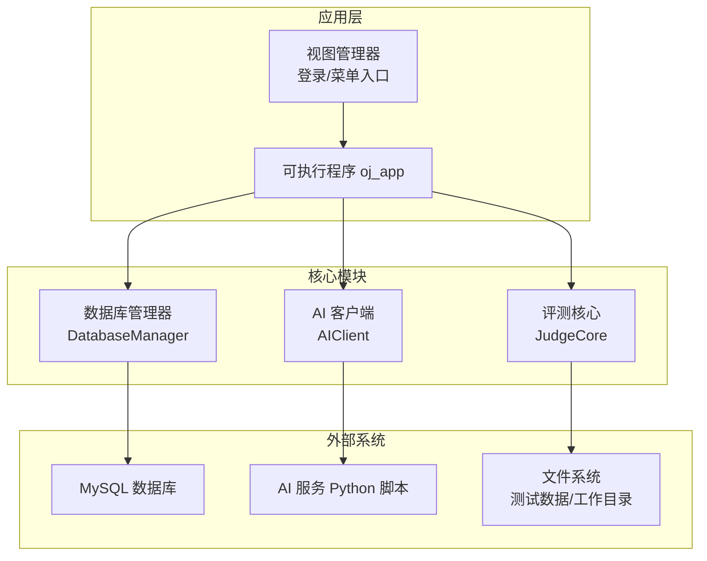
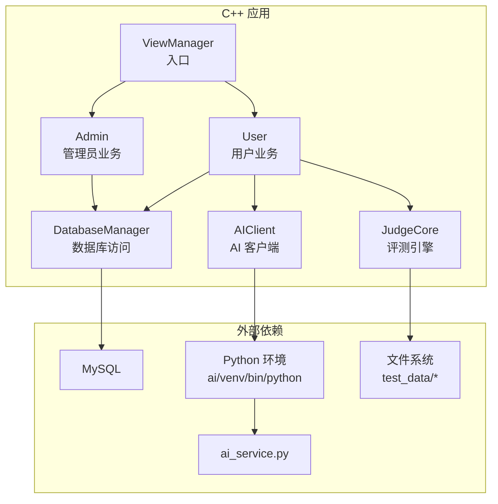
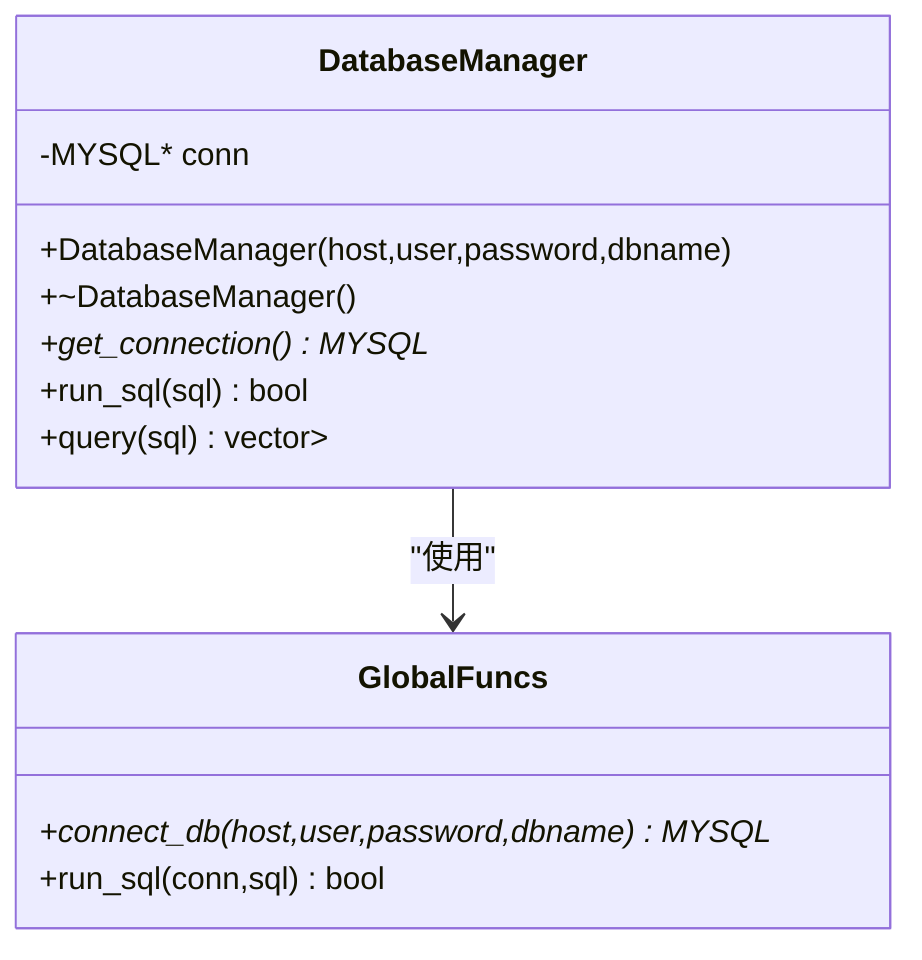
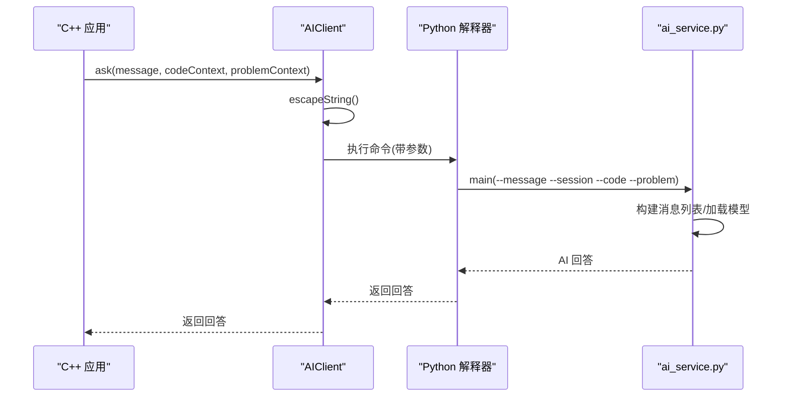
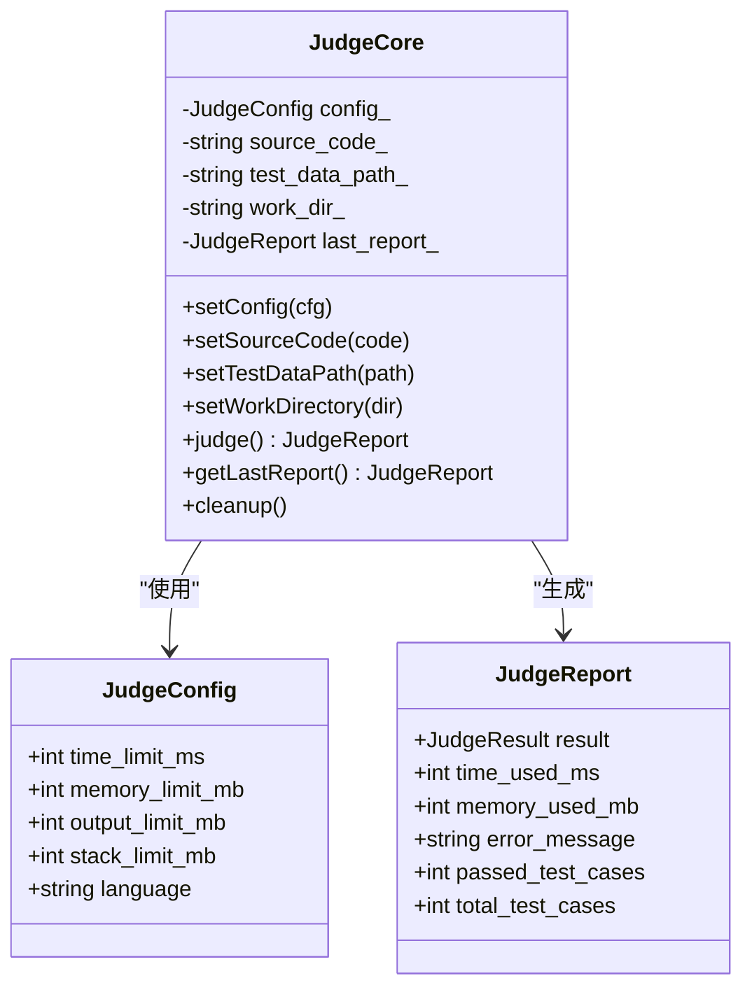
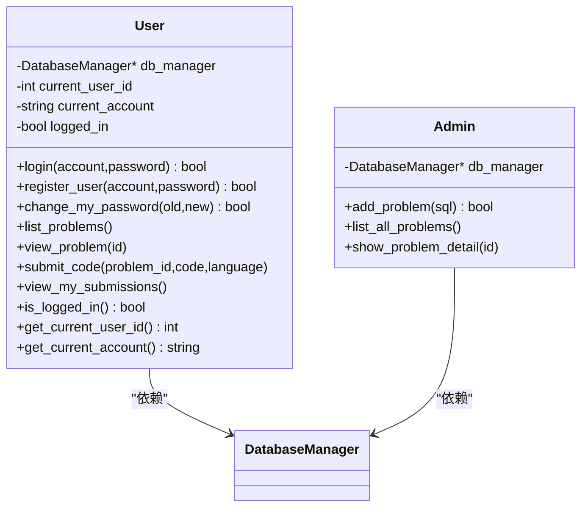
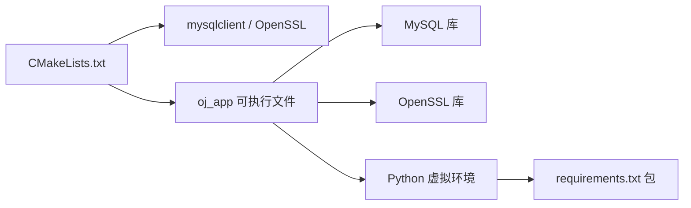
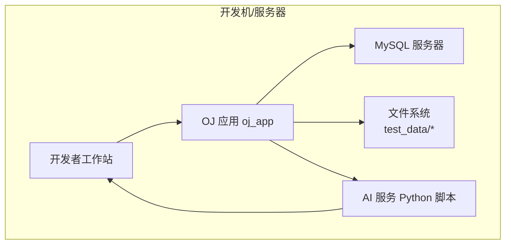
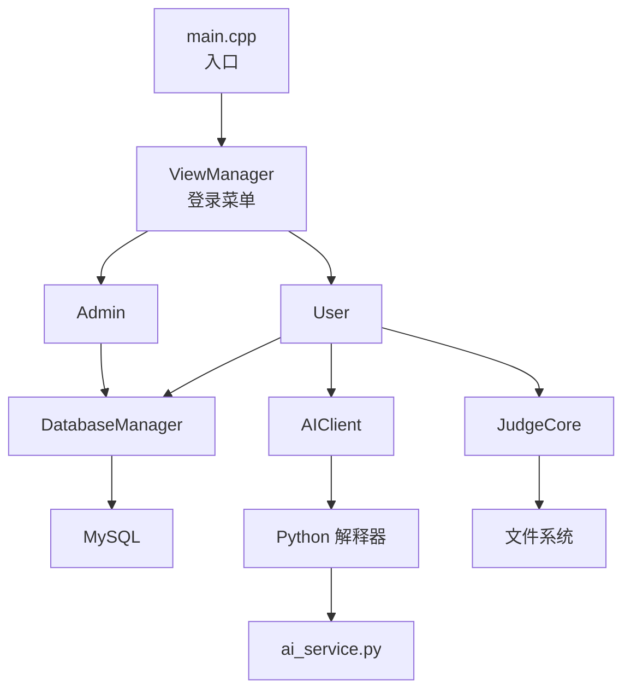

# 系统边界与集成点

<cite>
**本文档引用的文件**
- [CMakeLists.txt](file://CMakeLists.txt)
- [README.md](file://README.md)
- [init.sql](file://init.sql)
- [setup.sh](file://setup.sh)
- [ai_service.py](file://ai/ai_service.py)
- [requirements.txt](file://ai/requirements.txt)
- [db_manager.h](file://include/db_manager.h)
- [db_manager.cpp](file://src/db_manager.cpp)
- [ai_client.h](file://include/ai_client.h)
- [ai_client.cpp](file://src/ai_client.cpp)
- [judge_core.h](file://include/judge_core.h)
- [admin.h](file://include/admin.h)
- [user.h](file://include/user.h)
- [main.cpp](file://src/main.cpp)
</cite>

## 目录
1. [简介](#简介)
2. [项目结构](#项目结构)
3. [核心组件](#核心组件)
4. [架构总览](#架构总览)
5. [详细组件分析](#详细组件分析)
6. [依赖关系分析](#依赖关系分析)
7. [性能考虑](#性能考虑)
8. [故障排查指南](#故障排查指南)
9. [结论](#结论)
10. [附录](#附录)

## 简介
本文件聚焦于OJ系统的“边界与集成点”，明确界定系统内部边界与外部接口，涵盖数据库接口、AI服务接口、文件系统接口等关键集成点。文档详细描述系统与外部环境的交互方式，包括MySQL数据库的连接管理、Python AI服务的调用机制、以及部署拓扑与集成架构，帮助开发者理解系统的整体布局与集成策略。

## 项目结构
该项目采用C++主程序与Python辅助服务分离的架构，核心可执行程序通过CMake构建，数据库初始化脚本与一键部署脚本提供环境准备能力；AI助手以独立Python服务形式存在，通过命令行参数与C++客户端交互。

图表来源
- [main.cpp:5-13](file://src/main.cpp#L5-L13)
- [db_manager.h:12-46](file://include/db_manager.h#L12-L46)
- [judge_core.h:53-117](file://include/judge_core.h#L53-L117)
- [ai_client.h:6-25](file://include/ai_client.h#L6-L25)

章节来源
- [CMakeLists.txt:1-40](file://CMakeLists.txt#L1-L40)
- [README.md:1-2](file://README.md#L1-L2)
- [setup.sh:1-41](file://setup.sh#L1-L41)

## 核心组件
- 数据库管理器（DatabaseManager）：封装MySQL连接、SQL执行与查询结果解析，提供面向对象的数据库访问接口。
- 评测核心（JudgeCore）：定义评测配置、执行流程与结果报告，负责编译、运行、资源限制与测试用例比对。
- AI 客户端（AIClient）：封装Python AI服务的调用，支持会话记忆、参数转义与错误处理。
- 视图管理器（ViewManager）：作为应用入口，启动登录菜单并在角色选择后建立数据库连接。

章节来源
- [db_manager.h:12-53](file://include/db_manager.h#L12-L53)
- [db_manager.cpp:8-100](file://src/db_manager.cpp#L8-L100)
- [judge_core.h:53-120](file://include/judge_core.h#L53-L120)
- [ai_client.h:6-28](file://include/ai_client.h#L6-L28)
- [ai_client.cpp:8-124](file://src/ai_client.cpp#L8-L124)
- [main.cpp:5-13](file://src/main.cpp#L5-L13)

## 架构总览
系统采用“C++主程序 + Python辅助服务”的混合架构。C++负责UI、业务流程与评测调度，Python负责AI问答与提示词工程。数据库通过MySQL提供持久化，文件系统承载测试数据与评测工作目录。

图表来源
- [main.cpp:5-13](file://src/main.cpp#L5-L13)
- [user.h:10-89](file://include/user.h#L10-L89)
- [admin.h:10-40](file://include/admin.h#L10-L40)
- [db_manager.h:12-46](file://include/db_manager.h#L12-L46)
- [judge_core.h:53-117](file://include/judge_core.h#L53-L117)
- [ai_client.h:6-25](file://include/ai_client.h#L6-L25)
- [ai_service.py:93-113](file://ai/ai_service.py#L93-L113)

## 详细组件分析

### 数据库接口（MySQL）
- 连接管理：构造函数完成初始化与连接，析构时关闭连接；提供全局连接函数与SQL执行函数。
- 查询与结果：查询返回字段名到值的映射列表，便于上层按列名访问。
- 权限与隔离：初始化脚本创建专用数据库与用户，应用通过WHERE条件实现行级隔离。

图表来源
- [db_manager.h:12-53](file://include/db_manager.h#L12-L53)
- [db_manager.cpp:8-100](file://src/db_manager.cpp#L8-L100)

章节来源
- [db_manager.h:12-53](file://include/db_manager.h#L12-L53)
- [db_manager.cpp:8-100](file://src/db_manager.cpp#L8-L100)
- [init.sql:8-95](file://init.sql#L8-L95)

### AI服务接口（Python）
- 调用机制：C++通过命令行参数拼接调用Python脚本，传递消息、会话ID、代码上下文与题目上下文。
- 参数转义：对特殊字符进行转义，避免命令行解析错误。
- 会话记忆：Python侧维护会话历史，限制记忆长度，实现连贯对话。
- 错误处理：捕获异常并输出到标准错误，返回可识别的错误信息。

图表来源
- [ai_client.cpp:85-112](file://src/ai_client.cpp#L85-L112)
- [ai_service.py:93-113](file://ai/ai_service.py#L93-L113)
- [ai_service.py:40-91](file://ai/ai_service.py#L40-L91)

章节来源
- [ai_client.h:6-28](file://include/ai_client.h#L6-L28)
- [ai_client.cpp:8-124](file://src/ai_client.cpp#L8-L124)
- [ai_service.py:1-113](file://ai/ai_service.py#L1-L113)
- [requirements.txt:1-7](file://ai/requirements.txt#L1-L7)

### 评测引擎（JudgeCore）
- 配置与状态：支持时间、内存、输出、栈空间限制，以及语言设定。
- 生命周期：设置源码、测试数据路径、工作目录后执行评测，生成评测报告。
- 资源与安全：通过限制与沙箱式运行保障评测稳定性（具体实现细节以实际评测器为准）。

图表来源
- [judge_core.h:26-117](file://include/judge_core.h#L26-L117)

章节来源
- [judge_core.h:1-120](file://include/judge_core.h#L1-L120)

### 用户与管理员业务边界
- 用户（User）：登录、注册、改密、查看题目、提交代码、查看提交记录。
- 管理员（Admin）：发布题目、查看题目列表与详情。
- 数据访问：两者均通过DatabaseManager访问数据库，应用层通过WHERE条件实现行级隔离。

图表来源
- [user.h:10-89](file://include/user.h#L10-L89)
- [admin.h:10-40](file://include/admin.h#L10-L40)

章节来源
- [user.h:10-89](file://include/user.h#L10-L89)
- [admin.h:10-40](file://include/admin.h#L10-L40)

### 文件系统接口
- 测试数据：题目表包含测试数据路径字段，评测时从指定路径读取输入输出样例。
- 工作目录：评测核心设置工作目录用于存放编译产物与临时文件。
- 本地AI：Python脚本与虚拟环境位于ai/目录，C++客户端根据运行时位置自动定位。

章节来源
- [init.sql:14-24](file://init.sql#L14-L24)
- [judge_core.h:82-88](file://include/judge_core.h#L82-L88)
- [ai_client.cpp:8-25](file://src/ai_client.cpp#L8-L25)

## 依赖关系分析
- 构建与链接：CMake查找mysqlclient与OpenSSL，包含头文件并链接库，生成oj_app。
- 运行时依赖：应用依赖MySQL库与OpenSSL；AI功能依赖Python虚拟环境与相关Python包。
- 部署脚本：一键脚本创建目录、初始化数据库、提示编译步骤。

图表来源
- [CMakeLists.txt:11-34](file://CMakeLists.txt#L11-L34)
- [requirements.txt:1-7](file://ai/requirements.txt#L1-7)

章节来源
- [CMakeLists.txt:1-40](file://CMakeLists.txt#L1-L40)
- [setup.sh:8-41](file://setup.sh#L8-L41)

## 性能考虑
- 数据库连接：建议在应用层复用连接或引入连接池，减少频繁初始化/销毁开销。
- 查询结果：批量查询时注意内存占用，避免一次性加载过大结果集。
- AI调用：命令行调用存在进程启动开销，可在高频场景下考虑长驻进程或HTTP接口。
- 评测资源：合理设置时间/内存限制，避免超大输出导致I/O瓶颈。

## 故障排查指南
- 数据库连接失败：检查主机、用户名、密码与数据库名；确认MySQL服务状态与权限配置。
- AI调用错误：确认Python虚拟环境路径与脚本存在；检查DEEPSEEK_API_KEY环境变量；查看stderr输出。
- 编译/链接问题：确认CMake能找到mysqlclient与OpenSSL；检查依赖安装与头文件路径。
- 评测异常：检查测试数据路径与权限；确认工作目录可写；核对评测配置（时间/内存/输出限制）。

章节来源
- [db_manager.cpp:61-79](file://src/db_manager.cpp#L61-L79)
- [ai_client.cpp:114-124](file://src/ai_client.cpp#L114-L124)
- [ai_service.py:42-44](file://ai/ai_service.py#L42-L44)
- [CMakeLists.txt:11-34](file://CMakeLists.txt#L11-L34)

## 结论
本系统通过清晰的模块边界与标准化的外部接口实现了稳定的功能划分：C++负责业务与评测调度，Python负责AI问答，MySQL提供数据持久化，文件系统承载评测与AI资源。通过CMake与一键部署脚本简化了构建与环境准备，为后续扩展（如多评测引擎、主题定制等）提供了良好基础。

## 附录

### 部署拓扑图

图表来源
- [setup.sh:14-29](file://setup.sh#L14-L29)
- [ai_service.py:15-16](file://ai/ai_service.py#L15-L16)

### 集成架构图（代码级）

图表来源
- [main.cpp:5-13](file://src/main.cpp#L5-L13)
- [user.h:10-89](file://include/user.h#L10-L89)
- [admin.h:10-40](file://include/admin.h#L10-L40)
- [db_manager.h:12-46](file://include/db_manager.h#L12-L46)
- [judge_core.h:53-117](file://include/judge_core.h#L53-L117)
- [ai_client.h:6-25](file://include/ai_client.h#L6-L25)
- [ai_service.py:93-113](file://ai/ai_service.py#L93-L113)